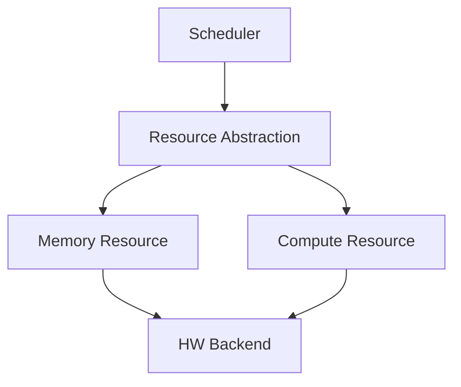
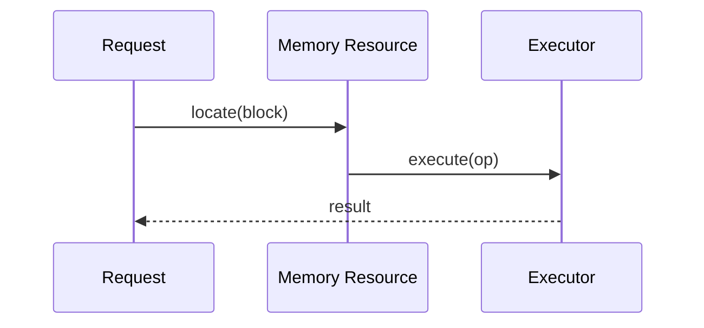
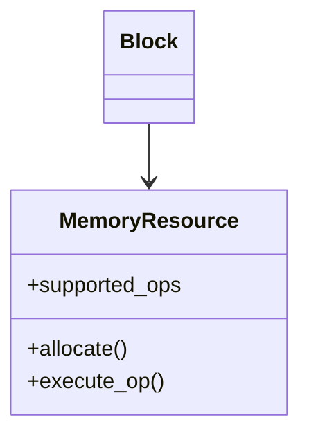

# Phase 4 — 대표 구조도와 백데이터 다이어그램

다이어그램은 장식이 아니라 **Phase 5 정량 근거의 생산 도구**다.
시퀀스에서 hop 수를, 클래스에서 수정 지점 수를, 컴포넌트에서 조합 수를 뽑아 별점 근거로 쓴다.

## 1. 대표 구조도 (PPT용, 필수)

### 규칙
- **UML을 따르지 않는다.** PPT 도형(사각형 + 화살표) 수준으로 그린다.
- **도형 7개 이하** (PPT 표 안 축약본은 5개 이하).
- **도메인을 모르는 사람이 이해**할 수 있어야 한다. 약어는 1개까지만, 나머지는 일반 명사로.
- 두 후보를 **같은 시각 문법**으로 그린다: 같은 추상화 수준, 같은 진행 방향(위→아래 또는 좌→우 통일), 같은 시작 요소.
  시작 요소가 다르면 독자는 구조 차이가 아니라 그림 차이를 본다.
- 이 구조도가 답해야 하는 질문은 단 하나: **"누가 무엇을 결정하는가."**

### 형태
`text` 코드블록의 ASCII가 기본이다(문서·PPT 양쪽에 그대로 붙는다).

```text
Request
  ↓
Memory Resource ── (연산 능력 보유)
  ↓
Execute
```

```text
Request
  ↓
Memory Resource
  ↓
Binding Table  ──►  Compute A / Compute B
  ↓
Planner (선택)
  ↓
Execute
```

두 그림의 차이가 곧 결정 변수의 차이로 읽혀야 한다.

### 안티패턴
- 클래스명·메서드 시그니처를 대표 구조도에 넣기 → 백데이터로 옮긴다.
- 한쪽만 상세하게 그리기 → 상세한 쪽이 복잡해 "보인다"는 착시가 생긴다.
- 화살표에 라벨이 없어 관계 종류(소유/호출/참조)가 불명확 → 최소 라벨을 붙인다.

## 2. 백데이터 다이어그램 4종 (후보별로 각각)

각 다이어그램에는 **3~5줄 설명**이 붙는다. 설명은 "무엇이 보이는가"가 아니라 **"이 그림이 어떤 QA에 어떤 근거를 주는가"** 로 끝난다.

### 2.1 모듈 뷰 (Module view)
- 답할 질문: 코드가 어느 모듈에 사는가, 의존 방향은 어디로 향하는가.
- 확인 포인트: 순환 의존, 레이어 역방향 의존, 신규 타입 추가 시 열어야 하는 모듈.
- 근거 생산: **Maintainability / Extensibility** (영향 모듈 수).



### 2.2 컴포넌트 & 커넥터 다이어그램
- 답할 질문: 런타임에 어떤 인스턴스가 몇 개 존재하고 어떤 경로로 통신하는가.
- 확인 포인트: 1:1 / 1:N / N:M 관계, 중앙 집중점(병목·SPOF), 상태 보유 위치.
- 근거 생산: **Flexibility / Resource Utilization** (표현 가능한 조합 수, 선택 후보 수).

### 2.3 시퀀스 다이어그램
- **두 후보가 반드시 동일 시나리오**를 그린다(예: "요청 1건이 실행까지 도달하는 경로"). 시나리오가 다르면 hop 비교가 무효다.
- 답할 질문: 한 번의 요청이 몇 단계를 거치는가, 어디에서 조회·판단이 일어나는가.
- 근거 생산: **Runtime Efficiency / Predictability** (메시지 수, lookup 수, 분기 수).
- 설명에 **"총 N 메시지, 그중 lookup M회"** 를 반드시 숫자로 적는다.



### 2.4 클래스 다이어그램
- 답할 질문: 어떤 인터페이스가 있고 누가 누구를 소유·구현하는가.
- 확인 포인트: 신규 타입 1개를 추가할 때 **수정해야 하는 기존 클래스/인터페이스 수**(0이면 OCP 만족), 인터페이스 비대화(메서드 수 증가 추세).
- 근거 생산: **Extensibility / Maintainability** (touch point 수).



## 3. 다이어그램 → 정량 근거 추출표

Phase 5로 넘어가기 전에 이 표를 채운다. 빈칸이 있으면 다이어그램이 부족한 것이다.

| 지표 | 출처 | Candidate 1 | Candidate 2 |
|---|---|---|---|
| dispatch까지 메시지 수 | 시퀀스 | | |
| lookup / filtering 횟수 | 시퀀스 | | |
| 런타임 분기 수 | 시퀀스 | | |
| 표현 가능한 관계 | 컴포넌트 | | |
| 선택 가능한 실행 리소스 수 | 컴포넌트 | | |
| 신규 리소스 1종 추가 시 수정 클래스 수 | 클래스 | | |
| 신규 op 1종 추가 시 수정 인터페이스 수 | 클래스 | | |
| 영향 모듈 수 | 모듈 뷰 | | |
| 유지 메타데이터 엔트리 수 | 컴포넌트 | | |
