# DP1. AI Data Placement Implementation UML

> `dp1-implementation-uml.md`의 KV Cache 배치 구현 UML을 기반으로, DP1의 범위를 **AI Runtime Data Placement**로 일반화한 상세 구현 UML이다.
>
> 핵심은 C1/C2를 단순한 Policy 이름 차이가 아니라 **Primary Object / Registry / Runtime State / Planner / Sequence**까지 구조적으로 다르게 정의하는 것이다.

---

# 0. Design Principles

## 0.1 DP1의 결정 대상


| 질문 | DP |
|---|---|
| Data를 어느 Memory Tier에 둘 것인가? | **DP1** |
| Prefill을 어느 Compute Resource에서 수행할 것인가? | **DP2** |
| 어떤 Data를 제거할 것인가? | **DP3** |
| Data를 Tier 간 어떻게 이동할 것인가? | **DP4** |

`Memory Compute Capability`는 DP1에서 **Memory Descriptor의 속성**으로 사용할 수 있지만, Compute Placement 자체는 DP2에서 결정한다.

## 0.2 C1 / C2 정의

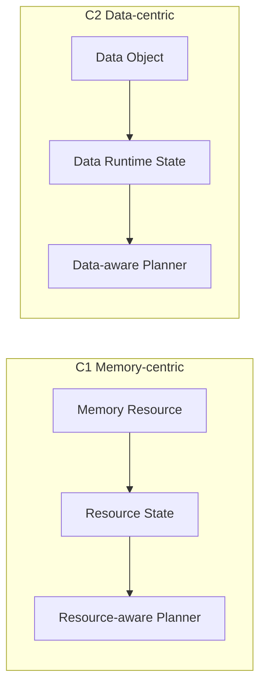

- **C1:** Memory Resource가 1차 decision subject
- **C2:** Data Object가 1차 decision subject
- Candidate Filtering / Cost Evaluation / Executor는 공통

---

# 1. Common Module View

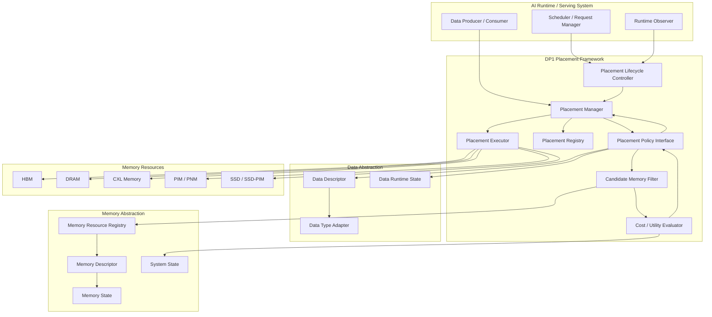

### Common module responsibility

| Module | 책임 |
|---|---|
| `PlacementLifecycleController` | 생성/접근/비활성/pressure 등의 event를 placement trigger로 변환 |
| `PlacementManager` | placement lifecycle의 orchestration |
| `PlacementPolicy` | C1/C2 후보 정책의 공통 interface |
| `CandidateMemoryFilter` | Capacity / Operation / Reachability / QoS / Constraint 검사 |
| `CostUtilityEvaluator` | Access / Capacity / Migration / Operation / Constraint 비용 계산 |
| `PlacementRegistry` | object별 current placement 기록 |
| `PlacementExecutor` | 결정 결과의 실제 allocation / release 실행 |
| `DataTypeAdapter` | Data Type-specific representation을 공통 descriptor로 변환 |
| `MemoryResourceRegistry` | Memory backend 등록/조회 |
| `MemoryDescriptor` | 정적 Memory property |
| `MemoryState` | Runtime Memory property |

---

# 2. Common Class Model

## 2.1 Placement Core

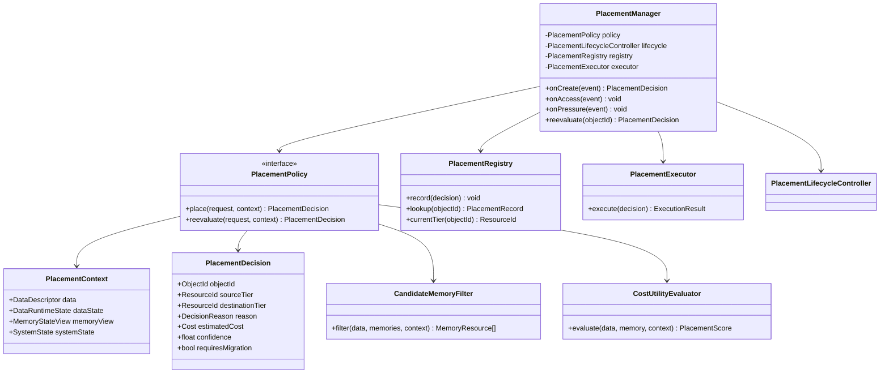

## 2.2 Data Model

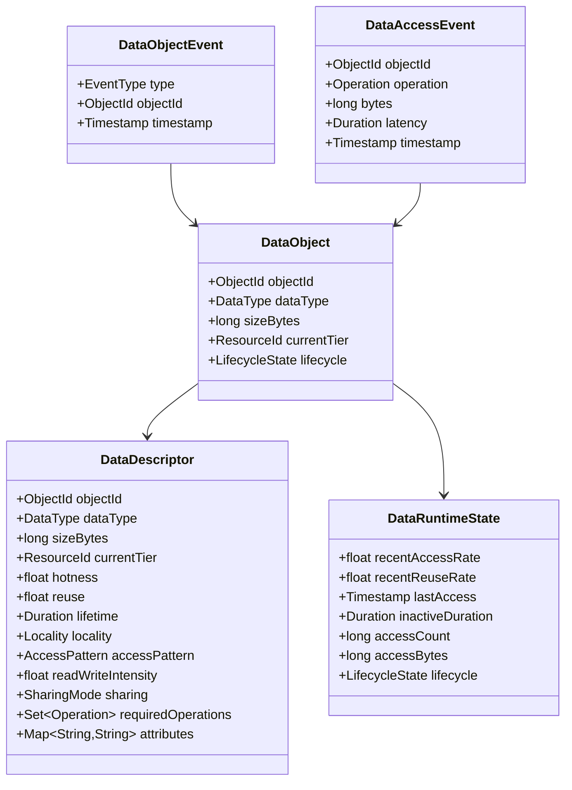

## 2.3 Memory Model

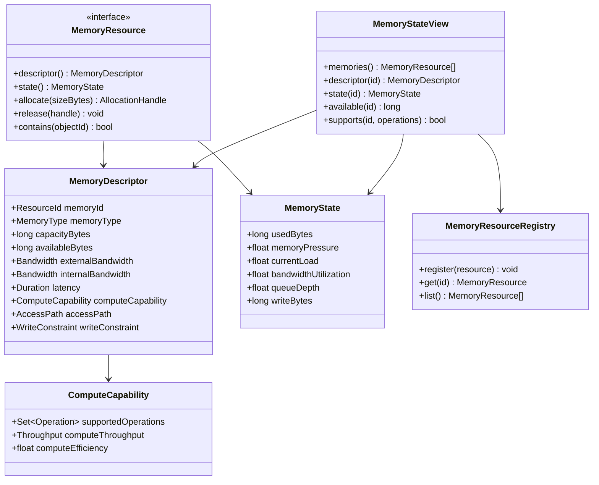

---

# 3. C1 Memory-centric

## 3.1 C1 Module View

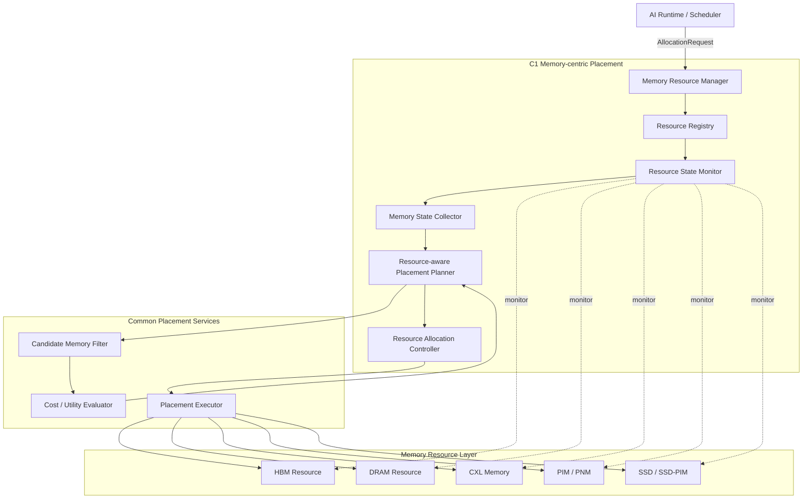

### C1 구조

> **Resource Registry → Resource State → Resource-aware Planner → Allocation Controller → Executor**

Data descriptor는 입력이지만 C1의 primary state는 아니다.

## 3.2 C1 Class Diagram

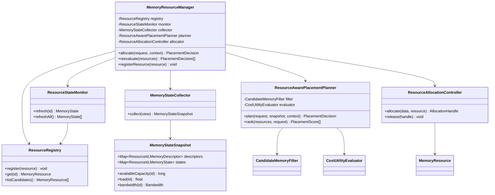

## 3.3 C1 Decision Flow

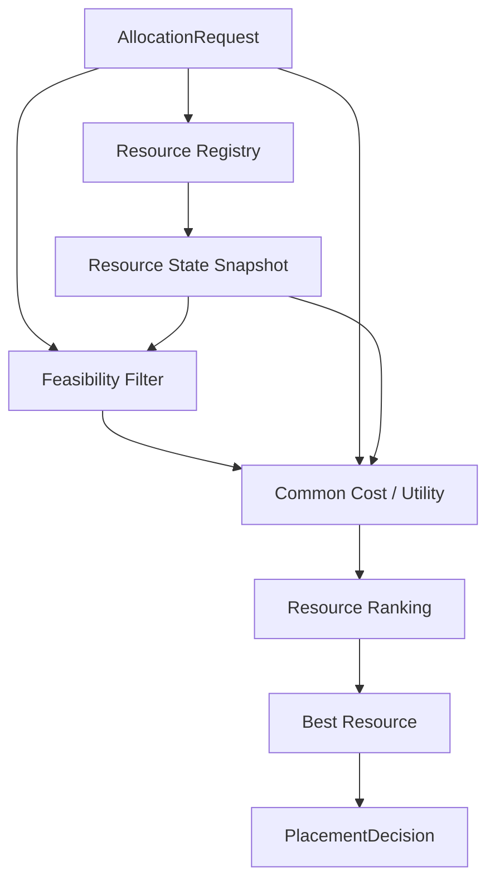

C1의 핵심 질문:

> **“현재 어느 Memory Resource가 이 Data를 가장 적합하게 수용할 수 있는가?”**

## 3.4 C1 Initial Placement Sequence

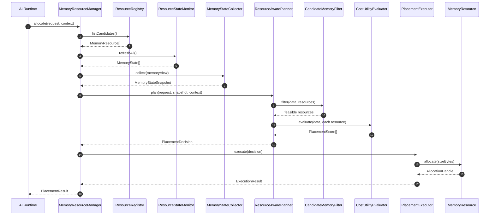

## 3.5 C1 Re-placement Sequence

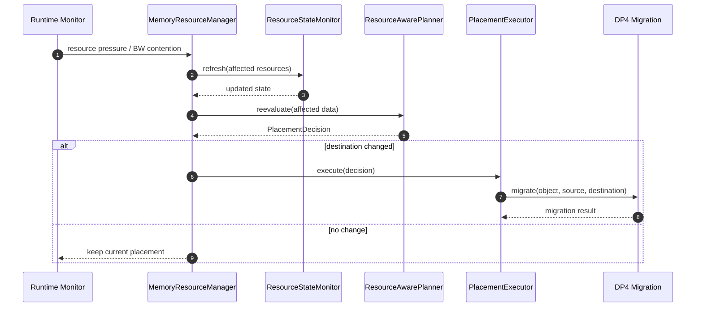

---

# 4. C2 Data-centric

## 4.1 C2 Module View

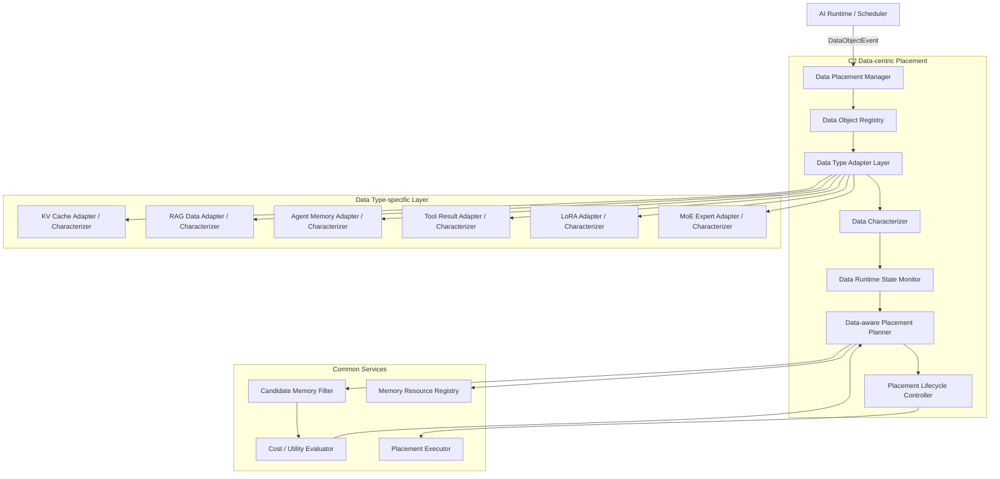

### C2 구조

> **Data Registry → Data Type Adapter → Characterization → Data Runtime State → Data-aware Planner → Executor**

## 4.2 C2 Class Diagram

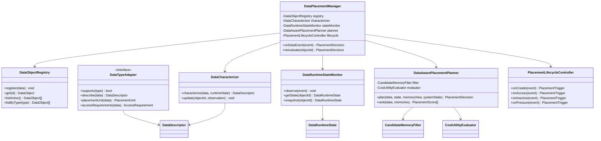

## 4.3 C2 Data-centric Funnel

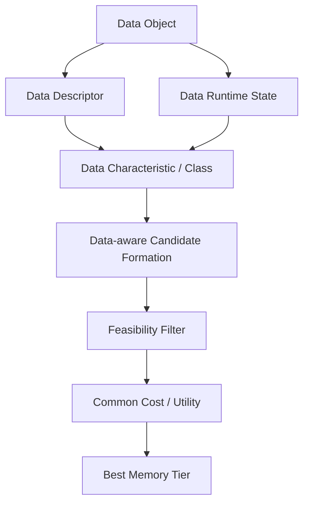

C2의 핵심 질문:

> **“이 Data Object의 Hotness / Reuse / Lifetime / Locality 등을 고려할 때 어느 Memory Tier가 적합한가?”**

## 4.4 C2 Initial Placement Sequence

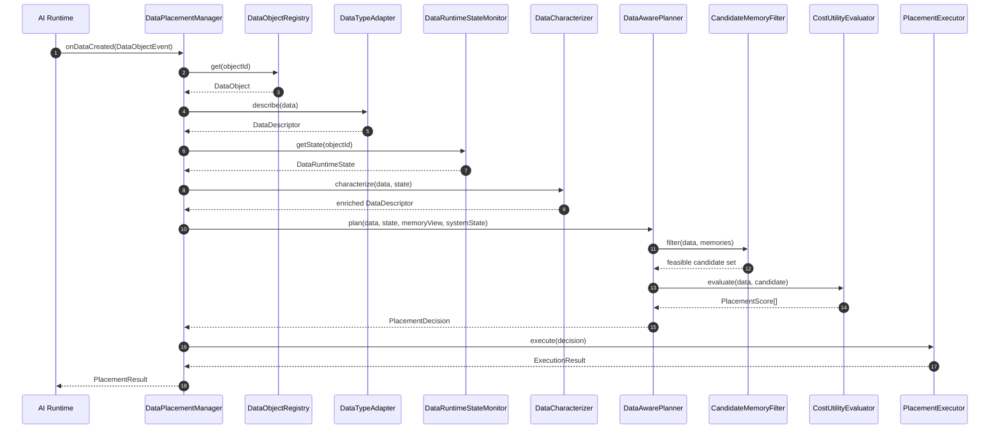

## 4.5 C2 Runtime Re-evaluation Sequence

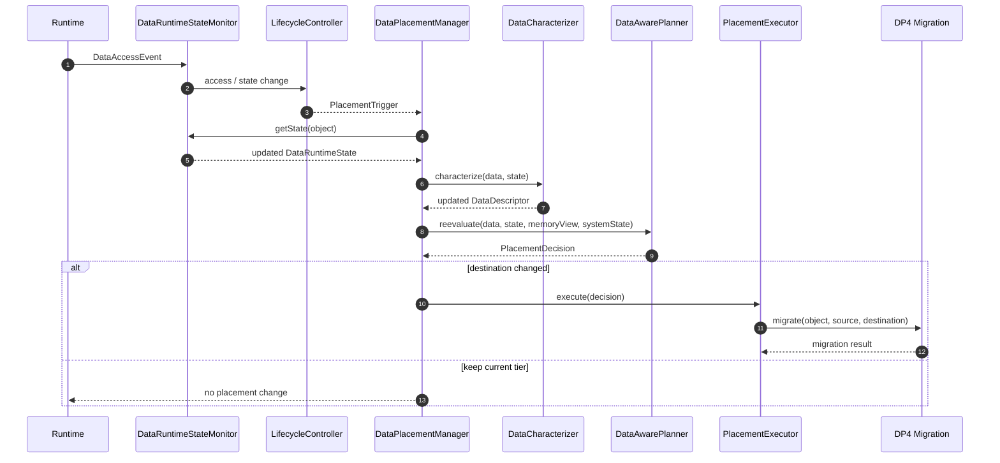

---

# 5. Data Type-specific C2 Extension

## 5.1 Adapter Hierarchy

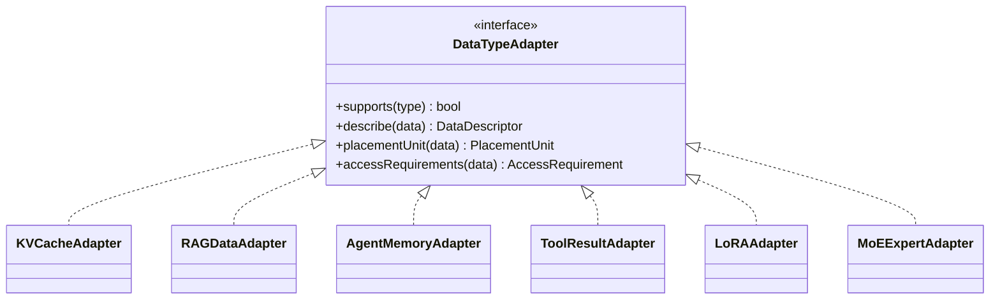

## 5.2 Characterization Hierarchy

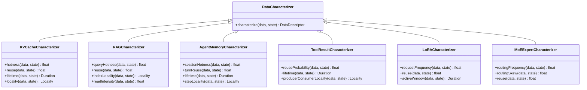

> C2의 범용성을 유지하기 위해 **Data-specific knowledge는 Characterizer까지**, Tier selection은 공통 `DataAwarePlacementPlanner`로 올라간다.

---

# 6. Common Candidate / Cost / Execution UML

## 6.1 Feasibility vs Cost


### Feasibility

- Capacity
- Supported Operation
- Reachability
- Mandatory QoS
- Endurance / Write Constraint

### Cost

\[
Cost(d,m,s)=C_{access}+C_{capacity}+C_{migration}+C_{operation}+C_{constraint}
\]

## 6.2 Executor / DP4 boundary

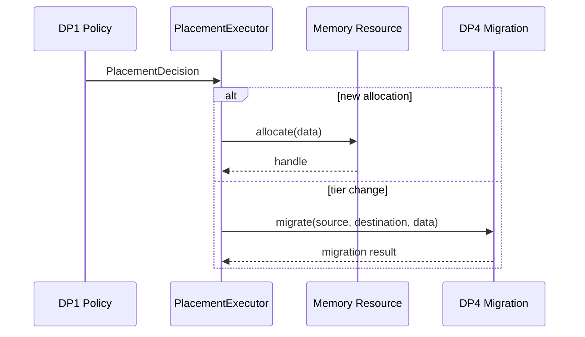

DP1이 migration algorithm을 소유하지 않는 것이 핵심이다.

---

# 7. Lifecycle UML

```mermaid
stateDiagram-v2
    [*] --> Created
    Created --> Placing: create / ingest
    Placing --> Active: placement success
    Active --> Active: access / observe
    Active --> Reevaluate: state change
    Reevaluate --> Active: keep current tier
    Reevaluate --> Migrating: destination changes
    Migrating --> Active: DP4 complete
    Active --> Inactive: timeout / preemption / session end
    Inactive --> Reevaluate: reactivation / reuse
    Inactive --> [*]: release
```

### Trigger source

```mermaid
flowchart LR
    subgraph C1Trigger["C1"]
        RSTATE[Resource State Change]
        PRESS[Memory Pressure / BW Contention]
        RSTATE --> RP[Resource Re-evaluation]
        PRESS --> RP
    end

    subgraph C2Trigger["C2"]
        ACCESS[Data Access]
        HOTNESS[Hotness / Reuse Change]
        LIFETIME[Lifetime / Locality Change]
        ACCESS --> DP[Data Re-evaluation]
        HOTNESS --> DP
        LIFETIME --> DP
    end
```

---

# 8. C1 vs C2 UML Comparison

```mermaid
flowchart LR
    subgraph C1["C1"]
        CR[Resource Registry]
        CS[Resource State]
        CP[Resource-aware Planner]
        CR --> CS --> CP
    end

    subgraph C2["C2"]
        DR[Data Registry]
        DC[Data Characterization]
        DS[Data Runtime State]
        DP[Data-aware Planner]
        DR --> DC --> DS --> DP
    end

    F[Common Feasibility]
    S[Common Cost / Utility]
    X[Common Executor]

    CP --> F
    DP --> F
    F --> S --> X
```

| 항목 | C1 | C2 |
|---|---|---|
| Primary Decision Subject | Memory Resource | Data Object |
| Primary Registry | Resource Registry | Data Object Registry |
| Primary Runtime State | Memory State | Data Runtime State |
| Candidate Formation | Resource State / Feasibility | Data Characteristic |
| Planner | Resource-aware | Data-aware |
| Data-specific Characterization | 최소 / 보조 | 핵심 |
| Extension Axis | New Memory Type | New Data Type |
| Common Cost Model | O | O |
| Common Executor | O | O |

---

# 9. UML → Architecture Mapping

최종 DP1 Architecture 그림은 다음 UML 객체를 블록으로 승격한다.

```mermaid
flowchart TB
    INPUT[Data Descriptor + Memory Descriptor + Runtime State]
    POLICY[Placement Policy]
    FILTER[Candidate Memory Filtering]
    COST[Cost / Utility Evaluation]
    DEC[Placement Decision]
    EXEC[Placement Executor]

    subgraph C1A["C1 Memory-centric"]
        RREG[Resource Registry]
        RM[Resource State Monitor]
        RP[Resource-aware Planner]
        RREG --> RM --> RP
    end

    subgraph C2A["C2 Data-centric"]
        DREG[Data Object Registry]
        DC[Data Characterizer]
        DM[Data Runtime State]
        DP[Data-aware Planner]
        DREG --> DC --> DM --> DP
    end

    INPUT --> POLICY
    POLICY --> FILTER --> COST --> DEC --> EXEC
    RP --> FILTER
    DP --> FILTER
```

### Architecture 재작성 시 보존해야 하는 것

1. **C1과 C2의 primary state owner 차이**
2. **C1은 Resource 중심의 flat decision 구조**
3. **C2는 Data characterization을 먼저 수행하는 funnel 구조**
4. Candidate Filter / Cost Model / Executor의 공통화
5. Memory Compute Capability는 Memory Descriptor에 포함하되 DP2 Compute Placement와 분리
6. 실제 movement는 DP4로 위임

---

# 10. Implementation Checklist

- [ ] `DataDescriptor`는 모든 Data Type에서 공통으로 제공한다.
- [ ] `DataTypeAdapter`가 physical representation 차이를 격리한다.
- [ ] `DataCharacterizer`가 Data-specific runtime characteristic을 생성한다.
- [ ] C1은 Resource Registry / Resource State를 primary state로 사용한다.
- [ ] C2는 Data Registry / Data Runtime State를 primary state로 사용한다.
- [ ] Candidate Filter와 Cost Evaluator를 분리한다.
- [ ] C1/C2가 동일 Cost / Utility evaluator를 공유한다.
- [ ] Memory Compute Capability를 Memory Descriptor에서 표현한다.
- [ ] Compute placement는 DP2에 두지 DP1로 가져오지 않는다.
- [ ] 실제 Migration algorithm은 DP4에 둔다.
- [ ] 신규 Memory Type 추가 시 Policy에 Memory 이름을 하드코딩하지 않는다.
- [ ] 신규 Data Type 추가 시 Common Planner interface를 변경하지 않는다.
