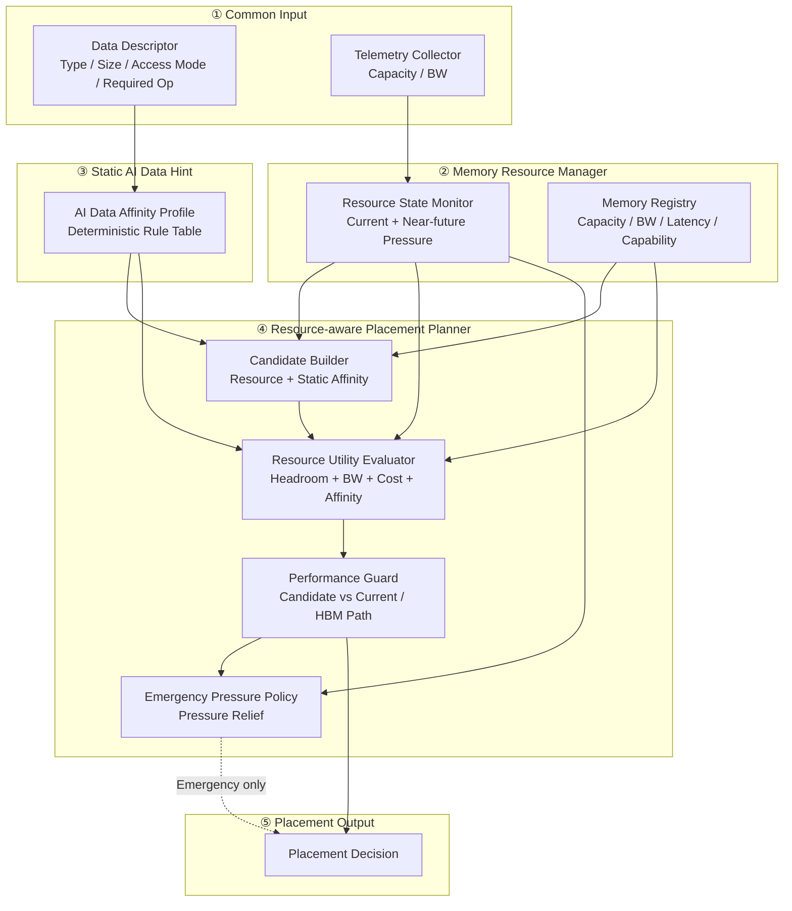

# DP1 C1 Refinement Proposal — Resource-centric + Data-Memory Affinity

> 목적: C1을 단순한 "빈 Memory Tier 선택기"로 두지 않고, **대표적인 AI Data / Operation의 정적 특성은 가볍게 반영**한다.
>
> 단, C2처럼 object별 Runtime behavior를 추적하거나 Hotness / Reuse / Lifetime을 예측하지 않는다.

---

# 1. 핵심 아이디어

기존 C1:

```text
Resource State
+ Memory Capability
→ Resource-centric Placement
```

제안 C1:

```text
Resource State
+ Memory Capability
+ Data-Memory Affinity
→ Resource-centric Placement
```

여기서 `Data-Memory Affinity`는 classifier나 runtime predictor가 아니다.

Data Descriptor가 이미 제공하는 deterministic 정보만 사용한다.

예:

- data_type
- size
- mutable / sealed
- read-mostly / append-heavy
- required_operation
- current/resident tier

이를 미리 정의된 Rule Table에 lookup해서 **preferred / avoid / required capability**를 만든다.

---

# 2. C1 Module View — Proposed



핵심은 C1에 **Data analysis pipeline을 추가하는 것이 아니라, static hint lookup 한 단계만 추가**하는 것이다.

---

# 3. Data-Memory Affinity Registry

예시 Rule Table:

| AI Data | Deterministic Static Trait | Static Hint | 이유 |
|---|---|---|---|
| RAG / Vector Index | Large, read-mostly, Vector Similarity = GEMV | **SSD-PIM preferred when resident/capable** | Vector 이동 대신 local GEMV + score return |
| RAG / Vector Index | Large, read-mostly, no local compute | HBF / DRAM preferred over HBM under pressure | Capacity + read BW 활용 |
| KV Cache — active/appendable | Write-growing, decode-critical | HBM / Attention-capable memory preferred | Active KV를 NAND에 반복 write하지 않음 |
| KV Cache — sealed/read-mostly prefix | Large, read-mostly | **HBF staging candidate** | SSD보다 높은 read BW, HBM capacity 절감 |
| MoE Expert | Large, immutable/read-mostly weights | **HBM → HBF spill preference** | Expert weight read가 주 workload, HBF의 read-intensive 특성과 적합 |
| LoRA Adapter | Small/medium, read-mostly weights | HBM / HBF / DRAM candidate | Write cost가 거의 없고 reuse 가능 |
| Agent Memory | Long-lived, capacity-oriented | DRAM / CXL / HBF candidate | HBM 고정 점유를 피함 |
| Tool Result | Short/medium lived, mostly read after creation | DRAM / HBF candidate | HBM 우선순위가 낮음 |

이 Rule은 "이 Tier에 반드시 배치"가 아니다.

```text
Static Affinity
        +
Current Resource State
        +
Performance Cost
        ↓
Final Placement
```

즉 SSD-PIM이 RAG에 적합하더라도 현재 path cost가 더 크거나 capacity/BW 상태가 나쁘면 다른 Tier를 선택할 수 있다.

---

# 4. SSD-PIM RAG는 C2 전용 기능이 아니다

이 refinement의 중요한 의미다.

```text
Data Type = RAG_DATA
Required Operation = Vector Similarity
SSD-PIM Capability = GEMV
Vector Index resident on SSD
```

이 네 가지는 모두 **deterministic / static information**이다.

따라서:

```text
RAG_DATA + GEMV
→ SSD-PIM local GEMV
→ similarity score만 return
```

은 C2처럼 Runtime Hotness / Reuse prediction이 없어도 C1에서 충분히 적용할 수 있다.

즉 이 기능을 C2의 고유 장점으로 두면 C1을 지나치게 약하게 만든다.

---

# 5. HBF 활용도 C1에서 Static Rule로 가능

HBF 특성:

- large capacity
- high read bandwidth
- NAND 계열이므로 write cost / endurance 고려 필요

따라서 C1에서도 deterministic data trait만으로 다음 정도는 가능하다.

### Large / sealed KV

```text
Active growing KV
→ HBM / Attention-capable tier

Sealed / read-mostly prefix KV
→ HBF staging candidate
```

주의: 일반 Active KV 전체를 HBF에 고정하는 것은 적절하지 않다.
KV는 decode 동안 지속적으로 append되므로 HBF write cost / endurance와 충돌한다.

### MoE Expert

```text
Large immutable expert weights
→ HBM first
→ Capacity pressure 시 HBF preferred spill
```

Runtime expert popularity를 보지 않으므로 "hot expert는 HBM, cold expert는 HBF"처럼 object별 동적 판단은 못 한다.
그 수준부터 C2의 영역이다.

---

# 6. C1과 C2의 경계가 더 명확해진다

이 refinement 후 비교는 다음이 된다.

| | C1 — Resource-centric + Data-Memory Affinity | C2 — Dynamic Data-centric |
|---|---|---|
| Data Type | Descriptor에서 deterministic 사용 | deterministic 사용 |
| Static AI rule | **사용** | 사용 가능 |
| Resource State | **핵심** | 사용 |
| Runtime access monitoring | 없음 | **있음** |
| Hotness prediction | 없음 | **있음** |
| Reuse / next-reuse | 없음 | **있음** |
| Lifetime / idle tracking | 없음 | **있음** |
| Object별 adaptive placement | 제한적 | **핵심** |
| SSD-PIM RAG GEMV | **가능** | 가능 |
| HBF read-mostly spill | **가능** | 가능 |
| 같은 Data Type 안에서 hot/cold 구분 | 불가 | **가능** |
| Dynamic promotion/demotion | Resource pressure 기반 | **Data behavior + Resource 기반** |
| Complexity / state overhead | **낮음** | 높음 |

이렇게 해야 C2의 진짜 차별점은 단순한 "AI Data Type을 안다"가 아니라:

> **같은 Data Type이라도 Runtime behavior가 다르면 object마다 다른 Placement를 할 수 있다.**

가 된다.

---

# 7. Architecture Comparison 관점의 개선

기존 비교는 다소 쉬웠다.

```text
C1 = Resource만 봄
C2 = Data까지 봄
```

그러면 SSD-PIM RAG처럼 obvious한 deterministic mapping까지 C2가 독점해서 C1이 지나치게 약한 strawman이 된다.

제안 비교는 더 공정하다.

```text
C1
Resource State
+ Static AI Domain Knowledge

vs

C2
Resource State
+ Static AI Domain Knowledge
+ Runtime Data Behavior
+ Dynamic Data/Operation-aware Adaptation
```

따라서 C2가 추가 complexity를 지불할 이유도 더 명확해진다.

C2가 증명해야 하는 것은:

- same-type KV 중 hot/cold separation
- changing reuse pattern
- Agent Memory reactivation
- MoE expert popularity shift
- dynamic stage / promotion timing

처럼 **runtime behavior가 없으면 알 수 없는 case**다.

---

# 8. 추천 명칭

현재 C1의 이름을 유지하되 subtitle만 추가하는 것을 권장한다.

```text
C1. Resource-centric Placement
    + Data-Memory Affinity

C2. Dynamic Data-centric Placement
    + Runtime Behavior Adaptation
```

별도 "C1.5"를 만드는 것보다 두 후보의 철학을 그대로 유지하면서 C1을 현실적인 baseline으로 강화하는 편이 비교 구조가 더 깔끔하다.
