# DP1. AI Data Placement UML Design — Rendered

> **문서 유형:** UML / Implementation Design
>
> 본 문서는 `dp1-data-placement-design.md`의 C1/C2 구조를 UML 관점에서 표현한다.
>
> - **C1:** Resource State 기반 Memory-centric Placement
> - **C2:** Data Characteristic 기반 Data-centric Placement

---

# 1. Design Principle

C1과 C2의 차이는 Monitor 이름만 다른 것이 아니라 **무엇을 관찰하고 무엇을 예측하여 Placement의 1차 기준으로 삼는가**에 있다.

```text
C1
Telemetry → Resource State Monitor
          → Resource trend / prediction
          → Memory State View
          → Resource-aware Placement

C2
Data Descriptor → Data Classifier
Runtime History → Runtime State Monitor
               → Data Characteristic Interpreter
               → Tier Affinity
Telemetry ─────→ Memory Tier Selector
```

---

# 2. Common External Components

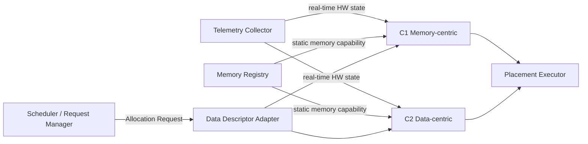

### Common Component Responsibility

| Component | Responsibility |
|---|---|
| Scheduler / Request Manager | Placement 요청 발생 |
| Data Descriptor Adapter | Data-specific 정보를 공통 Descriptor로 변환 |
| Telemetry Collector | Memory/HW의 실시간 상태 수집 |
| Memory Registry | Capacity, BW, latency, operation support 등 정적/준정적 정보 보관 |
| Placement Executor | 결정된 destination tier에 실제 allocation/place 수행 |

---

# 3. C1 — Memory-centric Placement

## 3.1 Module View

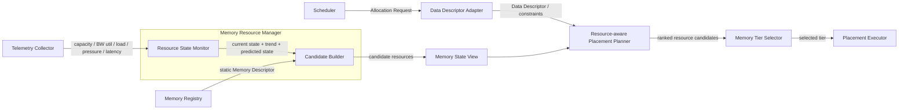

### 핵심 구조

```text
Telemetry Collector
      ↓
Resource State Monitor
      ↓
Current / Trend / Predicted Resource State
      +
Memory Registry
      ↓
Candidate Builder
      ↓
Memory State View
      ↓
Resource-aware Placement Planner
      ↓
Memory Tier Selector
```

## 3.2 C1 Class Diagram

```mermaid
classDiagram
    class MemoryResourceManager {
        +allocate(request: AllocationRequest) PlacementDecision
        +reevaluate(trigger: ResourceEvent) PlacementDecision[]
    }

    class ResourceStateMonitor {
        +observe(sample: TelemetrySample)
        +getCurrentState(resourceId: ResourceId) ResourceState
        +getTrend(resourceId: ResourceId) ResourceTrend
        +predict(resourceId: ResourceId, horizon: Duration) PredictedResourceState
    }

    class CandidateBuilder {
        +build(registry: MemoryRegistry, states: ResourceState[]) MemoryStateView
    }

    class MemoryRegistry {
        +get(resourceId: ResourceId) MemoryDescriptor
        +list() MemoryDescriptor[]
    }

    class MemoryStateView {
        +candidates: MemoryCandidate[]
        +timestamp: Timestamp
        +validUntil: Timestamp
    }

    class MemoryCandidate {
        +resourceId: ResourceId
        +descriptor: MemoryDescriptor
        +currentState: ResourceState
        +predictedState: PredictedResourceState
        +available: bool
    }

    class ResourceAwarePlacementPlanner {
        +plan(request: AllocationRequest, view: MemoryStateView) PlacementPlan
        +rank(view: MemoryStateView, constraints: PlacementConstraint) MemoryCandidate[]
    }

    class MemoryTierSelector {
        +select(plan: PlacementPlan) ResourceId
    }

    class PlacementExecutor {
        +execute(decision: PlacementDecision) ExecutionResult
    }

    class TelemetryCollector {
        +collect() TelemetrySample[]
    }

    class TelemetrySample {
        +resourceId: ResourceId
        +availableCapacity: long
        +bandwidthUtilization: float
        +load: float
        +pressure: float
        +latency: Duration
        +timestamp: Timestamp
    }

    class ResourceState {
        +availableCapacity: long
        +bandwidthUtilization: float
        +load: float
        +pressure: float
        +contention: float
    }

    class ResourceTrend {
        +capacitySlope: float
        +bandwidthSlope: float
        +pressureSlope: float
    }

    class PredictedResourceState {
        +predictedPressure: float
        +predictedBandwidthUtilization: float
        +predictedAvailableCapacity: long
        +confidence: float
    }

    class MemoryDescriptor {
        +memoryId: ResourceId
        +memoryType: MemoryType
        +capacityBytes: long
        +externalBandwidth: Bandwidth
        +internalBandwidth: Bandwidth
        +latency: Duration
        +supportedOperations: Operation[]
        +computeCapability: ComputeCapability
    }

    class AllocationRequest
    class PlacementConstraint
    class PlacementPlan
    class PlacementDecision
    class ExecutionResult

    MemoryResourceManager --> ResourceStateMonitor : owns
    MemoryResourceManager --> CandidateBuilder : owns
    MemoryResourceManager --> ResourceAwarePlacementPlanner : invokes
    MemoryResourceManager --> MemoryTierSelector : invokes

    TelemetryCollector --> ResourceStateMonitor : feeds samples
    ResourceStateMonitor --> ResourceState : produces
    ResourceStateMonitor --> ResourceTrend : derives
    ResourceStateMonitor --> PredictedResourceState : predicts

    CandidateBuilder --> MemoryRegistry : reads static capability
    CandidateBuilder --> ResourceState : reads current state
    CandidateBuilder --> PredictedResourceState : reads prediction
    CandidateBuilder --> MemoryStateView : creates
    MemoryStateView o-- "1..*" MemoryCandidate

    ResourceAwarePlacementPlanner --> MemoryStateView : evaluates
    ResourceAwarePlacementPlanner --> PlacementPlan : creates
    MemoryTierSelector --> PlacementPlan : selects from
    MemoryTierSelector --> PlacementDecision : creates
    PlacementExecutor --> PlacementDecision : executes
```

## 3.3 C1 Sequence — Initial Placement

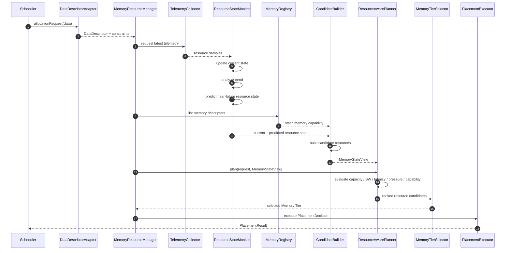

## 3.4 C1 Sequence — Resource State Change / Re-placement

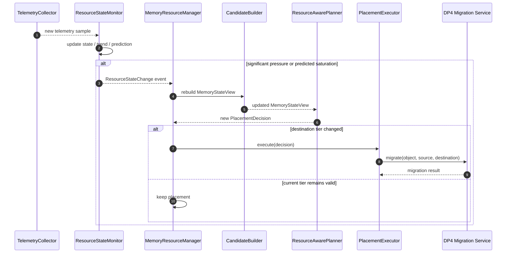

---

# 4. C2 — Data-centric Placement

## 4.1 Module View

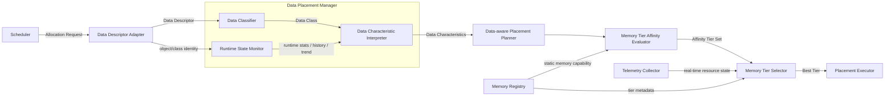

### 핵심 구조

```text
Data Descriptor
      ↓
Data Classifier ───────────────┐
                               │
Runtime State Monitor ─────────┤
                               ▼
                 Data Characteristic Interpreter
                               ↓
                  Predicted Data Characteristics
                               ↓
                   Memory Tier Affinity Evaluator
                               ↓
                        Affinity Tier Set
                               +
                    Real-time Telemetry
                               ↓
                     Memory Tier Selector
                               ↓
                           Best Tier
```

## 4.2 C2 Class Diagram

```mermaid
classDiagram
    class DataPlacementManager {
        +place(request: AllocationRequest) PlacementDecision
        +observe(event: DataRuntimeEvent)
        +reevaluate(objectId: ObjectId) PlacementDecision
    }

    class DataClassifier {
        +classify(descriptor: DataDescriptor) DataClass
    }

    class RuntimeStateMonitor {
        +observe(event: DataRuntimeEvent)
        +getStats(key: DataClassKey) DataRuntimeStats
        +getHistory(key: DataClassKey) DataRuntimeHistory
    }

    class DataCharacteristicInterpreter {
        +interpret(dataClass: DataClass, stats: DataRuntimeStats) DataCharacteristics
        +predict(dataClass: DataClass, stats: DataRuntimeStats) DataCharacteristics
    }

    class DataAwarePlacementPlanner {
        +plan(characteristics: DataCharacteristics) PlacementPlan
    }

    class MemoryTierAffinityEvaluator {
        +evaluate(data: DataCharacteristics, memories: MemoryDescriptor[]) TierAffinity[]
    }

    class MemoryTierSelector {
        +select(affinity: TierAffinity[], telemetry: ResourceTelemetry[]) ResourceId
    }

    class DataDescriptor {
        +objectId: ObjectId
        +typeHint: DataTypeHint
        +sizeBytes: long
        +owner: OwnerId
        +currentTier: ResourceId
        +requiredOperations: Operation[]
    }

    class DataClass {
        <<enumeration>>
        KV_CACHE
        RAG_DATA
        AGENT_MEMORY
        TOOL_RESULT
        LOG_DATA
        LORA_ADAPTER
        MOE_EXPERT
    }

    class DataRuntimeEvent {
        +objectId: ObjectId
        +dataClass: DataClass
        +operation: Operation
        +bytes: long
        +timestamp: Timestamp
    }

    class DataRuntimeStats {
        +accessFrequency: float
        +reuseInterval: Duration
        +readWriteRatio: float
        +lifetimeEstimate: Duration
        +localityScore: float
        +sharingDegree: float
    }

    class DataRuntimeHistory {
        +samples: RuntimeSample[]
        +observationWindow: Duration
    }

    class DataCharacteristics {
        +predictedHotness: float
        +predictedLifetime: Duration
        +predictedReuse: float
        +locality: float
        +accessPattern: AccessPattern
        +readWriteIntensity: float
        +sharing: float
        +requiredOperations: Operation[]
    }

    class TierAffinity {
        +resourceId: ResourceId
        +affinityScore: float
        +eligible: bool
        +reason: String
    }

    class MemoryRegistry {
        +list() MemoryDescriptor[]
    }

    class MemoryDescriptor {
        +memoryId: ResourceId
        +memoryType: MemoryType
        +capacityBytes: long
        +bandwidth: Bandwidth
        +latency: Duration
        +supportedOperations: Operation[]
        +computeCapability: ComputeCapability
    }

    class TelemetryCollector {
        +collect() ResourceTelemetry[]
    }

    class ResourceTelemetry {
        +resourceId: ResourceId
        +availableCapacity: long
        +bandwidthUtilization: float
        +pressure: float
        +contention: float
        +latencyState: Duration
    }

    class PlacementPlan
    class PlacementDecision
    class PlacementExecutor
    class AllocationRequest

    DataPlacementManager --> DataClassifier : invokes
    DataPlacementManager --> RuntimeStateMonitor : reads / updates
    DataPlacementManager --> DataCharacteristicInterpreter : invokes
    DataPlacementManager --> DataAwarePlacementPlanner : invokes

    DataClassifier --> DataDescriptor : consumes
    DataClassifier --> DataClass : produces

    RuntimeStateMonitor --> DataRuntimeEvent : observes
    RuntimeStateMonitor --> DataRuntimeStats : accumulates
    RuntimeStateMonitor --> DataRuntimeHistory : maintains

    DataCharacteristicInterpreter --> DataClass : reads
    DataCharacteristicInterpreter --> DataRuntimeStats : reads
    DataCharacteristicInterpreter --> DataCharacteristics : produces

    DataAwarePlacementPlanner --> MemoryTierAffinityEvaluator : invokes
    MemoryTierAffinityEvaluator --> MemoryRegistry : reads
    MemoryTierAffinityEvaluator --> DataCharacteristics : evaluates
    MemoryTierAffinityEvaluator --> TierAffinity : produces

    MemoryTierSelector --> TierAffinity : selects from
    TelemetryCollector --> MemoryTierSelector : feeds realtime state
    MemoryTierSelector --> PlacementDecision : creates
    PlacementExecutor --> PlacementDecision : executes
```

## 4.3 C2 Sequence — Initial Placement

초기 배치에서는 충분한 Runtime History가 없을 수 있으므로 **Data Class prior/default profile**을 사용한다.

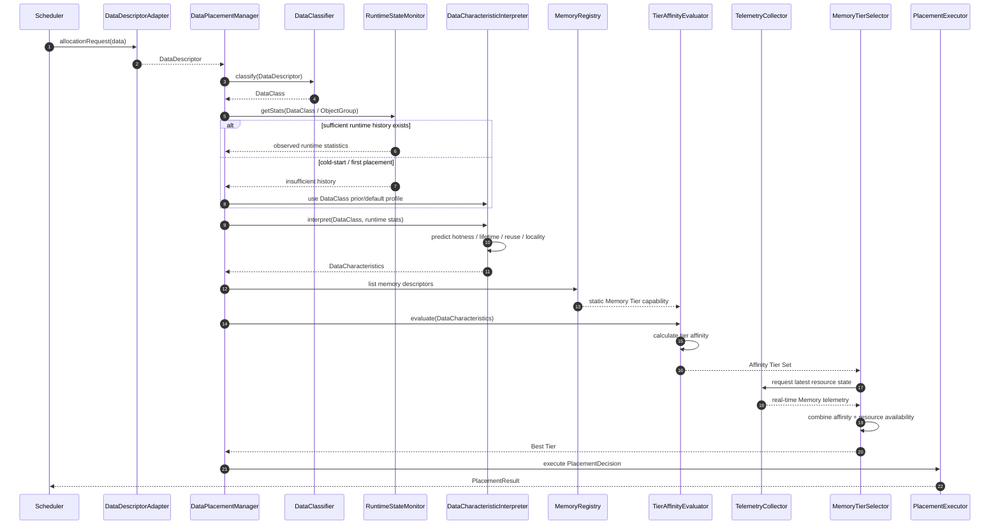

## 4.4 C2 Sequence — Runtime Learning / Re-placement

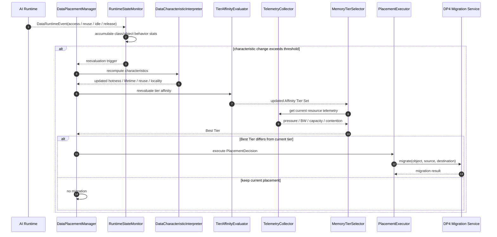

---

# 5. C1 vs C2 Monitor Difference

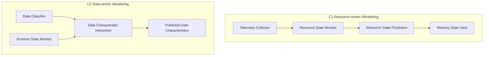

| 항목 | C1 Resource State Monitor | C2 Runtime State Monitor |
|---|---|---|
| 관찰 대상 | Memory/HW Resource | Data Class / Object behavior |
| 원천 정보 | Telemetry Collector | Runtime access/history event |
| 축적 정보 | Capacity, BW, load, pressure, contention | Access frequency, reuse, lifetime, locality, R/W pattern |
| Prediction | Resource가 앞으로 얼마나 바빠질지 | Data가 앞으로 얼마나 hot/long-lived/reused될지 |
| 출력 사용처 | Candidate Builder / Memory State View | Data Characteristic Interpreter |
| Placement에서의 의미 | Resource 자체의 적합성 판단 | Data의 요구 특성 생성 |

---

# 6. C1 vs C2 Final Decision Flow

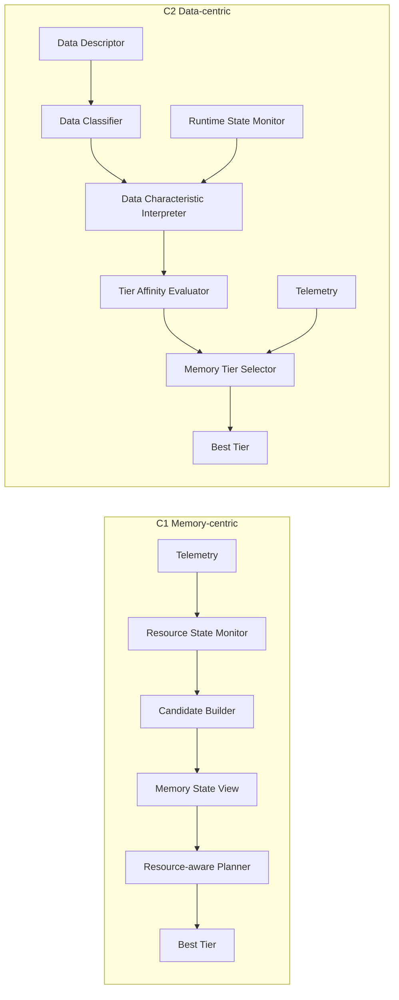

---

# 7. DP Boundary

- **DP1:** Data Placement 결정
- **DP2:** Prefill / Compute Placement
- **DP3:** Data Eviction 결정
- **DP4:** 실제 Data Migration 수행

DP1은 destination Memory Tier를 결정하고, 기존 위치와 destination이 다를 경우 실제 Data 이동은 DP4 Migration Service에 위임한다.
