# DP1. AI Data Placement UML Design — Rendered

> **문서 유형:** UML / Implementation Design
>
> 본 문서는 `dp1-data-placement-design.md`의 C1/C2 Data Placement 구조를 구현 관점에서 정의한 UML 문서이다. GitHub에서 **Mermaid로 실제 도형/선/시퀀스가 렌더링**되도록 작성한다.
>
> 대상:
> - Common Module View
> - C1 Memory-centric Placement: Module / Class / Sequence
> - C2 Data-centric Placement: Module / Class / Sequence

## 1. UML 설계 원칙

C1과 C2는 동일한 DP1 공통 경계를 사용하지만, Placement Manager 내부의 **Primary Object / Registry / Runtime State / Planner** 구조를 다르게 구성한다.

- **C1:** Memory Resource 중심 → Resource Registry / Resource State / Resource Planner
- **C2:** Data Object 중심 → Data Registry / Data Characterizer / Data Planner
- Candidate Filtering / Cost Evaluation / Placement Execution은 공통 서비스로 유지한다.

## 2. Common Module View

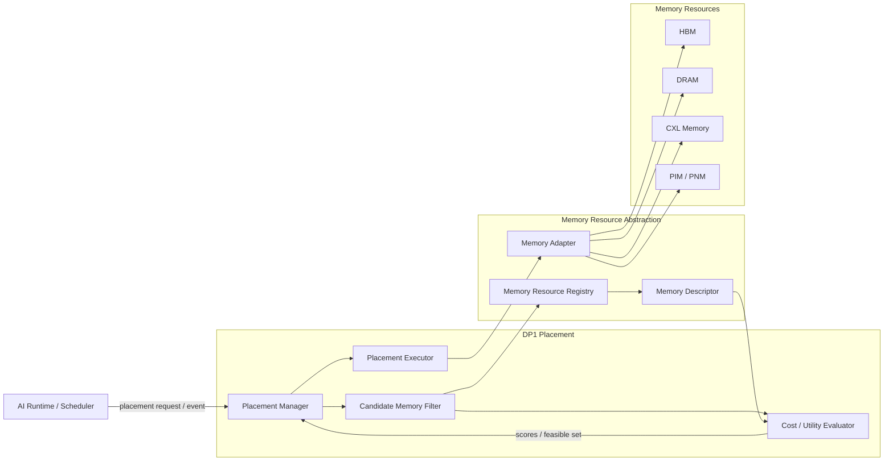

### Common 책임

| Module | 책임 |
|---|---|
| Scheduler / Request Manager | Data 생성/유입, request lifecycle, placement trigger 제공 |
| Placement Manager | Placement decision 진입점 및 lifecycle 관리 |
| Candidate Memory Filter | Capacity, operation, reachability, QoS, constraint 기반 후보 제거 |
| Cost / Utility Evaluator | Access / Capacity / Migration / Operation / Constraint 비용 계산 |
| Placement Executor | 결정된 placement의 실제 allocation / release / placement action 수행 |
| Memory Resource Registry | Memory Resource 등록 및 조회 |
| Memory Descriptor | Capacity/BW/Latency/Compute Capability/Load 등 resource 상태 표현 |
| Memory Adapter | 실제 Memory backend와 공통 runtime interface 연결 |

> Migration 자체의 알고리즘은 DP4의 책임이다. DP1은 `PlacementDecision`을 생성하고 destination을 전달한다.

# 3. C1 Memory-centric Placement

## 3.1 C1 Module View

C1은 **Memory Resource를 primary state owner**로 둔다. 즉, Resource별 상태와 수용 가능량을 중심으로 Data allocation을 결정한다.

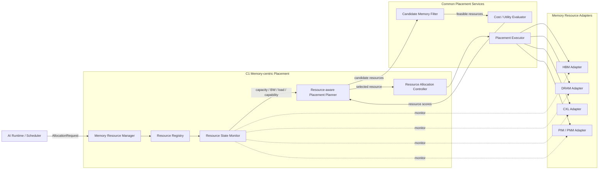

### C1 핵심 구조

**Resource Registry → Resource State Monitor → Resource-aware Planner → Allocation Controller → Placement Executor**

## 3.2 C1 Class Diagram

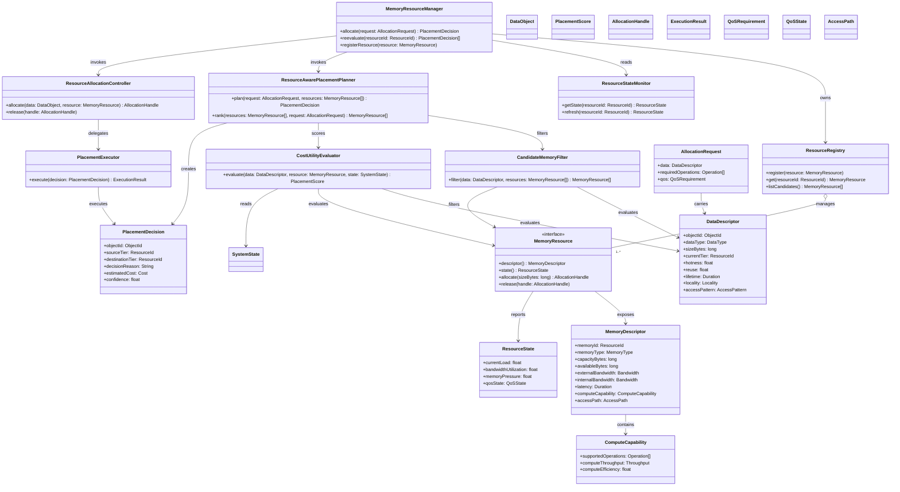

## 3.3 C1 Sequence — Initial Placement

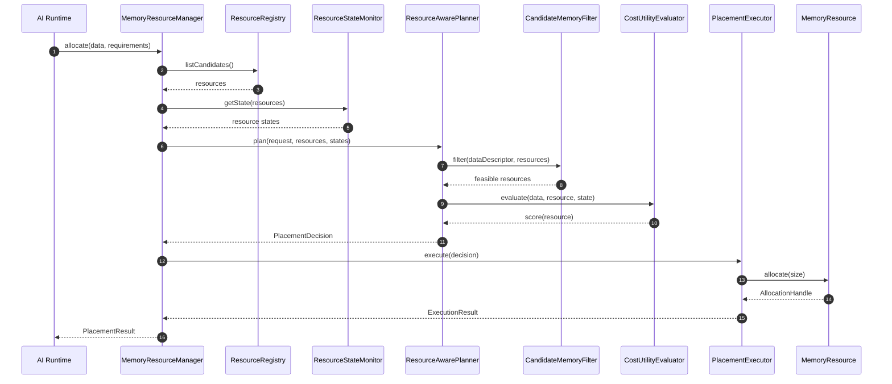

## 3.4 C1 Sequence — Re-placement Trigger

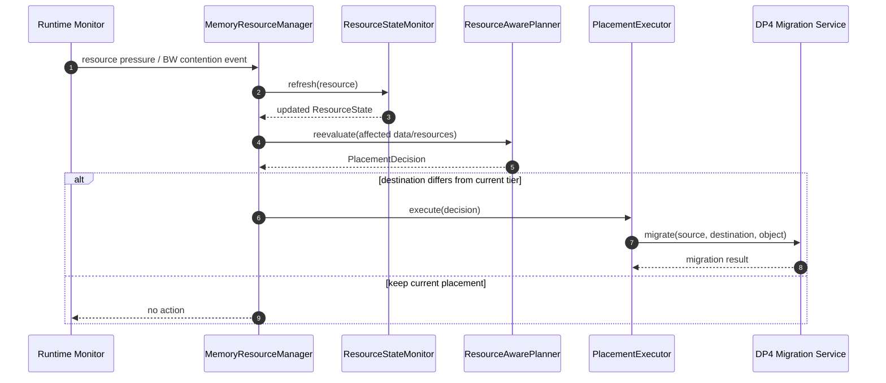

# 4. C2 Data-centric Placement

## 4.1 C2 Module View

C2는 **Data Object를 primary state owner**로 둔다. Data별 lifecycle과 runtime characterization이 Tier 선택을 주도한다.

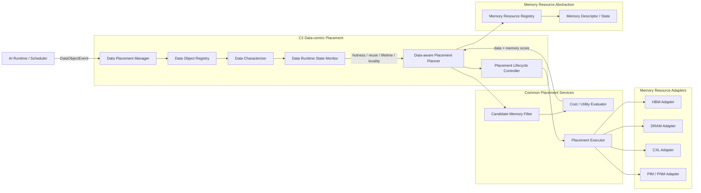

### C2 핵심 구조

**Data Object Registry → Data Characterizer → Data Runtime State → Data-aware Planner → Lifecycle Controller → Placement Executor**

## 4.2 C2 Class Diagram

```mermaid
classDiagram
    class DataPlacementManager {
        +onDataEvent(event: DataObjectEvent) PlacementDecision
        +reevaluate(objectId: ObjectId) PlacementDecision
    }

    class DataObjectRegistry {
        +register(data: DataObject)
        +get(objectId: ObjectId) DataObject
        +listActiveObjects() DataObject[]
    }

    class DataCharacterizer {
        +characterize(data: DataObject) DataDescriptor
        +update(objectId: ObjectId, observation: AccessObservation)
    }

    class DataRuntimeStateMonitor {
        +observe(objectId: ObjectId, access: AccessObservation)
        +getState(objectId: ObjectId) DataRuntimeState
    }

    class DataAwarePlacementPlanner {
        +plan(data: DataDescriptor, memories: MemoryResource[], state: SystemState) PlacementDecision
        +rank(data: DataDescriptor, memories: MemoryResource[]) PlacementScore[]
    }

    class PlacementLifecycleController {
        +handle(decision: PlacementDecision)
        +shouldReevaluate(state: DataRuntimeState) bool
    }

    class CandidateMemoryFilter {
        +filter(data: DataDescriptor, resources: MemoryResource[]) MemoryResource[]
    }

    class CostUtilityEvaluator {
        +evaluate(data: DataDescriptor, resource: MemoryResource, state: SystemState) PlacementScore
    }

    class PlacementExecutor {
        +execute(decision: PlacementDecision) ExecutionResult
    }

    class DataObject {
        +objectId: ObjectId
        +dataType: DataType
        +sizeBytes: long
        +currentTier: ResourceId
        +lifecycle: LifecycleState
    }

    class DataDescriptor {
        +objectId: ObjectId
        +dataType: DataType
        +sizeBytes: long
        +hotness: float
        +locality: Locality
        +lifetime: Duration
        +reuse: float
        +accessPattern: AccessPattern
        +readWriteIntensity: float
        +sharing: SharingMode
        +requiredOperations: Operation[]
    }

    class DataRuntimeState {
        +hotness: float
        +recentAccessRate: float
        +reuseRate: float
        +estimatedLifetime: Duration
        +lastAccess: Timestamp
        +currentTier: ResourceId
    }

    class DataObjectEvent {
        +type: EventType
        +objectId: ObjectId
        +timestamp: Timestamp
    }

    class AccessObservation {
        +timestamp: Timestamp
        +bytes: long
        +operation: Operation
        +latency: Duration
    }

    class MemoryResource {
        <<interface>>
        +descriptor() MemoryDescriptor
        +state() ResourceState
        +allocate(sizeBytes: long) AllocationHandle
        +release(handle: AllocationHandle)
    }

    class MemoryDescriptor {
        +memoryId: ResourceId
        +memoryType: MemoryType
        +capacityBytes: long
        +availableBytes: long
        +externalBandwidth: Bandwidth
        +internalBandwidth: Bandwidth
        +latency: Duration
        +computeCapability: ComputeCapability
        +accessPath: AccessPath
    }

    class SystemState
    class PlacementDecision
    class PlacementScore
    class ExecutionResult

    DataPlacementManager --> DataObjectRegistry : owns
    DataPlacementManager --> DataCharacterizer : invokes
    DataPlacementManager --> DataRuntimeStateMonitor : reads
    DataPlacementManager --> DataAwarePlacementPlanner : invokes
    DataPlacementManager --> PlacementLifecycleController : manages

    DataObjectRegistry o-- "1..*" DataObject : manages
    DataCharacterizer --> DataObject : observes
    DataCharacterizer --> DataDescriptor : produces
    DataRuntimeStateMonitor --> DataRuntimeState : updates
    DataRuntimeState --> DataObject : describes

    DataAwarePlacementPlanner --> CandidateMemoryFilter : filters
    DataAwarePlacementPlanner --> CostUtilityEvaluator : scores
    DataAwarePlacementPlanner --> PlacementDecision : creates
    CostUtilityEvaluator --> DataDescriptor : evaluates
    CostUtilityEvaluator --> MemoryResource : evaluates
    CostUtilityEvaluator --> SystemState : reads

    PlacementLifecycleController --> PlacementDecision : handles
    PlacementLifecycleController --> DataRuntimeState : monitors
    PlacementExecutor --> PlacementDecision : executes

    MemoryResource --> MemoryDescriptor : exposes
```

## 4.3 C2 Sequence — Initial Placement

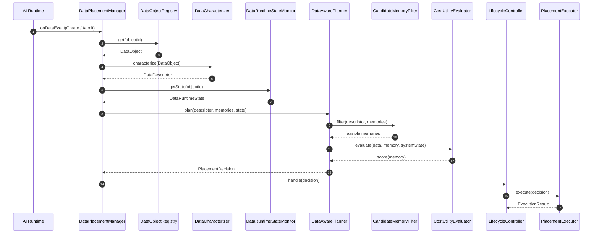

## 4.4 C2 Sequence — Runtime Re-evaluation

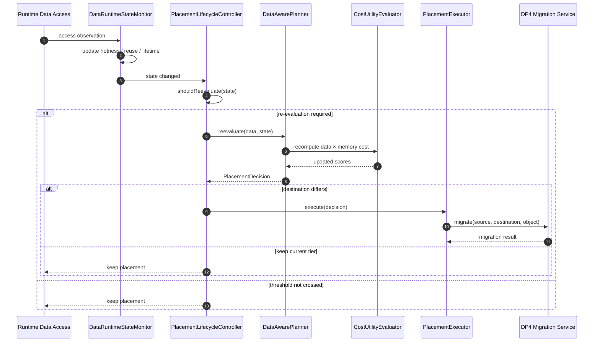

# 5. C1 vs C2 Structural View

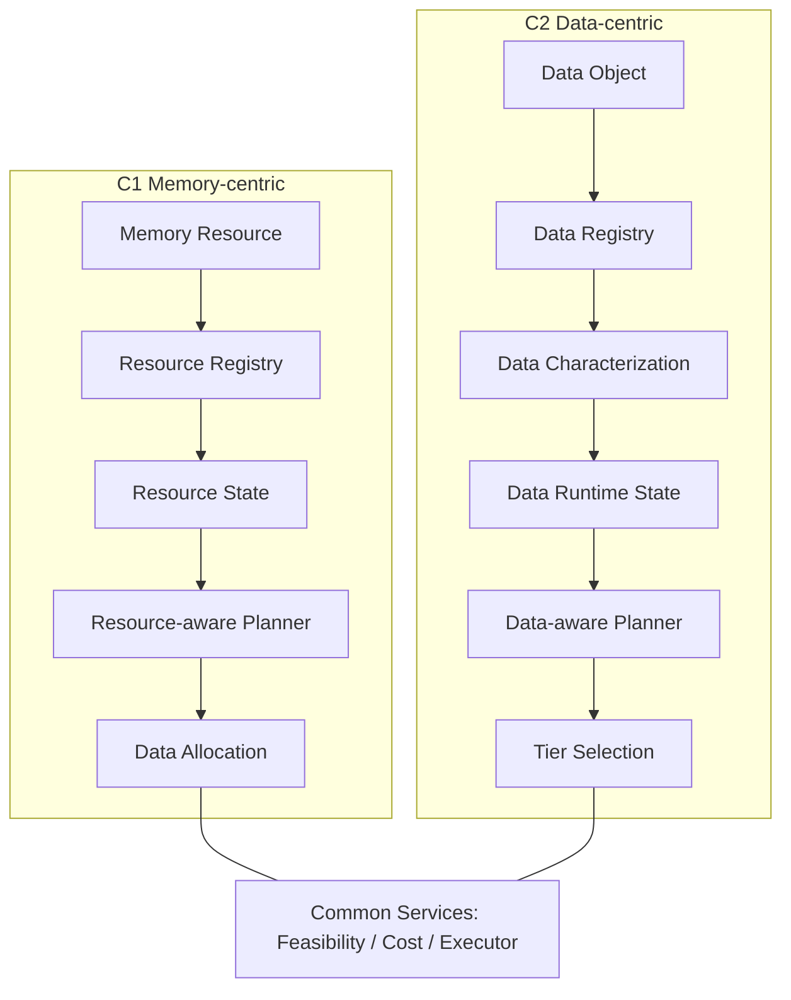

| 항목 | C1 Memory-centric | C2 Data-centric |
|---|---|---|
| Primary Object | Memory Resource | Data Object |
| Primary Registry | Resource Registry | Data Object Registry |
| Runtime State Owner | Resource State | Data Runtime State |
| Characterization | Minimal / support info | Hotness / Reuse / Lifetime / Locality |
| Core Planner | Resource-aware Planner | Data-aware Planner |
| Decision Granularity | Resource 중심 | Data Object 중심 |
| Extension Axis | New Memory Type | New Data Type / Characterizer |

# 6. Data Type Characterization Extension

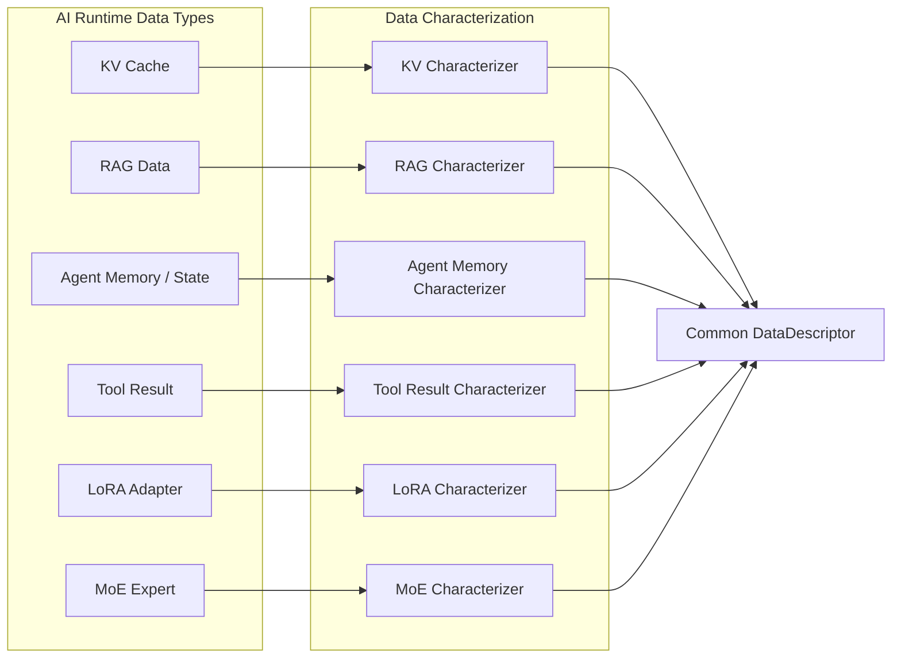

| Logical Data Type | Physical Representation 예 | Placement Unit |
|---|---|---|
| KV Cache | KV Block | Block / Session Block Set |
| RAG Data | Document / Chunk / Embedding / Index Partition | Chunk / Index Partition |
| Agent Memory | Serialized Record / Structured State / KV Record | Memory Entry / Session Group |
| Tool Result | Serialized Result / Object / KV Record | Result Object / Session State |
| LoRA Adapter | Adapter Weight Object | Adapter |
| MoE Expert | Expert Weight Object | Expert |

# 7. Common Placement Interface

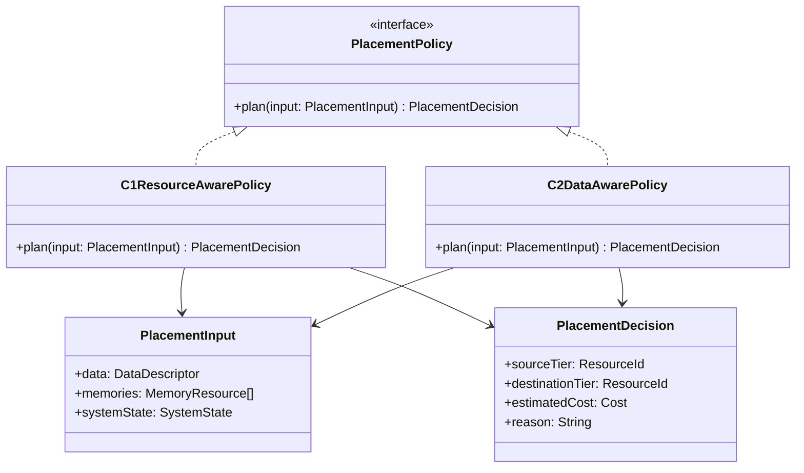

# 8. DP Boundary

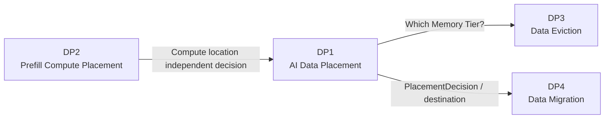

> **Boundary:** DP1 answers **Data → Memory Tier**, DP2 answers **Prefill → Compute Resource**, DP3 answers **What Data should be removed?**, DP4 answers **How should Data be moved?**

# 9. UML → Architecture 재구성 포인트

UML에서 Architecture 문서로 다시 그릴 때는 단순 module list가 아니라 다음 구조가 보이도록 한다.

- C1: `Memory Resource Manager`가 중심에 있고 `Resource Registry / State Monitor / Resource-aware Planner`가 그 내부 핵심으로 배치된다.
- C2: `Data Placement Manager`가 중심에 있고 `Data Registry / Characterizer / Data Runtime State / Data-aware Planner`가 그 내부 핵심으로 배치된다.
- 두 후보 모두 아래 공통 계층을 공유한다.
  - Candidate Memory Filtering
  - Cost / Utility Evaluation
  - Memory Resource Abstraction
  - Placement Executor
- `Compute Capability`는 DP1의 Memory Descriptor/Feasibility 입력으로 표현하되, Prefill의 Compute Placement는 DP2로 분리한다.
