# DP1. AI Data Placement UML Design

> **문서 유형:** UML / Implementation Design
>
> 본 문서는 `dp1-data-placement-design.md`에서 정의한 C1/C2 Data Placement 구조를 **구현 관점의 UML**로 구체화한다.
>
> 대상:
> - Common Module View
> - C1 Memory-centric Placement: Module / Class / Sequence
> - C2 Data-centric Placement: Module / Class / Sequence
>
> 본 문서는 구현 구조를 정의하기 위한 것이며, 실제 vLLM 모듈/클래스 이름과 1:1로 고정하는 것이 아니라 **구현 책임과 의존 관계를 정의하는 Logical UML**이다.

---

## 1. UML 설계 원칙

DP1의 구현은 다음 공통 경계를 유지한다.

```text
AI Runtime / Scheduler
        │
        ▼
Placement Manager
        │
        ├── Candidate Filtering
        ├── Cost / Utility Evaluation
        ├── Tier Selection
        └── Placement Executor
        │
        ▼
Memory Resource Abstraction
        │
        ├── HBM
        ├── DRAM
        ├── CXL Memory
        └── PIM / PNM / other Memory
```

C1과 C2의 차이는 공통 Pipeline 전체가 아니라 **Placement Manager 내부의 Primary State / Registry / Planner 구조**이다.

- **C1:** Memory Resource가 1차 객체 → Resource Registry / Resource State / Resource Planner
- **C2:** Data Object가 1차 객체 → Data Registry / Characterizer / Data Planner

---

# 2. Common Module View

C1/C2에서 공통으로 사용하는 구현 경계를 먼저 정의한다.

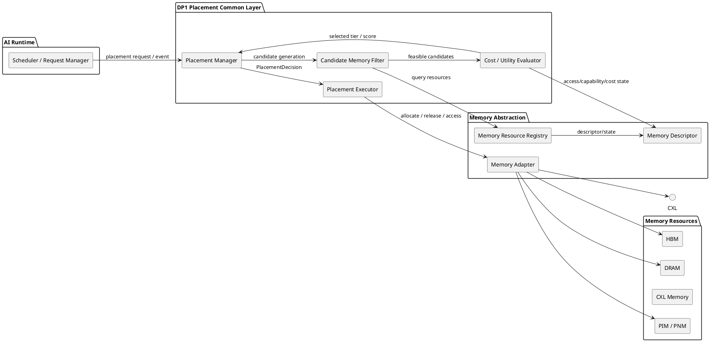

### Common 책임

| Module | 책임 |
|---|---|
| `Scheduler / Request Manager` | Data 생성/유입, request lifecycle, placement trigger 제공 |
| `Placement Manager` | Placement decision의 진입점과 lifecycle 관리 |
| `Candidate Memory Filter` | Capacity, operation, reachability, QoS, constraint 기반 후보 제거 |
| `Cost / Utility Evaluator` | Access / Capacity / Migration / Operation / Constraint 비용 계산 |
| `Placement Executor` | 결정된 placement의 실제 allocation / release / placement action 수행 |
| `Memory Resource Registry` | Memory Resource 등록 및 조회 |
| `Memory Descriptor` | Capacity/BW/Latency/Compute Capability/Load 등 공통 resource 상태 표현 |
| `Memory Adapter` | 실제 Memory backend와 공통 runtime interface 연결 |

> **중요:** Migration 자체의 알고리즘은 DP4의 책임이다. DP1은 `PlacementDecision`을 생성하고 Executor에 destination을 전달한다. DP4가 실제 data movement를 수행한다.

---

# 3. C1 Memory-centric Placement

## 3.1 C1 Module View

C1은 **Memory Resource를 primary state owner로 두는 구조**이다.

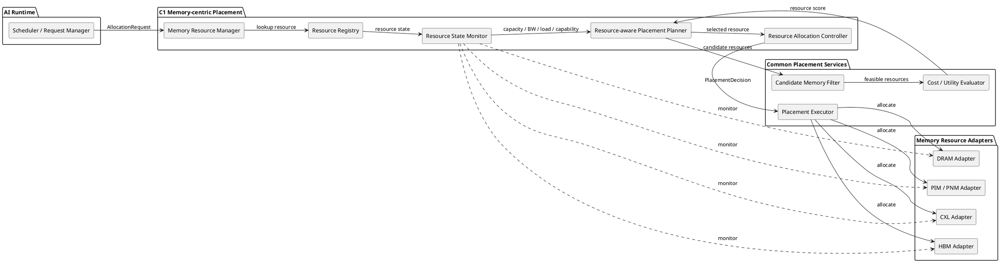

### C1 구조적 핵심

```text
Resource Registry
      ↓
Resource State Monitor
      ↓
Resource-aware Planner
      ↓
Allocation Controller
      ↓
Placement Executor
```

즉, **"어느 Memory Resource가 현재 이 Data를 수용하기에 적합한가?"**가 중심 흐름이다.

---

## 3.2 C1 Class Diagram

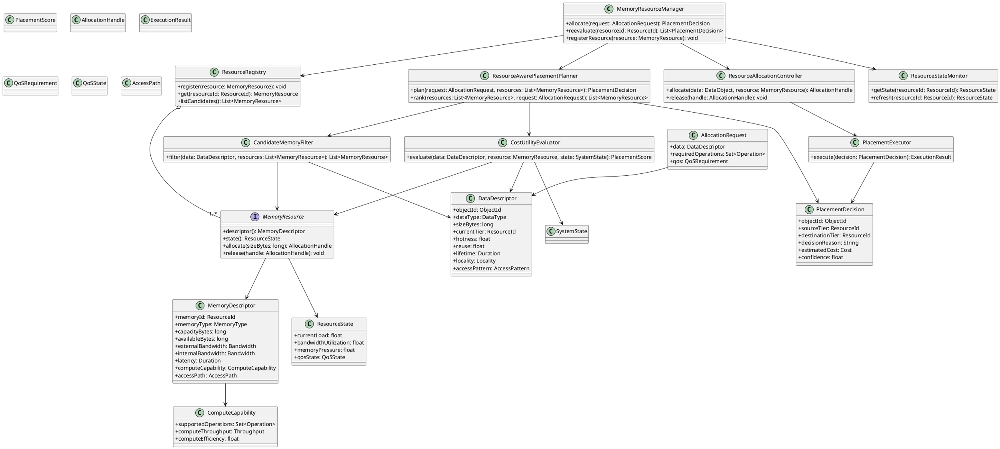

### C1 Class 책임

- `MemoryResourceManager`가 C1의 Facade / orchestration entry point이다.
- `ResourceRegistry`가 primary registry이다.
- `ResourceStateMonitor`가 Resource-centric runtime state를 소유/갱신한다.
- `ResourceAwarePlacementPlanner`가 Resource 상태를 기준으로 후보를 비교한다.
- `DataDescriptor`는 planner의 입력이지만 C1의 primary state owner는 아니다.
- 실제 backend 접근은 `MemoryResource` interface 뒤로 숨긴다.

---

## 3.3 C1 Sequence Diagram — Initial Placement

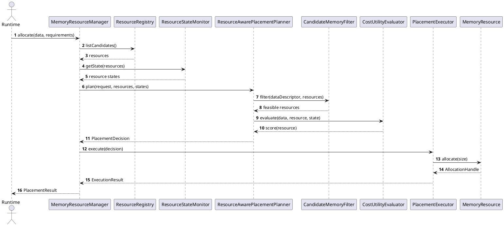

### C1 Sequence Diagram — Re-placement Trigger

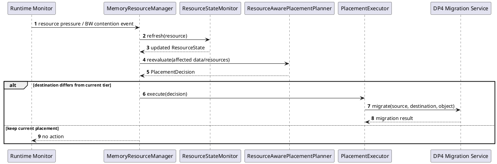

> C1에서 Re-placement trigger는 Resource State 변화에 강하게 결합된다. Data hotness 등의 변화가 trigger가 될 수 있지만, 최종 planner의 중심 상태는 Resource State이다.

---

# 4. C2 Data-centric Placement

## 4.1 C2 Module View

C2는 **Data Object를 primary state owner로 두는 구조**이다.

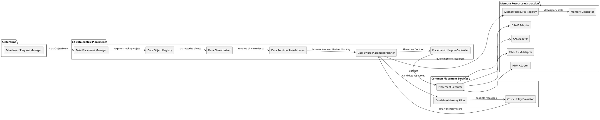

### C2 구조적 핵심

```text
Data Object Registry
      ↓
Data Characterizer
      ↓
Data Runtime State
      ↓
Data-aware Planner
      ↓
Tier Selection
      ↓
Placement Executor
```

즉, **"이 Data Object의 Hotness / Reuse / Lifetime / Locality를 고려할 때 어느 Memory Tier가 적합한가?"**가 중심 흐름이다.

---

## 4.2 C2 Class Diagram

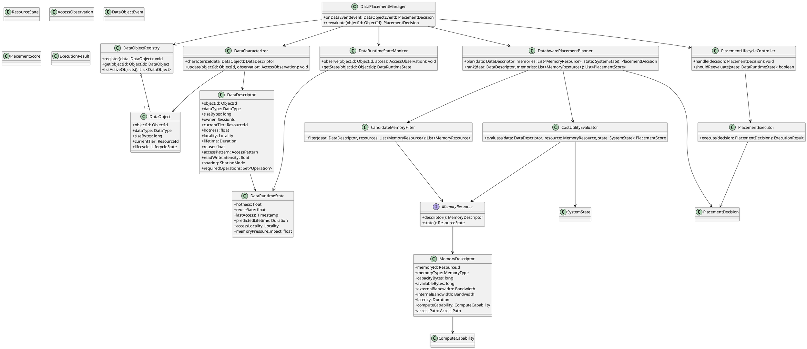

### C2 Class 책임

- `DataPlacementManager`가 C2의 Facade / lifecycle entry point이다.
- `DataObjectRegistry`가 primary registry이다.
- `DataCharacterizer`가 Logical Data Type의 실제 runtime 특성을 공통 `DataDescriptor`로 변환한다.
- `DataRuntimeStateMonitor`가 object별 hotness/reuse/lifetime/locality 변화를 추적한다.
- `DataAwarePlacementPlanner`가 **Data × Memory** 조합을 평가한다.
- Memory는 C2에서도 `MemoryResource`/`MemoryDescriptor`로 공통 추상화되며, primary state owner가 아니다.

---

## 4.3 C2 Sequence Diagram — Initial Placement

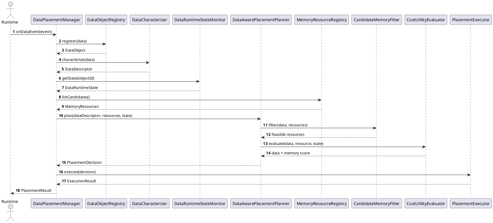

---

## 4.4 C2 Sequence Diagram — Runtime Re-evaluation

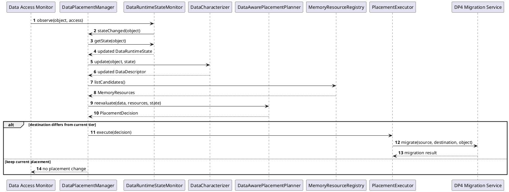

---

# 5. C1 vs C2 UML 구조 비교

## 5.1 Module View 비교

```text
C1 Memory-centric                         C2 Data-centric
──────────────────                        ─────────────────
Memory Resource Manager                   Data Placement Manager
        │                                         │
        ├─ Resource Registry                      ├─ Data Object Registry
        ├─ Resource State Monitor                 ├─ Data Characterizer
        ├─ Resource-aware Planner                 ├─ Data Runtime State
        └─ Allocation Controller                  └─ Data-aware Planner
        │                                         │
        └───────────────┐             ┌───────────┘
                        ▼             ▼
                Common Placement Services
                ├─ Candidate Filter
                ├─ Cost / Utility
                └─ Placement Executor
                        │
                        ▼
                Memory Resource Layer
```

## 5.2 Primary Class Ownership

| 관점 | C1 Memory-centric | C2 Data-centric |
|---|---|---|
| Primary Object | `MemoryResource` | `DataObject` |
| Primary Registry | `ResourceRegistry` | `DataObjectRegistry` |
| Primary Runtime State | `ResourceState` | `DataRuntimeState` |
| Characterization | Resource state 중심 | Data behavior 중심 |
| Planner | `ResourceAwarePlacementPlanner` | `DataAwarePlacementPlanner` |
| Decision Unit | Resource 후보 간 선택 | Data × Memory 조합 평가 |
| Trigger | Resource pressure / BW / capacity | Hotness / reuse / lifetime / locality |
| Extension Axis | New Memory Type | New Data Type |
| Common | Filter / Cost / Executor / Memory Abstraction | 동일 |

---

# 6. Data Type Adapter 구조

C2에서 다양한 AI Runtime Data를 동일한 Placement Framework으로 처리하기 위한 Logical Data Type → Physical Representation → Common Descriptor 변환 구조를 정의한다.

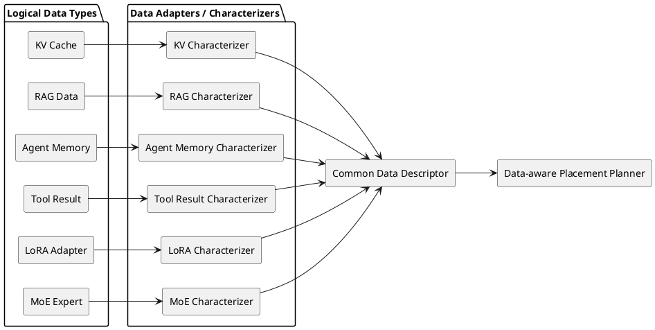

### 구현 원칙

- Placement Planner는 KV Cache/RAG/Agent Memory 등의 physical representation을 직접 해석하지 않는다.
- 각 Data Type은 `Data Characterizer` 또는 Adapter를 통해 공통 Descriptor를 제공한다.
- 신규 Data Type 추가 시 기존 Planner를 수정하기보다 Characterizer를 추가하는 방향을 우선한다.

---

# 7. Common Interface

C1/C2 모두 최종적으로 동일한 Placement Interface를 제공하도록 한다.

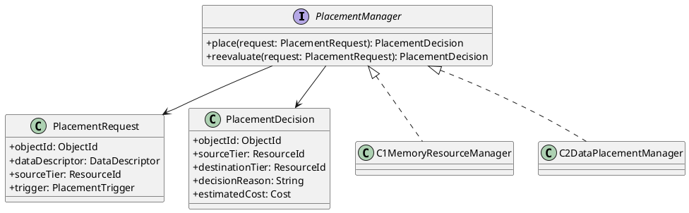

이 Interface를 유지하면 상위 Runtime은 C1/C2의 내부 구현 차이를 알 필요가 없다.

---

# 8. DP Boundary

```text
                 DP1. Data Placement
                        │
                        │ PlacementDecision
                        ▼
              ┌─────────────────────┐
              │ Placement Executor  │
              └──────────┬──────────┘
                         │
             ┌───────────┴───────────┐
             │                       │
             ▼                       ▼
     Allocation / Release       DP4 Migration
                                 Data Movement

DP2: Prefill Compute Placement
  └─ Which Compute Resource executes Prefill?

DP3: Data Eviction
  └─ Which Data should be removed?

DP4: Data Migration
  └─ How should Data move between Memory Tiers?
```

특히 DP1 UML에서는 다음을 혼합하지 않는다.

- `PlacementDecision` ≠ Compute Placement Decision (DP2)
- `PlacementDecision` ≠ Eviction Decision (DP3)
- `PlacementDecision` ≠ Migration Algorithm (DP4)

DP1은 **어느 Memory Tier에 둘 것인가**를 결정하고, 실제 이동이 필요한 경우 DP4를 호출한다.

---

# 9. 구현 시 우선 확인할 Interface

실제 구현 단계에서는 다음 interface를 먼저 고정하는 것이 좋다.

```text
1. DataDescriptor
2. MemoryDescriptor
3. MemoryResource
4. PlacementRequest
5. PlacementDecision
6. CandidateMemoryFilter
7. CostUtilityEvaluator
8. PlacementExecutor
9. PlacementManager
```

그 다음 후보별로 다음 구현체를 붙인다.

```text
C1
├── MemoryResourceManager
├── ResourceRegistry
├── ResourceStateMonitor
├── ResourceAwarePlacementPlanner
└── ResourceAllocationController

C2
├── DataPlacementManager
├── DataObjectRegistry
├── DataCharacterizer
├── DataRuntimeStateMonitor
├── DataAwarePlacementPlanner
└── PlacementLifecycleController
```

---

# 10. UML → Architecture 문서 반영 방향

이 문서는 다음 단계의 Architecture 재작성에 사용한다.

```text
UML Module View
      ↓
Architecture Component / Module 구조

UML Class Diagram
      ↓
실제 Runtime Class / Interface 구조

UML Sequence Diagram
      ↓
Runtime Control Flow / Call Path
```

따라서 다음 Architecture 문서에서는 단순한 개념 블록을 나열하기보다 **UML에서 정의된 Registry → State/Characterization → Planner → Common Services → Executor의 책임과 호출 관계를 기준으로 모듈을 다시 그린다.**

---

## Related Documents

- `doc-architect/dp1-heterogeneous-memory-data-placement.md` — DP1 background / evaluation / simulation
- `doc-architect/dp1-data-placement-design.md` — DP1 architecture / candidate design
- `doc-architect/dp1-data-placement-uml.md` — **본 문서: implementation-oriented UML**
