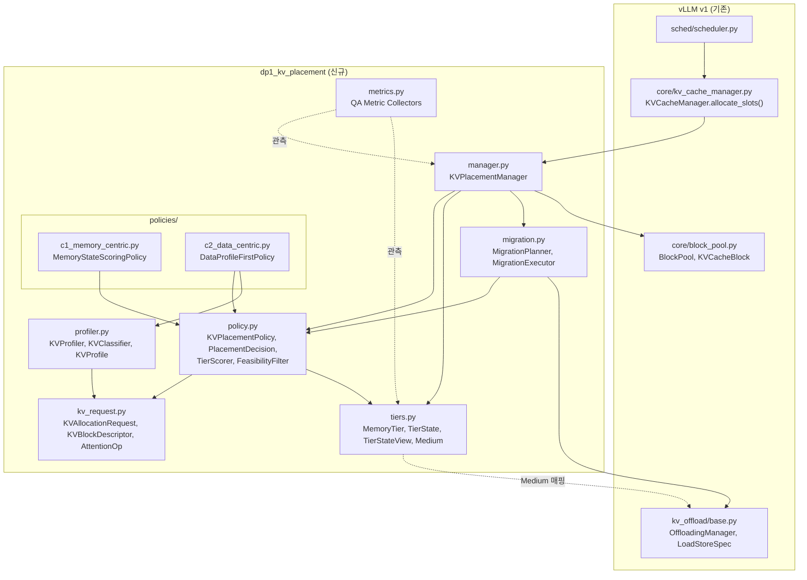
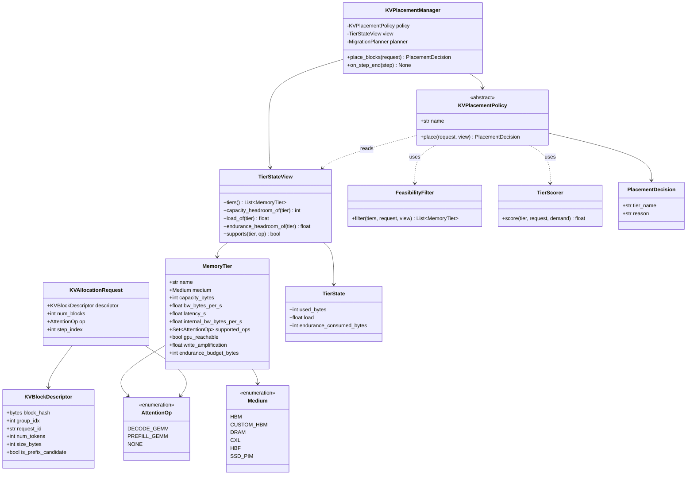
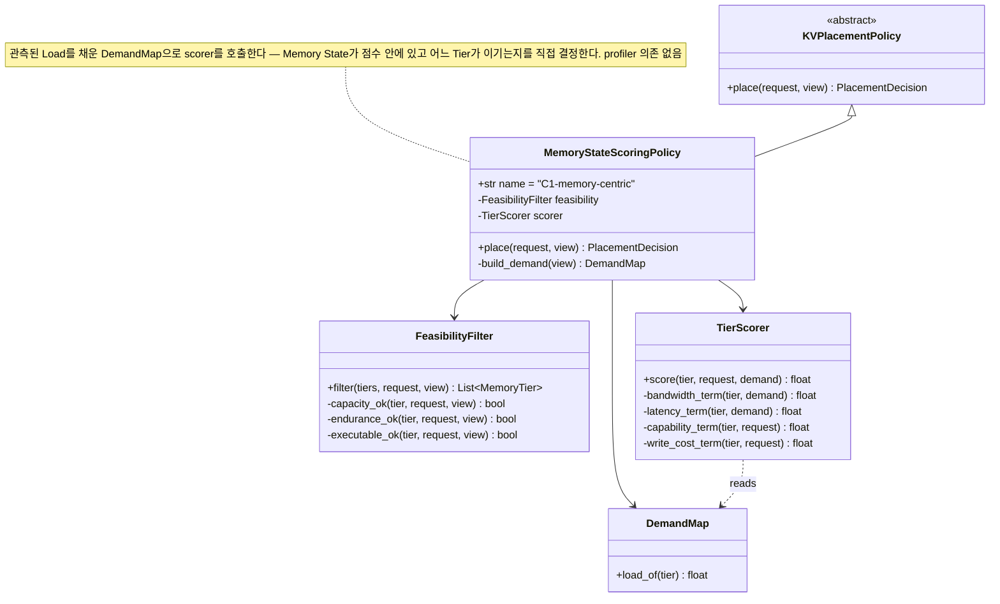
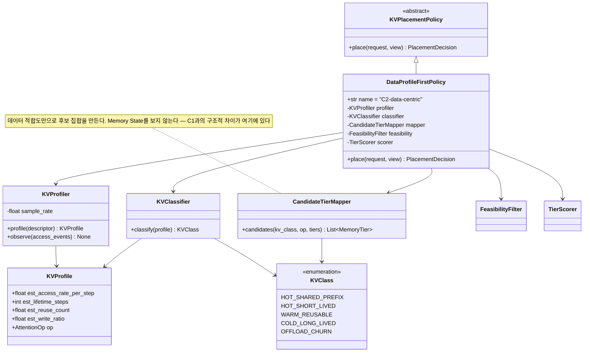
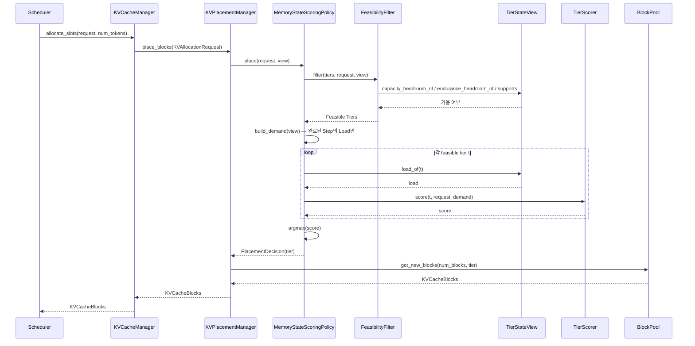
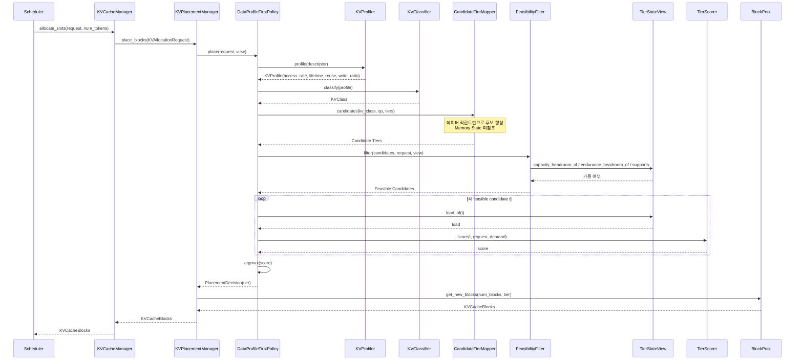

# DP1. 이기종 메모리 기반 KV Cache 배치 구조

## 1. Design Point 개요

### 목적

LLM 추론 시스템 내에서 HBM, Custom HBM, DRAM, CXL Memory, HBF, SSD-PIM 등 서로 다른 저장/연산 특성을 가진 메모리가 혼재할 때, **KV Cache Block을 어느 메모리에 배치하고 언제 이동시킬 것인지**를 어떤 기준으로 결정할지 설계한다.

### 핵심 설계 질문

> **메모리 및 KV Cache의 어떤 특성을 기반으로 KV Block의 배치·이동을 결정할 것인가?**

### 대상 범위

| | |
|---|---|
| **대상** | Attention KV Cache Block (Prefill에서 생성되어 Decode 동안 반복 read되는 Key/Value tensor block) |
| **대상 아님** | Model Weight, MoE Expert Weight, LoRA Adapter, Activation, Embedding/RAG Index — 배치 대상이지만 본 DP의 쟁점이 아니다 |
| **대상 아님** | **어떤 KV를 회수(Evict)할 것인가** — DP3의 쟁점이다. DP1은 "어디에 둘 것인가"만 다룬다 |
| **대상 아님** | **Prefill 연산을 어디서 수행할 것인가** — DP2의 쟁점이다 |

KV Cache로 범위를 좁히는 이유는 §2에서 다룬다. 요지는 **KV Cache가 추론 메모리의 지배적 소비자이면서, 동시에 block마다 수명과 재사용 특성이 크게 다른 유일한 데이터**라는 점이다.

---

## 2. 배경 / 문제 정의

### ① KV Cache가 추론 메모리의 지배적·가변 소비자다

Model Weight는 서빙 시작 시점에 크기가 고정되지만, KV Cache는 **Context Length × Concurrency에 비례해 런타임에 증가**한다.

```text
Context Length ↑          Concurrency ↑
        │                       │
        └───────────┬───────────┘
                    ▼
            KV Cache Size ↑
                    │
                    ▼
        HBM Capacity Pressure ↑
                    │
        ┌───────────┴───────────┐
        ▼                       ▼
  신규 Request 수용 제한     Preemption / 재계산
```

Weight는 "어디에 둘지"가 한 번 결정되면 끝나는 문제지만, KV Cache는 **매 Request·매 Step마다 반복해서 발생하는 배치 결정**이다. 따라서 배치 정책의 품질이 누적되어 나타난다.

### ② 이기종 메모리가 혼재하며, 일부는 연산 기능과 유한한 Write Endurance를 갖는다

1. 메모리 병목 해소를 위해 단일 시스템 내 용량·대역폭·지연시간 특성이 상이한 이기종 메모리가 혼재할 수 있다 (CXL Memory, Custom HBM, HBF, PIM/PNM 계열 등).

2. 일부 메모리는 데이터 저장뿐 아니라 **연산 기능(Compute Capability)** 까지 제공한다. Decode 단계의 Attention은 단일 Query token과 전체 KV 간의 **GEMV 성향 연산**이고 arithmetic intensity가 낮아, memory-side compute로 처리할 여지가 상대적으로 큰 연산이다.

3. 일부 메모리는 **Read/Write 비대칭성**과 **유한한 Write Endurance**를 갖는다. HBF, SSD-PIM 등은 Write 비용이 Read 대비 현저히 높고 누적 Write 량이 소자 수명을 제한한다. KV Cache는 Prefill 시 write-once지만, **하위 Tier로의 Offload와 재사용 시의 Restore가 반복되면 write 트래픽이 누적**된다. Capacity / BW / Latency만으로 배치 적합성을 판단하면, offload가 잦은 KV를 저내구성 메모리에 배치하여 성능 저하와 수명 소모를 동시에 유발할 수 있다.

4. 기존 HBM–DRAM–SSD 구조에서는 Attention 연산 대상 KV가 최종적으로 HBM에 위치해야 했으므로 **HBM 우선 할당**과 같은 단순한 배치 정책이 합리적이었다. 그러나 연산 기능을 포함해 역할이 서로 다른 메모리가 추가되면, 단순히 GPU에 가까운 메모리를 우선하는 방식만으로는 각 자원의 특성을 충분히 활용하기 어렵다.

### ③ 모든 KV Block이 동일한 배치 요구를 갖지 않는다

KV Cache는 **균질한 데이터 덩어리가 아니다.** Block 단위로 보면 다음이 크게 다르다.

```text
KV Block A                    KV Block B                    KV Block C
System Prompt 구간            중간 Turn의 Tool Result        마지막 Turn의 생성 구간

여러 Request가 공유           단일 Request 전용             단일 Request 전용
(Prefix Cache Hit 다수)       재사용 없음                   매 Decode Step read
수 시간 잔류                  Request 종료 시 해제          Request 종료 시 해제
     │                             │                             │
     ▼                             ▼                             ▼
재사용 가치 높음              점유만 하고 접근 드묾          가장 Hot
```

동일한 크기의 Block이라도 **재사용 가능성(Hotness), 생존 기간(Lifetime), Offload 왕복 빈도(Write Intensity)** 가 자릿수 단위로 다르다. 이 차이를 반영하지 않으면 재사용 가치가 높은 Prefix Block이 느린 Tier로 밀려나고, 접근이 드문 Block이 HBM을 점유하는 상황이 발생한다.

### As-Is

**KV 특성을 고려하지 않은 단순 정책 (HBM 우선 할당, 부족 시 하위 Tier로 순차 Spill)**
→ 신규 메모리 도입 시 저장 용량으로만 활용되고, 연산 기능과 Tier별 특성이 사용되지 않음

### To-Be

**메모리 특성 및 KV Cache 특성·Attention 연산 특성을 고려한 KV Block 배치·이동 정책**
→ 신규 메모리의 저장·연산 특성을 활용하여 HBM Pressure 완화 및 Attention 실행 효율 향상

---

## 3. 배치 결정에 사용할 수 있는 정보

C1/C2 모두 동일한 Allocation Request를 받는다. 차이는 요청 정보의 차이가 아니라 **그 중 무엇을 1차 기준으로 삼는가**이므로, 먼저 사용 가능한 정보와 그 **관측 가능성**을 정리한다.

### 3.1 KV Cache Property

| 특성 | KV Cache에서의 구체적 의미 | 할당 시점에 |
|---|---|---|
| **Access Pattern** | Prefill에서 write-once, 이후 해당 Request의 매 Decode Step마다 전체 KV를 read. Block 단위 순차 접근 | **선언 가능** (Request 상태에서 직접 도출) |
| **Hotness** | 이 Block이 다른 Request에서 Prefix Cache Hit로 재사용될 빈도. System Prompt·공통 Instruction 구간은 높고, 사용자 고유 구간은 낮음 | **추정 필요** — 미래의 Prefix Hit는 원리적으로 미지 |
| **Lifetime** | Block이 해제될 때까지의 Step 수 = 해당 Request의 **남은 Decode 길이** (+ Prefix Cache로 잔류하는 기간) | **추정 필요** — 출력 길이는 생성 전에 알 수 없음 |
| **Operation** | Attention. Decode = GEMV 성향(단일 Query token), Prefill/Chunked Prefill = GEMM 성향 | **선언 가능** (Scheduler가 아는 실행 단계) |
| **Write Intensity** | Prefill write 1회 + 하위 Tier Offload/Restore 왕복 + 선점 후 재계산 시 재작성 | **부분 추정** |

### 3.2 이 DP에서 특히 중요한 두 가지 제약

**(1) Lifetime과 Hotness는 원리적으로 할당 시점에 알 수 없다.**

KV Block을 할당하는 시점에 그 Request가 20 token을 생성할지 2000 token을 생성할지 알 수 없고, 이 Prefix가 이후 다른 Request에서 재사용될지도 알 수 없다. 따라서 **C2의 오분류 Risk는 구현 품질로 제거할 수 있는 것이 아니라 문제의 성질에서 오는 구조적 비용**이다. §8 Functional Correctness 평가는 이 전제 위에서 읽어야 한다.

**(2) Block 크기가 균일하다.**

일반 데이터 배치와 달리 KV Block은 `block_size × num_layers × num_kv_heads × head_dim × dtype`으로 크기가 고정된다. 따라서 배치 결정의 변수는 "이 큰 객체를 어디에 둘까"가 아니라 **"균일한 Block 다수를 Tier 간에 어떻게 분배할까"** 이며, 같은 Request의 Block들은 **함께 해제된다**(수명 상관관계가 Request 단위로 묶임). 이는 Migration 단위와 단편화 양상에 직접 영향을 준다.

### 3.3 Memory State

두 후보 모두 관측 가능하다.

- Available Capacity
- Bandwidth / Latency
- Attention Compute Capability (해당 Tier가 GEMV/GEMM을 in-place로 처리 가능한가)
- Current Load
- Write Cost (Write Amplification) / Endurance Headroom

---

## 4. 설계 쟁점

- 메모리별 상이한 특성과 KV Block별 상이한 특성을 고려한 **KV Cache 배치·이동 의사결정 기준 설계 필요**

> **메모리 및 KV Cache의 어떤 특성을 기반으로 배치·이동을 결정할 것인가?**

본 DP의 핵심은 Allocation Request 자체의 차이가 아니라, **동일한 요청 정보 중 어떤 정보를 Placement의 1차 기준으로 삼는가**에 있다.

공통 KV Allocation Request 예시:

```text
KV Block Allocation Request
(block hash, num_blocks, block size, attention op, request id, ...)
```

---

## 5. 후보 구조

## Candidate 1. Memory-centric KV Placement

### 한 줄 정의

> **메모리 특성(Capacity / BW / Attention Compute Capability / Load / Write Endurance)을 기준으로 KV Block을 배치**

### 구조

```text
KV Block Allocation Request
(block hash, num_blocks, size, attention op, request id)
        |
        v
Memory State / Capability
- Available Capacity
- Bandwidth / Latency
- Attention Compute Capability
- Current Load
- Write Cost / Endurance Headroom
        |
        v
Tier Scoring / Selection
        |
        v
Placement / Migration
        |
        v
HBM / Custom HBM / DRAM / CXL Memory / HBF / SSD-PIM
```

### 특징

- 메모리의 현재 상태 및 Capability가 KV 배치의 1차 의사결정 기준이다.
- Capacity, BW, Load 등의 변화에 따라 배치 정책을 동적으로 변경하기 쉽다. HBM Pressure가 급증하면 **즉시** 하위 Tier로 분산된다.
- KV Block의 세부 특성(Hotness/Lifetime)을 별도로 분류하지 않아 구조가 상대적으로 단순하고, Scheduler Critical Path에 추가되는 비용이 작다.
- Attention Operation 정보는 실행 가능성 확인(이 Tier에서 in-place 처리가 가능한가)에 사용할 수 있으나, KV 특성이 Placement의 주 기준은 아니다.
- Write Endurance Headroom은 관측 가능한 Memory State이므로 직접 반영할 수 있다. 다만 **어떤 Block이 이후 Offload/Restore를 반복해 내구성을 소모할지는 사전에 판단하지 않는다.**

### 한계가 드러나는 지점

동일 시점에 도착한 System Prompt Block(재사용 다수 예상)과 사용자 고유 Block(재사용 없음)이 **동일하게 취급**된다. 두 Block은 Memory State 관점에서 구별되지 않으므로 같은 Tier로 간다.

---

## Candidate 2. Data-centric KV Placement

### 한 줄 정의

> **KV 특성(Access Pattern / Hotness / Lifetime / Attention Operation / Write Intensity)을 기준으로 배치**

### 구조

```text
KV Block Allocation Request
(block hash, num_blocks, size, attention op, request id)
        |
        v
KV Profiling / Classification
- Access Pattern (Decode Step별 재접근)
- Hotness (Prefix 공유 / 재사용 빈도)
- Lifetime (Request 잔여 Decode 길이, Prefix Cache 잔류)
- Operation (Decode GEMV / Prefill GEMM)
- Write Intensity (Prefill write, Offload/Restore 왕복)
        |
        v
Candidate Tier / Preferred Tier
        |
        v
Memory State Check
- Available Capacity
- Load
- BW / Latency
- Capability
- Write Cost / Endurance Headroom
        |
        v
Final Placement / Migration
        |
        v
HBM / Custom HBM / DRAM / CXL Memory / HBF / SSD-PIM
```

### 특징

- KV 특성을 기준으로 적합한 메모리 후보를 먼저 결정한다. 재사용 가치가 높은 Prefix Block과 접근이 드문 Block이 **후보 형성 단계에서 이미 갈라진다.**
- 이후 실제 배치 시 Available Capacity, Load 등의 Memory State를 확인하여 feasibility를 보정한다. 단 이는 1차 후보가 정해진 뒤의 필터이므로, **자원 상태가 후보 형성 자체에 미치는 영향은 C1보다 간접적**이다.
- Attention Operation과 Memory Compute Capability 간 매칭이 가능해 연산 기능을 가진 메모리 활용에 유리하다. Decode의 GEMV 성향 Attention을 memory-side compute로 보낼 후보 선택이 자연스럽게 표현된다.
- Hotness/Lifetime은 §3.2에서 밝혔듯 **원리적으로 추정 대상**이므로 Profiling/Classification 비용과 오분류 가능성이 존재한다.
- Write Intensity를 분류에 포함하면 Offload 왕복이 잦을 KV를 저내구성 메모리에서 회피할 수 있다. 다만 Write 집약도 역시 추정 대상이므로, 오분류는 성능 저하뿐 아니라 수명 소모로 직결된다.

### 한계가 드러나는 지점

HBM Pressure가 급변할 때, 후보 집합이 이미 데이터 특성으로 고정된 상태에서 Memory State는 그 안에서만 선택할 수 있다. **자원 혼잡 회피의 즉시성이 C1보다 낮다.**

---

## 6. C1 vs C2 핵심 차이

```text
            Same KV Block Allocation Request
        (block hash, num_blocks, size, op, request id)
                        |
              +---------+---------+
              |                   |
              v                   v
       C1 Memory-centric     C2 Data-centric
              |                   |
       Memory 특성이          KV 특성이
       1차 배치 기준          1차 배치 기준
              |                   |
              |             Memory State로
              |              최종 feasibility
              |                / 보정 확인
              +---------+---------+
                        |
                        v
                 Placement / Migration
```

즉, 두 후보 모두 Memory State를 확인할 수 있다. 차이는 **실시간 상태를 볼지 여부가 아니라 어떤 특성을 우선하여 Placement 후보를 형성하느냐**이다.

### 직교 축: Reactivity (본 DP의 쟁점이 아님)

**정적 배치(1회 결정 후 유지) vs 반응적 재배치(상태 변화에 따라 Migration)** 는 본 DP의 쟁점과 **직교하는 별개 설계 축**이다.

```text
              static            reactive
memory-first  C1-static         C1-reactive
data-first    C2-static         C2-reactive
```

두 후보 모두 static/reactive 어느 쪽으로도 구현할 수 있다. 따라서 "동적 자원 변화에 대응 가능한가"를 C1 또는 C2의 고유 장점으로 기술하면 두 변수가 교란되어 후보 비교가 성립하지 않는다.

> **본 DP의 쟁점은 오직 "1차 배치 기준을 Memory 특성으로 둘지 KV 특성으로 둘지"이며, 후보 비교는 동일한 Reactivity 수준 내에서만 수행한다.**

---

## 7. 장단점

| 구분 | C1. Memory-centric | C2. Data-centric |
|---|---|---|
| 주요 기준 | Capacity / BW / Attention Compute Capability / Load / Write Endurance Headroom | Access Pattern / Hotness / Lifetime / Attention Operation / Write Intensity |
| 장점 1 | 자원 혼잡·포화가 후보 형성 단계에서 직접 반영되므로 HBM Pressure 급증 시 회피가 즉각적 | KV Block 특성에 적합한 맞춤형 Placement 가능 (Prefix Block 우대, Cold Block 강등) |
| 장점 2 | KV Profiling/Classification이 불필요하여 Scheduler Critical Path 비용이 작음 | Attention Operation–Compute Capability 매칭을 통해 연산형 메모리 활용에 유리 |
| 장점 3 | 정책 구현/분석/검증이 상대적으로 단순 | 장기적인 재사용/Lifetime 특성을 고려한 Placement 최적화 가능 |
| 단점 1 | KV Block별 요구 특성을 직접 반영하지 않아 Placement Quality 한계 | KV 특성 수집·분석 및 Classification Overhead 발생 |
| 단점 2 | 미래 재사용·잔여 Decode 길이를 반영하기 어려움 | Hotness/Lifetime은 §3.2에 따라 원리적 미지값이므로 예측·분류 오류가 불가피 |
| 단점 3 | 어떤 KV가 Compute-capable Memory에 적합한지 판단에 한계 | 잘못된 분류 시 부적절한 Tier 선택 및 불필요한 Migration/Restore 발생 |

### 핵심 Trade-off

**C1**
> 단순성·자원 상태 반영의 즉시성 ↑ / KV Block별 Placement 최적화 수준 ↓

**C2**
> KV·연산 특성 기반 Placement 최적화 및 연산형 메모리 활용도 ↑ / 분석 복잡도·오분류 Risk ↑

---

## 8. SW Quality Attribute 관점 비교

DP 후보 구조의 차이를 설명하는 데 직접적인 QA만 선별한다.

> **아래 등급은 정성적 가설이며 §9의 Metric으로 정량 검증할 대상이다.** 측정 결과가 등급과 다를 수 있으며, 그 경우 측정 결과를 따른다.

| QA | 평가 관점 | C1 (가설) | C2 (가설) |
|---|---|:---:|:---:|
| **Functional Correctness** | 입력 정보 및 예측 오차가 존재할 때 적절한 KV Placement를 결정할 수 있는가 | ★★★ | ★★☆ |
| **Performance Efficiency** | KV/Attention 특성에 적합한 메모리 배치로 추론 성능 및 자원 활용을 높일 수 있는가 | ★★☆ | ★★★ |
| **Maintainability** | Placement 정책의 구현·분석·검증·변경이 용이한가 | ★★★ | ★★☆ |
| **Flexibility** | 새로운 Memory Tier / KV 특성 / Attention 연산에 대응 가능한가 | ★★☆ | ★★★ |

### Functional Correctness

- C1은 Capacity/Load 등 현재 관측 가능한 Memory State 중심으로 결정하므로 예측 정보 의존도가 낮다. **추정을 쓰지 않으므로 추정 오차가 결과에 도달할 경로가 구조적으로 없다.**
- C2는 Hotness/Lifetime이 §3.2에 따라 필연적으로 추정값이므로 오분류가 Placement 오류로 연결될 가능성이 있다.
- 이는 Fault Tolerance 관점의 Reliability보다 **의도한 Placement 판단을 얼마나 정확히 수행하는지**에 해당하므로 Functional Correctness로 평가한다.

### Performance Efficiency

- C2는 KV의 재사용/Lifetime 특성과 Attention Operation을 Memory Capability와 직접 매칭할 수 있어 적합한 Placement 및 Compute-capable Memory 활용에 유리하다.
- 단 C2는 Profiling/Classification이 `allocate_slots` 경로에 추가되므로 **Placement Decision Latency 자체는 불리**하다. 이 QA 안에서 상반된 두 힘이 작용한다.

### Maintainability

- C1은 Memory State → Scoring → Placement 구조로 비교적 단순하다.
- C2는 Profiling → Classification → Candidate Tier Mapping → Memory State Check가 추가되어 정책 및 테스트 복잡도가 높다.

### Flexibility

- C2는 저장 특성뿐 아니라 KV 및 Attention 연산 특성을 정책에 반영할 수 있어, Compute Capability까지 다변화되는 차세대 메모리 환경에 유리하다.

---

## 9. QA별 평가 Metric

§8의 등급은 가설이므로 QA마다 **무엇을 재면 그 가설이 검증/반증되는지**를 먼저 고정한다. 실제 수치는 Prototype 실측으로 채우며 **본 문서에 가정값을 기재하지 않는다.**

### 9.1 Metric 선정 요약

| QA | 하위 특성 | 주 Metric | 증거 종류 |
|---|---|---|---|
| **Performance Efficiency** | Time Behaviour | **M-P1** KV Access Time (정규화) / **M-P2** TTFT·TPOT / **M-P3** Placement Decision Latency | 측정 |
| | Resource Utilization | **M-P4** HBM KV Footprint & Peak Occupancy / **M-P5** Compute-capable Memory Utilization | 측정 |
| | Capacity | **M-P6** Max Concurrent Requests / Preemption Rate | 측정 |
| **Functional Correctness** | Functional Correctness | **M-C1** KV–Tier Matching Rate / **M-C2** Mis-placement Rate / **M-C3** 불필요 Migration 비율 | 측정 |
| | | **M-C4** KV Classification Accuracy / **M-C5** Prediction Dependency | 측정 (C2 한정 / 오차 주입) |
| **Maintainability** | Analysability·Modifiability·Testability | **M-M1** 정책 결정 경로 복잡도 / **M-M2** 신규 Tier 추가 시 변경 지점 수 / **M-M3** Tuning Knob 수 / **M-M4** 결정 분기 커버리지 비용 | **대리 지표** (소스 정적 분석) |
| **Flexibility** | Adaptability | **M-F1** 신규 Memory Tier 활용률 / **M-F2** 신규 Attention 연산 대응 범위 / **M-F3** Config-only 대응 축 수 / **M-F4** Workload Shift 재수렴 시간 | **실험** (새 Tier/연산 투입 후 실행) |
| (전 QA 공통 Risk) | | **M-E1** Endurance Pressure | 측정 |

### 9.2 Performance Efficiency

#### M-P1. KV Access Time (주 지표, 정규화)

KV Cache에 관한 메모리 점유 시간의 총합.

```text
T_kv = Σ Prefill Write Time
     + Σ Decode Read Time
     + Σ Migration / Offload-Restore Time      [단위: 초]

각 항 = 지연(경합 보정) + bytes / 유효대역폭(경합 보정)
```

- 해당 Tier가 Attention 연산을 in-place로 처리 가능하면 **내부 대역폭**, GPU가 직접 읽을 수 있으면 **외부 대역폭**, 둘 다 아니면 **Tier read + HBM staging read**를 합산한다. 이 분기가 **연산-Capability 매칭이 성능으로 환산되는 유일한 경로**이므로 반드시 모델에 포함한다.
- **정규화:** As-Is(HBM 우선 할당) = 1.0. 절대 초 값은 워크로드 규모에 의존하므로 비율로 보고한다. 증명할 수 없는 최적해를 분모로 쓰지 않는다.

> **이 Metric이 재지 않는 것:** GPU Occupancy와 에너지 항이 없다. Memory-side compute가 GPU 연산 유닛을 비워주는 이득이 보이지 않으므로, **Compute-capable Memory에 관한 모든 수치는 이득의 하한**이다.

#### M-P2. TTFT / TPOT

사용자 관측 지표. M-P1이 시스템 내부 시간이라면 이쪽은 그 귀결이다.

- **TTFT** — Prefill KV write가 어느 Tier로 가는지가 직접 영향
- **TPOT** — Decode Step마다 전체 KV를 읽으므로 **배치 Tier가 가장 직접적으로 지배하는 지표**
- 보조: Attention Kernel Execution Time, End-to-End Latency (p50/p99)

#### M-P3. Placement Decision Latency

Placement 요청 1건 처리를 위한 정책 실행 비용.

```text
Decision Cost = 정책 실행 연산 수 또는 CPU 시간 / Placement 건수
```

- C1: Memory State Read → Tier Scoring → Placement
- C2: KV Profiling/Classification → Candidate Tier → Memory State Check → Placement
- **정규화 기준을 As-Is로 둔다.** C1 = 1.0으로 정규화하면 "C1 자신이 As-Is 대비 몇 배인가"가 감춰진다.
- 이 경로는 Scheduler Critical Path(`allocate_slots`)에 있으므로 **M-P2에 되먹임된다.** 두 지표를 독립적으로만 보고하면 "C2의 Decision 비용이 언제부터 실행 이득을 상쇄하는가"라는 Crossover 질문에 답할 수 없다 — 되먹임 경로를 Cost Model에 포함할 것.

#### M-P4. HBM KV Footprint & Peak Occupancy

```text
HBM KV Footprint     = Step별 HBM에 상주하는 KV bytes (평균/최대)
HBM Peak Occupancy   = max(HBM 사용량) / HBM Capacity
Memory Tier Utilization = Tier별 점유 bytes 비중
```

HBM Pressure 완화가 To-Be의 핵심 목표이므로 직접 측정한다.

#### M-P5. Compute-capable Memory Utilization

Memory-side Compute에서 처리 가능한 Attention 연산 중 실제 해당 자원으로 배치되어 처리된 비율.

```text
Compute Memory Utilization
= # Attention Ops assigned to compatible compute-memory
  / # Attention Ops eligible for compute-memory
```

> **주의:** 이 지표는 **Tier Pool의 연산 커버리지에 강하게 의존**한다. Pool 내에 Decode의 GEMV를 받아줄 Tier가 하나도 없으면 어느 정책을 쓰든 0이 되고, 이는 정책의 실패가 아니라 Pool 구성의 귀결이다. **반드시 "이 Pool의 어느 Tier가 어느 연산을 지원하는가"를 함께 명시**해야 해석 가능하다.

#### M-P6. Max Concurrent Requests / Preemption Rate

KV Capacity가 Admission을 제한하므로, 배치 품질은 **수용량**으로도 나타난다.

- 동일 SLO 하에서 수용 가능한 최대 동시 Request 수 / 유효 Batch Size
- KV 부족으로 인한 Preemption 및 재계산 발생률
- 보조: KV Migration Traffic / Count, Offload-Restore 왕복 횟수

### 9.3 Functional Correctness

#### M-C1. KV–Tier Matching Rate

KV Block의 BW/Latency/Operation 요구 특성과 실제 배치된 Memory Capability가 일치한 비율.

```text
Matching Rate = # Requirement-compatible placements / # Total placements
```

**정의 시 주의 — 상대 기준을 쓰면 붕괴한다.** "그 Block에 가장 싼 Tier 대비 허용오차 내"로 정의하면 가장 싼 Tier가 거의 항상 HBM이므로 지표가 정책의 판단이 아니라 **Pool의 희소성**을 재게 된다. 다음 **절대 기준**으로 정의한다.

> 이 Tier가 해당 Block의 실제 per-step 접근 트래픽을 감당하는가, 그리고 그 Attention 연산이 어딘가에서 in-memory로 처리 가능하다면 여기서 처리되거나 GPU가 직접 읽을 수 있는 위치인가.

**Capacity Regime을 명시하지 않은 Matching Rate는 시나리오 간 비교가 불가능하다** — 압박이 심해지면 모든 정책에서 함께 떨어진다.

#### M-C2. Mis-placement Rate

사후에 관측된 실제 접근 이력 기준으로, 배치 결정이 틀린 Block의 비율.

```text
Mis-placement Rate = # 실제 특성과 불일치한 배치 / # 전체 배치
```

**개수 기준과 바이트 기준을 모두 보고한다** — Prefix Block 소수가 전체 트래픽을 지배할 수 있으므로 개수 비율만으로는 영향도가 드러나지 않는다.

#### M-C3. 불필요 Migration 비율

Mis-placement 대비, 결과적으로 교정에 기여하지 못한 Migration의 비율.

```text
불필요 Migration 비율 = # 이득이 없던 Migration / # Mis-placement
```

> **주의:** 분모를 Migration 건수로 두면 재배치를 아예 수행하지 않는 정적 정책이 "0건 중 0%"로 최고점을 받는 왜곡이 발생한다. 분모는 Mis-placement 건수여야 한다.

#### M-C4. KV Classification Accuracy (C2 한정)

Hotness/Lifetime/Write Intensity 분류 결과와 사후 ground truth의 일치율.

**C1은 이 지표가 정의되지 않는다** — 분류를 수행하지 않기 때문이다. 이 **구조적 비대칭 자체가 §8 Functional Correctness 가설의 근거**이므로, "C1은 해당 없음"을 결함이 아니라 결과로 보고한다.

#### M-C5. Prediction Dependency (오차 전달 함수)

Placement 결정이 예측/분류 결과에 얼마나 의존하는지를 **오차 주입 실험**으로 잰다.

```text
증폭률 = (해당 오차에서의 T_kv / 오차 0에서의 T_kv − 1) / 입력 오차
```

- 추정을 사용하지 않는 정책은 증폭률이 **정확히 0**이다 (정의상 그렇고 검증 가능하다).
- 추정하는 정책은 전달 함수를 갖고, **그 함수가 곧 이 QA의 답**이다.
- 무작위 노이즈(ε)와 **계통 편향(bias)** 을 분리해서 훑는다. 계통 편향은 평균해서 사라지지 않으므로 같은 크기의 무작위 노이즈보다 해로울 수 있다.

### 9.4 Maintainability

> **이하 4개는 모두 대리 지표(proxy)다.** 변경 비용과 상관은 있지만 그것을 직접 측정하지 않는다. **논증의 방향으로 읽어야 하고 결론으로 읽으면 안 된다.**

| Metric | 정의 | 무엇을 대리하는가 |
|---|---|---|
| **M-M1** 정책 결정 경로 복잡도 | 결정 경로의 분기·루프 수, 정책 내부 state 수, 정의된 method 수, 유효 LoC | Analysability — 다음 사람이 이 정책을 읽고 이해하는 비용 |
| **M-M2** 신규 Tier 추가 시 변경 지점 수 | 새 Memory Tier 하나를 추가할 때 수정이 필요한 파일/클래스/enum 수 | Modifiability — 하드웨어 구성이 바뀔 때의 변경 비용 |
| **M-M3** Tuning Knob 수 | 동작을 바꾸는 정책 파라미터/Threshold 수 (공유 협력자·Reactivity 축 제외) | Analysability — 튜닝해야 할 자유도 |
| **M-M4** 결정 분기 커버리지 비용 | 모든 결정 분기를 커버하는 데 필요한 테스트 케이스 수 | Testability |

**대조군으로 As-Is를 함께 측정한다.** C1–C2 간 격차보다 "정책이 있는가 없는가"의 격차가 훨씬 클 가능성이 높고, 그 경우 이 QA에서 의미 있는 대비가 무엇인지가 결과로 드러난다.

### 9.5 Flexibility

Maintainability와 혼동하기 쉬우나 **재는 축이 다르다.**

| | Maintainability | Flexibility |
|---|---|---|
| **묻는 질문** | 이 코드를 다음 사람이 이해·수정·검증하기 쉬운가? | 이 정책이 Pool에 없던 Tier·연산·KV 패턴을 만나면 **행동이 달라지는가**? |
| **증거 종류** | 정적 — 소스에서 셀 수 있음 | 동적 — 새 조건을 주고 **실행해야** 알 수 있음 |
| **값이 바뀌는 계기** | 코드를 고칠 때만 | 코드는 그대로 두고 환경(Pool/워크로드)만 바꿀 때 |

| Metric | 정의 | 측정 방법 |
|---|---|---|
| **M-F1** 신규 Memory Tier 활용률 | Pool에 없던 특성 조합의 Tier를 추가했을 때 그 Tier로 배치된 Block 수·바이트·트래픽 비중 | **기존 Medium의 새 인스턴스**로 Tier를 추가해 코드 수정 없이 로드되게 한 뒤 실행. 그래야 enum 편집이 아니라 정책의 적응력을 잰다 |
| **M-F2** 신규 Attention 연산 대응 범위 | 새 연산 형태(예: MLA, Sliding-window, Sparse Attention)가 Capability 매칭에 반영되는가 | 새 연산을 선언하는 워크로드를 투입하고 배치 변화 관찰 |
| **M-F3** Config-only 대응 축 수 | 코드 수정 없이 설정만으로 대응 가능한 축의 개수 (Tier 수치 / 인스턴스 추가 / 신규 Medium / 신규 연산) | 정적 + 실행 확인 |
| **M-F4** Workload Shift 재수렴 시간 | 접근 패턴이 급변한 뒤 배치가 새 패턴에 재수렴하기까지의 Step 수 (Reactive 구성 한정) | 실행 중 패턴 전환 주입 |

> **M-F1을 objective 변화와 반드시 분리해서 보고할 것.** 새 Tier를 전혀 쓰지 않으면서 점수가 좋은 정책은 적응한 것이 아니라 **그것에도 불구하고 성공한 것**이다. 반대로 새 Tier를 적극적으로 쓰면서 점수는 나쁠 수도 있다 — **"얼마나 적극적으로 쓰는가"(Flexibility)와 "그래서 성능이 얼마나 좋아지는가"(Performance Efficiency)는 별개의 질문이다.**

### 9.6 공통 Risk 지표

#### M-E1. Write Amplification / Endurance Pressure

Write 비용이 높고 내구성이 유한한 메모리(HBF, SSD-PIM 등)에 Offload 왕복이 잦은 KV가 배치된 정도.

```text
Endurance Pressure
= Σ (배치된 KV의 Write Bytes × 해당 메모리의 Write Amplification)
  / 해당 메모리의 Endurance Budget
```

KV Cache는 Prefill write-once지만 **Offload/Restore 왕복과 선점 후 재계산이 write를 누적**시킨다. Access Latency 계열 지표만으로는 드러나지 않는 배치 오류를 포착하므로 **별도로** 측정한다.

### 9.7 보고 원칙

단일 수치 비교는 파라미터 선택에 취약하므로, **조건에 따른 곡선과 유효 범위**로 보고한다.

- **정규화 지표 사용** — As-Is(HBM 우선 할당)를 1.0 기준선으로 삼는다. 절대 시간값의 스케일 의존성을 제거한다.
- **Sweep 필수** — Classification 오차율, Profiling 표본율, 자원 상태 변동 주기, Context Length, Concurrency 등 후보의 우열이 바뀔 수 있는 파라미터를 범위로 훑고, **교차 지점의 위치**를 결과로 보고한다. 교차점은 단일 지점이 아니라 **Band**로 보고하며 Sweep 해상도 이상의 정밀도를 주장하지 않는다.
- **통계적 판정 규칙을 사전 고정** — 동일 seed 쌍으로 반복하고 **신뢰구간이 0을 지나면 "차이 없음"** 으로 판정한다. 점 추정의 부호로 판정하지 않으며, 사후에 규칙을 바꾸지 않는다.
- **Cost Model 민감도 명시** — 대역폭 혼잡 계수, Latency 가중치 등을 함께 훑어 **결론의 부호가 안정한 구간에서만** 주장한다.
- **개수 편중 보정** — KV Block은 개수가 많고 크기가 균일하지만 **트래픽 기여도가 Block마다 자릿수로 다르므로**, 모든 비율 지표를 **개수 기준과 바이트 기준 양쪽으로** 보고한다.
- **무결성 표시** — Rejection이나 Dropped Migration이 발생한 실행은 **비교 불가**로 표시한다. 목적함수에 페널티를 매기면 정책이 저자가 정한 환율로 "거부"와 "지연"을 맞바꿀 수 있게 된다.

---

## 10. 구현 구조 (UML)

두 후보를 실제로 구현하기 전에 구현 구조를 UML로 명세한다.

### 10.1 설계 원칙

- **Policy 추상화를 공유한다.** C1/C2는 같은 `KVPlacementPolicy` 인터페이스의 서로 다른 구현이며, `KVPlacementManager`는 어떤 정책이 꽂히든 동일하게 동작한다.
- **Memory State를 읽는 창구를 하나로 제한한다.** 정책은 `TierStateView`를 통해서만 Tier 상태를 읽는다. 두 후보 모두 이 창구를 쓰며, 다른 것은 **언제·어떤 후보 집합에 대해 읽는가**다.
- **Tier Scoring 산술을 공유한다.** C1/C2가 동일한 `TierScorer`를 쓴다. 각자 다른 점수 함수를 주면 비교가 "누가 Heuristic을 더 잘 썼는지"를 재게 된다. 다른 것은 **입력과 시간 지평**뿐이다 — C1은 현재 관측 Load를 넣어 호출하고, C2는 데이터 적합도로 만든 후보 집합에 대해 호출한다.
- **Reactivity는 직교 축이므로 별도 모듈로 분리한다.** `migration.py`는 정책을 교체하지 않고 두 후보 모두에 얹힌다 (§6).
- **vLLM 통합 지점을 좁게 유지한다.** `KVCacheManager.allocate_slots()` 한 곳에서 정책을 호출하고, Tier 분류는 `LoadStoreSpec.medium()`이 반환하는 upstream medium으로 되돌아 매핑한다.

### 10.2 Module View



두 가지가 구조로 드러난다.

1. **`c1_memory_centric`은 `profiler.py`에 의존하지 않는다.** C1이 추정을 쓰지 않는다는 §8 Functional Correctness 가설이 모듈 의존성 수준에서 강제된다 — 의존 간선이 없으면 오차가 도달할 경로도 없다.
2. **`metrics.py`는 정책을 import하지 않는다.** 채점자가 정책의 내부 표현이 아니라 실행 결과에서 독립적으로 계산하게 하기 위함이다. 정책이 자기 답을 채점하면 §9의 Metric이 의미를 잃는다.

### 10.3 Class Diagram

#### 10.3.1 공통 (C1/C2 모두 사용)



`TierStateView`가 정책이 Memory State를 읽는 **유일한 창구**이며, `load_of()`는 **완료된 Step까지만** 평균한다 — 결정 시점에 아직 끝나지 않은 Step의 수요는 알 수 없다. 이 규칙은 두 후보에 동일하게 적용되어 자원 변동을 실제 비용으로 만든다.

`FeasibilityFilter`가 판정하는 것은 Capacity / Endurance Headroom / 연산 실행 가능성이며, **Load는 포함하지 않는다.** Load는 비용이지 feasibility가 아니다 — Load를 feasibility로 취급하면 포화된 빠른 Tier를 피해 훨씬 느린 유휴 Tier로 무한히 spill하게 된다.

#### 10.3.2 C1. MemoryStateScoringPolicy



C1의 `place()`는 3단계다: `feasibility.filter()` → 살아남은 각 Tier에 대해 **현재 관측 Load를 채운** `scorer.score()` → `argmax`. KV Block의 Hotness/Lifetime은 입력에 없다.

#### 10.3.3 C2. DataProfileFirstPolicy



C2의 `place()`는 5단계다: `profiler.profile()` → `classifier.classify()` → `mapper.candidates()`(**데이터 적합도만**) → `feasibility.filter()` → 후보 집합 안에서 `scorer.score()` → `argmax`.

**동일한 `TierScorer`를 쓰되 후보 집합이 이미 데이터 특성으로 좁혀져 있다는 것이 C1과의 유일한 구조적 차이**다. 산술을 공유하지 않으면 §9의 비교가 Heuristic 품질 비교로 변질된다.

`KVProfiler.sample_rate`는 **Profiling 추적 범위**를 나타내며 §9.7의 Sweep 대상이다 — 전수 추적은 실제 시스템에서 성립하지 않는다.

### 10.4 Sequence Diagram

#### 10.4.1 C1. Memory-centric 배치



C1은 `KVBlockDescriptor`의 **선언된 필드만** 사용하고 Hotness/Lifetime 추정 경로를 전혀 타지 않는다 — §8 Functional Correctness 가설이 호출 흐름에서 드러나는 지점이다.

#### 10.4.2 C2. Data-centric 배치



C2는 매 Placement마다 `profile` + `classify` + `candidates` 3회가 추가된다 — 이것이 **§9.2 M-P3(Placement Decision Latency)에서 측정할 비용의 실체**다. 반대로 후보 집합이 데이터 특성으로 먼저 좁혀지므로 Prefix Block과 Cold Block이 **Memory State를 보기 전에** 갈라진다.

#### 10.4.3 Reactive 재배치 (직교 축, 두 후보 공통)

```mermaid
sequenceDiagram
    participant Eng as Engine
    participant Mgr as KVPlacementManager
    participant Prof as KVProfiler
    participant Plan as MigrationPlanner
    participant Pol as KVPlacementPolicy
    participant Exec as MigrationExecutor
    participant Off as OffloadingManager

    Eng->>Mgr: on_step_end(step)
    opt C2 구성일 때만
        Mgr->>Prof: observe(access_events)
        Note over Prof: sample_rate에 따라<br/>부분 관측
    end
    Mgr->>Plan: plan(view, policy, migration_budget)
    loop 재평가 대상 Block 집합
        Plan->>Pol: place(request, view)
        Pol-->>Plan: PlacementDecision
    end
    Plan-->>Mgr: MigrationPlan (예산 내)
    Mgr->>Exec: execute(plan)
    Exec->>Off: prepare_store / prepare_load
    Off-->>Exec: LoadStoreSpec
    Exec-->>Mgr: MigrationResult(moved, dropped)
```

세 가지를 명시한다.

- **`MigrationPlanner`는 `KVPlacementPolicy` 인터페이스만 알고 C1/C2를 구별하지 않는다.** §6의 직교성이 구조로 보장된다.
- **Migration 예산이 공유 상수다.** 두 후보에 다른 예산을 주면 비교가 성립하지 않는다.
- **결정 시점 이후 목적지가 차 버린 Migration은 Drop으로 계수한다.** 조용히 성공시키면 §9.7의 무결성 표시가 무의미해진다.

### 10.5 C1 / C2 구현 구조 비교

| 구분 | C1 (MemoryStateScoringPolicy) | C2 (DataProfileFirstPolicy) |
|---|---|---|
| 핵심 협력 객체 | `FeasibilityFilter`, `TierScorer` | `KVProfiler`, `KVClassifier`, `CandidateTierMapper`, `FeasibilityFilter`, `TierScorer` |
| `TierStateView` 사용 범위 | 전체 Tier에 대해 Capacity/Endurance/Load 조회 | **데이터 특성으로 좁혀진 후보 집합**에 대해서만 조회 |
| Decision 절차 | Feasible Tier 전체 Scoring 후 `argmax` | Profile → Classify → 후보 형성 → Feasible 필터 → Scoring → `argmax` |
| Placement당 호출 비용 | Filter 1회 + Tier 수 × Score | **Profile/Classify/Map 3회** + 후보 수 × Score |
| 추정 의존성 | 없음 (`profiler` 모듈 의존 간선 없음) | 있음 — `KVProfile`의 오차가 후보 집합에 직접 반영 |
| 자원 급변 대응 | 즉각적 — Load가 점수에 직접 들어감 | 간접적 — 후보 집합이 먼저 고정됨 |
| 신규 Tier 등장 시 | Memory State 기준으로 보수적으로 편입 | Capability가 `CandidateTierMapper`에 즉시 반영 |
| Reactive 전환 시 변경 지점 | 없음 (`MigrationPlanner` 공유) | 없음 + `KVProfiler.observe()` 활성화 |

이 표는 §7·§8의 근거를 구현 레벨에서 재확인한 것이며, §9의 각 Metric이 **구조의 어느 지점을 측정하는지**를 지정한다 — M-P3은 "Placement당 호출 비용" 행을, M-C5는 "추정 의존성" 행을, M-F1은 "신규 Tier 등장 시" 행을 잰다.

---

## 11. 후보 선정 (본 문서 범위 밖)

본 문서는 **Design Point의 정의, 후보 구조의 제시, 평가 Metric과 구현 구조의 명세**까지를 범위로 한다. 후보 선정은 §9의 Metric으로 산출한 정량 Trade-off 분석 결과를 근거로 **별도 문서에서 다룬다.**

이 시점에 어느 후보도 선정하지 않는 이유:

- §8의 QA 등급과 §9의 Metric은 모두 정량 검증 이전의 가설 수준이다.
- 두 후보의 우열은 Classification 오차율, Profiling 표본율, 자원 상태 변동 주기, Context Length·Concurrency, Tier Pool의 연산 커버리지 등 **운용 조건에 따라 역전될 수 있다.** 따라서 선정은 단일 결론이 아니라 적용 조건이 명시된 형태여야 한다.
- 선정 근거를 먼저 고정하면 이후 측정이 그 결론을 확인하는 방향으로 편향될 위험이 있다.

### 선정 문서가 갖춰야 할 형태

> **조건부 선정 + 유효 범위(Envelope).** "조건 X 범위에서는 C_i, 조건 Y 범위에서는 C_j" 형태로 기술한다. 단일 후보를 무조건 선정하는 서술은 §9.7의 Sweep 결과가 전 구간에서 일관된 경우에만 허용한다.

---

## 12. 향후 검증 항목

§9에서 정의한 Metric 중 다음은 **GPU 실측 또는 실제 워크로드 확장이 필요**하며, 시뮬레이션만으로는 답할 수 없다.

| 항목 | 왜 시뮬레이션으로 부족한가 |
|---|---|
| **GPU Occupancy** | Memory-side compute가 GPU 연산 유닛을 비워주는 이득. **이 항이 없으면 Compute-capable Memory에 관한 모든 수치가 이득의 하한**이 된다 |
| **End-to-End Throughput / TTFT / TPOT (M-P2)** | 실제 Attention Kernel과 Scheduler 동작이 필요 |
| **Energy** | Tier별 전력 특성 데이터 필요 |
| **Endurance Pressure (M-E1)** | 장기 Offload/Restore 왕복이 누적되는 실워크로드 필요 |
| **Decision Latency → TPOT 되먹임 (M-P3)** | Scheduler Critical Path의 실제 CPU 시간 측정 필요 |

### DP2 / DP3와의 관계

- **DP2**는 DP1의 배치 결과를 입력으로 받아 **Prefill 실행 위치**를 결정한다. 따라서 M-P1의 Tier별 Access Cost가 DP2 Cost Model의 `C_data` 항이 된다.
- **DP3**는 HBM Capacity Pressure 발생 시 **어떤 KV를 회수할지**를 Attention Importance 기반으로 결정한다. DP1이 "어디에 둘 것인가", DP3가 "무엇을 먼저 내릴 것인가"이므로 **M-P4(HBM KV Footprint)를 공유 지표로 사용**한다.
