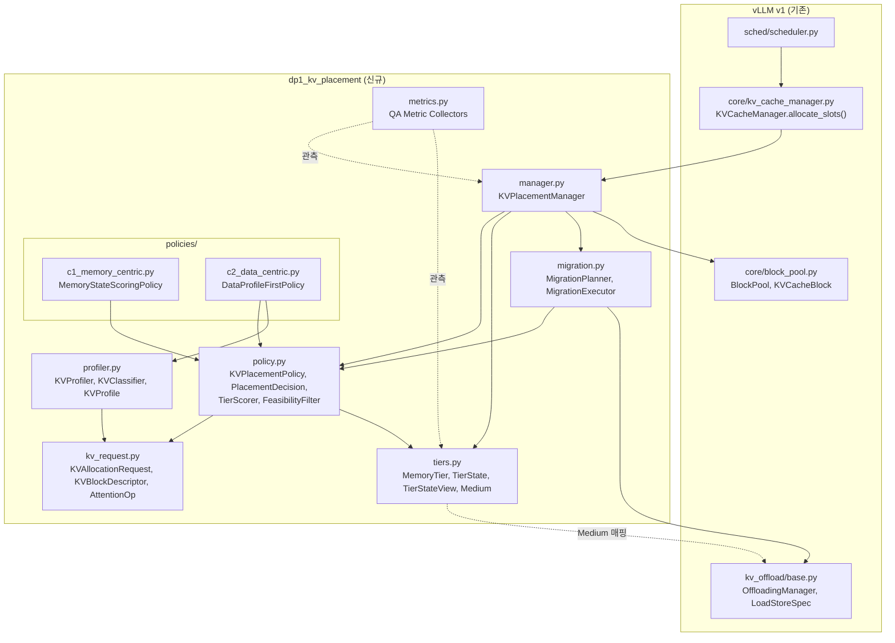
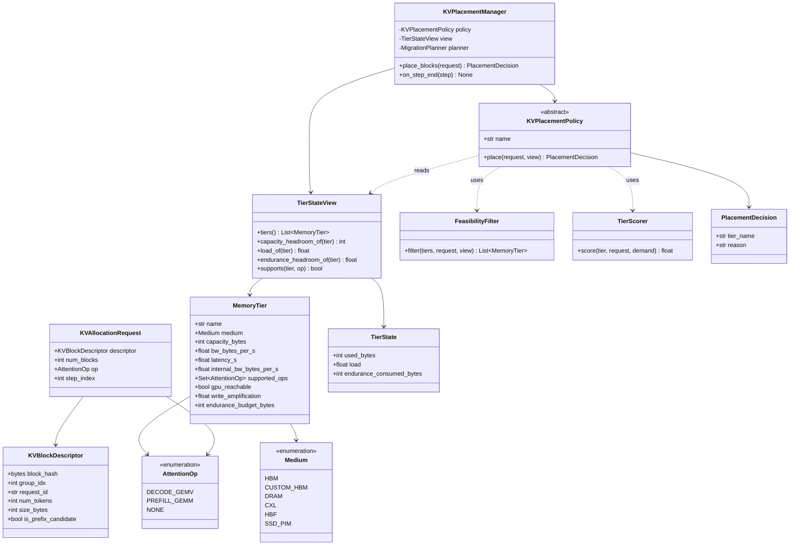
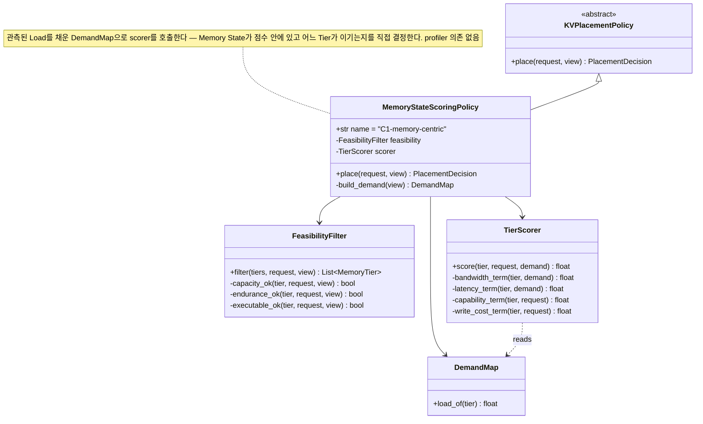
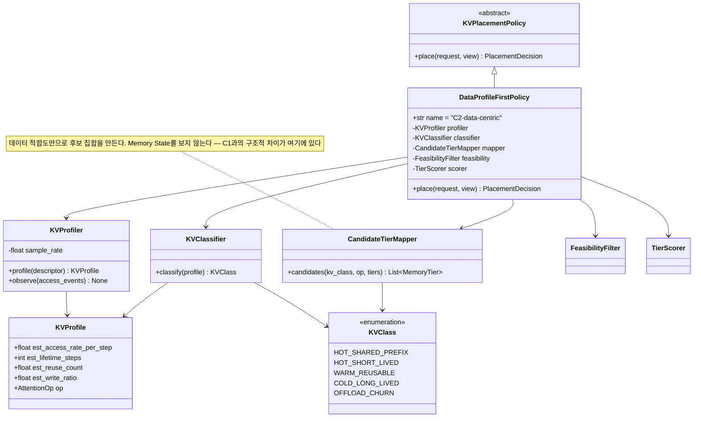
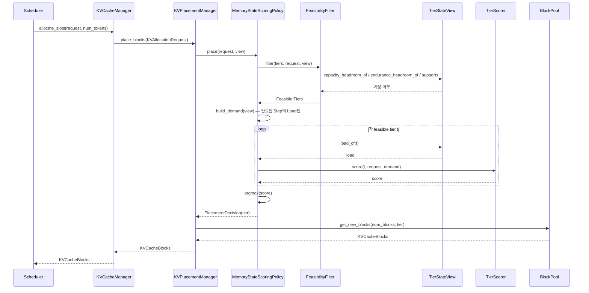
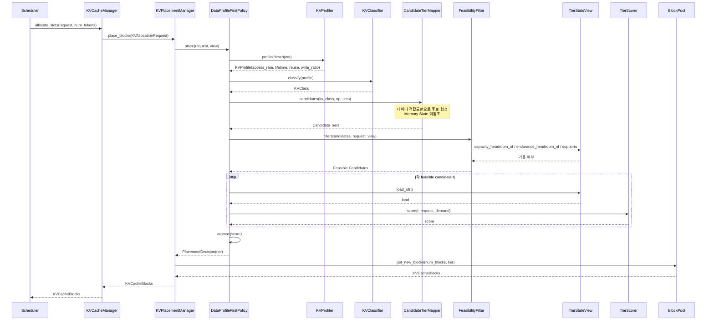

# DP1 구현을 위한 UML 설계

[`dp1-heterogeneous-memory-data-placement.md`](dp1-heterogeneous-memory-data-placement.md)에서 정의한 C1(Memory-centric)/C2(Data-centric) 두 후보를 실제로 구현하기 전에, 구현 구조를 UML로 먼저 명세한다. `dp2-implementation-uml.md`와 같은 형식을 따른다.

vLLM v1의 실제 통합 지점(`KVCacheManager.allocate_slots()`, `BlockPool.get_new_blocks()`, `kv_offload`의 `OffloadingManager`/`LoadStoreSpec`)에 정착시킨다.

본 문서에서 "설계 문서"는 위 DP1 설계 문서를 가리킨다.

---

## 0. 설계 원칙

- **Policy 추상화를 공유한다.** C1/C2는 같은 `KVPlacementPolicy` 인터페이스의 서로 다른 구현이며, `KVPlacementManager`는 어떤 정책이 꽂히든 동일하게 동작한다.
- **Memory State를 읽는 창구를 하나로 제한한다.** 정책은 `TierStateView`를 통해서만 Tier 상태를 읽는다. 두 후보 모두 이 창구를 쓰며, 다른 것은 **언제·어떤 후보 집합에 대해 읽는가**다.
- **Tier Scoring 산술을 공유한다.** C1/C2가 동일한 `TierScorer`를 쓴다. 각자 다른 점수 함수를 주면 비교가 "누가 Heuristic을 더 잘 썼는지"를 재게 된다. 다른 것은 **입력과 시간 지평**뿐이다 — C1은 현재 관측 Load를 넣어 호출하고, C2는 데이터 적합도로 만든 후보 집합에 대해 호출한다.
- **Reactivity는 직교 축이므로 별도 모듈로 분리한다.** `migration.py`는 정책을 교체하지 않고 두 후보 모두에 얹힌다 (§6).
- **vLLM 통합 지점을 좁게 유지한다.** `KVCacheManager.allocate_slots()` 한 곳에서 정책을 호출하고, Tier 분류는 `LoadStoreSpec.medium()`이 반환하는 upstream medium으로 되돌아 매핑한다.

## 1. Module View



두 가지가 구조로 드러난다.

1. **`c1_memory_centric`은 `profiler.py`에 의존하지 않는다.** C1이 추정을 쓰지 않는다는 설계 문서 §3.2가 지적한 추정의 구조적 한계가 모듈 의존성 수준에서 차단된다 — 의존 간선이 없으면 오차가 도달할 경로도 없다.
2. **`metrics.py`는 정책을 import하지 않는다.** 채점자가 정책의 내부 표현이 아니라 실행 결과에서 독립적으로 계산하게 하기 위함이다. 정책이 자기 답을 채점하면 설계 문서 §9의 Metric이 의미를 잃는다.

## 2. Class Diagram

### 2.1 공통 (C1/C2 모두 사용)



`TierStateView`가 정책이 Memory State를 읽는 **유일한 창구**이며, `load_of()`는 **완료된 Step까지만** 평균한다 — 결정 시점에 아직 끝나지 않은 Step의 수요는 알 수 없다. 이 규칙은 두 후보에 동일하게 적용되어 자원 변동을 실제 비용으로 만든다.

`FeasibilityFilter`가 판정하는 것은 Capacity / Endurance Headroom / 연산 실행 가능성이며, **Load는 포함하지 않는다.** Load는 비용이지 feasibility가 아니다 — Load를 feasibility로 취급하면 포화된 빠른 Tier를 피해 훨씬 느린 유휴 Tier로 무한히 spill하게 된다.

### 2.2 C1. MemoryStateScoringPolicy



C1의 `place()`는 3단계다: `feasibility.filter()` → 살아남은 각 Tier에 대해 **현재 관측 Load를 채운** `scorer.score()` → `argmax`. KV Block의 Hotness/Lifetime은 입력에 없다.

### 2.3 C2. DataProfileFirstPolicy



C2의 `place()`는 5단계다: `profiler.profile()` → `classifier.classify()` → `mapper.candidates()`(**데이터 적합도만**) → `feasibility.filter()` → 후보 집합 안에서 `scorer.score()` → `argmax`.

**동일한 `TierScorer`를 쓰되 후보 집합이 이미 데이터 특성으로 좁혀져 있다는 것이 C1과의 유일한 구조적 차이**다. 산술을 공유하지 않으면 §9의 비교가 Heuristic 품질 비교로 변질된다.

`KVProfiler.sample_rate`는 **Profiling 추적 범위**를 나타내며 §9.7의 Sweep 대상이다 — 전수 추적은 실제 시스템에서 성립하지 않는다.

## 3. Sequence Diagram

### 3.1 C1. Memory-centric 배치



C1은 `KVBlockDescriptor`의 **선언된 필드만** 사용하고 Hotness/Lifetime 추정 경로를 전혀 타지 않는다 — C1이 추정 오차에 노출되지 않는다는 성질이 호출 흐름에서 드러나는 지점이다.

### 3.2 C2. Data-centric 배치



C2는 매 Placement마다 `profile` + `classify` + `candidates` 3회가 추가된다 — 이것이 **설계 문서 §9.2 M-P5(Placement Decision Latency)가 측정할 비용의 실체**다. 반대로 후보 집합이 데이터 특성으로 먼저 좁혀지므로 Prefix Block과 Cold Block이 **Memory State를 보기 전에** 갈라진다.

### 3.3 Reactive 재배치 (직교 축, 두 후보 공통)

```mermaid
sequenceDiagram
    participant Eng as Engine
    participant Mgr as KVPlacementManager
    participant Prof as KVProfiler
    participant Plan as MigrationPlanner
    participant Pol as KVPlacementPolicy
    participant Exec as MigrationExecutor
    participant Off as OffloadingManager

    Eng->>Mgr: on_step_end(step)
    opt C2 구성일 때만
        Mgr->>Prof: observe(access_events)
        Note over Prof: sample_rate에 따라<br/>부분 관측
    end
    Mgr->>Plan: plan(view, policy, migration_budget)
    loop 재평가 대상 Block 집합
        Plan->>Pol: place(request, view)
        Pol-->>Plan: PlacementDecision
    end
    Plan-->>Mgr: MigrationPlan (예산 내)
    Mgr->>Exec: execute(plan)
    Exec->>Off: prepare_store / prepare_load
    Off-->>Exec: LoadStoreSpec
    Exec-->>Mgr: MigrationResult(moved, dropped)
```

세 가지를 명시한다.

- **`MigrationPlanner`는 `KVPlacementPolicy` 인터페이스만 알고 C1/C2를 구별하지 않는다.** 설계 문서 §6의 직교성이 구조로 보장된다.
- **Migration 예산이 공유 상수다.** 두 후보에 다른 예산을 주면 비교가 성립하지 않는다.
- **결정 시점 이후 목적지가 차 버린 Migration은 Drop으로 계수한다.** 조용히 성공시키면 설계 문서 §9.6의 무결성 표시가 무의미해진다.

## 4. C1 / C2 구현 구조 비교

| 구분 | C1 (MemoryStateScoringPolicy) | C2 (DataProfileFirstPolicy) |
|---|---|---|
| 핵심 협력 객체 | `FeasibilityFilter`, `TierScorer` | `KVProfiler`, `KVClassifier`, `CandidateTierMapper`, `FeasibilityFilter`, `TierScorer` |
| `TierStateView` 사용 범위 | 전체 Tier에 대해 Capacity/Endurance/Load 조회 | **데이터 특성으로 좁혀진 후보 집합**에 대해서만 조회 |
| Decision 절차 | Feasible Tier 전체 Scoring 후 `argmax` | Profile → Classify → 후보 형성 → Feasible 필터 → Scoring → `argmax` |
| Placement당 호출 비용 | Filter 1회 + Tier 수 × Score | **Profile/Classify/Map 3회** + 후보 수 × Score |
| 추정 의존성 | 없음 (`profiler` 모듈 의존 간선 없음) | 있음 — `KVProfile`의 오차가 후보 집합에 직접 반영 |
| 자원 급변 대응 | 즉각적 — Load가 점수에 직접 들어감 | 간접적 — 후보 집합이 먼저 고정됨 |
| 신규 Tier 등장 시 | Memory State 기준으로 보수적으로 편입 | Capability가 `CandidateTierMapper`에 즉시 반영 |
| Reactive 전환 시 변경 지점 | 없음 (`MigrationPlanner` 공유) | 없음 + `KVProfiler.observe()` 활성화 |

이 표는 설계 문서 §7·§8의 근거를 구현 레벨에서 재확인한 것이며, 설계 문서 §9의 각 Metric이 **구조의 어느 지점을 측정하는지**를 지정한다 — M-P5(Placement Decision Latency)는 "Placement당 호출 비용" 행을, M-P8(추정 오차 민감도)은 "추정 의존성" 행을, M-F1(지원 가능한 신규 Memory 수)은 "신규 Tier 등장 시" 행을 잰다.

---
