# DP1 구현을 위한 UML 설계

[`dp1-heterogeneous-memory-data-placement.md`](dp1-heterogeneous-memory-data-placement.md)에서 정의한 C1(메모리 특성 중심)/C2(Data 특성 중심) 두 후보를 실제로 구현하기 전에, 구현 구조를 UML로 먼저 명세한다. `dp2-implementation-uml.md`와 같은 형식을 따른다.

본 문서에서 "설계 문서"는 위 DP1 설계 문서를 가리킨다. **성능 수치는 담지 않는다** — 구조와 그 구조가 강제하는 제약만 명세하며, 어떤 구성에서 무엇이 얼마나 나오는지는 시뮬레이션이 답한다.

---

## 0. 설계 원칙

- **결정 시점이 두 곳이다.** 설계 문서 §1대로 **결정점 A(Prefill 종료)** 와 **결정점 B(비활성 전환)** 가 있고, 정책 훅은 두 이벤트 모두에 붙는다. 두 지점은 **후보 집합과 입력 특성이 다르므로** 타입 수준에서 구분한다.
- **Prefill은 GPU에 고정된다.** 설계 문서 §4.2에 따라 Prefill Attention은 연산 강도가 높아 근접 연산 유닛으로 보낼 수 없다. **어떤 시퀀스에도 "메모리에서 Prefill을 수행하는" 경로가 없어야 한다** — 이것이 이 구조의 가장 중요한 불변식이다.
- **Policy 추상화를 공유한다.** C1/C2는 같은 `PlacementPolicy` 인터페이스의 서로 다른 구현이며, `PlacementManager`는 어떤 정책이 꽂히든 동일하게 동작한다.
- **설계 문서의 블록 다이어그램을 클래스에 1:1 대응시킨다.** C1의 `Memory State Collector → Placement Planner → Placement Executor`, C2의 `KV Characteristic Analyzer → KV Classifier → Placement Policy → Memory State-aware Refiner → Placement Executor`가 그대로 클래스 이름이 된다.
- **Memory State를 읽는 창구를 하나로 제한한다.** 정책은 `MemoryStateView`를 통해서만 메모리 상태를 읽는다.
- **Tier Scoring 산술을 공유한다.** C1의 `PlacementPlanner`와 C2의 `MemoryStateAwareRefiner`가 동일한 `TierScorer`를 쓴다. 각자 다른 점수 함수를 주면 비교가 "누가 Heuristic을 더 잘 썼는지"를 재게 된다. **그래서 `TierScorer`의 항 분해는 공통 절(§2.1)에 두고 어느 후보의 다이어그램에서도 재선언하지 않는다.**
- **시스템 상태는 데이터 특성과 다른 모듈에 둔다.** `QueueStateView`는 `queue_state.py`에 있고 `analyzer.py` 안에 있지 않다. 설계 문서 §5.4(2)대로 큐 대기 시간은 데이터 특성이 아니라 시스템 상태이므로, **모듈 배치만으로 큐 정보가 C2 전용이 되면 공정성 경계가 깨진다.**
- **두 Planner가 공유하는 비용 산술은 어느 쪽에도 두지 않는다.** `LinkCostModel`은 `link_cost.py`에 있다. `decode_offload.py`에 두면 `prefill_path.py`가 그것을 import하게 되어 바로 위의 분리가 import 그래프에서 무너진다.
- **Decode 오프로드 가능 여부는 메모리가 정하지 정책이 정하지 않는다.** `MemorySpec.can_serve_decode_attention()`이 설계 문서 §4.4의 네 조건(원시 연산·연산 성능·지연·용량)에서 판정한다. 정책이 직접 고르게 하면 §4의 인과가 뒤집힌다.
- **GPU 점유와 메모리 점유를 별도 자원으로 기록한다.** 설계 문서 §4.6의 자원 병렬화가 목적함수에 나타나려면 두 자원을 `max`로 합쳐야 하며, 합산하면 이 DP의 논거가 사라진다.
- **유휴 중 재조정은 직교 축이므로 별도 모듈로 분리한다** (설계 문서 §8).

---

## 1. Module View

세 장을 그린다. **§1.1은 통합 뷰**로 vLLM과의 연결을 보이고, **§1.2와 §1.3은 후보별 뷰**로 C1과 C2가 각각 어떤 모듈을 실제로 활성화하는지를 보인다. **§1.4가 두 뷰의 차이를 읽는다.**

> **왜 후보별로 나눠 그리는가.** 통합 뷰는 두 후보가 쓰는 모듈의 **합집합**이므로, 어느 후보가 무엇을 쓰지 **않는지**가 보이지 않는다. C1/C2 비교의 상당 부분이 "C1은 추정 경로를 타지 않는다"에 걸려 있는데, 그것이 통합 뷰에서는 서술로만 남는다. 후보별 뷰에서는 **그 모듈이 그래프에 없다**는 사실로 드러난다.

### 1.1 통합 뷰 — vLLM과의 연결

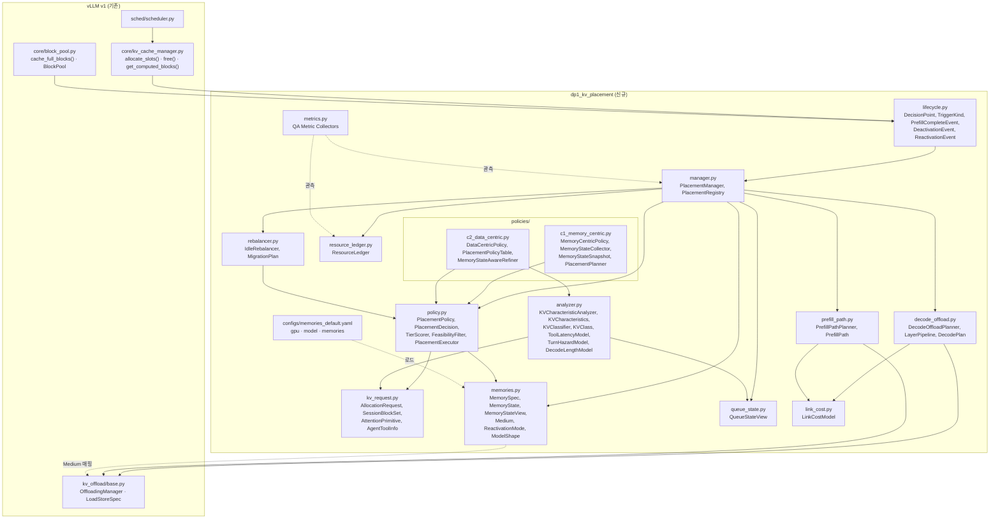

일곱 가지가 구조로 드러난다.

1. **`prefill_path.py`와 `decode_offload.py`가 분리되어 있다.** 설계 문서 §4.2의 결론 — Prefill은 GPU, Decode Attention만 오프로드 — 이 **모듈 경계로 강제된다.** `prefill_path.py`에는 메모리로 연산을 보내는 경로가 아예 없고, 복원할지 스트리밍할지만 정한다.
2. **정책 훅이 `lifecycle.py`를 통해서만 들어온다.** 결정점 A는 `allocate_slots` 이후 Prefill이 끝난 시점, 결정점 B는 `free()`/선점/`cache_full_blocks()` 시점이다.
3. **`c1_memory_centric`은 `analyzer.py`에 의존하지 않는다.** 의존 간선이 없으면 추정 오차가 도달할 경로도 없으므로, M-P8의 증폭률이 C1에서 정확히 0인 것이 구현 구조에서 보장된다. **§1.2에서 그 모듈이 그래프에 아예 없는 것으로 다시 확인된다.**
4. **`configs/memories_default.yaml`이 `memories.py`로만 들어온다.** 설계 문서 §3.4의 Configuration 교체가 코드 수정 없이 되어야 M-F1 실험이 성립한다. `gpu`·`model` 블록도 같은 경로로 들어오며, `model`의 `num_heads/num_kv_heads`가 §4.2의 연산 강도를 정한다.
5. **`metrics.py`는 정책을 import하지 않고 `resource_ledger`를 관측한다.** 정책이 자기 답을 채점하면 설계 문서 §11의 Metric이 의미를 잃는다.
6. **`queue_state.py`가 `analyzer.py` 밖에 독립 모듈로 있다.** 설계 문서 §5.4(2)대로 **큐 대기 시간은 데이터 특성이 아니라 시스템 상태**이므로 두 후보가 동등하게 접근할 수 있어야 한다. `QueueStateView`를 `analyzer.py` 안에 두면 **모듈 배치만으로 큐 정보가 C2 전용이 되어 공정성 경계가 깨진다** — 그래서 별도 모듈이다.
7. **`link_cost.py`가 `decode_offload.py`와 `prefill_path.py` 양쪽에서 쓰이는 독립 모듈이다.** `LinkCostModel`을 `decode_offload.py` 안에 두면 `prefill_path.py`가 `decode_offload.py`를 import하게 되어, **관찰 1의 분리가 import 그래프에서 무너진다.** 두 모듈이 공유하는 비용 산술은 어느 쪽에도 속하지 않아야 한다.

### 1.2 C1 모듈 뷰 — 메모리 특성 중심

**C1이 실제로 활성화하는 모듈만 그린다.** 점선 상자는 **요청에 실려 오지만 C1이 읽지 않는** 것이다.

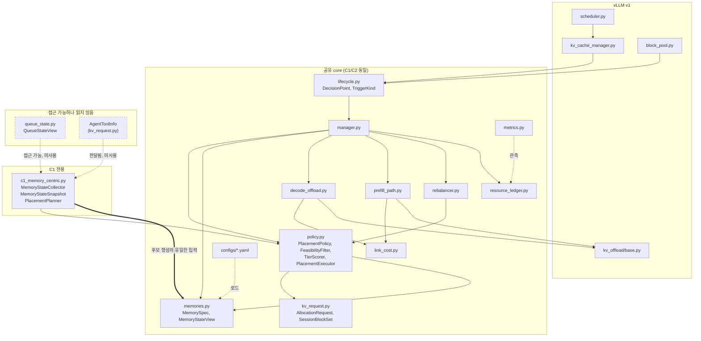

**굵은 간선이 C1의 정의다.** `c1_memory_centric`에서 `memories.py`로 가는 간선 하나가 후보 형성의 **유일한** 입력이며, 그래프에 `analyzer.py`가 **존재하지 않는다.**

- **추정 모델이 그래프에 없다.** `ToolLatencyModel` · `TurnHazardModel` · `DecodeLengthModel`이 어디에도 나타나지 않으므로, M-P8의 증폭률이 0인 것이 **서술이 아니라 그래프의 성질**이다.
- **점선 두 개가 C1의 설계 선택을 보여준다.** `QueueStateView`와 `AgentToolInfo`는 **접근 가능한데 쓰지 않는 것**이지 받지 못하는 것이 아니다. 설계 문서 §5.4(2)의 공정성 경계가 여기 있다 — C1이 큐 정보를 못 봐서 진 것이라면 그것은 정보 격차이지 설계 우열이 아니다.
- **활성 모듈 13개** — 공유 core 12 + C1 전용 1. `queue_state.py`는 접근 가능하나 읽지 않으므로 세지 않았다.

### 1.3 C2 모듈 뷰 — Data 특성 중심

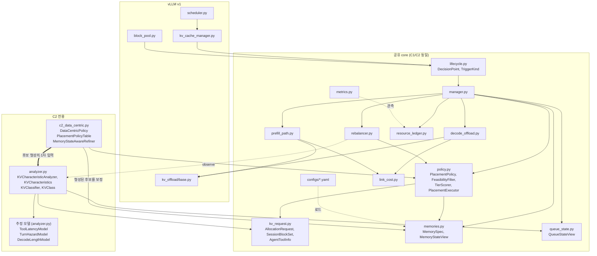

**C1과 비교해 늘어난 것은 `analyzer.py`와 `c2_data_centric.py` 둘이고, 줄어든 것은 없다.** C1의 모듈 집합이 C2의 **진부분집합**이다.

- **`c2_data_centric → memories.py` 간선이 굵지 않다.** C2도 Memory State를 읽지만 **후보를 형성한 뒤 보정하는 용도**다. C1에서 굵었던 간선이 C2에서는 가늘어지는 것 — 이것이 §1.4의 핵심이다.
- **`rebalancer → analyzer`의 `observe` 간선이 C2에만 있다.** 세 추정 모델의 유일한 갱신 경로이며(§3.7), **C1에는 갱신할 모델이 없으므로 이 간선도 없다.**
- **활성 모듈 15개** — 공유 core 13(`queue_state.py` 포함) + C2 전용 2. `추정 모델` 상자는 `analyzer.py` 안의 묶음이지 별도 모듈이 아니다.

### 1.4 두 뷰의 차이가 말하는 것

**차이는 모듈 두 개가 아니라 정보가 흐르는 방향이다.** 설계 문서 §1의 핵심 설계 질문 — *"메모리 자원 특성과 KV 캐시의 데이터 특성 중 무엇을 1차 기준으로 배치를 결정할 것인가"* — 가 그래프에서 **후보 형성 단계로 들어가는 굵은 간선이 어디서 오는가**로 나타난다.

```text
C1     MemoryStateView ══► 후보 형성 ──► TierScorer arg max
                                          ▲
       (KV 데이터 특성은 그래프에 없다)     └ Memory State가 점수 안에서 승자를 직접 정한다


C2     KVCharacteristics ══► 후보 형성 ──► MemoryStateView 보정 ──► TierScorer arg max
              ▲                                    ▲
              └ analyzer.py                        └ 이미 좁혀진 후보 안에서만 작동
```

**`TierScorer`가 양쪽 끝에 동일하게 있다는 것이 비교 가능성의 전제다.** 산술을 공유하지 않으면 설계 문서 §11의 비교가 "누가 Heuristic을 더 잘 썼는지"를 재게 된다.

#### 구조 차이의 정량

| | **C1** | **C2** | 차이가 재는 것 |
|---|---:|---:|---|
| 활성 모듈 수 | 13 | 15 | — |
| 후보 전용 모듈 | 1 | 2 | — |
| **추정 모델 수** | **0** | **3** | **M-P8** — 증폭률이 C1에서 0인 구조적 근거 |
| 후보 형성의 1차 입력 | `MemoryStateView` | `KVCharacteristics` | 설계 문서 §1의 핵심 질문 그 자체 |
| 결정당 협력 객체 호출 | Collect 1 + 후보수×Score | Analyze·Classify·Candidates 3 + 후보수×Score | **M-P5** — 결정 지연 |
| 받지만 읽지 않는 입력 | `QueueStateView`, `AgentToolInfo` | 없음 | 설계 문서 §5.4(2) 공정성 경계 |
| **신규 메모리 추가 시 변경 지점** | `configs/*.yaml` (+`Medium`) | 동일 | **M-M2** — §1.4.1 |
| 추정 모델 갱신 경로 | 없음 | `rebalancer → analyzer.observe()` | M-P8의 품질을 정하는 경로 |

#### 1.4.1 신규 메모리 추가 시 변경 지점이 같다 — 확인이 필요한 지점

두 뷰 모두에서 **`configs/*.yaml` → `memories.py`가 유일한 유입 경로**이고 정책 모듈로 가는 별도 간선이 없다. 구조상으로는 **M-M2(변경 지점 수)가 두 후보에서 같아야 한다.**

그러나 C2의 `PlacementPolicyTable.candidates(kv_class, primitives, memories)`가 **KV Class별로 어느 메모리를 후보로 낼지**를 정한다. 이 매핑이

- **원시 연산 지원 여부로 일반 판정**하면 → 신규 메모리가 코드 수정 없이 편입된다. 변경 지점 C1 = C2
- **메모리 이름이나 `Medium` 값을 열거**하면 → 신규 메모리마다 표를 고쳐야 한다. 변경 지점 C2 = C1 + 1

**§2.3의 클래스 다이어그램은 이 둘을 구분하지 않는다.** `candidates()`의 시그니처는 `memories`를 인자로 받으므로 일반 판정이 가능한 형태이지만, 강제되지는 않는다. **M-F1과 M-M2가 이 구현 선택에 직접 걸려 있으므로**, `PlacementPolicyTable`이 `Medium`을 열거하지 않는다는 것이 구현 규약으로 고정되어야 한다 — 그렇지 않으면 측정된 Flexibility 차이가 설계의 차이가 아니라 구현자의 선택이 된다.

---

## 2. Class Diagram

### 2.1 공통 (C1/C2 모두 사용)

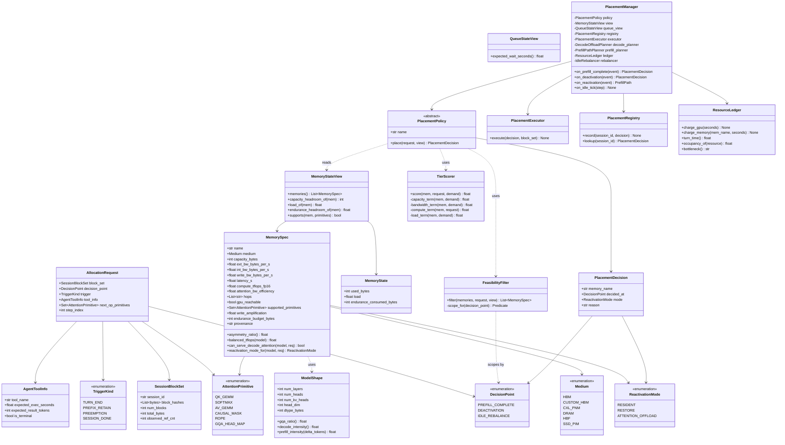

여섯 가지 설계 결정이 이 다이어그램에 들어 있다.

**`DecisionPoint`가 요청에 실려 있고 `FeasibilityFilter`가 그것으로 후보 범위를 정한다.** 설계 문서 §1의 두 결정점은 **후보 집합이 다르다.**

```text
PREFILL_COMPLETE → can_serve_decode_attention()== true 인 메모리만
                   (설계 문서 §4.4의 네 조건을 통과한 것)
DEACTIVATION     → 전체. 보관만 하면 되므로 연산 기능이 없어도 된다
```

정책이 후보 범위를 직접 정하게 하면 두 결정점의 차이가 정책 구현 안에 숨어 C1/C2 비교가 흐려진다.

**`ModelShape`가 `MemorySpec`의 판정에 들어간다.** 설계 문서 §4.2의 연산 강도가 `num_heads / num_kv_heads`에서 나오므로, **오프로드 가능 여부는 메모리 단독이 아니라 (메모리 × 모델)의 함수**다. `balanced_tflops(model)`이 §4.2의 균형점(`내부 대역폭 × GQA 비율`)을 계산하고, `can_serve_decode_attention()`이 그것과 `compute_tflops_fp16`을 비교한다.

**`can_serve_decode_attention()`이 §4.4의 네 조건을 한 곳에 모은다.**

```text
supported_primitives ⊇ {QK_GEMM, SOFTMAX, AV_GEMM, CAUSAL_MASK}   원시 연산
compute_tflops_fp16 이 balanced_tflops(model)에 근접                연산 성능
num_layers × latency_s 가 step 예산 이내                            지연
capacity_headroom ≥ block_set.total_bytes                          용량
```

**`AttentionPrimitive`가 연산 단위가 아니라 원시 연산 단위다.** "GEMV를 지원한다"와 "Attention을 처리할 수 있다"는 다르다 — `SOFTMAX`가 없는 메모리는 첫 조건에서 탈락한다.

**`ResourceLedger`가 GPU와 메모리 점유를 따로 기록하고 `turn_time()`이 `max`를 반환한다.** 설계 문서 §4.6의 자원 병렬화가 목적함수에 나타나는 유일한 경로이며, `sum`으로 바꾸면 이 DP의 논거가 측정되지 않는다. `bottleneck()`이 어느 자원이 한계인지 돌려주어 M-P7b가 이를 관측한다.

**`QueueStateView`는 두 후보 모두 접근 가능하다.** 설계 문서 §5.4(2) — Next-access Time의 큐 성분은 데이터 특성이 아니라 시스템 상태이므로, C2만 쓰게 하면 공정성 경계가 깨진다.

`MemoryStateView.load_of()`는 **완료된 Step까지만** 평균하고, `FeasibilityFilter`는 Capacity/Endurance/원시 연산만 판정하며 **Load는 포함하지 않는다** — Load는 비용이지 feasibility가 아니다. `SessionBlockSet`이 배치 단위인 것은 설계 문서 §5.2(2)의 all-or-nothing 재접근 때문이다.

### 2.2 C1. 메모리 특성 중심 배치 구조

설계 문서 §7 C1의 블록 다이어그램을 그대로 클래스화한다.

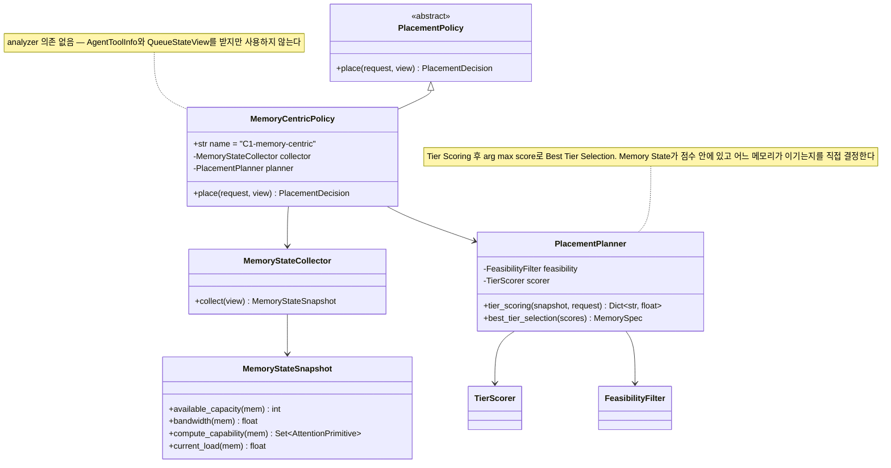

C1의 `place()`는 3단계다: `collector.collect()` → `planner.tier_scoring()` → `planner.best_tier_selection()` (arg max).

**`compute_term()`이 Compute Capability를 가점으로만 반영한다.** 그래서 결정점 A에서 "이 세션은 Decode가 길 것이니 연산형 메모리로 옮길 값이 있다"는 판단이 나오지 않는다 — 설계 문서 §7 C1 단점("Operation-Compute capability 간 적합성 판단에 한계")의 구현 레벨 근거다. 후보 범위 자체는 `FeasibilityFilter`가 `DecisionPoint`로 좁혀주므로 C1도 잘못된 메모리를 고르지는 않는다.

### 2.3 C2. Data 특성 중심 배치 구조

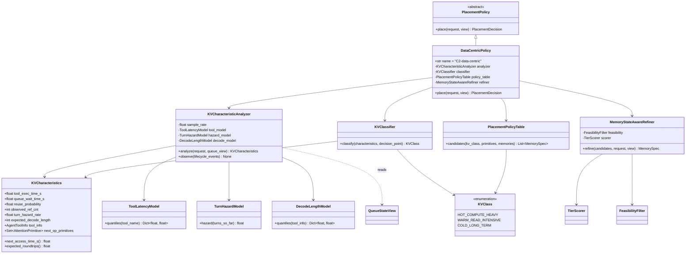

C2의 `place()`는 4단계다: `analyzer.analyze()` → `classifier.classify()` → `policy_table.candidates()`(**KV Class + 재활성 연산만**) → `refiner.refine()`(Memory State로 보정).

**`MemoryStateAwareRefiner`가 C1과 동일한 `TierScorer`를 쓰되 후보 집합이 이미 데이터 특성으로 좁혀져 있다는 것이 유일한 구조적 차이**다. 산술을 공유하지 않으면 설계 문서 §11의 비교가 Heuristic 품질 비교로 변질된다.

`KVCharacteristics`의 필드 구성이 설계 문서 §5.4의 타당성 검토를 반영한다.

| 필드 | 왜 이 형태인가 |
|---|---|
| `tool_exec_time_s` / `queue_wait_time_s` 분리, `next_access_time_s()`는 파생 | §5.4(2) — 큐 성분은 시스템 상태다. 분리하지 않으면 C2가 C1보다 많은 정보를 보게 되어 공정성 경계가 깨진다. `QueueStateView`는 **두 후보 모두** 접근 가능하다 |
| `observed_ref_cnt`(관측)와 `reuse_probability`(추정)를 **따로** 들고 있음 | §5.4 — 관측 성분과 추정 성분을 구분하지 않으면 C2가 실제보다 정확해 보인다. Ablation에서 추정 성분만 제거할 수 있어야 한다 |
| `turn_hazard_rate` + `expected_roundtrips()` (남은 턴 수 점추정 아님) | §5.4(3) — "몇 턴 남았나"는 예측이 어렵지만 "다음 턴이 있을 확률"은 로그에서 추정된다 |
| **`expected_decode_length`** | **설계 문서 §5.1의 결정점 A용 특성.** 이번 턴의 Decode가 몇 step 이어지는지가 §4.6의 자원 병렬화 지속 구간을 정한다 |
| 세 모델 모두 점 추정이 아니라 `quantiles()` / `hazard()` | §5.4 — `code_execution`처럼 분산이 자릿수로 큰 Tool이 있어 평균으로 쓰면 자주 틀린다 |

**`KVClassifier.classify()`가 `decision_point`를 받는다.** 결정점 A는 `expected_decode_length`와 재활성 연산으로 분류하고, 결정점 B는 `next_access_time_s()`·`reuse_probability`로 분류한다 — 같은 특성 집합에서 **다른 축을 쓴다.**

> **`ToolLatencyModel`·`TurnHazardModel`·`DecodeLengthModel`은 `observe()`로만 갱신된다**(본 문서 §3.7 유휴 중 재조정). 실제 유휴 시간, 다음 턴 발생 여부, 실제 생성 길이는 사후에만 관측되므로, 이 세 모델의 품질이 곧 M-P8의 증폭률이 된다.

### 2.4 실행 경로 — Prefill과 Decode를 분리하는 두 Planner

설계 문서 §4의 결론을 **모듈 분리로 강제한다.** `PrefillPathPlanner`에는 메모리로 연산을 보내는 경로가 없고, `DecodeOffloadPlanner`는 Decode에만 쓰인다.

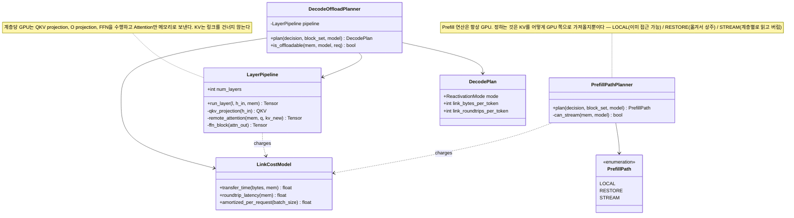

**`PrefillPath`에 오프로드 항목이 없는 것이 설계 문서 §4.2(1)의 구조적 표현이다.** 세 선택지는 모두 "GPU가 연산한다"를 전제로 하며, 다른 것은 KV를 어떻게 공급하느냐뿐이다.

- **`LOCAL`** — KV가 이미 GPU가 읽을 수 있는 곳에 있다. 추가 비용 없음.
- **`RESTORE`** — KV를 상위 계층으로 옮긴 뒤 연산한다. **옮긴 KV가 용량을 점유한다.**
- **`STREAM`** — 계층별로 읽어 연산하고 버린다. **용량을 점유하지 않는다.** `can_stream()`이 그 메모리의 외부 대역폭으로 전송이 GPU 연산 아래에 숨는지 판정한다(설계 문서 §4.5).

`DecodePlan`이 `link_bytes_per_token`과 `link_roundtrips_per_token`을 **분리해서** 들고 있는 것은 설계 문서 §4.3 때문이다 — 오프로드 비용은 바이트(전송)와 왕복 횟수(지연)로 나뉘고, **후자만 배치 크기에 반비례**한다. 하나로 합치면 배치 크기 Sweep의 효과가 사라진다.

---

## 3. Sequence Diagram

### 3.1 결정점 A — C1 (메모리 특성 중심)

설계 문서 §1의 결정점 A다. **Prefill은 이미 GPU에서 끝났고, 이번 턴의 Decode Attention을 어디서 돌릴지를 정한다.**

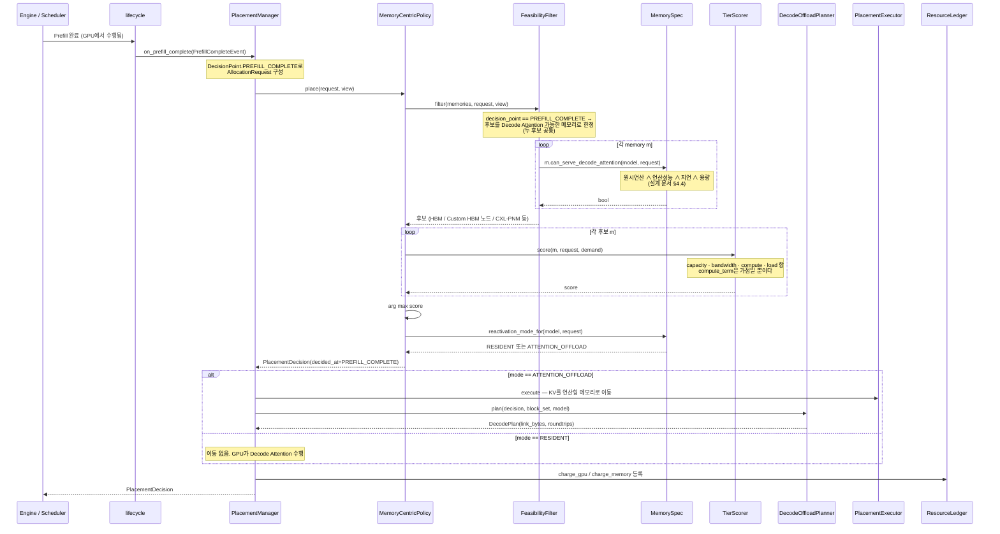

**후보가 `can_serve_decode_attention()`으로 좁혀지는 것이 이 결정점의 핵심**이다. DRAM·HBF·SSD-PIM은 여기서 탈락하므로, "갓 만든 KV를 하위 계층에 두고 Decode 때 되가져오는" 경로가 **구조적으로 생길 수 없다.** 이 좁히기는 `FeasibilityFilter`가 하므로 **두 후보에 동일하게 적용된다.**

**C1이 이 결정점에서 쓰는 정보는 Memory State뿐이다.** `compute_term()`이 Compute Capability를 가점으로 반영하지만, **"이번 턴의 Decode가 길 것이니 연산형 메모리로 옮길 값이 있다"는 판단은 나오지 않는다** — 그 판단에 필요한 `expected_decode_length`가 C1의 입력에 없기 때문이다. 설계 문서 §7 C1 단점("Operation-Compute capability 간 적합성 판단에 한계")이 이 결정점에서 가장 크게 드러난다.

### 3.2 결정점 A — C2 (Data 특성 중심)

같은 이벤트, 같은 후보 좁히기. **다른 것은 좁혀진 후보 안에서 무엇을 보고 고르는가**이다.

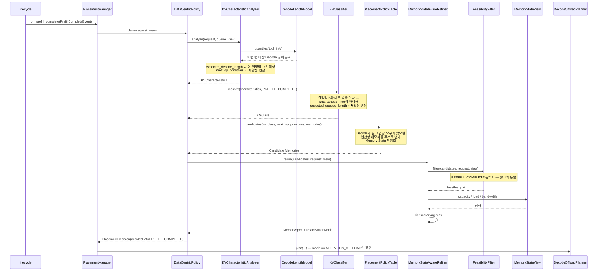

**§3.1과 나란히 놓고 보면 결정점 A에서의 차이가 한 가지로 좁혀진다.**

```text
C1   후보(feasible 전체) ──► TierScorer arg max
                              └ compute_term은 가점. "옮길 값이 있는가"를 묻지 않는다

C2   expected_decode_length ──► KVClass ──► 후보 형성 ──► TierScorer arg max
                                              └ "이번 턴 Decode가 길다 → 연산형 메모리로 옮길 값이 있다"
```

**이것이 결정점 A가 존재하는 이유와 직결된다.** [ADR-003](adr/adr-003-two-decision-points.md)은 연산형 메모리가 있어야 이 결정점이 실재한다고 적었다. **그 메모리를 쓸지 말지를 판단하는 정보를 C2만 갖고 있으므로, 결정점 A는 두 후보의 격차가 가장 크게 벌어질 지점이다** — 그리고 그 격차는 `DecodeLengthModel`의 추정 품질에 걸려 있어 M-P8의 민감도가 여기서 가장 높게 나타날 것으로 예상된다.

> **이 예상 자체가 측정 대상이다.** 설계 문서 §11.6의 Sweep에 "턴당 생성 토큰 수 N"이 들어 있는 것이 이 축이며, **결정점별로 M-P5와 M-P8을 분리 보고**해야 이 예상이 확인되거나 반증된다.

### 3.3 결정점 B — C1 (메모리 특성 중심)

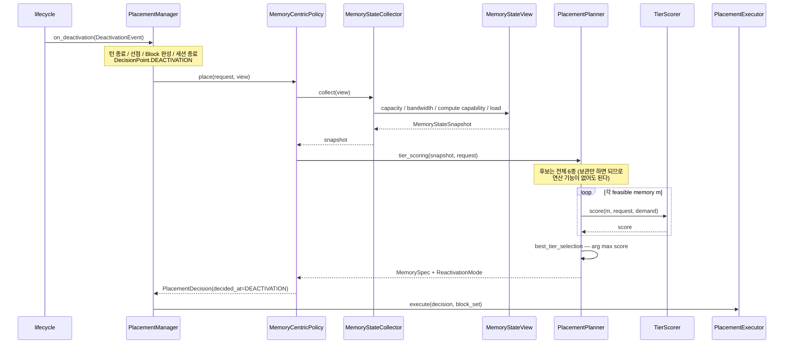

C1은 `AgentToolInfo`와 `QueueStateView`를 **요청에 받아두지만 읽지 않는다.** 추정 경로를 전혀 타지 않으므로 추정 오차에 노출되지 않는다는 성질이 호출 흐름에서 드러난다.

### 3.4 결정점 B — C2 (Data 특성 중심)

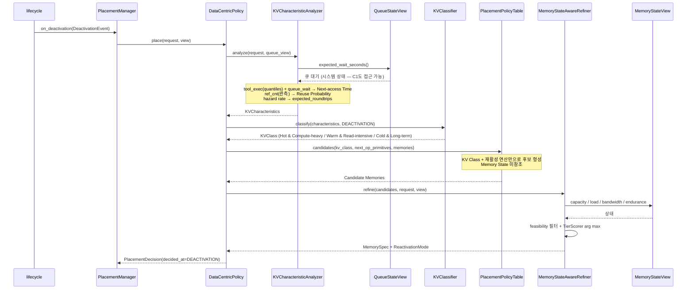

C2는 결정마다 `analyze` + `classify` + `candidates` 3회가 추가된다 — **설계 문서 §11.2 M-P5(Placement Decision Latency)가 측정할 비용의 실체**다.

### 3.5 Decode 실행 — Attention 오프로드 계층 파이프라인

결정점 A에서 `ATTENTION_OFFLOAD`가 선택된 경우의 Decode step이다. 설계 문서 §4.1의 계층 분해가 실제 호출로 나타난다.

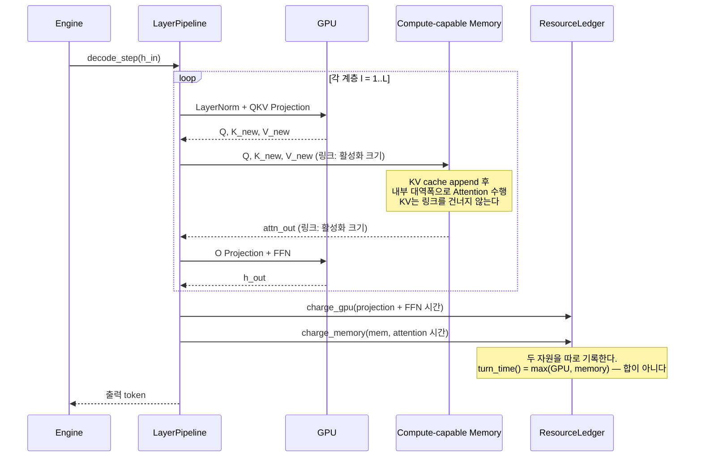

**`ResourceLedger`에 두 자원을 따로 charge하는 것이 설계 문서 §4.6의 자원 병렬화가 목적함수에 들어가는 지점**이다. 여기서 `sum`을 쓰면 오프로드는 언제나 손해로 계산되어 이 DP의 논거가 사라진다.

계층 루프가 매번 링크를 두 번 건너는 것이 설계 문서 §4.3이 말한 왕복 비용이며, 배치 안의 여러 요청이 같은 계층을 함께 처리할 때 상쇄된다(`LinkCostModel.amortized_per_request`).

### 3.6 재활성 — Prefill은 GPU, KV 공급 경로만 선택

결정점 B에서 하위 계층으로 내려간 KV가 다시 필요해진 경우다. **설계 문서 §4.2(1)에 따라 Prefill 연산은 어느 경로에서도 GPU가 수행한다** — 정하는 것은 KV를 어떻게 공급하느냐뿐이다.

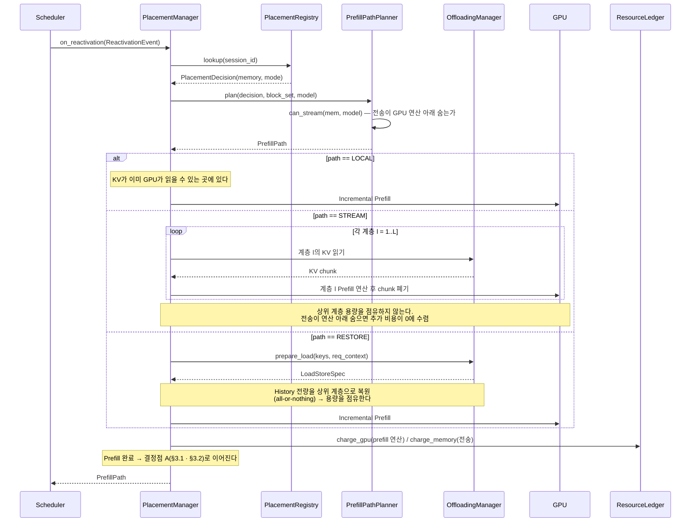

**어느 분기에도 "메모리에서 Prefill을 수행하는" 경로가 없다.** 이것이 설계 문서 §4.2(1)의 구조적 표현이며, §0에서 선언한 불변식이다.

재활성이 끝나면 다시 **결정점 A**로 이어진다 — 이번 턴의 Decode를 어디서 돌릴지를 새로 정하므로, 세션의 KV 위치는 턴마다 바뀔 수 있다.

### 3.7 유휴 중 재조정 (직교 축, 두 후보 공통)

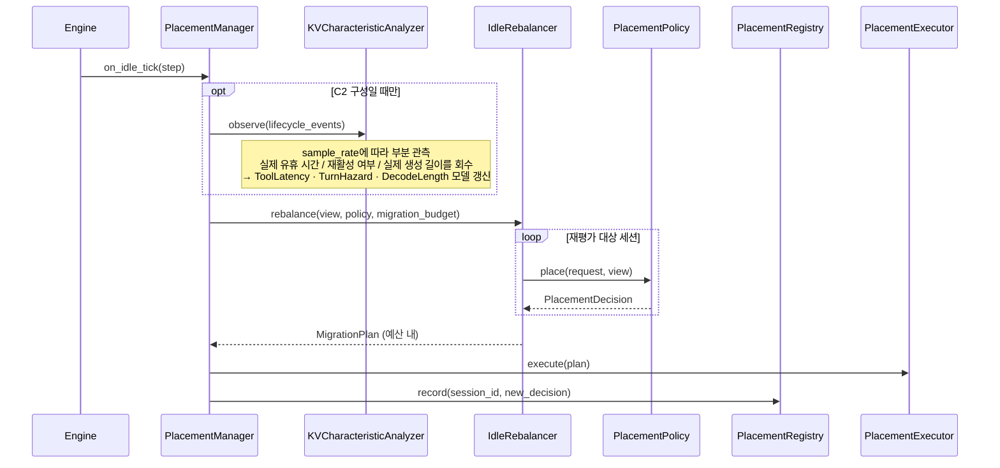

세 가지를 명시한다.

- **`IdleRebalancer`는 `PlacementPolicy` 인터페이스만 알고 C1/C2를 구별하지 않는다.** 설계 문서 §8의 직교성이 구조로 보장된다.
- **Migration 예산이 공유 상수다.** 두 후보에 다른 예산을 주면 비교가 성립하지 않는다.
- **`observe()`가 세 추정 모델의 유일한 갱신 경로다.** 실제 유휴 시간, 다음 턴 발생 여부, 실제 생성 길이는 사후에만 관측되므로 이 경로의 품질이 곧 M-P8의 증폭률이 된다.

---

## 4. C1 / C2 구현 구조 비교

§1.4가 **모듈 수준**의 차이를, 아래 표가 **클래스·호출 수준**의 차이를 정리한다. 두 층에서 같은 결론이 나오는지가 이 문서의 내적 정합성이다.

| 구분 | C1 (MemoryCentricPolicy) | C2 (DataCentricPolicy) |
|---|---|---|
| 핵심 협력 객체 | `MemoryStateCollector`, `PlacementPlanner`, `TierScorer` | `KVCharacteristicAnalyzer`, `KVClassifier`, `PlacementPolicyTable`, `MemoryStateAwareRefiner`, `TierScorer` |
| `MemoryStateView` 사용 범위 | 후보 전체에 대해 Capacity/BW/Compute/Load 조회 | **KV Class로 좁혀진 후보**에 대해서만 조회 |
| Decision 절차 | Collect → Tier Scoring → Best Tier Selection (arg max) | Analyze → Classify → Candidates → Refine (arg max) |
| 결정당 호출 비용 | Collect 1회 + 후보 수 × Score | **Analyze/Classify/Candidates 3회** + 후보 수 × Score |
| **결정점 A 입력** | Memory State만 (§3.1) | **`expected_decode_length`** + 재활성 연산 — 옮길 값이 있는지 판단 (§3.2) |
| **결정점 B 입력** | Memory State만 (§3.3) | Next-access Time / Reuse Probability / expected_roundtrips (§3.4) |
| 추정 의존성 | 없음 (`analyzer` 모듈 의존 간선 없음) | 있음 — `KVCharacteristics`의 오차가 후보 집합에 직접 반영 |
| `AgentToolInfo` 활용 | 받지만 사용 안 함 | 세 추정 모델의 1차 입력 |
| `QueueStateView` 활용 | 접근 가능하나 사용 안 함 | Next-access Time의 큐 성분 |
| 재활성 연산 활용 | `TierScorer.compute_term()`의 가점 | **`PlacementPolicyTable`의 후보 형성 입력** |
| 자원 급변 대응 | 즉각적 — Load가 점수에 직접 들어감 | 간접적 — 후보 집합이 먼저 고정됨 |
| 신규 메모리 등장 시 | Memory State 기준으로 보수적으로 편입 | 원시 연산 지원 여부가 `PlacementPolicyTable`에 즉시 반영 |
| 유휴 재조정 전환 시 변경 지점 | 없음 (`IdleRebalancer` 공유) | 없음 + `KVCharacteristicAnalyzer.observe()` 활성화 |

이 표는 설계 문서 §9·§10의 근거를 구현 레벨에서 재확인한 것이며, 설계 문서 §11의 각 Metric이 **구조의 어느 지점을 측정하는지**를 지정한다.

| Metric | 이 문서에서 재는 지점 |
|---|---|
| M-P1 (Goodput) | §2.1 `ResourceLedger.turn_time()` — GPU/메모리 점유의 `max` |
| M-P2 (재활성 TTFT) | §3.6의 `PrefillPath` 분기별 KV 공급 비용 |
| M-P3 (TPOT) | §2.4 `LinkCostModel` — 바이트와 왕복을 분리 계상 |
| M-P5 (Decision Latency) | §4 "결정당 호출 비용" |
| M-P7 (오프로드 채택률) | §3.1 · §3.2에서 `ATTENTION_OFFLOAD`가 선택된 비율 |
| M-P7b (GPU 점유율·자원 병렬도) | §2.1 `ResourceLedger.occupancy_of()` / `bottleneck()` |
| M-P8 (추정 오차 민감도) | §4 "추정 의존성" — Ablation은 `KVCharacteristics`의 필드 단위로 수행 |
| M-F1 (지원 가능한 신규 Memory 수) | §1의 `configs/memories_default.yaml` → `memories.py` 단일 경로 |
