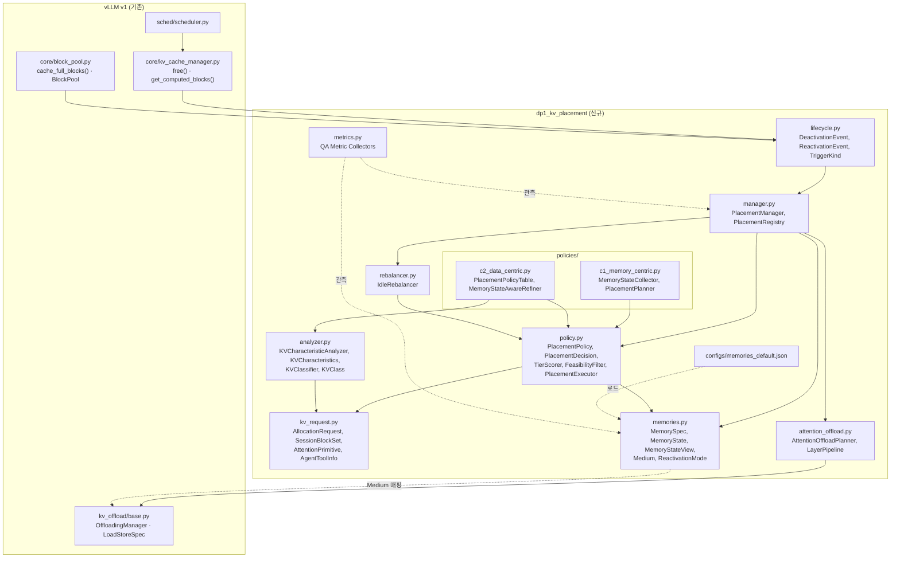
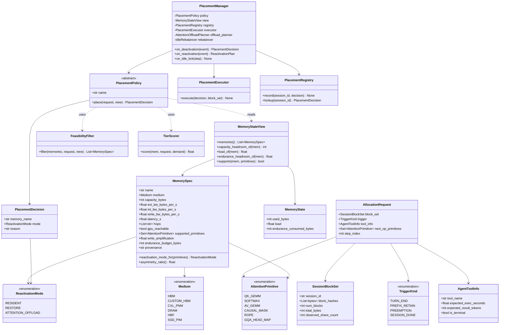
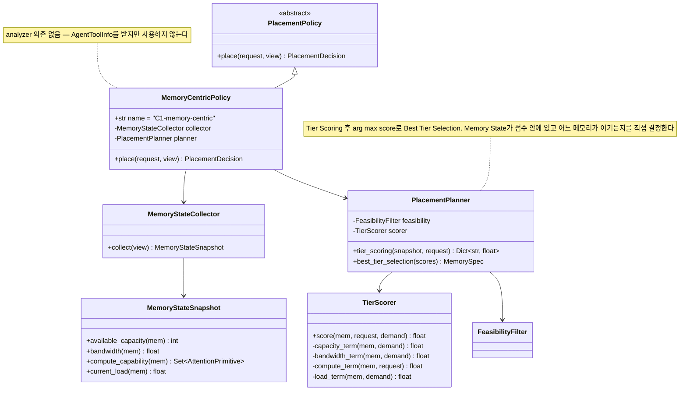
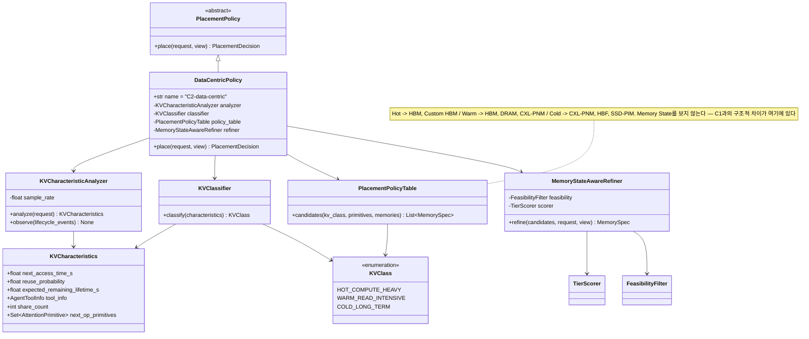
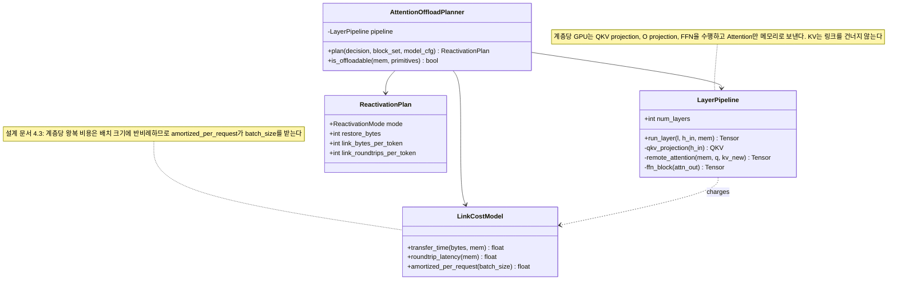
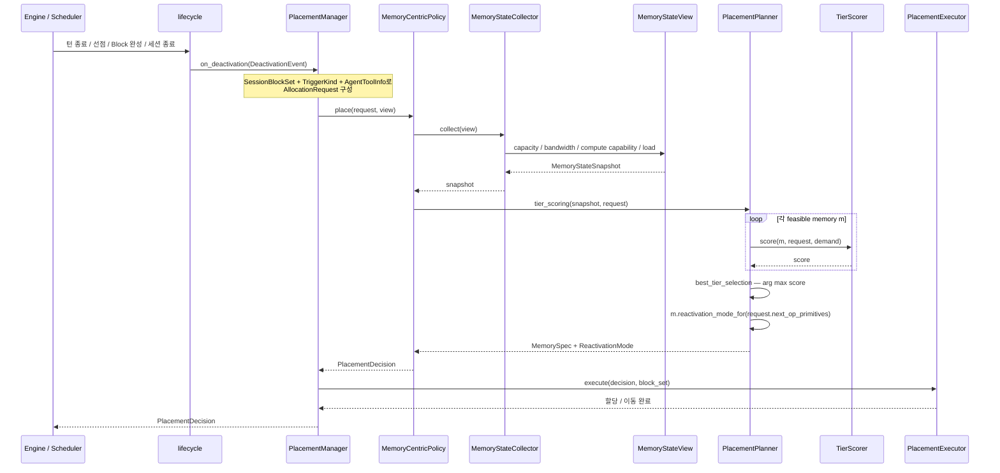
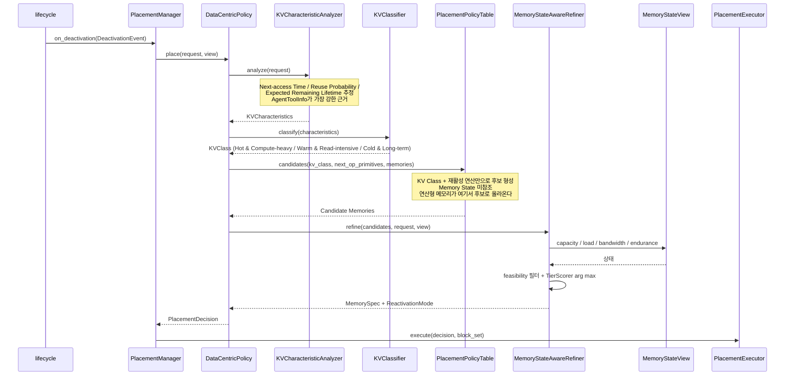
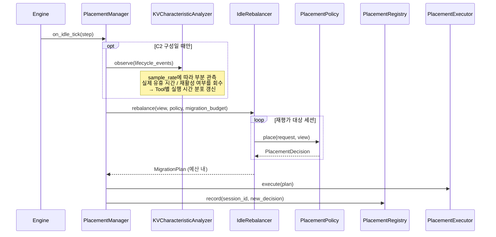

# DP1 구현을 위한 UML 설계

[`dp1-heterogeneous-memory-data-placement.md`](dp1-heterogeneous-memory-data-placement.md)에서 정의한 C1(메모리 특성 중심)/C2(Data 특성 중심) 두 후보를 실제로 구현하기 전에, 구현 구조를 UML로 먼저 명세한다. `dp2-implementation-uml.md`와 같은 형식을 따른다.

본 문서에서 "설계 문서"는 위 DP1 설계 문서를 가리킨다.

---

## 0. 설계 원칙

- **결정은 비활성 전환 이벤트에서 일어난다.** 설계 문서 §1대로 활성 Decode 중인 KV는 대상이 아니므로, 정책 훅은 `allocate_slots` 같은 할당 경로가 아니라 **Deactivation 이벤트**(턴 종료 / Prefix 보존 / 선점 / 세션 종료)에 붙는다. DP2 UML과 가장 크게 다른 점이다.
- **설계 문서의 블록 다이어그램을 클래스에 1:1 대응시킨다.** C1의 `Memory State Collector → Placement Planner → Placement Executor`, C2의 `KV Characteristic Analyzer → KV Classifier → Placement Policy → Memory State-aware Refiner → Placement Executor`가 그대로 클래스 이름이 된다.
- **Memory State를 읽는 창구를 하나로 제한한다.** 정책은 `MemoryStateView`를 통해서만 메모리 상태를 읽는다. 두 후보 모두 이 창구를 쓰며, 다른 것은 **언제·어떤 후보 집합에 대해 읽는가**다.
- **Tier Scoring 산술을 공유한다.** C1의 `PlacementPlanner`와 C2의 `MemoryStateAwareRefiner`가 동일한 `TierScorer`를 쓴다. 각자 다른 점수 함수를 주면 비교가 "누가 Heuristic을 더 잘 썼는지"를 재게 된다.
- **재활성 방식(Mode)은 메모리가 정하지 정책이 정하지 않는다.** `MemorySpec.reactivation_mode_for()`가 `gpu_reachable`과 `supported_primitives`에서 Mode를 유도한다. 정책은 메모리를 고를 뿐이고 Mode는 그 귀결이다 — 정책이 Mode를 직접 고르게 하면 설계 문서 §11.2.1의 인과가 뒤집힌다.
- **외부/내부 대역폭을 분리해 모델링한다.** 설계 문서 §3.3의 비대칭이 타입에 없으면 §4의 Attention 오프로드가 왜 값을 하는지 모델에서 사라진다.
- **유휴 중 재조정은 직교 축이므로 별도 모듈로 분리한다** (설계 문서 §8).

---

## 1. Module View



네 가지가 구조로 드러난다.

1. **정책 훅이 `lifecycle.py`를 통해서만 들어온다.** 할당 경로에 의존 간선이 없다 — 설계 문서 §1의 "활성 KV는 대상이 아니다"가 모듈 수준에서 강제된다. 덕분에 결정이 활성 Decode의 Critical Path 밖에 있고, 그래서 C2의 특성 분석 비용을 감당할 여지가 생긴다(설계 문서 §11.2 M-P5).
2. **`c1_memory_centric`은 `analyzer.py`에 의존하지 않는다.** 의존 간선이 없으면 추정 오차가 도달할 경로도 없으므로, M-P8의 증폭률이 C1에서 정확히 0인 것이 구현 구조에서 보장된다.
3. **`configs/memories_default.json`이 `memories.py`로만 들어온다.** 설계 문서 §3.4의 Configuration 교체가 코드 수정 없이 되어야 M-F1 실험이 성립한다.
4. **`metrics.py`는 정책을 import하지 않는다.** 정책이 자기 답을 채점하면 설계 문서 §11의 Metric이 의미를 잃는다.

---

## 2. Class Diagram

### 2.1 공통 (C1/C2 모두 사용)



네 가지 설계 결정이 이 다이어그램에 들어 있다.

**`MemorySpec`이 `ext_bw`와 `int_bw`를 분리해 갖는다.** 설계 문서 §3.3의 외부/내부 비대칭이 타입 수준에 있어야 `asymmetry_ratio()`가 정의되고, 그 값이 Attention 오프로드의 가치를 판단하는 1차 근거가 된다. 하나로 합치면 CXL-PNM의 17배 비대칭이 모델에서 사라진다.

**`AttentionPrimitive`가 연산 단위가 아니라 원시 연산 단위다.** 설계 문서 §4.5의 성립 조건("GEMV 지원 ≠ Attention 지원")을 타입으로 강제한다. `QK_GEMM`만 있고 `SOFTMAX`가 없는 메모리는 Attention을 그곳에서 끝낼 수 없으므로 `reactivation_mode_for()`가 `ATTENTION_OFFLOAD`를 반환하지 않는다 — §3.4 구성의 `ssd_pim`이 이 경우다.

**`reactivation_mode_for()`가 `MemorySpec`에 있다.** Mode는 메모리 capability에서 유도되는 것이지 정책이 고르는 것이 아니다.

```text
supported_primitives ⊇ 요구 원시연산 집합  → ATTENTION_OFFLOAD
gpu_reachable                              → RESIDENT
그 외                                      → RESTORE
```

**`AgentToolInfo`가 요청에 실려 있다.** 설계 문서 §5.1에서 네 특성 중 유일하게 **선언 가능**한 값이며, 나머지 세 추정값의 가장 강한 관측 근거다. C1도 이 필드를 받지만 쓰지 않는다 — **같은 입력을 받고 무엇을 쓰는지만 다르다**는 공정성 경계가 타입으로 드러난다.

`MemoryStateView`가 정책이 메모리 상태를 읽는 **유일한 창구**이며, `load_of()`는 **완료된 Step까지만** 평균한다. `FeasibilityFilter`가 판정하는 것은 Capacity / Endurance Headroom / 원시 연산 지원이며 **Load는 포함하지 않는다** — Load는 비용이지 feasibility가 아니다.

`SessionBlockSet`이 배치 단위인 것은 설계 문서 §5.2(2)의 all-or-nothing 재접근 때문이다. 집합을 쪼개 여러 계층에 흩으면 재활성 비용이 가장 느린 계층에 지배되므로, 이 타입이 그 실수를 구조적으로 막는다.

### 2.2 C1. 메모리 특성 중심 배치 구조

설계 문서 §7 C1의 블록 다이어그램을 그대로 클래스화한다.



C1의 `place()`는 3단계다: `collector.collect()` → `planner.tier_scoring()` → `planner.best_tier_selection()` (arg max). `compute_term()`이 Compute Capability를 **가점으로만** 반영하므로, "이 KV가 곧 Attention을 받으니 연산형 메모리가 맞다"는 판단은 나오지 않는다 — 설계 문서 §7 C1 단점의 구현 레벨 근거다.

### 2.3 C2. Data 특성 중심 배치 구조



C2의 `place()`는 4단계다: `analyzer.analyze()` → `classifier.classify()` → `policy_table.candidates()`(**KV Class + 재활성 연산만**) → `refiner.refine()`(Memory State로 보정).

**`MemoryStateAwareRefiner`가 C1과 동일한 `TierScorer`를 쓰되 후보 집합이 이미 데이터 특성으로 좁혀져 있다는 것이 유일한 구조적 차이**다. 산술을 공유하지 않으면 설계 문서 §11의 비교가 Heuristic 품질 비교로 변질된다.

`PlacementPolicyTable`이 `next_op_primitives`를 받는 것이 **Attention 오프로드 선택의 유일한 경로**다. C1의 `TierScorer.compute_term()`은 같은 정보를 가점으로만 쓰지 후보 형성에는 쓰지 못한다.

`KVCharacteristicAnalyzer.sample_rate`는 추적 범위이며 설계 문서 §11.6의 Sweep 대상이다.

### 2.4 Attention 오프로드 실행

설계 문서 §4의 Attention/FFN 분리를 담당한다. **정책이 아니라 실행 경로**이므로 `PlacementPolicy` 계층 밖에 둔다.



`ReactivationPlan`이 `link_bytes_per_token`과 `link_roundtrips_per_token`을 **분리해서** 들고 있는 것이 핵심이다. 설계 문서 §4.3에서 보였듯 오프로드의 비용은 바이트(전송 시간)와 왕복 횟수(지연)로 나뉘고, **후자만 배치 크기에 반비례**한다. 하나로 합치면 M-P3에서 배치 크기 Sweep의 효과가 사라진다.

---

## 3. Sequence Diagram

### 3.1 C1. 비활성 전환 시 배치



C1은 `AgentToolInfo`를 **요청에 받아두지만 읽지 않는다.** 추정 경로를 전혀 타지 않으므로 추정 오차에 노출되지 않는다는 성질이 호출 흐름에서 드러난다.

### 3.2 C2. 비활성 전환 시 배치



C2는 전환마다 `analyze` + `classify` + `candidates` 3회가 추가된다 — **설계 문서 §11.2 M-P5(Placement Decision Latency)가 측정할 비용의 실체**다. 이 경로는 활성 Decode의 Critical Path 밖에 있으므로 할당 시점 배치보다 여유가 있다.

### 3.3 재활성 — Mode에 따라 갈리는 경로

설계 문서 §11.2.1의 세 Mode가 실제로 다른 비용을 만드는 지점이다.

```mermaid
sequenceDiagram
    participant Sched as Scheduler
    participant Mgr as PlacementManager
    participant Reg as PlacementRegistry
    participant Plan as AttentionOffloadPlanner
    participant Pipe as LayerPipeline
    participant Off as OffloadingManager
    participant GPU as GPU
    participant Mem as Compute-capable Memory

    Sched->>Mgr: on_reactivation(ReactivationEvent)
    Mgr->>Reg: lookup(session_id)
    Reg-->>Mgr: PlacementDecision(memory, mode)

    alt mode == RESIDENT
        Note over Mgr: 복원 없음
        Mgr->>GPU: incremental prefill + decode
    else mode == RESTORE
        Mgr->>Off: prepare_load(keys, req_context)
        Off-->>Mgr: LoadStoreSpec
        Note over Mgr,Off: History 전량 복원 (all-or-nothing)<br/>→ 재활성 TTFT를 지배
        Mgr->>GPU: incremental prefill + decode
    else mode == ATTENTION_OFFLOAD
        Mgr->>Plan: plan(decision, block_set, model_cfg)
        Plan-->>Mgr: ReactivationPlan(link_bytes, roundtrips)
        loop 각 계층 l = 1..L
            Mgr->>Pipe: run_layer(l, h_in, mem)
            Pipe->>GPU: LayerNorm + QKV projection
            GPU-->>Pipe: Q, K_new, V_new
            Pipe->>Mem: Q, K_new, V_new  (링크: 활성화 크기)
            Note over Mem: KV cache append 후<br/>내부 대역폭으로 Attention 수행<br/>KV는 링크를 건너지 않는다
            Mem-->>Pipe: attn_out  (링크: 활성화 크기)
            Pipe->>GPU: O projection + FFN
            GPU-->>Pipe: h_out
        end
        Pipe-->>Mgr: 최종 출력
    end

    Mgr-->>Sched: ReactivationPlan
```

세 경로가 실어 나르는 데이터가 다르다는 것이 요지다 (설계 문서 §4.2의 가정 모델 기준).

| Mode | 재활성 시 링크를 건너는 데이터 | 지표 |
|---|---|---|
| RESIDENT | 없음 | — |
| RESTORE | **History KV 전량** (~10 GiB) | M-P2, M-P4 |
| ATTENTION_OFFLOAD | **활성화 텐서만** (~2.8 MiB / token, 계층당 왕복 L회) | M-P2, M-P3 |

`LayerPipeline`의 루프가 계층 수만큼 돌면서 매번 링크를 두 번 건너는 것이 설계 문서 §4.3이 말한 비용의 실체이며, 이 왕복은 배치 안의 여러 요청이 같은 계층을 함께 처리할 때 상쇄된다.

### 3.4 유휴 중 재조정 (직교 축, 두 후보 공통)



세 가지를 명시한다.

- **`IdleRebalancer`는 `PlacementPolicy` 인터페이스만 알고 C1/C2를 구별하지 않는다.** 설계 문서 §8의 직교성이 구조로 보장된다.
- **Migration 예산이 공유 상수다.** 두 후보에 다른 예산을 주면 비교가 성립하지 않는다.
- **`KVCharacteristicAnalyzer.observe()`가 여기서 ground truth를 회수한다.** 실제 유휴 시간과 재활성 여부는 사후에만 알 수 있으므로, C2의 추정 품질 — 특히 **Tool별 실행 시간 분포** — 은 이 경로를 통해서만 개선된다. M-P8의 표본율 축이 걸리는 지점이다.

---

## 4. C1 / C2 구현 구조 비교

| 구분 | C1 (MemoryCentricPolicy) | C2 (DataCentricPolicy) |
|---|---|---|
| 핵심 협력 객체 | `MemoryStateCollector`, `PlacementPlanner`, `TierScorer` | `KVCharacteristicAnalyzer`, `KVClassifier`, `PlacementPolicyTable`, `MemoryStateAwareRefiner`, `TierScorer` |
| `MemoryStateView` 사용 범위 | 전체 메모리에 대해 Capacity/BW/Compute/Load 조회 | **KV Class로 좁혀진 후보 집합**에 대해서만 조회 |
| Decision 절차 | Collect → Tier Scoring → Best Tier Selection (arg max) | Analyze → Classify → Candidates → Refine (arg max) |
| 전환당 호출 비용 | Collect 1회 + 메모리 수 × Score | **Analyze/Classify/Candidates 3회** + 후보 수 × Score |
| 추정 의존성 | 없음 (`analyzer` 모듈 의존 간선 없음) | 있음 — `KVCharacteristics`의 오차가 후보 집합에 직접 반영 |
| `AgentToolInfo` 활용 | 받지만 사용 안 함 | `KVCharacteristicAnalyzer`의 1차 입력 |
| 재활성 연산 활용 | `TierScorer.compute_term()`의 가점 | **`PlacementPolicyTable`의 후보 형성 입력** — Attention 오프로드 선택의 유일한 경로 |
| 자원 급변 대응 | 즉각적 — Load가 점수에 직접 들어감 | 간접적 — 후보 집합이 먼저 고정됨 |
| 신규 메모리 등장 시 | Memory State 기준으로 보수적으로 편입 | 원시 연산 지원 여부가 `PlacementPolicyTable`에 즉시 반영 |
| 유휴 재조정 전환 시 변경 지점 | 없음 (`IdleRebalancer` 공유) | 없음 + `KVCharacteristicAnalyzer.observe()` 활성화 |

이 표는 설계 문서 §9·§10의 근거를 구현 레벨에서 재확인한 것이며, 설계 문서 §11의 각 Metric이 **구조의 어느 지점을 측정하는지**를 지정한다.

| Metric | 이 문서에서 재는 지점 |
|---|---|
| M-P2 (재활성 TTFT) | §3.3의 Mode별 링크 통과량 |
| M-P3 (TPOT) | §2.4 `LinkCostModel` — 바이트와 왕복을 분리 계상 |
| M-P5 (Decision Latency) | §4 "전환당 호출 비용" |
| M-P7 (오프로드 채택률) | §4 "재활성 연산 활용" |
| M-P8 (추정 오차 민감도) | §4 "추정 의존성", `AgentToolInfo` 활용 |
| M-F1 (지원 가능한 신규 Memory 수) | §1의 `configs/memories_default.json` → `memories.py` 단일 경로 |
