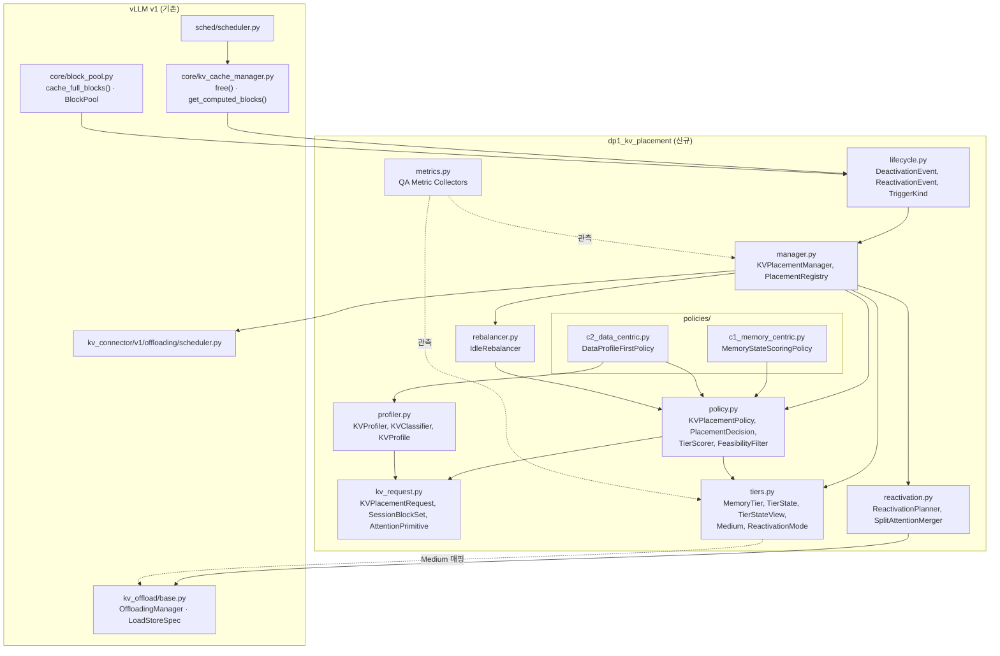
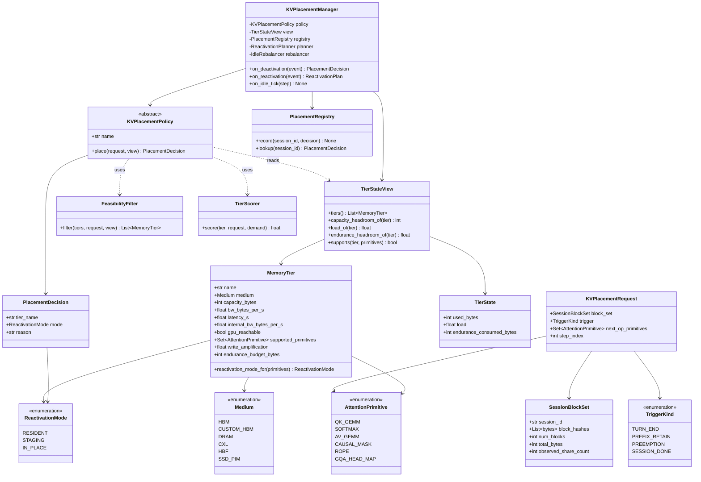
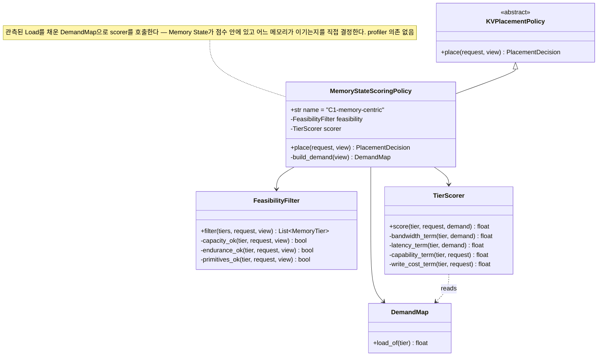
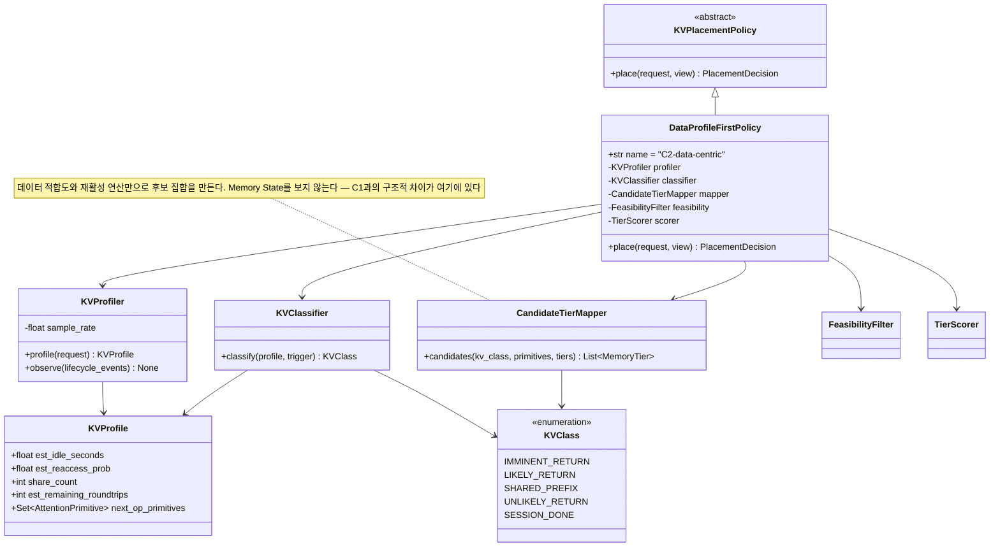
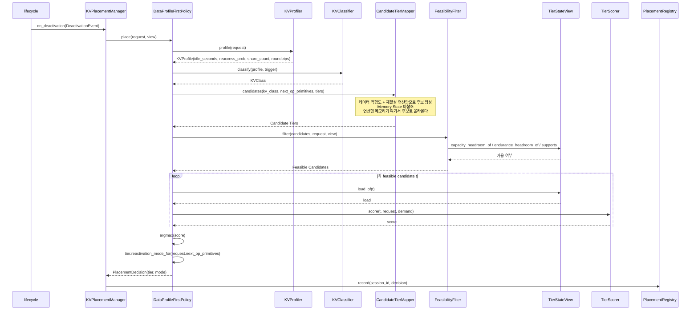

# DP1 구현을 위한 UML 설계

[`dp1-heterogeneous-memory-data-placement.md`](dp1-heterogeneous-memory-data-placement.md)에서 정의한 C1(Memory-centric)/C2(Data-centric) 두 후보를 실제로 구현하기 전에, 구현 구조를 UML로 먼저 명세한다. `dp2-implementation-uml.md`와 같은 형식을 따른다.

본 문서에서 "설계 문서"는 위 DP1 설계 문서를 가리킨다.

---

## 0. 설계 원칙

- **결정은 비활성 전환 이벤트에서 일어난다.** 설계 문서 §1대로 활성 Decode 중인 KV는 대상이 아니므로, 정책 훅은 `allocate_slots` 같은 할당 경로가 아니라 **Deactivation 이벤트**(턴 종료 / Prefix 보존 / 선점 / 세션 종료)에 붙는다. 이것이 DP2 UML과 가장 크게 다른 점이다.
- **Policy 추상화를 공유한다.** C1/C2는 같은 `KVPlacementPolicy` 인터페이스의 서로 다른 구현이며, `KVPlacementManager`는 어떤 정책이 꽂히든 동일하게 동작한다.
- **Memory State를 읽는 창구를 하나로 제한한다.** 정책은 `TierStateView`를 통해서만 메모리 상태를 읽는다. 두 후보 모두 이 창구를 쓰며, 다른 것은 **언제·어떤 후보 집합에 대해 읽는가**다.
- **Tier Scoring 산술을 공유한다.** C1/C2가 동일한 `TierScorer`를 쓴다. 각자 다른 점수 함수를 주면 비교가 "누가 Heuristic을 더 잘 썼는지"를 재게 된다.
- **재활성 방식(Mode A/B/C)은 메모리가 정하지 정책이 정하지 않는다.** `MemoryTier.reactivation_mode_for()`가 그 메모리의 capability로부터 Mode를 유도한다. 정책은 메모리를 고를 뿐이고 Mode는 그 귀결이다 — 정책이 Mode를 직접 고르게 하면 설계 문서 §9.2.1의 인과가 뒤집힌다.
- **유휴 중 재조정은 직교 축이므로 별도 모듈로 분리한다.** `rebalancer.py`는 정책을 교체하지 않고 두 후보 모두에 얹힌다 (설계 문서 §6).

---

## 1. Module View



세 가지가 구조로 드러난다.

1. **정책 훅이 `lifecycle.py`를 통해서만 들어온다.** 할당 경로(`allocate_slots`)에 의존 간선이 없다 — 설계 문서 §1의 "활성 KV는 대상이 아니다"가 모듈 수준에서 강제된다. 이 덕분에 결정이 활성 Decode의 Critical Path 밖에 있고, 그래서 C2의 Profiling 비용을 감당할 여지가 생긴다(설계 문서 §9.2 M-P5).
2. **`c1_memory_centric`은 `profiler.py`에 의존하지 않는다.** 의존 간선이 없으면 추정 오차가 도달할 경로도 없으므로, M-P8의 증폭률이 C1에서 정확히 0인 것이 구현 구조에서 보장된다.
3. **`metrics.py`는 정책을 import하지 않는다.** 채점자가 정책의 내부 표현이 아니라 실행 결과에서 독립적으로 계산하게 하기 위함이다. 정책이 자기 답을 채점하면 설계 문서 §9의 Metric이 의미를 잃는다.

---

## 2. Class Diagram

### 2.1 공통 (C1/C2 모두 사용)



세 가지 설계 결정이 이 다이어그램에 들어 있다.

**`AttentionPrimitive`가 연산 단위가 아니라 원시 연산 단위다.** 설계 문서 §9.2.1의 Mode C 제약("GEMV 지원 ≠ Attention 지원")을 타입으로 강제하기 위함이다. `supported_primitives`에 `QK_GEMM`만 있고 `SOFTMAX`가 없는 메모리는 attention을 in-place로 끝낼 수 없으므로 `reactivation_mode_for()`가 `IN_PLACE`를 반환하지 않는다. 연산을 `ATTENTION` 하나로 두면 이 구분이 사라지고 M-P7이 과대평가된다.

**`reactivation_mode_for()`가 `MemoryTier`에 있다.** Mode는 메모리의 capability에서 유도되는 것이지 정책이 고르는 것이 아니다.

```text
gpu_reachable 이고 supported_primitives ⊇ 요구 집합  → IN_PLACE (Mode C)
supported_primitives ⊇ 요구 집합                     → IN_PLACE (Mode C)
gpu_reachable                                        → RESIDENT (Mode A)
그 외                                                → STAGING  (Mode B)
```

**`SessionBlockSet`이 배치 단위다.** 설계 문서 §3.2(2)의 all-or-nothing 재접근 때문에 개별 Block이 아니라 세션 단위 집합이 결정 대상이다. 집합을 쪼개 여러 계층에 흩으면 재활성 비용이 가장 느린 계층에 지배되므로, 이 타입이 그 실수를 구조적으로 막는다.

`TierStateView`가 정책이 Memory State를 읽는 **유일한 창구**이며, `load_of()`는 **완료된 Step까지만** 평균한다 — 결정 시점에 아직 끝나지 않은 Step의 수요는 알 수 없다. 이 규칙은 두 후보에 동일하게 적용된다.

`FeasibilityFilter`가 판정하는 것은 Capacity / Endurance Headroom / 원시 연산 지원 여부이며, **Load는 포함하지 않는다.** Load는 비용이지 feasibility가 아니다 — Load를 feasibility로 취급하면 포화된 계층을 피해 훨씬 느린 유휴 계층으로 무한히 spill하게 된다.

### 2.2 C1. MemoryStateScoringPolicy



C1의 `place()`는 3단계다: `feasibility.filter()` → 살아남은 각 메모리에 대해 **현재 관측 Load를 채운** `scorer.score()` → `argmax`. `KVPlacementRequest.trigger`는 feasibility 판정에만 쓰이고 **재접근 시점·확률은 입력에 없다.**

### 2.3 C2. DataProfileFirstPolicy



C2의 `place()`는 5단계다: `profiler.profile()` → `classifier.classify()` → `mapper.candidates()`(**데이터 적합도 + 재활성 연산만**) → `feasibility.filter()` → 후보 집합 안에서 `scorer.score()` → `argmax`.

**동일한 `TierScorer`를 쓰되 후보 집합이 이미 데이터 특성으로 좁혀져 있다는 것이 C1과의 유일한 구조적 차이**다. 산술을 공유하지 않으면 설계 문서 §9의 비교가 Heuristic 품질 비교로 변질된다.

`CandidateTierMapper`가 `next_op_primitives`를 받는 것이 **Mode C 선택의 유일한 경로**다. "이 KV는 다음에 작은 Q × 큰 KV attention을 받는다"는 판단이 연산형 메모리를 후보로 올리며, C1의 `TierScorer.capability_term()`은 같은 정보를 가점으로만 쓰지 후보 형성에는 쓰지 못한다.

`KVProfiler.sample_rate`는 **Profiling 추적 범위**를 나타내며 설계 문서 §9.6의 Sweep 대상이다.

---

## 3. Sequence Diagram

### 3.1 C1. 비활성 전환 시 배치 (Memory-centric)

```mermaid
sequenceDiagram
    participant Eng as Engine / Scheduler
    participant LC as lifecycle
    participant Mgr as KVPlacementManager
    participant Pol as MemoryStateScoringPolicy
    participant Feas as FeasibilityFilter
    participant View as TierStateView
    participant Scorer as TierScorer
    participant Reg as PlacementRegistry
    participant Off as OffloadingManager

    Eng->>LC: 턴 종료 / 선점 / Block 완성 / 세션 종료
    LC->>Mgr: on_deactivation(DeactivationEvent)
    Note over Mgr: SessionBlockSet + TriggerKind로<br/>KVPlacementRequest 구성
    Mgr->>Pol: place(request, view)

    Pol->>Feas: filter(tiers, request, view)
    Feas->>View: capacity_headroom_of / endurance_headroom_of / supports
    View-->>Feas: 가용 여부
    Feas-->>Pol: Feasible Tiers

    Pol->>Pol: build_demand(view) — 완료된 Step의 Load만
    loop 각 feasible tier t
        Pol->>View: load_of(t)
        View-->>Pol: load
        Pol->>Scorer: score(t, request, demand)
        Scorer-->>Pol: score
    end
    Pol->>Pol: argmax(score)
    Pol->>Pol: tier.reactivation_mode_for(request.next_op_primitives)
    Pol-->>Mgr: PlacementDecision(tier, mode)

    Mgr->>Reg: record(session_id, decision)
    alt mode != RESIDENT
        Mgr->>Off: prepare_store(keys, req_context)
        Off-->>Mgr: LoadStoreSpec
    end
    Mgr-->>Eng: PlacementDecision
```

C1은 `TriggerKind`를 feasibility 판정에만 쓰고 **재접근 시점·확률 추정 경로를 전혀 타지 않는다** — C1이 추정 오차에 노출되지 않는다는 성질이 호출 흐름에서 드러나는 지점이다.

### 3.2 C2. 비활성 전환 시 배치 (Data-centric)



C2는 전환마다 `profile` + `classify` + `candidates` 3회가 추가된다 — 이것이 **설계 문서 §9.2 M-P5(Placement Decision Latency)가 측정할 비용의 실체**다. 이 경로는 활성 Decode의 Critical Path 밖에 있으므로 할당 시점 배치보다 여유가 있다.

### 3.3 재활성 — Mode에 따라 갈리는 경로

설계 문서 §9.2.1의 Mode A/B/C가 실제로 다른 비용을 만드는 지점이다.

```mermaid
sequenceDiagram
    participant Sched as Scheduler
    participant Mgr as KVPlacementManager
    participant Reg as PlacementRegistry
    participant Plan as ReactivationPlanner
    participant Off as OffloadingManager
    participant Mem as Compute-capable Memory
    participant Merge as SplitAttentionMerger
    participant GPU as GPU Attention

    Sched->>Mgr: on_reactivation(ReactivationEvent)
    Mgr->>Reg: lookup(session_id)
    Reg-->>Mgr: PlacementDecision(tier, mode)
    Mgr->>Plan: plan(decision, block_set)

    alt mode == RESIDENT (Mode A)
        Note over Plan: 복원 없음
        Plan-->>Mgr: ReactivationPlan(no_transfer)
        Mgr->>GPU: incremental prefill attention
    else mode == STAGING (Mode B)
        Plan->>Off: prepare_load(keys, req_context)
        Off-->>Plan: LoadStoreSpec
        Note over Plan,Off: History 전량 복원 (all-or-nothing)<br/>→ 재활성 TTFT를 지배
        Plan-->>Mgr: ReactivationPlan(restore_bytes)
        Mgr->>GPU: incremental prefill attention
    else mode == IN_PLACE (Mode C)
        Plan->>Mem: attention(History KV, Q_delta)
        Note over Mem: 메모리 내부에서 처리<br/>KV는 이동하지 않음
        Mem-->>Plan: partial output + logsumexp
        Plan->>GPU: attention(신규 토큰 KV, Q_delta)
        GPU-->>Plan: partial output + logsumexp
        Plan->>Merge: merge(partial_inplace, partial_gpu)
        Note over Merge: log-sum-exp 재정규화<br/>(flash-decoding 방식)
        Merge-->>Mgr: 최종 attention 출력
    end

    Mgr-->>Sched: ReactivationPlan
```

세 경로가 실어 나르는 바이트 양이 다르다는 것이 이 다이어그램의 요지다.

| Mode | 재활성 시 이동하는 데이터 | 지표 |
|---|---|---|
| A. RESIDENT | 없음 | — |
| B. STAGING | **History KV 전량** | M-P2, M-P4 |
| C. IN_PLACE | **출력 (ΔToken × d) + logsumexp** | M-P2 |

`SplitAttentionMerger`가 Mode C에만 등장하는 것이 설계 문서 §9.2.1이 명시한 구현 제약이다 — History KV는 연산형 메모리에, 신규 토큰의 KV는 GPU에 있으므로 두 partial attention을 병합해야 한다.

### 3.4 유휴 중 재조정 (직교 축, 두 후보 공통)

```mermaid
sequenceDiagram
    participant Eng as Engine
    participant Mgr as KVPlacementManager
    participant Prof as KVProfiler
    participant Reb as IdleRebalancer
    participant Pol as KVPlacementPolicy
    participant Reg as PlacementRegistry
    participant Off as OffloadingManager

    Eng->>Mgr: on_idle_tick(step)
    opt C2 구성일 때만
        Mgr->>Prof: observe(lifecycle_events)
        Note over Prof: sample_rate에 따라 부분 관측<br/>실제 유휴 시간 / 재접근 여부를 회수
    end
    Mgr->>Reb: rebalance(view, policy, migration_budget)
    loop 재평가 대상 세션
        Reb->>Pol: place(request, view)
        Pol-->>Reb: PlacementDecision
    end
    Reb-->>Mgr: MigrationPlan (예산 내)
    Mgr->>Off: prepare_store / prepare_load
    Off-->>Mgr: LoadStoreSpec
    Mgr->>Reg: record(session_id, new_decision)
```

세 가지를 명시한다.

- **`IdleRebalancer`는 `KVPlacementPolicy` 인터페이스만 알고 C1/C2를 구별하지 않는다.** 설계 문서 §6의 직교성이 구조로 보장된다.
- **Migration 예산이 공유 상수다.** 두 후보에 다른 예산을 주면 비교가 성립하지 않는다.
- **`KVProfiler.observe()`가 여기서 ground truth를 회수한다.** 실제 유휴 시간과 재접근 여부는 사후에만 알 수 있으므로, C2의 추정 품질은 이 경로를 통해서만 개선된다 — M-P8의 표본율 축이 걸리는 지점이다.

---

## 4. C1 / C2 구현 구조 비교

| 구분 | C1 (MemoryStateScoringPolicy) | C2 (DataProfileFirstPolicy) |
|---|---|---|
| 핵심 협력 객체 | `FeasibilityFilter`, `TierScorer` | `KVProfiler`, `KVClassifier`, `CandidateTierMapper`, `FeasibilityFilter`, `TierScorer` |
| `TierStateView` 사용 범위 | 전체 메모리에 대해 Capacity/Endurance/Load 조회 | **데이터 특성으로 좁혀진 후보 집합**에 대해서만 조회 |
| Decision 절차 | Feasible 메모리 전체 Scoring 후 `argmax` | Profile → Classify → 후보 형성 → Feasible 필터 → Scoring → `argmax` |
| 전환당 호출 비용 | Filter 1회 + 메모리 수 × Score | **Profile/Classify/Map 3회** + 후보 수 × Score |
| 추정 의존성 | 없음 (`profiler` 모듈 의존 간선 없음) | 있음 — `KVProfile`의 오차가 후보 집합에 직접 반영 |
| Trigger 활용 | feasibility 판정에만 | `KVClassifier`의 입력 — 계기별로 다른 분류 |
| 재활성 연산 활용 | `TierScorer.capability_term()`의 가점 | **`CandidateTierMapper`의 후보 형성 입력** — Mode C 선택의 유일한 경로 |
| 자원 급변 대응 | 즉각적 — Load가 점수에 직접 들어감 | 간접적 — 후보 집합이 먼저 고정됨 |
| 신규 메모리 등장 시 | Memory State 기준으로 보수적으로 편입 | 원시 연산 지원 여부가 `CandidateTierMapper`에 즉시 반영 |
| 유휴 재조정 전환 시 변경 지점 | 없음 (`IdleRebalancer` 공유) | 없음 + `KVProfiler.observe()` 활성화 |

이 표는 설계 문서 §7·§8의 근거를 구현 레벨에서 재확인한 것이며, 설계 문서 §9의 각 Metric이 **구조의 어느 지점을 측정하는지**를 지정한다.

| Metric | 이 표에서 재는 행 |
|---|---|
| M-P2 (재활성 TTFT) | §3.3의 Mode별 이동 바이트 |
| M-P5 (Decision Latency) | "전환당 호출 비용" |
| M-P7 (Compute-capable Mem Utilization) | "재활성 연산 활용" |
| M-P8 (추정 오차 민감도) | "추정 의존성" |
| M-F1 (지원 가능한 신규 Memory 수) | "신규 메모리 등장 시" |
