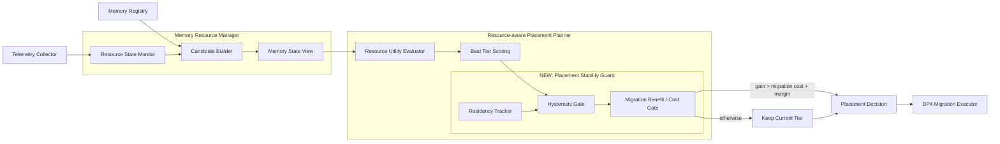
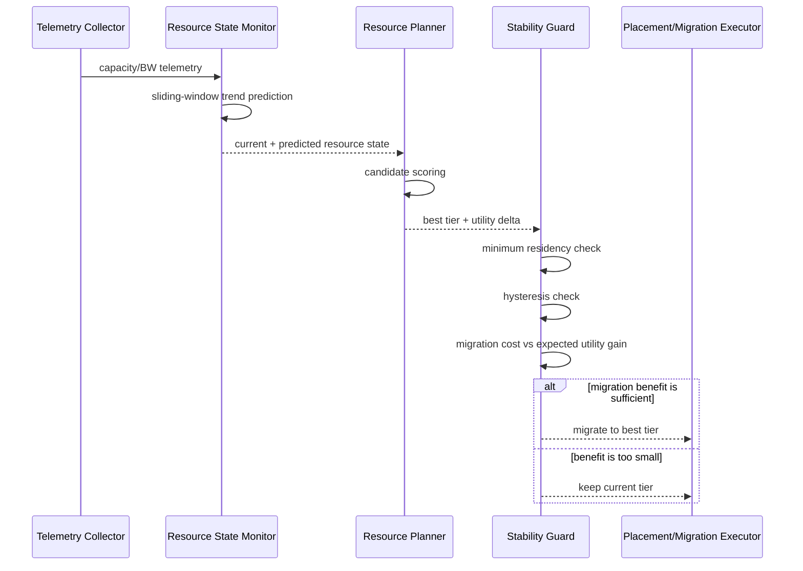
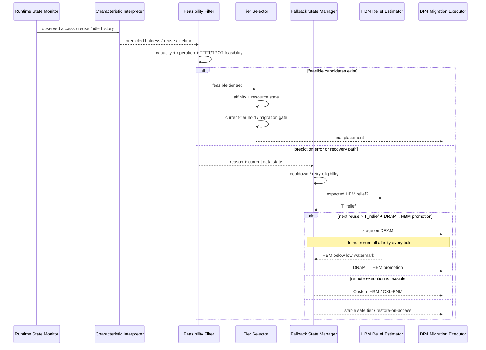

# DP1 Reinforcement Architecture — C1-R / C2-R

> 이 문서는 baseline `C1 Memory-centric` / `C2 Data-centric` 구조를 덮어쓰지 않고, 1차 평가 이후 추가된 **Reinforcement Design**을 구조도로 표현한다.
>
> Baseline: `dp1-data-placement-uml-rendered.md`  
> 문제 분석: `dp1-c1-c2-baseline-assessment.md`  
> 보완 설계/결과: `dp1-reinforcement-design.md` / `dp1-reinforcement-evaluation.md`

---

# 1. C1-R — Stable Resource-centric Placement



## C1 → C1-R 변화

Baseline C1은 **가장 resource-utility가 높은 tier**를 고른다.

C1-R은 그 결정 뒤에 다음 stability gate를 추가한다.

```text
Resource Prediction
    ↓
Candidate / Utility
    ↓
Best Tier
    ↓
Minimum Residency
    ↓
Hysteresis
    ↓
Migration Benefit > Migration Cost ?
    ├─ Yes → migrate
    └─ No  → current tier hold
```

Data Classifier / Data Characterization은 추가하지 않는다. 따라서 C1의 Resource-centric 철학은 유지된다.

---

# 2. C1-R Sequence



---

# 3. C2-R — Feasibility-first Data-centric Placement

```mermaid
flowchart LR
    DD[Data Descriptor]
    TC[Telemetry Collector]
    MR[Memory Registry]

    subgraph DPM[Data Placement Manager]
        DC[Data Classifier]
        RSM[Runtime State Monitor]
        DCI[Data Characteristic Interpreter]
    end

    subgraph DPP[Data-aware Placement Planner]
        FF[NEW: Hard Feasibility Filter]
        AFF[Memory Tier Affinity Evaluator]
        SEL[Memory Tier Selector]

        subgraph STAB[NEW: Placement Stability]
            CT[Current-tier Hold]
            RT[Minimum Residency]
            MB[Migration Benefit / Cost Gate]
        end

        subgraph FB[Reinforced Fallback State Manager]
            CD[Reason-specific Cooldown]
            DW[DRAM Deferred-HBM State]
            HRE[HBM Relief Estimator]
        end
    end

    PD[Placement Decision]
    DP4[DP4 Migration Executor]

    DD --> DC
    RSM --> DCI
    DC --> DCI

    DCI --> FF
    MR --> FF
    TC --> FF

    FF -->|feasible tiers only| AFF
    DCI --> AFF
    MR --> AFF

    AFF --> SEL
    TC --> SEL

    SEL --> CT
    CT --> RT
    RT --> MB

    MB -->|stable best tier| PD
    MB -->|uncertain / recovery needed| CD

    TC --> HRE
    RSM --> DW
    HRE --> DW
    CD --> DW

    DW -->|DRAM stage / wait / promote| PD
    CD -->|safe tier| PD

    PD --> DP4
```



---

# 4. C2 → C2-R 핵심 변화

## Before — C2 baseline

```text
All Tiers
   ↓
Data Affinity Ranking
   ↓
Best Tier
   ↓
Operation / TTFT / TPOT Validation
   ↓
Reject
   ↓
Fallback
```

이 순서 때문에 baseline 결과에서:

- predicted first-response violation
- operation infeasible
- predicted TPOT violation

이 반복 fallback의 대부분을 차지했다.

## After — C2-R

```text
All Tiers
   ↓
Hard Feasibility Filter
   ├─ capacity
   ├─ required operation
   └─ latency budget
   ↓
Feasible Tier Set
   ↓
Data Affinity Ranking
   ↓
Current-tier / Residency / Migration-benefit Gate
   ↓
Final Tier
```

즉 **“잘못 고른 뒤 fallback”**이 아니라 **“실행 가능한 후보 중에서 고른다”**로 바뀐다.

---

# 5. C2-R Fallback / Deferred HBM Sequence



---

# 6. Runtime State Monitor 위치는 그대로, 사용 방식만 강화

C2-R에서도 Runtime State Monitor의 responsibility는 바뀌지 않는다.

```text
Actual Data Access Events
      ↓
Runtime State Monitor
      ├─ access-rate EWMA
      ├─ reuse-interval EWMA
      ├─ idle duration
      ├─ object age
      └─ sample count
      ↓
Data Characteristic Interpreter
      ↓
hotness / reuse / lifetime prediction
```

보완된 것은 **이 prediction을 어디서 사용하는가**다.

Baseline C2:
- affinity에 바로 사용
- 잘못된 tier 선택 후 fallback 가능

C2-R:
- hard feasibility를 먼저 통과한 tier에 대해서만 affinity 계산
- prediction uncertainty가 있으면 stateful fallback/cooldown 사용

구체적인 prediction 식은 `dp1-monitoring-prediction-methodology.md`를 참조한다.

---

# 7. Before / After 구조 요약

| Concern | C1 | C1-R | C2 | C2-R |
|---|---|---|---|---|
| Resource prediction | O | O | resource telemetry 사용 | 동일 |
| Data prediction | X | X | O | O |
| Feasibility before ranking | partial | partial | X | **O** |
| Minimum residency | X | **O** | X | **O** |
| Hysteresis / hold | X | **O** | X | **O** |
| Migration benefit/cost gate | X | **O** | X | **O** |
| Fallback cooldown | N/A | N/A | weak | **O** |
| DRAM wait → HBM promotion | N/A | N/A | O | **stateful O** |
| Repeated infeasible fallback suppression | N/A | N/A | X | **O** |

---

# 8. 1차 보완 결과와 구조의 연결

```text
C1
16.27 migrations/run
    ↓
[Residency + Hysteresis + Migration Gate]
    ↓
C1-R
1.87 migrations/run
```

```text
C2
75.81 fallbacks/run
48.00 migrations/run
    ↓
[Feasibility-first + Cooldown + Stability Gate]
    ↓
C2-R
14.27 fallbacks/run
11.29 migrations/run
```

따라서 보완 후의 수치 변화는 구조도에 새로 추가된 block과 직접 연결된다.

---

# 9. 다음 V2 구조 변경 예정

현재 C1-R/C2-R 구조도는 **실제로 구현/평가한 1차 보완 설계**를 나타낸다.

`dp1-reinforcement-v2-design.md`의 C1-R2/C2-R2는 아직 별도로 유지한다.

예정 변화:

- C1-R2: Emergency Pressure Escape
- C2-R2: FEASIBLE / TEMPORARILY_INFEASIBLE / STRUCTURALLY_INFEASIBLE state
- C2-R2: Low-confidence Safe Envelope
- C2-R2: Migration Budget + Pressure Override

V2가 구현/실행되기 전에는 이 block들을 현재 C1-R/C2-R 실구조와 섞지 않는다.
