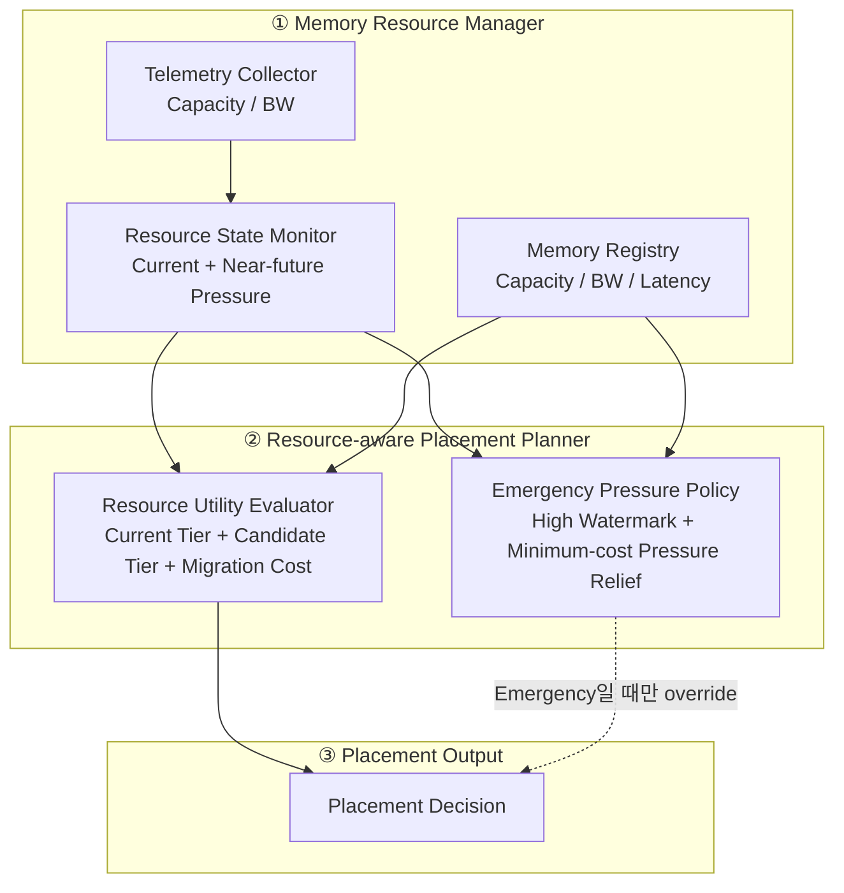
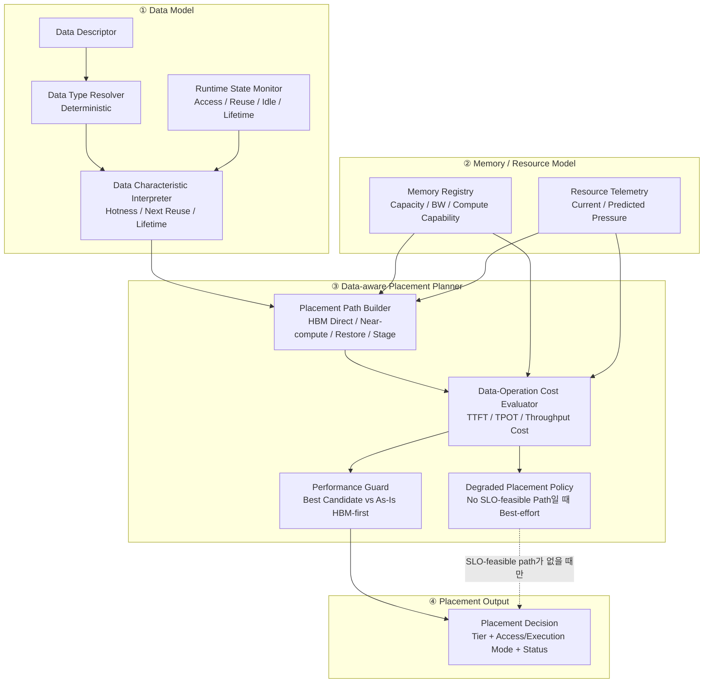
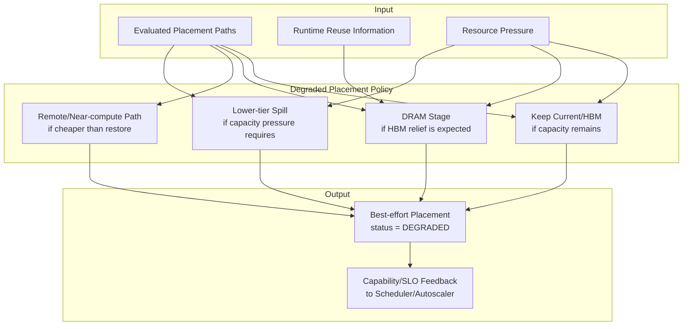

# DP1 Reinforcement V2 Design — C1-R2 / C2-R2

> 목적: 1차 평가에서 발견된 문제를 보완하되, C1/C2의 핵심 철학은 유지한다.
>
> 이 문서는 **심사 시 한 장씩 설명할 수 있는 Module View**를 우선한다.  
> 다이어그램은 모두 **Top-down module/dependency view**이며 sequence/flow chart가 아니다.

---

# 1. 핵심 요약

## C1-R2

> **Resource 상태를 보고 가장 좋은 Memory Tier를 선택한다.  
> 단, HBM pressure가 Emergency 수준이면 목적함수를 “최고 utility”에서 “최소 비용으로 pressure 해소”로 바꾼다.**

## C2-R2

> **Data Type과 Runtime behavior를 이용해 각 Memory Tier에서 가능한 Placement/Execution Path의 비용을 비교한다.  
> Data-near Compute가 As-Is보다 실제로 유리할 때만 사용한다.**

중요한 전제:

- Data Type은 Data Descriptor로부터 **deterministic**하게 결정한다.
- 정상 상황에서 “갈 수 있는 Tier가 없다”는 표현은 사용하지 않는다.
- DRAM/CXL/SSD 등 물리적으로 저장 가능한 Tier는 일반적으로 존재한다.
- 다만 **SLO를 만족하는 Path가 없을 수는 있다.**
- 이 경우는 Fallback이 아니라 **Degraded Placement**로 정의한다.

---

# 2. C1-R2 Module View



## 2.1 Resource Utility Evaluator

별도의 `Placement Stability Guard`는 두지 않는다.

다음 항목을 **Resource Utility Evaluator 안에서 같이 계산**한다.

```text
Candidate Utility
- Migration Cost
- Current Tier를 버리는 Cost
```

따라서 새 Tier가 조금 좋아졌다는 이유만으로 바로 migration하지 않는다.

---

## 2.2 Emergency Pressure란?

쉽게 말하면:

> **HBM Capacity 또는 BW가 high watermark를 넘었거나, 가까운 미래에 넘을 것으로 예측되는 상태**

V2 초기 simulation에서는 재현성을 위해 예를 들어:

```text
Emergency High Watermark = 0.90
```

처럼 Config 값으로 고정할 수 있다.

하지만 `0.90` 자체가 architecture의 본질은 아니다.  
실제 시스템에서는 Tier/Workload별 configurable parameter다.

예:

```text
Normal
Predicted HBM Pressure < 90%
→ 기존 Resource Utility 정책 사용

Emergency
Predicted HBM Pressure >= 90%
→ Pressure Relief 정책으로 전환
```

Emergency에서 정책 자체가 바뀐다는 것이 핵심이다.

---

## 2.3 Minimum-cost Pressure Relief

Emergency라고 해서 많은 Data를 한꺼번에 내리지 않는다.

목표는:

> **HBM pressure를 safe 영역으로 되돌리는 데 필요한 최소 이동만 수행**

이다.

개념적으로:

```text
minimize
    Total Migration Cost

subject to
    Predicted HBM Pressure after migration
    <= Relief Target
```

예:

```text
Predicted HBM Pressure = 94%
Relief Target          = 85%

→ 9%p 정도의 pressure만 줄이면 됨
→ 모든 Object를 내리지 않고
→ Migration Cost 대비 Pressure Relief가 큰 Object부터 선택
```

초기 evaluator에서는 High Watermark / Relief Target을 Config로 고정하고 sensitivity test를 별도로 수행한다.

---

# 3. C2-R2 Module View

C2는 **Data-aware + Operation-aware** 구조다.



---

# 4. C2 모듈 설명

## 4.1 Data Type Resolver

Data Type은 추측하지 않는다.

예:

- vLLM이 생성한 KV block → `KV_CACHE`
- Vector DB index → `RAG_DATA`
- Agent state → `AGENT_MEMORY`
- Tool output → `TOOL_RESULT`

불확실성은 **Type이 아니라 Runtime behavior**에 있다.

---

## 4.2 Runtime State Monitor

실제 access history를 보고 다음을 추정한다.

- Hot / Cold
- Next Reuse
- Long-lived / Short-lived
- Idle duration

예:

```text
KV_CACHE라는 Type은 확정

하지만
"이 KV가 1초 뒤 다시 쓰일지,
 30초 뒤 다시 쓰일지"
는 Runtime prediction 대상
```

---

## 4.3 Placement Path Builder

여기서 중요한 변경은 **Tier를 단순히 가능/불가능으로 잘라내지 않는 것**이다.

같은 Tier라도 여러 Path가 있을 수 있다.

예: DRAM의 KV Cache

```text
DRAM에 저장
→ Attention은 DRAM에서 못 함
→ Access 시 HBM으로 Restore
```

이것도 유효한 Placement Path다.

예: CXL-PNM의 KV Cache

```text
CXL-PNM에 저장
→ Attention을 Near-memory에서 실행
→ Activation만 GPU와 교환
```

따라서 C2는:

```text
Tier
+
Data Access / Execution Mode
```

를 하나의 Path로 만들어 비교한다.

---

## 4.4 Data-Operation Cost Evaluator

각 Path의 end-to-end 비용을 계산한다.

예: KV

```text
HBM Path
= HBM Attention + GPU FFN

CXL-PNM Path
= Near-memory Attention
+ Activation Round-trip
+ GPU FFN

DRAM Path
= Restore Cost
+ HBM Attention
+ GPU FFN
```

예: RAG

```text
As-Is
= Vector Transfer + GPU/CPU GEMV

SSD-PIM
= Local GEMV + Score Transfer
```

여기가 C2의 핵심 장점인 **Data-near Compute 활용 여부를 정량적으로 판단하는 모듈**이다.

---

## 4.5 Performance Guard

가장 좋은 Candidate Path가 나와도 As-Is HBM-first보다 느리면 사용하지 않는다.

```text
Best Candidate Path
        vs
As-Is HBM-first Path
```

Candidate가 Performance 이득을 만들 때만 새로운 Tier/Mode를 선택한다.

따라서:

```text
Cold KV + CXL-PNM 가능
≠
무조건 CXL-PNM 사용
```

이다.

CXL remote Attention 비용이 HBM보다 크면 HBM path를 유지한다.

---

# 5. Fallback 대신 Degraded Placement

기존 문서의 `Fallback State Manager` 용어는 제거한다.

이유는 사용자 지적대로:

> 정상 Placement에서 “갈 수 있는 Tier가 하나도 없다”는 상황은 일반적인 DP1 상태로 보기 어렵다.

HBM에서 만든 Data라면:

- HBM에 유지하거나
- DRAM으로 Stage하거나
- CXL/HBF/SSD로 Spill하는

물리적인 저장 선택지가 일반적으로 존재한다.

따라서 구분은 다음이 더 정확하다.

## Normal Placement

하나 이상의 Path가 SLO를 만족.

```text
SLO-feasible Paths
      ↓
가장 좋은 Path 선택
```

## Degraded Placement

물리적인 저장 Path는 있지만 **어떤 Path도 현재 SLO를 만족하지 못함**.

```text
No SLO-feasible Path
      ↓
Best-effort Path 선택
      +
DEGRADED 상태 표시
```

이는 “잘못 배치했다가 뒤로 돌아오는 Fallback”이 아니다.  
**Placement Decision을 내리기 전에 선택하는 Best-effort mode**다.

---

# 6. Degraded Placement Policy



### 왜 Next Reuse가 필요한가?

`Next Reuse`는 Fallback의 기준이 아니다.

**DRAM Stage라는 하나의 Best-effort Path가 좋은지 판단할 때만 사용한다.**

예:

```text
HBM Pressure가 3초 뒤 풀릴 전망
KV Next Reuse는 10초 뒤

→ DRAM에 잠깐 Stage
→ 3초 뒤 HBM 복귀
→ 10초 access 전에 준비 완료
```

반대로:

```text
KV Next Reuse = 0.5초 뒤
```

라면 DRAM wait은 불리하므로 다른 Path를 선택한다.

---

# 7. 정말 Target Tier가 없는 경우

정말로:

- HBM
- DRAM
- CXL
- HBF
- SSD

모든 Tier가 Capacity까지 꽉 차서 **물리적으로 저장할 공간이 하나도 없는 경우**는 DP1 placement policy 문제가 아니라 **System OOM / Admission Control 문제**다.

이 경우에만:

```text
NO_PHYSICAL_CAPACITY
→ Scheduler / Admission Control
```

로 올린다.

정상적인 C2 Placement에서는 “valid target tier 없음”을 일반적인 fallback condition으로 사용하지 않는다.

---

# 8. C1-R2 vs C2-R2 — 한 눈 비교

| | C1-R2 | C2-R2 |
|---|---|---|
| 핵심 판단 | Resource 상태 | Data + Operation + Resource |
| Data Type | 사용 안 함 | Deterministic |
| Runtime behavior | 사용 안 함 | Hotness / Reuse / Lifetime |
| Data-near Compute | 제한적 | **핵심 장점** |
| Migration Cost | Resource Utility 안에서 고려 | Path Cost 안에서 고려 |
| High HBM Pressure | **Emergency Pressure Policy** | Path Cost + Degraded Policy |
| SLO 만족 Path 없음 | Resource 기준 best-effort | **Degraded Placement** |
| 실제 저장 공간 없음 | OOM / Admission Control | OOM / Admission Control |

---

# 9. Performance-first 평가 원칙

최종 후보는 Target Workload에서 As-Is보다 Performance가 좋아야 한다.

모든 Scenario를 계속 실행하되 다음으로 분류한다.

- **WIN** — Goodput/Latency가 As-Is보다 개선
- **TRADE-OFF** — Throughput과 Latency 방향이 다름
- **NEUTRAL** — As-Is와 실질적으로 동일
- **LOSS** — Performance 전반 악화
- **SLO-INFEASIBLE STRESS** — 모든 후보가 SLO 불가

대표 Target Domain:

### C1-R2
- HBM Capacity/BW pressure
- Resource shock/ramp

### C2-R2
- SSD-PIM RAG GEMV
- Custom HBM / CXL-PNM Attention
- Long-lived / reuse-sensitive data

Negative control:

- `kv_b1_c32k_cold_cxl`  
  CXL-PNM이 존재해도 실제 cost가 더 크면 **HBM path를 유지해야 한다.**

---

# 10. V2 구현 시 검증 포인트

## C1-R2

- Emergency threshold 진입 전/후 정책 변경이 명확한가
- Minimum-cost relief가 migration storm 없이 pressure를 낮추는가
- Target pressure scenario에서 As-Is보다 Goodput이 좋아지는가

## C2-R2

- Data Type은 deterministic하게 처리되는가
- Tier가 아니라 **Placement/Execution Path**를 비교하는가
- Data-near compute가 실제 Performance 이득일 때만 선택되는가
- SLO를 못 맞추는 경우에도 항상 Best-effort placement가 결정되는가
- 정말 공간이 없는 경우만 OOM/Admission Control로 분리되는가
