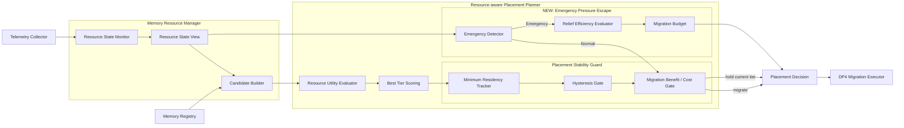
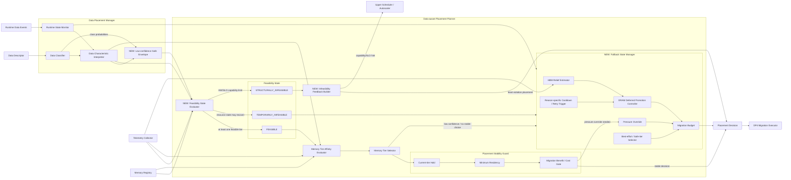
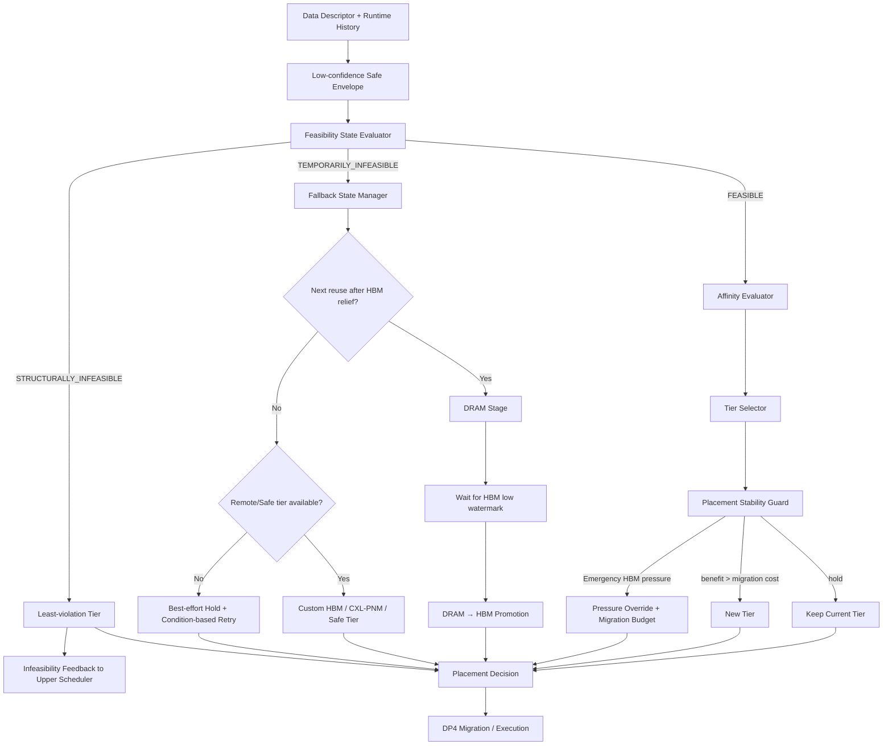

# DP1 Reinforcement V2 Design — C1-R2 / C2-R2

> 이 문서는 `dp1-reinforcement-evaluation.md`에서 남은 문제를 대상으로 하는 **2차 보완 설계안**이다.
>
> 아직 baseline을 덮어쓰지 않는다. V2는 다음 실험 후보로 정의한다.

---

# 1. V1 결과에서 남은 문제

## C1-R

좋아진 점:

- Migration 16.27 → 1.87/run
- Heavy Goodput 0.9999 → 1.0644
- RUI 0.7854 → 0.8101

남은 문제:

- HBM pressure violation 0.1294 → **0.1773**

즉 migration hold가 너무 강하면 pressure relief가 늦어진다.

## C2-R

좋아진 점:

- Fallback 75.81 → 14.27/run
- Migration 48.00 → 11.29/run
- Heavy Goodput 0.8604 → 0.9482
- Throughput ★☆☆ → ★★☆

남은 문제:

- HBM pressure violation 0.1889 → **0.2096**
- Goodput target 0.95를 근소하게 미달
- RUI target 0.78을 근소하게 미달
- 남은 fallback 대부분이 `hard_feasibility_empty`

---

# 2. C1-R2 — Stable + Emergency Pressure Escape

## 2.1 핵심 아이디어

C1-R의 hold/hysteresis는 유지하되, **near-future pressure가 실제 danger zone으로 들어갈 때만 강제로 migration gate를 우회**한다.

```text
Normal Region
  predicted pressure < Emergency Threshold
      ↓
  C1-R hysteresis / residency 유지

Emergency Region
  predicted pressure >= Emergency Threshold
      ↓
  residency bypass
      ↓
  최소 개수 object만 이동
```

## 2.2 Emergency Trigger

예:

```text
predicted_capacity >= 0.90
OR
predicted_bw >= 0.90
OR
time_to_saturation <= 2 decision windows
```

## 2.3 Relief Efficiency

아무 object나 내리지 않는다.

```text
Relief Efficiency =
    Expected Pressure Reduction
    / Migration Cost
```

C1은 Data semantics를 사용하지 않으므로 다음 resource-only 요소만 사용한다.

- object size
- source/target bandwidth
- target headroom
- source pressure contribution proxy

가장 relief-efficiency가 높은 object부터 필요한 만큼만 옮긴다.

## 2.4 목표

- Migration은 C1-R 수준에 가깝게 유지
- HBM pressure violation을 C1 baseline(≈0.13)에 근접
- Goodput 1.0× As-Is 이상 유지

---

# 3. C2-R2 — Explicit Feasibility State

## 3.1 핵심 아이디어

C2-R에서 `hard_feasibility_empty`는 더 이상 “fallback failure”가 아니라 **명시적 system state**로 관리한다.

```text
FEASIBLE
TEMPORARILY_INFEASIBLE
STRUCTURALLY_INFEASIBLE
```

## 3.2 FEASIBLE

하나 이상의 tier가:

- capacity
- required operation
- TTFT/TPOT budget

을 만족.

정상 C2 affinity ranking 수행.

## 3.3 TEMPORARILY_INFEASIBLE

현재 resource pressure 때문에 가능한 tier가 없지만 resource state 변화로 회복 가능.

예:

- HBM pressure가 높음
- Custom HBM link contention
- DRAM stage 후 HBM relief가 예상됨

이 경우:

```text
Best-effort Tier 고정
      ↓
condition-based retry 등록
      ↓
Telemetry event가 변할 때만 재평가
```

tick마다 retry하지 않는다.

## 3.4 STRUCTURALLY_INFEASIBLE

현재 HW capability / batch / context / SLO 조합에서 어떤 tier도 budget을 만족할 수 없음.

예:

- B256 × 512K KV
- 현재 CXL-PNM BW로 TPOT 50 ms 불가능
- 모든 tier에서 required operation latency 초과

이 경우 Placement Planner가 억지로 해결하려 하지 않고:

```text
PlacementDecision
  tier = least-violation tier
  status = STRUCTURALLY_INFEASIBLE
  reason = TPOT_CAPABILITY_LIMIT
```

형태로 upper scheduler/autoscaler에 전달한다.

이 상태는 policy quality와 HW capability boundary를 구분하기 위해 필요하다.

---

# 4. C2-R2 — Low-confidence Envelope

현재 low classifier confidence fallback 2,365건을 줄이기 위한 설계다.

하나의 class를 강제로 선택하지 않고 top plausible classes를 유지한다.

```text
Classifier

KV_CACHE       0.55
AGENT_MEMORY   0.30
TOOL_RESULT    0.15
```

각 class에 대해 feasible set을 계산한다.

```text
F_KV
F_AGENT
F_TOOL
```

가능하면:

```text
Safe Set = intersection(F_KV, F_AGENT, F_TOOL)
```

intersection이 비면 expected/worst-case cost가 가장 낮은 tier를 선택한다.

Runtime history가 충분히 쌓이면 class posterior를 좁히고 정상 C2 path로 전환한다.

---

# 5. C2-R2 — Resource-pressure Override

C2-R의 migration hold 때문에 HBM pressure violation이 증가했다.

따라서 다음 경우 current-tier hold를 무시할 수 있다.

```text
HBM predicted pressure > 0.90
AND
candidate migration relieves HBM
AND
migration budget available
```

단, C2 baseline처럼 migration storm이 재발하지 않도록 interval당 migration budget을 둔다.

예:

```text
MAX_MIGRATIONS_PER_WINDOW = 2~4
WINDOW = 5 sec
```

실제 값은 sensitivity test로 결정한다.

---

# 6. C2-R2 — DRAM Deferred Promotion State

DRAM wait은 V1에서 이미 동작했지만 V2에서는 infeasible-state와 통합한다.

```text
TEMPORARILY_INFEASIBLE
   ↓
next reuse > HBM relief + promotion
   ↓
DRAM_STAGED
   ↓
HBM low watermark
   ↓
PROMOTE_PENDING
   ↓
HBM
```

DRAM_STAGED 동안은 일반 affinity ranking에서 제외한다.

---

# 7. RAG Evaluation Refinement

현재 8 TiB RAG는 stress 관점에서 전체 또는 매우 큰 candidate set을 scan하는 모델이다.

Vector DB 환경을 더 현실적으로 분리하기 위해 다음 축을 추가한다.

```text
INDEX_SIZE
  1 TiB / 8 TiB

QUERY_CONCURRENCY
  16 / 64 / 256

SCAN_FRACTION
  0.1% / 1% / 10% / 100%
```

SSD-PIM의 역할은 계속 하나다.

> **SSD resident vector와 query vector의 similarity GEMV**

비교:

```text
CPU/GPU path
  candidate vectors transfer
  → similarity GEMV

SSD-PIM path
  local similarity GEMV
  → similarity score transfer
```

이 sweep을 통해 policy 문제와 “8 TiB full-scan 자체가 SLO 불가능한 문제”를 분리한다.

---

# 8. V2 실험 가설

## C1-R2

- Heavy Goodput / As-Is ≥ 1.00
- Migration ≤ 5/run
- HBM pressure violation ≤ 0.14
- RUI ≥ 0.80

## C2-R2

- Heavy Goodput / As-Is ≥ 0.95
- Migration ≤ 15/run
- Fallback ≤ 10/run
- HBM pressure violation ≤ 0.19
- RUI ≥ 0.78
- `hard_feasibility_empty`를 fallback count가 아닌 feasibility-state count로 별도 보고

목표를 맞추기 위해 threshold를 사후 조정하지 않고, 동일 trace/sweep에서 검증한다.

---

# 9. 최종 비교 흐름

```text
Stage 0
C1 vs C2
    ↓
최초 trade-off 확인

Stage 1
C1-R vs C2-R
    ↓
instability 제거 후 비교

Stage 2
C1-R2 vs C2-R2
    ↓
pressure / infeasibility 처리까지 보완

Final
남아 있는 구조적 trade-off를 근거로 후보 선택
```

이 단계형 비교를 유지하면 “처음부터 특정 후보가 이기도록 설계했다”는 해석을 피하고, **문제 발견 → 원인 분석 → 보완 설계 → 재평가**의 의사결정 근거를 남길 수 있다.


---

# 10. C1-R2 전체 구조도

C1-R2는 C1/C1-R의 Resource-centric 구조를 유지하면서 **Emergency Pressure Escape**만 추가한다. Data Classifier나 Data Characteristic Interpreter를 추가하지 않는다.



## 10.1 추가 설계 요소

### Emergency Detector

C1-R의 minimum residency / hysteresis가 너무 강하게 동작하면 HBM pressure relief가 늦어질 수 있다. Emergency Detector는 다음 near-future signal을 본다.

```text
predicted_capacity >= emergency_high_watermark
OR
predicted_bw >= emergency_high_watermark
OR
time_to_saturation <= configured_horizon
```

Normal region에서는 C1-R의 기존 stability gate가 그대로 적용된다. Emergency region에서만 residency/hysteresis를 제한적으로 우회한다.

### Relief Efficiency Evaluator

Emergency라고 해서 많은 object를 무조건 이동시키지 않는다.

```text
Relief Efficiency =
    Estimated Source Pressure Reduction
    / Estimated Migration Cost
```

C1은 Data semantics를 사용하지 않으므로 object size, source contribution, source/target BW, target headroom 같은 resource-only 정보만 사용한다.

### Migration Budget

한 decision window에서 이동 가능한 object 수 또는 bytes를 제한한다. 목적은 emergency escape가 다시 migration storm으로 변하는 것을 막는 것이다.

---

# 11. C2-R2 전체 구조도

C2-R2에서는 **Fallback State Manager를 별도 시스템으로 떼는 것이 아니라 기존 Data-aware Placement Planner에 붙인다.**

정상 경로는 기존 C2의:

```text
Data Classifier
→ Runtime State Monitor
→ Data Characteristic Interpreter
→ Tier Affinity
→ Tier Selector
```

를 유지한다.

V2에서 추가되는 것은:

1. Affinity 이전의 **Feasibility State Evaluator**
2. 불확실한 classification을 처리하는 **Low-confidence Safe Envelope**
3. selector 이후의 **Placement Stability Guard**
4. selector/feasibility failure를 처리하는 **Fallback State Manager**
5. 구조적으로 해결 불가능한 경우 upper scheduler에 전달하는 **Infeasibility Feedback**

이다.



## 11.1 정상 C2-R2 경로

```text
Data Descriptor + Runtime History
        ↓
Data Characteristics
        ↓
Low-confidence Envelope
        ↓
Feasibility State Evaluator
        ↓ FEASIBLE
Affinity Ranking
        ↓
Tier Selector
        ↓
Placement Stability Guard
        ↓
Placement Decision
```

Fallback State Manager는 정상 request마다 지나가는 mandatory stage가 아니다. **정상 selector 옆에 붙는 recovery/state-management path**다.

---

# 12. C2-R2 추가 요소 상세 설명

## 12.1 Low-confidence Safe Envelope

Classifier confidence가 낮을 때 하나의 Data Class를 강제로 확정하지 않는다.

예:

```text
KV_CACHE       0.55
AGENT_MEMORY   0.30
TOOL_RESULT    0.15
```

상위 plausible class 각각의 feasible tier set을 계산한다.

```text
F_KV
F_AGENT
F_TOOL
```

가능하면 교집합을 safe set으로 사용한다.

```text
Safe Set = intersection(F_KV, F_AGENT, F_TOOL)
```

교집합이 없으면 expected cost 또는 worst-case cost가 가장 낮은 tier를 고른다. Runtime history가 충분히 쌓이면 posterior가 좁아지고 정상 class-specific path로 복귀한다.

## 12.2 Feasibility State Evaluator

기존 C2 baseline의 가장 큰 문제는 **Affinity로 tier를 고른 뒤 operation/latency violation으로 fallback**한 것이었다.

V2에서는 ranking 전에 각 tier를 다음 조건으로 검사한다.

- Capacity feasibility
- Required operation support
- Predicted TTFT budget
- Predicted TPOT budget
- Link/resource constraint

그 결과를 세 상태로 나눈다.

### FEASIBLE

하나 이상의 tier가 hard constraint를 만족한다.

→ 정상 Affinity Evaluator / Tier Selector로 전달.

### TEMPORARILY_INFEASIBLE

현재 resource pressure나 contention 때문에 candidate가 없지만 resource 상태가 바뀌면 회복 가능하다.

→ Fallback State Manager로 전달.

### STRUCTURALLY_INFEASIBLE

현재 batch/context/HW capability/SLO 조합 자체가 불가능하다.

→ 반복 fallback하지 않고 least-violation tier와 infeasibility reason을 upper scheduler/autoscaler에 전달한다.

## 12.3 Placement Stability Guard

Feasible best tier가 현재 tier와 다르다고 바로 migration하지 않는다.

```text
Target Feasible?
        ↓
Current Tier still feasible?
        ↓
Minimum Residency satisfied?
        ↓
Expected Benefit > Migration Cost + Margin?
        ↓
Migration
```

작은 affinity fluctuation으로 tier가 바뀌는 것을 막는다.

## 12.4 Fallback State Manager

Fallback State Manager는 기존 C2 구조의 **Memory Tier Selector / Feasibility State Evaluator에 연결되는 stateful recovery block**이다.

주요 입력:

- Feasibility state
- Classifier confidence
- Runtime hotness / reuse / idle prediction
- Current/Predicted HBM pressure
- Current tier
- Previous fallback reason/state

주요 출력:

- Safe tier
- DRAM stage decision
- HBM promotion trigger
- Retry condition
- Pressure override migration
- No-retry / structural infeasibility indication

### Reason-specific Cooldown / Retry Trigger

같은 이유로 매 tick fallback하지 않는다.

예:

| Reason | Retry condition |
|---|---|
| low classifier confidence | runtime sample 추가 |
| temporary HBM pressure | pressure low watermark |
| link contention | contention/BW state 변화 |
| no capacity | target tier headroom 회복 |
| operation capability mismatch | config/capability 변경 전까지 retry 금지 |

## 12.5 HBM Relief Estimator

최근 HBM pressure trend로 HBM이 low watermark 아래로 내려갈 예상 시간을 계산한다.

```text
T_relief =
    (current_pressure - low_watermark)
    / (-pressure_slope)
```

Data Runtime Monitor가 예측한 next reuse와 결합한다.

```text
if T_next_reuse > T_relief + T_DRAM_to_HBM + guard:
    DRAM_STAGE
else:
    remote execution / safe tier
```

## 12.6 DRAM Deferred Promotion Controller

TEMPORARILY_INFEASIBLE 상태에서 다음 access가 충분히 늦으면:

```text
DRAM_STAGE
   ↓
wait
   ↓ HBM <= low watermark
PROMOTE_PENDING
   ↓
HBM
```

DRAM_STAGED 동안에는 매 tick 전체 affinity ranking을 반복하지 않는다. HBM relief event 또는 predicted reuse event가 transition trigger가 된다.

## 12.7 Pressure Override + Migration Budget

C2-R에서는 stability gate가 강해져 HBM pressure violation이 증가했다. V2에서는:

```text
predicted HBM pressure > emergency threshold
AND
candidate migration actually relieves HBM
AND
migration budget remains
```

일 때 current-tier hold를 우회할 수 있다.

단, window당 migration count/bytes를 제한하여 C2 baseline의 migration storm이 재발하지 않도록 한다.

## 12.8 Infeasibility Feedback Builder

STRUCTURALLY_INFEASIBLE은 Placement Planner가 반복 시도해서 해결할 문제가 아니다.

예:

```text
B256 × 512K
TPOT SLO = 50 ms
현재 HBM / CXL-PNM / Custom HBM capability 모두 불충족
```

이때:

```text
PlacementDecision
  tier   = least-violation tier
  status = STRUCTURALLY_INFEASIBLE
  reason = TPOT_CAPABILITY_LIMIT
```

을 생성하고, upper scheduler/autoscaler에는 다음과 같은 hint를 보낼 수 있다.

- batch 축소
- request admission control
- context split/chunking
- 다른 HW domain으로 routing
- SLO class 변경

이렇게 해야 **placement policy 실패와 system capability limit를 분리**할 수 있다.

---

# 13. C2-R2 전체 Decision Flow



이 구조에서 Fallback State Manager는 **C2의 기존 selector를 대체하지 않는다.** 정상 FEASIBLE path는 기존 C2처럼 Affinity + Selector가 담당하고, fallback manager는 temporary failure / uncertainty / recovery state만 담당한다.
