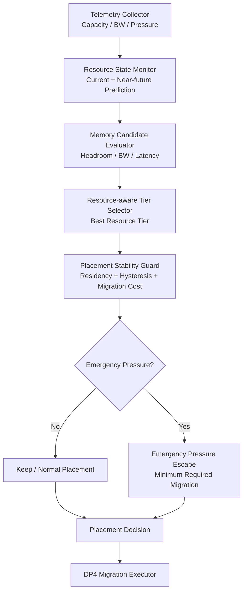
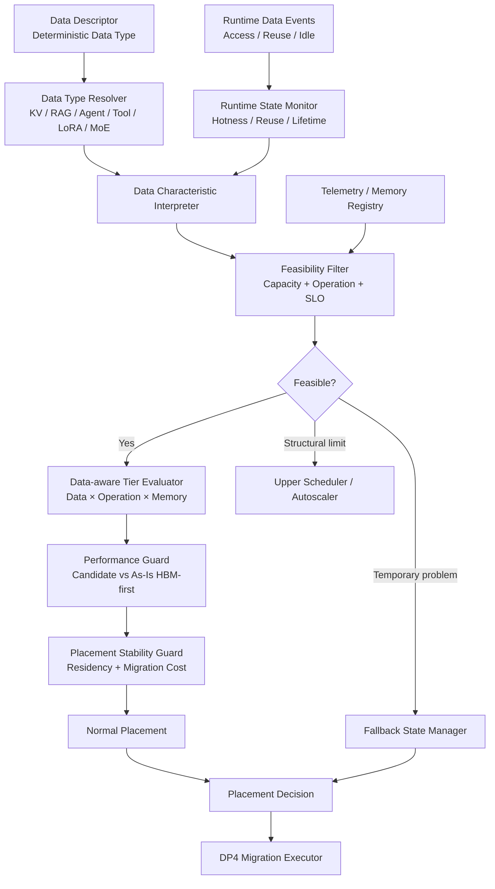
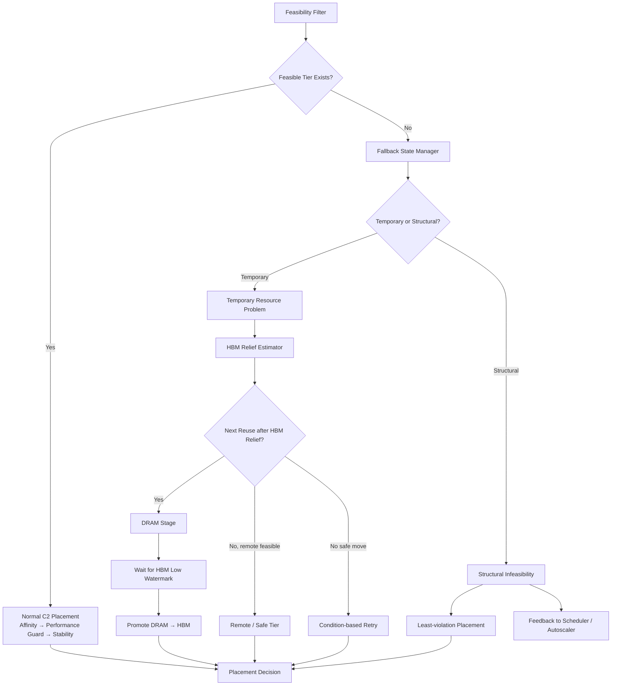

# DP1 Reinforcement V2 Design — C1-R2 / C2-R2

> 목적: C1/C2의 기본 철학은 유지하면서, 1차 평가에서 발견된 문제를 최소한의 모듈로 보완한다.
>
> 이 문서는 **심사 시 한 번에 설명할 수 있는 구조**를 우선한다.  
> 모든 구조도는 **Top-down**으로 표현한다.

---

# 1. 한 장 요약

## C1-R2

**Resource 상태를 보고 배치한다.**  
단, 너무 자주 옮기지 않고, 정말 HBM pressure가 위험할 때만 강제로 relief한다.

```text
Resource 상태 관찰
      ↓
후보 Memory 평가
      ↓
안정성 검사
      ↓
정상: 유지/배치
위험: 필요한 만큼만 긴급 이동
```

## C2-R2

**Data가 무엇인지 + 실제로 어떻게 사용되는지 보고 배치한다.**  
Data-near compute가 실제로 유리할 때만 사용하고, 일시적으로 배치가 어려우면 Fallback State Manager가 복구를 담당한다.

```text
Data 이해
      ↓
실행 가능한 Memory만 필터링
      ↓
Data/Operation에 가장 유리한 Tier 선택
      ↓
As-Is보다 실제로 유리한지 확인
      ↓
안정적으로 유지 또는 Recovery
```

---

# 2. C1-R2 — 전체 구조

C1은 끝까지 **Resource-centric**이다.  
Data type/hotness/reuse를 해석하지 않는다.



## 2.1 모듈 설명

### ① Resource State Monitor
현재 HBM/DRAM/CXL 등의:

- Capacity utilization
- BW utilization
- 최근 trend

를 보고 가까운 미래의 pressure를 예측한다.

### ② Memory Candidate Evaluator
현재 object를 둘 수 있는 Memory만 추린다.

예:

- Capacity가 충분한가
- 필요한 operation을 실행할 수 있는가
- BW/latency가 너무 나쁘지 않은가

### ③ Resource-aware Tier Selector
Data 의미는 보지 않고 **Resource 상태만으로** 가장 좋은 Tier를 고른다.

### ④ Placement Stability Guard
가장 좋은 Tier가 바뀌었다고 바로 migration하지 않는다.

```text
새 Tier의 이득
    >
Migration Cost + Hysteresis Margin
```

일 때만 이동한다.

### ⑤ Emergency Pressure Escape
C1-R에서 migration을 너무 억제하자 HBM pressure가 늦게 해소되는 문제가 생겼다.

따라서:

```text
Predicted HBM Pressure < Emergency
        ↓
기존 Stability Guard 유지

Predicted HBM Pressure >= Emergency
        ↓
Residency 일부 우회
        ↓
Pressure를 줄이는 데 가장 효율적인 Object만 이동
```

핵심은 **“평소에는 안 움직이고, 위험할 때 필요한 만큼만 움직인다”**이다.

---

# 3. C2-R2 — 전체 구조

C2의 핵심은 **Data-aware + Operation-aware Placement**다.

중요한 전제:

> **Data Type은 deterministic하다.**

Data Descriptor에 `KV_CACHE`, `RAG_DATA`, `AGENT_MEMORY`, `TOOL_RESULT` 등이 명시되므로  
“이 데이터가 무슨 종류인지”는 추측하지 않는다.

불확실한 것은 Data Type이 아니라:

- 앞으로 얼마나 자주 접근될지
- 언제 다시 사용될지
- 얼마나 오래 살아 있을지

같은 **Runtime behavior**다.



---

# 4. C2-R2 모듈 설명

## 4.1 Data Type Resolver

```text
Data Descriptor
   ↓
KV_CACHE / RAG_DATA / AGENT_MEMORY / ...
```

여기는 **deterministic**하다.

예:

- vLLM이 생성한 KV block → `KV_CACHE`
- Vector DB index → `RAG_DATA`
- Agent long-term state → `AGENT_MEMORY`

따라서 기존 draft의 **Low-confidence Classifier / Safe Envelope는 제거한다.**

---

## 4.2 Runtime State Monitor

Data Type이 아니라 **실제 사용 패턴**을 관찰한다.

예:

```text
Access Rate
Reuse Interval
Idle Time
Object Age
```

여기에서:

- Hot / Cold
- Next Reuse
- Long-lived / Short-lived

를 추정한다.

---

## 4.3 Feasibility Filter

C2 baseline의 가장 큰 문제는:

```text
Affinity로 Tier 선택
      ↓
나중에 보니 실행 불가
      ↓
Fallback
```

였다는 점이다.

V2에서는 순서를 바꾼다.

```text
모든 Tier
   ↓
실행 가능한 Tier만 남김
   ↓
그 안에서 Affinity 비교
```

검사 항목:

- Capacity
- Required operation support
- TTFT budget
- TPOT budget
- Link / BW condition

---

## 4.4 Data-aware Tier Evaluator

여기가 C2의 핵심 차별점이다.

```text
Data Type
+ Runtime Behavior
+ Required Operation
+ Memory Capability
        ↓
Placement Affinity
```

예:

### RAG
```text
RAG_DATA
+ Vector Similarity GEMV
+ SSD resident
        ↓
SSD-PIM 후보
```

### KV Cache
```text
KV_CACHE
+ Attention
+ Cold / Large Context
        ↓
Custom HBM / CXL-PNM 후보
```

즉 C2는 **Data-near Compute를 의도적으로 활용할 수 있는 구조**다.

---

## 4.5 Performance Guard

C2가 Data-aware라는 이유만으로 다른 Tier를 사용하면 안 된다.

항상 후보 path를 As-Is HBM-first와 비교한다.

```text
Candidate Path
vs
As-Is HBM-first
```

예:

### KV
```text
HBM:
Attention + GPU FFN

Custom HBM / CXL-PNM:
Remote Attention
+ Activation Round-trip
+ GPU FFN
+ Migration Cost
```

Candidate가 더 빠를 때만 offload한다.

### RAG
```text
As-Is:
Vector Transfer + GPU/CPU GEMV

SSD-PIM:
Local GEMV + Score Transfer
```

SSD-PIM이 실제로 TTFT/Goodput을 개선할 때만 사용한다.

이 Guard가 `kv_b1_c32k_cold_cxl` 같은 **잘못된 offload를 막는 역할**을 한다.

---

## 4.6 Placement Stability Guard

좋은 Tier가 바뀌었다고 바로 이동하지 않는다.

```text
Current Tier still usable?
      ↓
New Tier benefit > Migration Cost?
      ↓
Minimum Residency satisfied?
      ↓
Migration
```

목적은 C2 baseline에서 발생했던 migration storm을 막는 것이다.

---

# 5. C2 Fallback State Manager

Fallback State Manager는 **기존 C2 정상 path 옆에 붙는 Recovery Module**이다.

정상 placement를 대신하지 않는다.



## 5.1 Temporary Infeasible

현재 순간에만 placement가 어렵다.

예:

- HBM pressure
- Link contention
- 일시적 capacity shortage

이 경우:

- DRAM stage 후 HBM 회복 대기
- Remote compute 가능한 Tier 사용
- Resource condition이 바뀔 때만 재평가

를 한다.

매 tick fallback하지 않는다.

## 5.2 Structural Infeasible

현재 HW/SLO 조합 자체가 불가능하다.

예:

```text
B256 × 512K
TPOT target = 50 ms
모든 Tier가 50 ms 초과
```

이 경우 계속 migration을 시도하지 않는다.

```text
least-violation Tier
+
"현재 HW/SLO로는 불가능" Feedback
        ↓
Upper Scheduler / Autoscaler
```

---

# 6. C1-R2 vs C2-R2 — 심사용 한 눈 비교

| | C1-R2 | C2-R2 |
|---|---|---|
| 기준 정보 | Resource 상태 | Data 특성 + Resource 상태 |
| Data Type 이해 | 없음 | **Deterministic Resolver** |
| Runtime behavior 예측 | 없음 | Hotness / Reuse / Lifetime |
| Data-near Compute 활용 | 제한적 | **주요 장점** |
| Tier 선택 기준 | Resource utility | Data/Operation affinity |
| 잘못된 이동 방지 | Stability Guard | Performance + Stability Guard |
| Pressure 대응 | Emergency Escape | Pressure-aware Fallback |
| 일시적 배치 실패 | 다른 Resource 선택 | **Fallback State Manager** |
| 구조적 SLO 불가 | 별도 처리 약함 | Scheduler에 명시적 feedback |

---

# 7. Performance-first 원칙

최종 후보는 **Target Workload에서 As-Is보다 Performance가 좋아야 한다.**

모든 scenario는 계속 실행한다.

결과는 다음 네 가지로 나눈다.

```text
Target Domain
→ As-Is보다 Performance WIN

Neutral Domain
→ As-Is와 거의 동일

Adverse Domain
→ Performance Guard로 As-Is path 유지

SLO-infeasible Stress
→ Candidate winner가 아니라 HW/SLO boundary로 분리
```

Performance는 다음을 따로 본다.

- Max Sustainable SLO Goodput
- TTFT p99
- TPOT p99

---

# 8. 대표 Target Scenario

## C1-R2
Resource pressure가 placement의 핵심 변수인 경우.

- `hbm_pressure_ramp_b64`
- `hbm_bw_shock_b256`
- `host_path_pressure_b64`

## C2-R2 — Data-near Compute
Data와 Memory-side operation의 궁합이 중요한 경우.

- `rag_8tib_b64_ssd_pim`
- `rag_8tib_b256_ssd_pim`
- `kv_b16_c32k_burst_chbm`

## C2-R2 — Negative Control
사용 가능한 accelerator가 있어도 실제 성능이 나쁘면 사용하지 않아야 한다.

- `kv_b1_c32k_cold_cxl`

기대 결과:

```text
CXL-PNM available
      ↓
Performance Guard
      ↓
HBM-first가 더 빠름
      ↓
CXL offload 하지 않음
```

---

# 9. 다음 평가에서 확인할 것

## C1-R2

- As-Is 대비 Goodput 개선
- C1-R의 낮은 migration 유지
- HBM pressure violation 감소

## C2-R2

- Data-near scenario에서 As-Is보다 Goodput/TTFT 개선
- Neutral scenario에서 As-Is 수준 유지
- CXL negative-control에서 불필요한 offload 제거
- Fallback / Migration storm 재발 방지

최종 보고서는 **Scenario별 WIN / TRADE-OFF / NEUTRAL / LOSS**와 함께 Target-domain aggregate를 별도로 제시한다.
