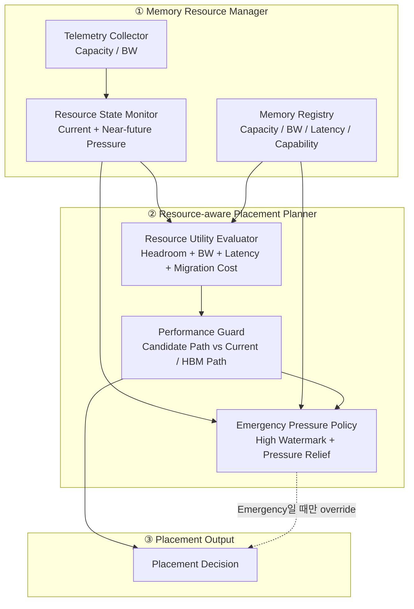
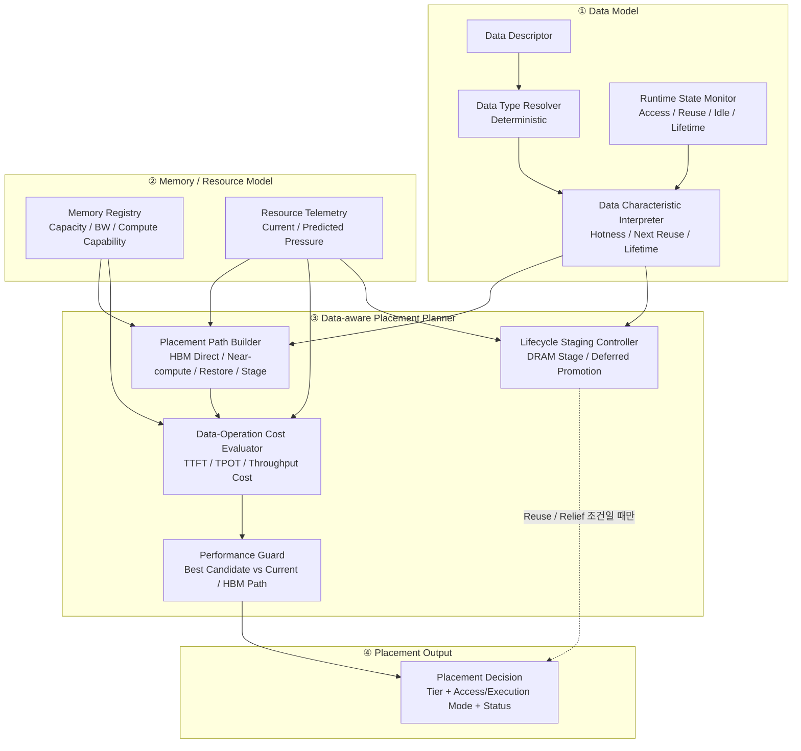

# DP1 Reinforcement V2 Design — C1-R2 / C2-R2

> 목적: 1차 평가에서 발견된 문제를 보완하되, C1/C2의 핵심 철학은 유지한다.
>
> 이 문서는 **심사 시 한 장씩 설명할 수 있는 Module View**를 우선한다.  
> 다이어그램은 모두 **Top-down module/dependency view**이며 sequence/flow chart가 아니다.

---

# 1. 핵심 요약

## C1-R2

> **Resource 상태를 보고 가장 좋은 Memory Tier를 선택한다.  
> 단, HBM pressure가 Emergency 수준이어도 As-Is/현재 Path보다 성능이 크게 나빠지는 이동은 Performance Guard가 차단한다.**

## C2-R2

> **Data Type과 Runtime behavior를 이용해 각 Memory Tier에서 가능한 Placement/Execution Path의 비용을 비교한다.  
> Data-near Compute가 As-Is보다 실제로 유리할 때만 사용한다.**

중요한 전제:

- Data Type은 Data Descriptor로부터 **deterministic**하게 결정한다.
- 정상 상황에서 “갈 수 있는 Tier가 없다”는 표현은 사용하지 않는다.
- DRAM/CXL/SSD 등 물리적으로 저장 가능한 Tier는 일반적으로 존재한다.
- Serving SLO는 DP1 Placement Policy의 판단 기준으로 사용하지 않는다.
- 모든 Candidate Path는 **Current/HBM Path 대비 상대 성능**으로 비교한다.

---

# 2. C1-R2 Module View




## 2.1 Resource Utility Evaluator

별도의 `Placement Stability Guard`는 두지 않는다.

다음 항목을 **Resource Utility Evaluator 안에서 같이 계산**한다.

```text
Candidate Utility
- Migration Cost
- Current Tier를 버리는 Cost
```

따라서 새 Tier가 조금 좋아졌다는 이유만으로 바로 migration하지 않는다.


## 2.2 Performance Guard

C1-R2도 C2-R2와 동일하게 **“옮길 수 있는가?”뿐 아니라 “옮기면 실제로 더 느려지는가?”**를 확인한다.

다만 C1은 C2처럼 Hotness / Reuse / Lifetime 같은 Runtime Data Semantics를 사용하지 않는다.

C1의 Performance Guard 입력은:

```text
Current / Predicted Resource State
+ Memory Capability
+ Static Execution / Transfer Cost
+ Migration Cost
```

이다.

비교 대상:

```text
Candidate Path
vs
Current Tier / HBM Path
```

Candidate가 다음 중 하나를 만족해야 이동 후보로 인정한다.

- service time 개선
- TTFT 개선
- TPOT regression이 허용 범위 이내

따라서 Emergency라고 해도:

```text
HBM pressure 높음
→ offload candidate 생성
→ Performance Guard
→ 성능 손실이 너무 크면 HBM 유지
```

한다.

C2와의 차이는 **Guard의 원칙은 같지만 판단 정보가 다르다**는 점이다.

- C1: Resource State + Static Path Cost
- C2: Data Type + Runtime Behavior + Operation-aware Path Cost

---

## 2.3 Emergency Pressure란?

쉽게 말하면:

> **HBM Capacity 또는 BW가 high watermark를 넘었거나, 가까운 미래에 넘을 것으로 예측되는 상태**

V2 초기 simulation에서는 재현성을 위해 예를 들어:

```text
Emergency High Watermark = 0.90
```

처럼 Config 값으로 고정할 수 있다.

하지만 `0.90` 자체가 architecture의 본질은 아니다.  
실제 시스템에서는 Tier/Workload별 configurable parameter다.

예:

```text
Normal
Predicted HBM Pressure < 90%
→ 기존 Resource Utility 정책 사용

Emergency
Predicted HBM Pressure >= 90%
→ Pressure Relief 정책으로 전환
```

Emergency에서 정책 자체가 바뀐다는 것이 핵심이다.

---

## 2.4 Minimum-cost Pressure Relief

Emergency라고 해서 많은 Data를 한꺼번에 내리지 않는다.

목표는:

> **HBM pressure를 safe 영역으로 되돌리는 데 필요한 최소 이동만 수행**

이다.

개념적으로:

```text
minimize
    Total Migration Cost

subject to
    Predicted HBM Pressure after migration
    <= Relief Target
```

예:

```text
Predicted HBM Pressure = 94%
Relief Target          = 85%

→ 9%p 정도의 pressure만 줄이면 됨
→ 모든 Object를 내리지 않고
→ Migration Cost 대비 Pressure Relief가 큰 Object부터 선택
```

초기 evaluator에서는 High Watermark / Relief Target을 Config로 고정하고 sensitivity test를 별도로 수행한다.

---

# 3. C2-R2 Module View

C2는 **Data-aware + Operation-aware** 구조다.



---

# 4. C2 모듈 설명

## 4.1 Data Type Resolver

Data Type은 추측하지 않는다.

예:

- vLLM이 생성한 KV block → `KV_CACHE`
- Vector DB index → `RAG_DATA`
- Agent state → `AGENT_MEMORY`
- Tool output → `TOOL_RESULT`

불확실성은 **Type이 아니라 Runtime behavior**에 있다.

---

## 4.2 Runtime State Monitor

실제 access history를 보고 다음을 추정한다.

- Hot / Cold
- Next Reuse
- Long-lived / Short-lived
- Idle duration

예:

```text
KV_CACHE라는 Type은 확정

하지만
"이 KV가 1초 뒤 다시 쓰일지,
 30초 뒤 다시 쓰일지"
는 Runtime prediction 대상
```

---

## 4.3 Placement Path Builder

여기서 중요한 변경은 **Tier를 단순히 가능/불가능으로 잘라내지 않는 것**이다.

같은 Tier라도 여러 Path가 있을 수 있다.

예: DRAM의 KV Cache

```text
DRAM에 저장
→ Attention은 DRAM에서 못 함
→ Access 시 HBM으로 Restore
```

이것도 유효한 Placement Path다.

예: CXL-PNM의 KV Cache

```text
CXL-PNM에 저장
→ Attention을 Near-memory에서 실행
→ Activation만 GPU와 교환
```

따라서 C2는:

```text
Tier
+
Data Access / Execution Mode
```

를 하나의 Path로 만들어 비교한다.

---

## 4.4 Data-Operation Cost Evaluator

각 Path의 end-to-end 비용을 계산한다.

예: KV

```text
HBM Path
= HBM Attention + GPU FFN

CXL-PNM Path
= Near-memory Attention
+ Activation Round-trip
+ GPU FFN

DRAM Path
= Restore Cost
+ HBM Attention
+ GPU FFN
```

예: RAG

```text
As-Is
= Vector Transfer + GPU/CPU GEMV

SSD-PIM
= Local GEMV + Score Transfer
```

여기가 C2의 핵심 장점인 **Data-near Compute 활용 여부를 정량적으로 판단하는 모듈**이다.

---

## 4.5 Performance Guard

가장 좋은 Candidate Path가 나와도 As-Is HBM-first보다 느리면 사용하지 않는다.

```text
Best Candidate Path
        vs
As-Is HBM-first Path
```

Candidate가 Performance 이득을 만들 때만 새로운 Tier/Mode를 선택한다.

따라서:

```text
Cold KV + CXL-PNM 가능
≠
무조건 CXL-PNM 사용
```

이다.

CXL remote Attention 비용이 HBM보다 크면 HBM path를 유지한다.

---

# 5. Fallback 대신 Relative Performance + Lifecycle Staging

기존 `Fallback State Manager` / `Degraded Placement` 개념은 제거한다.

이유는 두 가지다.

1. DP1은 serving SLO를 결정하지 않는다.
2. 정상 상태에서는 저장 가능한 Tier가 일반적으로 존재한다.

따라서 C2-R2는 모든 Candidate Path를 다음처럼 비교한다.

```text
Candidate Path
        vs
Current Tier / HBM Path
```

평가 항목:

- service interval / throughput cost
- TTFT cost
- TPOT cost
- migration / transfer cost
- Data/Operation affinity

Candidate가 end-to-end Performance에서 불리하면 Current/HBM Path를 유지한다.

---

# 6. Lifecycle Staging Controller

DRAM Stage / Deferred Promotion은 fallback이 아니라 **Data lifecycle을 이용한 별도 optimization**이다.

예:

```text
HBM Pressure가 3초 뒤 완화될 전망
KV Next Reuse는 10초 뒤

→ DRAM에 잠시 Stage
→ HBM 여유 발생
→ Access 전에 HBM으로 Promotion
```

반대로:

```text
KV Next Reuse = 0.5초 뒤
```

라면 기다리는 것이 더 느리므로 Stage하지 않는다.

즉 `Next Reuse`는 “fallback 여부”가 아니라 **Stage가 critical path를 피할 수 있는가**를 판단하는 정보다.

---

# 7. 정말 Target Tier가 없는 경우

정말로:

- HBM
- DRAM
- CXL
- HBF
- SSD

모든 Tier가 Capacity까지 꽉 차서 **물리적으로 저장할 공간이 하나도 없는 경우**는 DP1 placement policy 문제가 아니라 **System OOM / Admission Control 문제**다.

이 경우에만:

```text
NO_PHYSICAL_CAPACITY
→ Scheduler / Admission Control
```

로 올린다.

정상적인 C2 Placement에서는 “valid target tier 없음”을 일반적인 fallback condition으로 사용하지 않는다.

---

# 8. C1-R2 vs C2-R2 — 한 눈 비교

| | C1-R2 | C2-R2 |
|---|---|---|
| 핵심 판단 | Resource 상태 | Data + Operation + Resource |
| Data Type | 사용 안 함 | Deterministic |
| Runtime behavior | 사용 안 함 | Hotness / Reuse / Lifetime |
| Data-near Compute | 제한적 | **핵심 장점** |
| Migration Cost | Resource Utility 안에서 고려 | Path Cost 안에서 고려 |
| High HBM Pressure | **Emergency Pressure Policy + Performance Guard** | Path Cost + Performance Guard |
| Lifecycle 활용 | 없음 | **DRAM Stage / Deferred Promotion** |
| 실제 저장 공간 없음 | OOM / Admission Control | OOM / Admission Control |

---

# 9. Performance-first 평가 원칙

최종 후보는 Target Workload에서 As-Is보다 Performance가 좋아야 한다.

모든 Scenario를 계속 실행하되 다음으로 분류한다.

- **WIN** — Throughput/Latency가 As-Is보다 개선
- **TRADE-OFF** — Throughput과 Latency 방향이 다름
- **NEUTRAL** — As-Is와 실질적으로 동일
- **LOSS** — Performance 전반 악화

Serving SLO 초과 여부로 workload를 평가에서 제외하지 않는다.

대표 Target Domain:

### C1-R2
- HBM Capacity/BW pressure
- Resource shock/ramp

### C2-R2
- SSD-PIM RAG GEMV
- Custom HBM / CXL-PNM Attention
- Long-lived / reuse-sensitive data

Negative control:

- `kv_b1_c32k_cold_cxl`  
  CXL-PNM이 존재해도 실제 cost가 더 크면 **HBM path를 유지해야 한다.**

---


# 10. Architecture Decision — C1 vs C2

C1-R2와 C2-R2는 “성능 수치가 높은 쪽”만으로 선택하지 않는다.  
Architecture selection은 **얻는 capability와 지불하는 complexity의 trade-off**로 판단한다.

| | C1-R2 | C2-R2 |
|---|---|---|
| Runtime complexity | **낮음** | 높음 |
| Monitoring / State overhead | **낮음** | 높음 |
| Prediction dependency | **낮음** | 높음 |
| Resource pressure 대응 | **직접적** | Data context를 포함해 선택적 |
| Data-specific optimization | 제한적 | **강함** |
| Near-memory / PIM 활용 | 제한적 | **강함** |
| 새로운 AI Data별 정책 확장 | 공통 Resource 기준으로 단순 | **Data semantics를 반영 가능** |
| 운영 단순성 / Robustness | **강점** | Guard가 필요 |
| 최적화 potential | 제한적 | **강점** |

### Decision

DP1은 일반적인 Memory Tier balancer가 아니라 **AI Data Placement architecture**를 목표로 한다.

따라서 최종 Architecture는 **C2-R2**로 선택한다.

선택 근거:

- KV / RAG / Agent / LoRA / MoE의 Data behavior가 서로 다름
- Memory Tier별 Compute Capability가 서로 다름
- Placement가 Access/Execution Mode와 연결됨
- Data-near Compute를 쓸지 말지를 Resource 상태만으로는 충분히 판단하기 어려움
- Runtime Data behavior를 활용하면 Stage / Restore / Near-compute 같은 선택을 더 세밀하게 할 수 있음

반대로 C1-R2의 장점도 명확하다.

- 구조가 단순함
- Runtime state가 적음
- Decision overhead가 낮음
- Prediction error에 덜 민감함
- Resource balancing 문제만 풀 때는 충분히 실용적임

따라서 C1-R2는 **Simple / Robust baseline**, C2-R2는 **Feature-rich / Optimization-oriented final candidate**로 정리한다.

---

# 11. V2 구현 시 검증 포인트

## C1-R2

- Emergency threshold 진입 전/후 정책 변경이 명확한가
- Minimum-cost relief가 migration storm 없이 pressure를 낮추는가
- Target pressure scenario에서 As-Is 대비 Throughput/Latency가 개선되는가

## C2-R2

- Data Type은 deterministic하게 처리되는가
- Tier가 아니라 **Placement/Execution Path**를 비교하는가
- Data-near compute가 실제 Performance 이득일 때만 선택되는가
- Serving SLO 없이도 Current/HBM 대비 상대 성능으로 Path를 선택하는가
- 정말 공간이 없는 경우만 OOM/Admission Control로 분리되는가
