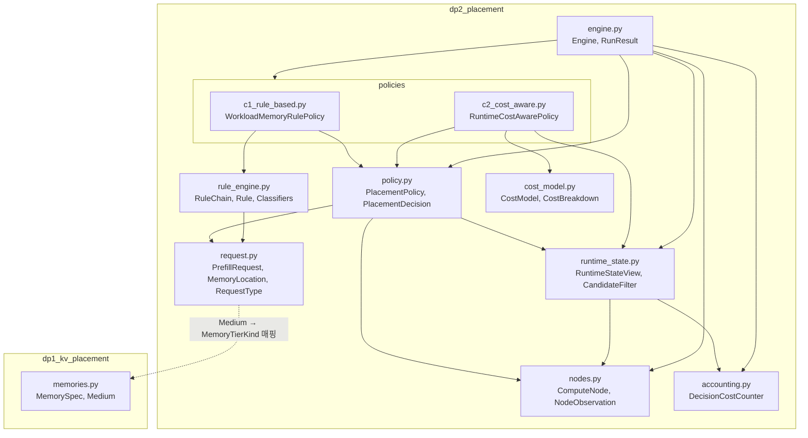
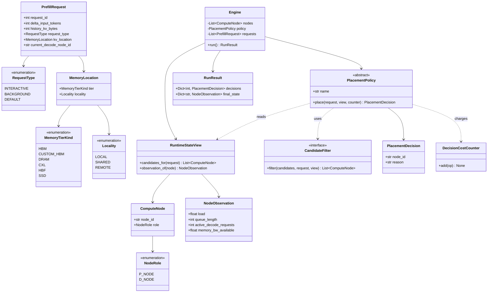
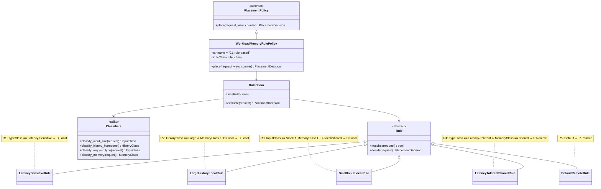
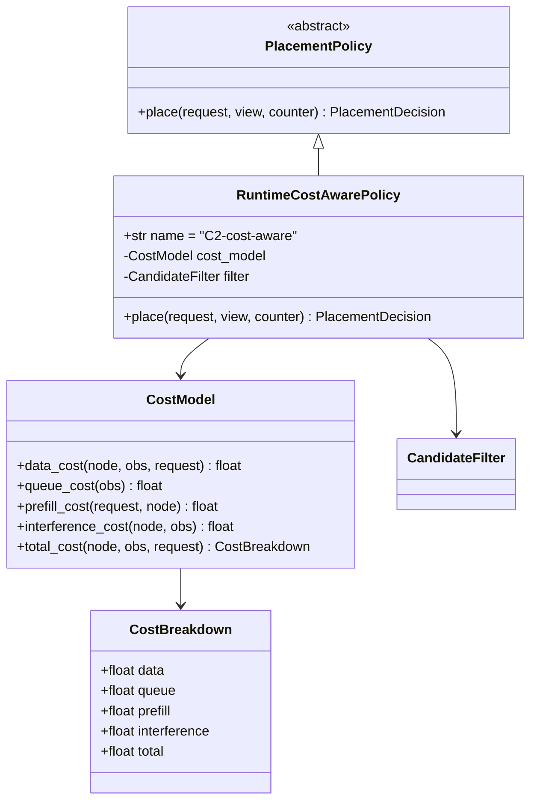
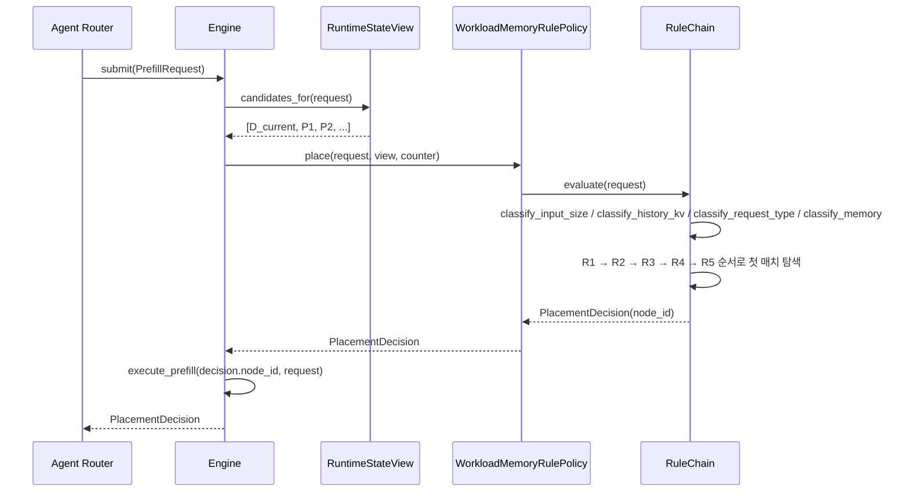
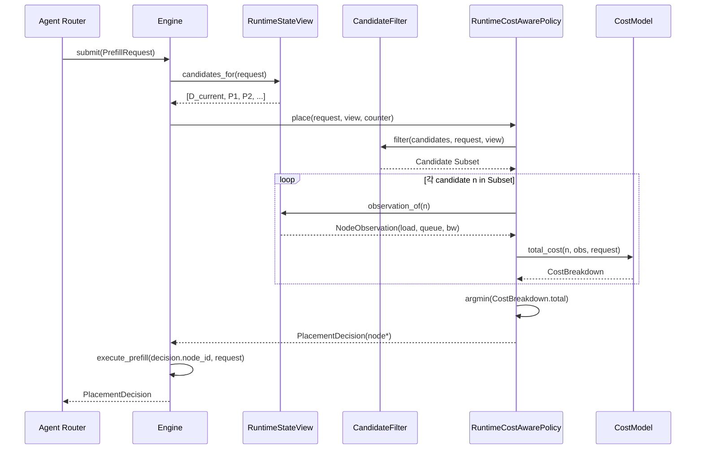
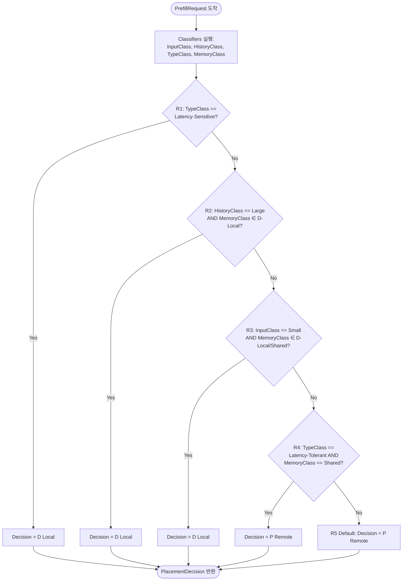
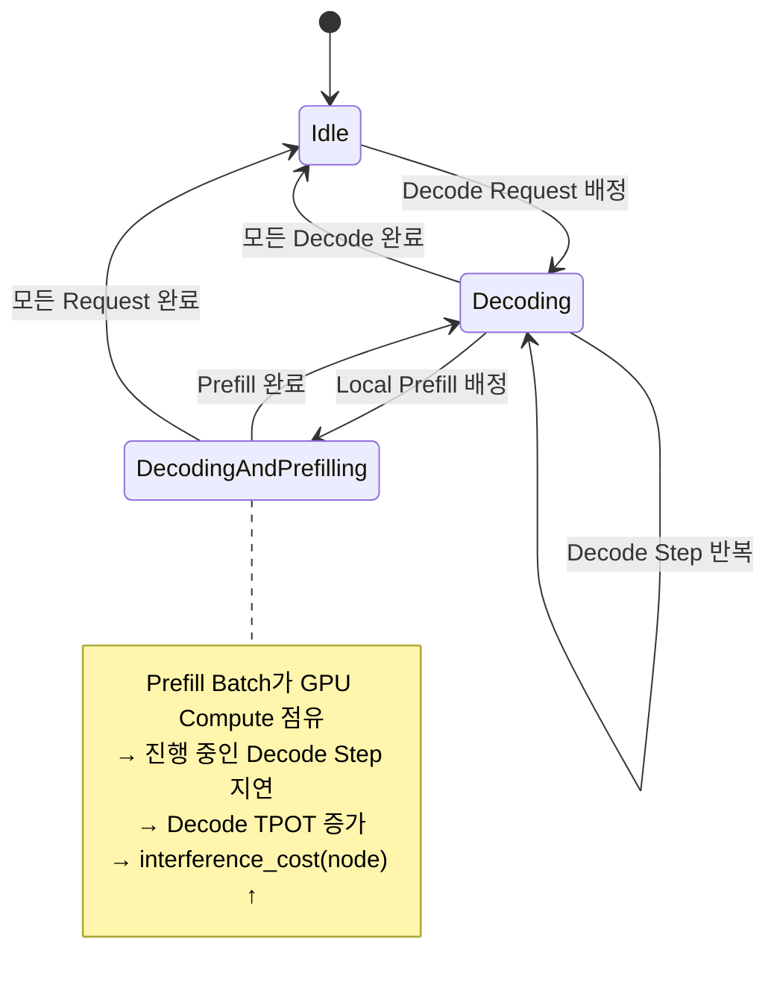

# DP2 구현을 위한 UML 설계

`dp2-agent-prefill-placement.md`에서 정의한 C1(Rule-based)/C2(Cost-aware) 두 후보를 실제로 구현하기 전에, 구현 구조를 UML로 먼저 명세한다.

## 0. 설계 원칙

DP1 구현(`dp1_kv_placement/`)과 동일한 패턴을 따른다.

- **Policy 추상화를 공유**한다. C1/C2는 같은 `PlacementPolicy` 인터페이스의 서로 다른 구현이며, `Engine`은 어떤 정책이 꽂히든 동일하게 동작한다. (`dp1_kv_placement/policy.py`의 `PlacementPolicy` ↔ `PlacementExecutor` 분리 방식과 동일)
- **Runtime State를 읽는 창구를 하나로 제한**한다. 정책은 `RuntimeStateView`를 통해서만 Node 상태를 읽으며, C1은 이 창구에서 Candidate 목록만 사용하고 C2는 Candidate 목록 + Load/Queue/BW Observation까지 사용한다. (`dp1_kv_placement/memories.py`의 `MemoryStateView`와 동일한 역할)
- **DP1 결과에 의존**한다. `PrefillRequest.kv_location`은 DP1이 결정한 배치 결과를 입력으로 받는다. DP2는 DP1을 대체하지 않고 그 위에 얹힌다.
- **DP1의 타입을 그대로 쓰지 않고 좁은 투영만 갖는다.** DP2에 필요한 것은 "어느 계층에, GPU에서 얼마나 먼 곳에 있는가"뿐이므로 `MemoryTierKind`/`Locality`를 자체 정의하고, DP1의 `Medium`에서 매핑해 받는다. **결합 지점은 그 매핑 하나뿐이다.**

---

## 1. Module View



`policies/` 아래 C1, C2 구현만 교체하면 `Engine`/`request.py`/`nodes.py`/`runtime_state.py`는 그대로 재사용된다. DP1과의 결합은 `request.py`에서 DP1의 `Medium`을 `MemoryTierKind`로 매핑하는 한 지점으로 제한한다.

---

## 2. Class Diagram

### 2.1 공통 (C1/C2 모두 사용)



### 2.2 C1. WorkloadMemoryRulePolicy

Rule Chain은 `dp2-agent-prefill-placement.md` 6장의 R1~R5를 1:1로 클래스화한다.



`RuleChain.rules`의 순서가 R1→R5 우선순위 그대로이며, `select_p_node`(정적 매핑)는 `DefaultRemoteRule`/`LatencyTolerantSharedRule`이 P Node 여러 개 중 하나를 고를 때 내부적으로 호출한다.

#### 2.2.1 호출 관계 예시

세 클래스의 역할은 분리되어 있다.

- **Classifiers**: Request의 원시 필드(ΔToken, History KV Size 등)를 각 축의 Class(Small/Large, D-Local/Shared/Remote 등)로 변환하는 순수 함수 모음이다. Rule을 전혀 모른다.
- **Rule**: 자신이 맡은 조건 하나만 안다(`matches`)과 그 조건이 맞을 때의 결정(`decide`)만 안다. 다른 Rule의 존재나 평가 순서를 모른다.
- **RuleChain**: `Rule` 목록의 순서를 쥐고 있고, Classifiers를 **딱 한 번** 호출해 분류 결과를 만든 뒤, 그 결과를 들고 Rule을 순서대로 물어본다. 즉 "무엇으로 판단할지"는 Classifiers, "판단 기준 하나"는 Rule, "몇 번째 기준까지 볼지/누가 이기는지"는 RuleChain의 책임이다.

예시 Request로 호출 순서를 따라가면 다음과 같다.

```text
PrefillRequest
  delta_input_tokens = 3000        (T_delta = 1024)
  history_kv_bytes   = 32 GB       (T_history = 16 GB)
  request_type       = BACKGROUND
  kv_location         = (HBM, LOCAL)
  current_decode_node_id = "D1"
```

```text
1. WorkloadMemoryRulePolicy.place(request, view, counter)
2.   → RuleChain.evaluate(request)
3.       → Classifiers.classify_input_size(request)    = InputClass.LARGE   (3000 > 1024)
4.       → Classifiers.classify_history_kv(request)     = HistoryClass.LARGE (32GB > 16GB)
5.       → Classifiers.classify_request_type(request)   = TypeClass.LATENCY_TOLERANT (BACKGROUND)
6.       → Classifiers.classify_memory(request)          = MemoryClass.D_LOCAL_FAST (HBM + LOCAL)
7.       (RuleChain은 이 4개 Class를 Rule마다 다시 계산하지 않고 그대로 재사용한다)
8.       → rules[0] = LatencySensitiveRule.matches(request, classes)  → False  (R1 불일치)
9.       → rules[1] = LargeHistoryLocalRule.matches(request, classes) → True   (R2 매치:
              HistoryClass.LARGE ∧ MemoryClass ∈ {D_LOCAL_FAST, D_LOCAL_SLOW})
10.          rules[2], rules[3], rules[4]는 호출되지 않는다 (첫 매치에서 멈춤)
11.      → LargeHistoryLocalRule.decide(request)
              = PlacementDecision(node_id="D1", reason="R2: large history KV, keep local")
12.  ← RuleChain.evaluate() 는 위 PlacementDecision을 그대로 반환
13. ← WorkloadMemoryRulePolicy.place() 는 이를 Engine에 반환
```

같은 Request에서 `history_kv_bytes`만 4GB(Small)로 바꾸면 R2가 더 이상 매치하지 않고, R3(`InputClass == Small`)도 InputClass가 LARGE라 불일치하므로 R4(`TypeClass == Latency-Tolerant ∧ MemoryClass == Shared`)까지 내려가지만 MemoryClass가 D_LOCAL_FAST(Shared 아님)라 역시 불일치해 결국 R5(Default)로 떨어져 `P Remote`가 된다. **Classifiers와 Rule 자체는 바뀌지 않고, RuleChain이 순서대로 물어보는 대상만 달라진다** — 이것이 세 클래스가 협력하는 방식이다.

### 2.3 C2. RuntimeCostAwarePolicy

Cost Model은 7.2장의 $C(n) = C_{data}(n) + C_{queue}(n) + C_{prefill}(n) + C_{interference}(n)$을 그대로 구현한다.



`RuntimeCostAwarePolicy.place()`는 `filter.filter()`로 Candidate Subset을 줄인 뒤, Subset의 각 Node에 대해 `cost_model.total_cost()`를 계산하고 `argmin`을 반환한다. (8장의 Candidate Filtering → Cost Evaluation 2단계 구조)

---

## 3. Sequence Diagram

### 3.1 C1: Rule-based Placement



C1은 `view`에서 Candidate **목록만** 조회하고, 각 Node의 Load/Queue Observation은 조회하지 않는다 — Runtime State 미반영이 구조적으로 드러나는 지점이다.

### 3.2 C2: Runtime Cost-aware Placement



C2는 매 Request마다 Subset 크기만큼 `observation_of()` + `total_cost()`를 반복 호출한다 — 이 반복 횟수가 8장에서 말한 Scale-out Decision Overhead의 실체다.

---

## 4. Activity Diagram: C1 Rule Chain 평가 흐름

`RuleChain.evaluate()` 내부를 흐름도로 펼치면 다음과 같다.



---

## 5. State Diagram: Compute Node와 Interference Cost

7.2장 Interference Cost의 근거(Prefill/Decode Co-location)를 Node 관점의 상태 전이로 표현한다. C2의 `interference_cost()`는 이 상태 전이가 `DecodingAndPrefilling`인 동안 값이 커진다.



C1에는 이 상태를 참조하는 Rule이 없다 — Node가 `DecodingAndPrefilling` 상태여도 Rule Chain의 입력(Request의 정적 필드)은 변하지 않으므로 Decision이 바뀌지 않는다.

---

## 6. C1 / C2 구현 구조 비교

| 구분 | C1 (WorkloadMemoryRulePolicy) | C2 (RuntimeCostAwarePolicy) |
|---|---|---|
| 핵심 협력 객체 | `RuleChain`, `Rule`, `Classifiers` | `CostModel`, `CandidateFilter`, `CostBreakdown` |
| `RuntimeStateView` 사용 범위 | `candidates_for()`만 사용 | `candidates_for()` + `observation_of()` (Load/Queue/BW) |
| Decision 절차 | Rule 순차 평가, 첫 매치 반환 | 전체(또는 Filter된) Candidate Cost 계산 후 `argmin` |
| Request당 호출 비용 | Classifier 4회 + Rule 매칭(최대 5회) — Candidate 수와 무관 | Candidate Subset 크기 × (`observation_of` + `total_cost`) |
| Runtime State 의존성 | 없음 | 있음 — Node 상태가 바뀌면 같은 Request도 다른 Decision 가능 |
| Scale-out 시 변경 지점 | 없음 (Rule/Threshold 고정) | `CandidateFilter` 구현을 바꿔 Subset 크기를 제어해야 함 |

이 표는 `dp2-agent-prefill-placement.md` 10장(예상 Trade-off)의 근거를 구현 레벨에서 재확인한 것이다: C1은 Request 처리 비용이 Node 수에 무관해 Scalability가 유리하고, C2는 Candidate마다 Observation을 읽어야 해 Node 수가 늘수록 비용이 함께 늘어난다.
