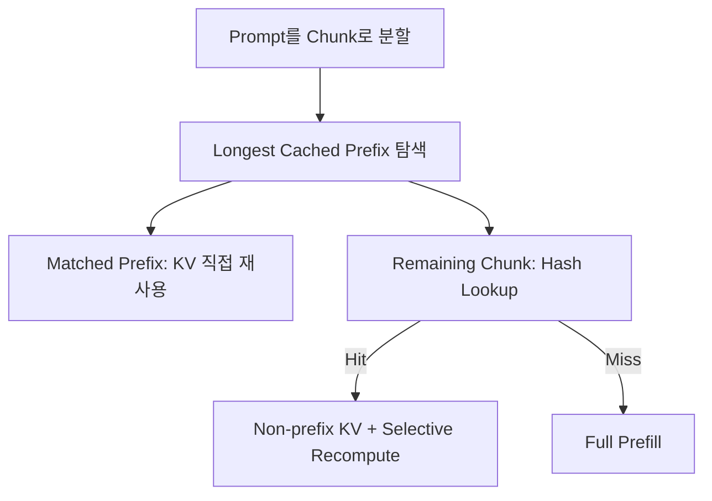
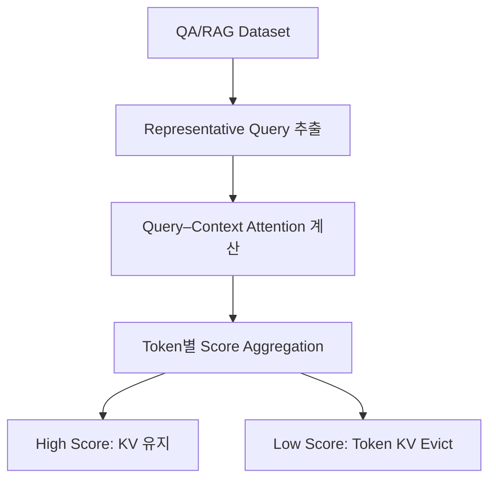
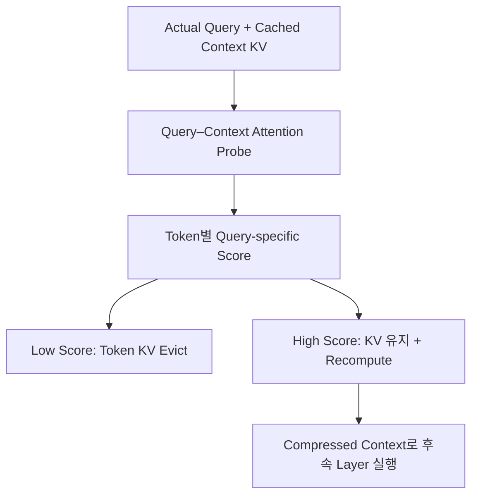
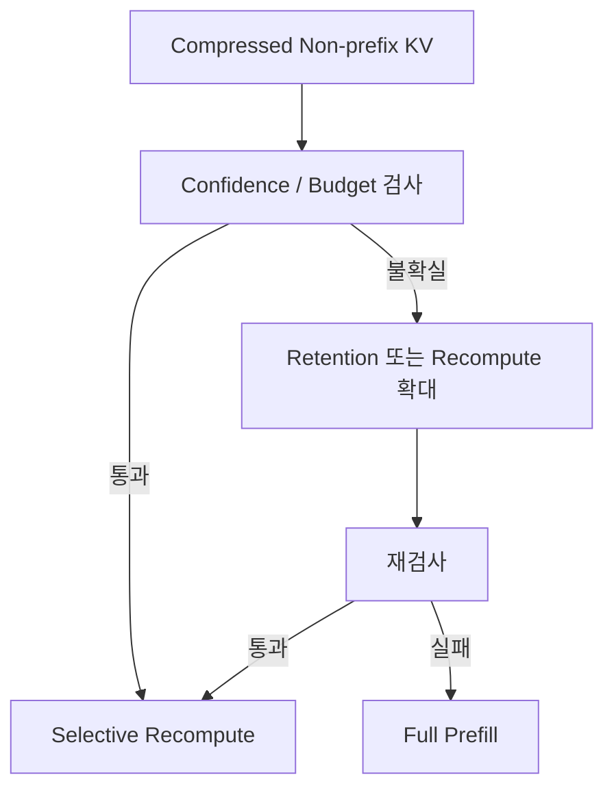

# DP2. Long Context를 위한 Non-prefix KV Reuse 및 Token-level KV Compression 구조

## 1. Design Point 정의

DP2는 Long Context Serving에서 다음 두 문제를 하나의 구조로 다룬다.

1. **Prefill 절감:** Prefix가 아닌 위치에서 다시 등장한 Chunk의 KV를 재사용하고, 달라진 Context만 Selective Recompute로 보정한다.
2. **KV 용량 절감:** 재사용을 위해 축적되는 KV Cache에서 중요도가 낮은 Token KV를 제거하여 Memory Footprint를 줄인다.

두 문제를 따로 최적화하면 모순이 생길 수 있다. KV를 많이 저장할수록 Prefill 재사용 기회는 늘지만 Memory Footprint도 커지고, KV를 과도하게 압축하면 재사용 가능한 정보와 모델 Accuracy가 함께 감소한다.

> **DP2의 결정:** Non-prefix Chunk KV를 재사용할 때, 어떤 Token KV를 유지·Evict하고 어떤 Token KV를 Selective Recompute할 것인가?

---

## 2. 배경 및 문제 정의

### 2.1 Agent의 Multi-turn 실행 일반화에 따라 누적 Context 증가

- Agent Workload는 단일 `Prefill → Decode`로 종료되는 일반적인 요청과 달리, **LLM 추론 → Tool Call → Tool Result → LLM 추론** 과정을 반복
- 각 Turn에서 이전 Conversation History를 유지하면서 User Input, Tool Result 등 새로운 Context가 추가됨
- Turn이 반복될수록 하나의 Agent Session에서 유지해야 하는 **누적 Context Length가 지속적으로 증가**

```text
Turn 1
[ Initial Context ]

Turn 2
[ Initial Context | Tool Result ]

Turn 3
[ Initial Context | Tool Result | New Context ]

                       ...

Turn N
[ ─────────────── Accumulated Long Context ─────────────── ]
```

**→ Multi-turn Agent Workload의 일반화에 따라 Long Context 처리가 중요한 Serving 요구사항으로 부상**

### 2.2 Long Context 환경에서는 KV Cache 증가로 상위 Memory의 Capacity Pressure 심화

- Transformer는 이전 Context에 대한 Attention 연산을 위해 Token별 KV Cache를 유지
- 따라서 Context Length 증가에 따라 **유지해야 하는 KV Cache 크기도 지속적으로 증가**
- 전체 KV Cache를 제한된 용량의 HBM에 유지하기 어려우며, 다수 Request가 동시에 수행되는 환경에서는 `Long Context × Concurrency`로 Capacity Pressure가 더욱 심화
- HBM Capacity 부족은 신규 Request 수용 제한 및 KV의 하위 Memory 이동/복구 증가로 이어질 수 있음

```text
Context Length ↑
      │
      ▼
KV Cache Size ↑
      │
      │ + Concurrency ↑
      ▼
HBM Capacity Pressure ↑
      │
      ▼
Available HBM Capacity ↓
KV Movement / Restore ↑
```

**→ Long Context Serving을 위해 제한된 상위 Memory에서 유지해야 하는 KV Working Set을 줄일 필요**

### 2.3 모든 KV가 Attention 결과에 동일하게 기여하지 않으므로 중요도가 낮은 Token KV의 선별적 Eviction 가능

- Long Context를 구성하는 모든 Token/KV가 향후 Attention 결과에 동일한 수준으로 기여하지 않음
- Query에 높은 Attention을 받는 일부 KV가 결과 생성에 상대적으로 중요하며, 낮은 Attention을 받는 KV는 영향이 제한적일 수 있음
- 따라서 하나의 KV Chunk 안에서 중요도가 낮은 Token KV를 선별적으로 Evict하여 전체 KV Working Set과 Attention 처리 대상을 축소할 수 있음

```text
Long Context KV Chunk

[K1][K2][K3][K4][K5][K6] ... [Kn]
 │       │           │
High    Low         Low
Importance

             │
             │ Token-level Eviction
             ▼

Retained KV
[K1][K3][K6] ...

        ↓

KV Memory Footprint ↓
Memory / I/O Cost ↓
Attention Processing Cost ↓
```

- 단, 실제로 중요한 KV를 잘못 Evict할 경우 모델 출력 품질이 저하될 수 있음
- 따라서 단순한 용량 확보가 아니라 **Accuracy 영향을 최소화하면서 최대한 많은 Token KV를 Evict하는 구조**가 필요

### 2.4 Long Context에서는 Prefill이 TTFT의 지배적인 비용이 된다

누적 Context가 길어지면 KV Capacity뿐 아니라 첫 Token을 생성하기 전에 전체 입력을 처리하는 Prefill 시간도 증가한다.

```text
Context Length 증가
        ↓
Prefill 연산량 증가
        ↓
TTFT 증가
```

따라서 Long Context Serving에서는 동일하거나 반복되는 Context에 대한 Prefill을 다시 수행하지 않는 것이 중요하다.

### 2.5 Prefix Caching만으로는 중간에 반복되는 Chunk를 재사용할 수 없다

Prefix Caching은 Prompt의 처음부터 Token Sequence가 일치하는 구간의 KV를 직접 재사용한다. 하지만 Agent/RAG Workload에서는 동일한 문서, File Read 결과 또는 Tool Result Chunk가 다른 순서나 다른 앞선 Context와 함께 사용될 수 있다.

예를 들어 기존에는 다음 순서로 Chunk가 사용되었다고 하자.

```text
Cached Context:  Chunk 1 → Chunk 2 → Chunk 3
New Prompt:      Chunk 3 → Chunk 2 → Chunk 1
```

각 Chunk의 내용은 같지만 새 Prompt에서의 위치와 앞선 Context가 달라진다. 따라서 중간 Chunk의 사전 계산 KV를 그대로 붙이면 Chunk 간 Cross-attention이 반영되지 않는다.

이를 해결하려면:

- 각 Chunk를 독립적으로 식별하고 KV를 조회한다.
- Prefix에 포함된 Chunk는 그대로 재사용한다.
- Prefix 밖에서 Hit한 Chunk는 저장 KV를 기반으로 사용하되, 새 Context 때문에 달라져야 하는 일부 Token KV를 Selective Recompute한다.
- Cache Miss Chunk는 Full Prefill한다.

### 2.6 Non-prefix KV Reuse는 Prefill을 줄이지만 KV 저장량을 증가시킨다

더 많은 Chunk KV를 저장할수록 반복 Chunk의 Prefill을 피할 가능성은 커진다. 그러나 Long Context와 많은 재사용 Chunk가 결합되면 저장해야 할 KV Cache도 지속적으로 증가한다.

```text
Non-prefix KV 저장 확대
        ├─ Prefill Reuse 증가
        └─ KV Memory Footprint 증가

Long Context × Chunk 수 × 동시 Request 수
        ↓
Given Memory Budget 초과
```

DP1이 HBM, DRAM, CXL Memory, SSD 등으로 KV를 적절히 배치하더라도 전체 Context의 KV 크기가 가용 Memory보다 커지면 배치만으로 해결할 수 없다. 이 경우 KV 자체의 크기를 줄여야 한다.

### 2.7 본 문서에서 Eviction은 Token-level KV Reduction을 의미한다

본 DP에서 `KV Eviction`은 다음 동작이 아니다.

- KV Chunk 전체를 Cache Repository에서 삭제하는 것
- HBM의 KV를 DRAM/CXL/SSD로 이동하는 것
- 하나의 Session 또는 Sequence 전체를 제거하는 것

본 DP에서 Eviction은 **하나의 Chunk 안에서 모델 결과에 대한 기여도가 낮은 Token의 K/V를 제거하는 것**이다.

```text
Before:  100-token Chunk KV
After:    50-token Chunk KV retained
          50-token Chunk KV evicted
```

하위 Memory Tier로의 이동은 DP1의 Placement 문제이고, 본 DP의 Token eviction은 전체 Memory Footprint와 Attention 대상 KV 수를 실제로 줄인다. 이 과정은 Lossy할 수 있으므로 모델 Accuracy 검증이 필수다.

### 2.8 문제 정의 및 핵심 질문

> **Long Context 환경에서 Accuracy 영향을 최소화하면서 KV Capacity 및 처리 비용을 절감하기 위해, Attention 중요도에 기반하여 Eviction할 Token KV를 결정하는 구조가 필요하다. 동시에 Prefix가 아닌 위치에서 반복되는 Chunk KV를 Selective Recompute하여 재사용함으로써 Prefill과 TTFT를 줄여야 한다.**

> **Long Context가 심화되면서 Prefill 시간이 TTFT의 지배적인 비용으로 증가하고 있다. 기존 Prefix Caching을 넘어 반복되는 Non-prefix Chunk KV를 Selective Recompute하여 재사용할 때, 어떤 Token의 KV를 유지하고 어떤 Token의 KV를 Evict해야 모델 Accuracy를 유지하면서 KV Memory Footprint와 End-to-End Latency를 줄일 수 있는가?**

---

## 3. DP1과의 관계

DP1과 DP2는 서로 다른 결정을 담당한다.

| Design Point | 질문 | 결정 결과 |
|---|---|---|
| **DP1. AI Data Placement** | AI Data를 어느 Memory에 둘 것인가? | HBM / DRAM / CXL Memory / SSD 등의 배치 위치 |
| **DP2. KV Reuse & Compression** | 저장할 KV 양을 어떻게 줄이고 재사용할 것인가? | Retained Token KV와 Recomputed Token KV |

DP1은 주어진 AI Data를 이기종 Memory에 배치한다. DP2는 Long Context 증가로 **주어진 Memory Capacity보다 KV 자체가 커지는 경우**, Token-level Compression으로 저장량을 줄이고 Non-prefix reuse로 Prefill을 절감한다.

따라서 DP2는 DP1의 배치 결정을 되돌리거나 Compute 위치를 다시 결정하지 않는다. DP2가 KV의 논리적 Working Set을 줄이면, DP1은 축소된 KV를 적절한 Memory Tier에 배치한다.

---

## 4. 공통 Cache 모델과 처리 규칙

### 4.1 Chunk 식별

각 Chunk는 Chunk 내용으로 계산한 Hash로 식별한다.

```text
KvChunkEntry {
    chunk_hash
}
```

- `KvChunkEntry`는 Chunk Hash만 가진다.
- Chunk KV를 독립적으로 생성할 때 Position은 항상 0부터 시작한다.
- 실제 Prompt 안의 위치는 요청 조립 시 결정한다.
- Model, Adapter, KV Format 등 호환성 경계가 필요하면 Entry 필드를 늘리지 않고 Cache Namespace 또는 Hash 입력에 포함한다.

### 4.2 Prefix와 Non-prefix의 처리 구분

`Prefix 여부`와 `Cache Hit 여부`를 서로 다른 두 단계로 중복 판정하지 않는다. 먼저 현재 Prompt에서 **Cache와 일치하는 Longest Prefix Range**를 찾고, 그 범위는 곧 Prefix Cache Hit로 처리한다.



처리 규칙은 세 가지뿐이다.

| Chunk 상태 | 처리 |
|---|---|
| Matched Prefix Range | Prefix KV 직접 재사용 |
| Non-prefix Cache Hit | 저장 KV를 불러오고 Selective Recompute |
| Cache Miss | Full Prefill 후 Cache 등록 후보로 전달 |

`Exact / Repairable / Invalid`와 같은 별도 Compatibility Enum은 두지 않는다. Prefix Hit는 직접 재사용, Non-prefix Hit는 Selective Recompute, Miss는 Full Prefill로 의미가 충분히 구분된다.

### 4.3 두 후보에 공통인 결정

두 후보 모두 다음을 수행한다.

- Prefix KV 직접 재사용
- Non-prefix Chunk KV 조회 및 재사용
- Token-level KV Retention/Eviction
- Context 차이를 보정하기 위한 Selective Recompute
- Memory Budget 또는 Accuracy Guard 위반 시 Retention/Recompute 범위 확대
- 안전한 판단이 불가능할 때 Full Prefill Fallback

두 후보의 차이는 **Token을 선택하는 Importance Signal과 그 Signal을 얻는 시점**이다.

---

## 5. C1 — Offline Dataset-query Attention Compression + Online HKVD Repair

### 5.1 개념

C1은 QA/RAG Dataset에서 Representative Query를 추출하고, 각 Query와 기존 Context 사이의 Attention을 사전에 계산한다. 여러 Query에서 반복적으로 Attention이 낮은 Context Token의 KV를 Offline에서 Evict한다.

실제 요청에서 Non-prefix Chunk를 재사용할 때는 Offline Attention Score를 다시 사용해 보정 Token을 고르는 것이 아니라, CacheBlend 방식의 **HKVD(High-KV-Deviation)** 를 사용하여 새 Context에서 변화가 큰 Token을 Selective Recompute한다.

즉 C1에는 서로 다른 두 판단이 있다.

| 결정 | 시점 | Signal |
|---|---|---|
| 어떤 Token KV를 저장·Evict할 것인가 | Offline | Dataset Query–Context Attention |
| 어떤 Token KV를 다시 계산할 것인가 | Online | Old KV와 New KV 사이의 KV Deviation |

### 5.2 Offline Compression



Context Token `t`의 Offline Importance는 Dataset Query 집합에서 받은 Attention을 집계하여 계산한다.

```text
OfflineImportance(t)
  = Aggregate over q in RepresentativeQueries [ Attention(q, t) ]

Retain(t)  if OfflineImportance(t) >= retention_threshold
Evict(t)   otherwise
```

`Aggregate`는 후보 구조를 바꾸지 않는 하위 Policy로 두고 다음을 Sweep할 수 있다.

- Mean: 평균적으로 자주 사용되는 Token을 보존
- Max 또는 High Percentile: 일부 Query에서 매우 중요한 Token도 보존
- Coverage-aware Aggregation: Query Cluster별 최소 Coverage 보장

Offline Compression의 산출물은 Chunk Hash로 조회되는 압축 KV Payload다. Chunk의 원문 Token과 재계산에 필요한 Metadata는 Full Prefill Fallback과 Selective Recompute가 가능하도록 보존한다.

### 5.3 Online HKVD-based Selective Recompute

기존 Chunk 순서가 `1 → 2 → 3`이고 새 Prompt 순서가 `3 → 2 → 1`이라고 하자.

```text
Old cached KV:  KV(1), KV(2), KV(3)
New Prompt:     Chunk 3, Chunk 2, Chunk 1
```

새 Prompt에서는 Chunk 위치와 preceding context가 달라졌으므로 저장 KV와 올바른 KV 사이에 차이가 생긴다. C1은 다음과 같이 보정한다.

1. 새 Chunk 순서를 기준으로 첫 번째 Layer를 계산한다.
2. 새로 계산한 K/V와 저장된 Old K/V의 Token별 Deviation을 구한다.
3. Deviation이 큰 Token을 HKVD Token으로 선택한다.
4. 이후 Layer에서는 HKVD Token만 Selective Recompute한다.
5. 선택되지 않은 Token의 KV는 압축 Cache에서 재사용한다.

```text
KVDeviation(layer, token)
  = distance(K_new, K_old)
  + lambda * distance(V_new, V_old)

HKVD(layer)
  = TopK tokens by KVDeviation(layer, token)
```

CacheBlend의 Gradual Filtering을 적용하는 경우 첫 Layer에서 목표 비율보다 넓은 HKVD 후보를 선택하고, 이후 Layer에서 관측한 Deviation으로 후보를 점진적으로 줄인다.

### 5.4 압축 KV와 HKVD 비교 가능 범위

Offline 단계에서 이미 Evict한 Token에는 비교할 Old KV가 없다. 따라서 기본 C1에서 HKVD 비교 대상은 **Offline에서 Retain된 Token**으로 제한한다.

```text
HKVD Candidate Set = Offline Retained Token Set
```

Evict된 Token은 첫 Layer의 임시 계산에는 참여할 수 있지만 이후 Layer의 Cache 재사용 대상에는 포함되지 않는다. Offline 오분류가 의심되거나 Accuracy Guard를 만족하지 못하면 다음 순서로 Fallback한다.

1. Retention Ratio 확대
2. Selective Recompute Ratio 확대
3. 해당 Chunk 또는 전체 Prompt Full Prefill

Evict된 Token까지 HKVD 후보로 복원하려면 Token별 Old KV 또는 이에 준하는 Selector Metadata를 추가로 저장해야 한다. 이는 Compression Ratio를 낮추므로 기본 구조가 아니라 별도 확장안으로 평가한다.

### 5.5 기대 효과와 Risk

**기대 효과**

- Serving 이전에 KV Footprint 축소 가능
- Online Query-attention Scoring 비용 없음
- 반복 Workload에서 안정적인 Compression Ratio 확보 가능
- HKVD를 통해 Chunk 순서 변화에 따른 Cross-attention 오류 보정

**주요 Risk**

- Dataset Query와 Actual Query 분포가 다르면 중요한 Token이 이미 Evict될 수 있음
- Offline에서 제거한 Token은 기본 구조의 HKVD 후보가 될 수 없음
- Representative Query 선정 방법과 Aggregation Policy에 결과가 민감함
- Dataset 또는 Document가 변경되면 Importance Profile을 다시 생성해야 함

---

## 6. C2 — Online Actual-query Attention Compression & Recompute

### 6.1 개념

C2는 Offline Importance Profile을 만들지 않는다. Actual Query가 도착하면 Query와 Context KV 사이의 Attention을 계산하고, 현재 Query에 대한 Token Importance를 Runtime에 결정한다.

Actual Query Attention은 두 결정에 사용된다.

1. Attention이 낮은 Context Token KV를 Evict하여 이번 요청의 Working Set을 압축한다.
2. Attention이 높은 Token을 Non-prefix Chunk Blending의 Selective Recompute 대상으로 선택한다.

### 6.2 Online 처리 구조



```text
OnlineImportance(query, token)
  = Aggregate over selected heads/query tokens [ Attention(query, token) ]

Retain(token)     if OnlineImportance(query, token) >= retention_threshold
Recompute(token)  if OnlineImportance(query, token) >= recompute_threshold
Evict(token)      otherwise
```

Retention Threshold와 Recompute Threshold는 같은 값일 필요가 없다. 저장할 가치와 새 Context에 맞게 다시 계산할 가치는 서로 다른 결정이기 때문이다.

### 6.3 Attention Probe의 비용

C2의 Importance는 Actual Query가 도착한 뒤에만 알 수 있다. 따라서 Query–Context Attention Probe 비용이 요청의 Critical Path에 포함된다.

```text
C2 TTFT
  = Cache Lookup/Load
  + Query–Context Attention Probe
  + Token Selection
  + Selective Recompute
  + Remaining Prefill
```

C2가 유효하려면 Probe 비용보다 다음 절감량의 합이 커야 한다.

- 이후 Layer에서 줄어든 KV Load
- 줄어든 Attention 대상 Token 수
- 줄어든 Selective Recompute Token 수
- Full Prefill을 피한 연산량

첫 Layer Attention을 Probe로 사용할지, 일부 Head/Layer만 사용하는 경량 Probe를 둘지는 C2 내부 구현 Policy로 비교한다.

### 6.4 기대 효과와 Risk

**기대 효과**

- Actual Query에 중요한 Token을 직접 반영
- Query Distribution Shift에 C1보다 유연하게 대응
- 동일 Context라도 Query별로 다른 KV Working Set 구성 가능
- Compression과 Recompute가 하나의 Query-specific Signal을 공유

**주요 Risk**

- Attention Probe와 Token Selection이 TTFT Critical Path에 추가됨
- Importance를 계산하기 전에 Context KV를 읽어야 하므로 Load 절감 효과가 제한될 수 있음
- 첫 Layer의 Attention이 깊은 Layer의 중요도를 충분히 대표하지 못할 수 있음
- Query별 Working Set 변화로 Batching 및 Cache 관리가 복잡해질 수 있음

---

## 7. C1/C2 비교 가설

아래 표는 정량 평가 전의 설계 가설이며 후보 선정 결과가 아니다.

| 구분 | C1. Offline Attention + HKVD | C2. Online Actual-query Attention |
|---|---|---|
| Compression Signal | Dataset Representative Query Attention | Actual Query Attention |
| Recompute Signal | HKVD | Actual Query Attention |
| Compression 시점 | Serving 이전 | Request 처리 중 |
| Query Specificity | Dataset 분포 수준 | 요청별 |
| Runtime Selection Cost | 낮음 | 높음 |
| Distribution Shift 대응 | 상대적으로 취약 | 상대적으로 유리 |
| 사전 KV Footprint 절감 | 가능 | 불가능 |
| 주요 Accuracy Risk | Offline에서 중요한 Token 오분류 | Attention Probe가 중요 Token을 놓침 |
| 주요 Performance Risk | Mismatch로 Recompute/Full Prefill 증가 | Online Probe 비용이 절감량 상쇄 |

C1과 C2의 본질적인 비교 질문은 다음과 같다.

> **Dataset Query에서 일반화한 Importance로 KV를 미리 압축한 뒤 HKVD로 문맥 차이를 보정하는 것이 유리한가, 아니면 Actual Query Attention으로 요청마다 압축과 재계산 대상을 함께 결정하는 것이 유리한가?**

---

## 8. Quality Attribute와 핵심 QA 질문

DP2의 최적화 목표는 Latency, Accuracy, Memory를 하나의 임의 가중합으로 합치는 것이 아니라 다음 제약 문제로 둔다.

```text
Minimize:  End-to-End TTFT

Subject to:
  TaskAccuracy(candidate) >= accuracy_floor
  KVFootprint(candidate)  <= memory_budget
```

Memory Budget 또는 Accuracy Floor를 바꾸어 얻은 Pareto Curve로 C1과 C2를 비교한다.

### 8.1 Functional Correctness

본 DP에서 Functional Correctness는 Policy가 의도한 대상을 선택했는지가 아니라, **압축과 Selective Recompute 이후에도 모델의 Task Accuracy가 유지되는가**를 의미한다.

핵심 질문:

- Token KV를 제거한 뒤에도 Full Prefill과 동등한 답변 품질을 유지하는가?
- Non-prefix Chunk 순서 변경과 Cross-attention 보정 후에도 Multi-hop Reasoning이 유지되는가?
- C1의 Representative Query 분포와 Actual Query가 달라져도 Accuracy Guard를 만족하는가?
- C2의 Query Attention Score가 실제 모델 결과에 중요한 Token을 보존하는가?

Working-set 누락으로 Full Prefill Fallback이 발생하는 것은 Accuracy 저하가 아니라 **Performance 비용**으로 분류한다. 단, Fallback 없이 누락된 KV로 계속 실행하여 출력 품질이 변하면 Functional Correctness 문제다.

### 8.2 Performance Efficiency

핵심 질문:

- Prefix Caching 대비 TTFT와 Prefill 시간이 줄어드는가?
- KV Cache Memory Footprint와 Peak Memory가 줄어드는가?
- Selective Recompute와 Online Probe 비용을 포함해 End-to-End 이득이 있는가?
- 동일 Accuracy에서 더 높은 Goodput과 더 많은 Concurrent Request를 지원하는가?

### 8.3 Scalability

핵심 질문:

- Context Length, Chunk 수, Cache Entry 수가 증가해도 Lookup과 Selection 비용이 과도하게 증가하지 않는가?
- Query 수와 Dataset 크기가 증가할 때 C1 Offline Profile 생성 비용을 관리할 수 있는가?
- 동시 Request가 증가할 때 C2의 Query-specific Working Set이 Scheduler와 Batching을 방해하지 않는가?

---

## 9. 평가 설계

### 9.1 Baseline

| ID | Baseline | 목적 |
|---|---|---|
| **B0** | Full Prefill, KV Compression 없음 | Accuracy 상한과 Prefill 비용 기준 |
| **B1** | Prefix Caching only | 현재 일반적인 KV Reuse 대비 효과 |
| **B2** | Non-prefix Full KV Reuse, Repair 없음 | Cross-attention 보정 필요성 확인 |
| **B3** | Non-prefix Reuse + Selective Recompute, Compression 없음 | KV Compression의 추가 효과 분리 |
| **C1** | Offline Attention Compression + HKVD Repair | 후보 1 |
| **C2** | Online Query Attention Compression & Recompute | 후보 2 |

B3를 반드시 포함한다. B1과 C1/C2만 비교하면 Non-prefix reuse가 만든 이득과 Token Compression이 만든 이득을 분리할 수 없다.

### 9.2 Functional Correctness Metric

**주 지표**

```text
AccuracyRetention = TaskAccuracy(candidate) / TaskAccuracy(B0)
```

Task별로 다음을 분리 보고한다.

- QA: Exact Match, F1
- Summarization: ROUGE-L 또는 Task-specific Quality Metric
- Long-context Retrieval: Retrieval/Answer Accuracy
- Multi-hop QA: Final-answer F1 및 Supporting-fact Accuracy

단일 평균으로 합치지 않는다. Summary는 넓은 Context를 사용하지만 Needle/QA는 소수 Token에 민감하므로 평균값이 실패 유형을 가릴 수 있다.

**진단 지표**

```text
Important-token FNR
  = Actual Query에서 중요하나 Evict된 Token 수
    / Actual Query의 중요 Token 수

Offline–Actual Overlap@k
  = Offline top-k ∩ Actual-query top-k
    / k

Repair Recall@k
  = Reference HKVD top-k 중 실제 Recompute한 Token 수
    / k
```

- `Offline–Actual Overlap@k`는 C1의 Distribution Mismatch를 설명한다.
- `Repair Recall@k`는 C1의 HKVD 또는 C2의 Attention-guided Recompute가 필요한 Token을 얼마나 포착했는지 설명한다.
- 진단 지표가 좋아도 Task Accuracy가 유지된다는 보장은 없으므로 주 지표를 대체하지 않는다.

### 9.3 Performance Metric

| Metric | 정의 및 보고 방식 |
|---|---|
| **TTFT** | p50/p95/p99. Lookup, Load, Probe, Selection, Recompute, Remaining Prefill로 분해 |
| **Prefill Time** | Full Prefill 대비 절감 시간과 비율 |
| **KV Footprint** | 요청/Chunk/전체 Cache의 평균 및 Peak Bytes |
| **Token Compression Ratio** | `1 - Retained Token KV / Original Token KV` |
| **Recompute Ratio** | 전체 Context Token 중 Selective Recompute한 Token 비율 |
| **Cache Reuse Coverage** | 전체 Prompt Token 중 Prefix/Non-prefix로 재사용한 Token 비율을 분리 보고 |
| **Fallback Rate** | Chunk Full Prefill 및 Prompt Full Prefill 발생률 |
| **Decision Overhead** | C1 Profile Lookup/HKVD Selection, C2 Probe/Selection 시간 |
| **SLO Goodput** | Accuracy와 TTFT SLO를 모두 만족한 Output Token/s |

Goodput은 다음 조건을 모두 만족한 Request만 분자에 포함한다.

```text
TTFT <= TTFT_SLO
AND TaskAccuracy >= AccuracyFloor
```

Accuracy 조건 없이 Throughput만 보고하면 더 많은 KV를 제거하는 구조가 항상 유리하게 보일 수 있다.

### 9.4 필수 Sweep

| Sweep 축 | 이유 |
|---|---|
| Context Length | Prefill 지배 구간과 Memory Capacity 초과 지점 확인 |
| Chunk 수 및 Chunk Length | Non-prefix reuse 기회와 Lookup/Repair 비용 변화 |
| Chunk 순서 변경률 | Cross-attention Repair 필요성 변화 |
| Prefix/Non-prefix Hit Ratio | B1 대비 DP2의 실제 기여 범위 확인 |
| Token Compression Ratio | Accuracy–Memory Trade-off 곡선 생성 |
| Selective Recompute Ratio | Accuracy–TTFT Trade-off 곡선 생성 |
| Representative Query 수/다양성 | C1 일반화 성능과 Offline 비용 확인 |
| Query Distribution Shift | C1/C2 우열이 바뀌는 지점 확인 |
| Memory Tier/Bandwidth | KV Load와 Recompute Pipeline 효과 확인 |
| Concurrency | Memory Pressure, Batching, Goodput 영향 확인 |

### 9.5 보고 원칙

단일 Operating Point로 후보를 비교하지 않는다.

```text
Iso-accuracy:
  동일 Accuracy Retention에서 TTFT, Footprint, Goodput 비교

Iso-compression:
  동일 Token Compression Ratio에서 Accuracy, TTFT, Goodput 비교

Iso-latency:
  동일 TTFT SLO에서 Accuracy와 수용 가능한 Concurrency 비교
```

후보의 우열이 바뀌는 지점은 하나의 숫자가 아니라 측정 오차를 포함한 Band로 보고한다. 신뢰구간이 겹치면 `차이 없음`으로 판정한다.

### 9.6 공정 비교 및 교란 요인 통제

#### Dataset 분리

C1의 Offline Importance Profile은 Training/Profile Split의 Query만 사용하여 생성한다. 평가에 사용하는 Actual Query를 Offline Profile 생성에 포함하면 C1에 Test Data Leakage가 발생한다.

```text
Dataset
  ├─ Profile Split: C1 Representative Query 선정과 Profile 생성
  ├─ Validation Split: Threshold와 Ratio 결정
  └─ Test Split: C1/C2 최종 비교
```

C2는 Test Query를 Runtime 입력으로 사용하는 구조이므로 해당 Query의 Attention을 사용하는 것이 Leakage는 아니다. 단, 정답 Label이나 미래 Token에서 얻은 정보를 Importance 결정에 사용해서는 안 된다.

#### 동일 Operating Constraint

- 동일 Token Compression Ratio에서 C1/C2 비교
- 동일 Selective Recompute Budget에서 C1/C2 비교
- 동일 Accuracy Floor에서 TTFT/Goodput 비교
- 동일 Cache Warmness와 Chunk Hit Sequence 사용
- 동일 Memory Tier, Link Bandwidth와 Cache Load 경로 사용

#### Scheduler 고정

다음 설정이 달라지면 후보가 아니라 Scheduler 효과를 비교하게 되므로 동일하게 고정한다.

| 설정 | 통제 이유 |
|---|---|
| Max Batched Tokens / Max Sequences | Batching과 Memory Pressure를 직접 변경 |
| Chunked Prefill on/off 및 Chunk Size | Prefill 분할과 TTFT를 변경 |
| Preemption 방식 | KV Drop/Recompute 비용과 중첩 가능 |
| Prefix Caching on/off | B1 및 Prefix/Non-prefix Coverage의 전제 |
| Cache Warm-up | Hit Ratio와 Load Cost를 변경 |
| Request Arrival Trace | Queueing Delay와 동시성을 변경 |

#### 비용 귀속

- C1은 Online Overhead뿐 아니라 Offline Profile 생성 시간과 Profile 갱신 주기를 별도 보고한다.
- C2는 Attention Probe와 Token Selection 시간을 TTFT에서 제외하지 않는다.
- 두 후보 모두 Fallback Full Prefill과 Cache Load 시간을 포함한다.
- HKVD Reference를 만들기 위한 Full Recompute가 평가용 Oracle이면 Serving 비용과 구분하고, Runtime에서 실제 수행되는 계산만 Candidate Cost에 포함한다.

---

## 10. Correctness 및 Fallback 규칙

### 10.1 Runtime 불변조건

1. Matched Prefix Range는 Prefix Cache Hit로 직접 재사용한다.
2. Non-prefix Cache Hit는 Repair 없이 직접 재사용하지 않는다.
3. Cache Miss는 Full Prefill한다.
4. Chunk Position은 독립 Cache 생성 시 0부터 시작하고, Prompt 조립 시 실제 위치에 맞게 보정한다.
5. Compression/Repair Policy의 불확실성이 높으면 더 많은 Token을 Retain/Recompute한다.
6. Accuracy Guard 또는 구조적 조건을 만족하지 못하면 Full Prefill로 Fallback한다.

### 10.2 Fallback 단계



Fallback은 모델 Accuracy를 보존하는 안전장치이지만 발생 비용은 Performance Metric에 반드시 포함한다. Fallback한 Request를 제외하고 TTFT를 보고하면 안 된다.

---

## 11. 범위와 비범위

### 본 DP의 범위

- Prefix 및 Non-prefix Chunk KV Lookup
- Non-prefix KV Selective Recompute
- Token-level KV Retention/Eviction
- Offline Dataset-query Attention과 Online Actual-query Attention 비교
- Accuracy–Memory–Latency Trade-off 평가

### 본 DP의 비범위

- KV를 어느 Memory Tier에 둘 것인지 결정하는 Placement Policy — DP1
- KV를 Tier 간 실제로 이동시키는 Migration 실행 구조
- P/D Node 또는 Compute Node 선택
- Model Weight, Activation, Optimizer State의 Compression
- C1/C2 최종 선정

---

## 12. 후보 선정 원칙

본 문서는 Design Point와 후보 구조를 정의하며 C1 또는 C2를 미리 선정하지 않는다. 최종 선정 문서는 최소한 다음 질문에 답해야 한다.

| 질문 | 근거 |
|---|---|
| Prefix Caching만으로 충분하지 않은 Workload 범위는 어디인가? | B1 대비 Non-prefix Reuse Coverage와 TTFT |
| KV Compression이 없이도 Memory Budget을 만족하는가? | B3 Footprint와 Capacity Sweep |
| C1의 Offline Profile이 실제 Query 분포를 얼마나 대표하는가? | Offline–Actual Overlap@k, Task Accuracy |
| C2의 Probe 비용이 언제 절감량을 상쇄하는가? | Decision Overhead를 포함한 TTFT/Goodput |
| HKVD와 Query Attention 중 어떤 Recompute Signal이 Accuracy를 더 잘 보존하는가? | Repair Recall@k와 Task Accuracy |
| 동일 Accuracy에서 어느 후보가 더 많은 KV를 줄이는가? | Iso-accuracy Compression Curve |
| 동일 Memory Budget에서 어느 후보가 더 낮은 TTFT를 제공하는가? | Iso-compression TTFT/Goodput |

선정 결과는 `조건 X에서는 C1, 조건 Y에서는 C2`와 같이 유효 범위를 포함한 조건부 결론으로 작성한다.

---

## 13. 참고 구조

- CacheBlend, *Fast Large Language Model Serving for RAG with Cached Knowledge Fusion*: <https://arxiv.org/abs/2405.16444>
- CacheBlend 구현: <https://github.com/YaoJiayi/CacheBlend>

CacheBlend는 Non-prefix로 재사용되는 사전 계산 KV에 빠진 Cross-attention을 보정하기 위해 HKVD Token을 Selective Recompute하는 근거 구조로 사용한다. 본 DP의 Token-level Compression과 C2의 Actual-query Attention 기반 선택은 CacheBlend 자체의 기능이 아니라 본 DP에서 비교할 확장 후보다.
