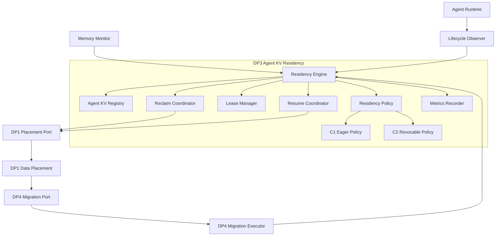
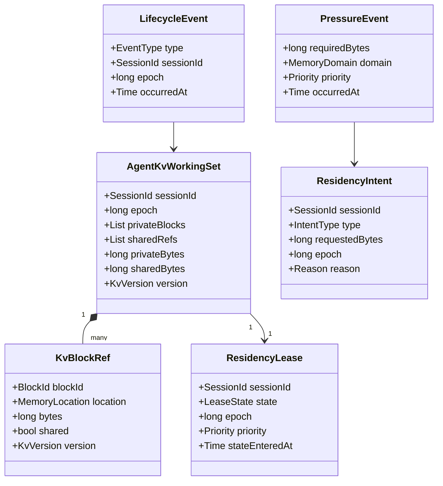
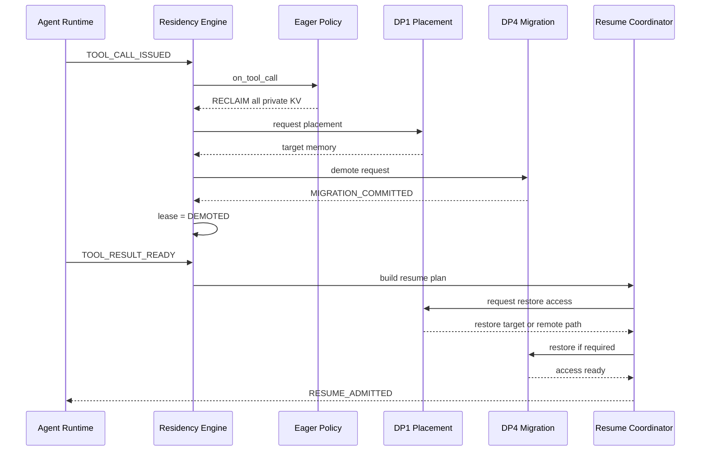
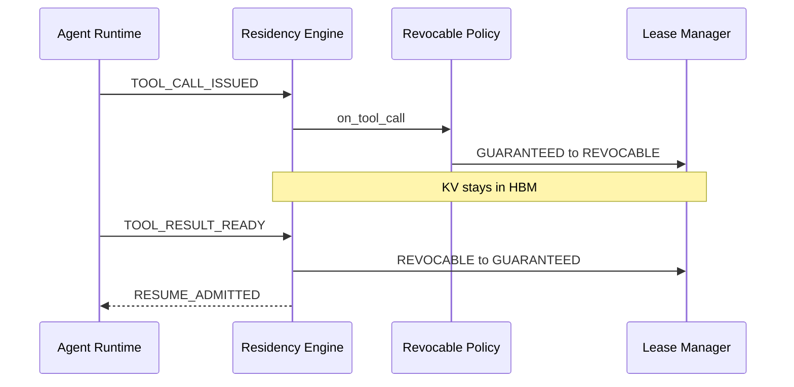
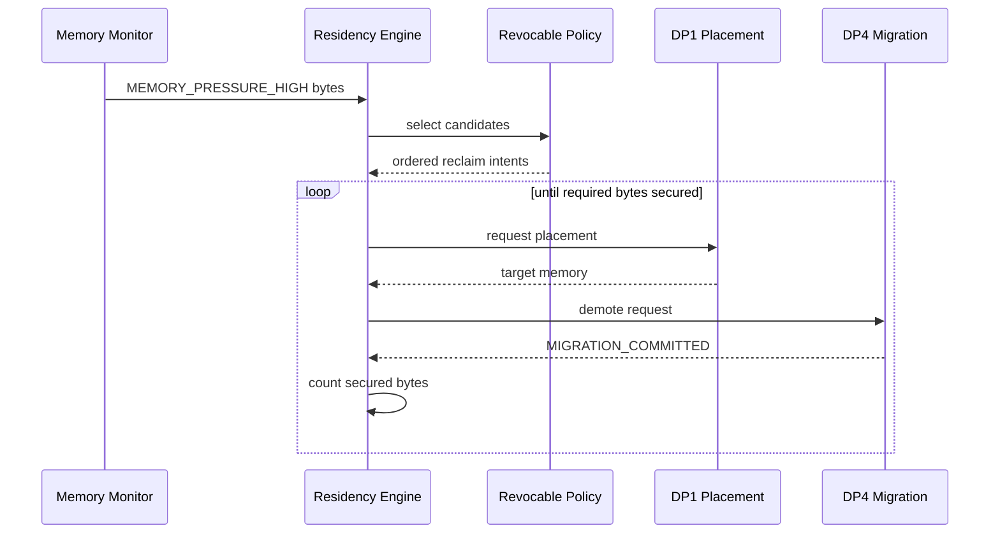
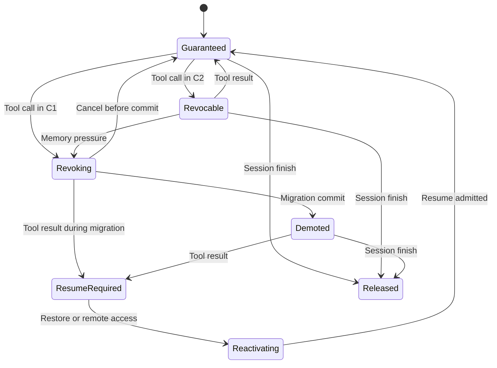
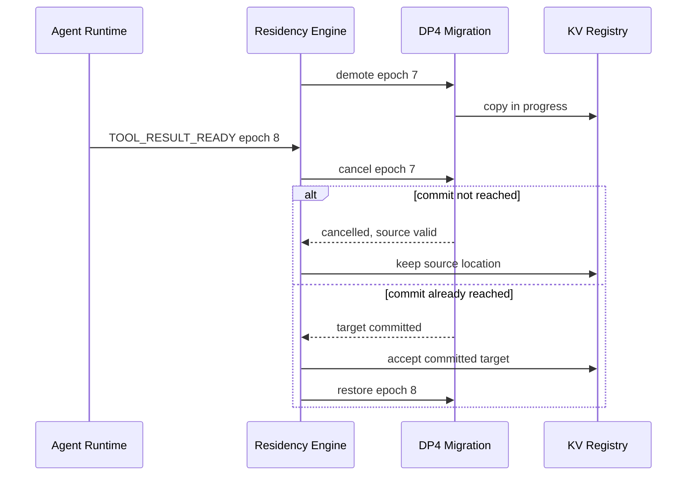
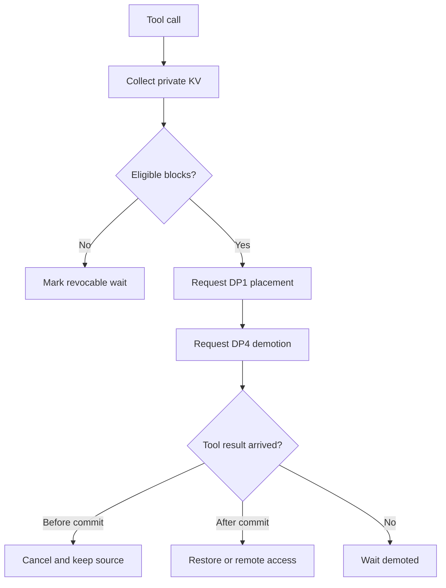
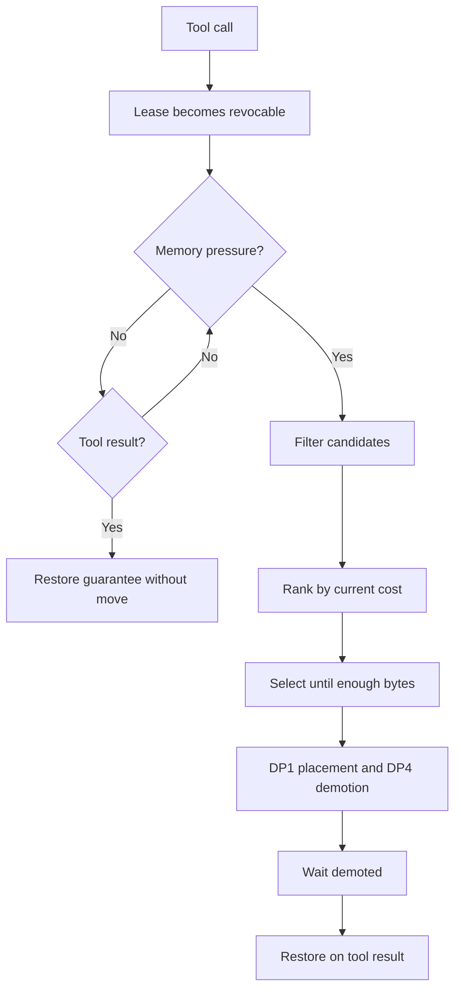

# DP3 구현 설계. Agent Tool-wait KV Residency

## 0. 문서 목적

이 문서는 [`dp3-agent-tool-wait-kv-residency.md`](dp3-agent-tool-wait-kv-residency.md)의 두 후보를 구현 가능한 구조로 구체화한다.

- **C1. Eager Tool-event Hibernation**: Tool Call 즉시 Private Session KV의 Reclaim을 요청
- **C2. Pressure-triggered Revocable Residency**: Tool Call 시 Residency Lease만 `REVOCABLE`로 바꾸고, 실제 Memory Pressure가 발생할 때 필요한 용량만 Reclaim

두 후보는 다음 공통 제약을 따른다.

1. Tool 완료 시각이나 다음 접근 시각을 예측하지 않는다.
2. KV를 Drop하거나 근사화하지 않는다.
3. 실제 Target Memory 선택은 DP1에 위임한다.
4. 실제 Data Copy와 Commit은 DP4에 위임한다.
5. Shared Prefix KV를 Session 단위 Reclaim 대상으로 취급하지 않는다.
6. Retry와 Fallback으로 정확한 KV를 복원한 비용은 Performance에 포함한다.

---

## 1. 설계 경계

### 1.1 DP3가 결정하는 것

- Agent Lifecycle에 따른 KV Residency Lease 상태
- Session KV가 Reclaim Candidate가 되는 시점
- Memory Pressure 발생 시 회수할 Session 집합
- Tool Result 도착 시 Resume 요청과 우선순위
- Reclaim–Resume Race의 취소·완료·복원 처리

### 1.2 DP3가 결정하지 않는 것

| 결정 | 담당 |
|---|---|
| Reclaimable KV의 Target Memory Tier | DP1 |
| Accuracy 손실을 허용한 KV Drop 대상 | DP2 |
| Copy Path, Chunk, DMA, Commit 방법 | DP4 |
| Prefill/Decode Compute Node | Compute Scheduler |
| Shared Prefix Cache의 전역 Placement | DP1 / Prefix Cache Policy |

### 1.3 입력과 출력

```text
Input
- Agent Lifecycle Event
- Memory Pressure Event
- Session KV Registry Snapshot
- DP1 Placement Result
- DP4 Migration Result

Output
- ResidencyIntent
- PlacementRequest to DP1
- MigrationRequest to DP4
- ResumeAdmissionRequest
- Metrics Event
```

---

## 2. Module View



### 2.1 Module 책임

| Module | 책임 |
|---|---|
| `LifecycleObserver` | Tool Call, Tool Result, Session 종료 Event를 정규화 |
| `ResidencyEngine` | Event 직렬화, Policy 호출, 상태 전이 조정 |
| `AgentKvRegistry` | Session별 Private KV, Shared Reference, 위치, Version 추적 |
| `ResidencyPolicy` | C1/C2 공통 Policy Interface |
| `EagerHibernationPolicy` | Tool Wait 진입 즉시 Reclaim Intent 생성 |
| `RevocableResidencyPolicy` | Lease 전환 및 Pressure 시 Candidate 선택 |
| `ResidencyLeaseManager` | Lease State와 Epoch의 원자적 변경 |
| `ReclaimCoordinator` | 확보 용량 계산, DP1 Placement 요청, 진행 중 Reclaim 추적 |
| `ResumeCoordinator` | Result 도착 후 Cancel/Restore/Remote Access/Admission 조정 |
| `Dp1PlacementPort` | DP3 Intent를 DP1의 Placement 요청으로 변환 |
| `Dp4MigrationPort` | DP4 Migration 요청과 완료 Event를 전달 |
| `MetricsRecorder` | Idle Residency, Resume Latency, Movement, Fallback 기록 |

---

## 3. Data Model

### 3.1 핵심 Type



### 3.2 Lease State

```text
GUARANTEED
    Active Agent. 상위 Memory 접근성 보장 필요.

REVOCABLE
    Tool Wait Agent. HBM에 남아 있을 수 있으나 Pressure 시 회수 가능.

REVOKING
    DP1/DP4를 통해 Demotion 진행 중.

DEMOTED
    Private KV가 하위 Tier로 Commit됨.

RESUME_REQUIRED
    Tool Result가 도착하여 KV 접근성 회복 필요.

REACTIVATING
    Restore 또는 Remote Access 준비 중.

RELEASED
    Session 종료. Private KV 해제 완료.
```

### 3.3 Event Type

```text
TOOL_CALL_ISSUED
TOOL_RESULT_READY
MEMORY_PRESSURE_HIGH
PLACEMENT_DECIDED
MIGRATION_STARTED
MIGRATION_COMMITTED
MIGRATION_FAILED
RESUME_ADMITTED
SESSION_FINISHED
```

### 3.4 Epoch

각 Session은 Lifecycle 전환마다 증가하는 `epoch`을 갖는다. 비동기 DP1/DP4 응답은 요청 당시 Epoch를 포함한다.

```text
현재 Session Epoch != 응답 Epoch
→ 오래된 응답
→ 현재 State에 직접 적용하지 않음
→ Cancel 또는 보상 동작 수행
```

Epoch는 Tool Result가 먼저 도착했는데 이전 Demotion 완료 Event가 뒤늦게 도착하는 경우의 상태 역전을 방지한다.

---

## 4. 공통 Policy Interface

```text
interface ResidencyPolicy:
    on_tool_call(
        working_set,
        lease,
        runtime_view
    ) -> List[ResidencyIntent]

    on_memory_pressure(
        required_bytes,
        revocable_sessions,
        runtime_view
    ) -> List[ResidencyIntent]

    on_tool_result(
        working_set,
        lease,
        migration_state
    ) -> ResumePlan
```

### 4.1 공통 Filtering

두 후보 모두 Reclaim 전에 다음 Block을 제외한다.

- 다른 Active Session이 참조하는 Shared Prefix Block
- 이미 Release된 Block
- 다른 Migration이 Commit 중인 Block
- Version이 Registry와 일치하지 않는 Block
- Resume가 이미 요청된 Session의 Block
- DP1/DP4가 일시적으로 Pin한 Block

### 4.2 공통 ResumePlan

```text
ResumePlan
- action: KEEP_LOCAL / CANCEL_RECLAIM / RESTORE / REMOTE_ACCESS / RECOMPUTE
- requiredBlocks
- targetAccessClass
- priority
- epoch
```

`RECOMPUTE`는 정상 경로가 아니라 KV를 찾지 못했을 때 정확한 결과를 복원하기 위한 최종 Fallback이다. 발생 시간과 GPU 비용은 Performance Metric으로 집계한다.

---

## 5. C1 구현 구조: Eager Tool-event Hibernation

### 5.1 정책 정의

Tool Call Event를 받으면 Memory Pressure와 관계없이 회수 가능한 모든 Private Session KV에 대해 `RECLAIM` Intent를 생성한다.

```text
def on_tool_call(ws, lease, view):
    lease.transition(GUARANTEED, REVOKING)

    blocks = filter_private_reclaimable(ws)
    if blocks is empty:
        lease.transition(REVOKING, REVOCABLE)
        return []

    return [
        ResidencyIntent(
            type=RECLAIM,
            requested_bytes=sum(block.bytes),
            reason=TOOL_WAIT_ENTERED,
            epoch=lease.epoch,
        )
    ]
```

실제 Target Tier는 DP1이 선택한다. DP1이 현재 위치 유지를 반환할 수는 있지만, C1은 항상 Placement 재평가를 요청한다.

### 5.2 C1 Sequence



### 5.3 Tool Result 처리

| Migration 상태 | C1 처리 |
|---|---|
| 시작 전 | Reclaim 요청 취소, `GUARANTEED` 복귀 |
| Copy 중, Source 유효 | DP4 Cancel 요청, Source 사용 가능 여부 확인 |
| Target Commit 완료 | `RESUME_REQUIRED`, Restore/Remote Access 요청 |
| Migration 실패 | Source 유효성 확인 후 Resume, 아니면 Recompute Fallback |

### 5.4 C1에서 측정할 고유 비용

- Tool Call Event당 Placement 재평가 횟수
- Pressure가 없었는데 발생한 Migration Bytes
- Demote 후 실제 확보 용량이 사용되기 전에 Restore된 비율
- Tool Call 직후 Result가 도착한 Round-trip 비율

---

## 6. C2 구현 구조: Pressure-triggered Revocable Residency

### 6.1 정책 정의

Tool Call Event에서는 Data를 이동하지 않고 Lease만 `REVOCABLE`로 변경한다.

```text
def on_tool_call(ws, lease, view):
    lease.transition(GUARANTEED, REVOCABLE)
    revocable_index.add(
        session_id=ws.session_id,
        reclaimable_bytes=ws.private_bytes,
        epoch=lease.epoch,
    )
    return []
```

Memory Pressure Event가 발생하면 필요한 용량을 만족할 때까지 Candidate를 선택한다.

```text
def on_memory_pressure(required_bytes, sessions, view):
    candidates = filter(
        lease == REVOCABLE
        and no_resume_request
        and no_conflicting_migration
        and private_bytes > 0
    )

    ranked = sort_by(
        session_priority ascending,
        demote_cost_per_byte ascending,
        reclaimable_bytes descending,
        session_id ascending,
    )

    selected = take_until(ranked, required_bytes)
    return reclaim_intents(selected)
```

정렬의 마지막 `session_id`는 동일 조건에서 결과를 재현하기 위한 결정적 Tie-breaker다.

### 6.2 Candidate Cost

Tool Duration이나 다음 접근 예상 시각은 사용하지 않는다.

```text
demote_cost_per_byte =
    estimated_transfer_time / reclaimable_bytes
    + current_fabric_contention_penalty
    + target_capacity_penalty
```

`estimated_transfer_time`과 Target Capacity는 DP1이 제공하는 현재 상태 기반 Estimate다. 미래 Tool Result 시점은 포함하지 않는다.

### 6.3 C2 Sequence: Pressure 없음



### 6.4 C2 Sequence: Pressure 발생



### 6.5 Pressure Event 병합

동시에 여러 Pressure Event가 들어오면 단순 합산하지 않고 아직 확보되지 않은 부족량을 기준으로 병합한다.

```text
outstanding_required =
    max(0, latest_required_bytes - committed_reclaimed_bytes
           - in_flight_expected_bytes)
```

이미 진행 중인 Reclaim으로 충분하면 추가 Candidate를 선택하지 않는다.

### 6.6 Tool Result 처리

| Lease 상태 | C2 처리 |
|---|---|
| `REVOCABLE` | Candidate Index 제거, `GUARANTEED` 복귀, 이동 없음 |
| `REVOKING` | Epoch 갱신, Cancel 가능 여부 확인, 불가하면 Commit 후 Restore |
| `DEMOTED` | `RESUME_REQUIRED`, Restore 또는 Remote Access 요청 |
| `REACTIVATING` | 기존 Resume 작업에 Join, 중복 Restore 금지 |

### 6.7 C2에서 측정할 고유 비용

- Waiting Session 수 대비 Candidate Lookup 시간
- Pressure Event당 선택 Session 수
- 확보 요구량 대비 과잉 Reclaim Bytes
- Result 도착 시 `REVOCABLE` 상태로 남아 Migration을 피한 Session 비율
- Pressure Critical Path에 노출된 Decision + Demotion 시간

---

## 7. 상태 전이



### 7.1 금지 전이

- `DEMOTED → GUARANTEED`: 접근성 회복 확인 없이 직접 전이 금지
- `RELEASED → GUARANTEED`: 종료된 Session 재활성화 금지
- `REVOKING → DEMOTED`: DP4 Commit Event 없이 전이 금지
- `REVOCABLE → DEMOTED`: DP1 Target 및 DP4 Migration 없이 직접 전이 금지

---

## 8. Reclaim–Resume Race 처리

### 8.1 Race 해결 우선순위

1. Silent Wrong Result 방지
2. 이미 유효한 Source가 있으면 불필요한 Restore 방지
3. Tool Result가 도착한 Session의 Resume 우선순위 상승
4. Commit된 Migration은 Metadata를 되돌리지 않고 보상 Restore 수행

### 8.2 Commit Point

DP4의 Commit Point 이전에는 Source Location을 정본으로 본다. Commit 이후에는 Target Location을 정본으로 본다.

```text
Before Commit
Source = authoritative
Target = incomplete or provisional

After Commit
Target = authoritative
Source = releasable
```

### 8.3 Race Sequence



---

## 9. DP1 / DP4 Port

### 9.1 DP1 Placement Request

```text
PlacementRequest
- session_id
- block_ids
- current_location
- desired_access_class
- reclaim_reason
- required_reclaimed_bytes
- priority
- epoch
```

`desired_access_class`는 물리 Tier가 아니라 다음 의미 수준으로 전달한다.

- `NOT_HBM_REQUIRED`
- `GPU_REACHABLE_REQUIRED`
- `RESUME_READY_REQUIRED`

DP1은 현재 Memory State와 Access Path를 고려해 실제 Target을 결정한다.

### 9.2 DP4 Migration Request

```text
MigrationRequest
- session_id
- block_ids
- source
- target
- operation
- priority
- epoch
```

`operation`은 `DEMOTE`, `RESTORE`, `RELOCATE`, `CANCEL` 중 하나다.

### 9.3 Idempotency

모든 외부 요청은 `(session_id, epoch, operation)`을 Idempotency Key로 사용한다. 동일 요청이 재전송되어도 중복 Migration을 만들지 않는다.

---

## 10. Metric Instrumentation

### 10.1 Event Log

```text
ResidencyMetricEvent
- timestamp
- session_id
- policy
- lifecycle_event
- lease_before
- lease_after
- hbm_private_kv_bytes
- reclaimed_bytes
- migrated_bytes
- fallback_type
- epoch
```

### 10.2 Timer

| Timer | 시작 | 종료 |
|---|---|---|
| Idle Residency | `TOOL_CALL_ISSUED` | `TOOL_RESULT_READY` 또는 Session 종료 |
| Reclaim Decision | `MEMORY_PRESSURE_HIGH` | Candidate 선택 완료 |
| Reclaim Completion | Reclaim Intent 생성 | DP4 Commit |
| Resume Latency | `TOOL_RESULT_READY` | 다음 Output Token |
| Restore Stall | Resume가 KV를 기다리기 시작 | KV Access Ready |
| Fallback Latency | Fallback 시작 | 올바른 KV Access Ready |

### 10.3 Accuracy 처리

Task Accuracy는 C1/C2 후보 비교 Metric이 아니다. 다음 검증만 수행한다.

- Migration 전후 KV Checksum 또는 Byte Equality
- 동일 Token Trace에 대한 Deterministic Replay
- Silent mismatch 발생 시 해당 실행을 무효 처리

Retry, Restore, Remote Access, Recompute로 올바른 결과를 복원한 실행은 Latency와 Resource Cost에 반영한다.

---

## 11. 후보별 Activity

### 11.1 C1



### 11.2 C2



---

## 12. 구현 검증 시나리오

| Test | 입력 | 기대 결과 |
|---|---|---|
| T1 Short Tool, no pressure | Call 후 즉시 Result | C2는 Migration 0, C1은 정책대로 Reclaim 요청 |
| T2 Long Tool, pressure | Waiting 중 HBM 부족 | C2가 필요한 Bytes만 선택 |
| T3 Shared Prefix | Active Session과 Prefix 공유 | Shared Block Reclaim 금지 |
| T4 Result before copy | Reclaim 요청 직후 Result | Cancel 후 Source 사용 |
| T5 Result during copy | Copy 중 Result | Commit Point에 따라 Cancel 또는 Restore |
| T6 Duplicate Result | 동일 Epoch Result 재전송 | 상태 전이 한 번만 적용 |
| T7 Stale Commit | 새 Epoch 이후 과거 Commit 도착 | 현재 상태 덮어쓰기 금지 |
| T8 Migration failure | Source 유지 상태에서 실패 | Source Resume 또는 Retry |
| T9 Missing KV | Source/Target 모두 없음 | Recompute Fallback, 비용 기록 |
| T10 Pressure burst | 연속 Pressure Event | Outstanding 부족량만 Reclaim |
| T11 Resume burst | 다수 Tool Result 동시 도착 | 중복 Restore 없이 Queue 처리 |
| T12 Session finish | Waiting/Demoted 중 종료 | Private KV 해제, Shared Reference 감소 |

---

## 13. C1 / C2 구현 복잡도 비교

| 항목 | C1 | C2 |
|---|---|---|
| Tool Call Handler | Reclaim 요청까지 수행 | Lease/Index 갱신만 수행 |
| Pressure Handler | 특별 동작 없음 | Filtering·Ranking·Selection 수행 |
| Candidate Index | 선택 사항 | 필수 |
| Resume Race | 빈번할 수 있음 | 실제 Reclaim Session에서만 발생 |
| DP1 호출 수 | Tool Call 수에 비례 | Pressure와 선택 Session 수에 비례 |
| DP4 Migration 수 | Tool Call 수에 가까움 | 실제 Capacity 필요량에 비례 |
| State 관리 복잡도 | 상대적으로 낮음 | 상대적으로 높음 |
| Decision Critical Path | Tool Call 시점 | Memory Pressure 시점 |

---

## 14. 구현 단계

### Phase 1. 공통 계측과 Baseline

- Lifecycle Event 수집
- Session별 Private/Shared KV 분류
- B0 Keep-resident와 B1 Generic LRU 계측
- Idle KV Residency와 Resume Latency 측정

### Phase 2. C1

- Tool Call 기반 Reclaim Intent
- DP1/DP4 Port 연결
- Resume Cancel/Restore 처리
- Short/Long Tool Trace 비교

### Phase 3. C2

- Revocable Index
- Pressure Event와 Required Bytes 계산
- Candidate Filtering/Ranking
- Pressure–Resume Race 처리

### Phase 4. Scale-out

- Node별 Revocable Index
- 다수 Resume Burst
- Distributed State 동기화 비용 측정
- 전역/지역 Reclaim Coordinator 분리 검토

---

## 15. 구현 완료 조건

1. C1/C2가 동일한 Lifecycle Trace와 Memory Pressure Trace를 재생할 수 있어야 한다.
2. C1과 C2의 차이는 Reclaim Trigger와 Candidate Selection 위치로 제한되어야 한다.
3. DP3 내부에 물리 Memory Tier 선택 로직이 없어야 한다.
4. DP3 내부에 Attention Importance 기반 Drop 로직이 없어야 한다.
5. Tool Duration 또는 미래 Result Arrival Time이 Policy 입력에 없어야 한다.
6. 모든 비동기 응답이 Session Epoch를 검증해야 한다.
7. Fallback 비용이 Resume Latency와 Resource Metric에 포함되어야 한다.
8. KV가 보존된 실행에서 C1/C2의 출력이 Baseline과 일치해야 한다.
