# DP3 구현을 위한 UML 설계

[`dp3-long-context-kv-cache-eviction.md`](dp3-long-context-kv-cache-eviction.md)에서 정의한 C1(Offline Attention-based)/C2(Online Attention-based) 두 후보를 실제로 구현하기 전에, 구현 구조를 UML로 먼저 명세한다. [`dp1-implementation-uml.md`](dp1-implementation-uml.md)·[`dp2-implementation-uml.md`](dp2-implementation-uml.md)와 같은 형식을 따른다.

본 문서에서 "설계 문서"는 위 DP3 설계 문서를 가리킨다. **성능 수치는 담지 않는다** — 구조와 그 구조가 강제하는 제약만 명세하며, 어떤 구성에서 무엇이 얼마나 나오는지는 시뮬레이션이 답한다.

---

## 0. 설계 원칙

설계 문서 §2에서 고정한 구분이 이 구조의 뼈대다. **아래 다섯 가지는 주석이나 규약이 아니라 타입·모듈 경계로 강제되어야 한다** — 규약으로만 두면 어긴 것이 측정 결과에 섞여 들어와도 드러나지 않는다.

- **Demote와 Drop을 타입 수준에서 가른다.** 설계 문서 §2.1대로 둘은 회수하는 자원도 되돌릴 수 있는지도 다르다. `ReclaimAction`을 `DEMOTE`/`DROP` 두 값으로 두고, **`DROP`을 발행할 수 있는 것은 DP3의 정책뿐, `DEMOTE`를 발행할 수 있는 것은 DP1의 정책뿐**으로 제한한다. 하나의 정책이 둘 다 낼 수 있으면 §2.1의 구분이 런타임에 무너진다.
- **DP1이 먼저, DP3는 실패 처리 경로다.** 설계 문서 §2.4의 고정 규칙이다. `ReclaimCoordinator`는 **DP1 배치가 실패했을 때만** DP3 정책을 호출한다. 두 정책을 병렬로 부르는 경로가 구조에 존재하면 안 된다.
- **평가 시점과 실행 시점을 분리한다.** 설계 문서 §2.3대로 C1/C2는 **평가 시점**의 축이고 E1~E4는 **실행 시점**의 축이며 둘은 직교한다. Trigger를 정책 밖의 별도 모듈에 두어, 같은 정책을 어느 실행 시점에도 꽂을 수 있게 한다. **정책 안에 Trigger 조건이 들어가면 §9.6의 "실행 시점을 동일하게 고정한다"가 지켜지지 않는다.**
- **공유 Block은 Drop 후보에 들어오지 않는다.** 설계 문서 §2.4의 마지막 단락이다. `DropEligibilityFilter`가 정책보다 **먼저** 걸러내며, 정책은 걸러진 집합만 본다. 정책이 스스로 제외하게 두면 M-R2(Prefix Cache 오염)가 정책 구현의 함수가 된다.
- **C1은 Online Phase에서 Importance를 계산하지 않는다.** `c1_offline.py`가 `attention_probe`에 의존하지 않는 것으로 보장한다. 의존 간선이 없으면 Actual Query의 Attention이 C1의 판단에 도달할 경로도 없고, **M-A3(Representative–Actual 일치율)가 C2에서 정의상 1.0인 것이 구현 구조에서 확인된다.**

그 밖에 DP1/DP2 구현과 공유하는 원칙.

- **Policy 추상화를 공유한다.** C1/C2는 같은 `DropPolicy` 인터페이스의 서로 다른 구현이며, `ReclaimCoordinator`는 어떤 정책이 꽂히든 동일하게 동작한다.
- **Importance를 읽는 창구를 하나로 제한한다.** 정책은 `ImportanceView`를 통해서만 중요도를 읽는다. C1은 이 창구 뒤에 사전 산출 Profile이, C2는 실시간 Probe가 붙는다.
- **점수 산술을 공유한다.** 두 후보가 동일한 `ImportanceScorer`로 상위 k를 고른다. 각자 다른 집계 함수를 쓰면 비교가 "누가 집계를 더 잘 했는지"를 재게 된다.
- **Metric 수집기는 정책을 import하지 않는다.** `reclaim_ledger`를 관측한다. 정책이 자기 답을 채점하면 설계 문서 §9의 Metric이 의미를 잃는다.

---

## 1. Module View

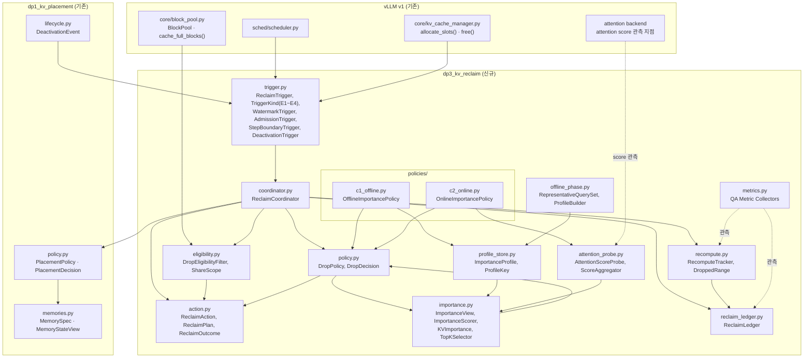

여섯 가지가 구조로 드러난다.

1. **`coordinator.py`만 `dp1_policy`와 `policy`를 모두 알고 있다.** 설계 문서 §2.4의 순서 규칙이 한 지점에 모여 있으므로 **그 규칙이 지켜지는지를 한 파일에서 확인할 수 있다.** 다른 어떤 모듈도 두 정책을 동시에 참조하지 않는다.
2. **`trigger.py`가 정책 밖에 있고 `policies/`에서 아무도 참조하지 않는다.** 실행 시점(E1~E4)이 후보의 정의에 들어가지 않는다는 설계 문서 §2.3의 직교성이 의존 간선의 부재로 나타난다.
3. **`eligibility.py`가 `coordinator`와 `bp`(BlockPool) 사이에 있고 정책보다 앞선다.** 공유 Block이 정책에 도달하지 못하므로, **정책이 무엇을 하든 Prefix Cache 후보는 Drop되지 않는다.**
4. **`c1_offline.py`에서 `attention_probe.py`로 가는 간선이 없다.** §0의 다섯 번째 원칙이 여기서 보장된다. 반대로 `c2_online.py`는 `probe`에만 의존하고 `profile_store`를 모른다.
5. **`attn`에서 `probe`로 가는 간선이 점선(관측)이다.** C2는 Attention 결과를 **읽을** 뿐 Attention 수행 자체를 바꾸지 않는다. 이 간선이 실선이 되면 C2가 모델 실행 경로를 변경하는 것이고, 그때는 Accuracy 비교의 전제(B0와 같은 연산)가 깨진다.
6. **`recompute.py`가 독립 모듈이다.** 설계 문서 §9.5의 M-R1 — Drop이 메모리 압력을 GPU 압력으로 전환하는 크기 — 을 정책과 무관하게 집계한다.

> **`dp3_kv_reclaim`은 `dp1_kv_placement`를 import하지만 그 역은 없다.** DP1이 DP3를 모르는 것이 설계 문서 §2.4의 "DP3는 DP1의 실패 처리 경로"를 방향성 있는 의존으로 옮긴 것이다.

---

## 2. Class Diagram

### 2.1 공통 (C1/C2 모두 사용)

```mermaid
classDiagram
    class ReclaimAction {
        <<enumeration>>
        DEMOTE
        DROP
    }

    class TriggerKind {
        <<enumeration>>
        WATERMARK
        ADMISSION
        STEP_BOUNDARY
        DEACTIVATION
    }

    class ShareScope {
        <<enumeration>>
        SESSION_PRIVATE
        PREFIX_SHARED
        UNKNOWN
    }

    class KVRange {
        +str session_id
        +int layer_id
        +int start_token
        +int end_token
        +int num_bytes
        +ShareScope share_scope
        +int observed_ref_cnt
    }

    class KVImportance {
        +KVRange kv_range
        +float score
        +int rank
        +str evidence
        +bool is_estimate
    }

    class ImportanceView {
        <<interface>>
        +score_of(KVRange) KVImportance
        +is_available() bool
        +evaluated_at() str
    }

    class ImportanceScorer {
        +aggregate(List~float~) float
        +normalize(List~KVImportance~) List~KVImportance~
    }

    class TopKSelector {
        +int k
        +select(List~KVImportance~) List~KVRange~
        +complement(List~KVImportance~) List~KVRange~
    }

    class DropEligibilityFilter {
        +eligible(List~KVRange~) List~KVRange~
        +excluded(List~KVRange~) List~KVRange~
        +exclusion_reason(KVRange) str
    }

    class DropDecision {
        +List~KVRange~ dropped
        +List~KVRange~ retained
        +int freed_bytes
        +float decision_seconds
        +TriggerKind fired_by
    }

    class DropPolicy {
        <<interface>>
        +decide(List~KVRange~, ImportanceView, int) DropDecision
        +name() str
    }

    class ReclaimPlan {
        +ReclaimAction action
        +List~KVRange~ ranges
        +str issued_by
    }

    class ReclaimTrigger {
        <<interface>>
        +TriggerKind kind
        +should_fire(MemoryStateView) bool
        +required_bytes(MemoryStateView) int
    }

    class ReclaimCoordinator {
        +on_trigger(ReclaimTrigger, MemoryStateView) ReclaimOutcome
        -try_placement(List~KVRange~) PlacementDecision
        -try_drop(List~KVRange~, int) DropDecision
    }

    class RecomputeTracker {
        +record_drop(List~KVRange~)
        +on_access(KVRange) bool
        +recompute_cost_seconds() float
        +reaccess_rate() float
    }

    class ReclaimLedger {
        +charge_demote(int bytes)
        +charge_drop(int bytes)
        +charge_decision(float seconds)
        +drop_share() float
    }

    ImportanceView <|.. ProfileBackedView
    ImportanceView <|.. ProbeBackedView
    DropPolicy <|.. OfflineImportancePolicy
    DropPolicy <|.. OnlineImportancePolicy
    ReclaimTrigger <|.. WatermarkTrigger
    ReclaimTrigger <|.. AdmissionTrigger
    ReclaimTrigger <|.. StepBoundaryTrigger
    ReclaimTrigger <|.. DeactivationTrigger
    DropPolicy --> ImportanceView
    DropPolicy --> TopKSelector
    TopKSelector --> ImportanceScorer
    ReclaimCoordinator --> DropPolicy
    ReclaimCoordinator --> DropEligibilityFilter
    ReclaimCoordinator --> ReclaimPlan
    ReclaimCoordinator --> RecomputeTracker
    ReclaimCoordinator --> ReclaimLedger
    DropEligibilityFilter --> KVRange
    KVImportance --> KVRange
```

**타입에서 읽히는 제약 네 가지.**

| 제약 | 어떻게 강제되는가 |
|---|---|
| `DROP`은 DP3만 발행한다 | `ReclaimPlan.issued_by`를 `ReclaimCoordinator`가 채우며, `action == DROP`인 Plan은 `try_drop()` 경로에서만 생성된다. DP1의 `PlacementPolicy`는 `ReclaimPlan`을 만들지 않는다 |
| 공유 Block은 Drop되지 않는다 | `DropPolicy.decide()`가 받는 목록이 `DropEligibilityFilter.eligible()`의 출력이다. `ShareScope.PREFIX_SHARED`와 `UNKNOWN`은 여기서 빠진다 |
| Importance 접근 경로가 하나다 | `DropPolicy`는 `ImportanceView`만 의존한다. 정책이 Profile이나 Probe를 직접 참조하지 않는다 |
| 증거의 성격이 값에 붙어 있다 | `KVImportance.evidence`·`is_estimate`가 그 점수가 Representative Query에서 왔는지 Actual Query에서 왔는지를 들고 다닌다 — M-A3가 사후에 계산 가능해진다 |

> **`ShareScope.UNKNOWN`을 Drop 대상에서 제외하는 것이 중요하다.** 공유 여부를 모르는 Block을 Drop하면 설계 문서 §2.4가 막으려는 cross-session 손실이 그대로 발생한다. **모르면 버리지 않는다**가 안전한 기본값이며, 이 선택으로 회수량이 줄어드는 정도는 M-C5의 보조 관찰로 보고한다.

### 2.2 C1. Offline Attention-based

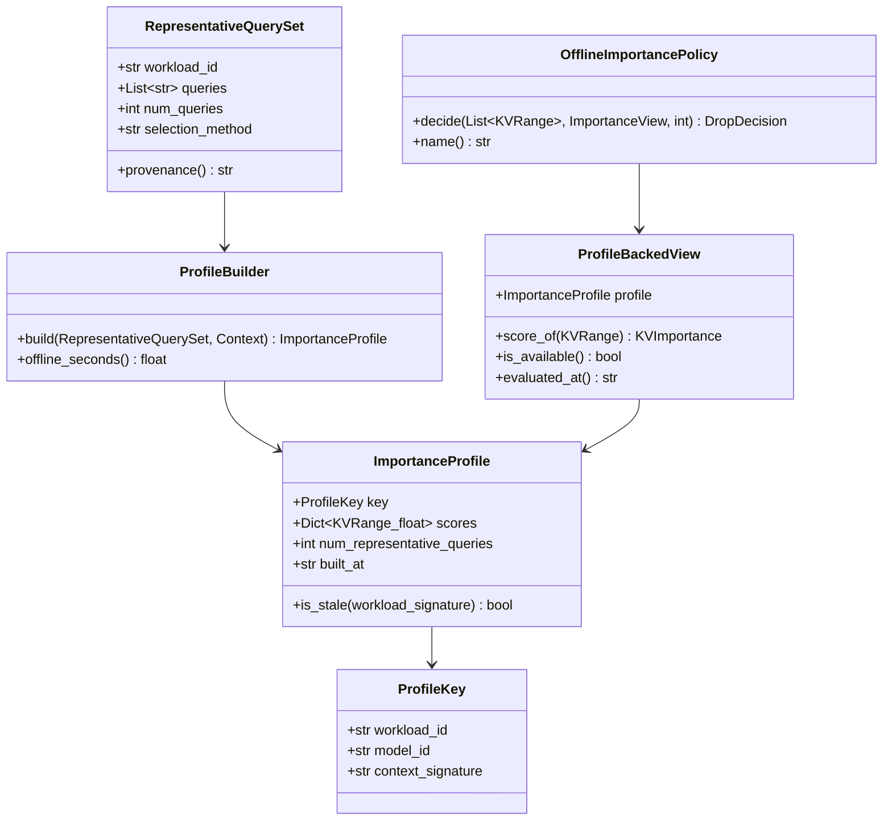

- **`ProfileBuilder`는 Online 경로에 없다.** Serving 중에는 `ProfileBackedView`가 이미 만들어진 `ImportanceProfile`을 조회만 한다 — 이것이 C1의 Online 판단 비용이 0에 가까운 구조적 이유이며, 설계 문서 §9.3 M-C3가 **Offline Phase 비용을 별도로 보고하라고 요구하는 이유**이기도 하다. `ProfileBuilder.offline_seconds()`가 그 값을 든다.
- **`ImportanceProfile.is_stale()`이 반드시 있어야 한다.** 워크로드가 바뀌면 Profile이 실제 분포를 대표하지 못하고, 그때 C1은 **틀린 채로 조용히 계속 동작한다.** Stale 판정 없이 측정하면 M-A3의 악화가 언제 시작됐는지 알 수 없다.
- **`RepresentativeQuerySet.selection_method`와 `provenance()`를 값으로 들고 다닌다.** 설계 문서 §9.4 M-A3가 "선정 방법과 개수를 결과와 함께 명시하라"고 요구하므로, 결과에 자동으로 따라붙게 만든다.

**구조로 보면:** 위 클래스 다이어그램의 포함 관계를 "언제 무엇이 실행되는가" 축으로 다시 그리면, C1의 모양은 **시간적으로 분리된 두 섬**이다 — Offline Phase와 Online Phase가 저장된 값(`ImportanceProfile`) 하나로만 이어진다.

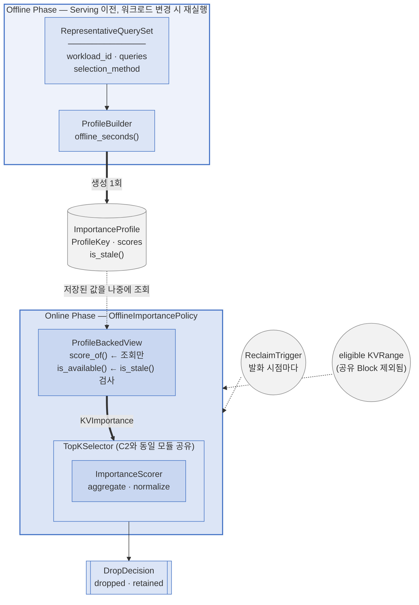

**`ImportanceProfile`을 원통(저장소)으로 그린 것이 핵심이다.** Offline Phase와 Online Phase를 잇는 것은 함수 호출이 아니라 **저장되고 나중에 읽히는 값**이며, 그 사이를 점선("저장된 값을 나중에 조회")으로 표시한 것이 곧 §9.3 M-C3가 "Offline Phase 비용을 별도로 보고하라"고 요구하는 이유다 — 두 비용이 서로 다른 시점에, 서로 다른 예산 위에서 발생한다.

### 2.3 C2. Online Attention-based

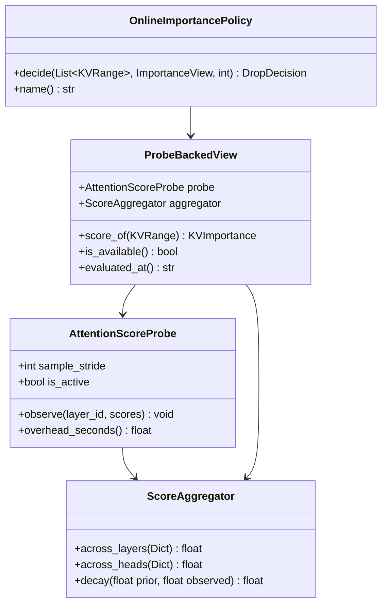

- **`AttentionScoreProbe.observe()`는 반환값이 없다.** Attention 결과를 읽기만 하고 되돌려주지 않으므로 모델 연산에 개입할 수 없다 — §1의 관찰 5를 시그니처로 굳힌 것이다.
- **`is_available()`이 C2에서 거짓일 수 있다.** Actual Query의 Attention이 아직 수행되지 않은 KV에는 점수가 없다. **이 경우 정책은 그 KV를 Drop하지 않는다** — 판단 근거가 없는 것을 버리는 것은 C2의 정의(Actual Query 기반)를 벗어난다. 이것이 설계 문서 §5의 "C2는 선제적 축소가 어렵다"가 구현에서 나타나는 지점이다.
- **`sample_stride`와 `overhead_seconds()`가 Probe에 있다.** 전 계층·전 헤드의 Attention Score를 모두 관측하면 비용이 크므로 표본화가 필요하고, **그 표본율이 M-A2(FNR)와 M-C3(판단 비용)를 동시에 움직인다.** 설계 문서 §9.6의 Sweep 축에 넣으려면 값으로 노출되어야 한다.

**구조로 보면:** C2에는 저장소도, 시간적으로 분리된 두 번째 단계도 없다. Attention 실행 경로에서 시작해 `DropDecision`까지 **하나로 이어진 파이프라인**이다.

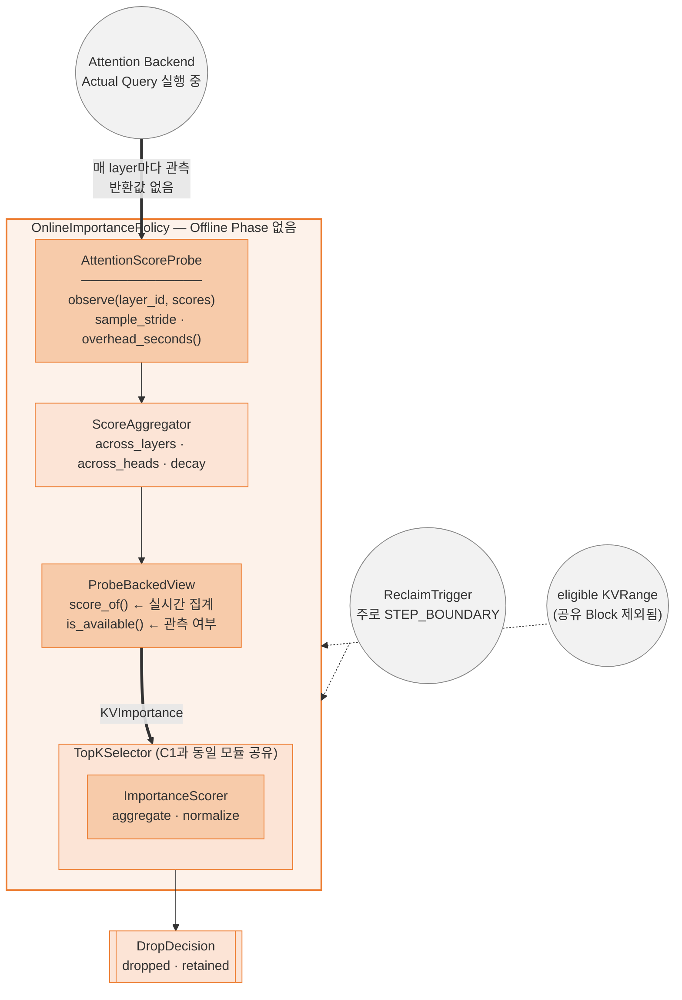

**`Attention Backend`에서 `AttentionScoreProbe`로 가는 간선이 굵은 실선이고, 원(외부 계약)에서 사각형(정책 내부)으로 직접 들어간다.** C1에서 같은 자리에 있던 것은 원통(저장소)이었다 — **C1의 매개체는 데이터이고, C2의 매개체는 실행 그 자체**라는 것이 두 다이어그램을 나란히 놓았을 때 드러나는 차이다. `TopKSelector`는 C1과 같은 상자·같은 라벨로 등장한다(§0의 공유 원칙) — 두 후보가 다른 것은 그 앞 단계뿐이다.

> §2.2·§2.3 두 다이어그램은 같은 문법(원 = 외부 계약, 실선 사각형 = 정책 내부 모듈, 원통 = 저장소, 굵은 실선 = 데이터·실행의 직접 전달, 점선 = 트리거·필터 같은 부수 입력)을 쓴다. **C1은 위쪽이 별도 상자로 떨어져 있고 점선(시간 지연)으로만 이어지며, C2는 위쪽부터 끊김 없이 이어진다** — 이 모양 차이가 설계 문서 §9.3 M-C3의 "C1의 Online 판단 비용은 0에 가깝고 C2는 Critical Path 위에 있다"는 문장의 구조적 근거다.

---

## 3. Sequence Diagram

### 3.1 DP1 → DP3 순서 (설계 문서 §2.4의 고정 규칙)

**본 DP에서 가장 중요한 시퀀스다.** DP1이 배치에 성공하면 DP3는 호출조차 되지 않는다.

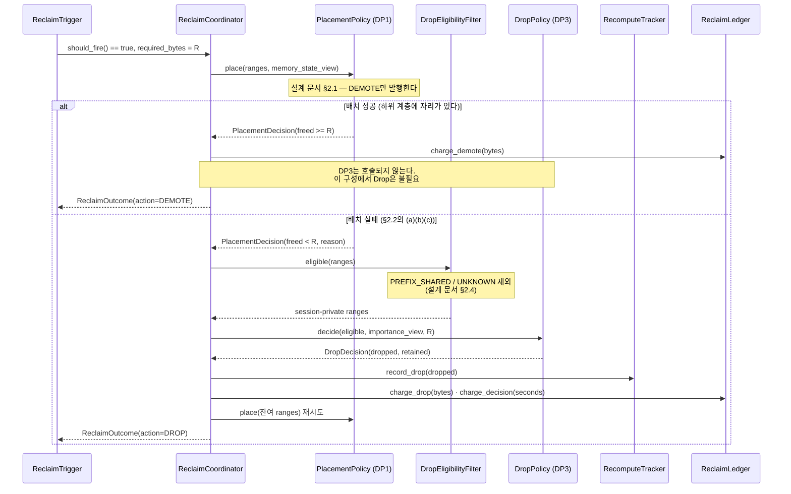

**`else` 분기에 들어가는 빈도가 곧 설계 문서 §9.2의 "B1이 이미 충분한가"에 대한 답**이다. 이 분기가 거의 발생하지 않는 구성에서는 후보 비교 자체가 불필요하며, 그 사실이 시퀀스의 실행 통계로 직접 관측된다.

> **`Coord->>P1: place(잔여 ranges) 재시도`가 마지막에 있는 것이 중요하다.** Drop은 자리를 만들 뿐이고 **남은 KV를 어디에 둘지는 여전히 DP1의 결정**이다. 이 화살표가 없으면 DP3가 배치까지 하게 되어 §2.1의 역할 분담이 무너진다.

### 3.2 C1 — Offline Phase

Serving 이전에 한 번 수행되며, 워크로드가 바뀌면 다시 수행된다.

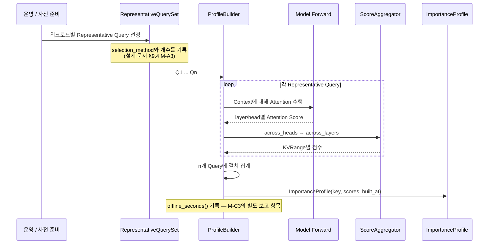

### 3.3 C1 — Online Phase (조회만 한다)

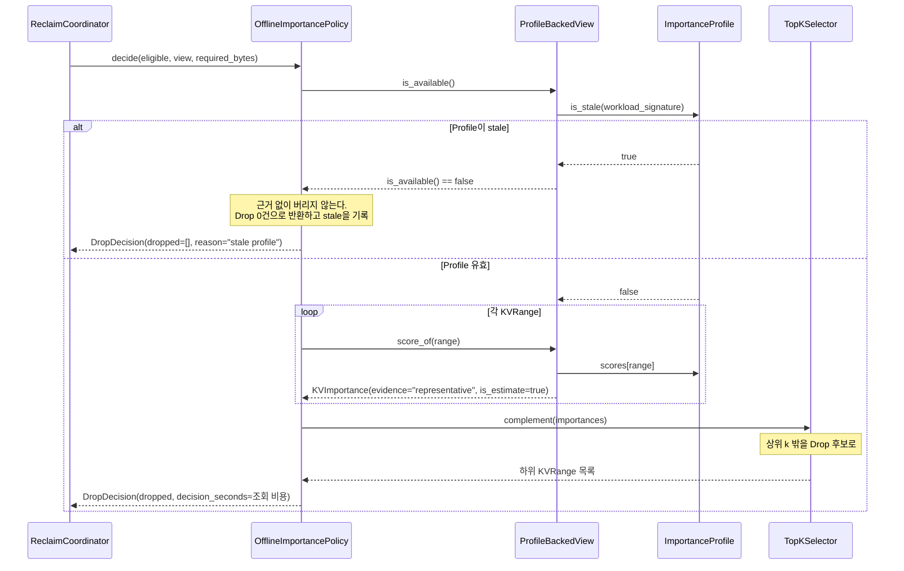

**`is_estimate=true`가 C1의 모든 점수에 붙는다.** 설계 문서 §9.4 M-A3가 재는 것이 바로 이 추정과 실제의 간극이며, 값에 표시가 붙어 있어야 사후 집계가 가능하다.

### 3.4 C2 — Online (판단이 경로 안에 있다)

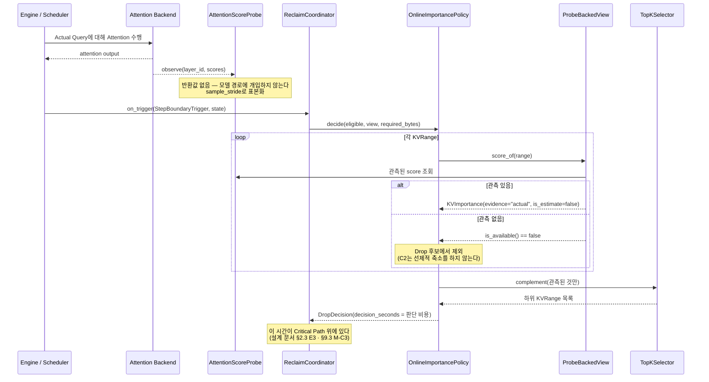

**C1의 3.3과 비교하면 두 후보의 비용 구조 차이가 한눈에 보인다.** C1은 조회, C2는 관측 + 집계 + 판단이며, **C2에는 "관측 없음" 분기가 있어 Drop 대상이 구조적으로 좁다** — 설계 문서 §6의 "C2는 압축률이 상대적으로 열세"가 여기서 나온다.

### 3.5 Drop한 KV에 다시 접근 — 재계산 경로

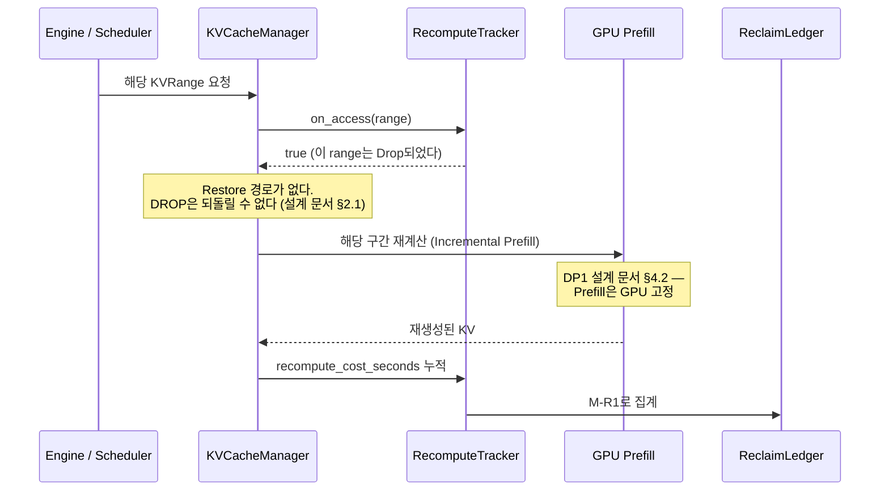

**`Restore` 참여자가 이 다이어그램에 없다는 것이 핵심이다.** Demote된 KV라면 하위 계층에서 읽어오면 되지만 Drop된 KV에는 그 경로가 없고 **GPU 재계산뿐**이다. 설계 문서 §9.5가 "Drop은 메모리 압력을 GPU 압력으로 전환한다"고 쓴 것이 이 시퀀스다.

---

## 4. C1 / C2 구현 구조 비교

§2.2·§2.3의 구조도가 **시간적 분리(두 섬) vs 경로 결합(하나로 이어짐)** 이라는 모양 차이를 보였다. 아래 표는 그 차이를 항목별로 정리한 것이다.

| | **C1. Offline** | **C2. Online** |
|---|---|---|
| `ImportanceView` 구현 | `ProfileBackedView` | `ProbeBackedView` |
| 의존하는 모듈 | `profile_store`, `offline_phase` | `attention_probe` |
| **`attention_probe` 의존** | **없음** — §0의 원칙이 구조로 보장 | 있음 |
| Online 판단 비용 | 조회 (해시 lookup) | 관측 + 집계 + 선정 |
| Offline 비용 | **있음** — `ProfileBuilder.offline_seconds()` | 없음 |
| Critical Path 점유 | 없음 | **있음** (§2.3 E3) |
| `is_available()`이 거짓이 되는 경우 | Profile이 stale | 해당 KV에 대한 Actual Attention 미관측 |
| Drop 후보 범위 | 상위 k 밖 전체 | **관측된 것 중** 상위 k 밖 |
| `KVImportance.is_estimate` | `true` | `false` |
| 워크로드 변경 시 | Profile 재생성 필요 | 자동 반영 |
| 사용 가능한 실행 시점 | E1 · E2 · E4 (E3도 가능) | **주로 E3** |

**공유하는 것.** `action.py`, `trigger.py`, `eligibility.py`, `policy.py`의 인터페이스, `TopKSelector`, `ImportanceScorer`, `ReclaimCoordinator`, `RecomputeTracker`, `ReclaimLedger`, `metrics.py`. **후보 교체는 `policies/` 아래 구현과 `ImportanceView` 구현을 바꾸는 것으로 끝난다.**

> **두 후보가 `TopKSelector`와 `ImportanceScorer`를 공유하는 것이 비교 가능성의 전제다.** 집계 함수나 상위 k 선정 방식을 각자 다르게 두면, 측정된 차이가 평가 시점의 차이인지 집계 방식의 차이인지 분리되지 않는다. 설계 문서 §9.6이 "실행 시점을 동일하게 고정한다"고 요구하는 것과 같은 이유다.

### 구조가 강제하지 못하는 것

UML로 막을 수 없어 **검증으로 확인해야 하는 것**을 명시한다.

| 항목 | 왜 구조로 막을 수 없는가 | 어떻게 확인하는가 |
|---|---|---|
| Representative Query가 실제 분포를 대표하는가 | 선정의 품질 문제이지 타입 문제가 아니다 | M-A3, 워크로드 다양성 Sweep |
| 상위 k 밖 KV가 결과에 기여하지 않는가 | 설계 문서 §1 ③의 전제 자체 | M-A2 — FNR이 낮은데 Accuracy가 떨어지면 전제가 반증된다 |
| `ShareScope`가 정확히 판정되는가 | `UNKNOWN`으로 새면 회수량만 줄고 조용히 넘어간다 | `UNKNOWN` 비율을 M-C5의 보조로 보고 |
| Probe 표본율이 충분한가 | 표본율과 FNR의 관계는 측정 대상 | `sample_stride` Sweep |
