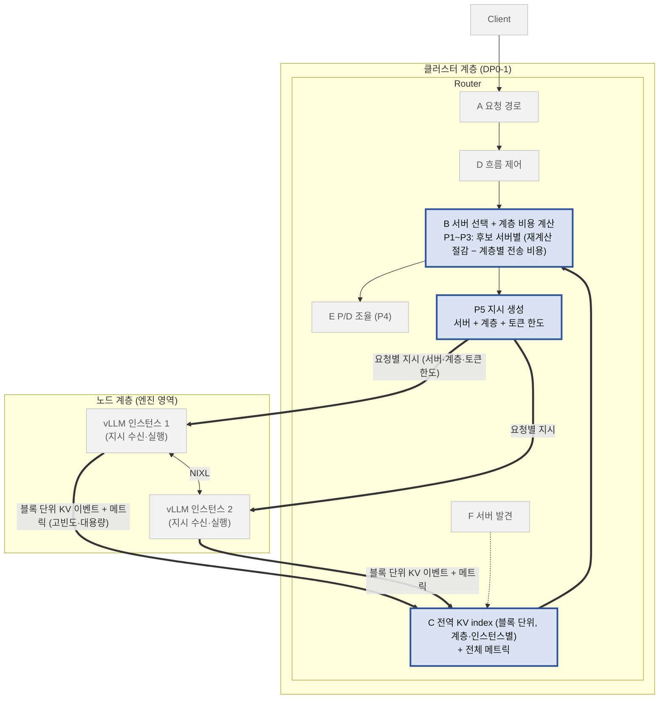
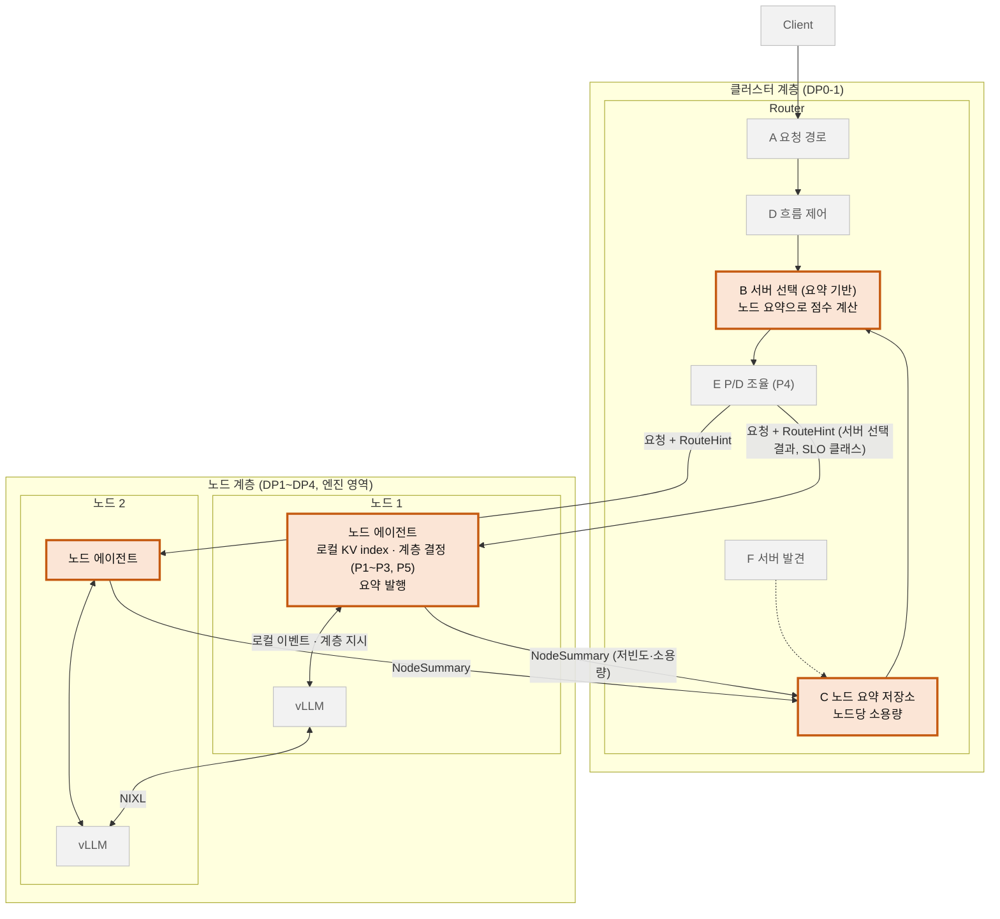
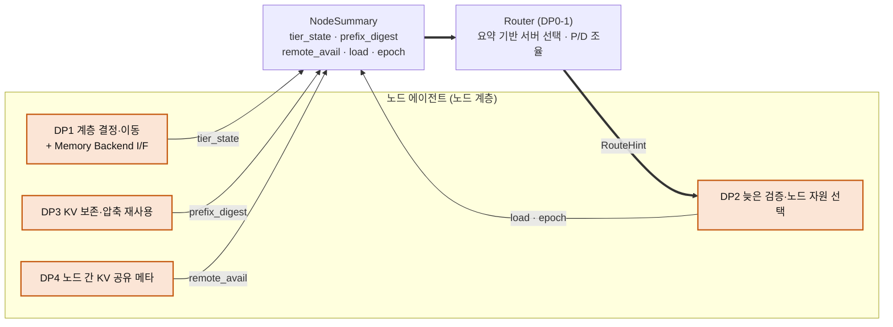

# DP0-1 — 서버 간 요청 조율 계층의 구조: 중앙 결정형(S1) 대 2단계 위임형(S2)

| 항목 | 내용 |
|---|---|
| 상태 | 초안 (구조 후보 2개 정의, 평가는 전부 가설) |
| 작성 일자 | 2026-10-06 |
| 이 문서의 위치 | **DP0-1 = 구조 결정**(상태와 계층 결정을 어디에 두는가). 이전 `../DP0/`의 "OSS 확장 대 직접 개발"은 **DP0-2 = 구현 방식 결정**으로 내려서 DP0-1에서 구조를 고른 뒤 그 구조에 대해 2차로 결정한다(§9) |
| 요구사항 | 기능 F1~F6, 품질 Q1~Q4, 제약 C1~C6, 정책 P1~P5는 [`../DP0/dp0-requirements.md`](../DP0/dp0-requirements.md)를 그대로 쓴다. 이 문서에서 바뀐 것은 §3(Q3 시나리오 이름 M1~M6, QA 우선순위) 뿐이다 |
| 분석 대상 버전 | DP0 문서와 동일: llm-d Router `llm-d/llm-d-router@af01da5` / NVIDIA Dynamo `ai-dynamo/dynamo@938d89b` / vLLM upstream `vllm-project/vllm@9e6550b` / 사용자 fork `mkim0628/vllm` 브랜치 `claude/vllm-call-path-analysis-qxulkr` |
| 근거 수준 | **[A]** 실행·빌드 검증 · **[B]** 공식 문서·문헌 · **[C]** 코드 읽기·구조 논증. 별점·우열은 모두 **가설**이며 근거 수준은 결과의 좋고 나쁨과 독립이다 |
| 관련 DP | [DP1](../DP1/dp1-ai-data-migration-decision-architecture.md) · [DP2](../DP2/dp2-prefill-decode-execution-planning-decision-timing.md) · [DP3](../DP3/dp3-kv-compression-reuse-structure-draft.md) · [DP4](../DP4/dp4-inter-node-kv-sharing-structure-draft.md) (DP 이름은 발표자료와 repo 문서가 다르다 — DP0 문서 §0 참조) |

---

# 임원용 요약

1. **무엇을 정하나**: 여러 서버(vLLM 인스턴스) 앞에서 요청을 나눠 주는 **요청 조율 계층**이, 서버 안 메모리(HBM/DRAM/CXL/SSD)의 상태를 **얼마나 자세히 알고**, 메모리 계층 선택을 **어디서 내리는가**.
2. **이전 비교의 한계**: 이전(DP0)의 1안·2안은 같은 구조(중앙이 모든 것을 결정)를 OSS로 만드느냐 직접 만드느냐의 차이였다. 구조 설계가 아니라 구현 방식 비교였다. 그래서 구조 비교(DP0-1)와 구현 방식 비교(DP0-2)로 나눈다.
3. **후보 구조 2개**
   - **S1 중앙 결정형**: Router가 모든 서버의 KV 이벤트를 받아 블록 단위 전역 index를 갖고, 서버·메모리 계층·로드 상한까지 **요청마다** 정해 지시한다.
   - **S2 2단계 위임형**: Router는 노드별 **요약**만 보고 "어느 노드"만 고른다. 메모리 계층 선택(P1~P3, P5)은 **노드 에이전트**(vLLM 옆 프로세스, DP1~DP4 영역)가 최신 로컬 상태로 내린다.
4. **평가(가설)**: 처리량은 S1, 확장성은 S2가 앞서고 지연·변경 용이성은 동등하다. **별 합계는 9 대 9 동점**이고, 동점이면 QA 우선순위(Q1 > Q2 > Q3 > Q4)에 따라 **현재는 S1**이다. 단 S1의 Q1 우위는 이벤트 신선도 가정에 기대는 명목상 우위일 수 있고, S1은 DP1이 이미 내리는 메모리 계층 결정을 Router가 다시 내리는 **결정 권한 중복**이라는 구조 리스크를 가진다.
5. **제안**: **S2를 목표 구조로 두고, Q1(처리량) 게이트를 통과하면 확정, 통과하지 못하면 S1로 되돌아간다.** 이는 규칙 결과(S1)와 다른 선택이므로 소유자 결정이 필요하다(§6.5).
6. **S2의 약점은 DP1~DP4가 메운다** (§7): 라우팅 정밀도 저하 → DP3(보존·재사용)·DP4(노드 간 KV 공유), 오래된 요약 → DP2(늦은 검증), 노드 에이전트 구현·신규 메모리 → DP1(계층 결정 + Memory Backend I/F). 요약 스키마를 DP1~DP4가 함께 채우는 공동 계약으로 둔다. DP 경계가 겹치는 것은 의도다.
7. **QA 밖 비용·리스크**: 구현·운영 부담과 증거 수준은 S1이 앞서고, 결정 권한 중복은 S2가 앞선다(§6.4).
8. **결정 요청**: (a) S2를 목표로 하고 Q1 게이트를 둘지, (b) 게이트 허용치 ε(측정 후 확정), (c) DP1~DP4가 요약 필드를 공급하는 것에 대한 합의, (d) DP0-2(구현 방식)로 넘어가는 시점(§10).

---

# 0. 이 문서의 위치

| 문서 | 묻는 것 | 상태 |
|---|---|---|
| **DP0-1 (본 문서)** | **구조**: 상태·계층 결정을 클러스터(Router)에 모을 것인가, 노드로 위임할 것인가 | 초안 |
| DP0-2 (예정) | **구현 방식**: 선택된 구조를 OSS(llm-d) 확장으로 만들 것인가, 직접 만들 것인가 | 이전 `../DP0/` 문서의 평가(P1~P5 표현력 [A], hop 가설, 변경 시나리오)를 승계 |
| DP1~DP4 | 노드(서버 내부) 결정: 데이터 이동, P/D 실행 계획, 장문 KV 회수, 노드 간 KV 공유 | 병렬 진행. S2에서는 이들이 노드 에이전트의 결정 모듈이 된다 |

---

# 1. 배경과 문제

(상세는 [`../DP0/dp0-request-orchestration-framework.md`](../DP0/dp0-request-orchestration-framework.md) §1)

- 대상은 이기종 메모리가 섞인 멀티 노드·멀티 GPU 시스템이다. vLLM은 인스턴스 내부 병렬화까지를 맡고, 여러 인스턴스를 묶는 조율은 vLLM 밖이다.
- 서버 안에서 얻은 성능 이득(예: 이전 대화의 KV 캐시를 빠른 메모리에서 재사용)이 서버 간 요청 배분에서 사라지지 않게 하는 것(**이득 보존**)이 목적이다.
- 이득 보존의 열쇠는 두 가지다. **(1) 조율 계층이 서버 안 상태를 얼마나 아는가**, **(2) 메모리 계층 선택을 누가 내리는가**. 이 둘을 어떻게 놓느냐가 구조다.

# 2. 용어

- **클러스터 계층(DP0-1 범위)**: 요청을 어느 서버가 처리할지, P/D 짝짓기. **노드 계층(DP1~DP4, 엔진 영역)**: 한 인스턴스 안의 메모리 계층·배치·이동. 경계는 물리 서버가 아니라 vLLM 인스턴스다.
- **기능 블록 A~F**: A 요청 경로, B 결정 로직, C 상태 수집, D 흐름 제어, E P/D 조율, F 서버 발견·확장 (DP0 문서 §2.3).
- **일반 용어**: 프록시, Router, P/D 보조 프로세스 등 OSS 특화 용어 대신 일반 용어를 쓴다. 대응표는 DP0 문서 §2.3.1.
- **노드 에이전트**: 각 노드의 vLLM 옆에서 도는 프로세스. vLLM을 수정하지 않고 공개 접점(KV 이벤트, `/metrics`, `kv_transfer_params`)으로 동작한다(C1, C5).
- **NodeSummary**: 노드 에이전트가 Router에 올리는 요약(§5.2). **RouteHint**: Router가 노드에 내리는 힌트.

# 3. Design Question, 고정 전제, 요구사항 변경점

**Design Question**
> 이기종 메모리 상태를 반영한 서버 간 조율에서, 조율 계층(Router)이 **블록 단위 전역 상태와 계층 결정을 모두 가질 것인가(S1), 노드별 요약만 갖고 계층 결정은 노드 에이전트에 위임할 것인가(S2)**?

**고정 전제**: 엔진은 vLLM, 경계는 vLLM 인스턴스, 정책 P1~P5를 표현할 수 있어야 하며, 어느 후보도 손실형 KV 전송·근사 캐시 적중을 도입하지 않는다(정확도 불변).

**요구사항 변경점** (그 외는 DP0 요구사항 문서 그대로)
- **Q3 변경·유지 용이성**: 변경 시나리오 이름을 **M1~M6**으로 바꿨다(구조 후보 이름 S1/S2와 겹치지 않게). 정의는 변경 시 바꿔야 하는 범위와 유지(업스트림 추종·신기능 확보) 부담이다(§6.2).
- **QA 우선순위(소유자 확정)**: **Q1 Throughput > Q2 Latency > Q3 Modifiability > Q4 Scalability** (QA 번호 순서가 우선순위).
- **선택 규칙**(다른 DP와 같은 규칙): ① 별 합계가 높은 후보 ② 합계가 같으면 우선순위가 높은 QA에서 처음으로 별이 갈리는 후보.
- **QA 4개의 별 합계 밖**: 구현·운영 부담, 증거 수준 같은 제약·리스크는 합계에 넣지 않고 병기한다(§6.4). 공통 QA 기준 문서(`../Evaluation/qa-evaluation-criteria.md`)는 바꾸지 않는다.

# 4. 공통 구조와 범위 점검

## 4.1 두 후보가 같은 것 (도식의 회색 부분)

| 같은 부분 | 내용 |
|---|---|
| 요청 경로 | Client → 프록시/Ingress(A) → Router → vLLM. 흐름 제어(D), 서버 발견(F)의 역할 |
| P/D 조율(E) | prefill→decode 연결과 `kv_transfer_params` 조립은 **클러스터 계층**에서 한다. 비용 모델은 DP2 |
| 엔진 | vLLM 인스턴스(prefill/decode), 서버 간 KV 전송(NIXL) |
| 접점 계약 | KV 이벤트(`medium` 포함), `/metrics`, `kv_transfer_params`, NIXL (C5) |

## 4.2 범위 점검: 오케스트레이션과 엔진의 경계

- **P5(요청별 노드 지시)의 송신**과 **수신·실행**은 다른 쪽이다. 수신·실행(`kv_load_tiers`/`max_load_tokens`를 받아 계층 선택에 반영)은 vLLM(엔진)이고 사용자 fork에는 없다. **송신(무엇을 지시할지 계산·첨부)이 S1에서는 Router, S2에서는 노드 에이전트**다.
- 이것이 두 구조의 핵심 차이다. S1은 계층 결정을 위해 **여러 서버의 블록 단위 상태를 Router가 모아** 요청마다 지시한다. S2는 계층 결정에 필요한 상태가 **그 노드 안에 이미 있으므로 노드 에이전트가 직접** 내린다. 이 위치가 "엔진 쪽이어야 한다"는 직관과 맞는다.
- P1·P2에도 엔진 쪽 반쪽이 있다(KV 이벤트에 새 매체 이름 싣기, 메트릭 노출). 두 후보 공통 선결이며 후보를 가르지 않는다.

# 5. 후보 구조

## 5.1 S1 — 중앙 결정형

> 한 줄: Router가 **모든 상태를 블록 단위로 갖고**, 서버와 메모리 계층까지 **요청마다** 결정해 지시한다. 노드에는 vLLM만 있다.

| 컴포넌트 | 책임 |
|---|---|
| C 전역 KV index | 모든 인스턴스의 KV 이벤트(블록 저장·삭제, 계층)를 받아 **블록 단위** index 유지. 메트릭(큐·사용률) 수집 |
| B 서버 선택 + 계층 비용 | 후보 서버마다 prefix 적중 길이·계층별 전송 비용·부하를 계산(P1~P3)해 서버 선택 |
| P5 지시 생성 | 선택된 서버에 "어느 계층에서 몇 토큰까지 불러와라"를 요청에 첨부 |
| E P/D 조율 | P/D 짝짓기(P4)와 `kv_transfer_params` 조립 |
| 노드 | vLLM만. DP1~DP4의 노드 결정(이동·회수)은 Router의 결정과 **별개로** 같은 블록을 움직인다 |

**특징**: 결정이 가장 정밀하다. 반면 상태 규모와 이벤트량이 인스턴스 수·블록 수에 비례하고, 노드 내부 변화(새 메모리, 이동 정책)가 Router의 index 의미·비용 모델에 파급된다.

## 5.2 S2 — 2단계 위임형

> 한 줄: Router는 노드별 **요약**만 보고 "어느 노드"만 고르고, **메모리 계층 선택은 노드 에이전트**가 최신 로컬 상태로 내린다.

| 컴포넌트 | 책임 |
|---|---|
| 노드 에이전트 | 노드 로컬 KV 이벤트를 소비해 **로컬 index** 유지, **계층 결정**(P1~P3)과 **로드 상한 지시**(P5)를 vLLM에 로컬로 전달, **NodeSummary 발행**. DP1~DP4의 결정 모듈이 여기에 꽂힌다 |
| C 노드 요약 저장소 | 노드당 NodeSummary 하나(상한 크기). 블록 단위 이벤트는 Router에 오지 않는다 |
| B 서버 선택 | 요약으로 후보 노드 점수 계산, 서버 선택. 요청별 계층 지시는 만들지 않는다 |
| E P/D 조율 | 요약의 전송 큐·부하로 P/D 짝짓기(P4). 노드 자원 선택은 노드 에이전트(DP2 노드 성분) |

**NodeSummary (노드 → Router, 제안 [C])**

| 필드 | 내용 | 공급 DP |
|---|---|---|
| `tier_state` | 계층 클래스별 용량·점유·전송 큐 | DP1 |
| `prefix_digest` | 재사용 가치가 높은 prefix의 요약(해시 → 보유 길이, 최상 계층 클래스). 항목 수 상한 | DP3 (보존 집합), DP1 (index) |
| `remote_avail` | 다른 노드가 가져다 쓸 수 있게 공개한 KV 메타 | DP4 |
| `load` | 큐 길이, TPOT 여유 | DP2 |
| `epoch` | 요약 생성 시각·세대(신선도) | DP2 (늦은 검증 입력) |

**RouteHint (Router → 노드, 제안 [C])**: 선택 결과, SLO 클래스·우선순위, P/D 역할과 상대 노드 정보. **계층 지시는 없다.**

**특징**: Router가 가볍고 새 메모리가 노드 에이전트 안에서 끝난다. 반면 요약은 블록 단위 정보를 잃으므로 라우팅 정밀도가 낮고, 노드 에이전트와 요약 스키마가 새 구성 요소·계약이 된다.

## 5.3 같은 부분과 다른 부분 (대치)

| 구분 | S1 | S2 | 설계 결정 |
|---|---|---|---|
| **상태의 단위와 위치** | Router가 **블록 단위 전역 index** 보유, 이벤트 전량 수신 | Router는 **노드 요약**만 보유, 블록 이벤트는 노드 안에서 소비 | **Δ1** |
| **계층 결정(P1~P3, P5 송신)의 위치** | Router (요청마다) | **노드 에이전트** (로컬, 최신 상태) | **Δ2** |
| **제어 방식** | 요청별 지시 push (서버 + 계층 + 토큰 한도) | 힌트 위임 (서버 + SLO 클래스), 계층은 로컬 결정 | **Δ3** |
| 메시지 규모 | 블록 이벤트·메트릭이 Router로 집중 | 요약이 주기적으로 올라감 | (Δ1의 결과) |
| 같음 | A·D·F, P/D 조율(E)의 위치, vLLM, NIXL, 접점 계약 | | |

---

# 6. 평가

## 6.1 QA와 지표 (DP0 요구사항 문서의 Q1~Q4)

| QA | 지표 |
|---|---|
| Q1 Throughput | Max SLO Goodput (캐시 재사용이 많은 요청이 지속 유입, SLO 직전까지) |
| Q2 Latency | TTFT (결정 경로 추가 시간, 오라우팅 패널티 포함) |
| Q3 Modifiability | 변경 시나리오 M1~M6에서의 변경·유지 비용 |
| Q4 Scalability | 서버·노드 N배일 때 조율 계층의 처리·확장 능력 (2노드라 실측 불가, 분석) |

**별점 부여(사전 선언, 임시 정의)**: Q3은 시나리오 승수 차이가 **2 이상**이면 이긴 쪽 ●●●·진 쪽 ●●○, 1 이하이면 둘 다 ●●○. Q1·Q2·Q4는 지배적 메커니즘으로 판단한다. 별 ●●●=우수 ●○○=취약.

## 6.2 변경 시나리오 M1~M6

| # | 시나리오 | S1 (중앙) | S2 (위임) | 우위 |
|---|---|---|---|---|
| M1 | 새 메모리 종류 추가 (예: CXL, HBF) | Router의 계층 가중치·비용 모델, 이벤트 계약 수정 | 노드 에이전트 내부(DP1 Memory Backend 플러그인)에서 끝. Router는 일반 계층 클래스로 받아 **불변** | **S2** |
| M2 | 비용 함수 교체 | Router의 한 곳(PolicyEngine) | 클러스터 비용(Router)과 노드 계층 비용(에이전트) **두 곳** | **S1** |
| M3 | P/D 결정 정책 교체 | Router의 P/D 모듈 | Router의 P/D 모듈 (+ 노드 자원 선택은 DP2) | 동등 |
| M4 | 노드 지시 항목 추가 | Router 지시 생성 + 엔진 수신 | **노드 에이전트 로컬**(엔진 접점 옆), Router 불변 | **S2** |
| M5 | vLLM·NIXL 계약 변경 대응 | Router의 이벤트 어댑터·index 의미 수정 | 노드 에이전트가 흡수, Router는 요약 스키마만 | **S2** |
| M6 | 신규 클러스터 기능 (예: multi-cluster, 세션 어피니티) | Router 한 곳, 블록 index로 쉬움 | 요약 스키마 확장 + 에이전트 갱신 **양쪽** | **S1** |

승수는 S2 3(M1·M4·M5), S1 2(M2·M6), 동등 1(M3)로 차이 1이어서 **Q3은 둘 다 ●●○** 이다(위 사전 규칙).

## 6.3 QA 평가 (별 합계)

| QA (우선순위 순) | S1 중앙 | S2 위임 | 판정 | 근거 수준 | 이유 |
|---|---|---|---|---|---|
| Q1 Throughput | ●●● | ●●○ | **S1** | [C] | 캐시 재사용이 많은 부하에서 가장 큰 레버는 **가장 긴 prefix를 가진 서버로 보내는 것**이다. S1은 블록 단위 시야로 가장 정밀하다. S2는 요약(항목 수 상한, 주기 발행)이라 정밀도·신선도가 떨어진다. 반대로 S2는 계층 결정이 노드의 최신 상태이고 S1은 이벤트 지연만큼 오래된 index로 결정한다(E3). 순효과의 크기는 미측정이나 방향은 S1 ≥ S2 |
| Q2 Latency | ●●○ | ●●○ | **동등** | [C] | 결정 시간은 S1이 후보 수 × 블록 조회로 더 무겁지만 제어 경로 시간(µs~ms)이 prefill(수십~수백 ms)보다 훨씬 작아 차이가 작다(DP4 문서 §0과 같은 논리). 변수는 **오라우팅 패널티**(S2는 요약 오차, S1은 오래된 index)로 오차의 출처만 다르다 |
| Q3 Modifiability | ●●○ | ●●○ | **동등 (성격 차이)** | [C] | §6.2: S2 3승, S1 2승, 동등 1 → 차이 1. S2는 노드 내부 변화를 흡수하고, S1은 클러스터 기능 추가가 쉽다 |
| Q4 Scalability | ●●○ | ●●● | **S2** | [C] | S1의 상태·이벤트량은 인스턴스 수 × 블록 수에 비례하고 모든 결정이 Router 한 곳에 몰린다(분산 index·복제로 완화 가능). S2는 상태가 노드 수 × 요약 상한에 비례하고 계층 결정이 노드에 분산된다. 2노드로 실측 불가 |
| **별 합계** | **9 / 12** | **9 / 12** | **동점** | | 동점이므로 우선순위 규칙이 적용된다 |

**치명적인 갈림**: 별 합계는 같지만 **가장 우선순위가 높은 Q1은 S1**, **확장성 Q4는 S2**다. 한쪽이 지배하지 않는 tradeoff다.

## 6.4 QA 밖: 제약 · 리스크 (합계에 넣지 않고 병기)

| 구분 | 지표 | S1 | S2 | 유리 |
|---|---|---|---|---|
| 비용 | 구현 부담 | Router 한 곳(블록 index, 비용 모델, 지시 생성) | Router(요약 저장·선택) + **노드 에이전트**(로컬 index, 요약 발행) + 계약. 계층 결정 모듈은 DP1~DP4를 재사용 | S1 |
| 비용 | 운영 부담 | 배포 단위 1개 | 노드마다 에이전트 배포·버전 관리 | S1 |
| 리스크 | 증거 수준 | Router 쪽 P1~P4는 llm-d 확장으로 합성 백엔드 끝단 실행 [A](DP0 문서 §7.5). 구조 평가는 [C] | 구조 평가 [C], 요약 소비 Router 확장은 미검증 | S1 |
| 리스크 | **결정 권한 중복** | Router의 계층 지시와 DP1(이동)·DP3(회수)의 노드 결정이 **같은 블록을 두 곳에서** 결정. 지시 도착 전에 블록이 이동하면 어긋남 | 계층 결정 권한이 노드 한 곳 | **S2** |
| 리스크 | DP 의존 | Router 단독 완결 | DP1~DP4가 요약 필드·결정 모듈을 공급해야 완성(일정·계약 의존) | S1 |
| 리스크 | 미검증 가정 | 이벤트 신선도, 상태 규모(E3) | **요약 정밀도·신선도(Q1 게이트)**, vLLM 비수정 접점, 요약 스키마 크기 | S1 |

**왜 QA에 넣지 않았나** (DP0 문서 §7.4.1과 같은 논리): (1) QA는 완성된 시스템의 성질이고 비용은 만드는 자원이다. (2) 증거 수준은 별점과 독립이라는 평가 규칙이 있다. (3) 유지 부담은 이미 Q3(M5·M6)에 들어 있다. (4) 공통 QA 목록은 DP 간 고정이다. 단 결정 권한 중복과 DP 의존은 **구조 적합성**에 관한 것이어서 §6.5에서 근거로 쓴다.

## 6.5 선택과 근거

**1. 규칙 적용 결과 (현재)**: 합계 9 대 9 동점 → 우선순위 Q1에서 갈림 → **S1**.

**2. 그럼에도 S2를 목표 구조로 제안하는 이유** (소유자 결정 필요):
1. **DP 간 응집**: S2는 계층 결정을 DP1~DP4가 이미 설계하는 노드 계층에 둔다. S1은 같은 결정을 Router가 다시 내려 **결정 권한이 둘**이 된다. 하나의 일을 한 곳에서 하는 구조가 장기적으로 맞다.
2. **S1의 Q1 우위는 명목상일 수 있다**: S1의 블록 단위 정밀도는 이벤트가 최신일 때만 성립한다. llm-d도 speculative indexing은 기본 꺼져 있고 TTL 2초 가정이 있다(DP0 문서 §5.1 ④).
3. **S2의 Q1 약점은 DP1~DP4 보완으로 줄일 수 있다는 가설이 있다**(§7). 근거는 모두 [C]이고 효과는 수치로 주장하지 않는다.
4. 확장성(Q4)은 S2, 이는 Q1 다음으로 중요한 규모 확장 요구와 맞는다.

**3. 확정 방법 (게이트)**: **E-A**(§8)에서 보완 적용 후 S2의 Goodput이 S1 대비 허용치 ε 이내이면 S2 확정, 아니면 **S1로 되돌아간다**(fallback). ε은 baseline 측정 후 확정한다(지금 만들지 않는다).

**4. 민감도**:
- 우선순위가 Q4 > Q1이면 S2가 규칙으로 선택된다(Q4에서 S2 우위). 현재 우선순위(Q1 > ...)에서는 S1이다.
- S2의 Q1이 보완 후 ●●●로 올라가면 합계 10 대 9로 규칙으로도 S2다. 반대로 E-A에서 격차가 크면 S1이다.
- Q3 시나리오 수는 선택에 영향이 없다(동등이거나 차이 1).

**5. 붕괴 조건 (S2 목표가 무너지는 경우)**: 요약 정밀도 격차가 보완으로 줄지 않음(E-A 실패), 요약 스키마가 DP1~DP4의 필드를 담기에 너무 큼, vLLM을 수정하지 않고는 노드 에이전트가 계층 지시를 못 넣음(E-B 실패).

---

# 7. 보완 설계: S2의 약점을 DP1~DP4가 메운다

> **원칙**: S2는 계층 결정(P1~P3, P5)을 노드 계층으로 내려 **DP0-1과 DP1~DP4의 경계가 겹치도록** 설계했다. 이 겹침이 의도된 응집점이다. S2의 약점마다 그것을 메우는 DP를 연결한다. 모든 택틱은 **[C] 구조 논증·미구현**이며 효과를 수치로 주장하지 않는다.

| # | S2의 약점 (영향 QA) | 메커니즘 | 보완 DP | 보완 내용 | 접점 | 상태 |
|---|---|---|---|---|---|---|
| T1 | 라우팅 정밀도 저하 (**Q1**) | 요약은 블록 단위 정보를 잃고 항목 수에 상한이 있다 | **DP3** | 재사용 가치가 높은 KV를 **보존·압축 재사용**하고 그 보존 집합을 `prefix_digest`의 우선 항목으로 발행. 요약이 가리키는 prefix가 실제로 남아 있을 가능성이 높아진다 | `prefix_digest` | [C] 미구현 |
| T1' | 같은 | 계층 이동 중에 hit가 사라지면 요약이 틀린다 | **DP1** | 회수보다 **계층 이동(demote)을 우선**해 hit를 보존하고 `tier_state`를 정확히 발행(DP3 문서의 Demote와 Drop 구분과 연결) | `tier_state` | [C] 미구현 |
| T2 | 오라우팅 패널티 (**Q1·Q2**) | 요약이 틀려 prefix가 없는 노드로 가면 재계산 | **DP4** | 노드 간 KV 공유로 **다른 노드의 KV를 원격 hit**로 사용. 공유 메타 publish를 `remote_avail`로 요약에 노출해 Router가 반영 | `remote_avail` | [C] 미구현 (CXL 공유 풀은 현 환경에 없음, DP4는 시뮬레이션 평가) |
| T3 | 오래된 요약 (**Q2·Q1**) | 요약은 주기 발행이라 결정 시점에 낡을 수 있다 | **DP2** | **늦은 검증(Late Validation)**: Router의 선택을 노드가 실행 직전에 재검증(실제 보유·큐 상태), 실패 시 대안 선택. P/D 짝짓기 비용 모델과 결정 시점도 DP2가 제공 | `epoch`, `load`, `validate()` | [C] 미구현 |
| T4 | 노드 에이전트 구현 부담·신규 메모리 (**Q3·비용**) | 노드 에이전트가 새 컴포넌트 | **DP1** | 에이전트의 계층 결정 두뇌를 DP1(Destination Tier Selector, Resource State Monitor)로 **재사용**하고 신규 메모리는 **Memory Backend I/F(플러그인)** 로 흡수 → 중복 구현 없음 | `tier_state` | [C] DP1 설계 존재, 통합 미구현 |
| T5 | 요약 스키마 계약 부담 (리스크) | 여러 DP가 채우는 공유 계약 | **공동** | `NodeSummary`를 **공동 소유 계약**으로 두고 DP0-1은 소비자, DP1·DP2·DP3·DP4는 공급자. 버전과 크기 상한을 함께 관리 | 전체 | [C] 합의 필요 |

**DP0-1이 DP1~DP4에 요청하는 것**: DP1은 `tier_state`와 로컬 계층 결정 API, DP2는 늦은 검증 훅과 P/D 비용 입력(`load`, `epoch`), DP3는 보존 집합의 `prefix_digest`, DP4는 `remote_avail` 메타.

**DP 이름 주의**: 발표자료는 DP3 = Long Context KV Eviction & Reuse, DP4 = Agent Tool-wait KV residency이고 repo 문서의 DP4는 노드 간 KV 공유(CXL 일관성)다. 발표자료의 DP4 해석을 따르면 T2의 보완은 "tool-wait 동안 KV가 상주하는 세션을 요약(`resident_session`)에 노출해 복귀 요청을 같은 노드로 라우팅"으로 바뀐다. 어느 쪽이 맞는지는 확인이 필요하다.

**S1로 되돌아갈 경우의 보완** (fallback 참고): 확장성(Q4)은 분산 index·이벤트 배치로, 결정 권한 중복은 Router 지시를 "허용 범위(hint)"로 제한하고 최종 계층 선택을 노드가 하게 하는 방식으로 줄일 수 있다. 이는 S2 방향으로의 수렴이다.

---

# 8. Evidence 계획

| # | 내용 | 방법 | 수준 | 상태 |
|---|---|---|---|---|
| **E-A (Q1 게이트)** | S2의 요약 정밀도·신선도가 Goodput에 미치는 영향 | 시뮬레이션: S1(블록 단위, 이벤트 지연 L)과 S2(요약 항목 수 K, 발행 주기 T)를 같은 부하·시스템에서 비교. K·T sweep, 보완(T1~T3) 유무 비교. 게이트 허용치 ε는 baseline 후 확정 | [A 불가, 시뮬레이션 B+C] | 미수행 |
| E-B | 노드 에이전트가 vLLM을 수정하지 않고 계층 지시·로컬 이벤트를 다룰 수 있는가 | vLLM 접점 코드 확인(KV 이벤트 구독, `kv_transfer_params`), fork 동기화 필요 범위 | [C] → [A] | 미수행 |
| E-C | S1의 이벤트 신선도·상태 규모 | llm-d의 이벤트→index 지연, stale-hit 비율 (DP0 E3와 동일) | [A] | 미수행 |
| E-D | 요약 크기·발행 주기의 제어 부하 | 요약 스키마 크기 분석, 주기별 트래픽 | [C] | 미수행 |
| — | Scalability(Q4) | 2노드로 실측 불가 → 분석 | [C] | — |

# 9. DP0-2(구현 방식)로의 연결

구조가 정해지면 그 구조를 OSS 확장으로 만들지 직접 만들지를 2차로 결정한다. DP0의 기존 평가(P1~P4 plugin으로 llm-d 표현 가능 [A], P5의 P/D 경로는 보조 프로세스 수정, 변경 시나리오, 프록시 대 Router 프로세스 분리의 이유)를 승계한다.
- **S1**이면: DP0 문서의 두 후보(llm-d 확장 대 자체 Router)가 그대로 DP0-2의 후보다.
- **S2**이면: Router는 llm-d의 Router를 얇게 쓰거나 요약 소비 plugin으로 확장할 수 있는지(미검증)를 보고, **노드 에이전트는 OSS에 대응물이 없어 직접 구현**이다.

# 10. 리스크 · 결정 요청

| 리스크 | 설명 |
|---|---|
| Q1 격차 | S2의 라우팅 정밀도 저하 크기를 모른다. E-A 전에는 S2 선택을 확정할 수 없다 |
| DP 일정·계약 | S2는 DP1~DP4가 요약 필드와 결정 모듈을 공급해야 한다. DP 진행 상황과 일정이 맞아야 한다 |
| 엔진 접점 | 노드 에이전트가 vLLM 비수정으로 동작해야 한다(C1). 계층 지시 수신부는 upstream vLLM에만 있고 사용자 fork에는 없다 |
| 평가의 한계 | 모두 구조 논증 [C]다. 별점은 측정으로 반증될 수 있고, 특히 Q1·Q4 판단이 약한 근거에 기댄다 |

**결정 요청**
1. **S2를 목표 구조로 하고 Q1 게이트를 둘지**(규칙 결과는 S1이므로 소유자 결정 필요).
2. 게이트 허용치 ε 정의 시점(baseline 측정 후).
3. DP1~DP4가 `NodeSummary` 필드를 공급하는 것에 대한 합의와 DP4 해석(§7 주의).
4. DP0-2(구현 방식)를 시작하는 시점.
