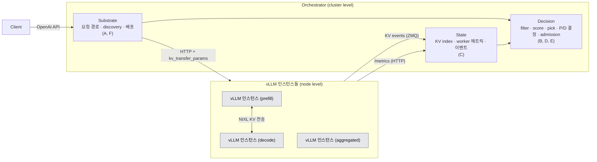
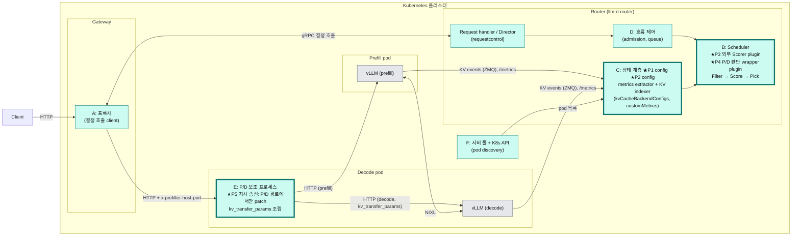
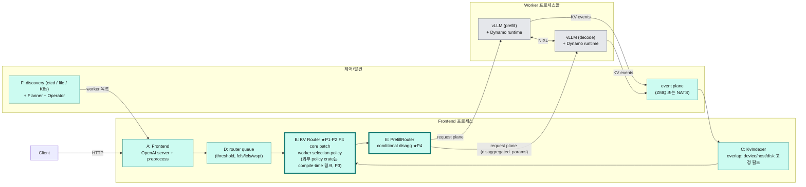
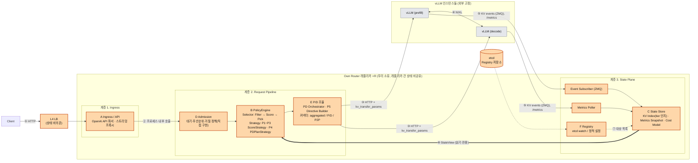
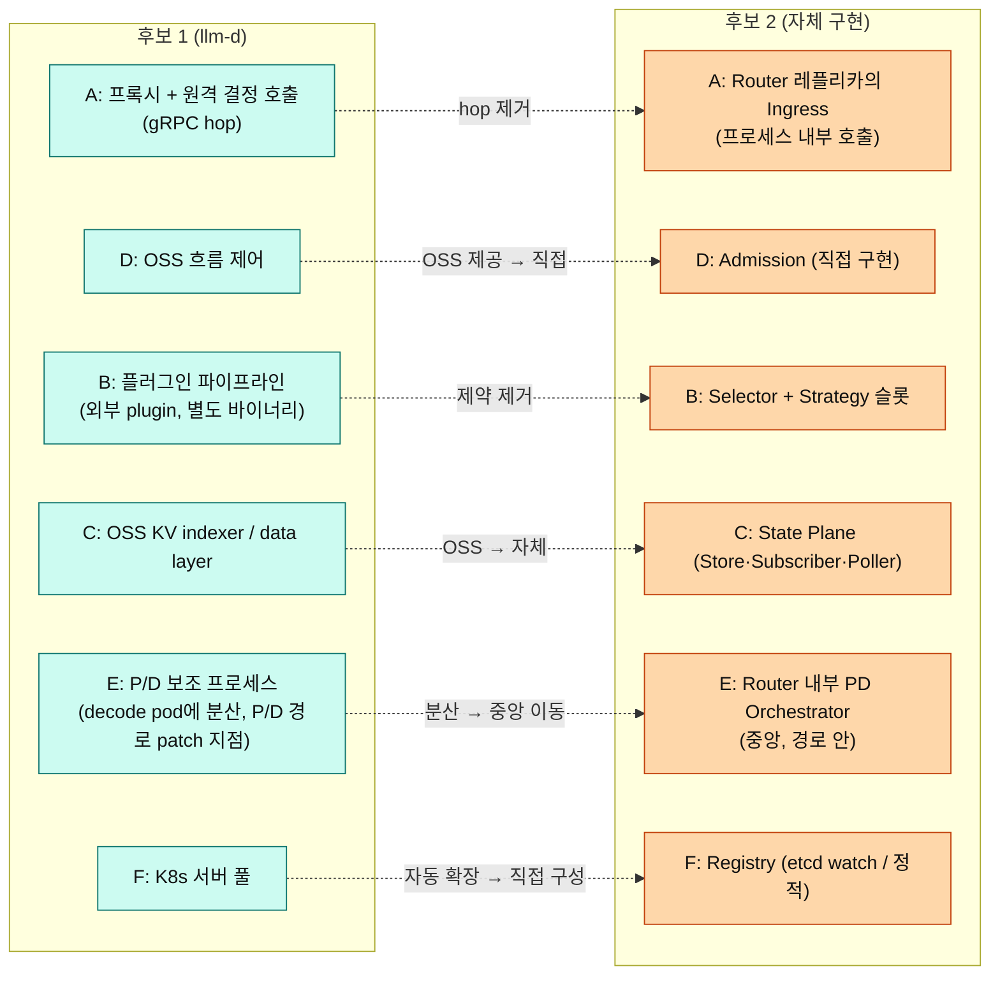

# DP0 — 서버 간 요청 조율 계층(Cluster-level Request Orchestration Framework): OSS 확장 vs 자체 구현

| 항목 | 내용 |
|---|---|
| 상태 | 초안 |
| 작성 일자 | 2026-10-02 |
| 분석 대상 버전 | llm-d Router `llm-d/llm-d-router@af01da5` (2026-10-01) / llm-d 문서 `mkim0628/llm-d@4cd4ed4` / NVIDIA Dynamo `ai-dynamo/dynamo@938d89b` (2026-10-01) / vLLM upstream `vllm-project/vllm@9e6550b` (2026-09-30) / 사용자 vLLM fork `mkim0628/vllm` 브랜치 `claude/vllm-call-path-analysis-qxulkr` |
| 근거 수준 범례 | **[A]** 실제 실행/빌드로 검증 · **[B]** 공식 문서·문헌 · **[C]** 코드 읽기·분석·논증 |
| 평가 표기 규칙 | 별점·▲/▼·우열은 모두 **가설**이다. 근거 수준은 결과의 좋고 나쁨과 독립으로 표기한다(기존 [`../Evaluation/qa-evaluation-criteria.md`](../Evaluation/qa-evaluation-criteria.md)와 동일). |
| 관련 문서 | 요구사항(기능·QA·제약): [`dp0-requirements.md`](dp0-requirements.md) · 폴더 안내: [`README.md`](README.md) |

---

# 임원용 요약

> 일반 SW 개발 관점에서 읽는 10줄 요약이다. 전문 용어는 괄호로 풀었고, 아래 본문의 사실·평가·결론은 그대로다.

1. **문제**: LLM을 실제로 돌리는 서버 프로세스(vLLM 인스턴스)가 여러 개이고, 서버마다 쓰는 메모리 종류(HBM/DRAM/CXL/SSD 등)가 다르다. 요청 하나를 **어느 서버로 보낼지** 고르는 **요청 조율 계층(Orchestration)** — 로드밸런서 + 스케줄러에 해당 — 이 필요하다.
2. **왜 중요한가**: 서버 안에서 얻은 성능 이득(예: 이전 대화의 중간 결과인 KV 캐시를 빠른 메모리에서 재사용)이 서버 간 요청 배분 단계에서 사라지면 의미가 없다. 조율 계층이 "어느 서버의 어느 메모리에 캐시가 있는지"를 알고 지시도 내릴 수 있어야 한다.
3. **선택지 2개 (make vs buy 비유)**: **1안 = 기성 오픈소스(llm-d)를 가져다 확장(buy & customize)**, **2안 = 우리가 직접 만든 자체 라우터(Own Router, make)**.
4. **현재 근거**: 우리에게 필요한 판단 로직 5개(정책 P1~P5) 중 llm-d는 설정 2개, 확장 모듈(plugin) 2개로 실제 실행까지 확인했다 [A]. 나머지 1개(P5)는 일반 경로는 확장 모듈로 되지만, Prefill/Decode 분리 경로는 기존 보조 모듈(보조 프로세스) 수정이 필요하다 [C].
5. **결론(잠정, 모두 가설)**: 두 안은 **tradeoff 관계**다(§6.6, §7.4). QA 4개의 별 합계는 **9 대 9 동점**이다 — 직접 개발(2안)은 **지연**을, OSS 확장(1안)은 **확장성**을 얻고, 변경·유지 용이성은 흡수(1안) 대 통제(2안)로 3 대 3이다. 설계 결정 3개(결정 위치, P/D 조율 위치, 기능 소유)가 이 대응을 만든다. 동점이면 QA 우선순위(Q1 처리량 > **Q2 지연** > Q3 변경·유지 용이성 > Q4 확장성, 소유자 확정)가 정하므로 **후보 2(자체 구현)를 선택**한다(§7.4.4). 단 지연 우위는 측정 전 가설이므로 **E1(결정 경로 오버헤드)을 선행 게이트**로 두고, hop 증분이 잡음 수준이면 규칙상 후보 1로 되돌아간다. 구현 부담(6/6)·증거 수준(설계안)은 QA 밖 제약·리스크로 표에 남기고 알고 감수한다(§7.4.1). 이전 판(후보 1 10 대 후보 2 8)은 후보 2를 최소 구성으로 그린 데서 나온 것이어서 정정했다(§7.4.2).
6. **남은 불확실성**: 실제 vLLM·프록시를 붙인 end-to-end 실행, 지연 측정(E1), 서버 간 RDMA 유무, 서버를 늘릴 때의 확장성(2대로는 실측 불가), 우리 vLLM fork가 upstream보다 뒤처진 점(§10.2).
7. **오픈소스 의존 리스크**: 확장 모듈이 오픈소스 내부 동작에 기대고 있어 업스트림이 바뀌면 깨질 수 있다. 자체 실행 이미지의 빌드·배포·추종도 우리 몫이다.
8. **다음 단계(결정 요청)**: (a) **E1을 후보 1(llm-d)에서 먼저 측정**해 후보 2 선택을 확정할지, (b) 후보 2 구현 범위(블록 6/6, 레플리카·HA·흐름 제어)와 일정, (c) vLLM fork 동기화 시점(엔진 측 P5 수신부 포함), (d) RDMA 유무 확인, (e) Kubernetes(KIND 포함) 환경 준비 범위 (§10.4).
9. **요구사항**: 기능 F1~F6, 품질 Q1~Q4, 제약 C1~C6은 [`dp0-requirements.md`](dp0-requirements.md)에 정리했다.

---

# 0. 이 문서의 위치

> 요약: DP0은 기존 DP1~DP4보다 앞에 오는 최상위 Design Point이며, 기존 DP 번호는 바꾸지 않는다.

기존 DP 문서는 사용자 repo `mkim0628/vllm` 브랜치 `claude/vllm-call-path-analysis-qxulkr`의 `doc-mk/`에 있고, DP0 문서도 같은 위치의 `doc-mk/DP0/`에 둔다(분석 근거 문서인 llm-d/Dynamo 분석은 `mkim0628/llm-d`에 있다).

| DP | 주제 | 위치(`doc-mk/` 기준 상대 링크) |
|---|---|---|
| **DP0 (본 문서)** | 서버 간 요청 조율 계층(cluster-level request orchestration framework): OSS 확장 vs 자체 구현 | [`DP0/dp0-request-orchestration-framework.md`](dp0-request-orchestration-framework.md) |
| DP1 | 이기종 메모리 기반 AI 데이터 배치(heterogeneous-memory data migration decision) | [`DP1/dp1-ai-data-migration-decision-architecture.md`](../DP1/dp1-ai-data-migration-decision-architecture.md) |
| DP2 | Prefill/Decode 실행 계획 결정 시점(prefill/decode execution planning) | [`DP2/dp2-prefill-decode-execution-planning-decision-timing.md`](../DP2/dp2-prefill-decode-execution-planning-decision-timing.md) |
| DP3 | 메모리 배치 추상화(memory placement abstraction) | [`vllm-dp3-memory-placement-abstraction-candidates.md`](../vllm-dp3-memory-placement-abstraction-candidates.md) |
| DP4 | 연산 배치 스케줄링(compute placement scheduling) | [`vllm-dp4-compute-placement-scheduling-candidates.md`](../vllm-dp4-compute-placement-scheduling-candidates.md) |

> 주의: 발표자료(deck)의 DP 이름은 DP3 = Long Context KV Eviction & Reuse, DP4 = Agent Tool-wait KV residency로 되어 있어, 위 표(이 repo의 DP3·DP4 문서 파일 주제: 메모리 배치 추상화, 연산 배치 스케줄링)와 이름이 다르다. DP 번호는 같고 이름만 다르며, 문서 파일이 어느 이름에 맞는지는 미확인이다. DP1·DP2는 같은 주제다.

공통 QA 정의와 근거 수준 규칙은 [`Evaluation/qa-evaluation-criteria.md`](../Evaluation/qa-evaluation-criteria.md)를 따른다. DP0에서는 그 QA 중 Throughput·Latency·Modifiability 3개를 쓰고, 사용자 과제 QA 목록에 있는 Scalability를 더해 모두 4개로 비교한다(§7). 요구사항 전체(기능 F1~F6, QA Q1~Q4, 제약 C1~C6)는 [`dp0-requirements.md`](dp0-requirements.md)에 있다(§3).

---

# 1. Background / Problem — 시스템 규모 관점

> 요약: 대상은 이기종 메모리가 섞인 멀티 노드·멀티 GPU 시스템이다. vLLM은 *인스턴스 내부* 병렬화를 담당하고, 여러 인스턴스를 묶는 fleet 조율은 vLLM 밖이다. 그 계층이 llm-d/Dynamo가 있는 곳이며, 이기종 메모리 때문에 이 계층이 필수가 된다. DP0은 그 계층을 OSS로 확장할지 직접 만들지를 묻는다.

## 1.1 대상 시스템

- 메모리: HBM / DRAM / CXL / HBF / custom HBM / SSD가 혼재한다.
- 노드: 여러 대이며(우리 환경은 8 GPU 노드 2대), 노드마다 GPU/worker가 여러 개다.
- 메모리 tier는 **노드 내부**(HBM↔DRAM↔CXL↔SSD)와 **노드 간**(P2P KV 공유, P/D 분리 시 KV 전송)에 걸쳐 있다.

## 1.2 vLLM의 범위: 인스턴스 내부 병렬화까지

하나의 vLLM *인스턴스*는 TP/PP/DP/EP로 여러 GPU, 경우에 따라 여러 노드를 쓸 수 있다. 그러나 그 위에서 **여러 인스턴스를 묶어 요청을 배치하고, P/D를 분리하고, KV를 공유하고, 확장하는** fleet 수준 조율은 vLLM의 범위 밖이다. 근거:

| 확인 항목 | 근거 | 수준 |
|---|---|---|
| vLLM의 DP coordinator는 *인스턴스 내부* DP 조율이다. "Coordinator process used for data-parallel deployments (DP>1)"이며 DP engine rank와 front-end API server 사이를 중개하고 waiting/running queue 길이를 front-end에 publish한다. | `vllm-project/vllm@9e6550b:vllm/v1/engine/coordinator.py` `class DPCoordinator` ([링크](https://github.com/vllm-project/vllm/blob/9e6550b/vllm/v1/engine/coordinator.py#L20)) | [C] |
| 내부 DP 부하 분산은 "각 engine의 running/waiting queue 기반"이며 "KV cache aware logic을 넣는 것은 향후 과제"라고 문서에 적혀 있다. | `docs/serving/data_parallel_deployment.md` "Internal Load Balancing" | [B] |
| 대규모에서는 DP rank를 별개 deployment처럼 취급하고 *외부 router*가 telemetry 기반으로 분산하는 방식(`--data-parallel-external-lb`)을 문서가 안내한다. | 같은 문서 "External Load Balancing" | [B] |
| vLLM repo 안의 cross-instance 라우팅 구현은 데모 수준 proxy뿐이다(`examples/disaggregated/disaggregated_serving/disagg_proxy_demo.py` 등). 서비스로서의 router/discovery/flow control은 `vllm/` 패키지에 없다. | `examples/disaggregated/disaggregated_serving/README.md`, `vllm/entrypoints` grep 결과 | [C] (grep 기반, 전수 정독은 아님) |
| vLLM 문서 스스로 llm-d를 "vLLM이 자체적으로 제공하려 하지 않는 cluster-level layer"로 소개한다. | `docs/deployment/integrations/llm-d.md` ("llm-d adds the cluster-level layer that vLLM does not aim to provide on its own") | [B] |

## 1.3 llm-d / Dynamo의 위치

llm-d와 NVIDIA Dynamo는 이 fleet 수준 조율(inter-instance orchestration)을 제공하는 OSS다. llm-d는 vLLM 인스턴스 fleet 앞단의 Router(EPP)·sidecar·KV indexer로, Dynamo는 Frontend·KV Router·PrefillRouter·Planner로 이 계층을 구성한다(§6).

**사용자 질문("llm-d의 배경은 vLLM보다 scale이 큰 게 맞나?")에 대한 직접 답.** 맞다. 단 정확한 표현은 "vLLM이 더 작은 시스템"이 아니라 **스케일링 축이 다르다**이다. vLLM은 *인스턴스 내부 병렬화*(한 모델을 여러 GPU에 쪼개 실행)를, llm-d/Dynamo는 *인스턴스 간 조율*(여러 인스턴스 중 누가 이 요청을 받을지, P/D pod를 어떻게 짝지을지, 인스턴스 간 KV를 어떻게 공유할지, 인스턴스 수를 어떻게 늘릴지)을 다룬다. 우리가 설계하는 "다중 노드·다중 GPU/worker" 시스템에서는 후자 계층이 반드시 필요하고, 그 계층의 규모(인스턴스 수·노드 수)가 vLLM 단일 인스턴스의 규모보다 큰 축에 있다. 이 DP의 질문은 그래서 vLLM이 아니라 이 상위 계층에 대한 것이다.

## 1.4 이기종 메모리와의 연결: 왜 다중 노드·다중 GPU/worker 관리가 필연인가

| 연결 | 내용 | 이 계층이 필요한 이유 |
|---|---|---|
| (a) tier 가치와 상태가 인스턴스마다 다르다 | prefix hit의 가치는 그 블록이 어느 tier에 있는지(HBM/DRAM/CXL/HBF/SSD)와 그 tier의 현재 점유·전송 큐에 따라 달라진다. 이 값은 인스턴스마다 다르다. | 라우팅이 이를 모르면 node level에서 얻은 tier 이득이 end-to-end에서 보존되지 않는다(§5의 "이득 보존"). |
| (b) P/D 분리와 prefill 위치는 인스턴스 간 결정이다 | 어느 인스턴스/자원에서 prefill할지, P/D pod를 어떻게 짝지을지는 한 인스턴스 안에서 정할 수 없다. | cluster-level 결정 계층이 필요하다. |
| (c) 노드 간 KV 이동이 tier 이동의 일부다 | P2P KV 공유, NIXL 기반 P→D 전송은 메모리 계층의 한 단계로 취급된다. | 전송 경로와 시점을 조율하는 주체가 필요하다. |

## 1.5 결과로서의 DP0 질문

이 계층(요청 경로·상태 수집·결정·흐름 제어·P/D 조율·발견/확장)을 **OSS(llm-d / Dynamo)를 확장해서** 만들지, **자체 구현**할지가 DP0이다. 이 선택은 하위 DP(DP1~DP4)가 가정할 cluster/node 경계(§10)를 정하므로 가장 먼저 온다.

---

# 2. 용어

> 요약: 경계는 "물리 서버"가 아니라 "vLLM 인스턴스"다. orchestrator는 3-plane, 기능은 6개 블록 A~F, 필요한 정책은 5개 P1~P5다.

## 2.1 cluster level vs node level

| 수준 | 정의 | 담당 |
|---|---|---|
| **cluster level (inter-instance)** — 서버 간(클러스터) 결정 | 요청을 어느 vLLM 인스턴스(pod)가 처리할지, P/D pod 짝짓기, 인스턴스 간 KV 공유, 상태 수집 | orchestrator |
| **node level (intra-instance)** — 서버 내부 결정 | 한 인스턴스 안의 batch/block/memory tier 결정, 인스턴스 내부 resource 선택 | vLLM 내부 |

경계는 물리 서버가 아니라 **vLLM 인스턴스**다. 한 인스턴스가 여러 GPU/노드를 쓰더라도 그 내부는 node level이다.

## 2.2 orchestrator 3-plane

| plane | 책임 |
|---|---|
| **Substrate** (기반: 요청이 지나가는 길) | 요청 경로, discovery(서버 발견), 배포 |
| **State** (상태: 판단 재료 수집) | KV index(어느 서버에 어떤 캐시가 있는지 색인), worker 메트릭(상태 수치), 이벤트 |
| **Decision** (판단: 어디로 보낼지 결정) | filter·score·pick(후보 서버에 점수를 매겨 고르는 단계), P/D 결정, admission(과부하 시 대기·거절 판단) |

## 2.3 6개 기능 블록과 OSS 대응

| 블록 | 기능 | plane | llm-d 대응 | Dynamo 대응 |
|---|---|---|---|---|
| **A** 요청 경로 | 요청 수신·전달·응답 중계 | Substrate | Envoy + ext-proc | Frontend |
| **B** 결정 로직 | 후보 worker 선택 | Decision | EPP Scheduler 플러그인(Filter→Score→Pick, ProfileHandler, decider) | KV Router(worker selection policy) |
| **C** 상태 수집 | KV index, 메트릭 | State | Data Layer + KV indexer | KVIndexer + 이벤트 plane |
| **D** 흐름 제어 | admission, 큐잉 | Decision | Flow Control | router queue |
| **E** P/D 조율 | prefill→decode 연결, KV 전송 파라미터 조립 | Decision/Substrate | pd-sidecar(decode pod 안) | PrefillRouter |
| **F** 발견·확장 | worker 발견, 확장 | Substrate | InferencePool / K8s | discovery + Planner + Operator |

근거: llm-d는 `llm-d/llm-d-router@af01da5`의 `pkg/epp/{flowcontrol,framework,datalayer,requestcontrol}`, `pkg/kvcache`, `pkg/kvevents`, `pkg/sidecar`; Dynamo는 `ai-dynamo/dynamo@938d89b`의 `lib/kv-router`, `lib/llm/src/kv_router/prefill_router/mod.rs`, `components/src/dynamo/{frontend,planner}` [C]. 각 프로젝트의 상세 구조는 [llm-d 분석 문서](https://github.com/mkim0628/llm-d/blob/claude/doc-mk-orchestration-analysis/doc-mk/llm-d/llm-d-architecture-analysis.md), [Dynamo 분석 문서](https://github.com/mkim0628/llm-d/blob/claude/doc-mk-orchestration-analysis/doc-mk/dynamo/dynamo-architecture-analysis.md) 참조(링크만).

> 참고: `llm-d-router`에는 pd-sidecar 외에 **coordinator**(Go 서비스, `cmd/coordinator`, `pkg/coordinator`)가 있어 encode→prefill→decode를 Gateway 경유로 단계별 호출하는 경로가 추가되어 있다(`docs/coordinator_architecture.md`). 본 문서는 합의된 구조(E=pd-sidecar)를 기준으로 하고, coordinator는 E의 대체 구현 경로로만 언급한다(§12 정정 사항).

### 2.3.1 용어 대응 (일반 용어 ↔ llm-d 용어)

> 본문(§1~§7.4)과 발표자료는 아래 **일반 용어**를 쓴다. 코드 근거·실험 기록(§7.5, §11, §12, 인용된 경로)은 검증 가능성을 위해 llm-d 원어를 그대로 둔다.

| 일반 용어 | llm-d 원어 | 설명 |
|---|---|---|
| 프록시 | Envoy (Gateway) | 요청을 받아 서버로 중계하는 범용 L7 게이트웨이 |
| 원격 결정 호출 | ext-proc (gRPC) | 프록시가 요청을 Router에 보내 서버 선택을 받아 오는 표준 확장 호출 |
| Router (결정 서비스) | EPP (Endpoint Picker, `llm-d-router`) | 서버를 고르는 별도 프로세스(요청 제어·흐름 제어·스케줄러·상태 계층 포함) |
| 상태 계층 | Data Layer | KV 위치 색인(KV indexer)과 메트릭 수집 |
| P/D 보조 프로세스 | pd-sidecar | decode 서버에 붙어 prefill→decode를 이어 주는 보조 프로세스 |
| P/D 판단 모듈 / wrapper | ProfileHandler / `disagg.Handler` wrapper | prefill·decode 분리 여부와 대상을 정하는 모듈 |
| 서버 풀 | InferencePool | 후보 서버(pod) 목록과 발견 |

## 2.4 정책 P1~P5 (E2 프로브 기준)

| 정책 | 내용 |
|---|---|
| **P1** | 새 메모리 매체(CXL/HBF 등)를 prefix-hit credit(캐시 적중 점수)에 반영 |
| **P2** | tier 점유·전송 큐 같은 동적 상태로 라우팅 보정 |
| **P3** | 비용 기반 hit 가치(재계산 절감 − tier 전송 비용, 점유 보정) |
| **P4** | 비용 기반 P/D 분리 결정 |
| **P5** | 요청별 node 지시(`kv_load_tiers` / `max_load_tokens` 등). **송신(결정·첨부)은 오케스트레이션, 수신·실행은 엔진**(§4.2) |

### 2.4.1 쉬운 설명과 구현 방식 (비전문가용)

우리가 조율 계층에 넣어야 하는 **판단 로직 5개**를 일반 SW 용어로 풀어 쓴 표다. "구현 방식"은 기존 OSS 코드를 얼마나 건드리는지를 뜻한다(설정 변경 < 확장 모듈 추가 < 기존 모듈 수정). 정의는 [`dp0-requirements.md`](dp0-requirements.md) §5와 같다.

| ID | 이름 | 한 줄 설명 | llm-d에서 구현 방식 (§7.5) |
|---|---|---|---|
| **P1** | 새 메모리 종류를 캐시 적중 점수에 반영 | 캐시가 HBM/DRAM/CXL/SSD 중 어디에 있는지에 따라 점수 가중치를 다르게 준다 (메모리 종류별 가중치 표) | **설정만** (가중치 표에 이름·값 추가) [A] |
| **P2** | 실시간 메모리 상태 반영 | 서버가 알려 주는 "메모리 사용량·전송 대기" 같은 수치(메트릭)를 읽어 점수에 가감한다 | **설정만** (읽을 수치 이름 지정) [A] |
| **P3** | 비용 기반 적중 점수 | "KV를 다시 계산하는 비용"과 "그 메모리에서 가져오는 비용"을 비교해 점수를 매긴다 (점유율이 높으면 감점) | **확장 모듈(plugin)** 추가 [A] |
| **P4** | 비용 기반 P/D 분리 판단 | 요청마다 Prefill/Decode를 나눠 실행할지, Prefill을 어디서 할지를 비용 비교로 판단한다 | **확장 모듈(wrapper)** 추가 [A] — 기존 모듈을 감싸는 방식 |
| **P5** | 요청별 노드 지시 | 요청마다 서버에 "어느 메모리에서 몇 토큰까지 불러와라"를 지시한다 | 일반 경로는 **확장 모듈**로 가능 [A], **P/D 경로는 기존 모듈(sidecar) 수정 필요** [C] |

## 2.5 확장 깊이 등급

| 등급 | 의미 |
|---|---|
| **C** | 설정만 (Config) |
| **P** | 외부 확장 모듈(plugin, 프레임워크 무수정) |
| **F** | 프레임워크 core 수정(patch, 기존 모듈 수정) |

---

# 3. Design Question과 고정 전제

> 요약: engine은 vLLM으로 고정. 질문은 "cluster-level orchestration을 OSS 확장으로 할지 자체 구현으로 할지"이며, 성능 관점에서는 "우리에게 필요한 정책 P1~P5에 도달 가능한가"를 묻는다.

**고정 전제**

1. Engine = vLLM (고정).
2. cluster/node 경계 = vLLM 인스턴스.
3. 요구 정책 = P1~P5.
4. **불변 조건**: 어느 후보도 손실형 KV 전송이나 근사 캐시 hit를 도입하지 않는다(정확도 보존; §7.2).

**Design Question**

> vLLM 인스턴스 fleet 위의 cluster-level request orchestration(블록 A~F)을 OSS(llm-d / NVIDIA Dynamo)를 확장하여 구성할 것인가, 우리가 decision plane과 state plane을 소유하는 자체 구현으로 구성할 것인가?

**성능 관점 질문**

> 이기종 메모리의 node level 이득(새 tier의 hit, tier 간 이동)이 cluster level 결정에서 *보존*되는가? 즉 orchestrator가 node의 새 상태를 볼 수 있고(입력 해상도), node에 새 지시를 내릴 수 있고(출력 해상도), 그 결정이 지연·신선도 면에서 쓸 만한가?

**요구사항 (별도 문서)**

이 DP의 기능 요구사항·품질 속성(QA)·제약사항은 [`dp0-requirements.md`](dp0-requirements.md)에 정의한다(단일 출처). 한 줄 요약:

| 구분 | ID | 한 줄 요약 |
|---|---|---|
| 기능 | F1~F6 | 요청 라우팅, 메모리 상태 수집, P/D 분리 결정·조율, 요청별 노드 지시 전달, 흐름 제어, 서버 발견·확장 |
| 품질(QA) | Q1~Q4 | Throughput(SLO Goodput), Latency(TTFT·결정 경로 추가 시간), Modifiability(변경 용이성), Scalability(서버를 늘릴 때의 확장성) |
| 제약 | C1~C6 | vLLM 고정, 실험 환경(GPU 8장 서버 2대), 정확도 불변, OSS 업스트림 추적, 서버 내부 DP와의 접점 계약 고정, 정책 P1~P5 표현 가능 |

---

# 4. 공통 구조 (후보와 무관하게 고정)

> 요약: 어느 후보를 택하든 orchestrator는 Substrate/State/Decision 3-plane이고, vLLM과의 접점 계약(KV events, `/metrics`, `kv_transfer_params`, NIXL)은 같다. 후보 차이는 이 plane들을 *누가 소유하는가*이다.

## 4.1 vLLM 접점 계약

| 접점 | 방향 | 내용 | 근거 |
|---|---|---|---|
| KV events | vLLM → State | `BlockStored`/`BlockRemoved` 이벤트, `medium` 필드 포함(ZMQ) | `vllm-project/vllm@9e6550b:vllm/distributed/kv_events.py` (`medium: str \| None`, L60·L89 부근); llm-d 수신 측 `llm-d-router@af01da5:pkg/kvevents/engineadapter/vllm_adapter.go` ("[6] medium") [C] |
| `/metrics` | vLLM → State | 큐 길이·KV 사용률 등 Prometheus 메트릭 | llm-d `pkg/epp/framework/plugins/datalayer/extractor/metrics` [C] |
| `kv_transfer_params` | orchestrator → vLLM | P/D 시 prefill 결과의 원격 KV 위치(`remote_engine_id`/`remote_block_ids`/`remote_host`/`remote_port`) 전달 | llm-d `docs/coordinator_architecture.md`("kv-nixl"), `pkg/sidecar/proxy/connector_nixlv2.go` [C] |
| NIXL | vLLM ↔ vLLM | P→D 간 KV 직접 전송(RDMA/GPUDirect, 없으면 TCP fallback) | `mkim0628/llm-d@4cd4ed4:docs/architecture/advanced/disaggregation/README.md` [B] |

요청별 node 지시 채널(P5)은 upstream vLLM에만 존재한다: `kv_transfer_params`의 `max_load_tokens`, `kv_load_tiers`가 `vllm/distributed/kv_transfer/kv_connector/v1/offloading/scheduler.py`(L64 `KV_LOAD_TIERS_KEY`, L367 `max_load_tokens`)에서 소비된다 [C]. **사용자 fork에는 이 키가 없다**(grep 0건; §10.2).

## 4.2 범위 점검: 오케스트레이션과 엔진의 경계 (P5는 어느 쪽인가)

> 요약: 정책 P1·P2·P5는 모두 **두 쪽**으로 이루어진다. DP0(오케스트레이션)가 맡는 쪽은 **결정과 송신**이고, **수신·실행은 엔진(vLLM) 쪽**이다. 둘은 접점 계약(C5: KV events, `/metrics`, `kv_transfer_params`, NIXL)으로 만난다. 따라서 "P5는 vLLM 안에 넣어야 한다"는 **수신부에 한해 맞고**, 지시를 정하고 보내는 쪽은 오케스트레이션이다.

| 정책 | 오케스트레이션 측 (DP0 범위) | 엔진 측 (vLLM, 접점 계약) | 비고 |
|---|---|---|---|
| P1 새 매체 가중치 | 가중치 표로 점수 반영 | KV event의 `medium`에 새 매체 이름을 싣기(현재 `Medium` enum은 `CPU`/`STORAGE`) | 엔진 변경 필요, 두 후보 공통 선결 [C] |
| P2 실시간 상태 보정 | 메트릭을 읽어 점수에 가감 | 메모리 사용량·전송 대기 게이지를 `/metrics`로 노출(실제 이름 미확인) | 두 후보 공통 [C] |
| P3, P4 | 비용 기반 점수·P/D 판단 전부 | 입력(KV events, 메트릭)만 제공 | 엔진 변경 없음 |
| **P5 요청별 노드 지시** | **무엇을 지시할지 계산하고 `kv_transfer_params`에 첨부해 보냄** (후보 1: plugin·P/D 보조 프로세스, 후보 2: Directive Builder) | **`kv_load_tiers`/`max_load_tokens`를 받아 tier 선택·로드 상한에 반영** (upstream `vllm/distributed/kv_transfer/kv_connector/v1/offloading/scheduler.py`). **사용자 fork에는 없다** | 수신부는 두 후보 공통 선결, 송신부가 후보 간 차이 |

**왜 P5의 결정·송신을 엔진 안에 두지 않는가.** 지시 내용(어느 tier에서 몇 토큰을 불러올지)은 **여러 인스턴스의 KV 위치·부하를 함께 알아야** 정할 수 있다. 단일 인스턴스 엔진은 그 정보를 갖지 않으므로 cluster-level 결정이다. 엔진은 받은 지시를 실행하는 쪽이다.

**P/D 보조 프로세스(pd-sidecar)는 엔진이 아니다.** decode 서버 옆에서 실행되지만 llm-d 소프트웨어(오케스트레이션)이고, `kv_transfer_params`를 덮어쓰는 것도 이 보조 프로세스다. 그래서 후보 1의 "P/D 경로 P5는 보조 프로세스 수정"은 **엔진이 아니라 오케스트레이션 쪽 수정**이며, 후보 2에서는 같은 일이 Router 안 Directive Builder 한 곳에서 일어난다. 도식의 vLLM 박스는 외부 고정이고, 도식의 "★P5"는 **지시 송신**만을 뜻한다.

**비교에 미치는 영향.** 엔진 측 수신부 변경(새 지시 키를 vLLM이 이해하도록)은 어느 후보를 택해도 똑같이 필요하므로 후보를 가르지 않는다. 후보 비교(S4 포함)는 **오케스트레이션 측 변경만** 센다(§7.3). 반면 사용자 fork에 수신부가 없다는 사실은 P5를 쓰려면 fork 동기화가 선결이라는 의미이고, 이는 §10에 둔다.

---

# 5. 성능 연결 모델

> 요약: orchestrator가 성능에 닿는 경로는 6개다. 두 후보의 *표현력 천장*은 정책 집합 P1~P5 기준으로 같고, DP0의 성능 연결은 일차적으로 "필요한 정책에 도달 가능한가(enabler)"이다. 실현 Throughput은 경로별(P/D 경로 P5, 과부하 Flow Control)로 갈린다(§7.4).

## 5.1 경로 ①~⑥

| # | 경로 | llm-d | Dynamo | 성능 영향 |
|---|---|---|---|---|
| ① | **입력 해상도** (결정이 보는 상태) | tier 가중치는 정적 스칼라. 기본 `gpu 1.0 / cpu 0.8 / shared_storage 0.4 / object_store 0.2` (`pkg/kvcache/backend.go`). | host 0.75, disk 0.25 (`lib/kv-router/src/scheduling/config.rs` `default_host_cache_hit_weight`/`default_disk_cache_hit_weight`); device는 별도 `overlap_score_credit` 계수 | hit의 실제 이득 = 재계산 절감 − tier 전송 비용(대역폭·경합)인데 부하가 반영되지 않음 → TTFT, Goodput |
| ② | **출력 해상도** (node에 내릴 지시) | 헤더 4종(`x-prefiller-host-port`, `x-encoder-hosts-ports`, `x-kv-cache-source-host-port`, `x-data-parallel-host-port`; `pkg/common/routing/common.go`) + PreRequest 단계에서 요청 body(`kv_transfer_params`) 변경 가능(aggregated 경로에서 ext-proc 응답 body·Content-Length 갱신 확인 [A]). 단 P/D·P2P 경로에서는 pd-sidecar가 `kv_transfer_params`를 덮어씀 [C]. body 변경은 `openai`/`vllm-http` 파서에서만 유효하고 `vllm-grpc`/`passthrough`에서는 no-op | 요청별 router config override(`RouterConfigOverride`). vLLM 쪽 수신부(`kv_load_tiers`/`max_load_tokens`/`KvHintsEnvelope`)는 있으나 Dynamo 쪽 일반 송신 경로는 없음([Dynamo 분석 문서](https://github.com/mkim0628/llm-d/blob/claude/doc-mk-orchestration-analysis/doc-mk/dynamo/dynamo-architecture-analysis.md) §8.2) [C] | vLLM 쪽 `max_*`는 experimental. **실제 vLLM에서 tier 선택이 바뀌는 효과는 미확인** |
| ③ | **결정 지연** (hop = 추가 네트워크 호출 1회) | Envoy ext-proc gRPC hop 존재 (라우터가 별도 의사결정 프로세스에 원격 질의하는 추가 호출 1회) | 기본 경로에서는 Frontend 프로세스 안(단 GAIE 모드는 ext-proc 존재, `docs/fern/pages/reference/components/gateway-api-routing.mdx`) | **구조(프로세스 경계, hop 수) 차이**이며 구현 언어 때문이 아님. **미측정** |
| ④ | **상태 신선도** | speculative indexing은 **기본 비활성**이며 켰을 때 TTL 기본 2s (`pkg/epp/framework/plugins/requestcontrol/dataproducer/preciseprefixcache/prerequest.go` `defaultSpeculativeTTL`) | replica 간 active-sequence 동기화(`DYN_ROUTER_REPLICA_SYNC`)는 best-effort | stale-hit 비율 → hit 가치 오판 |
| ⑤ | **admission/큐잉** | Flow Control (`pkg/epp/flowcontrol`, 기본 off) | 큐 임계값(`DYN_ROUTER_QUEUE_THRESHOLD`) + `fcfs`/`lcfs`/`wspt` (`RouterQueuePolicy`) | 과부하 시 Goodput |
| ⑥ | **P/D 분리 결정** (Prefill/Decode를 서로 다른 서버에서 나눠 실행할지 정하는 것; 가장 큰 레버) | `prefix-based-pd-decider`: 정적 임계값 `nonCachedTokens`(코드 기본 0=비활성, 문서 예 8, deploy 예 16) | `ConditionalDisaggPolicyKind` 3종(`isl_bounding`/`prefill_load`/`isl_or_load`) + AIC 기반 prefill 시간 예측 | P/D 전환점 → TTFT/Goodput |

근거 수준: 위 표는 전부 코드·문서 읽기 [C]/[B]. 성능 수치는 측정하지 않았다.

> **"이득 보존"** (서버 내부에서 얻은 성능 이득이 서버 간 요청 배분 단계에서 사라지지 않게 하는 것): node level에서 이득이 있어도 orchestrator가 node의 새 상태를 못 보거나(①) 못 쓰면(②, ⑥) cluster level에서 그 이득이 손실된다.

## 5.2 천장 vs 실현, 그리고 정직한 결론

- **천장**: 후보가 *원리적으로* 표현할 수 있는 정책 집합. 자체 구현은 무엇이든 쓸 수 있으므로 천장이 무한이다. 이 비교는 의미가 없다.
- **실현**: 같은 정책 집합 P1~P5를 *실제로 구현한 결과값*. OSS는 외부 plugin이나 patch를 거쳐 P1~P5를 모두 표현할 수 있다(§7.5).

따라서 **우리 정책 집합 P1~P5 기준으로 두 후보의 표현력 천장은 같다**(근거 [A+C]: llm-d P1~P4는 합성 백엔드로 EPP를 끝단까지 실행해 확인 [A], P5의 P/D 경로와 Dynamo 쪽은 코드 분석 [C]). 천장이 같다는 것이 실현 Throughput이 같다는 뜻은 아니다 — 실현값은 경로별로 갈린다(P/D 경로 P5 도달성은 후보 2, 과부하 Flow Control은 후보 1; §7.4). DP0의 성능 연결은 일차적으로 **필요한 정책에 도달 가능한가**, 즉 enabler이고, 후보를 가르는 것은 Latency(hop 구조), Modifiability, Scalability와 Throughput의 경로별 교차다(§6.6, §7).

> **평가 방법론 주의 (두 차례의 수정 기록).**
>
> 1. 초기 평가는 후보 2를 *이론적 천장*으로, 후보 1을 *현재 제약이 있는 상태*로 놓고 비교해 후보 2가 압승으로 나왔으나 이는 부정확했다. 같은 정책 집합·실현값 기준으로 다시 평가하면 trade-off가 성립했다.
> 2. 그 뒤 llm-d 분석([llm-d 분석 문서](https://github.com/mkim0628/llm-d/blob/claude/doc-mk-orchestration-analysis/doc-mk/llm-d/llm-d-architecture-analysis.md) §8)의 코드 실험으로 근거 수준이 [C]에서 [A]로 올라가면서 평가가 **다시 바뀌었다**. P4는 core patch(F)가 아니라 `disagg.Handler`를 embed한 ProfileHandler wrapper(외부 plugin, P)로 구현·실행되었고 [A], P5도 aggregated 경로는 plugin(P)으로 가능했다 [A]. 그 결과 후보 1의 Modifiability 약점(로직 변경 시 patch 필요)이 크게 줄었다.
> 3. 결과: **후보 2의 우위는 Latency 가설(hop 1개, 미측정)과 K8s 비의존(QA가 아닌 프로젝트 제약)으로 좁아졌다. 따라서 후보 2는 현 시점에서 헤지(전환 조건 충족 시 선택)의 성격이 강하고, trade-off 균형은 처음 가정보다 후보 1 쪽으로 기울었다.** 이 변화는 근거가 더 강해진 쪽으로 평가가 이동한 것이며 숨기지 않고 기록한다. 전부 가설이라는 단서는 유지한다.
> 4. **세 번째 수정(본 판)**: 위 결과 후보 1이 4개 QA 중 3개에서 앞서 사실상 지배하는 구조가 되었다(별 합계 10 대 8). 원인을 점검하니 **평가 수치가 아니라 후보 2의 정의**가 문제였다. 후보 2를 "단일 프로세스·정적 registry·최소 admission"의 최소 구성으로 그려서, 후보 1은 완성형·후보 2는 미완성형을 비교한 셈이었다. 이는 §5.2의 "천장 vs 실현" 오류와 같은 종류(비교 수준 불일치)다. 그래서 (i) 후보 2를 **같은 노력 수준의 계층형 설계**(레플리카·etcd registry·Strategy 패턴·흐름 제어 포함)로 다시 정의하고(§6.3), (ii) 늘어난 구현 부담은 별점이 아니라 **QA 밖 제약·리스크**로 표기했으며(§7.4.1), (iii) 변경 용이성은 원래 정의(S1~S6)를 유지했다(§7.3). 별 경계·QA 지표·공통 QA 문서는 바꾸지 않았고 중간에 정의가 오간 이력과 사유는 §7.4.2에 모두 남겼다.

---

# 6. 후보 구조 (컴포넌트 뷰)

> 요약: 구분 규칙은 하나다. **"우리 코드가 decision plane과 state plane을 모두 소유하는가"**. 소유하면 후보 2, OSS가 소유하고 우리 로직은 설정·외부 plugin·국소 patch로 삽입하면 후보 1이다. llm-d 프로토콜을 지키는 자체 picker라도 state plane(KV index, 메트릭 수집)을 다시 만들어야 하면 후보 2다.

| 후보 | 이름 | 소유 범위 |
|---|---|---|
| **후보 1** (1안) | OSS 확장 (Adopt & Extend; 기성품을 가져다 확장) | OSS가 substrate/state/decision 파이프라인을 소유. 1a llm-d(대표), 1b Dynamo(민감도 확인용) |
| **후보 2** (2안) | 자체 구현 (Build; 직접 개발) | 우리가 decision plane + state plane 소유. 계층형 Router 레플리카 ×R + etcd(§6.3). **설계안이며 구현되지 않았다. 구현량은 추정.** |

색 규칙(아래 다이어그램 공통): 후보 1 = 청록, 후보 2 = 주황, 외부 고정 vLLM = 회색, 우리가 바꾸는 지점(★) = 굵은 테두리.

## 6.1 후보 1a — llm-d 확장 (대표)

> 요약: K8s 위에서 프록시가 원격 결정 호출로 Router를 호출하고, Router 안의 Scheduler/상태 계층/흐름 제어가 결정을 내리며, P/D 조율은 decode pod의 보조 프로세스가 한다. ★는 우리가 바꾸는 지점이다.

**우리가 바꾸는 지점(★)과 정책 연결**

| ★ | 블록 | 정책 | 깊이 | 방법 | 근거 |
|---|---|---|---|---|---|
| ★ | C 상태 계층 | P1 | **C** | `kvCacheBackendConfigs{name,weight}`에 새 매체 이름 추가. name은 자유 문자열, 미설정 tier 가중치는 `unknownTierWeight = 0.0` | `llm-d-router@af01da5:pkg/kvcache/backend.go`, `pkg/kvcache/prefix_match.go#L45` [C] |
| ★ | C 상태 계층 | P2 | **C**(근사) | `customMetrics` + `endpoint-attribute-scorer`. prefix scorer와 별도로 가산되므로 근사다 | `pkg/epp/framework/plugins/datalayer/extractor/metrics/factories.go`, `.../scorer/endpointattribute/README.md` [C] |
| ★ | B Scheduler | P3 | **P** [A, 끝단까지] | 외부 Go 모듈로 Scorer 구현(`fwksched.Scorer`, `fwkplugin.ConsumerPlugin`). 초기 프로브(v1)는 기본 `DataKey`를 써서 실제 파이프라인에서는 tier 데이터를 못 받아 점수가 전부 0이었다. precise producer 이름을 파라미터로 받는 v2가 정상이다. **단위 테스트 통과만으로는 부족했다** | [llm-d 분석 문서](https://github.com/mkim0628/llm-d/blob/claude/doc-mk-orchestration-analysis/doc-mk/llm-d/llm-d-architecture-analysis.md) §8.5 (E7c, E7d) |
| ★ | B P/D 판단 모듈 | P4 | **P** [A, 끝단 E8] (이전 F 판정 정정) | `deciderPlugin`이 unexported인 것은 사실이나, exported 타입 `disagg.Handler`를 embed한 P/D 판단 wrapper가 `Pick`만 재정의해 비용 기반 P/D 결정을 한다. 취약점: `Handler`의 관찰된 동작에 의존(업스트림이 바꾸면 깨짐). 보완: 업스트림에 `deciderPlugin` export 제안(F-light) | `pkg/epp/framework/plugins/scheduling/profilehandler/disagg/decider_plugin.go#L28`, [llm-d 분석 문서](https://github.com/mkim0628/llm-d/blob/claude/doc-mk-orchestration-analysis/doc-mk/llm-d/llm-d-architecture-analysis.md) §8.6 |
| ★ | E P/D 보조 프로세스 (decode 서버에 붙어 실행) | P5 | aggregated/decoder-only **P** [A] / **P/D·P2P F** [C] | aggregated 경로: PreRequest에서 `MutatePayloadMap`으로 `kv_transfer_params` body 변경. P/D·P2P 경로: 보조 프로세스가 `kv_transfer_params`를 덮어쓰므로 보조 프로세스 patch 필요 | `pkg/sidecar/proxy/connector_nixlv2.go`, `connector_p2p.go`, [llm-d 분석 문서](https://github.com/mkim0628/llm-d/blob/claude/doc-mk-orchestration-analysis/doc-mk/llm-d/llm-d-architecture-analysis.md) §8.7 |

**배포 형태(후보 1a의 운영 비용).** 외부 plugin(P3, P4, P5-aggregated)을 쓰려면 **자체 `main`에서 `Register` + `NewRunner().Run`을 호출하는 별도 바이너리/이미지**를 빌드해야 한다. in-tree 등록 함수가 private이므로 공식 Router 이미지를 그대로 쓸 수 없고, 모듈은 Go 1.26.6이 필요하다 [A]. 즉 "fork 불필요"이지만 "자체 Router 이미지의 빌드·배포·upstream 추종"은 우리 몫이다.

## 6.2 후보 1b — Dynamo (민감도 확인용)

> 요약: 기본 경로에서는 Frontend 프로세스 안에 KV Router·PrefillRouter가 있어 별도 ext-proc hop이 없다. 새 tier·점유 상태 반영은 Rust 라우터 내부 수정이 필요하다.

근거: 요청 흐름과 PrefillRouter 위치는 `ai-dynamo/dynamo@938d89b:docs/fern/pages/developer-guide/knowledge-base/concepts/system-architecture/architecture.md` "Request Flow"와 `lib/llm/src/kv_router/prefill_router/mod.rs#L215` [B/C]. GAIE 모드에서는 별도 EPP(ext_proc)가 추가되고 이 경우 ③의 hop 이점이 사라진다 [B]. Dynamo가 vLLM을 호출하는 경계의 구체 형태(Python wrapper 구조)는 [Dynamo 분석 문서](https://github.com/mkim0628/llm-d/blob/claude/doc-mk-orchestration-analysis/doc-mk/dynamo/dynamo-architecture-analysis.md) 참조, 본 문서에서는 미확인.

## 6.3 후보 2 — 자체 구현 (계층형 컴포넌트 뷰)

> 요약: 후보 2는 **우리가 decision plane과 state plane을 모두 소유**하는 계층형 Router다. 3개 계층(Ingress / Request Pipeline / State Plane)과 읽기 전용 StateView로 나누고, 정책 교체는 **Strategy 패턴**(§6.3.5) 하나로 구성하고, 상태를 공유하지 않는 **레플리카 ×R**을 L4 LB 뒤에 두어 늘린다. K8s/Envoy는 불필요하다. vLLM 계약(KV events, `/metrics`, `kv_transfer_params`, NIXL)은 후보 1과 동일하다. **설계안이며 구현되지 않았고, 구현량은 추정이다.**
>
> 이전 판은 이 후보를 "단일 프로세스·정적 설정·최소 admission"으로만 그렸다. 그러면 후보 1(완성형)과 후보 2(미완성형)를 비교하게 되어 tradeoff가 성립하지 않으므로, 같은 노력 수준으로 재정의했다(§5.2 박스 4번). 대신 늘어난 구현 부담은 QA가 아니라 제약·리스크로 §7.4.1에 명시한다.

### 6.3.1 컴포넌트 뷰

**의존 방향(규칙).** (1) 계층은 위에서 아래로만 호출한다: Ingress → Pipeline. (2) State Plane은 Pipeline에서 **StateView 인터페이스(읽기 전용)** 로만 읽는다. Pipeline은 State Plane에 쓰지 않는다. (3) 정책(P1~P4)은 **Strategy 패턴**(같은 인터페이스의 구현체를 설정으로 교체)으로 PolicyEngine에 꽂는다. 정책을 바꿔도 Ingress·State Plane은 건드리지 않는다(Modifiability S1~S4).

### 6.3.2 컴포넌트 카탈로그

| 컴포넌트 | 블록 | 계층(plane) | 책임 | 제공 인터페이스 | 필요 인터페이스 | 담당 정책 |
|---|---|---|---|---|---|---|
| Ingress / API | A | Ingress (Substrate) | OpenAI API 파싱, 스트리밍 응답 중계 | OpenAI API | Admission 호출 | — |
| Admission | D | Pipeline (Decision) | 과부하 시 대기·우선순위·거절. **직접 구현**(OSS 흐름 제어에 해당하는 범위, 구현 부담에 포함) | `admit(req)` | StateView(부하) | — |
| PolicyEngine | B | Pipeline (Decision) | 후보 서버 선택(Filter → Score → Pick). Scorer/Planner를 Strategy로 로드 | **Strategy 인터페이스**(`ScoreStrategy`, `PDPlanStrategy`) | StateView | P1, P2, P3, P4 |
| P/D 조율 (PD Orchestrator) | E | Pipeline (Decision/Substrate) | prefill→decode 연결, `kv_transfer_params` 조립, 요청별 노드 지시(P5) 첨부, 실패 시 재시도 | **Dispatch port**(vLLM HTTP) | PolicyEngine 결과, StateView | P5 |
| State Store | C | State Plane | tier 인지 KV index, 메트릭 스냅샷, 비용 모델(tier 대역폭·점유) 보관 | **StateView**(읽기 전용) | Event Subscriber, Metrics Poller | P1, P2 입력 |
| Event Subscriber | C | State Plane | vLLM KV 이벤트(ZMQ) 구독 → index 갱신. **레플리카마다 독립 구독** | — | KV events 계약 | — |
| Metrics Poller | C | State Plane | `/metrics` 주기 수집 → 스냅샷 갱신 | — | `/metrics` 계약 | P2 입력 |
| Registry | F | State Plane (Substrate) | 서버(인스턴스) 목록 관리(etcd watch 또는 정적 설정), Subscriber/Poller의 대상 제공 | `endpoints()` | etcd | — |

### 6.3.3 배치·확장 (스케일아웃 뷰)

- **레플리카 모델**: Router 레플리카는 요청 경로 상태를 갖지 않는다. 각 레플리카가 vLLM의 KV 이벤트를 **독립적으로 구독**해 자기 index를 만든다(ZMQ PUB는 다수 구독자를 허용하는 것으로 가정, **미검증**). 그래서 L4 LB가 상태 없이 분배해도 동작한다.
- **옵션**: 레플리카 간 index 동기화(Dynamo의 replica sync와 같은 종류, best-effort). 필요성은 E3(상태 신선도)로 판단한다.
- **직접 구축해야 하는 것(후보 1은 OSS가 제공)**: L4 LB 구성, 레플리카 장애 감지·교체, etcd 운영, 레플리카 수 조절. 이것이 Scalability가 후보 1보다 낮은 이유이자 구현 부담이다.
- **병목 위치**: P/D 조율(E)이 Router 안에 있으므로, prefill 응답을 기다렸다가 decode를 호출하는 흐름이 **Router를 데이터 경로 안에 둔다**. 후보 1은 이 흐름이 decode pod의 sidecar에 분산되어 Router가 경로 밖이다. 이 차이가 D2(§6.6)다.

### 6.3.4 후보 2에서 정책 P1~P5의 구현 위치

| 정책 | 구현 위치 | 비고 |
|---|---|---|
| P1 새 매체 hit credit | State Store의 tier 가중치 테이블 + PolicyEngine Scorer | 코드(작음). 후보 1의 "설정만"보다 변경 단위가 크다 |
| P2 동적 상태 보정 | Metrics Poller → Metrics Snapshot → Scorer | 신호 자유 추가(후보 1은 `customMetrics`가 prefix scorer와 별도 가산이라 근사) |
| P3 비용 기반 hit 가치 | `ScoreStrategy` 구현체(CostBasedScorer) | 후보 1은 별도 바이너리의 외부 plugin |
| P4 비용 기반 P/D 결정 | `PDPlanStrategy` 구현체(CostPDPlanner) | 후보 1은 `disagg.Handler` wrapper(OSS 동작 의존) |
| P5 요청별 노드 지시 | PD Orchestrator의 Directive Builder | **P/D 경로에서도 patch 없이 전달**(후보 1은 sidecar 수정) |

PD Orchestrator는 llm-d pd-sidecar의 로직(`pkg/sidecar/proxy/`)을 참고한다. 재사용 가능성은 **미검증**이다.

### 6.3.5 적용 디자인 패턴: Strategy 하나 (정책을 갈아 끼우기 쉬운 구조)

> "자체 구현인데 왜 확장 지점이 필요한가"에 대한 답이다. 정책(P1~P4)은 새 메모리·새 비용 모델마다 바뀌므로, Router 본체와 파이프라인을 안 건드리고 교체되도록 **Strategy 패턴 하나**만 적용한다(구조를 단순하게 유지하려고 다른 패턴은 넣지 않았다). 1안의 plugin이 하는 역할을 우리가 직접 설계하는 것이다. 설계안이며 유지 가능성은 미검증이다.

| 항목 | 내용 |
|---|---|
| 패턴 | **Strategy**. 도식은 UML 관계로 읽는다: Context(**Selector**)가 인터페이스(`ScoreStrategy.score(요청, 상태)`)를 **참조(uses)** 하고, 구현체가 인터페이스를 **구현(implements, 속이 빈 삼각형 △, 점선)** 한다 |
| 구현체 | P1 TierWeight(메모리 종류 가중치), P2 LiveState(실시간 상태), P3 CostBased(비용 기반 점수). P4(P/D 판단)도 같은 방식의 별도 Strategy |
| 교체 방법 | 구현체를 바꾸거나 추가하고 설정에서 이름만 지정. Selector와 파이프라인(A→D→B→E)은 불변 |
| 효과 (변경 시나리오) | S1 새 tier는 가중치 구현체 수정, S2 비용 함수는 구현체 교체, S3 P/D 정책은 P/D 구현체 교체 |
| 한계 | S4(노드 지시)·S5(계약 변경)·S6(신기능)은 이 패턴이 대신해 주지 않는다. 해당 모듈을 직접 고친다 |

## 6.4 후보 1 ↔ 후보 2 대치 도식

> 요약: 같은 블록 ID(A~F)가 후보 2에서 어떻게 바뀌는가. 핵심 변화는 **E 블록이 decode pod의 보조 프로세스에서 router 내부로 이동**한다는 것이다.

## 6.5 블록별 변화 표 (후보 1 → 후보 2)

> ▲/▼는 후보 2가 후보 1 대비 해당 QA에서 좋아지는지/나빠지는지에 대한 **가설 [C]**이다. 측정 근거는 없다.

| 블록 | 후보 1 | 후보 2 | QA 이유 (가설 [C]) |
|---|---|---|---|
| A 요청 경로 | 프록시 + 원격 결정 호출(gRPC hop) | Router 레플리카의 Ingress + L4 LB | Latency ▲ (hop 감소, 크기 미측정 → E1 필요) / Scalability ▼ (LB·레플리카 장애 처리 직접 구축) |
| D 흐름 제어 | OSS 흐름 제어 | Admission 직접 구현 | 구현 부담 증가(QA 밖 제약). 제대로 구현하면 과부하 시 Throughput 차이는 없음 / Modifiability ▼ (S6: 흐름 제어 고도화를 직접 구현) |
| B 결정 로직 | 플러그인 파이프라인(P3 Scorer, P4 wrapper를 외부 plugin으로) | Selector + Strategy 슬롯(우리 코드) | Modifiability ▲ (S2·S3: `Handler` 동작 의존·별도 바이너리 회피) / Modifiability ▼ (S5·S6: OSS 개선·신기능 흡수 상실) |
| C 상태 수집 | OSS KV indexer·data layer | 자체 State Plane(Store·Subscriber·Poller) | Modifiability ▲ (신호 자유 추가, S2) / Modifiability ▼ (S1: 설정만으로 불가, S5: 계약 변경 직접 추종) / Scalability ▼ (index 규모·복제, 신선도 위험) |
| E P/D 조율 | P/D 보조 프로세스(decode pod에 분산) | Router 내부 PD Orchestrator(중앙) | Throughput ▲·Modifiability ▲ (P/D 경로 P5를 patch 없이 전달, S4) / Scalability ▼ (Router가 데이터 경로 안: 병목·SPOF 가능) |
| F 발견·확장 | K8s 서버 풀 | etcd watch / 정적 설정 | Scalability ▼ (자동 확장 → 직접 구성) |

> **K8s 불필요**는 QA 이유가 아니라 **프로젝트 제약**이다(사용자는 K8s에 익숙하지 않음). 따라서 QA 표에 넣지 않고 §7.4의 QA 밖 비용과 §8에서 따로 다룬다.

## 6.6 설계 결정과 QA의 충돌 (Tradeoff 구조)

> 요약: 두 후보는 **세 개의 설계 결정(D1~D3)** 에서 갈리고, 각 결정은 한 QA를 얻는 대신 다른 QA를 잃는다. 이 대응 때문에 어느 후보도 모든 QA에서 앞서지 못한다. 표의 QA 영향은 모두 가설 [C]이다.

| 결정 | 후보 1 선택 | 후보 2 선택 | 후보 1 → 얻는 것 / 잃는 것 | 후보 2 → 얻는 것 / 잃는 것 |
|---|---|---|---|---|
| **D1 결정 위치** | 별도 프로세스(프록시→Router 원격 호출) | Router 프로세스 내부 | 얻음 Q4: 결정기를 요청 경로에서 분리해 독립 복제·격리 / 잃음 Q2: 원격 호출 1회 + 보조 프로세스 경유 | 얻음 Q2: hop 제거(E1 측정 전 가설) / 잃음 Q4: 결정 부하가 Router 확장에 묶임 |
| **D2 P/D 조율 위치** | 분산(decode pod의 P/D 보조 프로세스) | 중앙(Router 내부 PD Orchestrator) | 얻음 Q4: Router가 P/D 데이터 경로 밖이라 병목·SPOF 회피 / 잃음 Q1·Q3: P/D 경로 노드 지시(P5)가 보조 프로세스 수정 | 얻음 Q1·Q3: 전역 시야, P5를 patch 없이 전달, prefill 결과를 보고 decode 서버를 정하는 설계 가능 / 잃음 Q4: Router가 경로 안이라 레플리카·상태 동기화를 직접 구축 |
| **D3 기능 소유** | OSS 재사용 + 확장(우리 소유 블록 3/6) | 전부 직접 소유(6/6) | 얻음 Q3(S1·S5·S6): 설정만, 계약·신기능을 OSS가 흡수 + 제약·리스크: 구현 부담↓, 실행 확인 [A] / 잃음 Q3(S2~S4): wrapper의 OSS 동작 의존, 보조 프로세스 수정, 자체 Router 이미지 | 얻음 Q3(S2~S4): 한 코드베이스에서 통제 / 잃음 Q3(S1·S5·S6): 계약 추종·신기능 직접 + 제약·리스크: 6/6 직접 구현, 설계안뿐 |

"우리 소유 블록 3/6"은 §6.1의 ★가 걸린 블록(B, C, E)을 센 것이고, 후보 2는 A~F 전부다.

**왜 이것이 tradeoff인가.** 같은 항목을 두 후보가 서로 다른 결정으로 얻는다. Q2는 D1으로 후보 2가, Q4는 D1·D2로 후보 1이 얻고, Q3는 D3 안에서 시나리오별로 갈린다(S1·S5·S6 후보 1, S2·S3·S4 후보 2). 직접 개발(후보 2)은 지연·통제를 얻고 확장성·흡수·구현 비용을 잃으며, OSS 확장(후보 1)은 그 반대다. 한 후보가 지배하려면 이 결정 중 하나가 무의미해야 하는데(예: E1에서 hop 증분이 0에 가까움) 그 경우를 §7.4.3에 붕괴 조건으로 적었다.

## 6.7 왜 후보 1은 프록시와 Router가 다른 프로세스이고, 후보 2는 같은 프로세스인가

> 요약: 후보 1은 **범용 프록시를 고치지 않고 재사용**하려고 결정 로직을 밖으로 뺐고, 후보 2는 **프록시 기능까지 직접 만들기 때문에** 굳이 나눌 이유가 없다. 이 차이가 D1(결정 위치)이다.

| | 후보 1 (OSS: 프록시 + Router 분리) | 후보 2 (자체: 한 프로세스) |
|---|---|---|
| 이유 | 프록시는 TLS·HTTP/2·스트리밍·재시도·인증·관측을 이미 갖춘 **범용 제품**이고 LLM 외 트래픽도 처리한다. 이를 수정하지 않고 쓰려면 프록시가 제공하는 표준 확장 지점(원격 결정 호출)으로 LLM 전용 결정만 밖의 서비스에 맡기는 수밖에 없다. 그래서 결정 로직은 필연적으로 별도 프로세스다 | 재사용할 범용 프록시가 없다. 필요한 범위(OpenAI API 파싱, 스트리밍 중계)를 Ingress로 직접 구현하면 결정 로직과 **함수 호출**로 이어지고, KV index 같은 상태를 같은 메모리에서 바로 읽는다 |
| 얻는 것 | 프록시와 결정 서비스를 **독립 배포·교체·복제**, 장애 격리, 구현 언어 독립, 기존 게이트웨이 생태계 재사용 | 원격 호출 없음(지연 ▲), 구성 요소 수 감소, 상태 접근이 메모리 내 |
| 잃는 것 | 요청마다 원격 호출 1회(지연 ▼), 구성 요소·운영 복잡도 증가 | 범용 프록시 기능(TLS·재시도·인증 등)을 직접 구현하거나 앞단 LB·게이트웨이에 맡겨야 함, 결정 로직 장애가 요청 경로 전체에 영향(격리 약함), 확장이 Router 단위로 묶임 |

> **우리 상황에서의 핵심 (강조).** 후보 1이 프로세스를 나누는 이유는 *범용* 프록시(다중 프로토콜, 인증·인가, 재시도 정책, 범용 관측)를 재사용하기 위해서다. 그러나 **우리에게 필요한 것은 LLM 기능뿐**이다 — OpenAI API 요청 파싱, 서버 선택, P/D 조율, 응답 토큰 스트림 중계. 범용 기능은 필요하지 않으므로 **프록시와 결정 로직을 굳이 다른 프로세스로 나눌 이유가 없고**, 한 프로세스로 합쳐 원격 호출 1회를 없앨 수 있다. 단, 응답 토큰 스트림(SSE) 중계는 LLM 서빙에 필수이므로 후보 2의 직접 구현 범위에 포함된다(단순 HTTP 중계 수준). 나중에 인증·TLS·rate limit 같은 범용 기능이 필요해지면 앞단 L4 LB/게이트웨이에 맡기면 되고 Router 내부에 넣을 필요는 없다.

즉 후보 1의 분리는 "지연을 감수하고 얻는 **재사용·격리**", 후보 2의 통합은 "재사용을 포기하고 얻는 **짧은 경로**"다. 후보 2도 앞단 L4 LB는 두므로(§6.3) 완전한 단일 구성 요소가 아니며, TLS 종료를 LB에 맡기면 직접 구현 범위는 줄어든다.

---

# 7. 평가

> 요약: QA 4개(Throughput, Latency, Modifiability, Scalability)로 비교하고, **구현 부담·증거 수준 같은 제약·리스크는 별 합계에 넣지 않고 병기**한다. 결과는 Throughput 동등, Latency 후보 2(가설), Modifiability 동등(3 대 3, 흡수 vs 통제), Scalability 후보 1이며 **별 합계는 9 대 9 동점이다.** 동점이면 QA 우선순위(Q1 > Q2 > Q3 > Q4)가 정하므로 Q2에서 갈려 **후보 2 선택**이다(조건: E1 선행). **전부 가설이다.**

## 7.1 QA 정의

| QA | 지표 |
|---|---|
| Throughput | Max SLO Goodput (서비스 목표(SLO)를 지키면서 낼 수 있는 최대 처리량, output token/s) |
| Latency | TTFT (첫 응답까지 걸리는 시간) |
| Modifiability | 변경 용이성: 변경 시나리오 S1~S6에서의 변경 비용 |
| Scalability | 서버를 늘릴 때의 확장성: 인스턴스·노드 수 증가 시 orchestrator의 처리·확장 능력 |

사용자 과제의 QA 목록은 performance throughput/latency, resource utilization, functional correctness, modifiability, scalability다. 이 중 아래 2개는 DP0에서 제외한다.

## 7.2 제외한 QA와 사유

| QA | 제외 사유 |
|---|---|
| Functional Correctness | 여기서 의미는 AI 모델 정확도다. orchestrator는 같은 모델·가중치에서 요청만 나르고, prefix 재사용과 P/D KV 전송은 비손실이므로 후보 간 동일하다. 단 **불변 조건: 어느 후보도 손실형 KV 전송/근사 캐시 hit를 도입하지 않는다.** (fail-open/close 같은 장애 규약은 정확도가 아니라 가용성이라 QA 목록 밖이다.) |
| Resource Utilization | 활용률은 라우팅 품질의 결과로 Throughput과 같은 원인에서 나오므로 독립 판별력이 없다. orchestrator 자체의 CPU 소비는 무시 가능하다. 측정 로그로만 남긴다. |

## 7.3 Modifiability 변경 시나리오

> Modifiability(Q3)는 **변경·유지 용이성**(modifiability + maintainability)으로 정의하고 시나리오 S1~S6으로 잰다. 이는 본 문서·요구사항 문서의 원래 정의이며, 중간 판(v3)에서 S5·S6을 잠시 Q3 밖으로 뺐다가 **원래대로 복원**했다(§7.4.2). 유지 부담(업스트림 추종, 신기능 확보)은 표준 품질 모델(ISO 25010)에서도 유지보수성의 일부이므로 Q3에 포함하는 것이 맞다.

| # | 시나리오 | 후보 1 | 후보 2 (Strategy/StateView 기준) | 변경 비용 우위 |
|---|---|---|---|---|
| S1 | 새 tier 매체 추가 | **설정** (llm-d P1, C. 단 `storage` 등 기본 목록에 없는 이름은 가중치를 설정해야 점수가 0이 아님) | State Store 가중치 테이블 + 코드 수정, 재배포 (소규모) | **후보 1** |
| S2 | cost 함수 교체 | 외부 plugin (별도 바이너리·이미지 빌드, Go 1.26.6) | `ScoreStrategy` 구현체 교체, 한 저장소 | **후보 2** (소폭) |
| S3 | P/D 결정 정책 교체 | **wrapper plugin** (`disagg.Handler` embed, patch 아님. 업스트림 동작 의존 취약점) | `PDPlanStrategy` 구현체 교체 | **후보 2** |
| S4 | node 지시 추가 | aggregated 경로: plugin / **P/D 경로: P/D 보조 프로세스 수정** | PD Orchestrator의 Directive Builder에 추가 (경로 구분 없음) | **후보 2** |
| S5 | vLLM·NIXL 계약 변경 대응 | OSS가 상태 계층·보조 프로세스를 추종, 우리 plugin·수정분만 재적용·재검증 | State Plane·Dispatcher를 우리가 직접 추종 | **후보 1** (부분 흡수) |
| S6 | 신규 기능(흐름 제어 고도화, multi-cluster 등) | OSS 제공 | 직접 구현 | **후보 1** |

후보 1이 앞서는 것은 S1·S5·S6(환경 변화·신기능을 **흡수**), 후보 2가 앞서는 것은 S2·S3·S4(우리 로직을 **통제**)로 3 대 3이다. 시나리오 가중치는 정하지 않았다(미정).

**S4의 비교 범위**: 새 지시 항목을 실제로 효과 내려면 **오케스트레이션 측**(지시를 계산·첨부)과 **엔진 측**(vLLM이 새 키를 이해·실행) 둘 다 바뀐다(§4.2). 엔진 측 변경은 두 후보에 똑같이 필요한 공통 선결(C5 계약)이므로 비교에는 **오케스트레이션 측 변경만** 센다.

## 7.4 잠정 평가 (전부 가설)

> 아래 모든 우열은 **가설**이며 구조 논증 [C]에 기반한다. 별 ●●●=우수 ●○○=취약, 경계·지표는 §7.1과 같고 바꾸지 않았다. 별 합계는 **QA 4개만** 센다. 구현 부담·운영 환경·증거 수준 같은 **제약·리스크는 별점이 없고 합계에 넣지 않는다**(§7.4.1). 공통 QA 기준 문서(`../Evaluation/qa-evaluation-criteria.md`)는 바꾸지 않았다. Scalability는 2노드로 실측이 불가능하다.

### 7.4.0 QA 평가 (별 합계)

| QA (우선순위 순) | 후보 1 | 후보 2 | 판정 | 근거 수준 | 이유 (§6.6 결정과 연결) |
|---|---|---|---|---|---|
| Q1 Throughput | ●●○ | ●●○ | **동등** | [A+C] | 같은 정책 P1~P5를 두 후보 모두 표현 가능(§5.2, §7.5)해 천장은 같다. 후보 2는 P/D 경로에서 P5를 수정 없이 전달할 수 있으나(D2) `max_*` 자체가 experimental이라 효과는 미확인. 후보 2의 흐름 제어도 구현 가능하므로(구현 부담으로 반영) 과부하 시 차이는 두지 않는다 |
| Q2 Latency | ●●○ | ●●● | **후보 2** | [C] | D1: 원격 호출 1회(프록시→Router)와 P/D 경로의 보조 프로세스 경유가 후보 2에는 없다. **크기 미측정이라 가장 약한 근거**(E1) |
| Q3 Modifiability | ●●○ | ●●○ | **동등 (성격 차이)** | [A+C] | §7.3: S1·S5·S6 후보 1(흡수), S2·S3·S4 후보 2(통제)로 3 대 3 |
| Q4 Scalability | ●●● | ●●○ | **후보 1** | [C] | D1·D2: 후보 1은 K8s 복제·서버 풀·흐름 제어가 검증되어 있고 Router가 P/D 경로 밖이다. 후보 2는 레플리카·LB·HA·sync를 직접 구축하고 Router가 경로 안이다. 설계는 가능하지만 미검증. 2노드로 실측 불가 |
| **별 합계** | **9 / 12** | **9 / 12** | **동점** | | 동점이므로 QA 우선순위가 선택을 정한다(§7.4.4) |

### 7.4.1 제약 · 리스크 (QA 밖, 합계에 넣지 않음)

> 정의: **제약·비용** = 이 안을 만들고 돌리는 데 드는 자원, **리스크** = 평가·선택이 틀릴 수 있는 정도. 별점을 주지 않고 항목마다 유리한 쪽만 표시한다. 유지 부담(업스트림 추종·신기능 확보)은 Q3의 S5·S6에 이미 들어 있으므로 여기서 다시 세지 않는다.

| 구분 | 지표 | 후보 1 | 후보 2 | 유리 |
|---|---|---|---|---|
| 비용 | 구현 부담 | 우리 소유 블록 3/6(B·C 확장, E 수정) + 자체 Router 이미지 빌드 | 6/6 + 레플리카·LB·HA·etcd + 흐름 제어 직접 구현 (구현량은 추정) | 후보 1 |
| 비용 | 운영 환경 부담 | K8s·프록시·자체 Router 이미지 운영(C2: K8s 숙련도 낮음) | K8s·프록시 불필요 | 후보 2 |
| 리스크 | 증거 수준 | P1~P4 합성 백엔드로 끝단 실행 [A] | 설계안, 미구현 [C] | 후보 1 |
| 리스크 | 업스트림 의존 | wrapper가 `disagg.Handler` 관찰 동작에 의존, 호환 약속 미확인, 보조 프로세스 수정 유지 | OSS 의존 없음(vLLM 계약만) | 후보 2 |
| 리스크 | 미검증 가정 | 지연 크기 미측정(E1) | 지연 이점, 레플리카 신선도, 구현량 추정 모두 미측정 | 후보 1 |

**왜 QA에 넣지 않았나 (예상 질문과 답)**

1. **QA는 완성된 시스템의 성질이고, 비용은 그것을 만드는 자원이다.** 아키텍처 평가(ATAM)도 품질 속성과 제약·리스크를 따로 다룬다. 구현 부담을 Modifiability에 넣으면 이 지표가 "만들기 쉬움"을 재게 되어 "무엇의 변경 용이성인가"에 답할 수 없다.
2. **증거 수준은 별점과 독립이다.** 이 프로젝트의 평가 규칙(근거 수준은 결과의 좋고 나쁨과 독립)상 별점에 섞을 수 없고, 섞으면 설계안이라는 이유로 같은 결함을 두 번 벌하게 된다.
3. **유지 부담은 이미 QA 안에 있다.** 업스트림 추종·신기능 확보는 Q3의 S5·S6이다. 따라서 "비용이 평가에서 빠졌다"가 아니다.
4. **공통 QA 목록은 DP 간 고정이다.** 결과를 본 뒤 항목을 바꾸지 않는다(공통 기준 문서 불변).

그래도 비용은 의사결정에서 사라지지 않는다. 선택 시 **확인 항목(게이트)** 으로 쓴다(§7.4.4).

### 7.4.2 개정 기록

| 판 | 별 합계 (1안 / 2안) | 변경 내용 |
|---|---|---|
| v1 (초기) | 10 / 8 | 후보 2를 단일 프로세스·정적 registry·최소 admission의 **최소 구성**으로 평가 |
| v2 | 9 / 9 | 후보 2를 레플리카·etcd를 포함한 계층형으로 재정의. 후보 1 Modifiability ●●●→●●○(슬라이드와 본문 불일치 정정). 후보 2 흐름 제어는 최소로 유지 |
| v3 (중간) | 9 / 10 | 후보 2 흐름 제어를 구현 가능으로 정정(구현 부담으로 반영). Q3를 S1~S4로 좁히고 S5·S6을 비용 지표로 이동. 비용·리스크 보조지표 신설 |
| **v4 (본 판)** | **9 / 9** | **Q3를 원래 정의(S1~S6, 변경·유지 용이성)로 복원**: 유지 부담은 표준 품질 모델상 유지보수성의 일부이고 비용 보조지표에서 이중으로 세지 않기 위해서다. 보조지표는 "제약·리스크"로 정리하고 유지 부담 행을 삭제. 선택 규칙(합계 → 동점이면 QA 우선순위)을 명시(§7.4.4) |

| QA | v3 (1안 / 2안) | v4 (1안 / 2안) | 바뀐 이유 |
|---|---|---|---|
| Throughput | ●●○ / ●●○ | ●●○ / ●●○ | 변경 없음 |
| Latency | ●●○ / ●●● | ●●○ / ●●● | 변경 없음 |
| Modifiability | ●●○ / ●●● | ●●○ / ●●○ | S5·S6 복원으로 3 대 3 |
| Scalability | ●●● / ●●○ | ●●● / ●●○ | 변경 없음 |

**주의(솔직한 기록)**: v3→v4는 후보 1에 유리한 방향이고 v2→v3는 후보 2에 유리한 방향이었다. 정의가 오갔다는 점 자체가 약점이므로 **원래 문서의 정의(S1~S6)로 고정**하고 이후 바꾸지 않는다. 별 경계·QA 지표·QA 목록·공통 QA 문서는 한 번도 바꾸지 않았다. 또 **결론은 정의에 둔감하다**: Q3를 S1~S4로 세면 9 대 10으로 후보 2가 앞서고, S1~S6으로 세면 9 대 9 동점에서 우선순위로 후보 2가 선택된다. 어느 쪽이든 선택은 같다(§7.4.4).

### 7.4.3 Tradeoff가 성립하는 조건과 붕괴 조건

| 가정 | 깨질 때 | 결과 |
|---|---|---|
| E1에서 hop 증분이 TTFT 목표 대비 유의하다 | hop 증분이 잡음 수준 | Latency 동률 → 규칙상 Scalability에서 갈려 **후보 1 선택**으로 뒤집힘 |
| 레플리카 독립 구독만으로 상태 신선도가 충분하다 | E3에서 stale-hit가 커서 index sync·일관성 구현이 필요 | 후보 2 Scalability ●○○ → 후보 1이 합계에서 앞섬 |
| Strategy·Decorator 구조의 설계·유지가 계획대로 된다 | 인터페이스가 자주 깨지거나 유지에 인력이 더 든다 | 후보 2 Modifiability 하락 → 후보 1 우세 |
| P/D 경로 P5가 실제 성능에 기여한다 | `kv_load_tiers`/`max_load_tokens`가 tier 선택을 바꾸지 않음(미확인) | 후보 2의 P/D 경로 이점(D2)·S4 이점 약화 |
| 후보 2 구현량 추정이 맞다 | 실제 구현이 크게 더 큼 | 구현 부담 격차 확대(게이트에서 문제) |

붕괴 조건 대부분이 후보 2 쪽의 가설이다. 즉 **후보 2의 선택은 아직 증명되지 않은 가설(특히 Latency)에 의존한다.** 이 비대칭은 숨기지 않는다.

### 7.4.4 선택 규칙과 우선순위

**규칙** (다른 DP와 같은 규칙): ① 별 합계가 높은 후보를 선택한다. ② 합계가 같으면 **QA 우선순위 순서대로** 처음으로 별이 갈리는 QA가 결정한다.

**DP0 QA 우선순위 (소유자 확정)**: **Q1 Throughput > Q2 Latency > Q3 Modifiability > Q4 Scalability** (QA 번호 순서가 우선순위다). 근거: DP0의 목적은 이기종 메모리 이득이 요청 배분 단계에서 사라지지 않게 하는 것, 즉 성능 보존이므로 성능 QA(Q1, Q2)가 변경·확장 QA보다 위다.

| 단계 | 후보 1 | 후보 2 | 결과 |
|---|---|---|---|
| 합계 | 9 | 9 | 동점 → 우선순위로 |
| Q1 Throughput | ●●○ | ●●○ | 같음, 다음 |
| **Q2 Latency** | ●●○ | ●●● | **후보 2** → **선택: 후보 2** |

**민감도**: 우선순위가 Q4 Scalability > Q2 Latency로 뒤집히면 Q4에서 후보 1이 갈려 후보 1이 선택된다. Q3 정의(S1~S4 대 S1~S6)는 선택을 바꾸지 않는다(§7.4.2).

**선택의 조건과 게이트**
- 선택이 가르는 Q2 Latency는 **가장 약한 근거(미측정)** 다. 그래서 "후보 2 선택"은 **E1 측정 후 확정**한다. E1은 후보 1(llm-d)에서 null 결정 대비 TTFT 증분을 재는 것이어서 비교적 저렴하다. hop 증분이 잡음 수준이면 Q2가 동률이 되어 규칙상 **후보 1로 돌아간다**(§7.4.3).
- 후보 2는 구현 부담이 크고(6/6, 설계안) 증거가 약하다(§7.4.1). 이는 별점에 넣지 않았지만 **알고 감수하는 비용**으로 결정 기록에 남긴다. 그 대응으로 후보 1(P1~P4 실행 확인 [A])을 **되돌아갈 경로(fallback)** 로 유지한다.

## 7.5 E2 표현력 프로브 매트릭스

> 요약: llm-d = **설정 2 / 외부 plugin 2(P3, P4) / P5는 경로별(aggregated = plugin, P/D·P2P = sidecar patch)**. 우리 대상 시나리오(멀티 노드, P/D, P2P)에서 llm-d의 필수 core patch는 **사실상 sidecar 1건**이다. Dynamo = core patch(F) 3개 확정(P1, P2, P4) + P5 F(추정) / P3 plugin(제한적, 빌드 미검증). 합성 백엔드 기준이며 성능 측정이 아니다.

| # | 정책 | llm-d | Dynamo |
|---|---|---|---|
| P1 | 새 매체 hit credit | **C** [A] (`kvCacheBackendConfigs{name,weight}`, 자유 문자열, 미설정 0.0). 단 기본 목록은 `gpu 1.0 / cpu 0.8 / shared_storage 0.4 / object_store 0.2`이고 vLLM `STORAGE`는 `storage`로 정규화되어 기본값과 안 맞음 → `storage` 가중치를 설정해야 점수가 0이 아님. precise producer가 가중 점수를 int로 절삭 | **F** (cache overlap이 device/host/disk 고정 필드) |
| P2 | 동적 상태 보정 | **C** [A] (`customMetrics` + `endpoint-attribute-scorer`. prefix scorer와 별도 가산이라 근사. `customMetrics`만 추가하려 해도 built-in `vllm` engineConfig를 통째로 다시 적어야 함) | **F** (플러그인 입력 그룹 CACHE/LOAD/PREFERRED_TAINT 3개로 닫힘. `OCCUPANCY`는 플러그인이 읽을 수 없는 내부용) |
| P3 | 비용 기반 hit 가치 | **P** [A, 끝단까지] (외부 Go 모듈. 초기 프로브 v1은 기본 DataKey 때문에 실제 파이프라인에서 점수가 전부 0 → producer 이름을 받는 v2 필요. 단위 테스트 통과만으로는 부족했음) | **P (제한적)** [C] (Rust, 컴파일 타임 링크, 빌드 미검증) |
| P4 | 비용 기반 P/D 결정 | **P** [A, 끝단 E8] (이전 F 판정 정정. `disagg.Handler` embed ProfileHandler wrapper. 취약점: `Handler` 관찰 동작 의존. 보완: 업스트림에 `deciderPlugin` export 제안, F-light) | **F** (`ConditionalDisaggPolicyKind` 닫힌 enum) |
| P5 | 요청별 node 지시 | **경로별**: aggregated/decoder-only **P** [A] (PreRequest의 `MutatePayloadMap`으로 body 변경), P/D·P2P **F** [C] (pd-sidecar가 `kv_transfer_params` 덮어씀). `openai`/`vllm-http` 파서에서만 가능, `vllm-grpc`/`passthrough`는 no-op. vLLM 쪽 `max_*`는 experimental | **F (추정)** (vLLM 쪽 수신부는 있으나 Dynamo 쪽 일반 송신 경로 없음, [Dynamo 분석 문서](https://github.com/mkim0628/llm-d/blob/claude/doc-mk-orchestration-analysis/doc-mk/dynamo/dynamo-architecture-analysis.md) §8.2) |

**근거**

- llm-d P1~P5: [llm-d 분석 문서](https://github.com/mkim0628/llm-d/blob/claude/doc-mk-orchestration-analysis/doc-mk/llm-d/llm-d-architecture-analysis.md) §8.1~§8.8. 프로브 바이너리(외부 모듈, `replace`로 `llm-d-router@af01da5` 참조)로 자체 EPP를 빌드하고, 최소 ext-proc gRPC 클라이언트와 **합성 백엔드**(`/metrics`만 내는 fake vLLM, fake ZMQ PUB)로 실행했다. 실험 번호: P2=E5, P5=E6, P1=E7a/E7b, P3=E7c/E7d, P4=E8, 단위=E1(`A=0.833, B=1.000, C=0.100`; 이 문서 작성 중에도 별도로 재현). 프로브 `go.mod`의 `replace` 경로가 현재 환경에 없어 `/home/user/ref/llm-d-router`로 바꿔 재현했다.
- llm-d 코드 위치: `pkg/kvcache/backend.go`, `pkg/kvcache/prefix_match.go#L45`(`unknownTierWeight = 0.0`), `.../profilehandler/disagg/decider_plugin.go#L28`, `pkg/sidecar/proxy/{connector_nixlv2,connector_p2p,dispatch}.go` [C].
- Dynamo P1/P2: `lib/kv-router/src/scheduling/config.rs`(host/disk 가중치 필드), `lib/kv-router/src/plugins/worker_selection/inputs.rs#L132`(`WorkerInputs`. 플러그인 입력 그룹은 `CACHE`/`LOAD`/`PREFERRED_TAINT` 3개이고 `OCCUPANCY`는 내부용; [Dynamo 분석 문서](https://github.com/mkim0628/llm-d/blob/claude/doc-mk-orchestration-analysis/doc-mk/dynamo/dynamo-architecture-analysis.md) §6.4, §11.3) [C].
- Dynamo P3: `examples/router/custom-policy-example/README.md`("The frontend or EPP links the catalog at compile time") [B/C]. 빌드 미검증. 정책은 Dynamo와 같은 revision으로 빌드해야 한다.
- Dynamo P4: `config.rs#L545` `enum ConditionalDisaggPolicyKind`(`IslBounding`/`PrefillLoad`/`IslOrLoad`), `make_conditional_disagg_policy`가 닫힌 `match` [C].
- Dynamo P5: [Dynamo 분석 문서](https://github.com/mkim0628/llm-d/blob/claude/doc-mk-orchestration-analysis/doc-mk/dynamo/dynamo-architecture-analysis.md) §8.2, §9 [C].

**공통 선결**: upstream vLLM의 `Medium` enum은 `CPU`/`STORAGE` 두 값뿐이다(`vllm/v1/kv_offload/base.py#L46`). 새 매체 이름이 KV event에 실리려면 vLLM 변경이 필요하다. 즉 P1의 "C"는 **라우터 측에 한정**된다 [C].

**한계**: 정책 5개·합성 백엔드 기준이다. 실제 vLLM·Envoy와의 end-to-end는 실행하지 않았고(E1/E4로 남김) 성능은 측정하지 않았다. vLLM이 실제로 내보내는 KV event 바이트와 llm-d 어댑터의 호환, `kv_load_tiers`/`max_load_tokens`가 실제로 tier 선택을 바꾸는 효과, vLLM tiering 게이지의 실제 노출 이름은 미확인이다([llm-d 분석 문서](https://github.com/mkim0628/llm-d/blob/claude/doc-mk-orchestration-analysis/doc-mk/llm-d/llm-d-architecture-analysis.md) §10.1). Dynamo는 Rust 빌드를 하지 않았다.

---

# 8. llm-d vs Dynamo (후보 1 내부 선택)

> 요약: 새 로직(이기종 tier, 비용 기반 판단)을 넣으면 llm-d, 기성 기능만 쓰면 Dynamo. 대표는 steelman 규칙으로 llm-d.

**대표 선정 규칙(steelman).** "정책 집합을 가장 적은 core 수정으로 표현하는 OSS"를 후보 1의 대표로 삼는다. "후보 2와의 대비가 깔끔한 쪽을 고르는" 방식은 편향 위험이 있어 쓰지 않는다. E2 결과(§7.5)에서 llm-d는 필수 core patch가 P/D 경로 sidecar 1건(P4는 wrapper plugin으로 해결)인 반면, Dynamo는 F 3개 확정 + P5 F(추정)이므로 llm-d가 대표다.

| | llm-d | Dynamo |
|---|---|---|
| 고르는 이유 | 새 상태(새 메모리 종류·tier 점유)를 **설정만으로** 라우터에 반영 / 우리 코드를 **외부 모듈**로 붙일 수 있음(fork 불필요, 빌드로 확인 [A]) / 필수 core patch는 P/D 경로 sidecar 1건(P4는 wrapper plugin, P5는 aggregated에서 plugin) | 기본 기능이 풍부(tier별 가중치, prefill 시간 예측 AIC, 큐 정책, conditional disagg) / **K8s 없이** 단독 실행 가능(단일 머신은 file discovery, 2노드 bare-metal은 etcd 1개 필요) / 결정이 Frontend와 같은 프로세스라 hop이 적을 수 있음(가설) |
| 대가 | **기본 경로는 K8s 필요.** `dataLayer.discovery`에 file-discovery를 지정하면 EPP가 K8s 없이 기동하나 [A](`InferenceObjective`, `InferenceModelRewrite`, k8s notification source 비활성), Envoy 등 proxy 구성과 실제 end-to-end는 미확인. 또 외부 plugin용 **자체 EPP 바이너리/이미지(Go 1.26.6)** 의 빌드·배포·upstream 추종 | 새 메모리 종류·점유 상태·P/D 결정은 Rust 라우터 내부 수정 필요(F 3개 확정 + P5 F 추정), P3는 제한적 plugin, 빌드 미검증 |

llm-d의 K8s 없는 기동 근거는 [llm-d 분석 문서](https://github.com/mkim0628/llm-d/blob/claude/doc-mk-orchestration-analysis/doc-mk/llm-d/llm-d-architecture-analysis.md) §8.2(E3, E4)와 §10.3 #1이다. Dynamo의 K8s 없는 실행에 대한 단서: 문서에는 discovery backend로 `etcd`/`file`/`mem`/`kubernetes`가 있고, `file`은 단일 머신·로컬 개발용, bare metal 기본은 etcd다(`docs/fern/pages/developer-guide/knowledge-base/concepts/system-architecture/architecture.md`, `docs/.../install-dynamo.mdx`) [B]. 즉 우리처럼 2노드로 확장하면 etcd가 필요하다.

**한 줄 기준: 새 로직(이기종 tier·비용 기반 판단)을 넣는다 → llm-d / 기성 기능만 쓴다 → Dynamo.**

K8s 숙련도가 낮은 점은 llm-d 선택의 실질적 비용이다(file-discovery로 EPP 기동은 되지만 Gateway/Envoy 연동 경로는 검증하지 않았다). 이는 QA가 아닌 프로젝트 제약이며 §9의 E1~E4 환경 설계에도 반영된다.

---

# 9. 후보 2로 전환하는 조건과 Evidence 계획

> 요약: 전환 조건 3개를 미리 정의한다. Evidence는 E1~E4이며 Scalability는 2노드로 실측 불가라 분석으로 대체한다.

## 9.1 선택 확정·번복 조건 (사전 정의)

> 규칙(§7.4.4)에 따른 현재 선택은 **후보 2(자체 구현)** 이고, 이는 가장 약한 근거인 Q2 Latency(미측정)에 기댄다. 그래서 아래 게이트를 **사전에** 정한다. 임계값은 baseline 측정 후 확정한다(지금 만들지 않는다). 측정 가능한 술어로 적는다.

**후보 2 선택을 확정하는 조건 (모두 충족)**
1. **E1**: 후보 1(llm-d)에서 null 결정 대비 **원격 결정 호출 hop 증분이 TTFT 목표 대비 유의**하다. 관측: TTFT p50/p99 증분. 잡음 수준이면 Q2가 동률이 되어 규칙상 후보 1이다(§7.4.3).
2. **구현 범위 합의**: 후보 2의 6/6 블록(레플리카·HA·흐름 제어 포함)을 구현할 일정·인력이 확보된다.
3. **E3**: 레플리카가 각자 KV 이벤트를 구독하는 구성으로 상태 신선도가 충분하다(index sync가 큰 구현이 되지 않는다).

**후보 1로 되돌아가는(fallback) 조건 (하나라도)**
- 위 1이 실패(hop 증분이 잡음 수준).
- 위 3이 실패하여 Q4가 ●○○로 내려감.
- Strategy 인터페이스·StateView 유지가 계획보다 크게 어려워 Q3가 후보 1보다 나빠짐.
- QA 우선순위가 소유자에 의해 Q4 > Q2로 바뀜.

**참고(이전 판의 전환 조건)**: 이전 판은 후보 1을 기본으로 두고 후보 2로 전환하는 조건을 적었다(P/D 경로 patch 관리 불가, hop 허용 불가, P5가 필수인데 patch 유지 불가, 연구 기여 확장). 이 조건들은 후보 2 선택을 **지지하는 근거**로 그대로 유효하며, 이제는 선택의 전제가 아니라 확정 조건과 함께 읽는다.

## 9.2 Evidence 계획

환경: 8 GPU 노드 2대, K8s 숙련도 낮음, 노드 간 RDMA 유무 미확인.

| # | 내용 | 방법 | 수준 | 상태 |
|---|---|---|---|---|
| E1 | 결정 경로 오버헤드 | null 결정 vs 실제 결정의 TTFT p50/p99 증분. llm-d는 KIND, Dynamo는 bare-metal | [A] | 미수행 |
| E2 | 표현력 프로브 | §7.5 | llm-d는 합성 백엔드로 끝단 실행 [A], Dynamo는 코드 읽기 [C] | **완료** (실제 vLLM·Envoy end-to-end는 E1/E4로 남김) |
| E3 | 상태 신선도 | 이벤트→index 지연, stale-hit 비율 | [A] | 미수행 |
| E4 | end-to-end Max SLO Goodput | pod 2개 이상. 노드 간 RDMA 유무가 변수. llm-d 문서는 P/D 분리에 RDMA를 사실상 필수로 보고 없으면 NIXL이 TCP fallback(비효율, 테스트용) | [A] | 미수행 |
| — | Scalability | 2노드로 실측 불가 → 분석·시뮬레이션 | [C] | — |

RDMA 근거: `mkim0628/llm-d@4cd4ed4:docs/architecture/advanced/disaggregation/README.md` [B].

---

# 10. 하위 DP와의 관계, 리스크

## 10.1 하위 DP와의 관계

| DP | 관계 |
|---|---|
| DP1 (migration) | node 내부 결정이라 orchestrator와 독립. 접점은 KV events의 `medium`과 `OffloadingSpec`/`SecondaryTierManager`/`CachePolicy` hook. **DP0과 병렬 진행 가능** |
| DP2 (prefill/decode execution planning 결정 시점) | prefill 실행 위치와 decode 시작 위치는 cluster 성분(pod 선택, P/D 결정 = P4)과 node 성분(인스턴스 내부 resource 선택)으로 나뉜다 |
| DP3, DP4 | 2-level(cluster/node) contract를 전제한다 |

## 10.2 upstream vLLM의 multi-tier offload (코드 재확인)

`vllm-project/vllm@9e6550b:vllm/v1/kv_offload/tiering/` [C]:

- `TieringOffloadingSpec`(`spec.py#L83`): CPU primary tier(GPU 직접 접근) + 순서 리스트 secondary tier(`fs`/`p2p`/`obj`/`kvcr`/`example` 디렉터리). secondary는 GPU 접근 불가이며 전부 CPU를 경유한다(star topology).
- `complete_store`(`manager.py#L710`): **모든 secondary tier로 cascade(복제)**한다. migration이 아니라 replication이며, gating은 backpressure(EMA store latency, `DropStorePolicy`/`ThrottledDropPolicy`, `backpressure.py`)뿐이다.
- promotion: primary miss → secondary 순차 조회 → 첫 hit에서 promotion, step 끝(`on_schedule_end`)에 배치 submit.
- `Medium` enum은 `CPU`/`STORAGE`, `Locality`는 `LOCAL`/`REMOTE`(`base.py#L46`, `#L53`). `cxl|hbf|pnm|pim` 단어는 `vllm/`·`docs/` 전체에서 0건.
- 요청별 `kv_transfer_params`(`max_load_tokens`, `kv_load_tiers`)가 `ReqContext`로 manager까지 전달되어 cluster→node 신호 채널이 된다.

**사용자 fork(`mkim0628/vllm`)는 upstream보다 크게 뒤처져 있다.** fork의 `vllm/v1/kv_offload/`에는 `tiering/`이 없고(`base.py`, `cpu/`, `factory.py`, `reuse_manager.py`, `worker/`만 존재) `kv_load_tiers`/`max_load_tokens`도 grep에 걸리지 않는다. 동기화 결정이 필요하다.

## 10.3 리스크

| 리스크 | 설명 |
|---|---|
| upstream 중복 | upstream vLLM이 multi-tier offload를 자체 진행 중(`tiering/`)이라 DP1 및 P1/P5와 중복될 수 있다. 관련 upstream RFC(#51240 Tiering Admission Policy, #57187 MORI-UMBP)는 **본문을 직접 읽지 못했다(미확인)** |
| 로컬 fork 지연 | P5 채널과 tiering이 fork에 없다. 동기화 비용·시점 결정 필요 |
| `Medium` enum | 새 매체(CXL/HBF)를 KV event에 싣기 위해 vLLM 변경이 필요하다. P1의 라우터 측 "C"만으로는 완결되지 않는다 |
| 후보 1 외부 plugin 유지비 | P/D 경로 sidecar patch와, `disagg.Handler`의 관찰된 동작에 의존하는 P4 wrapper가 upstream 변경에 깨질 수 있다(전환 조건 1). `Plugin` 인터페이스·exported 타입의 호환성 약속은 문서에서 찾지 못했다(미확인). 자체 EPP 바이너리/이미지 운영 부담 |
| llm-d 분석의 미확인 | 실제 Envoy+EPP+vLLM end-to-end, vLLM 실제 KV event 바이트와 어댑터 호환(버전 skew), `self_describing_kv_events` 기본 False일 때 오프로딩 tier 이벤트 해석, vLLM tiering 게이지 노출 이름, `kv_load_tiers`/`max_load_tokens`의 실제 효과, NIXL P/D·P2P 전송 성능, EPP 성능. 상세는 [llm-d 분석 문서](https://github.com/mkim0628/llm-d/blob/claude/doc-mk-orchestration-analysis/doc-mk/llm-d/llm-d-architecture-analysis.md) §10.1 |
| 후보 2 구현량·평가 | 설계안이며 구현량은 추정이다. 후보 2의 Latency ●●●·Scalability ●●○는 측정이 없고, 장점이 증명되지 않은 가설에 더 많이 의존한다(§7.4.3) |

## 10.4 결정 요청 / 미결 사항

0. **(확정됨)** DP0 QA 우선순위는 Q1 Throughput > Q2 Latency > Q3 Modifiability > Q4 Scalability(소유자 확정, QA 번호 순서). 우선순위가 바뀌면 선택이 후보 1로 뒤집힌다(§7.4.4).
1. 후보 2 선택을 확정하기 위해 **E1을 후보 1(llm-d)에서 먼저 측정**하고 E3·E4를 진행할지 여부, 그리고 후보 2의 구현 범위·일정.
2. 사용자 vLLM fork를 upstream에 동기화할 시점(P5 및 tiering 확보).
3. 환경의 RDMA 유무 확인(E4 설계 변수).
4. K8s(KIND 포함) 환경 준비 범위.
5. 미결: P/D 경로에서 orchestrator가 `kv_load_tiers`/`max_load_tokens`를 vLLM까지 전달하는 방법(sidecar patch 범위), `deciderPlugin` export 업스트림 제안 여부, Dynamo P5, Dynamo P3 빌드 검증.

---

# 11. 참고 문헌 / 링크

**분석 문서(본문은 요약만 인용)**

- [llm-d 분석 문서](https://github.com/mkim0628/llm-d/blob/claude/doc-mk-orchestration-analysis/doc-mk/llm-d/llm-d-architecture-analysis.md)
- [Dynamo 분석 문서](https://github.com/mkim0628/llm-d/blob/claude/doc-mk-orchestration-analysis/doc-mk/dynamo/dynamo-architecture-analysis.md)

**소스 근거**

| 대상 | 위치 |
|---|---|
| llm-d Router | `https://github.com/llm-d/llm-d-router/tree/af01da5` — `pkg/kvcache/backend.go`, `pkg/kvcache/prefix_match.go`, `pkg/epp/framework/plugins/scheduling/profilehandler/disagg/`, `pkg/epp/framework/plugins/requestcontrol/dataproducer/preciseprefixcache/prerequest.go`, `pkg/common/routing/common.go`, `pkg/sidecar/proxy/`, `docs/disaggregation.md`, `docs/coordinator_architecture.md` |
| llm-d 문서 | `mkim0628/llm-d@4cd4ed4:docs/architecture/` |
| Dynamo | `https://github.com/ai-dynamo/dynamo/tree/938d89b` — `lib/kv-router/src/scheduling/config.rs`, `lib/kv-router/src/plugins/worker_selection/inputs.rs`, `lib/llm/src/kv_router/prefill_router/mod.rs`, `examples/router/custom-policy-example/`, `docs/fern/pages/reference/components/gateway-api-routing.mdx` |
| upstream vLLM | `https://github.com/vllm-project/vllm/tree/9e6550b` — `vllm/v1/kv_offload/tiering/`, `vllm/v1/kv_offload/base.py`, `vllm/v1/engine/coordinator.py`, `vllm/distributed/kv_events.py`, `vllm/distributed/kv_transfer/kv_connector/v1/offloading/scheduler.py`, `docs/serving/data_parallel_deployment.md`, `docs/deployment/integrations/llm-d.md` |
| E2 프로브 | 코드 전체(`tiercost.go`, `main.go`, `tiercost_test.go`, 추가 프로브, 실행 스크립트)를 [llm-d 분석 문서](https://github.com/mkim0628/llm-d/blob/claude/doc-mk-orchestration-analysis/doc-mk/llm-d/llm-d-architecture-analysis.md) §9 부록 A에 수록 |
| 기존 DP 문서 | `mkim0628/vllm` 브랜치 `claude/vllm-call-path-analysis-qxulkr`의 `doc-mk/` |
| 요구사항 | [`dp0-requirements.md`](dp0-requirements.md) (F1~F6, Q1~Q4, C1~C6, P1~P5, 추적성 매트릭스) |

웹 자료는 사용하지 않았다.

---

# 12. 정정 사항

분석 착수 시점의 초기 가정 중 코드·실험 결과와 달라 문서에는 코드·실험이 맞는 쪽으로 쓴 항목이다.

| # | 초기 가정 | 코드/실험 확인 결과 | 문서 반영 |
|---|---|---|---|
| 1 | llm-d P4 = F | **P** [A, 끝단 E8]. `deciderPlugin` unexported는 사실이나 `disagg.Handler`를 embed한 ProfileHandler wrapper로 가능. 취약점: `Handler` 관찰 동작 의존 | §6.1, §7.5, §8 |
| 2 | llm-d P5 = F | **경로별**: aggregated/decoder-only는 P [A], P/D·P2P는 F [C](sidecar가 `kv_transfer_params`를 덮어씀). `openai`/`vllm-http` 파서에서만 유효 | §5.1 ②, §6.1, §7.5 |
| 3 | 요약 "설정 2 / plugin 1 / core patch 2" | "설정 2 / 외부 plugin 2(P3, P4) / P5 경로별". 우리 시나리오에서 필수 core patch는 사실상 sidecar 1건 | §7.5, §8 |
| 4 | llm-d P3 프로브는 단위 테스트 통과로 충분 | 초기 프로브(v1)는 기본 `DataKey`를 써서 실제 파이프라인에서 tier 데이터를 못 받아 점수가 전부 0. producer 이름을 받는 v2가 정상 | §6.1, §7.5 |
| 5 | 외부 plugin은 프레임워크 무수정으로 붙음 | 맞으나 **자체 `main`(`Register` + `NewRunner().Run`)의 별도 바이너리/이미지**가 필요하고 공식 EPP 이미지는 쓸 수 없음(Go 1.26.6) | §6.1, §8 |
| 6 | llm-d EPP는 K8s 없이 시작 단계에서 종료 / K8s 필수 | 기본 경로에서만 참. `dataLayer.discovery`에 file-discovery를 지정하면 K8s 없이 기동 [A]. 단 `InferenceObjective`, `InferenceModelRewrite`, k8s notification source는 비활성이고 proxy 구성·end-to-end는 미확인 | §7.5, §8 |
| 7 | `nonCachedTokens` 기본 8 | 코드 기본 0(비활성). 8은 문서 예시, deploy 예시는 16 | §5.1 ⑥ |
| 8 | llm-d tier 가중치 `gpu 1.0 / cpu 0.8` | 기본 4개(`shared_storage 0.4`, `object_store 0.2` 추가). vLLM `STORAGE`는 `storage`로 정규화되어 기본값과 안 맞음 → 설정 필요. precise producer는 가중 점수를 int로 절삭 | §5.1 ①, §7.5 |
| 9 | P2는 `customMetrics`만 추가 | built-in `vllm` engineConfig를 통째로 다시 적어야 함 | §7.5 |
| 10 | llm-d 헤더 3종 | 4종(`x-kv-cache-source-host-port` 포함, `x-data-parallel-host-port`와 함께). 요청 body 변경도 가능 | §5.1 ② |
| 11 | speculative index TTL 2s | speculative indexing 자체가 기본 비활성이며 2s는 켰을 때 기본값 | §5.1 ④ |
| 12 | Dynamo `device 1.0 / host 0.75 / disk 0.25` | host/disk는 코드 확인. device는 `overlap_score_credit` 계수이며 기본값은 직접 확인하지 못함 | §5.1 ① |
| 13 | Dynamo `WorkerInputs` = CACHE/LOAD/PREFERRED_TAINT/OCCUPANCY | 플러그인 입력은 3개. `OCCUPANCY`는 플러그인이 읽을 수 없는 내부용 | §7.5 |
| 14 | Dynamo K8s 없이 실행(etcd/파일 discovery) | file은 단일 머신 한정, 2노드 bare-metal은 etcd 1개 필요 | §8 |
| 15 | E=pd-sidecar | 사실이나 Go coordinator 서비스가 별도 경로로 존재. 도식은 pd-sidecar 기준 | §2.3 |
| 16 | E2 프로브 `go.mod` `replace` 경로 | 현재 환경에 없음. `/home/user/ref/llm-d-router`(`af01da5`)로 바꿔 재현, 결과 동일 | §7.5 |
| 17 | 사용자 fork 상태 | `tiering/`뿐 아니라 `kv_load_tiers`/`max_load_tokens`도 없음 | §10.2 |
