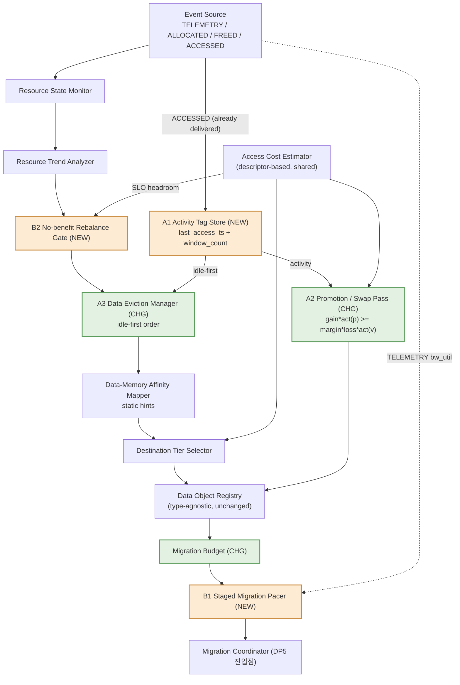

# DP1 C1 QA1 보완 구조 설계 (C1 + Activity Gate + Paced Migration)

> 이 문서는 새 설계 제안이다. 기존 결과/코드/문서는 수정하지 않았다. 진단 수치는 위 json에서 직접 계산했고(스크립트는 문서 끝 부록), 제안 컴포넌트의 효과는 전부 **[C] 논증, 미구현**이다. simulation 수치는 [B+C]이며 [A] 실측이 아니다.

## 0. 요약

1. **QA1 격차(통합 21쌍, C1 x1.298 대 C2 x1.422)는 넓게 퍼져 있지 않고 4개 쌍에 모여 있다.** 쌍별 ln(C2/C1)의 합을 100%로 두면 B200 `dyn_kv_hotset_recency_shift` 44.4%, `dyn_idle_kv_holds_hbm` 33.6%, `dyn_kv_rotating_hotset` 18.5%(세 개 합 96.5%), H100 `rag_1tib_b16` 14.9%이고, C1이 앞서는 3쌍(host path 경합 2, chat wave 1)이 -13.6%, 나머지 14쌍은 합쳐 약 +2.2%다(111.4 - 13.6 + 2.2 = 100).
2. **원인은 "같은 data class 안의 hot/cold를 가를 신호가 없다"는 하나로 수렴한다.** 세 KV 쌍에서 C1은 5 seed 중 10/15 실행이 Baseline과 goodput이 완전히 같다(이동 자체가 일어나지 않음). 같은 class, 같은 크기 객체끼리는 static 승격 gain이 victim loss와 같아 `gain >= 2.0 x loss`(AFFINITY_MARGIN)를 통과하지 못하기 때문이다.
3. **TTFT P99 꼬리(C1 악화 6쌍, 최악 x4.32)는 QA1 격차의 원인이 아니라 QA2/QA3 쪽 문제다.** 다만 같은 migration budget의 "한 번에 admit" 구조가 QA1과 얽혀 있어(burst 용량 1.0 s에서 C1 QA1 x1.206, 0.5 s에서 x1.000) 큰 객체를 나눠 보내는 pacing이 별도 보완 축이 된다.
4. **제안 구조**: (A) 새 `Activity Tag Store`(객체당 last-access 시각과 한 window의 접근 횟수만, 이력/예측/type 없음)를 만들어 승격/교환 판정(`gain x activity` 비교)과 eviction 순서(idle 우선)에만 쓴다. (B) `no-benefit rebalance gate`와 `Staged Migration Pacer`로 이득 없는 이동과 한 tick 몰림을 막는다. A는 QA1 격차의 96.5%를 차지하는 진단에, B는 꼬리와 큰 객체 admission 진단에 대응한다.
5. **한계**: 격차가 집중된 3개 KV 쌍은 B200에서만 비교 가능하고(H100은 Baseline이 SLO 불가) 시나리오가 hot/cold 대비를 10~30배로 심어 둔 설계라서, 이 쌍들에서 얻는 이득은 일반 이득의 상한에 가깝다. A1은 per-object 관측이므로 C1의 "per-object behavior를 추적하지 않는다"는 원칙에서 한 걸음 물러나는 것이며, 어디까지가 C1인지는 6.2의 fence(경계 규칙)로 고정한다. C2의 QA1을 넘는 것은 목표가 아니다.

---

## 1. 진단 (데이터에서 읽은 값)

표기: x = 후보 ÷ Baseline(goodput). 모든 값 [B+C]. "쌍" = (시나리오, 시스템). 통합 comparison-valid 21쌍(H100 9, B200 12), 5 seed(11/23/37/53/71), load x0.5~2.0.

### 1.1 QA1 격차가 어디에 있나

통합 geomean: C1 x1.298, C2 x1.422 (결과 문서 §4.1, ln 격차 합 1.923 = 0.0916 x 21쌍). 아래는 `SYS-*/qa_result.json`의 `per_scenario[*][후보].max_goodput_tps`로 쌍별 ln(C2/C1)을 계산한 값이다.

| 쌍 | Baseline (tok/s) | C1 (x) | C2 (x) | 격차 기여(ln 합 대비) | 비고 |
|---|---:|---:|---:|---:|---|
| B200 `dyn_kv_hotset_recency_shift` | 109 | 1.11 | 2.62 | **+44.4%** | 같은 class(KV) 안에서 hot 대상이 이동 |
| B200 `dyn_idle_kv_holds_hbm` | 46 | 1.48 | 2.82 | **+33.6%** | idle KV가 HBM 점유 |
| B200 `dyn_kv_rotating_hotset` | 167 | 1.19 | 1.70 | **+18.5%** | 3개 그룹이 60 s 주기로 교대 |
| H100 `rag_1tib_b16` | 147 | 1.06 | 1.41 | **+14.9%** | 1 TiB 인덱스, 지역성 변화 (B200은 포화 쌍) |
| 위 4쌍 합 | | | | 111.4% | |
| H100 `dyn_host_path_contention_kv` | 194 | 1.63 | 1.39 | -8.2% | C1이 앞섬 |
| B200 `dyn_cold_resident_chat_wave` | 107 | 1.83 | 1.70 | -3.8% | C1이 앞섬 |
| B200 `dyn_host_path_contention_kv` | 245 | 1.37 | 1.33 | -1.6% | C1이 앞섬 |
| 나머지 14쌍 | | | | 약 +2.2% | 대부분 x1.00 (두 후보 동일), behavior_flip H100 x1.10 동일, `dyn_rag_shard` 2쌍은 C1 ≈ C2 (x6.58/6.76, x3.96/3.97) |

(출처: `SYS-H100/qa_result.json`, `SYS-B200/qa_result.json`. 부호를 포함한 합: 111.4 - 13.6 + 2.2 = 100.)

읽는 법:
- 격차는 **Dynamic 중 KV-only 3쌍**과 **RAG 1쌍**이라는 "같은 class 내 object별 hot/cold" 시나리오에 있다. 나머지에서는 C1이 같거나 앞선다.
- `dyn_rag_shard_hotset_shift`(H100 C1 x6.58 대 C2 x6.76, B200 x3.96 대 x3.97)에서는 C1이 C2와 같다. loop-log iteration 3 판정이 말하듯 DRAM shard 전부가 static 추정상 SLO 위반이라 "위반 객체를 승격"하는 규칙이 우연히 맞아떨어진 것이다. 즉 C1의 이 승리는 behavior 구분 능력의 증거가 아니다.
- `rag_1tib_b16` 쌍은 C1 156.2 ± 55.3, C2 207.9 ± 27.1, Baseline 147.3 ± 51.9 tok/s(95% CI, H100)라 개별 쌍으로는 CI가 겹친다. 이 쌍의 기여는 방향 근거이지 유의한 격차가 아니다.
- 이 21쌍에서 H100의 KV Dynamic 4개는 Baseline이 SLO 불가(I)라 빠져 있다. **같은 class KV에 대한 증거는 B200 한 시스템뿐이다.**

### 1.2 같은 class KV 쌍에서 C1이 움직이지 않는다

`results/data/SYS-B200/qa_result.json`, `dp1_dynamic_benchmark.per_scenario`, 후보별 평균(5 seed):

| 지표 | recency_shift: B / C1 / C2 | idle_kv: B / C1 / C2 | rotating: B / C1 / C2 |
|---|---|---|---|
| goodput (tok/s) | 109 / 122 / 285 | 46 / 68 / 130 | 167 / 199 / 284 |
| SLO 만족률 | 0.31 / 0.34 / 0.80 | 0.29 / 0.43 / 0.82 | 0.38 / 0.45 / 0.64 |
| migration 횟수 (run당) | 0 / **0.8** / 26.6 | 0 / **1.2** / 30.4 | 0 / **1.6** / 20.6 |
| 이 중 promotion | 0 / 0.2 / 13.6 | 0 / 0.4 / 15.4 | 0 / 0.6 / 10.2 |
| migration GiB | 0 / 70 / 2,210 | 0 / 106 / 2,568 | 0 / 153 / 1,807 |
| 링크 점유(migration 시간/horizon) | 0 / 0.008 / 0.150 | 0 / 0.012 / 0.176 | 0 / 0.017 / 0.129 |
| HBM 사용량 (GiB) | 445 / 418 / 552 | 486 / 478 / 522 | 322 / 297 / 397 |

- `seeds_goodput` 비교: C1이 같은 seed의 Baseline과 값이 **완전히 같은** 경우가 recency_shift 4/5, idle_kv 3/5, rotating 3/5, 합 **10/15**다(C2는 15/15가 Baseline과 다름). 즉 C1의 평균 x1.11~1.48은 "일부 seed에서 이동이 1회 일어난 것"이고, 이것이 loop-log에서 CI 안(tie)으로 판정된 이유다.
- **왜 이동이 안 일어나는가 (코드 근거)**: `_promotion_pass`는 `gain < AFFINITY_MARGIN * loss`이면 swap을 건너뛴다(policies.py 약 574행). 같은 class, 같은 hint(op=attention, ctx, concurrency)이면 DRAM에서 HBM으로 올릴 때의 static 이득(gain)과 HBM victim을 내릴 때의 static 손실(loss)이 크기 차이 정도로만 다르다. 이득이 2배를 넘는 경우는 객체 크기 jitter가 우연히 만들 때뿐이다(이 해석은 코드와 loop-log iteration 3의 설명 "같은 class끼리는 static 신호가 구분되지 않아 교환이 일어나지 않는다"에서 온 추론이며, seed별 경로를 직접 추적한 것은 아니다).
- victim 순서도 접근과 무관하다: `DataEvictionManager.candidates`의 key는 `size x (1 + min(residency_age/60, 1))`로, 마지막 접근 시각이 아니라 "마지막으로 이동된 뒤 경과 시간"이다(약 252~254행). 설계 문서 §8.8은 Migration Data Selector 입력에 "basic age/LRU"를 적었으나 구현은 residency age다.
- C1은 ACCESSED event를 이미 받지만 버린다(`on_event`에서 TELEMETRY가 아니면 `return [], 0.2`, 약 384행). 시뮬레이터는 모든 policy에 ACCESSED를 전달한다(simulator.py 약 543~557행).
- C2의 이 쌍들에서의 우위는 **예측이 아니라 관측**으로 설명된다: C2의 `DataBehaviorMonitor`는 접근 횟수 EWMA(alpha 0.2)와 재사용 간격 EWMA이고 `expected_rate`는 관측 rate와 class prior의 혼합이다(약 613~711행). 시나리오가 step 변화(t=90 s 또는 60 s 주기)라 관측 신호가 곧바로 쓰인다. 이것이 "경량 관측 신호로 격차 상당 부분을 설명할 수 있을 것"이라는 [C] 가설의 근거다.
- 시나리오 속성(scenarios.py): KV object 기본 접근률 0.35/s, hot x3 또는 x1.0, cold x0.1 또는 x0.05. 한 object당 8 s window 기대 접근 횟수는 hot 약 2.8~8.4, cold 약 0.14~0.28이다([C], Poisson 가정 계산). 즉 window 한 개로 구분되는 크기이나, hot이 8 s 동안 0회일 확률도 hot=2.8일 때 약 6%라 noise가 있다.

### 1.3 C1이 이기는/같은 곳 (C1의 정체성 근거)

- B200 `dyn_cold_resident_chat_wave` C1 x1.83(5.4회, 401 GiB) 대 C2 x1.70(66.4회, 3,224 GiB). H100 `dyn_host_path_contention_kv` C1 x1.63(5.8회) 대 C2 x1.39(64.4회). 이 쌍들은 resource 상태나 static 신호(class가 다른 객체의 SLO 위반)만으로 충분하다.
- 통합 diagnostic(결과 문서 0.2, 4.3): migration 138 GiB 대 1,339 GiB(약 10배 적음), 링크 점유 1.6% 대 10.5%, 결정 연산 3 ms 대 111 ms/run, QA3 HBM x0.97 대 x1.21, QA4 module 1.75 대 2.50. **보완은 이 값들을 훼손하지 않아야 한다.** 이 값들이 C1을 선택한 이유다.
- 보완이 건드려서는 안 되는 사실: C1의 이득은 C2 이득의 일부를 약 1/10의 byte로 얻는 구조다(loop-log iteration 3 판정).

### 1.4 TTFT P99 꼬리와 admission (QA2, 그리고 QA1과의 연결)

출처: 결과 문서 §4.8, loop-log iteration 4, `results/data/burst/summary.json`, 위 json.

| 항목 | 값 |
|---|---|
| 통합 TTFT P99 (geomean, Baseline 1,084 ms) | C1 1,128 ms (x1.04), C2 785 ms (x0.72) |
| P99가 Baseline보다 나쁜 쌍 (>1.02) | C1 6쌍, C2 5쌍. C1 최악 H100 `cb_mixed_8k_b32` x4.32, `cb_kv_8k_b32` H100 x4.15 / B200 x3.88, `cb_kv_8k_b32_ramp` H100 x3.76 |
| 같은 Common 쌍의 QA1 | C1 x0.994~0.996 (CI 안), C2 x1.00. Baseline SLO 만족률 1.00이라 이득 여지 0 |
| 같은 쌍에서 C1의 이동 | run당 16.8~20.8회, 231~284 GiB (C2는 142~316 GiB, 대신 P99 x1.14~1.23) |
| 같은 쌍의 TTFT P50 | C1 x0.32~0.67 (개선) |
| 진단(loop-log it.4, `cb_kv_8k_b32` H100 seed 11 한 시나리오) | 꼬리 접근은 이동된 객체가 아니라 DRAM에 남은 KV의 첫 응답(2.3~2.8 s). C1의 15 GiB급 이동 19건이 초반 20%에 몰려 DRAM serving 대역폭 배율이 최저 0.10 |
| BURST_CAP_S sweep (C1 QA1 / 악화 쌍) | 2.0 s: x1.298 / 6, 1.0 s: x1.206 / 6, 0.5 s: x1.000 / 3, 0.25 s: x1.000 / 0 (C2: x1.422, 1.207, 1.017, 1.000) |

해석 (데이터 범위 안에서):
- 이 꼬리는 **QA1 격차의 원인이 아니다.** 해당 Common 쌍에서 QA1은 이미 x1.00이라 QA1은 잃을 것이 없다. 비용은 QA2에 나타난다(Common set QA2 C1 ★ x0.94 대 C2 ★★ x1.22, 결과 문서 §4.1 set별 표).
- 그러나 **QA1과 같은 메커니즘으로 묶여 있다.** `MigrationBudget`은 "전송 시간이 bucket 용량보다 큰 단일 이동은 admit하지 않는다"(policies.py `MigrationBudget` docstring). Dynamic KV는 약 107 GiB 객체를 64 GB/s host link로 옮기며 1.3~2.1 s가 걸린다(scenarios.py `dynamic_benchmark` docstring). 용량을 1.0 s 이하로 줄이면 이 이동이 거부될 수 있고 실제로 QA1이 같이 사라진다(위 sweep). 즉 지금 구조에서는 "꼬리를 줄이는 것"과 "큰 객체 승격"을 한 상수로 동시에 얻지 못한다(loop-log iteration 4 판단과 같다).
- 이동량이 늘면 이 문제가 악화된다. **A를 넣는 순간 B(pacing)가 필요해지는 이유**다.
- 한계: 링크 간섭은 평균장 근사(서빙 대역폭 배율)라 꼬리가 과대일 수 있다(M-class 후보로 loop-log에 남아 있음). 꼬리의 원인은 `cb_kv_8k_b32` 한 시나리오 진단에서만 확인됐고 다른 5쌍의 원인은 분해되지 않았다.

### 1.5 진단 요약

| ID | 진단 (측정 근거) | 영향 QA |
|---|---|---|
| D1 | 같은 class KV 3쌍이 QA1 격차의 96.5%. C1은 10/15 seed-run에서 Baseline과 동일(이동 없음) | QA1 |
| D2 | 승격 판정이 static 신호만 쓰고(gain == loss) 접근 신호가 없음. eviction key도 residency age | QA1 |
| D3 | 1 TiB RAG(H100)에서 C1 x1.06 대 C2 x1.41, 이동 1회(97 GiB) 대 18회(1,617 GiB). CI 겹침 | QA1 |
| D4 | Common 4쌍에서 C1이 이득 없이 231~284 GiB를 이동하고 TTFT P99가 x3.76~4.32 | QA2 (QA1은 x0.99~1.00) |
| D5 | 단일 이동이 bucket 용량을 넘으면 admit 불가. 용량 상수 하나로 꼬리와 QA1을 동시에 못 얻음 | QA2 <-> QA1 |
| D6 | C2의 링크 점유는 세 KV 쌍에서 0.13~0.18로 LINK_SHARE 0.25 안이다. 즉 이 쌍들의 이득은 현재 budget 안에서 달성된다 | QA1 (budget이 병목이 아님) |
| D7 | C2는 이 쌍들에서 HBM을 Baseline보다 늘린다(552 대 445, 522 대 486, 397 대 322 GiB). C1은 줄인다 | QA3 (격차를 좁히면 HBM 사용이 늘 수 있음) |

---

## 2. 설계 목표와 제약

- **목표**: D1~D3을 겨냥한 QA1 격차 축소. D4/D5는 A를 안전하게 쓰기 위한 전제와 QA2 보완.
- **유지**: (i) resource-state-driven trigger(압박/SLO 위반 신호가 migration을 일으킨다), (ii) Data-Memory Affinity(static hint, descriptor 기반 비용 추정), (iii) type-agnostic Registry, (iv) 낮은 이동 byte와 decision overhead, (v) Memory Backend I/F 변경 없음(append-only 필드만).
- **하지 않음**: C2의 Behavior Monitor/Trend/Predictor 도입, class prior, 재사용 간격 예측, type 선호 목록, 모든 객체를 매 tick 스캔하는 구조.

## 3. 제안 구조

### 3.1 블록 다이어그램

범례: `[ ]` 기존 블록, `[*NEW*]` 신규, `[~CHG~]` 변경.

```text
 Serving runtime / Event Source ──────────────────────────────────────────┐
   │ TELEMETRY (capacity/BW/load)           │ ALLOCATED/FREED/ACCESSED    │ (ACCESSED: 기존 event, 현재 C1은 무시)
   v                                        v                             v
 [Resource State Monitor] ─> [Resource Trend Analyzer]      [*A1 Activity Tag Store*]
        │ pressure sources                      │             last_access_ts, window_count
        │                                       │              (side-car, Registry 밖, type 없음)
        v                                       │                  │ activity(obj)
 [*B2 No-benefit Rebalance Gate*] <── est. SLO headroom ──┐        │
        │ (이득 없는 rebalance 보류)                      │        │
        v                                                 │        │
 [~A3 Data Eviction Manager~] <──────── idle-first ───────┼────────┤
        │ victim candidates                               │        │
        v                                                 │        │
 [Data-Memory Affinity Mapper (static hints)]             │        │
        │ hints(op, shape, sensitivity)                   │        │
        v                                                 │        │
 [Destination Tier Selector] <── [Access Cost Estimator] ─┘        │
        │ (descriptor 기반, SLO filter, do-no-harm)                 │
        │                                                           v
        │                       [~A2 Promotion / Swap Pass~]  gain x activity(promotee)
        │                         (static SLO 위반 + 활성 객체만)    >= margin x loss x activity(victim)
        v                                │
 [Data Object Registry] (location/size/tier, type-agnostic, 변경 없음)
        │
        v   MigrationDecision list
 [~Migration Budget~] ──> [*B1 Staged Migration Pacer*]  chunk/tick, serving-aware throttle
                                  │ (copy-then-switch, 1 in-flight per link)
                                  v
                          [Migration Coordinator (DP5 진입점)]
```



### 3.2 데이터 흐름 (한 decision cycle)

1. 매 tick TELEMETRY가 Resource State Monitor/Trend Analyzer로 들어가 pressure source tier를 만든다(기존).
2. **A1**은 같은 tick의 ACCESSED event(기존 event, C1이 현재 버리는 것)로 객체별 `last_access_ts`와 window(= 기존 `COOLDOWN_S` 8 s) 접근 횟수만 갱신한다. 반환: `activity(obj)`.
3. **B2**: pressure source가 capacity 부족이 아니고(occupancy가 target 이하) 그 tier의 어떤 resident도 static 추정으로 SLO를 위반하지 않으면(Access Cost Estimator 입력) rebalance를 보류한다.
4. **A3**: 필요한 만큼 비우기 위해 victim을 고를 때 idle(window_count 0)을 먼저, 그 안에서는 기존 key(size x residency age).
5. 기존 Destination Tier Selector가 target을 정한다(변경 없음: SLO filter, do-no-harm, affinity score).
6. **A2**: 승격 후보(static 추정으로 현재 tier에서 SLO 위반, HBM에서는 만족)가 **활성**(window_count >= 1)일 때만 후보가 된다. swap은 `gain x (n_p + 1) >= AFFINITY_MARGIN x loss x (n_v + 1)`일 때만 실행한다(n = window 접근 횟수, +1은 Laplace 평활. 새 임계 상수 없음, 기존 margin과 window 재사용).
7. **B1**: Budget이 허용한 MigrationDecision을 한 tick에 몰아 보내지 않고 tick마다 `min(남은 전송 시간, share_t)`만 진행한다. `share_t = min(LINK_SHARE, 1 - bw_util(src/dst))`(기존 telemetry 값). 객체는 전송이 끝날 때까지 source에서 서빙(copy-then-switch), 링크당 in-flight 1개(기존 "swap 한 번에 하나" 규칙의 일반화).

## 4. 컴포넌트 표

방향: ↑ 개선 기대, ↓ 악화 위험, ≈ 중립, ? 불확실. 전부 **[C] 논증, 미구현**(근거 진단 D1~D7은 측정 [B+C]). 수치 이득은 주장하지 않는다.

| ID | 컴포넌트 | 입력 -> 출력 | 겨냥 진단 | QA1 | QA2 | QA3 | QA4 / 비용 | 리스크 / trade-off | 검증 실험 |
|---|---|---|---|---|---|---|---|---|---|
| A1 | **Activity Tag Store** (신규, Registry 밖 side-car) | ACCESSED event -> `(last_access_ts, window_count)`; `activity(obj)` | D1, D2, D3 | ↑ (핵심) | ↑? (TTFT P50: 활성 객체가 HBM에 있게 됨) | ≈ | 신규 module 1(C1 로컬). event/Backend I/F/Registry 불변 [C] | **C2 쪽으로 drift**. fence(6.2) 필수. 낮은 접근률에서 Poisson noise(hot 2.8회/window일 때 0회 확률 약 6%) | Exp-1 |
| A2 | **Activity-aware Promotion/Swap** (변경: `_promotion_pass`) | 후보 + activity + 기존 static gain/loss -> promotion/swap 결정 | D1, D2, D3 | ↑ | ↑? | ≈ 또는 ↓ (swap은 HBM 중립, 직접 승격은 watermark 0.82까지 HBM 사용 증가 가능, D7) | C1 로컬 변경 1 module | 새 신호가 "새 trigger"가 되면 C2화. 여기서는 기존 trigger(static SLO 위반)를 **좁히기만** 하고 swap 판정 가중으로만 쓴다. rotating에서 thrash 위험(기존 cooldown 8 s, margin 2.0이 방어선) | Exp-1 (rotating, fast-rotation 대조) |
| A3 | **Idle-first Eviction** (변경: `DataEvictionManager.candidates`) | activity -> victim 정렬 | D2 | ≈ | ≈ | ↑ (cold가 HBM을 먼저 떠남) | C1 로컬 | idle 우선이면 작은 객체를 여러 개 고르는 경향이 생겨 이동 횟수가 늘 수 있음(횟수/byte 모니터링) | Exp-1 변형 |
| B2 | **No-benefit Rebalance Gate** (신규 gate) | pressure source + estimator의 SLO headroom -> rebalance 허용/보류 | D4 | ≈ | ↑ (꼬리 악화 쌍 감소 기대) | ≈ | C1 로컬 gate 1 | `dyn_host_path_contention`의 C1 승리(H100 x1.63, B200 x1.37)는 DRAM link 압박 신호 반응이라 gate가 **그 승리를 막을 수 있다**. 대역폭 충격을 estimator가 보려면 telemetry-corrected cost(설계 5.9.6 closed loop)가 필요 | Exp-2 |
| B1 | **Staged Migration Pacer** (신규; `MigrationBudget` 변경) | MigrationDecision + tick별 share -> chunked 진행/commit | D4, D5 | ↑? (큰 객체가 작은 burst cap에서도 통과) | ↑ (꼬리) | ≈ | **공유 Executor/Scheduler 경계 변경**(C2에도 영향). QA4의 4개 변경 시나리오는 건드리지 않으나 유지보수 표면은 늘어남 | 시뮬레이터 executor가 현재 commit을 즉시 처리하므로(`simulator.py` 약 577~645행) in-flight 모델 추가가 **M-class 변경**이다. 평균장 간섭 모델이 과대일 가능성(it.4 한계)과 섞여 해석이 어렵다 | Exp-3 (M-class, 별도 iteration) |

### 4.1 기각/보류한 후보와 이유

| 후보 | 결정 | 이유 |
|---|---|---|
| per-object EWMA rate, 재사용 간격, class prior, Predictor (C2 구조 이식) | **기각** | C1의 정체성 상실. QA4(module 증가, type-aware), decision overhead(C2는 `38 us x 전체 객체`를 매 tick, C1은 `14 us x decision 수`) 모두 훼손. A1이 필요한 만큼만 쓰는 이유 |
| 승격에 C2식 benefit-vs-cost gating(`rate x horizon x gain > exposure x xfer`) | **보류 (A4, 1차 효과 부족 시에만)** | 관측 rate를 비용 식에 넣는 순간 C2의 expected_rate 경로와 같아진다. A2의 가중 비교로 부족하다는 증거(Exp-1 후)가 있을 때만 검토 |
| LINK_SHARE/BURST_CAP 상수 상향 | **기각** | 정책 상수 tuning 금지(SKILL §5), 꼬리와 이득이 같은 메커니즘이라 상수 하나로 해결 안 됨(it.4) |
| descriptor 기반 hint 자동 도출(기존 T4) | **이 범위에서 제외, 별도 유지** | QA1 격차를 설명하는 진단이 없다. 신규 memory와 QA4/안정성 문제이며 `dyn_rag_shard`의 우연한 승리가 static 추정 정확도에 의존한다는 위험(§1.1)과는 연결되나 QA1 보완은 아님 |
| hysteresis 상수 추가(예: swap-back 금지 시간) | **기각 (기존으로 충분한지 먼저 확인)** | 기존 cooldown 8 s와 AFFINITY_MARGIN 2.0이 있고 새 상수는 tuning으로 보인다. Exp-1의 fast-rotation 대조에서 thrash가 확인되면 그때 pre-registration으로 추가 |
| Agent-aware KV 관리 구조 | **범위 밖** | 설계 문서 §10이 DP1 C1 밖의 별도 구조로 두었다 |

## 5. 신호의 출처: 관측 vs runtime hint (A1의 두 변형)

- **A1-observe**: C1이 ACCESSED event를 직접 센다(위 설계). 구현 쉬움. "per-object behavior 추적"의 가장 약한 형태.
- **A1-hint**: serving runtime(예: scheduler가 running/waiting/finished 시퀀스를 안다)이 `active/idle`을 hint 채널(Affinity Mapper의 입력)로 push한다. C1은 관측하지 않고 hint만 읽으므로 "static + hint" 원칙에 더 가깝다. 단 vLLM 쪽 변경이 필요하고 tool-call 대기 같은 신호는 runtime이 알아야 한다.
- **시뮬레이터로는 둘을 구분할 수 없다.** 같은 ACCESSED 기반 신호이기 때문이다. 이 선택은 정체성/통합 비용 판단이며 simulation으로 검증되지 않는다. 문서의 효과 논의는 두 변형에 공통이다.

## 6. 정체성 fence와 trade-off

### 6.1 C1 / C1+ / C2 비교

| 항목 | C1 (현재) | C1+ (제안) | C2 |
|---|---|---|---|
| 객체별 상태 | placement(위치/크기/tier) | + `last_access_ts`, `window_count` (side-car) | + rate EWMA, 재사용 간격 EWMA, first_seen, class prior |
| 이력/예측 | 없음 | 없음 (현재 window만) | EWMA 이력 + predictor |
| type 인식 | decision에서 없음 (hint 채널만) | 없음 | Registry와 Destination Selector가 type 사용 |
| 새 migration trigger | 압박 + static SLO 위반 | **동일** (activity는 gate/가중으로만) | 객체별 predicted score |
| 매 tick 처리 범위 | pressure tier의 candidate | candidate (counter는 event당 O(1)) | **전체 객체** |
| decision 연산 (측정) | 3 ms/run | [C] 같은 order 예상. Exp에서 측정 | 111 ms/run |
| 이동량 (측정) | 138 GiB | [C] 증가 예상. C2(1,339 GiB)보다 쌍마다 작아야 한다는 guard를 둔다 | 1,339 GiB |

### 6.2 fence (이 선을 넘으면 "C1+가 아니라 C2")

1. 객체당 상태는 `last_access_ts`와 단일 window의 `window_count`뿐이다. EWMA, 이력 배열, 재사용 간격을 두지 않는다.
2. activity는 **새 migration trigger가 되지 않는다.** 이동은 기존 trigger(자원 압박, static SLO 위반)에서만 시작하고 activity는 후보를 거르고 가중하고 정렬한다.
3. type 이름, class prior, 미래 hotness 예측을 쓰지 않는다. 신호는 가산/비교에만 쓰고 점수화하지 않는다.
4. 새 정책 상수를 만들지 않는다(window는 `COOLDOWN_S`, 비교는 `AFFINITY_MARGIN`, share는 `LINK_SHARE` 재사용). 상수가 필요해지면 pre-registration으로 추가하고 sensitivity를 보고한다.
5. Registry는 type-agnostic placement 장부로 유지한다(A1은 side-car, Affinity Mapper와 같은 위치).

### 6.3 QA별 trade-off (방향만, 수치 주장 없음)

- **QA1 ↑ (A1/A2), ↑? (B1)**. QA1 별 경계(1.30)는 결과를 본 뒤 정한 값이고 C1은 x1.298로 0.002 아래라, **작은 개선으로도 별이 뒤집힐 수 있으나 그 자체는 의미 있는 성과가 아니다**(결과 문서 §0.3, §4.1b). 성과는 값으로 보고한다.
- **QA2 ↑ (B2, B1, A1의 P50)**. C1 TTFT P99 x1.04 대 C2 x0.72의 차이는 A보다 B 쪽 보완이다.
- **QA3 ≈ 또는 ↓**. 격차가 큰 쌍에서 C2는 HBM을 늘렸다(D7). C1+가 승격으로 HBM에 hot를 더 두면 QA3 이점(x0.97)이 줄 수 있다. QA3 ★★ 하한(절감 배수 0.95, HBM 비율 약 x1.053 이하)을 guard로 둔다.
- **QA4 ≈ 또는 ↓**. A1은 memory/data class와 무관하므로 S1(신규 memory), S2(신규 data class), S4(신규 event)는 module 수가 그대로일 것으로 예상한다([C]). S3(정책 교체)는 1 module 늘 수 있고 그래도 평균 M1은 ≤ 2.0으로 ★★★ 경계(≤ 2) 안일 것으로 예상하나 실제 측정이 필요하다. B1은 공유 경계를 건드려 C2에도 영향을 주므로 QA4의 4개 시나리오 밖에 유지보수 비용이 생긴다.
- **결정 연산 / 링크 점유 ↓**. A1은 event마다 counter만 갱신해 C1의 기존 per-event 비용 모델(0.2 us)과 같은 order로 예상하나 **실측 전에는 단정하지 않는다**.
- **drift 위험**: C1+가 C2 쪽으로 밀리는지를 6.1 표의 측정 항목(이동 byte, decision 연산, 쌍별 C1+ < C2 byte)으로 상시 점검한다.

## 7. 검증 계획 (기존 시뮬레이터 ablation/loop 절차)

원칙: SKILL §5/§9 그대로. **실행 전에** 가설·반증 조건·guard를 loop-log에 사전 등록(이 문서는 등록이 아니다). 구현은 기존 `DP1_C1_AFFINITY`와 같은 방식의 env 변형(제안명: `DP1_C1_ACTIVITY=off|promo|promo_evict`, `DP1_C1_GATE=off|on`, `DP1_C1_PACE=off|on`)으로 두고, **`off` 대조군은 본 결과와 정확히 일치**해야 한다. 일치하지 않으면 결과를 쓰지 않는다.

### 7.1 공통 절차

- 전체 benchmark(Common + Stress + Dynamic) x SYS-H100/B200 x seed 11/23/37/53/71 x load x0.5/1.0/1.5/2.0. 실패 시나리오만 재실행 금지.
- 명령(기존): `cd doc-mk/Evaluation/DP1/sim && python3 test_sim.py && python3 loop_run.py --final --tag ablation/<variant> && python3 merge_systems.py --tag ablation/<variant> SYS-H100 SYS-B200 && python3 dp1_rating.py <qa_result.json>`; 꼬리는 `burst_summary.py`, 오차는 `epsilon_sweep.py`(정책 상수 재조정 금지, 접근 비용 추정기에 의존하므로 보고).
- 보고 항목: QA1(ratio ± CI)와 **C2/C1 직접 비교(§4.1c 형식)**, 쌍별 표, win/tie/loss, TTFT/TPOT P50/P99와 P99 악화 쌍 수/최악 쌍, migration 횟수·GiB·링크 점유, HBM GiB(QA3), decision overhead, 공통 별점 병기. 별 경계 sensitivity를 병기하고 별 변화를 성과로 쓰지 않는다(H11, H16).
- 이전 iteration/결과는 덮어쓰지 않는다(H9). 시뮬레이터 모델을 바꾸는 B1은 H22에 따라 수정 전 결과를 `results/data/pre_<이름>/`에 보존하고 사유를 `qa-criteria-dp1.md`에 기록한다.

### 7.2 실험

| 실험 | 변경 | class | 가설 / 반증 조건 (사전 등록 시 확정) | guard (이탈 시 불채택) |
|---|---|---|---|---|
| Exp-1 | A1+A2 (+A3 변형을 별도 variant로) | P | H-A: B200 세 KV 쌍에서 C1+의 이동 횟수가 증가하고 최소 1쌍이 Baseline 대비 유의한 win(CI)이 된다. **반증**: 세 쌍 모두 여전히 tie이고 seed-run 동일 비율이 10/15 근처 -> 구조적 한계(8.1)로 기록. H-B: rotating 대조에서 이동 횟수가 폭증하지 않는다 | loss 0 유지, Common/Stress QA1 비회귀, QA3 HBM 비율 <= x1.05(★★ 유지), 쌍별 C1+ migration GiB < C2, decision overhead를 C1/C2 값과 함께 보고(정체성 점검) |
| Exp-2 | B2 gate | P | H-C: 꼬리 악화 Common 4쌍의 P99 배율이 줄고 QA1은 x0.99~1.00 유지. **반증**: `dyn_host_path_contention_kv` win이 사라지면 gate 불채택 | host path win 유지, P99 악화 쌍 수 비증가 |
| Exp-3 | B1 pacer (executor in-flight 모델 추가) | **M** (별도 iteration, P와 섞지 않음) | H-D: 같은 이동량에서 serving 대역폭 배율 최저값이 올라가고(진단은 `diagnose.py`) BURST_CAP 1.0 s에서의 QA1 저하(x1.206)가 줄어든다. **반증**: 배율/꼬리가 그대로이면 pacing 효과 없음 | C2에도 같은 executor를 적용해 공정 비교(C2 결과도 함께 재생성) |

실행 순서는 Exp-1 -> Exp-2 -> Exp-3(QA1 격차에 직접 대응하는 것부터). **iteration 한도**: loop-log 기준 iteration 4까지 사용했고 최대 6이라 P-class 2개 여유만 남는다(집계 방식에 따라 다를 수 있어 소유자 확인 필요). 이 보완은 Baseline 미만 회귀가 아니라 후보 개선이므로 6 iteration cap 안에서 돌릴지 별도 "complement evaluation"으로 돌릴지는 소유자 결정이며, 어느 쪽이든 사전 등록/전체 재실행/지는 쌍 공개 규칙을 지킨다.

### 7.3 추가 시나리오 (B-class, 기존 시나리오와 결과 유지)

현재 Dynamic KV 3개는 8~9개 객체, hot/cold 대비 10~30배를 시나리오가 심었다(loop-log iteration 2: 실패 모드를 알고 설계). 이 쌍들만으로 A를 판정하면 상한에 가까운 결과만 얻는다. 아래를 Baseline-only로 feasibility를 확인한 뒤(후보 실행 전에 고정) 추가한다.

| 시나리오 (제안명) | 목적 | 기대 관측 |
|---|---|---|
| `kv_uniform_hotness_ctrl` | negative control: 모든 KV 접근률 동일 | C1+ == C1 == Baseline 근처. 이동 횟수가 늘면 do-no-harm 위반 |
| `kv_zipf_hotset_drift` | 객체 수십 개, 점진적 rate 분포와 drift (심은 2-class 대비가 아님) | A의 일반화 여부. 이득이 Dynamic 3쌍에만 있으면 그렇게 보고 |
| `kv_fast_rotation` | 회전 주기를 cooldown의 수 배로 짧게 | thrash 점검 (기존 margin/cooldown으로 충분한지) |
| H100 크기의 KV Dynamic 변형 | H100에서 Baseline이 feasible한 크기 | 같은 class 증거를 H100에도 확보 (현재 B200만) |

## 8. 한계 (솔직하게)

### 8.1 구조적으로 남는 격차

- **격차의 상당 부분은 "per-object 관측이 없다"는 C1의 구조에서 온다.** A1은 그 관측을 최소 형태로 되돌리는 것이므로 격차를 줄인다면 그만큼 C1의 원칙을 양보한 것이다. 양보 없이 얻을 수 있는 부분은 B(이득 없는 이동 제거, pacing)뿐이고 그것은 QA2 쪽이다. QA1 격차 대부분은 A와 정체성 양보 없이는 닫히지 않는다.
- A1은 **지연된 신호**다. 관측 window(8 s) + cooldown(8 s)만큼 늦게 반응한다. C2의 EWMA도 지연되지만 class prior로 초기 판단을 보완한다. 시뮬레이터의 step 변화 시나리오에서는 둘의 차이가 작게 나타날 가능성이 있으나 실제 workload에서는 모른다.
- C2의 이득 일부는 **HBM을 더 쓰고 이동을 많이 해서** 얻는다(D7, D6). C1+가 같은 일을 하면 QA3와 이동량 이점이 그만큼 줄어든다. 즉 QA1을 올리는 만큼 QA3를 내놓는 교환이다.

### 8.2 얼마나 닫을 수 있나 (회계식, 예측이 아님)

실제 닫히는 비율은 Exp-1 전에는 알 수 없다. 아래는 쌍별 ln 격차로 계산한 **산술적 교환율**일 뿐이다(세 B200 KV 쌍의 ln 격차 합 1.855, 21쌍 평균 0.0883).

| 세 KV 쌍에서 C1이 C2와의 격차를 닫는 비율 f | 통합 C1 QA1 (다른 18쌍 불변 가정) |
|---:|---:|
| 0 (현재) | x1.298 |
| 0.25 | x1.327 |
| 0.5 | x1.357 |
| 1.0 (C2와 같아짐) | x1.418 (C2 x1.422) |

- 상한 논의: 세 쌍만으로 격차의 96.5%가 설명되므로 산술상 **이 세 쌍이 "닫을 수 있는" 거의 전부**다. 그러나 이 세 쌍은 (i) B200에서만 존재, (ii) 심은 대비, (iii) 객체 8~9개, (iv) 5 seed라 실제 f는 이보다 작을 가능성이 높고 `rag_1tib_b16`은 CI가 겹친다.
- 나머지 17쌍은 현재 C1과 C2의 격차가 합쳐 음수(C1이 앞섬, 3쌍 -13.6%)이거나 약 +2.2%다. 여기서는 C1+가 얻을 것이 없고 **잃지 않는 것**이 목표다(Common 4쌍 x0.994~0.996은 CI 안).
- 보완이 닫지 못하는 것: step 변화 이후의 선제 승격(예측), 객체 수가 많은 환경에서의 정교한 선별(Exp-1의 zipf 시나리오에서 확인할 부분), C2가 HBM을 더 쓰는 만큼의 이득.

### 8.3 증거와 정의의 한계

- 전부 [B+C] simulation, 보완 효과는 [C]. 접근 비용 추정기는 시뮬레이터와 같은 식이라 오차 0(결과 문서 §6 2번)이고, A2/B2는 이 추정기를 쓰므로 이득이 상한에 가깝다. epsilon sweep(H17)으로 e=0/0.2/0.4/0.6을 보고한다.
- C1 QA1 x1.298의 95% CI(±0.063)는 C2 x1.422(±0.054)와 부분 겹침이며 별 경계 1.30은 결과를 본 뒤 정한 값이다. 이 보완의 평가를 "별이 바뀌었나"로 하지 않는다.
- QA4는 4개 변경 시나리오의 추정이다(공수·비용은 가정 상수). B1처럼 공유 경계를 건드리는 변경의 비용은 이 시나리오로 드러나지 않는다.
- 한 시나리오 진단(`cb_kv_8k_b32`)에서 일반화한 부분: 꼬리의 원인(D4, D5). B2의 효과 가설도 이 진단에 의존한다.
- 다른 agent가 `policies.py`, `simulator.py`를 수정 중이므로 코드 줄 번호와 구현 세부(MigrationBudget, promotion pass)는 읽은 시점 기준이며, 구현 전에 다시 확인해야 한다.

## 부록 A. 진단 재현 (읽기 전용 스크립트 요지)

```python
# per pair (comparison_valid 만): r1 = C1 goodput / Baseline, r2 = C2 / Baseline
# lngap = ln(r2 / r1); share = lngap / sum(lngap)    # sum = 1.923 (21쌍), mean = 0.0916
# seed 동일성: seeds_goodput[C1][i] == seeds_goodput[Baseline][i]  -> 세 KV 쌍 합 10/15
# 입력: results/data/SYS-{H100,B200}/qa_result.json
#   {common_benchmark,dp1_stress_benchmark,dp1_dynamic_benchmark}.per_scenario[<시나리오>][<후보>]
#   키: max_goodput_tps, goodput_ci95, seeds_goodput, migration_count, migration_gib, migration_link_frac,
#       promotion, demotion, rebalance, ttft_p99_ms, slo_ratio, tier_occ_gib.hbm; fit 라벨 = {set}.fit
```

## 부록 B. 출처 목록

- `doc-mk/Evaluation/DP1/results/2026-10-02_dp1-qa-evaluation.md` §0.1~0.4, §4.1~4.9, §5, §6
- `doc-mk/Evaluation/DP1/results/iterations/loop-log.md` iteration 3(C1 promotion), iteration 4(꼬리, burst sweep), 결론 6(C1/C2 차이)
- `doc-mk/DP1/dp1-ai-data-migration-decision-architecture.md` §6.1, §8.4, §8.6~8.8, §10, §17.2, §24
- `doc-mk/Evaluation/DP1/sim/policies.py` (`DataEvictionManager`, `_promotion_pass`, `MigrationBudget`, `DataBehaviorMonitor`), `simulator.py`(event 전달, executor), `scenarios.py`(dynamic benchmark, BASE_RATE)
- `doc-mk/Evaluation/DP1/results/data/{SYS-H100,SYS-B200}/qa_result.json`, `ablation/{full,none,no_promo}/*`, `burst/summary.json`
- `doc-mk/Evaluation/DP1/qa4-preregistration.md`, `qa4-modifiability.md`
- 기존 택틱 슬라이드 `doc-mk/DP1/DP1-complement-design-tactics.pptx`(`gen_dp_pptx.py: tactics_slide`)의 T1(구현됨), T2(재배치 gating, B2와 대응), T3(경량 접근 신호, A1과 대응), T4(descriptor hint)와의 관계: 이 문서는 T2/T3를 진단 수치와 정체성 fence로 구체화한 것이다.
