# DP1 vLLM 구현 UML 문서 세트

> **목적:** DP1을 vLLM code base에 "구현해야 한다고 가정"했을 때의 구조를 UML(Mermaid)로 고정한다.
> 설계 문서(`dp1-ai-data-migration-decision-architecture.md`)를 반복하지 않고, **어느 vLLM 파일/클래스에 무엇이 붙는가**에 집중한다.
>
> **표기 규약**
> - **new**: 이 repo에 없는 신규 모듈(제안 위치 명시). **modify**: 기존 파일 편집 필요. **reuse**: 편집 없이 import/구성(composition)/등록(register)만으로 사용. **hook/observe/wrap**은 modify 없이 붙는 방식(Observer, Decorator, connector API)을 뜻한다.
> - 경로 옆 `Lnnn`은 **읽은 시점의 대략적 줄 번호**다(다른 agent가 동시에 편집 중일 수 있어 구현 전 재확인 필요).
> - **assumption**: 코드로 확인하지 못한 항목. §6에서만 사용하지 않고 본문에도 `(assumption)`으로 표기한다.
> - 시뮬레이터 클래스명(`C1ResourceDrivenMigration`, `DataEvictionManager`, `MigrationBudget`, ...)은 그대로 쓴다. 시뮬레이터에 없는 타입은 "신규 타입"으로 표시한다.

## 0. 먼저 읽을 핵심 발견 (코드에서 확인된 것)

| # | 발견 | 근거 | DP1에 대한 의미 |
|---|---|---|---|
| F1 | **KV connector API가 가장 얇은 integration surface**다. Scheduler는 `get_num_new_matched_tokens`, `update_state_after_alloc`, `build_connector_meta`, `update_connector_output`, `request_finished`, `take_events`, `get_kv_connector_stats`를 매 step 호출하고, `bind_gpu_block_pool`이 있으면 `BlockPool`을 넘겨준다. | `vllm/v1/core/sched/scheduler.py` L121-139(connector 생성), L241-246(`bind_gpu_block_pool`), L621-641, L769, L947(`_build_kv_connector_meta`), L2094(`_update_from_kv_xfer_finished`) | Phase 1은 `Scheduler`/`EngineCore`를 **수정하지 않고** `DP1Connector(KVConnectorBase_V1)` 하나로 Event 수신, Registry 갱신, MigrationIntent 발행을 모두 할 수 있다. |
| F2 | scheduler↔worker 사이에 **이미 job 기반 transfer protocol**이 있다: `OffloadingConnectorMetadata{load_jobs, store_jobs, jobs_to_flush}` (scheduler→worker, `SchedulerOutput.kv_connector_metadata` 경유), `OffloadingWorkerMetadata.completed_jobs` (worker→scheduler, `KVConnectorOutput.kv_connector_worker_meta` 경유, TP 합산은 `aggregate()`), `pending_count == num_workers`가 되어야 완료 처리. | `vllm/distributed/kv_transfer/kv_connector/v1/offloading/common.py` L14-60, `offloading/scheduler.py` L785-827, `vllm/v1/outputs.py` L128-153 | 공통 migration subsystem의 "command/completion" 경로를 새로 만들지 않고 **재사용**한다(공통 문서 §24 Phase 1과 일치). |
| F3 | worker 측 data movement 추상화는 `OffloadingHandler.transfer_async(job_id, spec)` / `get_finished()` / `wait()`이고, `OffloadingWorker`가 `(src.medium(), dst.medium())` 문자열 쌍으로 handler를 dispatch한다. medium 문자열은 현재 `"GPU"`, `"CPU"` 두 개뿐. | `vllm/v1/kv_offload/worker/worker.py` L26-176, `vllm/v1/kv_offload/base.py` L52-66, L231-266, `vllm/v1/kv_offload/cpu/common.py` | 설계 §5.8.11의 `export_async/import_async` staging primitive는 `OffloadingHandler.transfer_async`로 구현 가능. 신규 memory = 새 `LoadStoreSpec.medium()` + handler 등록. |
| F4 | 기존 tier-내부 eviction은 `CachePolicy`(LRU/ARC) ABC로 **pluggable**하며(`_CACHE_POLICIES` dict), `prepare_store`가 `PrepareStoreOutput.evicted_keys`를 반환하지만 **scheduler-side connector가 이 값을 사용하지 않는다(drop만 됨, demote 없음)**. | `vllm/v1/kv_offload/cpu/manager.py` L19-22, L115-168; `vllm/v1/kv_offload/cpu/policies/base.py`; `offloading/scheduler.py` `_build_store_jobs`(L595-763)에서 `evicted_keys` 미사용 | 설계 §1.0 ③("eviction은 tier 내부 정책, demote가 아님")의 코드 근거. DP1 `DataEvictionManager`가 개입할 정확한 지점. |
| F5 | **HBM KV "pressure"는 두 종류**다. `BlockPool.get_usage()`는 `1 - free/total`이고 free에는 **ref_cnt==0인 cached block(eviction 후보)** 이 포함된다. 실행 중 request의 block은 ref_cnt>0이라 free queue 밖에 있다. | `vllm/v1/core/block_pool.py` L322-352(`get_new_blocks`), L391-422(`touch`/`free_blocks`), L486-497(`get_usage`) | C1이 "HBM 압박 → demote"할 수 있는 대상은 **idle cached block**뿐이고 이는 이미 passive eviction 대상이다. DP1의 가치는 **eviction 직전에 replica를 만들어 두는(REPLICATE → DROP) 것**이다(§4c). active block은 DP1이 옮길 수 없다. |
| F6 | `SimpleCPUOffloadScheduler`의 lazy mode는 GPU free queue를 cursor로 스캔해 eviction 전 offload를 시도한다(`_cursor`, `_target_free`). `BlockPool` 참조는 `bind_gpu_block_pool`로 주입. | `vllm/v1/simple_kv_offload/manager.py` L67-160, L206-209; `.../simple_cpu_offload_connector.py` L169-171 | "BlockPool을 connector가 읽는" 선례. DP1 telemetry 수집과 REPLICATE-before-evict의 구현 선례. |
| F7 | 실패 처리가 얇다: worker `OffloadingConnectorWorker.get_finished`는 `assert transfer_result.success`("we currently do not support job failures"). 반면 `OffloadingManager.complete_store(keys, success=False)`(not-ready block 제거), `KVConnectorOutput.invalid_block_ids` + `kv_load_failure_policy("recompute"/"fail", 기본 fail)` 경로는 존재. | `offloading/worker.py` L313-344; `kv_offload/base.py` L192-203; `vllm/config/kv_transfer.py` L70; `scheduler.py` L1319-1326 | §4g rollback은 "store 쪽은 manager API 재사용, worker failure 보고는 modify 필요". |
| F8 | LoRA와 EPLB 상태는 **worker process**에 있다(`LoRAModelRunnerMixin.lora_manager = LRUCacheWorkerLoRAManager`, `EplbState`). scheduler는 `scheduled_loras`/`max_loras`와 `SchedulerStats.running/waiting_lora_adapters`만 안다. | `vllm/v1/worker/lora_model_runner_mixin.py` L41; `vllm/lora/worker_manager.py` L226-290; `vllm/distributed/eplb/eplb_state.py` L91, L210; `scheduler.py` L558-605; `vllm/v1/metrics/stats.py` L193-194 | Registry(scheduler 측)로 LoRA/Expert 상태를 올리려면 **worker→scheduler 채널**이 필요하다. 유일한 기존 채널은 `KVConnectorWorkerMetadata`/`KVConnectorStats`(§1 표 참조). |
| F9 | `MoE expert`는 `nn.Parameter(num_experts, ...)` 하나에 **stacked**되어 있다(적어도 unquantized 경로). EPLB `rearrange`는 EP rank 간 HBM↔HBM 재배치이며 non-HBM tier 개념이 없다. weight offload(`model_executor/offloader/*`)는 module/param 단위 정적 offload다. | `vllm/model_executor/layers/fused_moe/unquantized_fused_moe_method.py` L97-107; `eplb_state.py` L657+; `vllm/distributed/eplb/rebalance_execute.py` L505; `vllm/model_executor/offloader/base.py` | per-expert tier migration은 **kernel layout 변경이 필요한 고위험 항목**이다(§6). Phase 1에서 제외 권장. |
| F10 | **RAG shard / vector index는 vLLM에 대응 모듈이 없다.** | repo 전체 grep (`vllm/` 하위에 vector index / retrieval 모듈 없음. `CXL`/`PNM`/`HBF` 문자열도 코드에 없음) | RAG shard 등록은 `new module`(외부 등록 API)로 두고 vLLM core와 분리한다. CXL-PNM/HBF/SSD-PIM backend도 전부 `new`다. |

---

## 1. Module View (package / layer view)

### 1.1 신규 패키지 배치 — `vllm/v1/dp1/`

신규 코드는 `vllm/v1/dp1/` 아래에 모은다. 설계 §21이 제안한 `vllm/v1/data_migration/{decision,resource,worker}/`와 대응되며,
공통 migration subsystem(coordinator/planner/executor)은 공통 문서 §4의 `vllm/v1/data_migration/`가 소유한다. 그 구현이 늦으면 DP1이 자급할 수 있도록 `dp1/migration/`에 **Phase 1용 최소 구현**을 두고 이후 `data_migration/`으로 이전한다(이전 여부는 owner 결정, assumption).
다이어그램의 화살표는 **import 의존 방향**이며, 설계 §5.8.7 원칙 6("`decision/`은 `resource/backends/`를 import하지 않는다")을 그대로 반영한다.

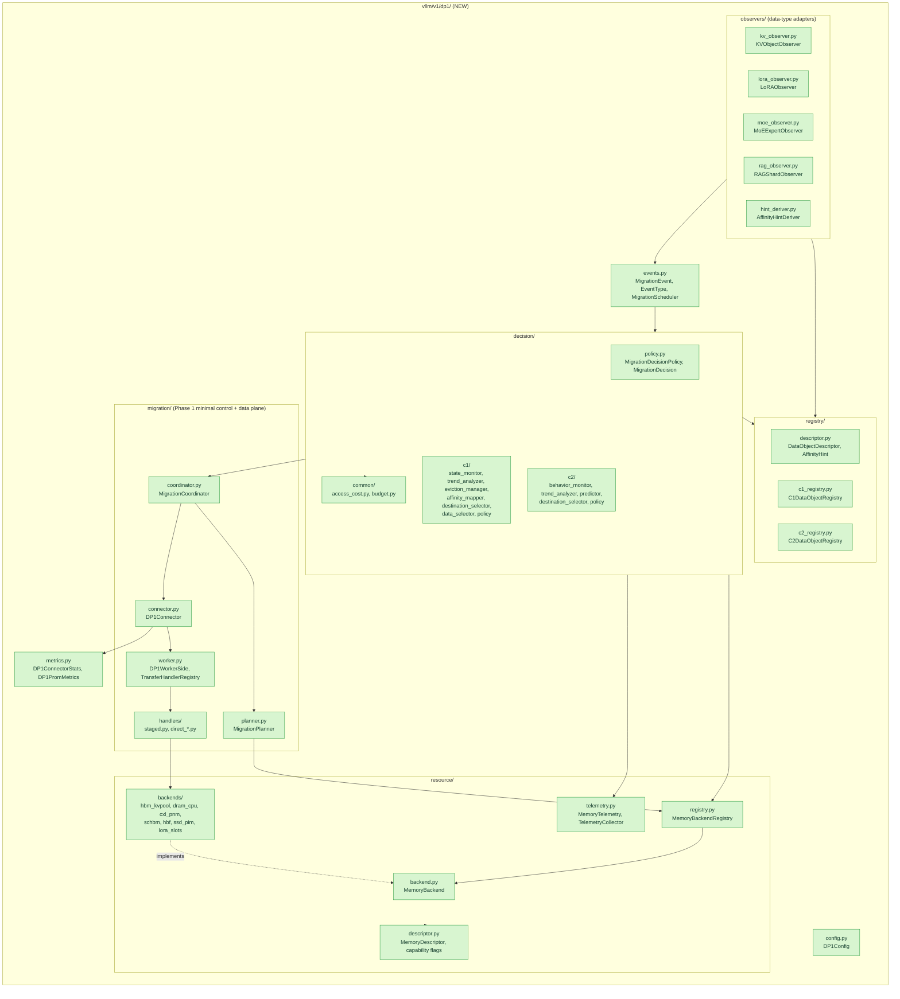

`decision/ → resource/backends/` 직접 import는 없다. `DEC`는 `MBR`(MemoryBackendRegistry)와 `MTL`(TelemetryCollector)의 추상 type만 본다.
`HDL → BKD` 화살표는 worker process 안에서 handler가 backend의 export/import primitive를 쓴다는 뜻이며 scheduler process의 `DEC`와는 process 경계로 분리된다(§2 참조).

### 1.2 기존 vLLM 모듈과의 접점 (hook / observe / wrap / modify / reuse)

색: 녹색 = new, 주황 = modify 필요, 회색 = reuse(편집 없음). 화살표 라벨은 붙는 방식이다.

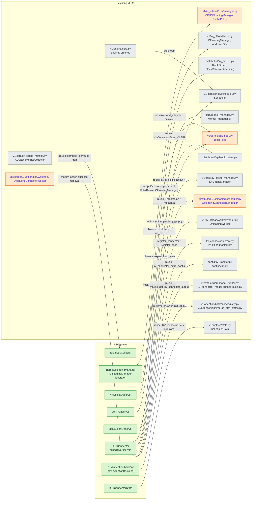

주황(modify) 항목은 모두 **소폭 수정**이다: `BlockPool`(prefetch insert API, usage getter), `OffloadingConnectorWorker`(failure 보고), `OffloadingConnectorScheduler`(`evicted_keys`를 DP1 hook으로 전달), `CPUOffloadingManager`(usage accessor, `CachePolicy` 등록은 dict 추가). `Scheduler`/`EngineCore`는 Phase 1에서 modify하지 않는다(F1). LoRA/EPLB는 observer를 호출 지점에 끼우는 최소 수정이 필요할 수 있으며(`add_adapter` 등) 회색(observe)으로 표시했으나 실제로는 call-site에 1~2줄 hook이 필요하다 (assumption: monkeypatch 없이 하려면 manager 편집 필요).

### 1.3 매핑 표: DP1 component → vLLM 접점 → 변경 유형 → 위험

| DP1 component (시뮬레이터 클래스) | vLLM file / class integration point | 변경 | 비고 / risk |
|---|---|---|---|
| **MigrationScheduler** (`events.MigrationScheduler`, coalesce TELEMETRY) | `vllm/v1/dp1/events.py` (new). 구동: `DP1Connector.build_connector_meta()` / `update_connector_output()` (`scheduler.py` L947, L2094)에서 event push, decision은 daemon thread (precedent: `vllm/v1/simple_kv_offload/copy_backend.py` `DmaCopyBackend`의 thread + `queue.SimpleQueue`) | new | request path에서 동기 호출 금지(설계 §8.1). **Low~Med**: thread가 `BlockPool`/`OffloadingManager`를 직접 건드리면 race (이 클래스들은 lock이 없음, assumption). 결과 commit은 scheduler thread에서만. |
| **DP1Connector** (Executor boundary, 설계 §5.7) | `vllm/v1/dp1/migration/connector.py` (new, `KVConnectorBase_V1` + `SupportsHMA` 구현). 등록: `KVConnectorFactory.register_connector` (`kv_connector/factory.py` L31) 또는 `kv_connector_module_path` (`config/kv_transfer.py`) | new + reuse | **Med**: HMA 필수. factory가 HMA 활성 시 `SupportsHMA` 미구현 connector를 거부(L58-62). `request_finished_all_groups` 구현 필요. `MultiConnector`(정적 list, "first hit" L358-377)와 동시 사용 금지. |
| **MigrationCoordinator / Planner** (공통 subsystem) | `vllm/v1/dp1/migration/coordinator.py`, `planner.py` (new). job/metadata는 `OffloadingConnectorMetadata`, `TransferJob`, `TransferSpec` 재사용 (`offloading/common.py`, `kv_offload/worker/worker.py` L9-12) | new + reuse | **Med**: 공통 문서의 `SchedulerOutput.migration_commands` 확장(§11)은 **불필요**(connector metadata로 충분, F2). 다만 foreground dependency barrier(`MODEL_FORWARD` 이전 완료 보장)는 connector 경로로는 `WAITING_FOR_REMOTE_KVS` 상태 활용(F-§4f). |
| **Data Object Registry — C1** (`registry.C1DataObjectRegistry`, `C1ObjectRecord`) | `vllm/v1/dp1/registry/c1_registry.py` (new). KV 식별자: `OffloadKey = block_hash + group_idx` (`kv_offload/base.py` L32 `make_offload_key`), HBM block은 `KVCacheBlock.block_hash`/`block_id` (`kv_cache_utils.py` L114) | new | **High (granularity)**: sim 객체는 ~100 GiB 단위, vLLM block은 `block_size` token. `KVSegment`(연속 offload key 묶음) 단위로 올려야 함. §6 R1. |
| **Data Object Registry — C2** (`C2DataObjectRegistry`, `class_metadata`) | `vllm/v1/dp1/registry/c2_registry.py` (new) | new | class_metadata prior(hotness/reuse/lifetime)는 `DP1Config`에서 로드(sim `priors`와 동일 역할). |
| **MemoryBackend I/F + MemoryBackendRegistry** (설계 §5.8, 시뮬레이터 `memories_default.json`) | `vllm/v1/dp1/resource/backend.py`, `registry.py` (new). adapter가 감싸는 것: `OffloadingSpec.get_manager()/get_handlers()` (`kv_offload/base.py` L319-390) | new | **Med**: `get_handlers()`가 `(src_cls, dst_cls, handler)` 3-tuple을 yield하므로 backend 하나 = (Spec, Manager, Handler) 묶음이 자연스러움. `OffloadingSpec` 자체가 "experimental / subject to change" 경고(`base.py` L322-326). |
| **HBM adapter** `hbm_kvpool` | `BlockPool` (`block_pool.py`), `GPULoadStoreSpec` (`kv_offload/base.py` L231, medium `"GPU"`) | new (wrap) + modify(BlockPool) | **Med**: capacity = KV pool만(고정, F-§6 R7). prefetch insert API는 `BlockPool`에 없음 → 추가 필요 (`cache_full_blocks`는 `Request`를 요구, L211-247). |
| **DRAM adapter** `dram_cpu` | `CPUOffloadingSpec`/`CPUOffloadingManager`/`CpuGpuOffloadingHandlers` (`kv_offload/cpu/*`), medium `"CPU"` | reuse + wrap | **Low**: 이미 존재. usage 노출을 위해 `CPUOffloadingManager`에 getter 추가(modify). `_get_num_free_blocks`가 private. |
| **CXL-PNM / ScHBM / HBF / SSD-PIM adapter** | 대응 vLLM 코드 없음 → `vllm/v1/dp1/resource/backends/{cxl_pnm,schbm,hbf,ssd_pim}.py` + 각 `LoadStoreSpec.medium()` | new | **High**: vendor driver/handler 구현은 DP1 범위 밖(설계 §3.2). handler는 `OffloadingHandler`를 구현. |
| **LoRA slot adapter** `lora_slots` | `LRUCacheLoRAModelManager` (`lora/model_manager.py` L887-967: `_registered_adapters` CPU LRU, `_active_adapters` GPU slot LRU, `pin_adapter`), `LRUCacheWorkerLoRAManager.add_adapter` (`lora/worker_manager.py` L268) | new (observe) + modify(소) | **Med**: 현재 tier는 2개(GPU slot / CPU cache)뿐이고 slot 수 `lora_slots`는 정적. worker→scheduler 채널 필요(F8). |
| **MoE expert adapter** | `EplbState`/`EplbModelState` (`eplb_state.py`), `expert_load_view` (`fused_moe/layer.py` L1514-1524) | new (observe only, Phase 1) | **High**: stacked parameter(F9). non-HBM expert 실행은 kernel 변경 필요. Phase 1은 load 통계 관찰/EPLB 연동만. |
| **RAG shard adapter** | **vLLM 대응 없음** → `dp1/observers/rag_observer.py` (new), 외부 등록 API | new | 등록 경로(HTTP/RPC)는 assumption. DP1 scope 밖 가능성(별도 서비스). |
| **Telemetry Collector** (`Telemetry`, `ResourceState` 입력) | 소스: `BlockPool.get_usage()` (L486), `SchedulerStats` (`metrics/stats.py` L171-198), `OffloadingConnectorStats.record_transfer` (`offloading/metrics.py`), `KVCacheMetricsCollector` (`core/kv_cache_metrics.py`), `PerfStats` (`metrics/perf.py` L96) | new + reuse | **Med**: **HBM BW utilization / link utilization을 직접 제공하는 vLLM 기존 metric은 못 찾음** → `PerfStats.num_read_bytes_per_gpu`로 간접 추정하거나 NVML 필요 (assumption). `KVCacheMetricsCollector`는 `sample_rate=0.01` 샘플링이고 access는 prefix-hit `touch`만 기록. |
| **Resource State Monitor / Trend Analyzer** (`ResourceStateMonitor`, `ResourceBasedTrendAnalyzer`) | `dp1/decision/c1/state_monitor.py`, `trend_analyzer.py` (new, pure Python) | new | Low. 입력은 `ResourceSnapshot`(immutable). |
| **Data Eviction Manager** (`DataEvictionManager`) | 두 지점: (a) tier-내부 `CachePolicy` 구현체 `DP1CachePolicy`를 `_CACHE_POLICIES`(`cpu/manager.py` L19)에 등록, (b) `PrepareStoreOutput.evicted_keys` 수신(현재 `offloading/scheduler.py`가 버림) | new + modify(소) | **Med**: demote 대상 선택 시 `protected` 집합(방금 요청된 keys) 존중 필요(`CachePolicy.evict(n, protected)`). |
| **Data-Memory Affinity Mapper** (`DataMemoryAffinityMapper`) + hint 채널 (`ctx.static_affinity_hints`) | `dp1/decision/c1/affinity_mapper.py`, `dp1/observers/hint_deriver.py` (new). hint 원천: `KVCacheSpec` 계열(`kv_cache_interface.py`), `Request.kv_transfer_params` (`ReqContext`, `kv_offload/base.py` L47), `LoRARequest`, model config | new | Low. 세부 규칙은 Affinity-Mapper 절(설계 문서에 별도 추가 중)을 따른다. |
| **AccessCostEstimator** (공통) | `dp1/decision/common/access_cost.py` (new). 입력은 `MemoryDescriptor`만 | new | Med: sim은 오차 0(보완 문서 §8.3). 실측 보정 loop(설계 §5.9.6)는 `TransferResult.transfer_size/transfer_time` 사용. |
| **Destination Tier Selector** (`DestinationTierSelectorC1/C2`) | `dp1/decision/{c1,c2}/destination_selector.py` (new). `MemoryBackendRegistry`만 조회 | new | Med: C2의 `TYPE_TIER_PREFERENCE`(tier 이름 key)는 §5.8.7 원칙 1 위반 소지 → capability class key로 바꿔야 함(설계 §5.8.6 표). |
| **MigrationBudget** (link-time token bucket) | `dp1/decision/common/budget.py` (new). 입력: 실측 BW (`TransferResult`), `shared_link_group` | new | Med: 공유 link가 **여러 vLLM engine/DP rank에 걸치면** per-engine budget으로는 부족(assumption, §6 R9). |
| **Policy (C1/C2)** (`C1ResourceDrivenMigration`, `C2BehaviorDrivenMigration`, `StaticNoMigration`) | `dp1/decision/c1/policy.py`, `c2/policy.py` (new), `NoopPolicy` (baseline) | new | 선택은 `DP1Config.policy = "c1" or "c2" or "none"`. |
| **Eviction/commit ↔ KV prefix cache** | `KVCacheManager.evict_blocks` → `BlockPool.evict_blocks` (`kv_cache_manager.py` L441, `block_pool.py` L424) | reuse | **Low**: DROP commit에 사용(hash entry 제거). `BlockRemoved(medium="GPU")` 이벤트가 같이 발생(L381-388). |
| **Prefetch(promotion) into HBM** | `BlockPool.get_new_blocks` + 신규 `insert_prefetched_blocks()` (`block_pool.py`), 완료 후 `cached_block_hash_to_block.insert` | modify | **High**: `block_hash` setter가 "already has a hash" assert(`kv_cache_utils.py` L138-142). 동시 request가 같은 hash로 allocate할 때 race 가능성(assumption). |
| **Stats / metrics export** | `DP1ConnectorStats(KVConnectorStats)` + `build_kv_connector_stats` / `build_prom_metrics` (precedent `OffloadingConnector`, `offloading_connector.py` L167-192) → `SchedulerStats.kv_connector_stats` → `loggers.py` L182, L1103 | new + reuse | **Low**: core 수정 없이 export 가능. |
| **Config** | `kv_connector_extra_config` (`config/kv_transfer.py`)로 `DP1Config` 전달 (Phase 1). 이후 `vllm/config/dp1.py` + `VllmConfig` 필드 (Phase 2) | reuse → modify | **Med**: `config/vllm.py` `_post_init_kv_transfer_config`(L675-715)가 `kv_offloading_size` 설정 시 `OffloadingConnector`/`LMCacheConnectorV1`로 덮어씀 → DP1과 충돌. |
| **PNM attention offload (§4f 경로 2)** | `vllm/v1/attention/backends/registry.py` L211 `register_backend(AttentionBackendEnum.CUSTOM, ...)`, `v1/attention/ops/merge_attn_states.py`(partial attention LSE merge) | new | **High**: layer-wise 호출은 CUDA graph 제약(§6 R5). |
| **Failure reporting** | `OffloadingConnectorWorker.get_finished` (`offloading/worker.py` L313-344) | modify | **High**: `assert transfer_result.success`. `TransferResult.success` 필드는 이미 있음(`worker/worker.py` L17-23). |

---

## 2. Component Diagram

C1/C2는 **하나의 공통 pipeline에 꽂히는 pluggable policy**다. 공통부는 Event → `MigrationScheduler` → (policy) → `MigrationDecision` → `MigrationCoordinator` 이고,
policy 내부 component(C1: `ResourceStateMonitor` 등, C2: `DataBehaviorMonitor` 등)만 교체된다. 사각형 중 `(["..."])` 모양은 **interface**,
`provides`는 해당 component가 구현하는 interface, `requires`는 호출하는 interface다. process 경계(scheduler/engine-core vs worker)를 subgraph로 구분했다.

### 2.1 Pluggable policy 구조와 interface

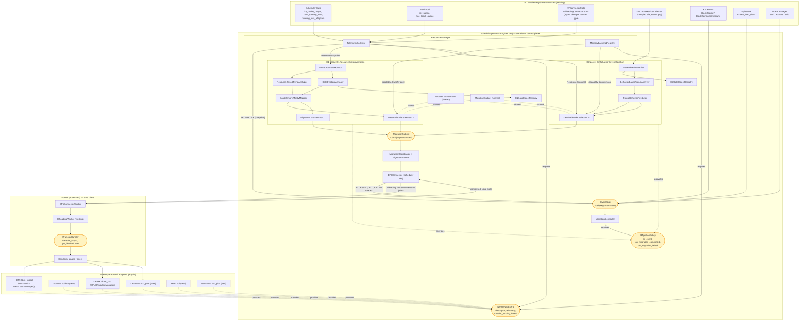

읽는 법:
- **C1 only / C2 only**: `DEM`, `DMA`, `DT1`, `MD1`는 C1에만, `DBM`, `BTA`, `FBP`, `DT2`는 C2에만 있다. `MS`, `TC`, `MBR`, `ACE`, `BUD`, `COO`, `CON`은 공통이다.
- 설계 §5.8.2.2 규칙대로 **Memory Backend를 직접 호출하는 것은 `TC`와 `MBR`뿐**이다(`IMemoryBackend`). C1 `RSM`/`DT1`/C2 `DT2`는 `TC`/`MBR`를 통해서만 memory를 본다.
- C1과 C2의 Registry는 interface가 다르다(`DOR1`/`DOR2`). 두 policy가 같은 `IMigrationPolicy`를 구현하므로 `MS` 이후는 policy를 구분하지 않는다.
- `S_KMC → DBM` 화살표는 C2에서만 per-block idle/reuse-gap 신호를 쓴다는 뜻이다 (Phase 2 이후, 샘플링 한계는 §6 R1).
- **데이터 경로(DP1Connector ↔ DP1ConnectorWorker)** 는 새 RPC가 아니라 기존 `SchedulerOutput.kv_connector_metadata` / `KVConnectorOutput.kv_connector_worker_meta`다(F2).

### 2.2 Telemetry 출처 (vLLM 어디서 오는가)

| `ResourceState`/`Telemetry` 항목 (sim) | vLLM 출처 | 위치 | 상태 |
|---|---|---|---|
| HBM `capacity_util` | `BlockPool.get_usage()` / `SchedulerStats.kv_cache_usage` | `block_pool.py` L486; `scheduler.py` `make_stats` L1926-1962 | 존재. 단 **free에 cached idle block 포함**(F5). active 비율은 `num_gpu_blocks - null - free`에서 별도 계산 필요. |
| HBM 중 active vs idle-cached | `BlockPool.free_block_queue` 길이 + `KVCacheBlock.ref_cnt`/`block_hash` | `block_pool.py` L161-176; `kv_cache_utils.py` L114 | 존재(내부 구조 접근). 신규 getter 권장. |
| DRAM tier `capacity_util` | `CPUOffloadingManager._num_allocated_blocks`, `_free_list` | `cpu/manager.py` L42-57 | private → getter 추가(modify). |
| tier 간 transfer 실측 BW/latency | `TransferResult.transfer_size/transfer_time/transfer_type`, `OffloadingConnectorStats.record_transfer` | `kv_offload/worker/worker.py` L17-23; `offloading/metrics.py`; `offloading/worker.py` L329-337 | 존재. 단 CUDA event 기반 GPU↔CPU만. `transfer_type`은 medium 문자열 쌍. |
| `read_bw_util`/`write_bw_util`/`queue_depth` | transfer queue depth는 handler 내부 `_transfers` deque | `kv_offload/cpu/gpu_worker.py` L151-160 | queue_depth는 노출 안 됨(modify). **HBM/PCIe/CXL BW util은 vLLM에 없음 (assumption: NVML/DCGM 또는 `PerfStats` 간접 추정)**. |
| 접근 빈도 / `ACCESSED` | prefix-hit `BlockPool.touch` → `KVCacheMetricsCollector.on_block_accessed` (샘플링), connector `get_num_new_matched_tokens` + `OffloadingManager.touch/lookup` | `block_pool.py` L391-406; `kv_cache_metrics.py`; `offloading/scheduler.py` L289-303, L443-486 | **decode 중 매 step 접근은 기록되지 않음**(prefix hit 시점만). running request의 block은 접근 이벤트 없이 "계속 사용 중"이다 → pin(ref_cnt>0)으로 판정. |
| LoRA 사용 | `SchedulerStats.running_lora_adapters/waiting_lora_adapters`, `scheduled_loras` | `metrics/stats.py` L193-194; `scheduler.py` L558-605 | 존재(scheduler 측). GPU slot LRU 상태는 worker 측. |
| MoE expert 접근 | `EplbModelState` load tensor (`expert_load_view`) | `eplb_state.py` L91+, `fused_moe/layer.py` L1514-1524 | worker/EP group 측, EPLB 활성화 시에만. |
| tier 이동 이벤트 | `BlockStored/BlockRemoved(medium)` | `distributed/kv_events.py` L46-96; `offloading/scheduler.py` `take_events` L859-878 | 존재. **DP0 C5 접점 계약**(medium 필드)이므로 DP1 tier 이름을 `medium`에 그대로 노출해야 한다. |
| preemption / recompute | `Scheduler._preempt_request`, `num_preemptions` | `scheduler.py` L952-972 | 존재. 압박의 결과 신호로 사용 가능. |

### 2.3 Memory type별 Backend adapter

| Backend (resource_id) | `MemoryDescriptor` 출처 | 감싸는 vLLM 코드 | `LoadStoreSpec.medium()` | 상태 |
|---|---|---|---|---|
| `hbm` (HBM, KV pool) | KV pool 크기: `KVCacheConfig.num_blocks` × page size (`engine/core.py` L232-262), HBM BW는 platform spec | `BlockPool`, `KVCacheManager`, `GPULoadStoreSpec` | `"GPU"` | wrap (new adapter) |
| `dram` (Host DRAM) | `cpu_bytes_to_use` (`cpu/spec.py` L26-47) | `CPUOffloadingSpec`, `CPUOffloadingManager`, `CpuGpuOffloadingHandlers` | `"CPU"` | reuse |
| `cxl_pnm` | 장치/driver spec (설계 §5.8.10 표) | 없음 | 신규 `"CXL"` (제안) | new |
| `custom_hbm` / ScHBM | 동일 | 없음 | 신규 `"SCHBM"` (제안) | new. `scope`/`shared_link_group` 표현 필요(설계 §5.8.10 ScHBM 주의). |
| `hbf` | 동일 | 없음 | 신규 `"HBF"` | new. `write_limited`. |
| `ssd_pim` | 동일 | 없음(LMCache `LocalDiskBackend`류는 외부 코드, 이 repo에 소스 없음) | 신규 `"SSD"` | new. |
| `lora_gpu_slots`/`lora_cpu_cache` | `lora_slots`, `capacity` (`LoRAModelManager`) | `LRUCacheLoRAModelManager` | (KV와 별도 spec 계열, assumption) | observe |

---

## 3. Class Diagram

시뮬레이터에 있는 클래스는 이름과 필드를 그대로 쓰고, 신규 타입은 `«new»`로 표시했다. 두 장으로 나눈다: 3.1 데이터 구조, 3.2 interface와 pipeline.

### 3.1 데이터 구조 (Registry record, Descriptor, Hint, Decision, Telemetry)

핵심은 **하나의 `DataObjectDescriptor`가 observer에서 생성되어 C1/C2 Registry에 서로 다른 투영(projection)으로 저장**된다는 점이다.
C1은 `kind`와 `class_metadata`를 버려 type-agnostic을 구조적으로 강제하고(`C1ObjectRecord`에는 필드 자체가 없음, 시뮬레이터 `registry.py`와 동일),
data type 지식은 `AffinityHint`(hint 채널, `ctx.static_affinity_hints`)로만 흐른다.

```mermaid
classDiagram
    class DataObjectDescriptor {
        <<new>>
        +int object_id
        +str kind
        +float size_bytes
        +str tier
        +bool movable
        +Optional~str~ replica_tier
        +NativeRef native_ref
        +dict class_metadata
        +AffinityHint hint
        +to_c1_record() C1ObjectRecord
        +to_c2_record() C2ObjectRecord
    }
    class NativeRef {
        <<new>>
        +str space
        +list~bytes~ offload_keys
        +list~int~ block_ids
        +Optional~int~ lora_id
        +Optional~tuple~ layer_expert
        +Optional~str~ shard_id
    }
    class AffinityHint {
        <<new>>
        +float latency_sensitivity
        +float bandwidth_sensitivity
        +float capacity_sensitivity
        +str op
        +float touch_bytes
        +int ctx_tokens
        +int concurrency
        +int out_tokens
        +int vec_dim
        +list~str~ preferred_capability_classes
        +list~str~ disallowed_capability_classes
        +str migration_cost_class
    }
    class C1ObjectRecord {
        +int object_id
        +float size_bytes
        +str tier
        +str location
        +bool movable
        +Optional~str~ replica_tier
    }
    class C2ObjectRecord {
        +int object_id
        +str data_type
        +float size_bytes
        +str tier
        +str location
        +dict class_metadata
        +dict behavior_metadata
        +bool movable
        +Optional~str~ replica_tier
    }
    class C1DataObjectRegistry {
        +add(object_id, size_bytes, tier, movable, replica_tier)
        +remove(object_id)
        +get(object_id) C1ObjectRecord
        +objects_in_tier(tier) list~C1ObjectRecord~
        +move(object_id, tier)
        +drop_to_replica(object_id)
    }
    class C2DataObjectRegistry {
        +add(object_id, data_type, size_bytes, tier, class_metadata, movable, replica_tier)
        +get(object_id) C2ObjectRecord
        +objects_in_tier(tier) list~C2ObjectRecord~
        +by_type(data_type) list~C2ObjectRecord~
        +move(object_id, tier)
        +drop_to_replica(object_id)
    }
    class MemoryDescriptor {
        <<new>>
        +str resource_id
        +str medium
        +int capacity_bytes
        +float ext_bw
        +float int_bw
        +Optional~float~ write_bw
        +float latency_s
        +list~str~ access_path
        +bool gpu_reachable
        +Optional~str~ shared_link_group
        +str scope
        +Optional~int~ granularity
        +list~str~ supported_primitives
        +float write_amplification
        +Optional~float~ endurance_budget
        +set~str~ capability_flags
        +str provenance
        +Optional~int~ tier_rank_hint
        +attention_capable() bool
    }
    class MemoryTelemetry {
        <<new>>
        +str resource_id
        +float timestamp
        +Optional~int~ used_bytes
        +Optional~int~ free_bytes
        +Optional~float~ read_bw_util
        +Optional~float~ write_bw_util
        +Optional~int~ queue_depth
        +Optional~float~ observed_latency
        +Optional~int~ transfer_inflight_bytes
        +Optional~float~ shared_link_util
        +str health
        +dict extension
    }
    class MemoryTransferBinding {
        <<new>>
        +str resource_id
        +list~str~ supported_peers
        +str path_type
        +str handler_key
        +float est_transfer_bw
        +float est_setup_cost
        +dict constraints
    }
    class Telemetry {
        +float capacity_util
        +float bw_util
    }
    class ResourceState {
        +float current_pressure
        +float current_bw
        +float predicted_pressure
        +float predicted_bw
        +float capacity_headroom
    }
    class MigrationAction {
        <<enumeration>>
        MOVE
        REPLICATE
        DROP
        REMAP
        RECLASSIFY
    }
    class MigrationDecision {
        +int object_id
        +str source_tier
        +str target_tier
        +str reason
        +float score
        +str direction
        +MigrationAction action
        +dict policy_metadata
    }
    class MigrationIntent {
        <<new>>
        +MigrationAction action
        +list~int~ data_refs
        +str source_resource_id
        +Optional~str~ target_resource_id
        +str reason
        +int priority
        +str dependency_type
        +dict policy_metadata
    }
    class MigrationEvent {
        +EventType type
        +float now_s
        +Optional~int~ object_id
        +Optional~str~ resource_id
        +float count
        +dict metadata
    }
    class EventType {
        <<enumeration>>
        ALLOCATED
        ACCESSED
        FREED
        TELEMETRY
        PHASE_CHANGE
        RESOURCE_CHANGED
        MIGRATION_FAILED
        MIGRATION_COMMITTED
    }

    DataObjectDescriptor *-- NativeRef
    DataObjectDescriptor *-- AffinityHint
    DataObjectDescriptor ..> C1ObjectRecord : projection drops kind
    DataObjectDescriptor ..> C2ObjectRecord : projection keeps kind
    C1DataObjectRegistry o-- C1ObjectRecord
    C2DataObjectRegistry o-- C2ObjectRecord
    MigrationDecision --> MigrationAction
    MigrationIntent --> MigrationAction
    MigrationDecision ..> MigrationIntent : Coordinator converts
    MigrationEvent --> EventType
    MemoryTelemetry ..> Telemetry : normalized
    Telemetry ..> ResourceState : ResourceStateMonitor
    MemoryDescriptor ..> MemoryTransferBinding : binding derived
```

시뮬레이터와의 차이(구현 시 명시적 결정 필요):
- `EventType`에 **`RESOURCE_CHANGED`**(설계 §5.8.2.3 규칙 5, health 변화)와 **`MIGRATION_FAILED` / `MIGRATION_COMMITTED`**(설계 §5.9.7, 실패는 event로 되돌아옴)를 추가한다. 시뮬레이터 `events.EventType`은 5개뿐이고 failure 경로가 없다.
- `MigrationDecision.action`은 시뮬레이터에서 `str`("MOVE"/"DROP")이지만 설계 §2.1은 5개 action이므로 `MigrationAction` enum으로 한다. `REPLICATE`/`REMAP`/`RECLASSIFY`는 시뮬레이터에 미구현이다.
- `DataObjectDescriptor`, `NativeRef`, `MemoryDescriptor` 이하 필드는 **설계 §5.8.3~§5.8.5가 정의**했고 시뮬레이터에는 `MemorySpec`(`model.py` L14)이 가장 가까운 대응이다(`attention_capable`, `retrieval_dot_capable` property 존재). `MemoryDescriptor.attention_capable()`은 `supported_primitives`에서 파생한다.

### 3.2 Interface와 pipeline (Policy, Backend, Selector, Migration control)

`MigrationDecisionPolicy`는 시뮬레이터의 `on_event(ev, ctx) -> (decisions, cost_us)` / `on_migration_committed(decision, now_s)`를 그대로 계승하고,
vLLM 쪽에서 필요한 `on_migration_failed`만 추가한다. 설계 §22.4의 `evaluate(event, resource_snapshot, data_object_registry)`는 `ctx`(`DecisionContext`)에 snapshot/registry가 들어 있다고 보고 같은 interface로 취급한다.

```mermaid
classDiagram
    class MigrationDecisionPolicy {
        <<interface>>
        +name str
        +decision_cost_us float
        +on_event(ev, ctx) tuple
        +on_migration_committed(decision, now_s)
        +on_migration_failed(decision, reason, now_s)
    }
    class DecisionContext {
        <<new>>
        +ResourceSnapshot snapshot
        +dict occupancy
        +dict effective_capacity
        +dict static_affinity_hints
        +float slo_ttft_s
        +float slo_tpot_s
    }
    class C1ResourceDrivenMigration {
        +name = C1-resource-driven
        +decision_cost_us = 14.0
        +registry C1DataObjectRegistry
        +monitor ResourceStateMonitor
        +trend ResourceBasedTrendAnalyzer
        +eviction DataEvictionManager
        +affinity DataMemoryAffinityMapper
        +estimator AccessCostEstimator
        +destination DestinationTierSelectorC1
        +selector MigrationDataSelectorC1
        +budget MigrationBudget
        +pending_promotion dict
        +_promotion_pass(ev, ctx, states, slo, planned)
    }
    class C2BehaviorDrivenMigration {
        +name = C2-behavior-driven
        +decision_cost_us = 38.0
        +registry C2DataObjectRegistry
        +monitor DataBehaviorMonitor
        +trend BehaviorBasedTrendAnalyzer
        +predictor FutureBehaviorPredictor
        +estimator AccessCostEstimator
        +destination DestinationTierSelectorC2
        +budget MigrationBudget
        +horizon_s float
    }
    class StaticNoMigration {
        +name = Baseline-static
    }
    class ResourceStateMonitor {
        +observe(telemetry)
        +states(telemetry) dict
    }
    class ResourceBasedTrendAnalyzer {
        +pressure_sources(states) list
    }
    class DataEvictionManager {
        +on_moved(object_id, now_s)
        +candidates(source_tier, now_s) list
    }
    class DataMemoryAffinityMapper {
        +score(mem, state, hint) float
    }
    class AccessCostEstimator {
        +estimate(tier, hint, size_bytes) tuple
        +service_extra_s(tier, hint, size_bytes) float
        +slo_ok(tier, hint, size_bytes, slo_ttft_s, slo_tpot_s) bool
        +budget_fraction(tier, hint, size_bytes, slo_ttft_s, slo_tpot_s) float
    }
    class DestinationTierSelectorC1 {
        +select(rec, source, states, occupancy, capacity_by_tier, hint, slo, strict_pressure) str
    }
    class DestinationTierSelectorC2 {
        +preferred(rec) tuple
        +select(rec, predicted, telemetry, occupancy, capacity_by_tier, hint, slo) str
    }
    class MigrationDataSelectorC1 {
        +select(candidates, required_free_bytes) list
    }
    class DataBehaviorMonitor {
        +observe_alloc(oid, now_s)
        +observe_access(oid, count, now_s)
        +features(oid, now_s) dict
    }
    class BehaviorBasedTrendAnalyzer {
        +analyze(rec, feat) dict
    }
    class FutureBehaviorPredictor {
        +predict(rec, trend) float
    }
    class MigrationBudget {
        +share float
        +cap float
        +tokens float
        +refill(now_s)
        +can_spend(seconds) bool
        +try_spend(seconds, use_reserved) bool
    }
    class ActivityTagStore {
        <<new, C1 complement A1>>
        +on_accessed(oid, now_s)
        +activity(oid) int
    }
    class MigrationScheduler {
        +push(event)
        +drain(policy, ctx) list
    }
    class MemoryBackend {
        <<interface>>
        +descriptor() MemoryDescriptor
        +transfer_binding() MemoryTransferBinding
        +telemetry() MemoryTelemetry
        +subscribe(cb)
        +health() str
        +export_async(region, staging) handle
        +import_async(staging, region) handle
    }
    class MemoryBackendRegistry {
        +register(backend)
        +unregister(resource_id)
        +get_descriptor(resource_id) MemoryDescriptor
        +list(filter) list
        +get_binding(src, dst) MemoryTransferBinding
        +tier_order() list
    }
    class TelemetryCollector {
        +collect()
        +snapshot() ResourceSnapshot
    }
    class HBMKVPoolBackend {
        <<new adapter>>
        +wraps BlockPool
    }
    class DRAMCpuBackend {
        <<new adapter>>
        +wraps CPUOffloadingManager
    }
    class CXLPNMBackend {
        <<new>>
    }
    class SchHBMBackend {
        <<new>>
    }
    class HBFBackend {
        <<new>>
    }
    class SSDPIMBackend {
        <<new>>
    }
    class MigrationCoordinator {
        <<new>>
        +submit(intent) MigrationHandle
        +on_completion(job_id, success, bytes, time_us)
        +reconcile()
    }
    class MigrationPlanner {
        <<new>>
        +plan(intent) MigrationPlan
    }
    class TransferHandlerRegistry {
        <<new>>
        +resolve(src_medium, dst_medium) ITransferHandler
    }
    class ITransferHandler {
        <<interface, existing OffloadingHandler>>
        +transfer_async(job_id, spec) bool
        +get_finished() list
        +wait(job_ids)
    }
    class DP1Connector {
        <<new, KVConnectorBase_V1 + SupportsHMA>>
        +get_num_new_matched_tokens(request, n)
        +update_state_after_alloc(request, blocks, n)
        +build_connector_meta(scheduler_output)
        +update_connector_output(connector_output)
        +bind_gpu_block_pool(block_pool)
        +take_events()
    }

    MigrationDecisionPolicy <|.. C1ResourceDrivenMigration
    MigrationDecisionPolicy <|.. C2BehaviorDrivenMigration
    MigrationDecisionPolicy <|.. StaticNoMigration
    MigrationDecisionPolicy ..> DecisionContext
    C1ResourceDrivenMigration *-- ResourceStateMonitor
    C1ResourceDrivenMigration *-- ResourceBasedTrendAnalyzer
    C1ResourceDrivenMigration *-- DataEvictionManager
    C1ResourceDrivenMigration *-- DataMemoryAffinityMapper
    C1ResourceDrivenMigration *-- DestinationTierSelectorC1
    C1ResourceDrivenMigration *-- MigrationDataSelectorC1
    C1ResourceDrivenMigration o-- ActivityTagStore : complement A1 optional
    C1ResourceDrivenMigration *-- MigrationBudget
    C1ResourceDrivenMigration o-- AccessCostEstimator
    C2BehaviorDrivenMigration *-- DataBehaviorMonitor
    C2BehaviorDrivenMigration *-- BehaviorBasedTrendAnalyzer
    C2BehaviorDrivenMigration *-- FutureBehaviorPredictor
    C2BehaviorDrivenMigration *-- DestinationTierSelectorC2
    C2BehaviorDrivenMigration *-- MigrationBudget
    C2BehaviorDrivenMigration o-- AccessCostEstimator
    DestinationTierSelectorC1 ..> AccessCostEstimator
    DestinationTierSelectorC2 ..> AccessCostEstimator
    DestinationTierSelectorC1 ..> MemoryBackendRegistry : capability and cost only
    DestinationTierSelectorC2 ..> MemoryBackendRegistry : capability and cost only
    MigrationScheduler ..> MigrationDecisionPolicy : drain calls on_event
    MemoryBackend <|.. HBMKVPoolBackend
    MemoryBackend <|.. DRAMCpuBackend
    MemoryBackend <|.. CXLPNMBackend
    MemoryBackend <|.. SchHBMBackend
    MemoryBackend <|.. HBFBackend
    MemoryBackend <|.. SSDPIMBackend
    MemoryBackendRegistry o-- MemoryBackend
    TelemetryCollector ..> MemoryBackend : telemetry only
    MigrationCoordinator --> MigrationPlanner
    MigrationPlanner ..> MemoryBackendRegistry : get_binding
    MigrationPlanner ..> TransferHandlerRegistry
    TransferHandlerRegistry o-- ITransferHandler
    DP1Connector --> MigrationCoordinator
    DP1Connector --> MigrationScheduler
    DP1Connector ..> TelemetryCollector
```

구현 시 주의 (시뮬레이터 대비):
- 시뮬레이터에서 `DataEvictionManager.candidates`의 key는 `size × (1 + min(residency_age/60, 1))`(마지막 이동 후 경과)이고 접근 시각이 아니다(`policies.py` L252-254, 보완 문서 §1.2 D2). vLLM에서도 같은 key를 쓰면 `CachePolicy`(LRU/ARC)보다 **접근 정보가 오히려 적다**. `DP1CachePolicy`로 등록 시 `touch()`를 받는 `ActivityTagStore`(보완 A1)를 선택 옵션으로 둔 이유.
- `DestinationTierSelectorC2.TYPE_TIER_PREFERENCE`는 tier 이름 문자열 key이므로 Backend I/F 원칙 위반 소지가 있다(설계 §5.8.7 원칙 1/§5.8.6). vLLM 구현에서는 capability class key로 바꾼다.
- 시뮬레이터 `MigrationBudget`은 단일 token bucket이다. `DP1Connector`가 owner이며 `TransferResult` 실측값으로 `est_transfer_bw`를 보정하는 closed loop(설계 §5.9.6)는 `TelemetryCollector`가 중계한다.

---

## 4. Sequence Diagrams

공통 규약: 모든 상태 변경은 scheduler thread에서만 일어난다(decision thread는 `DecisionResult`를 queue로 넘김). Registry의 `tier` 변경은 **copy 완료 후 commit 시점에만** 일어난다(공통 문서 §7, 설계 §5.9.7).
메시지 안의 `file:Lnnn` 표기는 호출될 기존 코드 위치다.

### 4a. Data object 할당 / 등록 + affinity hint 도출

각 data type의 **observer**가 `DataObjectDescriptor`를 만들고, `AffinityHintDeriver`가 **등록 시점에 static hint를 도출**한다(runtime history를 쓰지 않음, C1 static affinity의 정의).
KV는 scheduler 측에서 직접 보이고, LoRA/MoE는 worker 측에서 보여 worker meta로 올라오며, RAG shard는 vLLM에 대응이 없어 외부 등록이다.

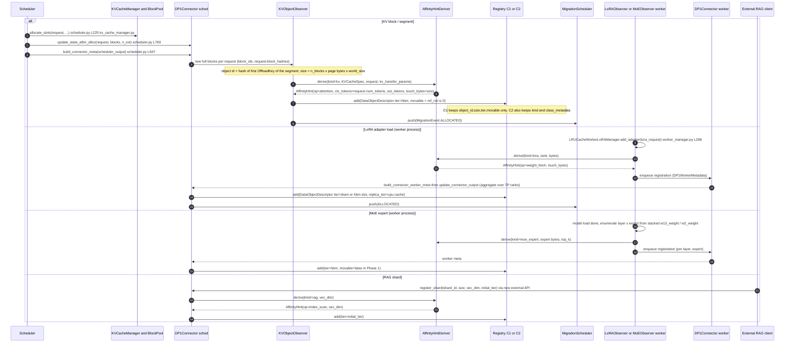

메모:
- KV의 `movable`은 객체를 이루는 block들의 `ref_cnt == 0`일 때만 true다(F5). 실행 중 request의 block은 `movable=false`(= pin)로 등록되고 request 종료 시(`request_finished`, `offloading/scheduler.py` L829) `RECLASSIFY`로 풀린다.
- `AffinityHint`의 field는 시뮬레이터 `static_hints()`(`simulator.py` L281-314)와 동일하다. data type 이름은 hint에 들어가지 않고 operation class(`attention`/`weight_fetch`/`index_scan`/`context_fetch`)만 간다 — `OPERATION_CLASS` 표(`simulator.py` L269-278)의 vLLM 대응이 `AffinityHintDeriver`다. 세부 규칙은 설계 문서의 Affinity-Mapper 절을 따른다.
- MoE는 `ALLOCATED` 이후 Phase 1에서 `movable=false`(F9). LoRA는 CPU cache가 이미 존재하므로 `replica_tier="dram"`로 등록하면 HBM slot 해제가 `DROP`이 된다 (설계 §2.1 "LoRA 복제" 시나리오와 일치).

### 4b. Access event + telemetry tick → C1 decision → migration → commit

C1 steady-state 경로다. ACCESSED는 pressure 판단에는 쓰이지 않고(C1 원칙), tick마다 `TELEMETRY` snapshot이 decision cycle을 일으킨다.
decision은 background thread에서 계산되고, 실행(job 발행)과 commit은 scheduler thread에서 step 경계(`build_connector_meta`, `update_connector_output`)에서만 이뤄진다.

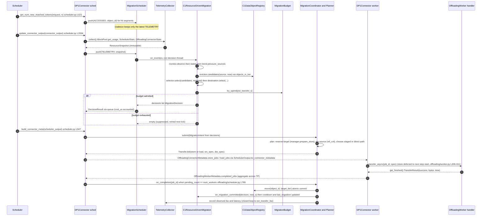

### 4c. HBM pressure → eviction / demotion (C1)

F5 때문에 vLLM에서 "HBM 압박 해소"는 **idle cached block의 replica를 evict 직전에 확보**하는 것으로 구체화된다. 이미 DRAM replica가 있으면 `DROP`(copy 없음, HBM hash entry 제거), 없으면 `REPLICATE`(copy 후 hash 제거).
active block은 `movable=false`이므로 후보에서 제외되고, 그래도 압박이 해소되지 않으면 DP1이 할 수 있는 일은 없고 기존 `_preempt_request` 경로(recompute)가 처리한다.

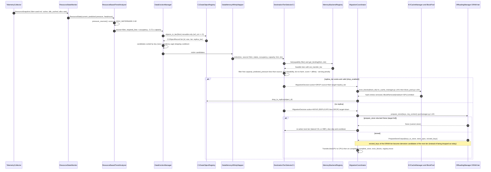

### 4d. C1 static-affinity promotion / swap

시뮬레이터 `_promotion_pass`(`policies.py` L462-580)의 vLLM 대응이다. promotion 후보는 **"현재 tier에서는 SLO 위반, HBM에서는 만족"**이라고 `AccessCostEstimator`가 판정한 객체이고(runtime 접근 이력 불필요),
HBM에 자리가 없으면 `gain ≥ AFFINITY_MARGIN(2.0) × loss`인 victim들과 swap한다. swap은 한 번에 하나만 in-flight이고 promotion 단계의 전송 시간은 budget에서 `reserved`된다.
KV promotion = DRAM→HBM prefetch(§1.3의 `insert_prefetched_blocks` 필요), LoRA promotion = GPU slot 활성화다.

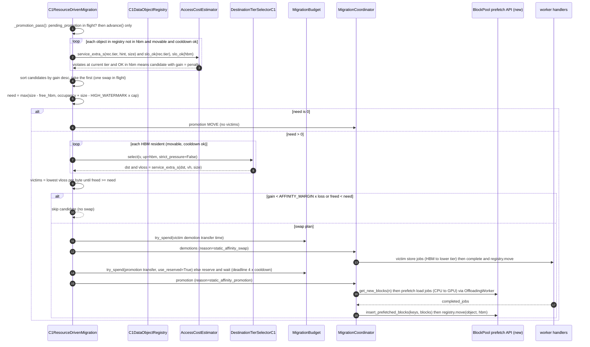

### 4e. C2 behavior-driven decision

C2는 매 `TELEMETRY` tick마다 **모든 객체**를 순회한다(시뮬레이터 `decision_cost_us × len(registry)`, `policies.py` L934). 신호는 ACCESSED로 누적된 `DataBehaviorState`이고, demotion은 upper-tier pressure가 있을 때만,
promotion은 `expected_rate × horizon × gain > MIGRATION_EXPOSURE × xfer_s`일 때만 허용한다(benefit-vs-cost gating, 설계 §13.6).

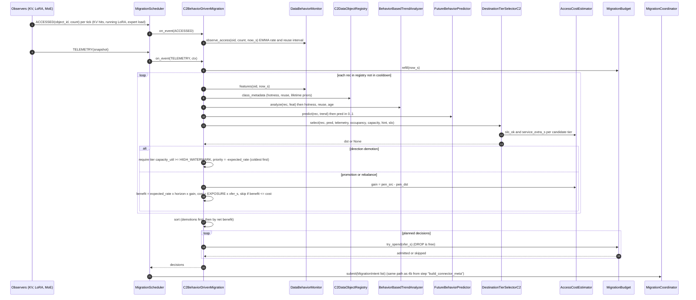

### 4f. Request path when KV is on a lower tier

두 경로가 있다. **경로 1 (read-through / load)** 은 기존 connector 경로를 그대로 쓰는 foreground promotion이고 Phase 1에서 구현한다.
**경로 2 (attention offload)** 는 block을 HBM으로 가져오지 않고 near-data compute가 가능한 memory(`near_data_compute` capability)에서 partial attention을 수행하는 경로로, DP1은 "load할지 offload할지"의 **판정**(`AccessCostEstimator._estimate`의 `attention_capable` 분기, `policies.py` L106-112)만 책임지고 실행은 DP4 소관이다.

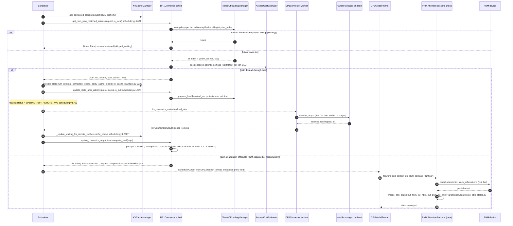

경로 2의 `SchedulerOutput` 확장 field와 `PNM AttentionBackend`는 **코드에 없는 신규 요소**다(assumption). 근거가 있는 부분은 (i) attention backend plug-in 등록(`register_backend`, `registry.py` L211), (ii) partial attention LSE merge 유틸(`merge_attn_states`)의 존재이고, (iii) CUDA graph 호환성은 확인하지 못했다(§6 R5).

### 4g. In-flight migration 실패 / rollback

설계 §5.9.7의 두 가정(copy 완료 전 location 불변, 실패는 event로 DP1에 되돌아옴)을 vLLM 코드 위에 구현한 흐름이다.
**store 쪽 rollback은 `OffloadingManager.complete_store(success=False)`로 이미 가능**하지만 worker의 `assert success`와 load 쪽 rollback이 없다(F7).

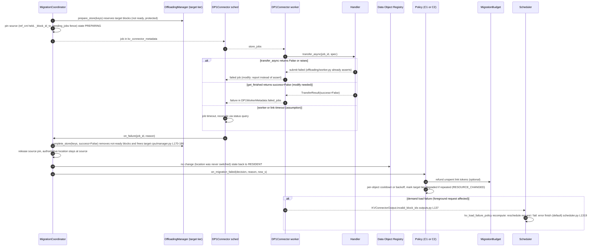

---

## 5. State Diagram — Data object migration lifecycle

한 data object의 lifecycle이다. 하단 `PENDING..COMMITTING`은 공통 migration architecture §7의 상태 이름을 그대로 쓰고,
그 위에 DP1 decision plane 상태(`REGISTERED`, `RESIDENT`, `PINNED`, `CANDIDATE`, `DECIDED`, `COOLDOWN`, `SUPPRESSED`)를 얹었다.
`DROP`/`REMAP`은 `COPYING`을 건너뛰고, `RECLASSIFY`는 상태 머신 없이 `RESIDENT` 내부 metadata 갱신이다(공통 문서 §7.1).

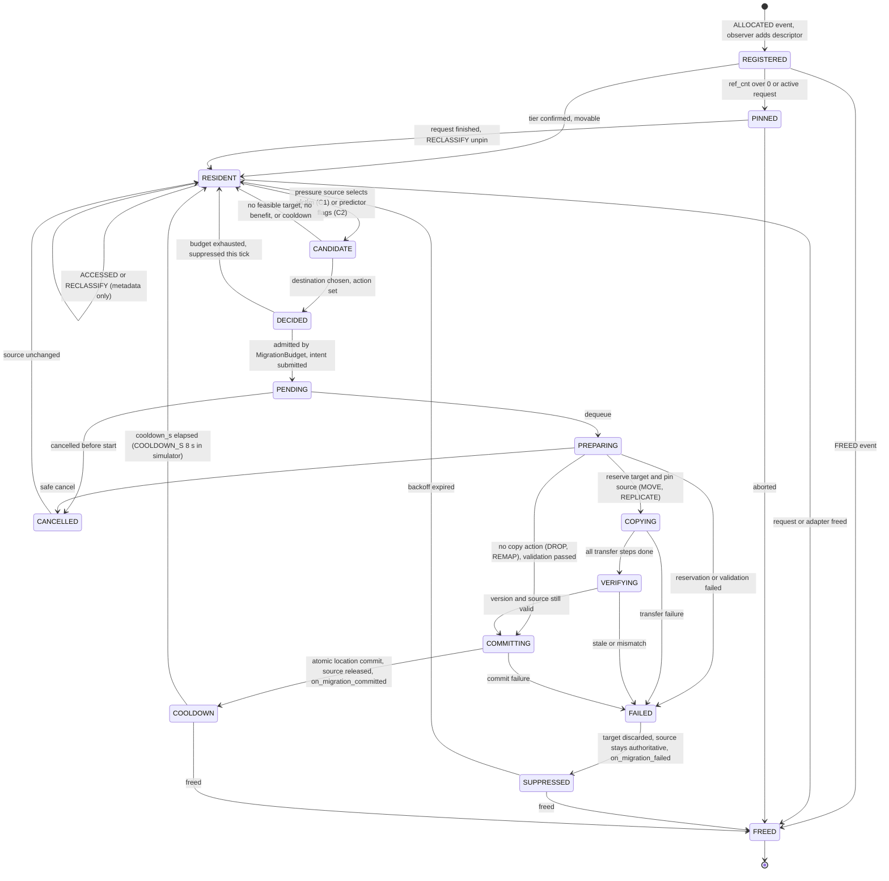

해석 규칙:
- `FREED`는 어느 상태에서도 가능하지만 in-flight(`PREPARING`~`COMMITTING`) 중 free되면 job을 `CANCELLED`로 보내고 source pin을 푼 뒤 `FREED`로 간다(상태 간 직접 화살표는 생략). vLLM 대응 fence는 `_block_id_to_pending_jobs` + `jobs_to_flush`(`offloading/scheduler.py` L225-230, L765-783)이다.
- `DECIDED → RESIDENT`(budget 소진)는 시뮬레이터에서 `try_spend` 실패 시 `continue`하는 경로이며 object 상태는 바뀌지 않는다.
- `COOLDOWN`은 시뮬레이터 `last_migration[oid]`와 `COOLDOWN_S`(8 s)이며, `on_migration_committed`에서 갱신된다(`policies.py` L582-590).
- `PINNED`는 시뮬레이터에 없다(시뮬레이터 객체는 항상 movable). vLLM에서는 active request block의 `ref_cnt>0` 때문에 필수 상태다(F5).

---

## 6. Open Issues / Risks of integrating into vLLM

표기: **[G]** = 이 repo 코드를 읽어서 확인한 사실, **[A]** = assumption(미확인).

### R1. 객체 granularity 불일치 (시뮬레이터 vs vLLM block) — 최우선 [G]+[A]
- [G] 시뮬레이터 객체는 KV object(~100 GiB, 8~9개)이고 C2는 매 tick 전 객체를 순회한다(`policies.py` L934, 보완 문서 §7.3). vLLM의 KV는 `block_size` token 단위 block이며 `OffloadKey`는 block hash + group index다(`kv_offload/base.py` L32). 단순 매핑하면 객체 수가 10^5~10^6이 되어 C2 per-tick 순회가 성립하지 않는다.
- [G] vLLM 자체도 per-block 추적은 `sample_rate=0.01` 샘플링으로 처리한다(`KVCacheMetricsCollector`, `kv_cache_metrics.py`).
- 제안: `KVSegment`(한 `prepare_store` 호출의 연속 key 묶음, 또는 request별 prefix chain)를 DP1 객체로 정의. 이 경우 "같은 class 안의 hot/cold" 구분은 segment 간에만 가능하다. [A] segment 크기 분포에 따른 C1 vs C2 우위는 simulator 결과와 달라질 수 있다.

### R2. Block manager / prefix caching과 identity [G]
- block은 `block_id`(물리)가 아니라 `BlockHashWithGroupId`로 식별해야 한다. `BlockHashToBlockMap`은 중복 hash block을 허용하고 첫 block을 반환한다(`block_pool.py` L184-209 docstring "If there are duplicated blocks, we return the first block"). `block_id`는 재할당된다.
- 기존 offloading connector는 이 위험을 `_block_id_to_pending_jobs` + `jobs_to_flush`(source block이 재할당되기 전에 in-flight store 완료 대기)로 막는다. DP1이 별도 job 경로를 만들면 이 fence를 **반드시 재사용**해야 한다(안 그러면 source 오염).
- [G] prefetch(promotion) 삽입은 `BlockPool.cache_full_blocks(request, ...)`가 `Request`를 요구하고 `blk.block_hash`가 이미 있으면 assert한다(`block_pool.py` L211-272, `kv_cache_utils.py` L138-142). Request 없이 hash를 직접 주입하는 API가 필요하고, 같은 hash를 동시에 쓰는 request와의 race는 [A].
- [G] `FilterReusedOffloadingManager`(`store_threshold`)와 C1 admission policy가 중복 필터가 된다 → DP1 사용 시 `store_threshold=0` 강제 필요.

### R3. v1 scheduler 가정 [G]
- Scheduler는 connector 호출이 **동기 + step 경계**임을 가정한다. `get_num_new_matched_tokens`가 `None`을 반환하면 request를 `skipped_waiting`으로 미룬다(`scheduler.py` L621-641). DP1 lookup이 느리면 TTFT에 직접 반영된다.
- HMA(hybrid KV cache manager): connector가 `SupportsHMA`를 구현하지 않으면 factory가 거부한다(`kv_connector/factory.py` L58-62). sliding-window/Mamba group은 block이 request 종료 전에 해제되고 null placeholder(block_id 0)가 존재한다(`offloading/scheduler.py` L595-763). DP1 KV observer는 group별 규칙을 복제해야 한다.
- [G] async scheduling에서는 일부 token이 누락될 수 있고(`num_offloadable_tokens = min(...)`, `offloading/scheduler.py` L627-630), 마지막 block offload를 request 종료 후로 미루는 TODO가 있다(L843). → tail block은 sealed 전까지 등록하지 않는다.
- [A] preemption은 active block을 recompute로 해결(`_preempt_request`, `scheduler.py` L952). DP1은 이 결정에 개입하지 않는다고 가정(Scheduler 정책 변경은 DP2/별도 DP).

### R4. Async transfer / 실패 [G]
- 현재 worker는 transfer 실패를 지원하지 않는다(`assert transfer_result.success`, `offloading/worker.py` L327). 실패 보고 경로가 **필수 modify**다(§4g).
- store job은 "token sampling 관련 transfer 뒤"로 의도적으로 지연된다(`prepare_store_kv` 주석, L306-311). 즉 background migration 시작 지연이 최대 1 step 있고, foreground promotion은 이 지연을 우회하는 경로(`start_load_kv` 시점)가 필요하다.
- 한 request에 대해 "load job 하나이거나 store job 여러 개" 불변식이 있다(`RequestOffloadState.transfer_jobs` 주석, `offloading/scheduler.py` L131-136, assert L583, L730-732). DP1 job을 request에 귀속시키면 이 불변식과 충돌한다 → DP1 job은 request 비귀속(object 귀속)으로 정의하고 별도 job table 사용 권장 [A].
- 완료 판정은 TP 전 rank 합산(`pending_count == num_workers`, L785-827). 하나의 rank가 느리면 commit 지연.

### R5. CUDA graph interaction [G]+[A]
- [G] layer-wise connector hook(`wait_for_layer_load`/`save_kv_layer`, `maybe_transfer_kv_layer`)은 CUDA graph에 캡처될 수 없고 `requires_piecewise_for_cudagraph`가 True면 PIECEWISE로 강제된다(`kv_connector/v1/base.py` L580-599, `config/vllm.py` L1071-1079). 기존 `OffloadingConnector`는 layer hook을 `pass`로 두고 step 경계(`start_load_kv`, `wait_for_save`)만 쓴다.
- → DP1 Phase 1은 **step-boundary 전용**으로 설계해 graph mode 제약을 받지 않게 한다. 경로 2(PNM attention offload)는 layer 단위 호출이 필요하므로 PIECEWISE 또는 custom op 등록이 필요하다 [A].
- [A] `BlockPool`/KV tensor 주소는 graph replay 동안 고정이어야 한다고 가정한다. DP1은 KV tensor를 재할당하지 않고 block 내용만 갱신하므로 충족하지만, prefetch 도중 해당 block을 읽는 kernel과의 동기화(`stream`/event)는 handler가 책임져야 한다(`SingleDirectionOffloadingHandler`는 전송마다 별도 stream, `kv_offload/cpu/gpu_worker.py` L111-125).

### R6. Multi-GPU / TP / PP / DP [G]+[A]
- [G] TP에서 하나의 논리 block은 `world_size`개 물리 shard다. `CPUOffloadingSpec`은 `kv_bytes_per_block × world_size`로 DRAM block 수를 계산(`cpu/spec.py` L32-47)하고, 완료는 모든 worker 보고 후에만 인정된다. 따라서 Registry의 `size_bytes`는 rank 합산 기준이어야 하고, tier capacity도 같은 기준이어야 한다(`config/vllm.py`의 `num_kv_ranks = TP×PP`, L~690).
- [G] DP engine은 각자 `Scheduler`/`BlockPool`을 가진다. 공유 host DRAM은 `SharedOffloadRegion`(`/dev/shm` mmap, 같은 instance 내 worker 간 공유)이 있으나 **engine 간 공유 budget**을 조정하는 기존 구성요소는 못 찾았다. [A] `shared_link_group`(예: 8 GPU가 공유하는 PCIe5 x16) budget은 per-engine `MigrationBudget`만으로는 부족하고 cross-engine 조정(공유 token bucket)이 필요하다.
- [A] EP/MoE: EPLB는 EP rank 간 HBM 재배치다(F9). DP1의 intra-node tier 이동(HBM↔DRAM 등)과 목적이 다르며 같은 expert의 두 가지 이동이 충돌하지 않도록 `RECLASSIFY`/lock이 필요하다.

### R7. HBM 용량은 data type별로 정적 분할이다 [G]
- KV pool 크기는 init 시 `determine_available_memory` → `get_kv_cache_configs`로 한 번 결정된다(`engine/core.py` L232-262). weight, LoRA slot(`lora_slots`), CUDA graph 메모리는 이 밖이다. 따라서 C1의 "pool pressure"는 **KV pool 내부**에서만 의미가 있고, HBM에서 LoRA와 KV 사이의 동적 용량 재분배는 현재 구조로는 불가능하다. 설계 §5.8.10의 `hbm` 192 GiB/GPU를 단일 pool로 보는 것은 시뮬레이터 단순화다.

### R8. 주체 간 thread-safety / 오버헤드 [G]+[A]
- [G] `LRUCacheWorkerLoRAManager.add_adapter` 주석은 "not thread-safe... called from the single-threaded core engine loop"라고 명시한다(`worker_manager.py` L270-274). `CPUOffloadingManager`/`BlockPool`에도 lock은 없다(코드에서 찾지 못함, [A]).
- → decision thread는 **snapshot만 읽고 결과만 queue로 반환**, 상태 변경은 scheduler thread가 한다. `ResourceSnapshot`을 immutable로 만들어 복사 비용을 감수한다.
- [A] C2의 per-tick O(N) 비용과 `EngineCore.step` 지연의 관계는 미측정이다.

### R9. Telemetry 공백 [G]+[A]
- [G] HBM/PCIe/CXL **bandwidth utilization**과 transfer queue depth를 제공하는 기존 metric은 못 찾았다. `PerfStats`(`metrics/perf.py` L96-100)는 step별 FLOPs와 read/write bytes 추정치만 준다. [A] NVML/DCGM 등 외부 소스나 handler 측 계측 추가가 필요하다.
- [G] `ACCESSED`는 prefix-hit `touch` 시점만 기록된다(`block_pool.py` L391-406). running request의 decode 중 접근은 이벤트가 없다 → C2의 per-segment access rate는 "request의 segment 참조 횟수"로 근사해야 하고 시뮬레이터의 Poisson 접근 모델과 의미가 다르다.

### R10. 설정 충돌 / 기존 offload 경로와의 공존 [G]
- `kv_offloading_size`를 설정하면 `config/vllm.py` `_post_init_kv_transfer_config`(L675-715)가 `OffloadingConnector`/`SimpleCPUOffloadConnector`/`LMCacheConnectorV1`로 `kv_transfer_config`를 덮어쓴다 → DP1 활성 시 이 값을 금지하거나 DP1이 internal DRAM backend로 흡수해야 한다.
- `MultiConnector`는 load는 먼저 hit한 connector 하나만, store는 전체 fan-out이다(`multi_connector.py` L358-377 + `build_connector_meta`). DP1을 `MultiConnector` 하위로 넣으면 DP1 registry가 다른 connector의 store를 못 본다 → DP1은 단독 connector 또는 내부에서 sub-manager를 구성(composition)해야 한다.
- `SimpleCPUOffloadScheduler`는 자체 `BlockPool` 인스턴스(CPU)를 만들고(`simple_kv_offload/manager.py` L67-160) `OffloadingManager`와 별개 경로다. 두 CPU offload 구현 중 어느 쪽을 `dram_cpu` backend로 감쌀지 결정이 필요하다 [A] (`VLLM_USE_SIMPLE_KV_OFFLOAD`로 선택, `config/vllm.py` L~699).

### R11. 평가 결과의 일반화 한계 (설계 문서와 일치)
- C1 보완 문서가 지적한 대로(§8) 시뮬레이터 평가는 [B+C]이고, 같은 class KV 쌍의 증거는 B200 한 시스템뿐이며 접근 비용 추정기 오차가 0이다. vLLM 구현에서 `AccessCostEstimator`는 실측 transfer 값과 attention backend의 실제 성능과 괴리가 생긴다(설계 §5.9.6 closed loop 필요).

### 구현 단계 제안 (참고)

| Phase | 범위 | 수정 vLLM 파일 | 근거 |
|---|---|---|---|
| P0 | `DP1Connector`(관찰만), `TelemetryCollector`, `NoopPolicy`, DP1ConnectorStats | 없음 (register + extra_config) | F1, F2, F6 |
| P1 | HBM↔DRAM KV: `TieredOffloadingManager`, `DP1CachePolicy`, C1 demotion(REPLICATE→DROP), 실패 보고 | `offloading/worker.py`, `offloading/scheduler.py`, `cpu/manager.py`, `block_pool.py`(소) | F4, F5, F7 |
| P2 | 이기종 tier backend(CXL/HBF/SSD) + `MemoryBackendRegistry` + C1 promotion/swap(prefetch API) + C2 | `block_pool.py`(prefetch), `config/` | R2, R6 |
| P3 | LoRA/MoE observer, shared-link budget, attention offload | `lora/*`, `eplb_state.py`, attention backend 신규 | R5, R6, F8, F9 |
