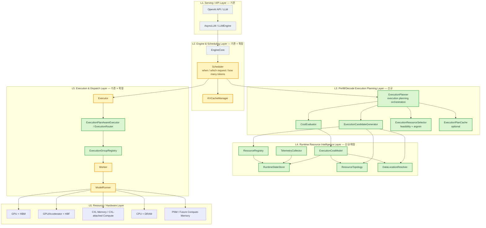
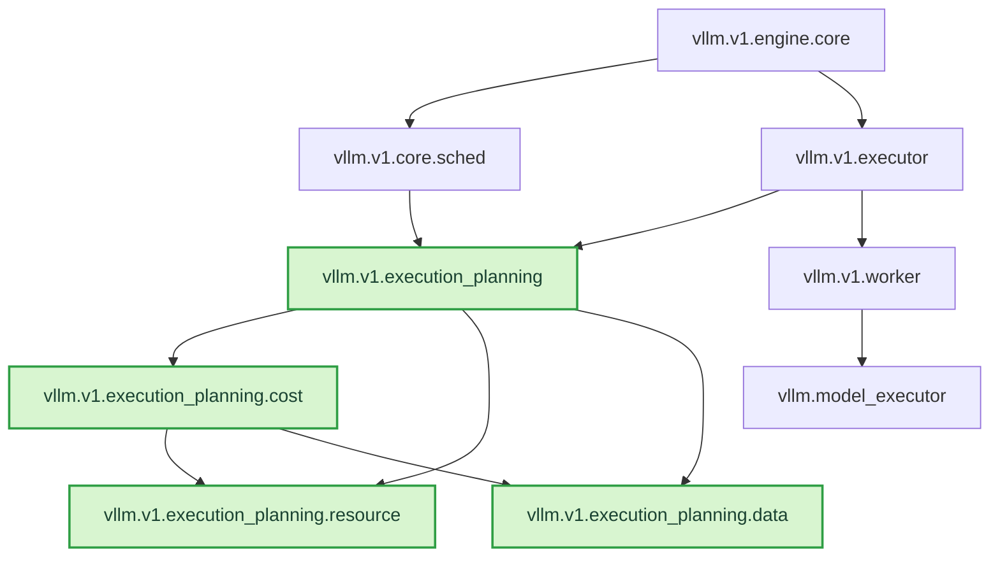
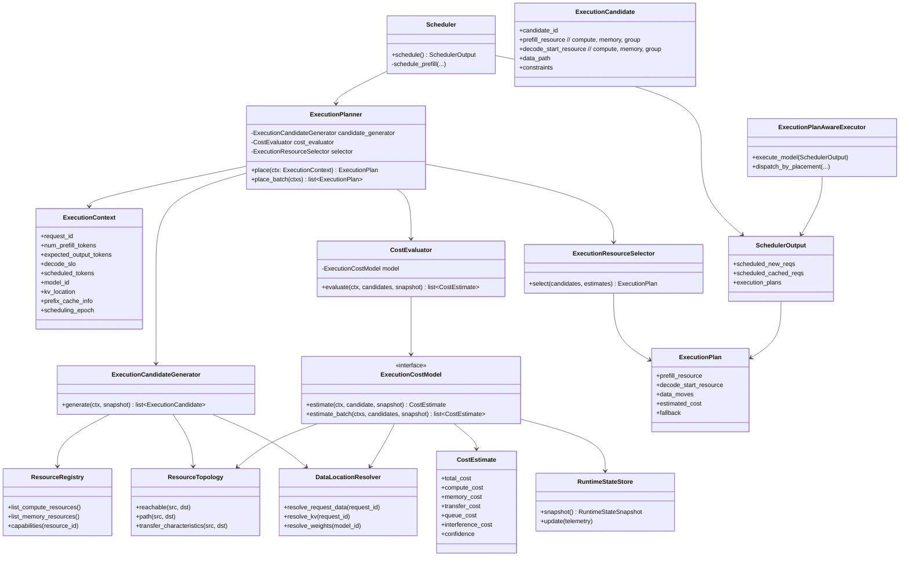
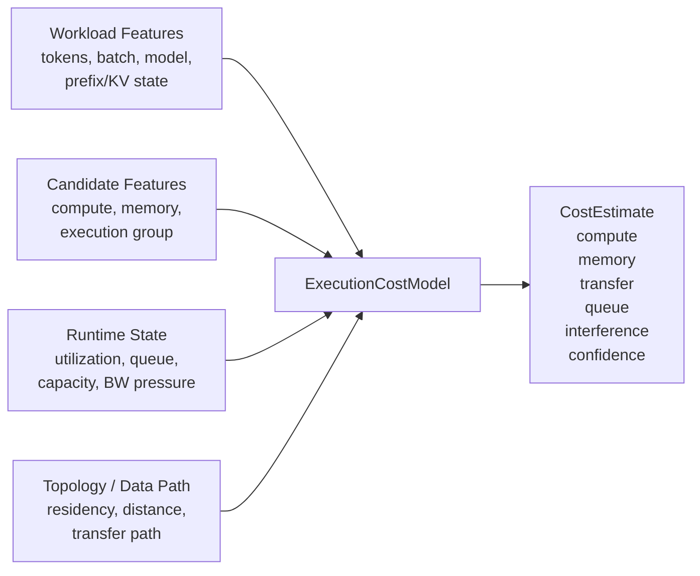
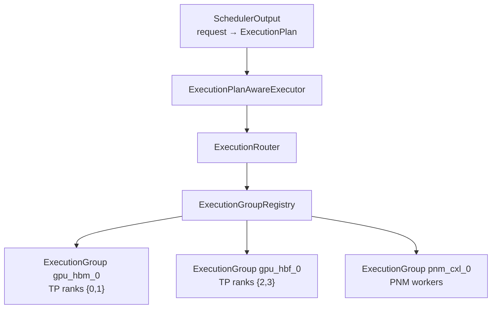
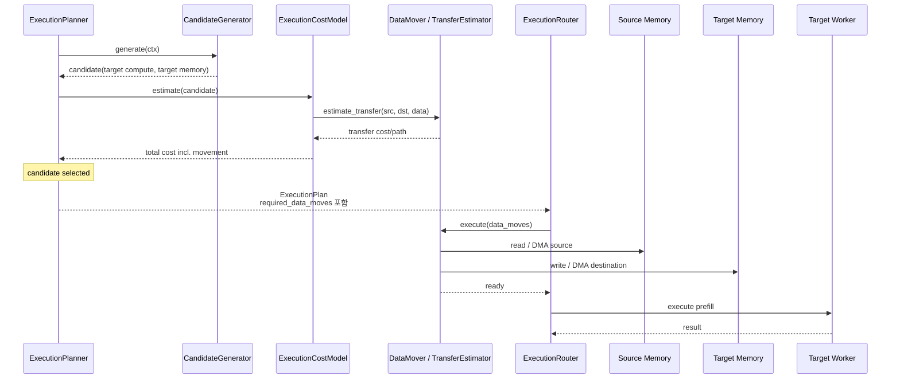
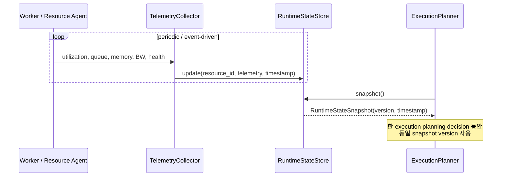
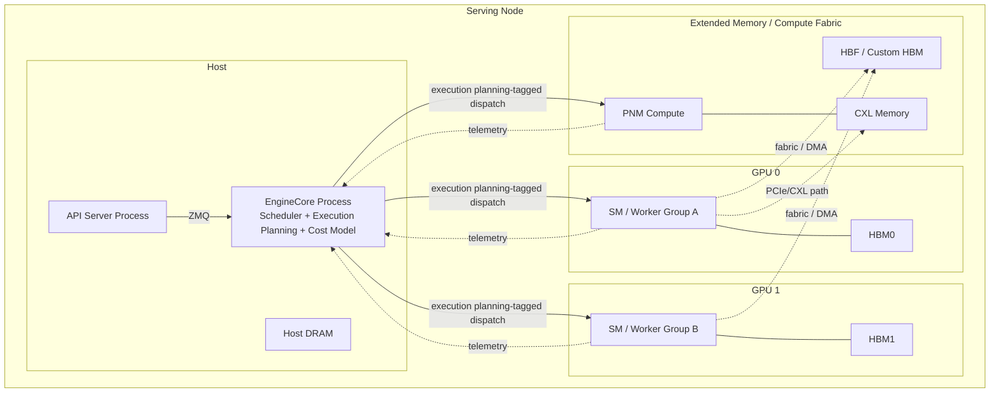

# vLLM Cost-Model-Based Prefill/Decode Execution Planning — Architecture Design

> 기준 브랜치: `claude/vllm-call-path-analysis-qxulkr`  
> 기준 코드 분석: `doc-mk/vllm-call-path-analysis.md` 및 `doc-mk/vllm-*.md` 중 DP 문서 제외  
> 설계 범위: **Turn 단위로 Prefill 실행 위치(n_p)와 Decode 시작 위치(n_d)를 cost model로 선택하고, 선택 결과를 실제 execution resource까지 전달·실행하는 runtime 구조**
>
> 이 문서는 후보 구조 비교가 아니라, **cost-model-based prefill/decode execution plan을 vLLM V1에 실제로 넣는다면 어떤 layer/module/component 경계를 가져야 하는지**를 정의한다.

---

## 0. 현재 vLLM에서 삽입해야 할 위치

현재 V1의 핵심 요청 실행 경로는 다음과 같다.

```text
EngineCore.step()
    │
    ├─ Scheduler.schedule()
    │      └─ SchedulerOutput
    │
    ├─ Executor.execute_model(SchedulerOutput)
    │
    └─ Scheduler.update_from_output()
             │
             ▼
Worker.execute_model()
    │
    ▼
GPUModelRunner.execute_model()
    │
    ▼
model.forward()
```

현재 `Scheduler`는 **어떤 request가 이번 step에서 몇 token을 실행할지**를 결정하지만,
"그 prefill을 어느 compute-memory resource에서 실행할지"를 별도 1급 개념으로 결정하지 않는다.
또한 `MultiprocExecutor`의 worker들은 기본적으로 TP/PP execution group으로 동작하며,
`SchedulerOutput`을 받아 정해진 device에서 실행한다.

따라서 cost-model execution plan을 넣으려면 단순히 `Scheduler.schedule()` 안에
`argmin(cost)` 한 줄을 추가하는 것으로 끝나지 않는다. 최소한 다음 네 책임을 분리해야 한다.

1. **Candidate Discovery** — 이 request의 prefill을 실행할 수 있는 resource 조합은 무엇인가?
2. **Cost Estimation** — 각 candidate에서 실행했을 때 end-to-end cost는 얼마인가?
3. **Execution Planning Decision** — feasible candidate 중 어떤 execution execution plan을 선택할 것인가?
4. **Execution Routing** — 결정된 execution plan을 실제 Worker/Compute Resource에 어떻게 전달할 것인가?

핵심 원칙은 다음과 같다.

> **Scheduler는 "언제/얼마나 실행할지"를 결정하고, Prefill/Decode Execution Planning 계층은 "어디서 실행할지"를 결정한다. Cost Model은 실행 위치를 직접 dispatch하지 않는다.**

---

# 1. Architectural Drivers

## 1.1 Functional Requirements

Cost model은 최소한 다음 입력을 사용할 수 있어야 한다.

- Request/workload
  - prefill token 수
  - chunked-prefill 크기
  - batch composition
  - model / layer / dtype
  - prefix-cache hit 및 이미 존재하는 KV 위치
- Compute resource
  - compute capability / throughput
  - 현재 utilization
  - queue depth
  - 지원 operation
- Memory resource
  - capacity / free space
  - bandwidth / latency
  - 현재 pressure
  - data/KV residency
- Topology / movement
  - source ↔ target bandwidth
  - transfer latency
  - direct/staged path
- Runtime interference
  - 현재 decode load
  - competing prefill
  - shared memory/fabric contention
- Decode 시작 후보 (n_d)
  - Decode 노드의 KV 수용 용량 (Tier별), 현재 batch 크기, TPOT 여유
  - 결과 KV를 n_p에서 n_d로 전달하는 경로와 비용
  - n_d의 Tier별 attention 처리 능력 (HBM, HBF 직접 읽기, ScHBM·CXL-PNM 오프로드)

출력은 단순한 `device_id`가 아니라 다음과 같은 **ExecutionPlan**여야 한다. Prefill 실행 위치(n_p)와 Decode 시작 위치(n_d)를 하나의 plan으로 결정한다.

```text
ExecutionPlan
 ├─ prefill
 │   ├─ compute_resource_id
 │   ├─ memory_resource_id
 │   └─ execution_group_id
 ├─ decode_start
 │   ├─ compute_resource_id
 │   ├─ memory_resource_id        # 결과 KV가 놓일 Tier
 │   └─ execution_group_id
 ├─ required_data_moves           # History KV 이동 + 결과 KV의 n_p → n_d 전달
 ├─ estimated_cost                # Cost(n_p, n_d)
 └─ decision_metadata
```

즉 "GPU 1에서 실행"이 아니라 **Compute + Memory + Data Movement를 포함하고 Prefill과 Decode 시작 위치를 함께 정하는 실행 계획**이다.
Decode 실행 중 Tier 간 KV 이동은 이 계층의 책임이 아니다(DP1).

## 1.2 Quality Attributes

- **Hot-path overhead 제한**: 매 scheduling step에서 호출될 수 있으므로 cost evaluation은 bounded 해야 한다.
- **Extensibility**: GPU/HBM 외 HBF, CXL-attached accelerator, PNM 등 추가 시 Scheduler 수정 최소화.
- **Explainability**: execution plan 결과와 cost breakdown을 기록할 수 있어야 한다.
- **Fallback safety**: cost model 실패/telemetry stale/candidate 없음 시 기존 GPU execution으로 복귀.
- **Separation of concerns**: scheduling, prediction, topology, dispatch 책임을 한 class에 몰지 않는다.
- **Execution consistency**: estimator가 평가한 candidate와 dispatcher가 실제 실행하는 resource가 동일해야 한다.

---

# 2. Layered Architecture



### Layer 책임

| Layer | 책임 | execution planning 관점 |
|---|---|---|
| Serving/API | request ingress/egress | execution plan을 모름 |
| Engine/Scheduling | continuous batching, token budget, KV allocation | **execution planning 요청을 생성하고 결과를 SchedulerOutput에 반영** |
| Prefill/Decode Execution Planning | 후보 생성 → 비용 평가 → 선택 | **의사결정의 중심** |
| Resource Intelligence | resource/data/topology/runtime state를 표준화 | cost model에 raw HW 지식이 새지 않게 함 |
| Execution/Dispatch | execution plan을 실제 execution group으로 routing | **결정을 실행으로 변환** |
| Hardware | 실제 compute/memory | 플러그인/adapter 뒤에 숨김 |

---

# 3. Module View

기존 vLLM package 구조를 최대한 유지하면서 신규 모듈을 `vllm/v1/execution_planning/`에 모은다.

```text
vllm/
└── v1/
    ├── engine/
    │   └── core.py                         # existing
    │
    ├── core/
    │   ├── sched/
    │   │   ├── scheduler.py                # modified
    │   │   └── output.py / interface.py    # modified: execution plan metadata
    │   │
    │   └── kv_cache_manager.py             # modified only if execution planning affects KV allocation
    │
    ├── execution planning/                          # NEW
    │   ├── manager.py                      # ExecutionPlanner
    │   ├── candidate.py                    # CandidateGenerator / ExecutionCandidate
    │   ├── selector.py                     # ExecutionResourceSelector
    │   ├── cost/
    │   │   ├── base.py                     # ExecutionCostModel interface
    │   │   ├── model.py                    # concrete cost model
    │   │   └── evaluator.py                # batch evaluation + cost breakdown
    │   ├── resource/
    │   │   ├── registry.py                 # ResourceRegistry
    │   │   ├── topology.py                 # ResourceTopology
    │   │   ├── state.py                    # RuntimeStateStore / snapshots
    │   │   └── telemetry.py                # TelemetryCollector
    │   ├── data/
    │   │   └── location.py                 # DataLocationResolver
    │   └── types.py                        # ExecutionPlan etc.
    │
    ├── executor/
    │   ├── abstract.py                     # modified
    │   ├── multiproc_executor.py           # modified
    │   └── execution_router.py             # NEW
    │
    └── worker/
        ├── gpu_worker.py                    # modified
        └── gpu_model_runner.py              # modified/adapter
```



### 의존성 규칙

1. `Scheduler`는 구체적인 cost-model 구현을 import하지 않는다. `ExecutionPlanner`만 호출한다.
2. `ExecutionCostModel`은 Worker/Executor를 호출하지 않는다. **pure estimation** 역할만 가진다.
3. `Executor`는 cost를 다시 계산하지 않는다. `ExecutionPlan`를 소비한다.
4. Telemetry producer와 decision consumer 사이에는 `RuntimeStateSnapshot`을 둔다.
5. Hardware-specific adapter는 `ResourceRegistry` 또는 Worker 쪽에 위치시키고 Scheduler까지 노출하지 않는다.

---

# 4. Core Domain Model / Class Diagram




## 4.1 C1/C2 Class Delta

Core domain model은 대부분 공통이다. `ExecutionPlanner`, `ExecutionCandidateGenerator`,
`ExecutionCostModel`, `ExecutionResourceSelector`, `ExecutionRouter`는 두 후보가 동일하게 사용한다.

- **C1**: 위 공통 class만으로 동작한다. Scheduler가 `plan_batch()`를 직접 호출한다.
- **C2**: 사전 계획의 lifecycle을 위해 아래 세 class가 추가되는 것이 핵심 delta다.

~~~mermaid
classDiagram
    class ExecutionPlanner {
        +plan(ctx) ExecutionPlan
    }
    class ExecutionPlanCache {
        +put(request_id, plan, snapshot_version)
        +get(request_id) ExecutionPlan
        +invalidate(request_id)
    }
    class PlanValidator {
        +validate(plan, latest_state) ValidationResult
    }
    class ExecutionPlan {
        +ranked_candidates
        +planned_at
        +snapshot_version
        +estimated_costs
    }
    class Replanner {
        +replan(ctx, latest_state) ExecutionPlan
    }

    ExecutionPlanner --> ExecutionPlanCache : C2 only
    ExecutionPlanCache --> ExecutionPlan
    PlanValidator --> ExecutionPlan
    PlanValidator --> Replanner : stale/invalid
    Replanner --> ExecutionPlanner
~~~

C2의 복잡도는 Cost Model 자체가 아니라 **plan age / cache / validation / invalidation / re-plan**
상태 관리에서 증가한다.

---

# 5. Cost Model Boundary

Cost model이 모든 책임을 먹는 "god object"가 되지 않도록 입력을 명확히 제한한다.



Cost model은 **후보를 만들지 않는다**. 예를 들어 어떤 accelerator가 현재 model/dtype을
지원하지 않으면 Cost Model이 `infinite cost`를 주는 방식보다
`ExecutionCandidateGenerator` 단계에서 제거하는 것이 책임 분리에 맞다.

권장 평가식의 논리적 형태는 다음과 같다.

```text
TotalCost(candidate)
    = ComputeCost
    + MemoryAccessCost
    + RequiredDataMovementCost
    + QueueingCost
    + InterferenceCost
    + Penalty / Risk
```

실제 구현은 analytical / learned / hybrid 중 무엇이든 `ExecutionCostModel` 뒤에서 교체 가능하다.
아키텍처는 cost model의 내부 알고리즘에 의존하지 않는다.

---

# 6. Scheduler Integration View

## 6.1 공통 경계

두 후보 모두 Scheduler가 **어떤 request를 이번 step에서 몇 token 실행할지**를 결정하고,
`ExecutionPlanner`가 **어느 compute-memory resource에서 prefill을 실행할지**를
cost 기반으로 결정한다는 책임 분리는 동일하다.

차이는 **Execution Planning을 언제 수행하느냐**이다.

- **C1 — 스케줄링 시점 결정 구조 (Scheduling-time Resource Selection)**:
  Scheduler가 실제 request/token budget을 확정한 뒤 즉시 Cost Model을 실행하고 resource를 결정한다.
- **C2 — 사전 계획 결정 구조 (Pre-planned Resource Selection)**:
  waiting request에 대해 Execution Plan을 미리 계산·저장하고, Scheduler는 실행 시점에 plan을 조회·검증한다.

KV allocation 위치까지 Execution Plan이 결정하는 경우에는 두 후보 모두
`KV requirement calculation → execution planning → KV allocation commit`의 2-phase 처리가 필요하다.

### 6.2 C1 — 스케줄링 시점 결정 구조

C1은 **Scheduler critical path 안에서** 최신 state와 실제 scheduled workload를 사용한다.

~~~mermaid
flowchart TD
    A["Scheduler.schedule()"]
    B["1. waiting/running request 선택"]
    C["2. token budget 결정<br/>chunked prefill 포함"]
    D["3. KV requirement / prefix-cache 정보 확정"]
    E["4. ExecutionContext 생성"]
    F["5. ExecutionPlanner.plan_batch()"]
    RS["ResourceStateMonitor<br/>latest snapshot"]
    CM["ExecutionCostModel"]
    G["6. SchedulerOutput 생성<br/>+ execution_plans"]
    H["Executor.execute_model()"]

    A --> B --> C --> D --> E --> F --> G --> H
    RS --> F
    CM --> F
~~~

**특징**

- Cost Model 입력의 batch/token 정보가 실제 이번 step과 일치한다.
- resource queue, memory pressure, bandwidth 등 state가 execution 시점과 가깝다.
- 대신 Cost evaluation 전체가 scheduling critical path의 decision latency에 포함된다.
- 별도 Plan Cache / Plan Validation / Re-plan lifecycle이 필요하지 않다.

### 6.3 C2 — 사전 계획 결정 구조

C2는 **waiting time을 이용해 Execution Plan을 사전 계산**하고 Scheduler hot path에서는
plan lookup과 빠른 validation만 수행한다.

~~~mermaid
flowchart TD
    ARR["Request Arrival / Waiting"]
    P["ExecutionPlanner<br/>async planning"]
    RS["ResourceStateMonitor<br/>planning-time snapshot"]
    CM["ExecutionCostModel"]
    PC["ExecutionPlanCache<br/>ranked candidates + snapshot version"]

    S["Scheduler.schedule()"]
    L["Plan Lookup"]
    V{"Plan Validation<br/>still usable?"}
    G["SchedulerOutput<br/>+ validated ExecutionPlan"]
    R["Re-plan / fallback"]
    E["Executor.execute_model()"]

    ARR --> P
    RS --> P
    CM --> P
    P --> PC

    S --> L --> V
    PC --> L
    V -- yes --> G --> E
    V -- stale / invalid --> R --> G
~~~

**특징**

- Cost evaluation을 Scheduler critical path 밖으로 이동시켜 decision latency를 줄일 수 있다.
- request/candidate 증가 시 planning worker, batch evaluation 등으로 planning compute를 독립 확장할 수 있다.
- planning 시점과 execution 시점 사이에 queue/utilization/memory pressure가 바뀌면 stale plan이 될 수 있다.
- 따라서 `ExecutionPlanCache`, plan age/version, validation, invalidation, re-plan/fallback 관리가 추가된다.

---

# 7. Component View — Runtime Process Boundary

## 7.1 공통 Process Boundary

API Server / EngineCore / Worker라는 현재 vLLM V1 프로세스 경계는 두 후보 모두 유지한다.
또한 다음 책임도 공통이다.

- **EngineCore**: Scheduler + ExecutionPlanner + Cost Model + Resource State snapshot
- **Worker**: telemetry producer + 실제 model execution
- **ExecutionRouter**: 선택된 Execution Plan을 적절한 execution group/worker로 전달
- **Cost Model**: Worker 내부가 아니라 EngineCore control plane에서 전체 candidate를 비교

C1/C2의 큰 차이는 **Planner 호출이 Scheduler와 동기적으로 묶이는지,
background planning + Plan Cache로 분리되는지**다.

### 7.2 C1 — 스케줄링 시점 결정 Component View

~~~mermaid
graph LR
    subgraph P1["Process: API Server"]
        API["FastAPI / AsyncLLM"]
    end

    subgraph P2["Process: EngineCore"]
        EC["EngineCore"]
        SCH["Scheduler"]
        PLAN["ExecutionPlanner"]
        CM["ExecutionCostModel"]
        RS["ResourceStateMonitor / RuntimeStateStore"]
        EX["ExecutionPlanAwareExecutor"]
        ER["ExecutionRouter"]
    end

    subgraph P3["Worker / Execution Processes"]
        W0["GPU/HBM Worker Group"]
        W1["GPU/HBF Worker Group"]
        W2["CXL/PNM Worker Group"]
    end

    API --> EC --> SCH
    SCH -- "synchronous plan()" --> PLAN
    PLAN --> CM
    PLAN --> RS
    PLAN -- "ExecutionPlan" --> SCH
    SCH --> EX --> ER
    ER --> W0
    ER --> W1
    ER --> W2
    W0 -. telemetry .-> RS
    W1 -. telemetry .-> RS
    W2 -. telemetry .-> RS
~~~

C1은 component 수가 적고 consistency model이 단순하지만,
Planner 계산 시간이 Scheduler의 critical-path latency에 직접 포함된다.

### 7.3 C2 — 사전 계획 결정 Component View

~~~mermaid
graph LR
    subgraph P1["Process: API Server"]
        API["FastAPI / AsyncLLM"]
    end

    subgraph P2["Process: EngineCore"]
        EC["EngineCore"]
        SCH["Scheduler"]
        BG["ExecutionPlanner<br/>Background Planning Task"]
        CM["ExecutionCostModel"]
        RS["ResourceStateMonitor / RuntimeStateStore"]
        CACHE["ExecutionPlanCache"]
        VAL["PlanValidator"]
        EX["ExecutionPlanAwareExecutor"]
        ER["ExecutionRouter"]
    end

    subgraph P3["Worker / Execution Processes"]
        W0["GPU/HBM Worker Group"]
        W1["GPU/HBF Worker Group"]
        W2["CXL/PNM Worker Group"]
    end

    API --> EC
    EC -- "request arrival / waiting" --> BG
    BG --> CM
    BG --> RS
    BG --> CACHE

    EC --> SCH
    SCH --> CACHE
    CACHE --> VAL
    RS --> VAL
    VAL -- "valid plan / re-plan trigger" --> SCH

    SCH --> EX --> ER
    ER --> W0
    ER --> W1
    ER --> W2
    W0 -. telemetry .-> RS
    W1 -. telemetry .-> RS
    W2 -. telemetry .-> RS
~~~

C2는 initial implementation에서는 background planner를 같은 EngineCore process의
task/thread로 둘 수 있다. planning 부하가 커질 경우 별도 planner process로 분리할 수 있지만,
그 경우 Plan Cache/state snapshot의 IPC와 consistency 관리가 추가된다.

### 왜 Cost Model을 Worker에 두지 않는가?

Execution Planning은 여러 resource candidate의 **end-to-end cost**를 비교해야 하며,
특히 data movement cost는 source/destination/topology를 함께 알아야 한다.
따라서 각 Worker가 자신의 local cost만 독립 평가하는 구조보다,
EngineCore control plane에서 공통 `ResourceTopology`, `DataLocationResolver`,
`RuntimeStateSnapshot`을 사용해 평가하는 구조를 유지한다.

---

# 8. Execution Routing View

> **C1/C2 delta가 작음.** 두 후보 모두 최종 `ExecutionPlan`을 `ExecutionRouter`가
> execution group으로 변환한다. C2만 dispatch 직전에 plan validation 결과를 함께 소비한다.

Cost model이 execution plan을 선택해도 현재 `MultiprocExecutor`가 모든 execution plan을 자동으로
실행할 수 있는 것은 아니다. 기존 worker group은 TP/PP rank의 실행 집합이다.

따라서 heterogeneous execution을 지원하려면 **ExecutionGroup**을 1급 개념으로 둔다.



`ExecutionGroup`은 최소한 다음을 가진다.

```text
ExecutionGroup
 ├─ group_id
 ├─ worker_ids
 ├─ compute_resource_ids
 ├─ visible_memory_resources
 ├─ model_replica / shard mapping
 ├─ supported_model_config
 └─ dispatch_endpoint
```

### 중요한 제약

Prefill을 다른 execution group으로 보낼 수 있으려면 해당 group이 **동일 model weights를
실행할 수 있어야 한다**. 따라서 candidate generation은 단순 HW capability뿐 아니라
model replica/shard availability를 반드시 검사해야 한다.

```text
HW can execute?
      AND
model weights available?
      AND
required input/KV reachable?
      AND
target KV memory allocatable?
      ↓
feasible ExecutionCandidate
```

---

# 9. Main Sequence Diagram — Cost-Based Prefill/Decode Execution Planning

Data movement 계산, candidate feasibility, Cost Model 자체는 두 후보가 동일하다.
가장 큰 sequence 차이는 **Cost evaluation과 resource decision이 언제 일어나는가**이다.

## 9.1 C1 — 스케줄링 시점 결정

~~~mermaid
sequenceDiagram
    participant EC as EngineCore
    participant S as Scheduler
    participant P as ExecutionPlanner
    participant RS as ResourceStateMonitor
    participant CM as ExecutionCostModel
    participant ER as ExecutionRouter
    participant W as Selected Worker

    EC->>S: schedule()
    Note over S: request 선택 + token budget 확정

    S->>P: plan_batch(ExecutionContext[])
    P->>RS: latest snapshot()
    RS-->>P: RuntimeStateSnapshot

    loop feasible execution candidates
        P->>CM: estimate(context, candidate, snapshot)
        CM-->>P: CostEstimate
    end

    P-->>S: ExecutionPlan[]
    S-->>EC: SchedulerOutput + plans
    EC->>ER: dispatch(plans)
    ER->>W: execute prefill
    W-->>EC: ModelRunnerOutput
    EC->>S: update_from_output()
~~~

C1은 `schedule() → Cost evaluation → resource decision → dispatch`가 한 critical path에 있다.

## 9.2 C2 — 사전 계획 결정

~~~mermaid
sequenceDiagram
    participant EC as EngineCore
    participant P as ExecutionPlanner
    participant RS as ResourceStateMonitor
    participant CM as ExecutionCostModel
    participant PC as ExecutionPlanCache
    participant S as Scheduler
    participant V as PlanValidator
    participant ER as ExecutionRouter
    participant W as Selected Worker

    EC->>P: request waiting / planning trigger
    P->>RS: planning-time snapshot()
    RS-->>P: RuntimeStateSnapshot

    loop feasible execution candidates
        P->>CM: estimate(context, candidate, snapshot)
        CM-->>P: CostEstimate
    end

    P->>PC: store ranked ExecutionPlan

    Note over EC,S: 이후 request가 queue에서 대기

    EC->>S: schedule()
    S->>PC: get(request_id)
    PC-->>S: cached ExecutionPlan
    S->>V: validate(plan, latest state)

    alt plan valid
        V-->>S: use cached candidate
    else stale / invalid
        V-->>S: re-plan / fallback required
        S->>P: replan(context, latest state)
        P-->>S: refreshed ExecutionPlan
    end

    S-->>EC: SchedulerOutput + validated plan
    EC->>ER: dispatch(plan)
    ER->>W: execute prefill
    W-->>EC: ModelRunnerOutput
~~~

C2의 핵심 위험은 **plan-time state와 execution-time state의 drift**다.
특히 queue가 길어질수록 `plan_age = t_execute - t_plan`이 증가해 stale plan 가능성이 커진다.

---

# 10. Sequence Diagram — Data Movement가 필요한 Candidate

> **C1/C2 delta가 작음.** data movement cost 계산과 실제 transfer path는 공통이다.
> C1은 이 계산이 scheduling 시점에, C2는 사전 planning 시점에 수행된다는 timing 차이만 있다.

예: prompt/prefix KV는 HBM0에 있으나 cost model이 다른 compute-memory resource를 선택한 경우.



**원칙:** transfer cost의 "견적"과 실제 transfer path는 동일한 topology/data-movement
provider를 사용해야 한다. 그렇지 않으면 cost model이 평가한 경로와 실행 경로가 달라진다.

---

# 11. Telemetry / State Update Sequence

> **수집 구조는 공통**이다. C1은 decision 직전에 latest snapshot을 한 번 읽고,
> C2는 planning 시점 snapshot과 validation 시점 latest state를 비교한다.

Telemetry 수집을 scheduling hot path에서 synchronous RPC로 하면 execution planning 자체가 병목이 된다.
따라서 Worker → StateStore는 비동기 push, decision은 immutable snapshot read 방식으로 둔다.



필수 필드는 `timestamp`와 `freshness`다. stale telemetry는 cost model이 높은
uncertainty/penalty로 처리하거나 candidate를 제거할 수 있다.

---

# 12. Deployment View

> **기본 deployment는 공통**이다. C2도 우선은 EngineCore 내부 background task로 구현할 수 있어
> 별도 process가 필수는 아니다. planning 부하를 독립 scale-out할 때만 planner process 분리를 고려한다.



---

# 13. Failure / Fallback Path

Cost Model 또는 target resource의 실패가 serving availability를 깨면 안 된다는 원칙은 공통이다.
다만 C2는 cached plan의 stale/invalid 상태를 추가로 처리해야 한다.

## 13.1 C1 — 스케줄링 시점 결정

~~~mermaid
flowchart TD
    A["ExecutionPlanner.plan()"]
    B{"fresh snapshot?"}
    C{"feasible candidate?"}
    D{"cost evaluation success?"}
    E["selected ExecutionPlan"]
    F["default vLLM GPU execution"]
    G["ExecutionRouter dispatch"]
    H{"target healthy?"}
    I["execute"]

    A --> B
    B -- no --> F
    B -- yes --> C
    C -- no --> F
    C -- yes --> D
    D -- no --> F
    D -- yes --> E --> G
    F --> G
    G --> H
    H -- yes --> I
    H -- no --> F
~~~

C1은 execution 직전에 decision을 만들기 때문에 별도의 cached-plan consistency 문제가 없다.

## 13.2 C2 — 사전 계획 결정

~~~mermaid
flowchart TD
    A["Cached ExecutionPlan"]
    B["Plan Validation<br/>age / resource health / capacity / queue"]
    C{"plan usable?"}
    D["use selected candidate"]
    E{"backup ranked candidate usable?"}
    F["use backup candidate"]
    G["synchronous re-plan"]
    H{"re-plan success?"}
    I["default vLLM GPU execution"]
    J["ExecutionRouter dispatch"]
    K["execute"]

    A --> B --> C
    C -- yes --> D --> J --> K
    C -- stale / invalid --> E
    E -- yes --> F --> J
    E -- no --> G --> H
    H -- yes --> J
    H -- no --> I --> J
~~~

### C2에서 stale plan의 의미

`stale`은 반드시 실행 불가능하다는 뜻은 아니다.

1. **Valid & still good** — 그대로 사용
2. **Feasible but sub-optimal** — 실행은 가능하지만 queue/load 변화로 더 좋은 candidate가 생김
3. **Invalid** — memory 부족, resource unavailable, 지원 조건 변경 등으로 계획대로 실행 불가

따라서 C2는 `ranked candidate`, `plan_age`, `snapshot_version`,
`validation_result`, `replan_count`를 관리하는 것이 좋다.

### C2 Late Validation — 상태 유사도 검증 (설계 결정, 2026-10-08)

plan을 저장할 때 plan이 의존한 **핵심 상태값**을 함께 저장하고, dispatch 직전에 현재 상태와 비교한다. plan age 같은 시간 기준 대신 "상태가 얼마나 달라졌는가"를 본다.

**저장하는 상태값 (후보별: 선택 plan + 백업 후보)**

| 구분 | 값 | 관련 Cost 항 |
|---|---|---|
| n_p 노드 | `pf_tokens`(대기 Prefill 토큰), `njobs`, `ndec`(실행 중 Decode 수) | 대기 시간, 기존 Decode 간섭 |
| n_d (노드, Tier) | `free`(Tier 여유 용량), `ndec`(resident Decode 수) | 용량 제약, TPOT, resident 간섭 |
| 전송 경로 | 경로 자원의 동시 흐름 수 `flows` | 전송 시간 |
| 후보별 Cost | 저장 시점의 `Cost`(선택 plan과 백업 각각) | 비교 기준 |
| 요청·세션 | History KV 위치 (node, tier) | 정확히 일치해야 함 |

추정치인 도착률 EWMA(`lam`)는 노이즈가 커서 비교에 넣지 않는다.

**판정**

1. **Hard**: 노드 health, n_d 용량(이 요청 KV가 아직 들어가는가), History 위치, 노드 큐 한도. 하나라도 어긋나면 그 후보는 무효.
2. **Soft**: 현재 상태에서 같은 plan의 Cost를 다시 계산해 저장 Cost와 비교한다. `Cost_now ≤ Cost_stored × (1 + tol)`이면 유효이고 기본 `tol = 10%`(5/10/20% 민감도). Cost가 줄어든 변화는 허용한다.
3. 선택 plan이 무효이면 백업 후보를 같은 방식으로 검사하고, 모두 무효이면 Re-planner가 최신 상태로 재계획한다.

한계: 저장한 상태에 포함되지 않은 노드가 더 좋아진 경우는 잡지 못한다. 그 판단은 plan의 선택 후보와 백업 후보 범위 안에서만 한다.

Fallback은 별도 heuristic policy를 의미하지 않는다.
최종 실패 시 **기존 vLLM GPU execution path를 안전 경로로 보존**한다.

---

# 14. Observability View

Cost model 기반 시스템은 "왜 그 위치를 골랐는가"를 재현할 수 있어야 한다.

각 decision에 다음 record를 남긴다.

```text
ExecutionPlanningDecisionRecord
 ├─ request_id
 ├─ scheduling_epoch
 ├─ state_snapshot_version
 ├─ candidate_ids[]
 ├─ candidate_costs[]
 │    ├─ compute
 │    ├─ memory
 │    ├─ transfer
 │    ├─ queue
 │    └─ interference
 ├─ selected_candidate
 ├─ confidence
 ├─ actual_execution_group
 ├─ actual_prefill_latency
 └─ fallback_reason
```

이를 이용하면 offline에서 다음을 계산할 수 있다.

- predicted vs actual prefill latency
- candidate별 prediction error
- execution planning switch frequency
- decision overhead
- transfer overhead
- stale-state decision 비율
- fallback 비율

---

# 15. 기존 vLLM 코드 기준 변경 지점

| 현재 파일/영역 | 변경 | 이유 |
|---|---|---|
| `vllm/v1/core/sched/scheduler.py` | 수정 | execution context 생성(Prefill/Decode) 및 execution planner 연계 |
| `SchedulerOutput` 관련 type | 수정 | request별 `ExecutionPlan` 전달 |
| `vllm/v1/engine/core.py` | 소폭 수정 | execution planning subsystem lifecycle/init, telemetry wiring |
| `vllm/v1/executor/abstract.py` | interface 확장 | execution-plan-aware dispatch contract |
| `vllm/v1/executor/multiproc_executor.py` | 수정 | 단일 broadcast 외 execution-group routing 지원 |
| `vllm/v1/worker/gpu_worker.py` | 수정 | execution plan metadata 소비, telemetry publish |
| `vllm/v1/worker/gpu_model_runner.py` | 최소 수정/adapter | 선택된 memory/compute path 실행 |
| `vllm/v1/execution_planning/*` | 신규 | execution planning/cost/resource intelligence 책임 |
| KV cache 관련 manager | 조건부 수정 | execution planning가 KV allocation tier까지 결정할 경우 |

---

# 16. 구현 단계 제안

처음부터 모든 heterogeneous resource를 붙이지 않고 architecture boundary를 유지한 채 단계적으로 구현한다.

### Phase 1 — Decision path만 삽입

- `ExecutionPlanner`, `ExecutionCostModel`, `ExecutionPlan` 추가
- candidate는 기존 GPU execution group들만 사용
- SchedulerOutput에 execution plan metadata 추가
- predicted/actual latency logging
- 기존 execution path와 기능 동등성 확인

### Phase 2 — Execution Planning-aware Executor

- `ExecutionGroupRegistry`와 `ExecutionRouter` 추가
- 여러 GPU/model replica 사이 prefill routing
- Worker telemetry → `RuntimeStateStore`
- queue/utilization을 cost에 반영

### Phase 3 — Heterogeneous Memory/Compute

- `ResourceTopology`, `DataLocationResolver`, DataMover 연계
- HBF/CXL/PNM candidate 등록
- transfer cost + data residency 포함
- execution plan 결과에 따른 KV allocation/movement 연동

이 순서를 따르면 cost model 자체와 heterogeneous hardware enablement를 분리해서 검증할 수 있다.

---

# 17. 최종 Architecture Summary

```text
                    ┌──────────────────────────────┐
                    │          Scheduler           │
                    │  Who / When / How many token │
                    └──────────────┬───────────────┘
                                   │ ExecutionContext
                                   ▼
                    ┌──────────────────────────────┐
                    │  ExecutionPlanner     │
                    └───────┬─────────┬────────────┘
                            │         │
                  candidates│         │cost
                            ▼         ▼
                 ┌──────────────┐  ┌──────────────┐
                 │ Candidate    │  │ Cost         │
                 │ Generator    │  │ Evaluator    │
                 └──────┬───────┘  └──────┬───────┘
                        │                 │
          ┌─────────────┼─────────────┐   │
          ▼             ▼             ▼   ▼
      Resource       Topology       Data  Runtime
      Registry                        Location State
          └─────────────┬─────────────┘
                        ▼
                 ┌──────────────┐
                 │ Execution Planning    │
                 │ Selector     │
                 └──────┬───────┘
                        │ ExecutionPlan
                        ▼
                 ┌──────────────┐
                 │ Scheduler    │
                 │ Output       │
                 └──────┬───────┘
                        ▼
                 ┌──────────────┐
                 │ Execution Planning-   │
                 │ Aware        │
                 │ Executor     │
                 └──────┬───────┘
                        ▼
                 ┌──────────────┐
                 │ Execution    │
                 │ Router       │
                 └───┬────┬─────┘
                     │    │
              ┌──────┘    └────────┐
              ▼                    ▼
         GPU/HBM Worker       Heterogeneous
                              Compute-Memory
```

가장 중요한 경계는 다음 세 문장으로 정리된다.

1. **Scheduler owns scheduling; PlacementManager owns execution planning.**
2. **CostModel estimates; it does not select or execute.**
3. **Executor executes the selected ExecutionPlan; it does not reinterpret the decision.**

이렇게 분리해야 cost model을 교체하거나 resource 종류가 늘어나도 기존 vLLM scheduling
hot path와 execution implementation의 결합이 커지지 않는다.

---


# 18. C1/C2 View Delta Summary — PPT 상세 설명용

문서의 모든 view를 후보별로 복제할 필요는 없다. 실제 차이가 큰 view만 후보별 그림을 유지한다.

| View | C1/C2 차이 | 문서 표현 |
|---|---|---|
| Layered Architecture | 작음 | 공통 그림 유지. C2에 Plan Cache/Validation 책임이 추가됨을 설명 |
| Module View | 작음~중간 | 공통 그림 유지. C2에 cache/validator/replanner module 추가 설명 |
| Core Class Diagram | 중간 | 공통 class + C2 delta class diagram |
| Cost Model Boundary | 거의 없음 | 공통 그림만 유지 |
| **Scheduler Integration** | **큼** | **C1/C2 각각 그림** |
| **Component View** | **큼** | **C1/C2 각각 그림** |
| Execution Routing | 작음 | 공통 그림만 유지 |
| **Main Sequence** | **매우 큼** | **C1/C2 각각 sequence** |
| Data Movement | 작음 | 공통 sequence 유지 |
| Telemetry | 작음 | 공통 sequence + snapshot 사용 시점 설명 |
| Deployment | 작음 | 공통 그림 유지 |
| **Failure/Fallback** | **큼** | **C1/C2 각각 그림** |
| Observability | 중간 | C2의 plan age/validation/replan field만 추가 |

PPT에서는 다음 네 그림만 후보별 상세로 가져가면 차이를 충분히 설명할 수 있다.

1. Scheduler Integration
2. Component View
3. Main Sequence
4. Failure / Stale Plan Handling

나머지는 **공통 Architecture**로 먼저 설명한 뒤, C2에만 추가되는
`ExecutionPlanCache → PlanValidator → Re-planner`를 delta로 설명하는 것이 가장 단순하다.

---

# 19. 참고한 기존 분석 문서

본 설계는 해당 브랜치의 다음 비-DP 문서에서 정리된 현재 V1 구조와 메모리/compute 추상화 분석을 기준으로 작성했다.

- `doc-mk/vllm-call-path-analysis.md`
- `doc-mk/vllm-compute-capable-memory-candidates.md`
- `doc-mk/vllm-kv-cache-analysis.md`
- `doc-mk/vllm-kv-cache-memory-abstraction-layer.md`
- `doc-mk/vllm-kv-cache-memory-tiering.md`
- `doc-mk/vllm-memory-abstraction-capability-oriented.md`
- `doc-mk/vllm-memory-abstraction-level-candidates.md`
- `doc-mk/vllm-memory-access-timing-candidates.md`
- `doc-mk/vllm-memory-coordination-locus-candidates.md`
