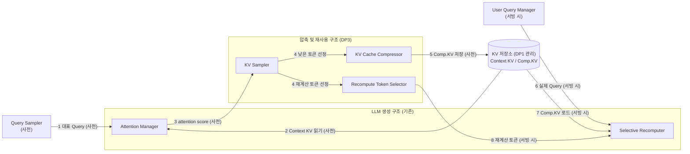
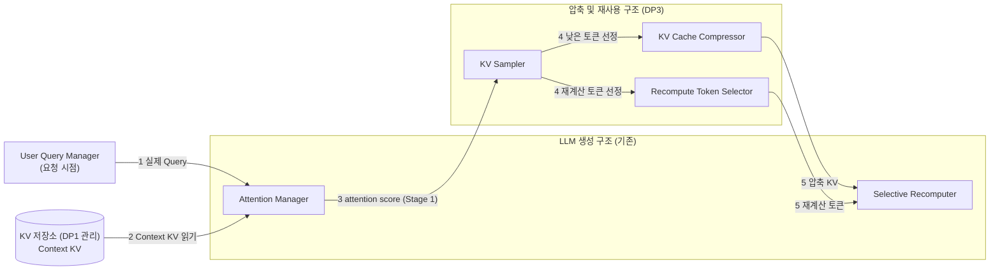

# DP3 구조 정리 (초안) — KV 캐시 압축·재사용 구조와 DP1·DP2 연결

| 항목 | 내용 |
|---|---|
| 상태 | **초안 (제안)** — 원본 `dp3-long-context-kv-cache-eviction.md`는 수정하지 않았다 |
| 작성 일자 | 2026-10-03 |
| 기준 자료 | 사용자 제공 `DP3.pptx`(모듈 구조도), [`dp3-long-context-kv-cache-eviction.md`](dp3-long-context-kv-cache-eviction.md), [`../DP1/dp1-ai-data-migration-decision-architecture.md`](../DP1/dp1-ai-data-migration-decision-architecture.md), [`../DP2/dp2-prefill-decode-execution-planning-decision-timing.md`](../DP2/dp2-prefill-decode-execution-planning-decision-timing.md) |
| 슬라이드 초안 | [`DP3-slides-draft.pptx`](DP3-slides-draft.pptx) (슬라이드 1 배경, 슬라이드 2 설계 구조도) |
| 근거 수준 | **[A]** 실측 / **[B]** 문헌 보고 (as reported) / **[C]** 구조 논증·가설. 사용자가 직접 설명한 내용은 "(사용자 설명)"으로 표기 |
| 이 문서가 대체하는 것 | 이전 초안 `dp3-scope-extension-draft.md`. 그 문서의 Drop–Blend 가정과 컴포넌트 구성은 실제 모듈 구조와 달라 폐기했다 |

---

# 0. 한눈에 보기

**하는 일 (사용자 설명)**: Long Context의 KV 캐시에서 **attention 점수가 낮은 토큰을 제거(압축)** 하고, 압축한 Context KV를 **재사용**하면서 **일부 토큰만 선택적으로 재계산**해 Accuracy를 유지한다. 중요도를 평가하는 시점에 따라 두 후보가 있고 **둘 중 하나를 선택**한다.

| 후보 | 중요도 평가 | 압축 결과(Comp.KV) |
|---|---|---|
| **C1 오프라인** | 서빙 전, 대표 Query로 attention | 사전에 만들어 저장, **요청 간 공유 가능**, 저장 위치는 어디든 가능 (사용자 설명) |
| **C2 온라인** | 요청 시점, 실제 Query로 attention (Stage 1) | 실제 Query에 의존하므로 요청 단위로 생성 [C] |

**"알고리즘을 DP 구조로 올리는" 제안**: DP1·DP2·DP3는 모두 "방식은 고정하고 **결정 변수 하나**만 후보로 가르는" 같은 틀이다(§4). DP3의 결정 변수는 **언제 결정하는가(사전 vs 요청 시점)** 이며 DP2의 결정 시점 쟁점과 같은 형태다. 알고리즘(중요도 점수, 토큰 선택)은 교체 가능한 정책 모듈로 두고, DP 수준의 결정은 **결정 시점, DP 간 데이터 계약, 검증 지점**으로 정의한다.

**DP1·DP2와의 접점 (§5)**: Comp.KV는 새로운 데이터 객체라 **저장 위치는 DP1**, 선택 재계산은 Prefill과 유사한 연산이라 **실행 자원은 DP2**가 정한다.

---

# 1. 배경

슬라이드 1의 논리와 같은 흐름이다.

| # | 내용 |
|---|---|
| ① | Multi-turn Agent·RAG에서 재사용하는 Context(KV 캐시)가 길어지고 많아져 KV 캐시의 **용량·I/O·Attention 비용**이 TTFT를 키운다 |
| ② | 모든 KV가 결과에 동일하게 기여하지 않으므로 중요도가 낮은 토큰을 제거하면 비용을 줄일 수 있으나, 잘못 제거하면 **Accuracy가 저하**된다 |
| ③ | 독립적으로 Prefill된 Context KV(Context1 KV, Context2 KV)를 압축해 이어 붙여 재사용할 때 Accuracy를 유지하려면 **일부 토큰을 선택적으로 다시 계산**해야 한다 |

**QA**: Performance Latency, Functional Correctness (슬라이드 Tradeoff 행).

### 원본 문서와 슬라이드의 틀 차이

| | 원본 DP3 문서 | 슬라이드 / 구조도 |
|---|---|---|
| 동기 | HBM Capacity Pressure, Demote로도 부족할 때 Drop | 압축·재사용으로 TTFT·I/O 절감 |
| 동작 | Demote(DP1) / Drop(DP3) 2종 | 압축(토큰 제거) + 선택 재계산 |
| 후보 | C1 Offline / C2 Online (중요도 평가 시점) | 같음 |

두 틀은 **같은 압축 동작을 다른 각도에서 본 것**이다. 토큰 제거(원본의 Drop)는 용량·I/O·Attention 비용을 모두 줄이므로 두 동기가 함께 성립한다. 다만 원본에는 **선택 재계산**과 **압축 결과의 재사용**이 없다(§7).

---

# 2. 실제 모듈 구조 (사용자 구조도 기준)

| 모듈 | 소속 | 책임 | C1 | C2 |
|---|---|---|---|---|
| **Query Sampler** | (입력) | 워크로드별 대표 Query 선정 | 사용 | 사용 안 함 |
| **User Query Manager** | (입력) | 실제 사용자 Query 관리 | 서빙 시 | 요청 시점 |
| **Attention Manager** | LLM 생성 구조 (기존) | Query와 KV 간 attention 연산 | 대표 Query × Context KV (사전) | 실제 Query × Context KV (Stage 1) |
| **KV Sampler** | 압축 및 재사용 구조 (신규)¹ | attention 점수를 바탕으로 토큰 선정 | 사전 | 요청 시점 |
| **KV Cache Compressor** | 압축 및 재사용 구조 (신규) | 중요도 낮은 토큰을 제거해 Comp.KV 생성 | 사전 | 요청 시점 |
| **Recompute Token Selector** | 압축 및 재사용 구조 (신규) | 다시 계산할 토큰 선정 | 사전(선정 결과 보관) | 요청 시점 |
| **Selective Recomputer** | LLM 생성 구조 (기존) | 선정된 토큰만 재연산 (blending과 같은 동작, 사용자 설명) | 서빙 시 | 요청 시점 |

¹ KV Sampler의 소속 컨테이너는 구조도에서 압축 및 재사용 구조 쪽에 그려진 것으로 읽었다. 정정이 필요하면 알려 달라.

선택 재계산의 구체적 방법은 이후에 정하기로 했다(사용자 설명). 이 문서는 **재계산 토큰의 선정 결과가 Selective Recomputer로 전달된다**는 데이터 흐름만 사용한다.

---

# 3. 후보 C1 / C2 — 호출 관계

C1과 C2는 **택일**이며 함께 존재하지 않는다. 번호는 슬라이드 2의 구조도와 같다.

### C1 오프라인



사전 단계(①~⑤)에서 Comp.KV와 재계산 토큰 선정 결과를 만들어 두고, 서빙 시(⑥~⑧)에는 저장된 Comp.KV를 읽어 선정된 토큰만 재계산한다.

### C2 온라인



### 비교

| | C1 오프라인 | C2 온라인 |
|---|---|---|
| 중요도 평가 시점 | 서빙 전 (사전) | 요청 시점 |
| 평가에 쓰는 Query | 대표 Query | 실제 Query |
| 서빙 경로의 연산 | 저장된 Comp.KV 로드 + 선택 재계산 | Stage 1 attention + 압축 + 선택 재계산 |
| Comp.KV 재사용 | 요청 간 공유 (사용자 설명) | 요청(Query)별 [C] |
| 장점 (슬라이드) | 사전 압축으로 TTFT 절감률 높음, 사전 압축된 KV를 읽어 I/O latency 절감 | Query-aware 압축으로 정확도 높음 |
| 단점 (슬라이드) | 대표 Query로 압축하므로 정확도 낮음 | 요청 경로에 attention 연산이 들어가 TTFT 절감률 낮음 |

---

# 4. 큰 뷰 — DP1 · DP2 · DP3는 같은 틀이다

### 4.1 결정 변수 한 줄 비교

| DP | 고정하는 것 | 후보를 가르는 결정 변수 |
|---|---|---|
| **DP1** | Event-driven Migration Scheduler | **어떤 정보로 결정하는가**: C1 Resource State-driven (Type-agnostic Placement Registry) vs C2 AI Data Behavior-driven (Type-aware AI Data Registry) |
| **DP2** | Cost Model과 Resource Selection 정책 | **언제 결정하는가**: C1 스케줄링 시점 결정 vs C2 사전 계획 결정 |
| **DP3** | Attention 기반 중요도 판단 | **언제 결정하는가**: C1 사전(오프라인, 대표 Query) vs C2 요청 시점(온라인, 실제 Query). 추가로 **Accuracy와 교환**됨 |

DP2 문서는 "Cost Model 자체를 어떻게 만들지가 아니라, 같은 모델을 쓸 때 Prefill Execution Resource를 **언제** 결정할 것인가"를 묻는다(DP2 §1). DP3도 "Attention 기반 중요도 판단을 쓴다는 전제에서 압축·재계산 토큰을 **언제** 결정할 것인가"로 같은 형태로 쓸 수 있다. 제안하는 DP3 설계 쟁점 문장:

> **Attention 기반 중요도를 사용한다는 전제에서, 압축·재계산 토큰을 사전(대표 Query)에 결정할 것인가, 요청 시점(실제 Query)에 결정할 것인가?**

### 4.2 DP2와의 구조적 대응

| | DP2 | DP3 |
|---|---|---|
| 사전 결정의 위험 | **Stale Plan** — 계획 이후 상태가 바뀜 (DP2 §6) | **대표 Query와 실제 Query의 불일치** (원본 DP3 §4 C1 단점, §9의 M-A3) |
| 보완 장치 | **Late Validation** — dispatch 직전 실행 가능 여부 빠른 검증 | 적용 후 정확도 검증과 fallback [C, 신규 제안] |
| 요청 시점 결정의 대가 | 결정이 요청 경로 위에 있음 | Stage 1 attention이 요청 경로 위에 있음 |

### 4.3 KV 수명주기 위의 위치

세 DP는 일렬 순서가 아니라 **KV 수명주기 위의 세 지점**이다.

```text
KV 생성            KV 배치·이동          KV 압축·재사용        선택 재계산         Decode
(Prefill)          (어느 tier에)         (본 DP3)             (실행 자원)
 DP2                DP1                   DP3                  DP2
 ───────►           ───────►              ───────►             ───────►
```

- C1 오프라인은 **서빙 전**에 KV 생성 → 압축 → 배치가 일어나고, 서빙 시에는 로드와 선택 재계산만 한다.
- C2 온라인은 **요청 경로 안**에서 Context KV를 읽고(DP1이 둔 위치) 압축하고 선택 재계산한다.

---

# 5. DP 간 계약 (제안 [C])

| 방향 | 주고받는 것 | 설명 |
|---|---|---|
| **DP3 → DP1** | **Comp.KV 객체** | C1이 사전에 만든 산출물은 요청 간 공유되는 새로운 데이터 객체이며 **저장 위치는 어디든 가능**하다(사용자 설명). 위치와 이동은 DP1이 결정한다. 객체에는 크기와 함께 유지 토큰 정보·압축 기준(대표 Query 집합, 프로파일 버전) 같은 메타데이터가 필요하다. DP1-C2(Type-aware AI Data Registry)는 data type별 `class_metadata`를 관리하므로 이를 담을 수 있고, DP1-C1(Type-agnostic Placement Registry)은 위치·크기만 관리하므로 이 메타데이터는 DP3 쪽에서 별도로 관리해야 한다 |
| **DP1 → DP3** | **로드 비용(tier별)**, 용량 압박 신호 | C1의 장점인 "사전 압축된 KV를 읽어 I/O 절감"은 Comp.KV를 어느 tier에 두느냐에 달려 있다. 즉 C1의 이득은 DP1 구성의 함수다 (원본 DP3 §2.2의 같은 논리) |
| **DP3 → DP2** | **재계산 토큰 수·선정 결과** | 선택 재계산은 Prefill과 유사한 연산이라 DP2의 비용 모델 입력이 된다. C1은 계획 시점에 재계산 토큰과 압축 크기를 알아 **사전 계획형 DP2와 맞고**, C2는 Stage 1 이후에야 크기가 확정되어 DP2의 계획이 **늦어지거나 stale해질 수 있다** |
| **DP2 → DP3** | **실행 자원, 큐 지연** | 선택 재계산(과 C2의 Stage 1 attention)을 실행할 자원은 DP2가 정한다. 재계산 지연은 DP3의 TTFT 이득을 상쇄할 수 있다 |

### 원본 §2.4 규칙의 적용 범위

원본은 "DP1이 먼저 배치하고 DP3는 용량 제약을 못 맞출 때만 개입한다(DP3는 DP1의 실패 경로)"는 규칙을 둔다. 그런데 **C1 오프라인 압축은 서빙 전에 선제적으로** 일어나므로 이 규칙이 그대로 적용되지 않는다. 제안: 이 규칙을 **런타임에 이미 상주하는 KV를 회수하는 경우**로 한정하고, 오프라인 산출물 생성은 서빙 전 별도 단계로 구분한다. 이 구분은 **결정이 필요한 열린 항목**이다(§8).

---

# 6. 평가 관점

원본 §9의 지표 체계(M-C1~M-C5, M-A1~M-A3, M-R1~M-R2)와 보고 원칙(가정값 미기재, 이중 보고, Sweep)은 유지하되, 이 구조에 맞게 다음을 조정한다 [C].

| 항목 | 조정 | 이유 |
|---|---|---|
| **대조군** | 원본 B0/B1(Demote-only)은 용량 압박 틀의 기준선이다. 이 구조에서는 (a) **재사용 없이 전체 Context를 Prefill**, (b) **압축 없는 재사용**(필요 시 선택 재계산 포함)을 대조군으로 두고 C1/C2를 그 위에서 비교한다 | 압축과 재사용의 이득을 분리해 보고하기 위함 |
| **단독 조건(ablation)** | 압축만 / 선택 재계산만 / 둘 다 | 정확도 손실과 이득이 어느 동작에서 오는지 분리 |
| **C1의 사전 비용** | Offline 단계 비용을 별도 보고(원본 M-C3과 같은 원칙) + Comp.KV **재사용 횟수로 상각** | 사전 비용이 요청 간 공유로 회수되는지 확인 |
| **불일치 지표** | 원본 M-A3(대표 Query 대 실제 Query 상위 k 일치율) 유지 | C1의 핵심 위험 |
| **DP1 접점 지표** | Comp.KV 로드 지연을 tier별로 보고하고 **DP1 구성을 병기** | C1의 이득이 DP1 배치에 의존 |
| **DP2 접점 지표** | 선택 재계산 지연을 실행 자원별로 보고 | 재계산이 TTFT 이득을 상쇄하는지 |

QA 선정: 슬라이드 기준 **Performance Latency, Functional Correctness**. 수치는 prototype 실측 후 확정하며 이 문서에는 가정값을 적지 않는다.

---

# 7. 원본 문서·슬라이드에 반영할 것

| 대상 | 변경 |
|---|---|
| 슬라이드 1 (배경) | 비어 있던 문제 정의·설계 쟁점을 채움 (초안 파일). 하단에 KV 수명주기 위의 DP 연결을 추가 |
| 슬라이드 2 (설계) | 모듈 구조도를 **주변 구조까지 넓힌 컴포넌트 뷰**로 교체 (초안 파일). KV 저장소(DP1)와 DP2 접점 표시 |
| 슬라이드 노트 | 슬라이드 1·2의 노트에 DP2의 P/D Turn 예시와 R1~R5 규칙이 그대로 남아 있었다. DP3 내용으로 교체 (초안 파일) |
| 제목·용어 | 슬라이드 "압축 및 재사용 구조"와 문서 "Eviction 구조"의 이름 통일 필요 |
| 원본 §1 ③ | "Low Tier로 Eviction"이 Demote로 읽힌다. 이 구조에서 토큰은 **제거**되어 Comp.KV에 남지 않으므로 표현을 "제거"로 정리 |
| 원본 §5 (C2) | 온라인 방식의 "실제 Query로 Stage 1 attention 수행"을 명시 |
| 원본 §7 | DP1 후보 명칭을 DP1 문서 기준(**Type-agnostic Placement Registry / Type-aware AI Data Registry**)으로 정정. 본문 설명은 일치하므로 명칭만 바꾼다 |
| 원본 §2.4 | 규칙의 적용 범위를 런타임 회수로 한정 (§5) |
| 원본 §9 | 대조군·지표 조정 (§6) |
| 용어 충돌 | DP1 문서의 "Data Eviction Manager"(이동 대상 선정)와 DP3의 "Eviction = 토큰 제거"가 다르다. 한쪽을 "Victim Selection" 등으로 바꾸거나 문서 서두에 구분을 명시 |

---

# 8. 열린 질문과 위험

| # | 내용 | 영향 |
|---|---|---|
| 1 | KV Sampler의 소속(압축 및 재사용 구조 쪽으로 읽음) | 구조도 정정 |
| 2 | C2의 압축 결과가 요청(Query)별인지, 재사용 가능한지 (이 문서는 요청별로 추정) | DP1 계약(공유 객체 여부) |
| 3 | Comp.KV의 식별 단위 (Context 청크 단위 키, 압축 기준 버전) | DP1 레지스트리 설계 |
| 4 | 워크로드가 바뀔 때 오프라인 산출물의 갱신 정책 | C1의 불일치 위험 대응 |
| 5 | 선택 재계산의 방법과 재계산 토큰 수의 가변성 (이후에 정하기로 함) | DP2 계약의 입력 크기 |
| 6 | 압축률(유지 비율)을 누가 정하는가 (정책 변수) | Accuracy와 이득의 동작점 |
| 7 | §2.4 규칙을 런타임 회수로 한정할지 결정 | 원본 문서 개정 |
| 8 | 위 계약과 평가 조정은 모두 구조 논증(C)이며 prototype 전까지 가설이다 | 근거 수준 |

---

# 부록 A. 문헌 앵커

**근거 수준 [B]. 직접 초록을 확인한 것은 CacheBlend뿐이며 나머지는 에이전트 조사 결과를 옮겼다. 인용 전 원문 확인이 필요하다. 수치는 인용하지 않는다.**

| 관련 부분 | 이름 | URL |
|---|---|---|
| 압축된 재사용 KV에서 일부 토큰만 선택 재계산 | **CacheBlend** (직접 확인) | arxiv.org/abs/2405.16444 |
| Attention 기반 토큰 제거 | H2O, SnapKV, StreamingLLM | arxiv.org/abs/2306.14048, 2404.14469, 2309.17453 |
| 질의 인식 선택 (전체 KV 보존) | Quest, InfiniGen, ShadowKV | arxiv.org/abs/2406.10774, 2406.19707, 2410.21465 |

CacheBlend 초록(직접 확인): 재사용 KV 캐시에서 **토큰의 일부만 선택적으로 재계산**해 각 재사용 KV를 갱신하며, TTFT 2.2~3.3배 감소와 처리량 2.8~5배 증가를 보고한다(논문 주장, 실험 조건은 본문 확인 필요). 이 구조의 Selective Recomputer와 같은 계열의 아이디어다.
