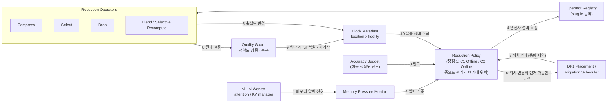

# DP3 범위 확장안 (초안) — KV 축소·재사용 구조

| 항목 | 내용 |
|---|---|
| 상태 | **초안 (제안)** — 원본 `dp3-long-context-kv-cache-eviction.md`는 수정하지 않았다 |
| 작성 일자 | 2026-10-02 |
| 기준 문서 | [`dp3-long-context-kv-cache-eviction.md`](dp3-long-context-kv-cache-eviction.md) (§ 번호는 이 문서 기준), [`../DP1/dp1-ai-data-migration-decision-architecture.md`](../DP1/dp1-ai-data-migration-decision-architecture.md), [`../Evaluation/qa-evaluation-criteria.md`](../Evaluation/qa-evaluation-criteria.md) |
| 근거 수준 | **[A]** 실측 / **[B]** 문헌 보고 수치 (as reported) / **[C]** 구조 논증·가설 |
| 원칙 | 원본의 용어 고정(**Eviction = Drop**), "DP1 먼저·DP3는 실패 경로" 규칙(§2.4), B1 기준선(§9.2), 가정값 미기재 원칙(§9)을 **그대로 유지**한다 |

---

# 0. 한눈에 보기

**무엇을 확장하는가 — 세 가지**

| # | 확장 | 원본의 어디가 바뀌는가 |
|---|---|---|
| ① | 회수 동작 분류를 **Demote / Drop 2종 → 5종**(Demote, Compress, Select, Drop + 재사용 시점의 Blend/Selective Recompute)으로 넓힌다 | §2.1 |
| ② | **설계 쟁점 2**를 추가한다 — "축소 동작을 어떤 소프트웨어 구조에 둘 것인가"(S1 엔진 내장 / S2 경계 플러그인) | §3 이후에 신설 |
| ③ | **공통 컴포넌트와 블록 상태 모델**(위치 × 충실도 직교)을 정의한다 | 신설 (§3.2~3.3) |

**유지하는 것**: 쟁점 1(중요도 평가 시점: C1 Offline / C2 Online), 용어 고정, DP1 우선 규칙, B1 기준선, §9의 지표 체계.

**왜 필요한가**: 원본의 후보 C1/C2는 "중요도를 언제 평가하는가"라는 **알고리즘 축**이다. 이 축만으로는 모듈 책임, 상태, 인터페이스가 정의되지 않아 소프트웨어 구조 설계의 대상이 되지 못한다. 또 KV 온라인 압축, blending, selective computation 같은 동작은 §2.1의 Demote/Drop 두 분류에 들어갈 자리가 없다.

---

# 1. 현재 문서로는 구조 설계가 안 되는 이유

| # | 관찰 (원본 확인 결과) | 영향 |
|---|---|---|
| 1 | §4~§5의 후보 C1/C2는 모두 **중요도 평가 시점**이 다른 알고리즘이다. 문서 전체에 모듈 뷰·컴포넌트 뷰·상태 모델이 없다 | 어떤 모듈이 무엇을 책임지고 어떤 인터페이스로 엔진과 DP1에 붙는지 설계할 수 없다 |
| 2 | §2.1은 회수 동작을 **Demote(무손실, 위치만 변경)와 Drop(손실, 폐기)** 둘로만 나눈다 | 정밀도를 낮추는 압축, 보존하되 attention에서 제외하는 선택, 재사용 시 일부 토큰만 다시 계산하는 blending이 분류 밖에 있다 |
| 3 | "Accuracy 교환은 **Drop에서만** 성립한다"(§2.1)는 서술 | 압축·선택도 손실을 낳으므로 성립 조건을 "손실을 허용하는 동작이 포함될 때"로 일반화해야 한다 |
| 4 | §1 ③의 도식과 문장은 중요도 낮은 KV를 "Low Tier로 Eviction"하는 것으로 그려져 있다 | §2.1의 정의로는 이것이 Demote(무손실)이므로, 같은 문서 안에서 §1 ③의 동기(정확도와 교환)가 **Drop을 가리키는지 Demote를 가리키는지** 독자가 구분하기 어렵다. §4 서두에서 "Drop을 가리킨다"고 정리하지만 §1 ③은 그 앞에 있다 |

---

# 2. 확장 ① — 회수·축소 동작 분류 (§2.1 개정안)

원본의 표를 다음과 같이 확장한다. **결정 주체**는 DP1이 위치, DP3가 충실도(fidelity)를 맡는 구분을 따른다(§3.3).

| 동작 | 정의 | 회수되는 것 | Accuracy | 가역성 | 대가 | 결정 주체 | 문헌 예 [B] |
|---|---|---|---|---|---|---|---|
| **Demote** | 하위 tier로 이동, 내용 보존 | HBM 용량만 | 무손실 | 가역 | 재접근 시 대역폭·지연 | **DP1** | (DP1) |
| **Compress** | 정밀도·표현을 줄여 크기를 축소 | 크기 감소분 (위치에 따라 HBM 또는 전체) | **부분 손실** | 원본 미보존 시 비가역 | 코덱 연산, 품질 저하 | **DP3** | HBM 내부 양자화(KIVI, KVQuant), 경계 압축(CacheGen, KVTC) |
| **Select (Skip)** | KV는 보존하되 해당 질의의 attention 대상에서 제외 | 접근·연산 비용 (보존 위치에 따라 용량도) | **손실 (근사 attention)** | 가역 (보존 시) | 선택 판단 비용 | **DP3** | Quest, InfiniGen, ShadowKV |
| **Drop** | 어느 계층에도 남기지 않고 폐기 | 전체 용량 | 손실 | 비가역, 재계산만 가능 | 재계산 (M-R1) | **DP3** | H2O, StreamingLLM, SnapKV |
| **Blend / Selective Recompute** (재사용 시점) | 재사용 KV 중 일부 토큰만 다시 계산해 보정하며 이어 붙임 | 용량 회수가 아니라 **재사용 가능 범위 확대** | 보정 정도에 따라 | — | 선택 재계산 연산 | **DP3** (연산 배치는 DP2) | CacheBlend |

> **문헌 예의 근거 수준.** 위 [B] 항목은 조사 에이전트가 초록을 열람해 분류한 것이다(부록 A). 이 문서에서 직접 열람해 재확인한 것은 CacheBlend(arXiv 2405.16444)뿐이다. 나머지는 인용 전 원문 재확인이 필요하다.

**§2.1 서술의 일반화 (제안)**

> 원본: "Attention Importance가 Accuracy와 교환되는 것은 **Drop에서만** 성립한다."
> 제안: Importance가 Accuracy와 교환되는 것은 **손실을 허용하는 동작(Compress, Select, Drop)이 회수 동작에 포함될 때에만** 성립한다. Demote만 수행하는 구조에서는 Accuracy 행이 성립하지 않는다(원본의 결론 유지).

**§2.2(Drop이 필요해지는 조건)에 대한 영향 [C]**: (a)(b)(c)는 Drop이 값을 하는 조건이다. Compress와 Select는 하위 계층까지 포화되지 않아도 HBM 점유와 접근 비용을 줄이므로 값을 할 수 있다. 다만 이 주장은 가설이며 §9의 M-C4·M-C5 분해로 검증해야 한다.

---

# 3. 확장 ② — 설계 쟁점 2: 축소 동작의 소프트웨어 구조

## 3.1 설계 질문

> **Compress, Select, Drop, Blend 같은 KV 축소·재사용 동작을, 엔진 내부의 어느 구조에 둘 것인가? 새 동작이나 새 메모리가 추가될 때 기존 구조를 얼마나 바꿔야 하는가?**

DP1의 쟁점 2(공통 Memory Backend I/F, plug-in)와 같은 형태의 쟁점이며, QA는 **Modifiability**와 **Functional Correctness**가 걸린다.

## 3.2 공통 컴포넌트



| 컴포넌트 | 책임 | 원본·DP1과의 관계 |
|---|---|---|
| **Memory Pressure Monitor** | 상위 메모리 점유와 압박 추세를 관측해 신호를 낸다 | DP1 Resource Manager의 Telemetry와 같은 신호를 공유할 수 있다 |
| **Reduction Policy** | 압박 수준과 정확도 한도에서 **어떤 동작을 어떤 블록에** 적용할지 결정한다. **쟁점 1(오프라인/온라인 중요도 평가)이 이 컴포넌트 안에 위치한다** | §4~§5의 C1/C2가 들어가는 자리 |
| **Accuracy Budget** | 허용하는 정확도 저하 한도(전역·요청별·task별)를 정의한다 | 신규. 정확도가 QA인 DP이므로 필요 |
| **Operator Registry** | 축소 동작을 plug-in으로 등록·조회한다 | 신규. DP1 §5.8의 Backend I/F와 같은 계열의 확장 지점 |
| **Reduction Operators** | Compress, Select, Drop, Blend/Selective Recompute 각각을 구현한다 | 하신 압축·blending·selective computation이 여기에 위치(§4) |
| **Block Metadata** | 블록의 **위치**(DP1 소유)와 **충실도**(DP3 소유)를 직교 속성으로 관리한다 | §3.3 |
| **Quality Guard** | 적용 후 정확도 저하를 검증하고, 한도를 넘으면 full 복원 또는 재계산으로 되돌린다 | 신규. M-A1, M-A2와 연결 |
| **DP1 Placement** | 위치 결정. DP1이 먼저 시도하고 실패할 때만 DP3가 개입한다 | §2.4 고정 규칙 그대로 |

## 3.3 블록 메타데이터: 위치와 충실도를 직교 속성으로 분리

DP1과 DP3의 경계를 문서 규칙에서 **데이터 모델 규칙**으로 내리는 제안이다.

| 속성 | 소유 | 값 (예) | 변경 주체 |
|---|---|---|---|
| **location** | DP1 | HBM, DRAM, CXL, SSD, … | DP1 Migration Scheduler만 |
| **fidelity** | DP3 | FULL, COMPRESSED(level), SELECTED-OUT(보존·제외), DROPPED(재계산 가능) | DP3 Reduction Operators만 |

규칙:
1. DP1은 fidelity를 읽을 수 있으나 변경하지 않는다. DP3는 location을 읽을 수 있으나 변경하지 않는다.
2. 같은 블록에 두 결정이 동시에 걸리면 §2.4의 순서(DP1 먼저)를 따른다.
3. DROPPED 블록은 location이 없다(어느 계층에도 남지 않음). 재계산으로 FULL로 복귀한다.

충실도 전이 (제안):

| 현재 | → | 조건 | 동작 |
|---|---|---|---|
| FULL | COMPRESSED | 압박 + 정확도 한도 여유 | Compress |
| FULL / COMPRESSED | SELECTED-OUT | 질의별 중요도 낮음 | Select |
| FULL / COMPRESSED / SELECTED-OUT | DROPPED | DP1 배치 실패 + 한도 여유 | Drop |
| COMPRESSED / SELECTED-OUT | FULL | Quality Guard 위반 또는 재접근 | 복원 (원본 보존 시) |
| DROPPED | FULL | 재접근 | 재계산 (M-R1) |

공유 Block(Prefix Cache 후보)은 §2.4대로 **모든 DP3 동작의 대상에서 제외**한다. Compress도 공유 Block에 적용하면 다른 세션의 정확도에 영향을 주므로 같은 규칙을 적용하는 것이 안전하다 [C].

## 3.4 연산자 인터페이스 스케치

구현이 아니라 **인터페이스가 가져야 할 것**을 보이는 스케치다.

```text
ReductionOperator
 ├─ name / kind            : compress | select | drop | blend
 ├─ applicable(block, ctx) : 이 블록에 적용 가능한가 (공유 Block 제외 등)
 ├─ estimate(block, ctx)   : (회수 bytes, 예상 정확도 영향, 비용)  ← Policy가 비교에 사용
 ├─ apply(block, budget)   : 충실도 변경 수행. Accuracy Budget 안에서만
 ├─ restore(block)         : 복원 가능 여부와 비용 (불가능하면 not_restorable)
 └─ requires_engine_hook   : attention 경로 접근이 필요한가 (S1/S2 판단 근거)
```

`estimate`와 `restore`를 인터페이스에 넣는 이유는 Policy가 동작을 **비용·정확도 영향·가역성**으로 비교해 고르게 하기 위해서다. 이 정보 없이는 Policy가 특정 동작에 하드코딩된다.

## 3.5 구조 후보 — S1 / S2

쟁점 1의 C1/C2와 이름이 겹치지 않도록 구조 후보는 **S1, S2**로 부른다.

| | **S1. 엔진 내장(인라인)** | **S2. 경계 플러그인 파이프라인** |
|---|---|---|
| 구조 | 연산자가 vLLM worker의 attention·KV manager 경로 **안에** 구현된다 | 연산자가 tier 경계(강등·승격·load)의 **별도 단계**이며 Operator Registry로 교체한다 |
| 정확도 제어 단위 | 레이어·헤드·토큰 (attention 정보 직접 접근) | 블록 (경계에서 관측 가능한 정보) |
| 지연·처리량 [C] | 추가 복사 없음 | 코덱 단계가 이동 경로에 추가. 비동기로 숨길 수 있는지는 **측정 대상** |
| 적용 범위 | HBM 압박 중심 | 하위 tier·서버 간 전송(DP4)까지 연결 |
| 엔진 수정 | 큼 (attention backend, KV manager) | 작음. 단 **Select·Blend는 엔진 훅이 필요**(아래) |
| Modifiability [C] | ★★ 추정 (연산자 추가 시 attention backend, KV manager, scheduler 등 3개 이상 모듈 변경 가능성) | ★★★ 추정 (연산자 구현 + 등록, ≤ 2 모듈) |

> **S2가 "엔진 무수정"은 아니다 [C].** Select(질의별 attention 대상 제외)와 Blend/Selective Recompute(일부 토큰을 forward 경로에서 다시 계산)는 attention·forward 경로에 들어가야 한다. 따라서 S2에서도 연산자의 `requires_engine_hook`이 참인 동작은 **엔진 훅 1~2개**가 필요하다. 이를 숨기면 S2의 Modifiability가 과대평가된다.

표의 Modifiability 점수는 [`qa-evaluation-criteria.md`](../Evaluation/qa-evaluation-criteria.md) §7의 기준(★ ≥ 6 모듈, ★★ 3~5, ★★★ ≤ 2)을 적용한 **구조 논증(C)** 이며 prototype으로 확인하기 전까지 가설이다. 문헌에서도 같은 갈림이 보인다: eviction·HBM 내부 양자화 계열은 엔진 안, 전송·저장 경계 압축은 경계 단계에 있다(부록 A, [B]).

## 3.6 쟁점 1 × 쟁점 2 조합

| | S1 엔진 내장 | S2 경계 플러그인 |
|---|---|---|
| **C1 Offline** (사전 중요도 프로파일) | 자연스러움. 프로파일을 엔진 내부에서 조회 | 자연스러움. 프로파일이 경계에서 조회되는 정적 입력 |
| **C2 Online** (실제 질의 attention) | 자연스러움. attention 점수가 엔진 내부에 있음 | **attention 점수를 경계로 내보내는 경로가 필요** — 새 설계 위험 [C] |

(C2, S2)는 질의별 attention 점수를 엔진 밖으로 내보내야 하므로 추가 비용과 인터페이스 변경이 생긴다. 이 조합이 성립하는지가 S2 평가의 핵심 위험이다.

---

# 4. 지금까지 한 작업의 위치 (매핑 — 사용자 정정 필요)

> 아래는 "KV 캐시 온라인 압축, blending, selective computation"이라는 요약만으로 만든 **가정**이다. 실제 구현 방식에 맞게 정정이 필요하다.

| 한 작업 | 연산자 분류 | 컴포넌트 | 이미 있는 것 | 설계가 필요한 것 |
|---|---|---|---|---|
| KV 온라인 압축 | Compress | Reduction Operators | 압축 로직, 측정 결과 (근거 수준은 확인 필요, 실측이면 [A]) | `estimate`/`restore` 인터페이스, 충실도 상태 기록, Accuracy Budget 연동 |
| blending | Blend | Reduction Operators | 융합 로직 | 재사용 시점 호출 경로, 공유 Block 규칙과의 충돌 확인 |
| selective computation | Selective Recompute | Reduction Operators | 선택 재계산 로직 | 어떤 토큰을 다시 계산할지 Policy와 연결, DP2와의 계산 위치 인터페이스 |
| (없음) | — | Policy, Registry, Metadata, Quality Guard | — | **구조 설계의 실질적 대상** |

즉 하신 일은 컴포넌트 중 **Operators**에 해당하고, 이 확장안이 새로 정의하는 것은 그 위의 **Policy, Registry, Metadata, Quality Guard**다.

**blending의 적용 범위 확인 필요**: CacheBlend는 RAG에서 캐시된 지식 청크(비접두)를 융합하는 문제를 다룬다(초록 기준). 하신 blending이 멀티턴 에이전트의 누적 context(원본 §1 ①)에서 어떤 재사용 시나리오를 대상으로 하는지에 따라 §2.4의 공유 Block 제외 규칙과 충돌할 수 있다.

---

# 5. DP1 · DP2 · DP4와의 연결

```text
DP1  데이터를 어디에 둘까        위치 결정 (Demote 포함)          ── location 소유
 │
DP2  연산을 어디서 할까          연산 배치 (Prefill, 재계산, 선택 재계산의 실행 위치)
 │
DP3  쌓인 데이터를 어떻게 줄일까  충실도 결정 (Compress, Select, Drop, Blend) ── fidelity 소유
 │
DP4  이 순환을 서버 여러 대로 확장할 때 결정을 어디서 내릴까
```

| 연결 | 내용 |
|---|---|
| DP1 → DP3 | §2.4 규칙 유지: DP1 먼저, 용량 제약 실패 시에만 DP3. location/fidelity 직교 모델(§3.3)로 데이터 수준에서 보장 |
| DP3 → DP2 | Drop 재계산(M-R1)과 Selective Recompute는 **연산 수요**를 만든다. 원본 M-R1은 "Prefill은 GPU 고정"을 전제하는데, DP2의 연산 배치 결정과 이 전제의 관계를 DP2 문서와 맞춰야 한다 |
| DP3 → DP4 | S2에서 압축된·선택된 KV가 서버 간 전송·공유에 쓰이면 **충실도 메타데이터와 압축 포맷의 서버 간 일치**가 필요하다. 포맷 버전 불일치는 새로운 위험이다 |

### 명칭 정정 (확인 완료)

DP1 후보의 명칭은 DP1 문서 기준이 맞다고 확인되었다.

| | DP1 문서 (기준) | 원본 DP3 §7의 현 표기 | 정정안 |
|---|---|---|---|
| C1 | **Type-agnostic Placement Registry** (Resource State-driven Migration) | "Memory State based" | "DP1-C1: Type-agnostic Placement Registry (Resource State-driven)" |
| C2 | **Type-aware AI Data Registry** (AI Data Behavior-driven Migration) | "Data Property based" | "DP1-C2: Type-aware AI Data Registry (AI Data Behavior-driven)" |

원본 §7의 본문 설명(C1은 Capacity/BW/Load를, C2는 Access Pattern/Hotness/Lifetime을 신호로 쓴다)은 DP1 문서 §4의 "핵심 decision signal" 행과 의미가 일치하므로 **명칭만** 바꾸면 된다. 해당 위치: 원본 §7의 도식 라벨(`C1. Memory State based` / `C2. Data Property based`)과 "DP1-C1을 선택하는 경우" / "DP1-C2를 선택하는 경우" 소제목.

### 용어 충돌 주의

DP1 문서는 victim을 고르는 컴포넌트를 **"Data Eviction Manager", "generic eviction policy"** 라고 부른다(DP1 §5.3 C1). 이것은 위치를 옮길 대상을 고르는 것이라 DP3의 용어 고정(**Eviction = Drop**)과 의미가 다르다. 한쪽을 "Victim Selection" 등으로 바꾸거나, 각 문서 서두에 구분을 명시하는 것을 권한다.

---

# 6. 평가 지표 — 원본 §9 대비 추가·변경

원본의 원칙(가정값 미기재, B1 = 1.0 기준선, Performance와 Accuracy를 합치지 않음, 이중 보고)은 그대로 둔다.

| 항목 | 변경 | 이유 |
|---|---|---|
| **M-C5 확장** | Drop/Demote 분해를 **Demote / Compress / Select / Drop 바이트**로 4분해 | Compress·Select가 한 일을 DP1(Demote)의 이득과 분리 |
| **M-A1 귀속** | 동작을 **하나씩 켜는 단독 조건(ablation)** 을 대조군에 추가하고 Accuracy 손실을 동작별로 귀속 | 어느 동작이 정확도를 깎았는지 분리 |
| **M-M1 (신규)** | Modifiability: 새 연산자를 추가할 때 변경되는 모듈 수·인터페이스 수·LOC·신규 type-specific 분기 수 | S1/S2 비교용. [`qa-evaluation-criteria.md`](../Evaluation/qa-evaluation-criteria.md) §7의 보조 측정 항목을 따른다 |
| **M-G1 (신규)** | Quality Guard 개입률과 복구 비용(full 복원·재계산 시간) | Guard가 자주 개입하면 한도 설정이나 Policy가 잘못된 것 |
| **Sweep 추가** | Accuracy Budget 크기, 연산자 조합, (C2, S2)의 attention 점수 export 경로 | 후보 우열이 바뀔 수 있는 축 |
| **정합성 점검 확장** | 원본 "Drop이 0이면 Accuracy는 B0와 같아야 한다"를 "**손실 허용 동작이 모두 0이면** B0와 같아야 한다"로 확장 | 측정 파이프라인 오류 검출 |

---

# 7. 원본에 반영한다면 — 변경 목록

| 원본 위치 | 변경 |
|---|---|
| §1 ③ | 도식·문장의 "Low Tier로 Eviction"을 Drop/Demote 중 무엇을 가리키는지 명확히 하거나 §2.1 정의와 맞춘다 |
| §2.1 | 동작 분류 표를 5종으로 확장 (본 문서 §2) |
| §2.1 인용문, §6 서두 | "Drop에서만 성립"을 "손실 허용 동작이 포함될 때"로 일반화 |
| §3 | 설계 쟁점 2 신설 (본 문서 §3.1) |
| §4~§6 뒤 | S1/S2 후보와 조합 표 신설 (본 문서 §3.5~§3.6) |
| 신설 | 공통 컴포넌트, 블록 메타데이터 (본 문서 §3.2~§3.4) |
| §7 | DP1 후보 명칭을 DP1 문서 기준으로 정정 (본 문서 §5) |
| §9 | 지표 추가·변경 (본 문서 §6) |
| §10 | 선정 질문에 "S1과 S2 중 어느 범위에서 무엇이 성립하는가"를 추가 |

---

# 8. 열린 질문과 위험

| # | 내용 | 영향 |
|---|---|---|
| 1 | §4의 매핑은 요약 기반 **가정**이다. 실제 구현 방식(엔진 수정 범위, 압축 위치, blending 대상)에 따라 Operators 분류와 S1/S2 위치가 달라진다 | 정정 필요 |
| 2 | 범위 확대로 DP3가 DP1·DP2와 다시 겹칠 수 있다. 직교 속성 모델(§3.3)과 DP1 우선 규칙으로 막는 설계이나, 실제 충돌 사례는 prototype으로 확인해야 한다 | 경계 위험 |
| 3 | (C2, S2) 조합의 attention 점수 export 비용 | S2 평가의 핵심 위험 |
| 4 | 정확도 측정 인프라(task, 지표, 한도)를 먼저 정의해야 후보 비교가 성립한다. 원본 §9.4의 M-A1 정의를 따른다 | 선행 조건 |
| 5 | 압축된 KV를 서버 간에 공유할 때 포맷·파라미터 버전 불일치(DP4와의 접점) | DP4 설계 입력 |
| 6 | 부록의 문헌 항목은 대부분 arXiv 초록 수준의 확인이며, 인용 전 원문(모델·벤치마크·수치) 재확인이 필요하다 | 근거 수준 [B] |
| 7 | 표의 우열·Modifiability 점수는 모두 구조 논증 [C]이며 prototype 실측 전에는 정성 가설이다 | 원본 §6과 같은 원칙 |

---

# 부록 A. 문헌 앵커 (분류 근거)

**근거 수준 [B]. 조사 에이전트가 초록을 열람한 분류를 옮긴 것이며, 이 문서에서 직접 재확인한 것은 CacheBlend뿐이다. 수치는 인용하지 않는다.**

| 분류 | 이름 | 위치 | URL |
|---|---|---|---|
| Compress (HBM 내부 양자화) | KIVI | 엔진 내부 | arxiv.org/abs/2402.02750 |
| | KVQuant | 엔진 내부 | arxiv.org/abs/2401.18079 |
| Compress (전송·저장 경계) | CacheGen | 전송·디스크 | arxiv.org/abs/2310.07240 |
| | KVTC | HBM·오프로드·디스크 | arxiv.org/abs/2511.01815 |
| Select (전체 KV 보존) | Quest | 엔진 내부 | arxiv.org/abs/2406.10774 |
| | InfiniGen | CPU 보관 + prefetch | arxiv.org/abs/2406.19707 |
| | ShadowKV | low-rank K + V 오프로드 | arxiv.org/abs/2410.21465 |
| Drop (비가역 eviction) | H2O | 엔진 내부 | arxiv.org/abs/2306.14048 |
| | StreamingLLM | 엔진 내부 | arxiv.org/abs/2309.17453 |
| | SnapKV | 엔진 내부 | arxiv.org/abs/2404.14469 |
| Blend / Selective Recompute | **CacheBlend** (직접 확인) | 재사용 시점 | arxiv.org/abs/2405.16444 |
| 검증형 압축 (출력 동일) | VeriCache | 압축 KV로 초안, 원본으로 검증 | arxiv.org/abs/2605.17613 |

CacheBlend 초록(직접 확인): 재사용 KV 캐시에서 **토큰의 일부만 선택적으로 재계산**해 각 재사용 KV를 갱신한다. 초록은 TTFT 2.2~3.3배 감소, 처리량 2.8~5배 증가를 보고한다(논문 주장, 실험 조건은 본문 확인 필요).

조사 원본: 에이전트 조사 결과 전문은 세션 작업 디렉터리의 `research/03-kv-compression.md`에 있다 (저장소에는 포함하지 않음).
