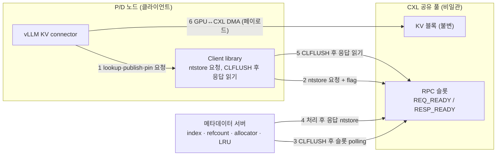
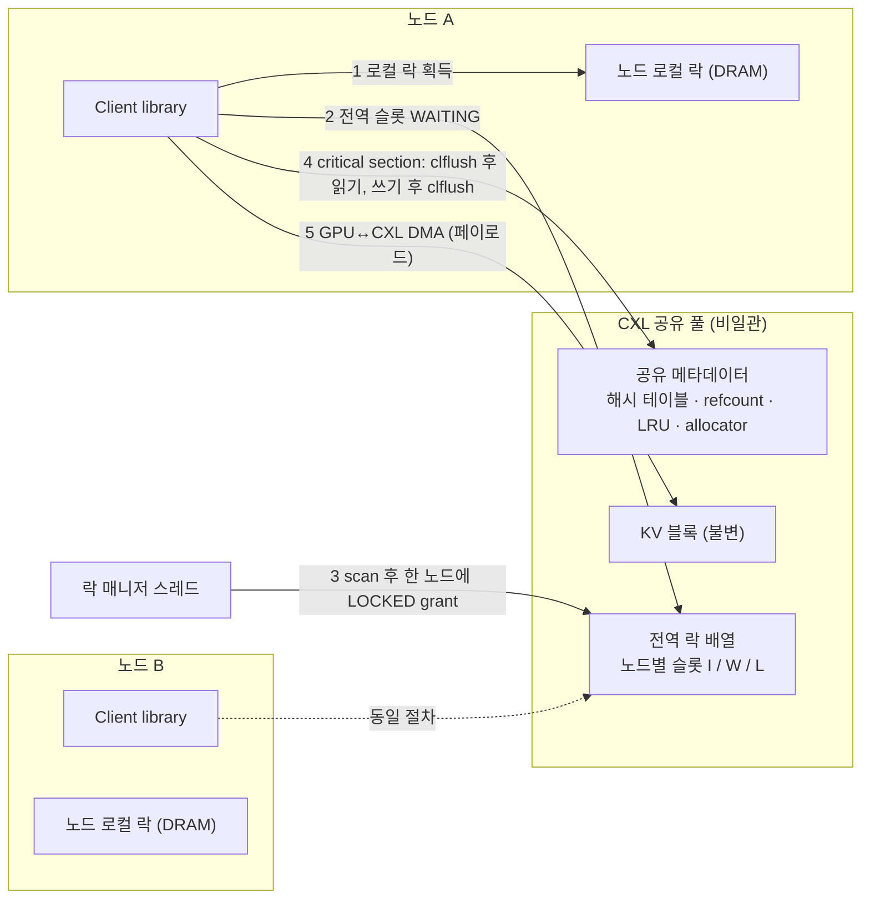

# DP4 구조 정리 (초안) — 비일관 CXL 공유 메모리에서의 KV 일관성 구조

| 항목 | 내용 |
|---|---|
| 상태 | **초안 (제안)** — 2026-10-04 재작성. 이전 판("전송 vs 공유 풀")은 설계 포인트가 너무 커서 폐기하고 **문제를 좁혀** 다시 썼다 |
| 기준 자료 | [`../DP2/dp2-prefill-decode-execution-planning-decision-timing.md`](../DP2/dp2-prefill-decode-execution-planning-decision-timing.md), [`../DP3/dp3-kv-compression-reuse-structure-draft.md`](../DP3/dp3-kv-compression-reuse-structure-draft.md), [`../DP1/dp1-ai-data-migration-decision-architecture.md`](../DP1/dp1-ai-data-migration-decision-architecture.md), TraCT·Beluga 본문(직접 열람) |
| 평가 계획 | [`../Evaluation/DP4/simulation-plan.md`](../Evaluation/DP4/simulation-plan.md) (사전 등록), [`qa-criteria-dp4`](../Evaluation/DP4/qa-criteria-dp4.md), [`qa4-preregistration`](../Evaluation/DP4/qa4-preregistration.md), [`benchmark`](../Evaluation/DP4/benchmark.md) |
| 슬라이드 초안 | [`DP4-slides-draft.pptx`](DP4-slides-draft.pptx), [`DP-overview-slide-draft.pptx`](DP-overview-slide-draft.pptx) |
| 근거 수준 | **[A]** 실측 / **[B]** 문헌 보고 (as reported) / **[C]** 구조 논증·시뮬레이션 |
| 환경 | 서버 2대(각 GPU 8장). **CXL 공유 풀 없음.** 평가는 시뮬레이션 + 구조 논증 + protocol model check (사용자 결정 2026-10-04) |

---

# 0. 한눈에 보기

**이야기.** DP2는 P/D 노드 선택을 비용으로 최적화하지만 노드 간 KV 전송 비용은 줄이지 못한다. 전송을 없애는 한 방법이 **CXL 공유 풀**(복사 대신 load/store)이고 문헌이 효과를 보고한다(Beluga, TraCT). 그러나 **CXL 2.0 공유 풀은 호스트 간 캐시 일관성도 cross-node atomic도 제공하지 않는다.** 따라서 이 풀을 쓰려면 일관성을 소프트웨어가 책임져야 하고, 그 구조가 DP4다.

> **문제문.** 비일관(non-coherent) CXL 공유 메모리에서, 서버 간 KV 블록과 메타데이터의 일관성·가시성을 소프트웨어로 어떻게 보장할 것인가?

| | 내용 |
|---|---|
| **설계 쟁점 (본체)** | 메타데이터 일관성 책임을 **누가** 지는가 |
| **C1 중앙 직렬화** | 메타데이터 서버 한 곳이 모든 메타데이터 연산을 직렬화, 클라이언트는 CXL 슬롯 기반 RPC (Beluga 방식) |
| **C2 분산 락** | 메타데이터를 공유 메모리에 두고 모든 노드가 직접 갱신, 2단 락 + 변경 캐시라인 `clflush` (TraCT 방식) |
| **공통 전제** | 페이로드 가시성은 GPU↔CXL DMA(캐시 우회) + **메타데이터 publish를 가시성 경계**로 삼는다. KV 블록은 **불변·해시 식별**(쓰기 1회, 읽기 N회) |
| **QA** | QA1·QA2·QA3·QA4 + Scalability(제안) |
| **평가** | 시뮬레이션(클러스터 P/D) + 구조 논증(QA4, 장애) + protocol model check(정확성) |

**미리 말해 두는 사전 예측 [C].** control plane 지연은 µs 규모이고 KV 페이로드 이동·prefill은 수십~수백 ms 규모라, 두 후보의 **성능(QA1·QA2) 차이는 작을 것**으로 예상한다. 이 DP의 실질적 trade-off는 변경 용이성, 확장 한계, 장애·정확성에 있을 가능성이 높다. 이 예측은 결과 전에 [`simulation-plan.md`](../Evaluation/DP4/simulation-plan.md) §10에 기록했고 결과로 반증될 수 있다.

---

# 1. 문제: 비일관 CXL 공유 풀

| 제약 | 내용 |
|---|---|
| 호스트 간 캐시 일관성 없음 | 각 호스트는 독립 캐시 계층을 가져 한 호스트의 쓰기가 다른 호스트에 자동으로 보이지 않는다 (Beluga §5.1). CXL 3.x의 일관성 영역은 작고 보장이 불분명하다 |
| cross-node atomic 없음 | 락 같은 동기화 원시연산을 하드웨어가 제공하지 않는다 (TraCT §3.1) |
| 일관 영역은 작음 | 테라바이트 규모 풀 전체에 snoop filter를 두는 것은 비현실적이라는 것이 두 논문의 공통 전제다 |

이로부터 문제가 세 층으로 쪼개진다.

| 층 | 문제 | 비고 |
|---|---|---|
| ① 페이로드 가시성 | 수백 KB~수십 MB KV 블록을 쓴 노드와 읽는 노드가 같은 값을 본다 | 두 논문이 거의 같은 결론 → **공통 전제** |
| ② 메타데이터 일관성 | prefix index, refcount, allocator, LRU를 여러 노드가 갱신해도 stale 값을 보지 않는다 | **설계 쟁점의 본체** |
| ③ 상호 배제 | atomic 없이 critical section을 보장한다 | ②와 함께 후보를 가른다 |

---

# 2. 두 논문이 푼 방식 (본문 직접 확인, [B], 논문 주장)

| 문제 | TraCT (SK hynix) | Beluga (Alibaba) |
|---|---|---|
| ① 페이로드 | GPU↔CXL **DMA는 CPU 캐시를 우회**하므로 flush 불필요. 메타데이터를 READY로 publish하는 시점이 가시성 경계 (DMA 완료 뒤 publish) | 방법 셋(uncacheable / flush / bypass)을 실측해 **주체별로 선택**: CPU 쓰기 ntstore, CPU 읽기 CLFLUSH 후 로드, DSA는 uncacheable, GPU는 uncacheable + DDIO 끔 |
| ② 메타데이터 | 코디네이터 없이 **공유 메타데이터를 직접 갱신**. 변경 캐시라인만 `clflush`(비동기 `clflushopt`는 가시성 오류로 불채택), 캐시라인 정렬, 고정 크기 해시 테이블(linear probing) | **중앙 메타데이터 서버**가 직렬화(전역 인덱스). 클라이언트 ntstore, 서버는 읽기 전 CLFLUSH |
| ③ 상호 배제 | **2단 락**: 노드 로컬 DRAM 락 + CXL 안의 전역 락 배열(노드별 슬롯 I/W/L), 락 매니저 스레드가 한 노드에만 grant | 서버가 직렬화하므로 락이 필요 없음. KV 블록은 **단일 writer, 다중 reader** |
| 통신 | 공유 메모리 직접 접근 | **CXL 기반 RPC**: 요청·응답 슬롯 + 상태 flag(REQ_READY/RESP_READY), spin-wait |
| 부가 | 오프셋 포인터, 전역 chunk + 노드별 heap 할당기, 루트 객체만 publish, refcount + LRU 퇴출 | 비연속 KV를 한 번에 gather/scatter하는 커널 |

**측정값 (as reported).** Beluga Table 4(16 KB): CPU 쓰기는 uncacheable 281.56 µs, flush-after-write 8.50 µs, ntstore 2.41 µs. CPU 읽기는 uncacheable 166.49 µs, flush-before-read 5.98 µs. GPU 쓰기는 DDIO 끔 9.14 µs, CPU flush 경유 11.06 µs. Beluga CXL-RPC 왕복(64 B)은 2.11 µs로 RDMA-RC 8.39 µs 대비 약 4배, 단일 스레드 처리량은 12.13 Mops. TraCT 장치는 Niagara 2.0(지연 640 ns, 10.1 GB/s, 공유 64 GB), 서버 2대, 8B 모델. 두 논문 모두 서버 2대 규모의 측정이다.

**공통 원리.** 두 논문 모두 하드웨어 일관성을 기다리지 않고 **KV의 의미로 일관성 요구를 낮춘다.**
- KV 블록은 불변이고 해시로 식별된다.
- 페이로드와 메타데이터를 분리해, 큰 데이터는 캐시 우회 경로로, 작은 제어 정보만 flush·락으로 관리한다.
- Beluga는 이를 future work로도 명시한다("application-level semantics로 coherency 완화").

**풀리지 않은 문제 (본문에서 확인한 범위).**
- TraCT는 Beluga를 "중앙화는 load/store 공유라는 목적과 모순"이라고 비판한다. Beluga는 CXL-RPC가 RDMA보다 신뢰성 보장이 낮아 상위 계층이 책임진다고 인정한다.
- TraCT 본문에서 **락 보유 노드의 장애 처리**를 찾지 못했다. 락 매니저의 scan 방식·비용도 수치가 없다. 참가 노드는 "랙당 수십 개 이하"로 가정한다.
- 퇴출은 단순 LRU + refcount이고 고급 정책은 future work다.

---

# 3. 후보 구조

## 3.1 C1 — 중앙 직렬화

## 3.2 C2 — 분산 락

## 3.3 비교 (가설 [C], 평가로 검증)

| | C1 중앙 직렬화 | C2 분산 락 |
|---|---|---|
| 구조 | 서버가 직렬화. 락 없음. 단일 writer 가정 | 모든 노드가 직접 갱신. 2단 락 |
| 일관성 논증 | 서버 한 곳의 순서로 단순 | flush 규칙·락·publish 순서의 조합(`clflushopt` 함정 등)이 복잡 |
| 확장 | 서버 처리량 상한 (스레드 수로 확장 여지) | 락 매니저 scan 비용이 노드·락 수에 비례할 수 있음 [모델, 논문에 수치 없음] |
| 장애 | 서버 SPOF, 재시작·복구 필요 | 락 보유 노드 장애 시 락 고착 위험 (논문에서 처리 방식 미확인) |
| CPU | 서버 busy-poll 코어 | 락 매니저 스레드 + 노드별 polling + flush 사이클 |
| 변경 용이성 | module 수가 적음(RPC 채널, 메타데이터 서버 + 공통) | module이 많음(공유 레이아웃, 락, 할당기, flush 계층 + 공통) |

**후보 module (QA4 근거, 사전 등록).** 공통: GPU↔CXL Copy/DMA handler, KV block object format, Client library API, Publish/Visibility protocol, Failure/Recovery handler. C1: CXL-RPC channel, Metadata server. C2: Shared metadata layout, Two-tier lock + lock manager, Shared allocator, Refcount/LRU in shared memory, Cacheline flush layer.

---

# 4. 다른 DP와의 계약 (제안 [C])

| 방향 | 내용 |
|---|---|
| **DP4 → DP2** | 풀 접근이 균일하면 Tmove가 노드 쌍에 덜 의존한다. Beluga는 이를 "cache-oblivious scheduling"으로 주장한다(풀 접근 지연이 로컬에 가까울 때). DP2의 비용 계산이 단순해질 수 있다는 가설 |
| **DP3 → DP4** | 압축된 Comp.KV도 불변·해시 식별 객체라 같은 구조로 공유할 수 있다. 포맷·버전 일치가 필요 |
| **DP4 ↔ DP1** | 풀 매체는 DP1의 Memory Backend I/F로 추상화한다. **CXL 3.x의 작은 하드웨어 일관 영역**이 생기면 그 영역에 동기화 객체를 옮길 수 있다(QA4 시나리오 S1) |
| **DP2 → DP4** | 노드 간 이동·위치 정보의 요구(풀 메타데이터 조회) |

---

# 5. 평가 방법 요약

사용자 환경에 CXL 공유 풀이 없어 **실측 [A]는 없다.** 평가는 세 축이다. 상세는 [`simulation-plan.md`](../Evaluation/DP4/simulation-plan.md).

| 축 | 방법 | Evidence |
|---|---|---|
| 클러스터 성능 | P/D 분리 DES, 세 arm(Baseline-RDMA, C1, C2), data plane은 C1·C2 동일, 입력은 두 논문의 측정 파라미터 | [B+C] |
| 구조 논증 | QA4(변경 시나리오를 시뮬레이터 코드에 구현해 module/LOC 측정), 장애·확장 한계 논증 | [B+C] / [C] |
| 정확성 | protocol model check: 비일관 캐시 의미론에서 C1·C2 프로토콜의 stale read 불변식 검증, 결함 변종(`clflushopt` 등) 검출 확인 | [C] |

**한계.** 시뮬레이션의 data plane 상수는 논문 측정에 맞춘 것이라 후보 선택의 독립 근거가 아니다. C2의 락 관련 상수(scan 비용, critical section 길이, stripe 수)는 논문에 없어 가정이며 민감도로만 읽는다. model check는 설계 수준 추상 모델이다.

---

# 6. 열린 질문과 위험

| # | 내용 | 영향 |
|---|---|---|
| 1 | **CXL 공유 풀 하드웨어 없음**: 실측 불가. 결과는 [B+C]이며 논문 조건(서버 2대, 단일 벤더)의 일반화 한계 | 근거 수준 |
| 2 | **C2 락 상수는 논문에 없음**(scan 방식·비용, stripe 수, 장애 처리) | C2 결과 해석 |
| 3 | **락 보유 노드 장애 처리**를 TraCT 본문에서 확인하지 못함. 보완안(lease)은 평가자의 가정 | C2 장애 평가 |
| 4 | **성능 차이가 작을 것이라는 사전 예측**이 맞으면 DP4의 근거는 QA4·확장 한계·장애·정확성에 있고, "coherence 구조는 성능 레버가 아니다"가 결론일 수 있다 | DP 설계 포인트의 크기 |
| 5 | **DP2 문서의 Deployment View 보완**: P/D 노드 레벨 선택(확정된 범위)과 맞지 않음 | DP2 문서 |
| 6 | 풀 장애·오류, 다중 테넌트 격리는 문헌에서도 공백이라 평가 범위 밖 | 한계 |
| 7 | Scalability는 공식 QA가 아니라 제안(사용자 확정 필요) | 평가 |

---

# 7. 문헌 [B]

| 이름 | 확인 수준 | 핵심 | URL |
|---|---|---|---|
| **Beluga** (SIGMOD'26) | **본문 직접 확인** (§5.1, §6, Exp #11) | CXL 2.0 스위치 풀(8 TB, 최대 16서버), 중앙 메타데이터 서버 + CXL-RPC, 단일 writer 다중 reader, 주체별 coherence 방법 | arxiv.org/abs/2511.20172 |
| **TraCT** (arXiv 2512.18194) | **본문 직접 확인** (§3, §4, §5) | 코디네이터 없는 공유 메타데이터, 2단 락, `clflush`, DMA 우회 + publish 경계, offset 주소 | arxiv.org/abs/2512.18194 |
| Seagate Composable CXL | 에이전트 조사(미재확인) | 노드 간 KV 재사용, 풀 내 메타데이터 | arxiv.org/html/2609.10790 |
| Levis (HotNets'23) | 에이전트 조사(미재확인) | 풀링 비판 | conferences.sigcomm.org/hotnets/2023/papers/hotnets23_levis.pdf |
