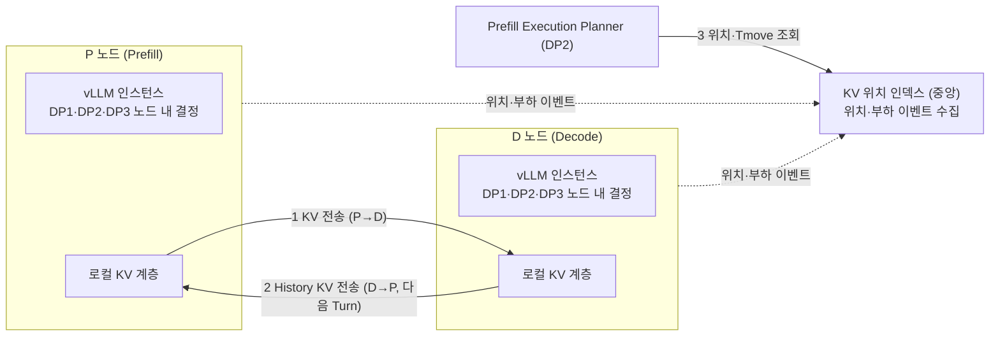
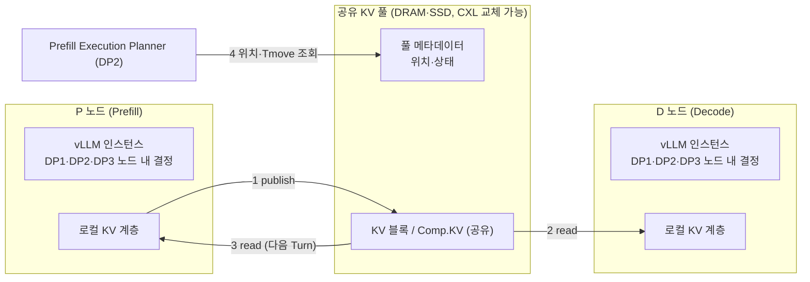

# DP4 구조 정리 (초안) — 서버 간 KV·상태 공유 구조

| 항목 | 내용 |
|---|---|
| 상태 | **초안 (제안)** |
| 작성 일자 | 2026-10-04 |
| 기준 자료 | [`../DP2/dp2-prefill-decode-execution-planning-decision-timing.md`](../DP2/dp2-prefill-decode-execution-planning-decision-timing.md), 사용자 DP2 슬라이드(13~14쪽의 P/D 노드 구조와 Turn 예시), [`../DP3/dp3-kv-compression-reuse-structure-draft.md`](../DP3/dp3-kv-compression-reuse-structure-draft.md), [`../DP1/dp1-ai-data-migration-decision-architecture.md`](../DP1/dp1-ai-data-migration-decision-architecture.md), 문헌 조사 |
| 슬라이드 초안 | [`DP4-slides-draft.pptx`](DP4-slides-draft.pptx) (1쪽 배경, 2쪽 설계), [`DP-overview-slide-draft.pptx`](DP-overview-slide-draft.pptx) (전체 DP 연결 표) |
| 근거 수준 | **[A]** 실측 / **[B]** 문헌 보고 (as reported) / **[C]** 구조 논증·가설 |
| 환경 전제 | 서버 2대(각 GPU 8장), **CXL 공유 풀 없음**(사용자 확인), RDMA 유무 미확인, Kubernetes 숙련도 낮음 |

---

# 0. 한눈에 보기

**DP2의 한계에서 출발한다.** DP2는 P/D 노드 중 어디서 Prefill을 실행할지를 비용(Tmove, Tprefill, Tqueue)으로 최적화한다. 그러나 **노드 간 KV 전송 비용(Tmove) 자체는 줄이지 못한다.** Turn마다 KV가 P와 D 사이를 오가며 누적되고, History KV가 클수록 커진다. DP4는 이 한계를 **KV와 상태를 서버 간에 공유하는 구조** 쪽에서 푼다.

| | 내용 |
|---|---|
| **설계 질문** | 서버 간 KV를 **점대점 전송**으로 공유할 것인가, **노드 독립 공유 KV 풀**로 공유할 것인가? |
| **쟁점 2** | 서버 간 KV 위치·부하 **상태**를 중앙 인덱스로 모을 것인가, 풀 안에 둘 것인가? |
| **1안** | 점대점 전송 (Direct Transfer) + 중앙 인덱스 |
| **2안** | 공유 KV 풀 (Shared KV Pool) + 풀 메타데이터 |
| **QA** | Performance Latency, Scalability (보조: Modifiability) |
| **환경 제약** | CXL 공유 풀이 없어 2안은 **네트워크로 연결된 DRAM·SSD 풀** 기준으로 평가하고, CXL 풀은 이후 교체 가능한 매체로 설계한다 |

**정직하게 짚을 점 [C]**: 네트워크 풀에서는 풀 접근도 전송이라 **전송 횟수가 반드시 줄지 않는다.** 2안의 이득은 위치 독립(Tmove 균일화), 요청 간 공유(Comp.KV 등), DP2 결정 단순화에서 오는지가 쟁점이며 측정 대상이다. 복사 자체가 사라지는 것은 CXL처럼 load/store로 직접 접근하는 풀뿐이고, 이는 문헌 근거(B)로만 있다.

---

# 1. 배경

| # | 내용 |
|---|---|
| ① | P/D 분리 구조에서 Prefill 실행 노드는 KV 위치·노드 부하·이동 비용을 고려해 골라야 하며, DP2가 Tmove·Tprefill·Tqueue 비용으로 이를 최적화한다 |
| ② | 그러나 DP2는 **노드 간 KV 전송 비용 자체는 줄이지 못한다.** Turn이 이어질수록 P↔D 전송이 누적된다 (DP2 슬라이드 13쪽: 누적 1회 → 3회 → 5회) |
| ③ | 서버가 늘면 KV 위치·부하 상태를 서버 간에 정확히 공유하기도 어려워지고, 상태가 낡으면 잘못된 노드를 고른다 (DP2 §6의 Stale Plan) |

→ **결정 최적화(DP2)만으로는 한계가 있어, KV 전송 비용과 서버 간 상태 공유를 구조적으로 푸는 설계가 필요하다.**

### KV 전송 한계를 푸는 세 방법 (DP2 · DP3 · DP4)

```text
 DP3  바이트를 줄인다      KV 압축·재사용 (Comp.KV, 선택 재계산)
  +
 DP2  위치를 고른다        비용 기반 P/D 노드 선택
  +
 DP4  전송 구조를 바꾼다   서버 간 KV·상태 공유 (본 DP)
```

세 방법은 보완 관계다. DP3로 전송할 바이트를 줄이고, DP2로 실행 위치를 고르고, DP4로 전송 경로와 상태 공유 구조를 바꾼다.

---

# 2. DP2와의 관계 (범위 정리)

| | 다루는 것 | 하지 않는 것 |
|---|---|---|
| **DP2** | P/D **노드 레벨**에서 Prefill을 어디서 실행할지 비용으로 결정 (결정 시점: 스케줄링 시점 vs 사전 계획) | KV 전송 수단(복사 또는 공유)은 건드리지 않고 **비용 입력(Tmove)** 으로만 사용 |
| **DP4** | KV와 위치·부하 상태를 서버 간에 **어떻게 공유하는가** (전송 vs 공유 풀, 중앙 인덱스 vs 풀 메타데이터) | 실행 위치 결정은 하지 않음. 결정이 쓰는 데이터 경로와 정보를 제공 |

- DP4가 Tmove를 바꾸면 DP2의 최적 결정도 바뀐다. 따라서 **DP2의 평가 결과는 DP4 구성(전송 vs 공유)을 병기**해서 보고한다. DP3 문서가 DP1 구성을 병기하라고 요구하는 것과 같은 원칙이다.
- **DP2 문서와 슬라이드의 범위 차이**: DP2 슬라이드는 P/D 노드를 후보로 쓰지만, DP2 문서(§3 공통 구조와 상세 구조 문서의 Deployment View)는 Serving Node 하나이며 후보 자원이 GPU/HBM, GPU/HBF, PNM/CXL이다. DP2의 범위가 노드 레벨 선택으로 확정되었으므로 **DP2 문서의 Deployment View에 P/D 노드를 반영**해야 한다(§9).

---

# 3. 설계 쟁점과 후보

### 쟁점 1 — 데이터 공유: 전송 vs 공유 풀

**1안. 점대점 전송 (Direct Transfer)**: 필요할 때 P↔D 노드 간에 KV를 직접 전송한다. 위치는 중앙 인덱스가 이벤트로 추적한다.



**2안. 공유 KV 풀 (Shared KV Pool)**: KV를 노드와 독립된 공유 풀에 두고 모든 노드가 풀에서 읽는다. 위치와 상태는 풀 메타데이터로 관리한다.



| | 1안 점대점 전송 | 2안 공유 KV 풀 |
|---|---|---|
| 구조 | 노드 로컬에 KV 보관, 필요 시 직접 전송 | 노드와 독립된 풀에 KV 보관, 모두 풀에서 읽음 |
| 장점 | 기존 P/D 전송 경로 그대로 사용(도입 단순), 공유 매체 불필요(2노드에서 바로 적용) | 위치가 노드에 독립적이라 **Tmove가 균일**, Comp.KV 등 **요청 간 공유** 용이, 매체 교체(DRAM·SSD → CXL) 가능 [C] |
| 단점 | Turn마다 P↔D 왕복 전송이 누적되어 DP2의 한계가 남음 | 풀 접근도 전송이라 병목 가능(네트워크 풀 기준), 풀 용량·일관성·장애 처리와 관리 오버헤드 |
| 전송 수단 개선 여지 | 비동기·계층별 파이프라인 전송, DP3 압축 전송 [B] | 풀 상주 데이터의 재사용, 풀 내 prefix 공유 [B] |
| 주 QA | Latency, Scalability | Latency, Scalability |

**1안이 단순한 기준선이 아니다 [C]**: 1안에도 비동기·파이프라인 전송과 압축 전송으로 Tmove를 줄일 여지가 있어, 네트워크 풀 환경에서는 어느 안이 유리한지 **열려 있다.** CXL 풀이라면 2안의 복사 자체가 사라지는 이득이 문헌에 보고되어 있다(§7).

### 쟁점 2 — 상태 공유: 중앙 인덱스 vs 풀 메타데이터

| | 중앙 인덱스 + 이벤트 | 풀 메타데이터 |
|---|---|---|
| 방식 | 노드가 KV 위치·부하 이벤트를 중앙 인덱스에 보고, DP2가 조회 | 위치·상태를 풀 안에 두고 DP2가 풀에서 조회 |
| 문헌 [B] | llm-d (KV 이벤트와 전역 인덱스), Mooncake | TraCT, Seagate (풀 내 메타데이터, 중앙 조정자 없음) |
| 위험 | 인덱스 병목, 이벤트 지연으로 낡은 상태 → DP2 Stale Plan | 풀 접근 지연, 풀 장애 시 메타데이터 소실 |

### 조합

| | 중앙 인덱스 | 풀 메타데이터 |
|---|---|---|
| **점대점 전송** | **1안** (기본 조합) | 의미 없음 (풀이 없음) |
| **공유 풀** | 혼합: 풀 데이터 + 중앙 인덱스 | **2안** (기본 조합) |

두 쟁점은 결합되는 경향이 있어 **1안·2안의 묶음**으로 평가하고, "풀 데이터 + 중앙 인덱스" 혼합은 2안의 변형으로 다룬다.

---

# 4. 환경 제약과 평가 방식

| 항목 | 내용 |
|---|---|
| CXL 공유 풀 | **없음**. 2안의 매체는 **네트워크로 연결된 DRAM·SSD 풀**(소프트웨어 풀)로 대체한다. CXL 풀은 문헌(B)과 시뮬레이션(C)으로만 다룬다 |
| 매체 교체 | 풀 매체를 DP1의 공통 Memory Backend I/F(plug-in, DP1 쟁점 2)로 추상화하면 CXL 풀 도입 시 교체할 수 있다. "매체 교체 시 변경 범위"는 **Modifiability의 시험 시나리오**가 된다 |
| 서버 수 | 2대. 확장성(Scalability)은 실측이 아니라 분석·시뮬레이션 [C] |
| RDMA | 유무 미확인. 없으면 전송 경로는 TCP 기반이 되어 Tmove 절대값이 커지고 두 안의 상대 비교가 달라질 수 있다 |
| 구현 매핑 | vLLM의 KV connector가 LMCache, NIXL, Mooncake 등과 연동되는 것으로 보고된다(vLLM 문서, [B]). 풀 구현을 처음부터 만들지 오픈소스를 쓸지는 구현 매핑 단계에서 정한다 |

---

# 5. DP 간 계약 (제안 [C])

| 방향 | 내용 |
|---|---|
| **DP4 → DP2** | **Tmove 비용 모델**과 **상태 신선도**. 1안은 위치 인덱스에서, 2안은 풀 메타데이터에서 KV 위치를 조회한다. 2안은 Tmove가 노드 쌍에 덜 의존하므로 DP2의 비용 계산이 단순해질 수 있다(가설) |
| **DP2 → DP4** | 실행 위치 결정 결과(어느 노드에서 Prefill했는가)에 따라 생기는 KV의 위치 변화를 DP4에 알린다 |
| **DP3 → DP4** | 압축된 **Comp.KV**를 서버 간에 전송(1안)하거나 풀에 공유(2안). Comp.KV는 요청 간 공유되고 저장 위치는 무관하다(DP3 문서). 서버 간 공유 시 **포맷·버전 일치**가 필요하다 |
| **DP4 ↔ DP1** | 공유 풀은 DP1의 노드 간 확장 tier다. 노드 내 tier 배치는 DP1, 풀 안 배치는 풀 정책이 맡되 DP1의 Backend I/F로 연결한다. **노드 내부 상태 수집은 DP1, 서버 간 공유는 DP4**로 구분한다 |

---

# 6. 평가 관점

QA는 **Performance Latency, Scalability**이며 Modifiability는 매체 교체 시나리오로 보조한다. 수치는 prototype 실측 또는 시뮬레이션 후 확정하며 이 문서에는 가정값을 적지 않는다.

| 지표 (제안) | 내용 | 근거 수준 |
|---|---|---|
| **M-D1 전송 횟수·바이트** | Turn당 서버 간 전송 횟수와 바이트, Turn 누적 | 측정 |
| **M-D2 TTFT 분해** | 결정 + Tmove(전송·풀 접근) + Prefill + 대기 (DP2 문서의 TTFT 분해와 같은 분해) | 측정 |
| **M-D3 Tmove 편차** | 위치(노드 쌍)별 Tmove의 분산. 풀이 Tmove를 균일하게 만드는지 | 측정 |
| **M-D4 상태 신선도** | 위치 인덱스/풀 메타데이터의 age, Stale 비율, 잘못된 노드 선택 비율 | 측정 |
| **M-D5 확장성** | 노드 수 증가 시 인덱스·풀의 조회 처리량과 병목 지점 | 분석·시뮬레이션 [C] |
| **M-D6 Modifiability** | 풀 매체 교체(네트워크 풀 → CXL 풀) 시 변경 모듈 수·인터페이스 수 ([`qa-evaluation-criteria.md`](../Evaluation/qa-evaluation-criteria.md) §7 기준) | 구조 논증 [C] |

**보고 원칙**
- **기준선은 DP2만 적용 + 1안(점대점 전송)** 으로 둔다.
- **DP2·DP3의 결과는 DP4 구성(전송 vs 공유)을 병기**한다.
- 풀 안 접근이 병목이 되는 지점(풀 대역폭 포화)을 Sweep 축에 넣는다.
- 상태 신선도 실험은 DP0에서 구상한 E3(상태 신선도)를 그대로 재사용한다([`../DP0/dp0-request-orchestration-framework.md`](../DP0/dp0-request-orchestration-framework.md)).

---

# 7. 문헌 근거 [B]

**근거 수준 [B]. 직접 초록을 확인한 것은 Beluga뿐이며 나머지는 에이전트 조사 결과를 옮겼다. 인용 전 원문 확인이 필요하고, 보고된 측정은 대부분 서버 2대·소형 모델·단일 벤더 장치다.**

| 구분 | 이름 | 핵심 | URL |
|---|---|---|---|
| 네트워크 풀 | Mooncake | KVCache 중심 P/D 분리, 유휴 CPU·DRAM·SSD를 분산 KV 풀로 사용 | arxiv.org/abs/2407.00079 |
| | MemServe | context caching과 disaggregated inference를 MemPool로 통합 | arxiv.org/abs/2406.17565 |
| | LMCache | 엔진과 분리된 KV 계층과 connector, 외부 제어 API | arxiv.org/abs/2510.09665 |
| 중앙 인덱스 | llm-d | vLLM KV 이벤트로 전역 block→pod 인덱스를 구축하고 점수 기반 라우팅 | [`../DP0/dp0-request-orchestration-framework.md`](../DP0/dp0-request-orchestration-framework.md) 참고 |
| CXL 풀 (직접 접근) | **Beluga** (직접 확인) | CXL 스위치 풀에서 GPU가 직접 load/store. RDMA 기반 Mooncake 대비 TTFT 89.6% 감소, QPS 7.35배(논문 주장, vLLM) | arxiv.org/abs/2511.20172 |
| | TraCT | P/D 분리에서 RDMA 전송을 CXL 공유 메모리로 대체, 중앙 조정자 없음 | arxiv.org/html/2512.18194v1 |
| | Seagate Composable CXL | 노드 간 KV 재사용, 풀 내 메타데이터 | arxiv.org/html/2609.10790 |
| 비판 | Levis (HotNets'23) | 풀링의 비용·복잡성·효용 비판. 풀의 경제성은 재사용률에 달림 | conferences.sigcomm.org/hotnets/2023/papers/hotnets23_levis.pdf |

**CXL 풀 하드웨어 현실 (에이전트 조사, 일부 직접 확인)**: 측정 지연은 약 400~650ns, 단일 링크 대역폭은 약 26~33GB/s로 HBM과 자릿수 차이가 난다. 일관성은 모든 실측 연구가 소프트웨어(nt-store, flush, 락)로 처리했고, Linux 커널은 v6.14 기준 DCD 공식 관리 인터페이스가 없다. 풀은 HBM의 연장이 아니라 **공유 읽기 캐시와 스테이징** 계층으로 봐야 한다.

---

# 8. DP1·DP2·DP3·DP4 한 장 정리

| DP | 질문 | 후보를 가르는 변수 | 범위 |
|---|---|---|---|
| DP1 | 데이터를 언제·어디에 둘까 | 정보 (Resource State vs AI Data Behavior) | 노드 내 |
| DP2 | Prefill을 어느 노드·자원에서 실행할까 | 시점 (스케줄링 시점 vs 사전 계획) | P/D 노드 레벨 |
| DP3 | KV를 어떻게 줄이고 재사용할까 | 시점 (오프라인 vs 온라인) + 정확도 교환 | 노드 내 (Comp.KV는 서버 간 공유 가능) |
| **DP4** | **KV와 상태를 서버 간에 어떻게 공유할까** | **공유 방식 (점대점 전송 vs 공유 풀)** | 서버 간 |

---

# 9. 열린 질문과 위험

| # | 내용 | 영향 |
|---|---|---|
| 1 | **DP2 문서의 Deployment View 보완**: Serving Node 하나로 되어 있어 P/D 노드 레벨 선택(확정된 범위)과 맞지 않음 | DP2 문서 |
| 2 | **네트워크 풀의 전송 횟수**: 풀 접근도 전송이라 1안보다 횟수가 줄지 않을 수 있다. 2안의 이득이 위치 독립·재사용·DP2 단순화에서 오는지 측정 필요 | 후보 우열 |
| 3 | **RDMA 유무**: 없으면 Tmove 절대값이 커지고 두 안의 상대 비교가 달라질 수 있다 | 평가 전제 |
| 4 | **풀 구현 선택**: 오픈소스(Mooncake, LMCache 등)를 쓸지 자체 구현할지 | 구현 매핑 |
| 5 | **풀 장애·일관성**: KV는 재계산이 가능하므로 "손실 허용 캐시" 의미론이 현실적이라는 것이 에이전트의 추정이며 출처는 없다 | 2안 위험 |
| 6 | **DP2 슬라이드의 D→P 전송 가정**: History KV가 D에 쌓인다는 가정에서 나온 누적 횟수. 이 가정이 DP4 배경의 근거이므로 확인 필요 | 배경 논리 |
| 7 | **확장성은 실측 불가**: 서버 2대. 인덱스·풀 병목은 분석·시뮬레이션 | 근거 수준 C |
| 8 | 표의 우열은 모두 구조 논증 [C]이며 prototype 전까지 가설이다 | 근거 수준 |
