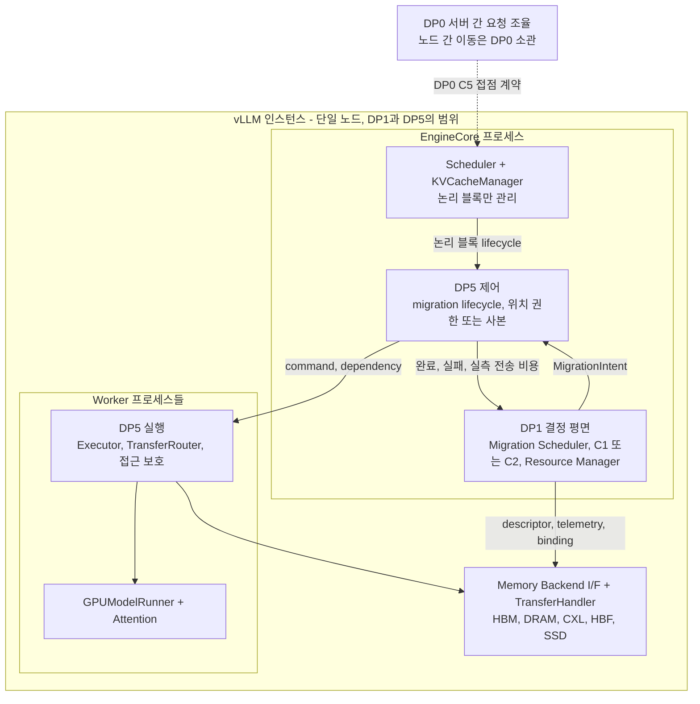
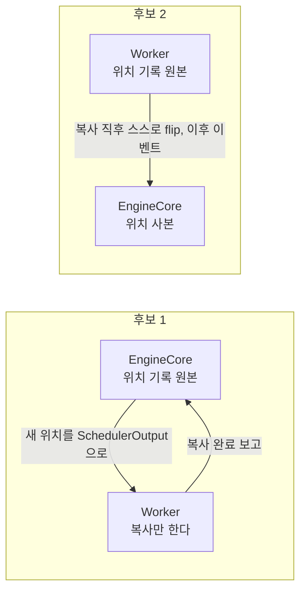
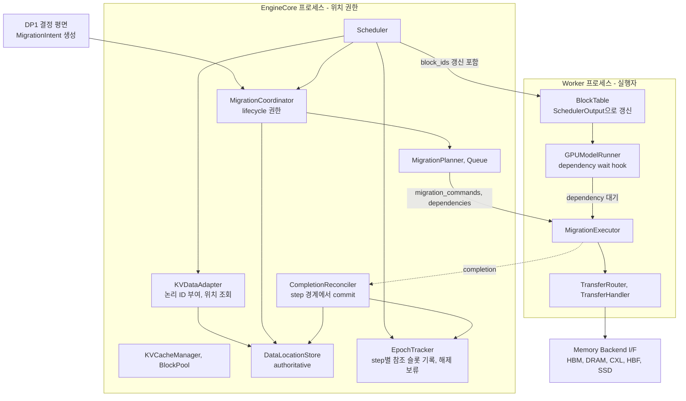
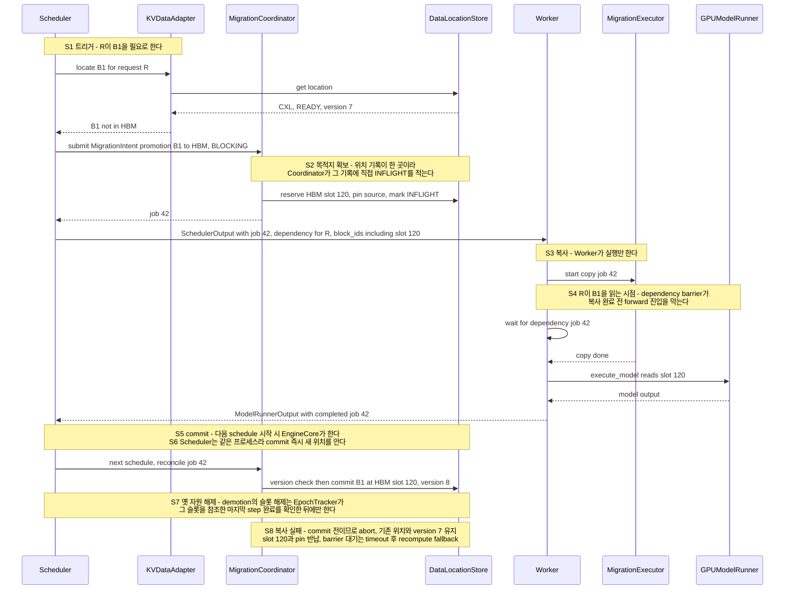
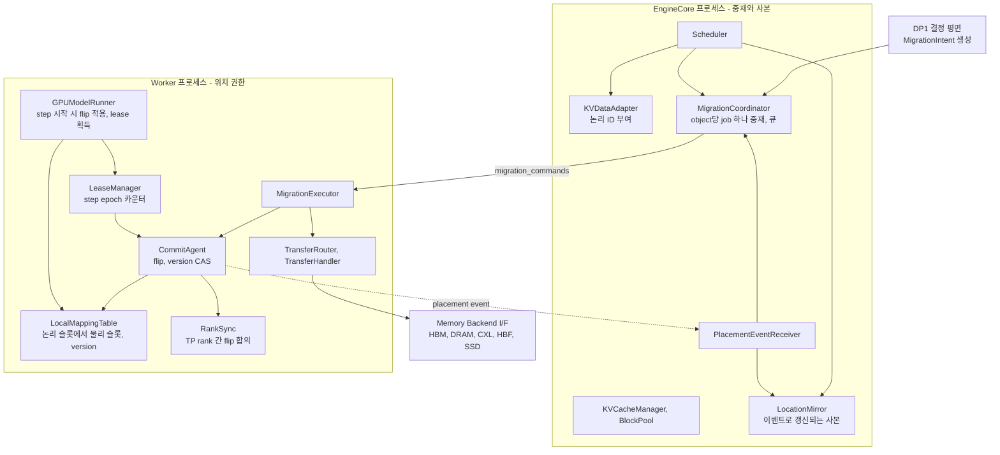
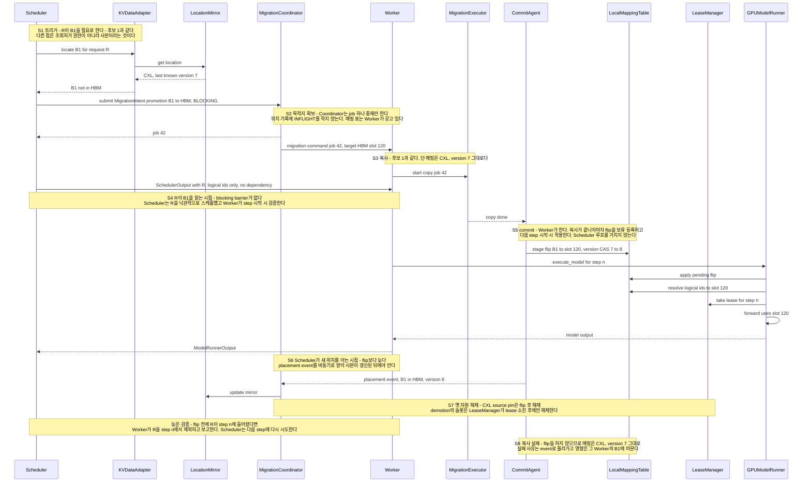

# DP5 — Migration 실행과 위치 일관 접근: 논리 블록 아래에서 물리 위치를 안전하게 옮기는 구조

| 항목 | 내용 |
|---|---|
| 상태 | **초안 (제안, 미커밋)** — 2026-10-06 |
| 번호 | **DP5는 임시 번호**다. 확정안은 DP1(결정) 바로 뒤의 DP2로 두고 기존 DP2~DP4를 한 칸씩 미는 것이다. 기존 `doc-mk/DP4`(비일관 CXL 공유 풀의 KV 일관성)는 최종 DP로 선정하지 않는다 |
| 기준 자료 | [`../DP1/dp1-ai-data-migration-decision-architecture.md`](../DP1/dp1-ai-data-migration-decision-architecture.md), [`../vllm-ai-data-migration-architecture.md`](../vllm-ai-data-migration-architecture.md) (이하 **공통 migration 문서**), [`../Evaluation/qa-evaluation-criteria.md`](../Evaluation/qa-evaluation-criteria.md) §12 QA5 Reliability · §13 QA6 Scalability, vLLM 소스 |
| 근거 수준 | **[A]** 실측 / **[B]** 문헌·공식 문서 / **[C]** 코드 읽기·구조 논증. 이 문서의 **코드 사실은 [C]**, **후보 간 우열은 모두 가설**이다. 별점·▲/▼·우열은 결과 전 예측이며 평가로 반증될 수 있다 |
| 평가 계획 | 아직 없음. §7에 방향만 적었고 `Evaluation/DP5/`는 이 문서가 확정된 뒤 만든다 |

---

# 0. 한눈에 보기

**한 줄.** DP1이 "무엇을, 언제, 어디로 옮길지"를 정하면, DP5는 **"그 이동을 서빙 중에 안전하고 싸게 실행하고, 그동안과 그 후에 어떻게 접근하게 할지"** 를 정한다.

> **문제문.** 서빙 엔진은 논리 블록만 관리한다. 이 상태에서 DP1이 결정한 물리 위치 이동(MOVE, REPLICATE, DROP, REMAP, RECLASSIFY)을 서빙 중에 **안전하게 실행**하고, 위치 변화를 엔진이 **어떻게 인지하고 반영하게 할 것인가**?

| | 내용 |
|---|---|
| **왜 풀어야 하나** | 현재 vLLM은 블록의 식별자가 곧 HBM 슬롯 번호이고, 이미 배정한 블록의 위치를 바꾸는 경로가 없다. DP1의 결정은 이 실행 계층 없이는 실현되지 않고, DP1의 현재 평가 결과도 "이상적인 이동"을 가정한 값이다 (§1) |
| **DP1과의 관계** | DP1이 `MigrationIntent`를 내보내고 DP5가 받는다. DP5는 완료·실패 이벤트와 실측 전송 비용을 DP1에 돌려준다 (§2) |
| **설계 쟁점** | D1 위치 권한(authority)을 어디에 둘 것인가, D2 위치 전환(commit)을 언제 어떻게 가시화하고 진행 중 접근을 어떻게 보호할 것인가, D3 위치 변화를 엔진에 어떤 경로로 알릴 것인가 (§3) |
| **후보 1** | **중앙 권한 + step 경계 commit.** EngineCore가 유일한 위치 권한이고 commit과 해제는 scheduler step 경계에서 일어난다. 공통 migration 문서 구조에 접근 측 계약을 더한 안 |
| **후보 2** | **Worker 로컬 버전 매핑 + lease 기반 비동기 commit.** 물리 위치의 권한이 Worker의 버전 매핑 표에 있고 commit은 Worker가 비동기로 한다. EngineCore는 이벤트로 갱신되는 사본을 본다 |
| **핵심 QA** | QA5 Reliability(Fault tolerance), QA2 Latency, QA6 Scalability, QA4 Modifiability. QA3 Resource는 보조, QA1 Throughput은 회귀 가드 (§5) |

**사전 예측 [C, 가설].** 두 후보 모두 DP1의 결정을 같은 data plane으로 실행하므로 **QA1·QA3 차이는 작을 것**으로 예상한다. 실질적인 trade-off는 ① 장애가 한 곳에 머무는가와 안전성을 증명하기 쉬운가(QA5), ② 이동이 많을 때의 commit 지연과 평상시 추가 비용(QA2), ③ Worker 수가 늘 때 중앙 권한이 병목이 되는가(QA6), ④ 변경이 한곳에 모이는가(QA4)에 있을 것이다 (§6).

---

# 1. 배경: 무엇이 문제이고 왜 풀어야 하는가

## 1.1 As-Is 사실 (vLLM 코드, [C])

| # | 사실 | 근거 |
|---|---|---|
| ① | `KVCacheBlock.block_id`는 `0 ~ num_gpu_blocks-1`의 **GPU KV 텐서 슬롯 번호**다. 식별자와 HBM 물리 위치가 같은 값이다 | `vllm/v1/core/kv_cache_utils.py:114-120` |
| ② | Scheduler가 Worker에 보내는 블록 정보는 **append 방식**이다. 요청마다 `new_block_ids`가 기존 목록 뒤에 붙고, 전체 교체는 resumed 요청에서만 일어난다 | `vllm/v1/core/sched/output.py:114-124` |
| ③ | Worker는 이 ID로 `BlockTable`에 행을 추가(`append_row`, `add_row`)한다. 이미 배정한 블록의 물리 슬롯을 **바꾸는 갱신 경로는 없다** | `vllm/v1/worker/block_table.py:276-280` |
| ④ | KV 이동은 offload 전용 경로(HBM ↔ CPU)다. 데이터 타입과 tier를 구분하지 않고, 위치를 소유하는 registry와 이동을 결정·실행하는 계층이 없다 | `vllm/v1/kv_offload/`, DP1 문서 §1.0 |
| ⑤ | `async_scheduling` 설정이 있다. 켜면 Scheduler가 이전 step 실행이 끝나기 전에 다음 step을 계획할 수 있다 | `vllm/v1/core/sched/scheduler.py:1066`, scheduler config |

## 1.2 문제 5가지

| # | 문제 | 설명 |
|---|---|---|
| **P1** | 식별자와 위치의 결합 | 블록 ID가 HBM 슬롯이라, 블록이 다른 tier로 가면 그 ID의 의미가 사라지고 같은 슬롯이 다른 데이터에 재사용된다. 이동 전후로 유지되는 논리 식별자가 없다 |
| **P2** | 위치 변경 경로 부재 | 위 ②③ 때문에 배정된 블록의 물리 위치를 Worker 쪽에 반영할 방법이 없다 |
| **P3** | 복사와 위치 전환의 원자성·실패 처리 부재 | 복사가 끝나기 전에 위치를 바꾸거나, 중간 실패 시 어느 쪽이 유효한지 알 수 없는 상태가 생길 수 있다 |
| **P4** | 이동 중 접근 hazard | 부분 복사된 블록 읽기, 해제된 슬롯 읽기(async scheduling으로 가능), 이동 중 쓰기, 이동 중 prefix hit (§4.4) |
| **P5** | 엔진과 tier의 결합 | 신규 메모리마다 엔진 경로를 수정해야 한다. DP1이 약속한 "신규 메모리 = plug-in 1개, decision plane 무변경"(DP1 §5.8)을 실행 계층이 지키지 못하면 의미가 없다 |

## 1.3 왜 풀어야 하나

1. **DP1의 효과가 이 계층 없이는 실현되지 않는다.** DP1은 `MigrationIntent`까지만 만들고 실제 이동은 범위 밖이다 (DP1 §2, §3.2).
2. **DP1의 평가 수치가 낙관적이다.** DP1 시뮬레이터는 이동 비용을 링크 간섭 모델(H22)로만 반영하고, commit·장애·접근 보호 비용은 들어 있지 않다. 이 DP가 그 비용을 처음 측정한다.
3. **잘못된 이동은 조용한 오답이다.** stale KV를 읽으면 오류 없이 답이 달라진다. 안전성은 성능 항목이 아니라 선결 조건이다.
4. **이동 중 stall이 TPOT SLO에 직결된다.** commit 방식과 barrier 범위가 꼬리 지연을 가른다.
5. **엔진을 tier 변경에서 격리해야 확장이 쉽다.** 신규 memory와 data type이 추가될 때 엔진 변경이 최소여야 한다.

---

# 2. 전체 아키텍처에서의 위치와 DP1과의 관계

## 2.1 위치 (단일 노드 안, DP0 아래)

- 위치 권한(authority)이 EngineCore 쪽인지 Worker 쪽인지가 두 후보를 가르는 핵심이다 (§4).
- DP1은 Resource Manager를 통해서만 Backend I/F를 읽고(읽기 전용), DP5가 Backend의 data-movement primitive와 TransferHandler를 써서 실제 이동을 한다 (DP1 §5.8.2, §5.9).

## 2.2 DP1 ↔ DP5 계약

| 방향 | 내용 | 근거 |
|---|---|---|
| DP1 → DP5 | `MigrationIntent`: action(MOVE, REPLICATE, DROP, REMAP, RECLASSIFY), data_refs, source, target, reason, priority, dependency_type. **Migration Data Selector가 Destination Tier Selector의 target을 받아 조립**하고 **Migration Coordinator**로 보낸다 | DP1 §2, §5.6, §5.7 |
| Scheduler → DP5 | 요청 실행에 필수인 **접근 promotion**을 같은 `MigrationIntent` 형식(목적지 HBM 고정, `dependency_type = BLOCKING`)으로 Migration Coordinator에 직접 제출한다. DP1의 selector를 거치지 않는다 | DP1 §2.2 |
| DP5 → DP1 | 완료·실패 이벤트(실패 사유 포함). DP1은 이를 재시도·억제 판단에 쓴다 | DP1 §5.9.7 |
| DP5 → DP1 | commit 결과로 DP1의 Registry를 동기화. commit 전에는 위치가 바뀌지 않는다 | DP1 §5.9.7, §22.3 |
| DP5 → DP1 | 실측 전송 BW·latency를 Telemetry로 보고해 binding의 estimate를 보정(측정–추정 closed loop) | DP1 §5.9.6 |
| DP5 ↔ 엔진 | 논리 블록 lifecycle(할당, 해제, 참조, prefix hash) 수신, 위치·준비 상태와 dependency 제공 | 공통 migration 문서 §11, §15 |

## 2.3 DP1이 DP5에 요구하는 사항 (top-down 요구사항)

| # | 요구 | DP1 근거 |
|---|---|---|
| R1 | 5개 action의 의미를 그대로 실행한다. copy가 없는 action(DROP, REMAP, RECLASSIFY)도 일관성 검증을 거친다 | §2.1 |
| R2 | copy-then-commit. 복사 완료 전에는 위치가 바뀌지 않는다 | §5.9.7 |
| R3 | 실패는 사유와 함께 이벤트로 돌려준다 | §5.9.7 |
| R4 | 경로의 hop 수, 병목 BW, setup 비용을 binding으로 노출하고 실측으로 보정한다 | §5.8.5, §5.9.6 |
| R5 | 신규 memory는 Backend plug-in 1개와 필요 시 TransferHandler 1개로 편입된다. 엔진과 decision plane은 무변경 | §5.8.6 |
| R6 | demand fetch가 promotion prefetch와 background demotion보다 우선하고, 공유 링크에 budget을 둔다 | §5.9.3 |
| R7 | 이동 단위와 정렬 제약을 지키고(coalescing, 패딩), write-limited 매체(HBF, SSD-PIM)를 보호한다 | §5.9.4, §5.9.5 |

## 2.4 범위 밖

- 이동 정책(무엇을, 언제, 어디로) — DP1
- 노드 간 이동 — DP0 (DP1 제약 C-S1, C-S2)
- near-data compute 배치 — 연산 배치 DP (DP1은 `near_data_compute` flag만 노출)
- KV 압축과 재사용 — 별도 DP
- 개별 memory 벤더 드라이버 구현

---

# 3. 공통 전제와 설계 쟁점

## 3.1 두 후보에 공통으로 고정하는 전제

| # | 전제 | 근거 |
|---|---|---|
| F1 | **논리 식별자는 안정적이다.** 엔진이 아는 것은 논리 ID(`data_ref`)와 준비 상태다. `block_id`는 HBM에 상주할 때만 부여되는 슬롯 번호로 본다. 논리 ID는 KVDataAdapter가 부여한다(prefix hash 기반 또는 request·index 기반) | 공통 migration 문서 §15 |
| F2 | copy-then-commit, object당 authoritative location은 정확히 하나, object당 in-flight job은 하나, version 검증 후 commit | 공통 migration 문서 §14.4 I1~I4 |
| F3 | sealed block 우선. active tail block은 Phase 1에서 이동을 defer한다 | 공통 migration 문서 §14.1~14.2 |
| F4 | 전송은 Backend I/F의 staging primitive와 TransferHandler(직접 경로는 fast-path override)로 한다 | DP1 §5.8.11, §5.9.2 |
| F5 | **GPU 커널은 HBM(과 HBF 직접 접근) 주소만 읽는다.** 나머지 tier는 접근 전에 HBM으로 materialize해야 한다. 6종 memory 중 4종이 `gpu_reachable=false`다 | DP1 §5.8.10 |
| F6 | **MigrationIntent의 입구는 Migration Coordinator 하나이고 생산자는 둘이다.** (a) DP1(Migration Data Selector가 조립), (b) Scheduler(필수 접근 promotion, `BLOCKING`). Coordinator가 object당 in-flight job 하나 규칙으로 중재한다 | DP1 §2.2, §5.7 |

F5의 결과로 접근 hazard의 중심은 "임의 tier 주소를 커널이 읽는 문제"가 아니라 **HBM 슬롯의 가시성(promotion 완료 후에만)과 재사용·해제 시점(demotion 후)** 이다.

## 3.2 설계 쟁점

| 쟁점 | 질문 | 후보 1 | 후보 2 |
|---|---|---|---|
| **D1 위치 권한** | 물리 위치의 유일한 기록을 어디에 두는가 | EngineCore의 `DataLocationStore` | 각 Worker의 버전 매핑 표. EngineCore는 사본 |
| **D2 commit과 접근 보호** | 위치 전환을 언제 보이게 하고, 진행 중 접근을 무엇으로 보호하는가 | Scheduler step 경계에서 commit, step 번호(epoch)로 해제 보류 | Worker가 다음 step 시작 시 flip, step별 lease로 해제 보류 |
| **D3 위치 인지 경로** | 엔진은 위치 변화를 어떻게 아는가 | 같은 프로세스의 동기 조회(view = authority) | 비동기 이벤트로 갱신되는 사본 조회와 late validation |

두 후보는 D1~D3을 **일관된 묶음**으로 선택한 것이다. 예를 들어 "중앙 권한 + lease" 같은 혼합안은 후속으로 둔다(§8).

## 3.3 두 후보의 차이를 쉽게 보기

**한 문장.** 후보 1은 **EngineCore(Scheduler)가 데이터 위치를 정하고 기록하는 유일한 곳**이고 위치 변경은 step 사이에서만 일어난다. 후보 2는 **데이터를 실제로 가진 Worker가 위치를 기록하고 복사가 끝나는 즉시 바꾸며**, EngineCore에는 그 뒤에 알려 준다.

**먼저 용어.**

| 용어 | 쉬운 뜻 |
|---|---|
| 논리 블록 | 엔진이 보는 "KV 조각 B1"이라는 이름. 어디에 있든 이름은 그대로다 |
| 물리 슬롯 | 그 조각이 실제로 놓인 자리(예: HBM의 120번 칸, CXL의 어느 주소) |
| 위치 권한(authority) | "B1이 지금 어느 자리에 있다"를 공식으로 기록하는 곳. 이 기록이 틀리면 안 된다 |
| commit | 복사가 끝난 뒤 공식 기록을 새 자리로 바꾸는 순간. 이 순간부터 새 자리가 진짜다 |
| epoch | scheduler가 실행하는 step의 번호. "몇 번째 step까지 끝났나"를 셀 때 쓴다 |
| lease | "이번 step이 이 슬롯을 쓰는 중"이라는 임시 표시. 표시가 남아 있으면 그 슬롯을 비우지 않는다 |
| flip | 후보 2에서 Worker가 자기 위치 기록을 새 자리로 바꾸는 동작(후보 1의 commit에 해당) |
| mirror | 후보 2에서 EngineCore가 갖는 위치 사본. 원본보다 조금 늦을 수 있다 |

**비유 (짧게).** 창고에서 물건 B1을 옆 선반으로 옮긴다고 하자. 후보 1은 **본사 장부 담당자 한 명**이 "옮겼다"를 선언하고, 선언은 정해진 점검 시간(step 경계)에만 한다. 후보 2는 **창고 담당자**가 옮기자마자 자기 장부를 고치고 본사에는 나중에 알리며, 본사는 사본 장부를 본다. *비유는 여기까지다.* 실제로는 GPU 커널이 옮기는 도중에도 다른 슬롯을 읽고 있고, 해제를 늦추는 lease와 epoch 같은 안전장치가 따로 있어서 비유로는 설명되지 않는다.

**차이 한눈에 (같은 시나리오 §4.1.3 / §4.2.3).**

| 질문 | 후보 1 | 후보 2 |
|---|---|---|
| 누가 "이동 끝"을 선언하나 | EngineCore가 다음 step을 시작할 때 | Worker가 복사 직후 다음 Worker step 시작 때 |
| 엔진은 언제 알게 되나 | 선언과 동시에 안다(같은 곳) | 조금 뒤에 이벤트로 안다. 그동안은 사본이 낡았을 수 있다 |
| 반쯤 복사된 블록을 읽지 않게 하는 법 | 복사가 끝날 때까지 forward를 막는 barrier | 복사가 끝나기 전에는 위치 기록을 바꾸지 않는다. 일찍 스케줄된 요청은 Worker가 걸러 낸다 |
| 쓰는 중인 옛 슬롯을 비우지 않는 법 | 슬롯을 쓴 마지막 step이 끝난 뒤에만 비운다(`EpochTracker`) | step마다 lease를 걸고 lease가 남은 슬롯은 비우지 않는다 |
| 복사가 실패하거나 멈추면 | commit 전이면 취소하고 원래 위치를 유지한다. barrier가 배치를 묶을 수 있어 timeout이 필요하다 | 그 Worker의 그 블록에서 끝난다. 배치 전체는 묶이지 않는다 |
| 치르는 대가 | 모든 commit이 EngineCore를 지나 직렬화되고 반영이 한두 step 늦다 | 사본 불일치(late validation 낭비), 평상시 매핑·lease 비용, TP에서 rank 간 합의 |

**그림: 위치 기록이 어디에 있고 알림이 어느 쪽으로 가는가.**

**언제 어느 쪽이 유리한가.** §6의 구조 논증(가설)에 따르면, 이동이 드물고 안전성을 증명하기 쉬워야 하며 변경이 한곳에 모이길 원하면 후보 1이 유리하다. 이동이 잦고 Worker가 많으며(예: 8 GPU TP) 느린 복사 하나가 배치 전체를 묶는 것을 피해야 하면 후보 2가 유리할 수 있다. 다만 후보 2는 rank 간 flip 합의의 정확성(I6)을 증명하지 못하면 선택할 수 없고, 이동 1회 시간에 비해 step 양자화가 작으면 지연 차이가 사라질 수 있다.

**더 자세히.** 후보 1 §4.1, 후보 2 §4.2, 접근 hazard §4.4, QA trade-off §6.

---

# 4. 후보 구조

## 4.1 후보 1 — 중앙 권한 + step 경계 commit (Central Authority, Epoch Commit)

**철학.** 위치의 진실은 EngineCore 한 곳에 있다. 물리 이동은 Worker가 하되 위치를 바꾸는 결정(commit)과 슬롯 해제는 Scheduler가 step 경계에서만 한다. Worker와 커널은 평범한 block table만 본다. 공통 migration 문서 §10("Worker는 copy executor, EngineCore는 logical migration authority")을 접근 측까지 완성한 안이다.

### 4.1.1 Module View

### 4.1.2 접근 측 계약

**접근 측 계약**은 이동이 진행되는 동안 서빙 엔진(Scheduler, Worker, 커널)과 migration 하위 시스템이 "어느 블록 사본을 누가 언제 읽어도 되고, 누가 언제 교체하거나 반납해도 되는가"를 정해 둔 규칙이다. 이동 중에는 같은 논리 블록의 사본이 두 곳에 있어서, 잘못된 쪽을 읽거나 아직 쓰는 슬롯을 반납하면 오류 없이 답이 틀리기 때문에 필요하다(§4.4).

아래 항목은 §4.1.3 시나리오(요청 R, 블록 B1)에서 일어나는 순서(forward 전 → 중 → 후)로 나열했다. 항목 이름과 번호(A1~A7)는 §4.2.2와 같다. S1~S8은 §4.2.3 뒤의 단계별 비교표의 단계 번호다.

| # | 항목 | 무엇 | 누가·언제 | 왜 필요한가 | B1 예시 |
|---|---|---|---|---|---|
| A1 | resolve (forward 전) | 논리 블록이 지금 어느 물리 슬롯에 있는지 찾아, block table에 넣을 슬롯 번호를 정한다 | Scheduler가 `schedule()` 안에서 KVDataAdapter로 조회한다. **HBM에 준비된 블록의 슬롯만** `block_ids`에 싣는다 (S1) | 커널은 HBM 슬롯만 읽는다(F5). 준비 안 된 블록의 슬롯이 실리면 H1 | B1은 CXL에 있어 HBM 슬롯이 없다고 확인하고 promotion이 필요하다고 판단한다. 커널 경로는 변하지 않는다 |
| A2 | readiness (forward 전) | 블록이 읽을 준비가 되었는지(`READY`, `INFLIGHT`, `ABSENT`) 확인한다 | Scheduler가 같은 프로세스의 `DataLocationStore`를 **동기로** 읽는다 (S1) | 이동 중인 블록을 모르고 스케줄하면 H1, H4 | CXL, `READY`, version 7. 그래서 BLOCKING `MigrationIntent`를 낸다 |
| A3 | pin / lease (복사 중, forward 중) | 쓰는 중인 사본이 반납·재사용되지 않게 붙들어 두는 표시 | 복사 중 source는 pin. forward가 읽는 슬롯은 `EpochTracker`가 step별로 기록하고, 그 step 완료 보고 전에는 해제하지 않는다 (S2, S7) | 해제된 슬롯을 읽는 H2(async scheduling 중첩) | job 42 동안 CXL의 B1 source를 pin한다. step이 slot 120을 참조했다는 기록을 남긴다 |
| A4 | 읽기 허용 시점 (forward 중) | 복사가 끝나기 전에는 R이 B1을 읽지 못하게 하는 장치 | blocking dependency barrier. Worker가 job 42 완료를 기다린 뒤에 `execute_model`로 들어간다 (S4) | 부분 복사된 슬롯을 읽는 H1 | R은 "copy done" 뒤에만 slot 120을 읽는다 |
| A5 | completion (forward 후) | 복사가 끝났음을 확정하고 새 위치를 공식 기록으로 바꾸는 절차 (commit) | Worker가 완료 job id를 보고하면 `CompletionReconciler`가 **다음 `schedule()` 시작 시** version을 검증하고 commit한다 (S5, S6) | 이동 중 쓰기·version 불일치 H3. commit 전에는 위치가 바뀌지 않아야 한다(I3) | version 7이 맞으면 B1을 HBM slot 120, version 8로 기록한다. 이 시점부터 Scheduler도 새 위치를 안다 |
| A6 | 확장 필요 (두 후보 공통) | `BlockTable`이 기존 블록의 슬롯 값을 **교체**할 수 있게 하는 코드 변경 | 구현 시 변경. 현재는 append만 가능하다(§1.1 ②③) | 위치가 바뀐 블록의 슬롯을 Worker에 반영할 경로가 없다(P2) | R의 block table에서 B1 자리를 slot 120으로 바꿀 수 있어야 한다 |
| A7 | late validation (**후보 2에만 있음**) | Worker가 step 시작에 "이 요청이 읽을 블록이 정말 준비됐나"를 다시 확인하는 절차 | 후보 1에는 없다. Scheduler의 view가 authority라 낙관적으로 스케줄할 일이 없다 (H5가 구조적으로 없음) | — | 해당 없음 |

### 4.1.3 Runtime View — 전경(foreground) promotion

### 4.1.4 장단점 (가설 [C])

| 구분 | 내용 |
|---|---|
| 장점 | ① 위치 기록이 한 곳이라 불변식 I1~I4 검증이 쉽다(상태 공간이 작음). ② Scheduler의 view가 곧 authority라 사본 불일치(H5)가 없다. ③ 평상시 커널·Worker 경로에 추가 비용이 없다(block table만 쓴다). ④ 새 data type과 일관성 규칙의 변경이 EngineCore 한 곳에 모인다. ⑤ 실패 시 의미가 단순하다: commit 전이면 abort하고 기존 위치 유지 |
| 단점 | ① 모든 commit이 EngineCore의 scheduler 루프를 지나 직렬화된다. Worker 수와 이동량이 늘면 병목이 될 수 있다. ② commit과 슬롯 해제가 step 경계에 양자화되어 이동이 끝나도 반영이 한두 step 늦다. ③ blocking promotion의 barrier가 느린·멈춘 복사에 배치 전체를 묶을 수 있다(timeout과 recompute fallback이 필요). ④ 핵심 변경이 `scheduler.py`, `output.py`, `kv_cache_manager.py`, `block_pool.py`에 있어 upstream 추종 부담이 크다(공통 migration 문서 §22) |

## 4.2 후보 2 — Worker 로컬 버전 매핑 + lease 기반 비동기 commit (Local Versioned Mapping, Lease Commit)

**철학.** 물리 복사본은 Worker가 갖고 있으므로 위치의 진실도 Worker가 갖는다. 복사가 끝나면 Worker가 자기 매핑 표의 항목을 **버전과 함께 원자적으로 바꾸고**(flip), 진행 중 접근은 step별 lease로 보호한다. EngineCore는 이동의 중재(object당 job 하나, 우선순위)만 하고, 위치는 이벤트로 갱신되는 사본으로 본다.

### 4.2.1 Module View

### 4.2.2 접근 측 계약

**접근 측 계약**은 이동이 진행되는 동안 서빙 엔진(Scheduler, Worker, 커널)과 migration 하위 시스템이 "어느 블록 사본을 누가 언제 읽어도 되고, 누가 언제 교체하거나 반납해도 되는가"를 정해 둔 규칙이다. 후보 2에서는 위치 권한이 Worker에 있어서, 같은 규칙을 EngineCore가 아니라 **Worker가 step 시작 시점에** 집행하는 것이 다르다.

항목 이름과 번호(A1~A7)는 §4.1.2와 같고 순서도 §4.2.3 시나리오(요청 R, 블록 B1)의 forward 전 → 중 → 후를 따른다. S1~S8은 §4.2.3 뒤의 단계별 비교표의 단계 번호다.

| # | 항목 | 무엇 | 누가·언제 | 왜 필요한가 | B1 예시 |
|---|---|---|---|---|---|
| A1 | resolve (forward 전) | 논리 블록이 지금 어느 물리 슬롯에 있는지 찾아 block table을 만든다 | Scheduler는 논리 슬롯만 보낸다. **Worker가 step 시작 시** `LocalMappingTable`로 물리 슬롯을 풀고, 보류 중인 flip을 먼저 적용한다. 커널은 풀린 block table을 쓴다 (S4) | 커널이 HBM 슬롯만 읽게 한다(F5). flip 적용 전 슬롯을 읽으면 H1 | step n 시작에 B1이 slot 120으로 풀린다 |
| A2 | readiness (forward 전) | 블록이 읽을 준비가 되었는지 확인한다 | Scheduler가 `LocationMirror`(마지막으로 알려진 위치와 version)를 읽는다. 필요하면 BLOCKING `MigrationIntent`를 Coordinator에 내어 `ensure_ready(data_ref, deadline)`를 **비동기로** 요청한다 (S1) | 이동 중인 블록을 모르고 스케줄하면 H1, H4. 사본이라 stale일 수 있어 H5가 생긴다 | 사본에는 CXL, version 7이 보인다. 그래서 BLOCKING intent를 낸다 |
| A3 | pin / lease (복사 중, forward 중) | 쓰는 중인 사본이 반납·재사용되지 않게 붙들어 두는 표시 | 복사 중 source는 pin(I4의 pin). forward가 읽는 슬롯은 Worker가 step마다 epoch 카운터를 올려 lease로 잡고, 카운터가 내려가기 전에는 해제하지 않는다. 블록별 refcount가 아니라 step 단위 epoch다 (S2, S7) | 해제된 슬롯을 읽는 H2(async scheduling 중첩) | job 42 동안 CXL의 B1 source를 pin한다. step n의 lease가 slot 120을 보호한다 |
| A4 | 읽기 허용 시점 (forward 중) | 복사가 끝나기 전에는 R이 B1을 읽지 못하게 하는 장치. 후보 2에서는 **flip** | 복사가 끝나면 `CommitAgent`가 flip(version CAS)을 보류해 두고, Worker가 **다음 step 시작 시** 적용한다. 복사 전이면 flip이 없어 매핑은 CXL 그대로다 (S4). TP>1이면 모든 rank가 같은 step에서 flip한다(`RankSync`, §4.2.3 보충) | 부분 복사된 슬롯을 읽는 H1, rank 간 version 불일치 H6 | 복사 완료 후 step n 시작에 B1을 slot 120, version 8로 flip한다 |
| A5 | completion (forward 후) | 새 위치를 EngineCore 쪽 기록에도 알리는 절차 | flip 후 `placement event`가 EngineCore로 **비동기** 전달되어 `LocationMirror`와 DP1 Registry를 갱신한다 (S5, S6). commit(flip) 자체는 A4에서 이미 끝났다 | 이동 중 쓰기·version 불일치 H3(flip이 version CAS라 불일치면 abort하고 재복사) | event가 오면 사본이 HBM, version 8로 바뀌고 Scheduler는 그제야 B1을 ready로 본다 |
| A6 | 확장 필요 (두 후보 공통) | `BlockTable`이 기존 블록의 슬롯 값을 **교체**할 수 있게 하는 코드 변경 | 구현 시 변경. 현재는 append만 가능하다(§1.1 ②③). 후보 2에서는 Worker가 풀어낸 block table에 flip 결과를 반영하는 형태다 | 위치가 바뀐 블록의 슬롯을 Worker에 반영할 경로가 없다(P2) | R의 block table에서 B1 자리를 slot 120으로 바꿀 수 있어야 한다 |
| A7 | late validation (**후보 2에만 있음**) | Scheduler가 stale 사본으로 스케줄했을 때 Worker가 step 시작에 바로잡는 절차 | **낙관적으로 스케줄**한 요청을 Worker가 step 시작 시 검증하고, 준비 안 된 요청은 그 step에서 제외해 보고한다 (S4) | 사본 지연에서 오는 H5. 안전은 지키되 낭비로 흡수한다 | flip 전에 R이 스케줄됐다면 R은 step n에서 제외되고 보고된다 |

### 4.2.3 Runtime View — 전경(foreground) promotion

**TP>1일 때 추가되는 것.** 위 시나리오는 rank가 하나인 경우의 흐름이다. Worker가 여러 개(tensor parallel)이면 같은 논리 블록 B1을 모든 rank가 각자 복사하므로, flip은 **모든 rank가 같은 step 번호에서 같은 version으로** 일어나야 한다. 한 rank만 먼저 flip하면 rank마다 B1의 version이 달라져 H6가 생긴다. 이를 막기 위해 `RankSync`가 모든 rank의 복사 완료를 확인하고 flip할 step을 합의한다. 이 합의가 후보 2의 추가 비용이자 위험이고(I6, §8 #1), 합의 도중 일부 rank만 flip한 부분 장애 상태가 불변식 증명의 부담을 키운다. 후보 1에서는 한 번의 commit 결정이 같은 `SchedulerOutput`으로 전 rank에 전달되어 이 문제가 구조적으로 없다.

#### 같은 시나리오, 단계별 비교 (§4.1.3 vs §4.2.3)

R이 CXL의 B1을 필요로 하고, Scheduler가 BLOCKING promotion을 내며, B1이 CXL(version 7)에서 HBM slot 120(version 8)으로 옮겨 가는 같은 시나리오다. 단계 번호는 두 시퀀스 다이어그램의 Note와 같다.

| 단계 | 후보 1 (중앙 권한, step 경계) | 후보 2 (Worker 로컬, lease) |
|---|---|---|
| S1 트리거 | Scheduler가 `DataLocationStore`(권한)를 조회해 B1이 HBM에 없음을 알고 BLOCKING intent를 낸다 | 같은 흐름이지만 조회처가 `LocationMirror`(사본)다. 사본이 stale일 수 있다 |
| S2 목적지·슬롯 확보 | Coordinator가 위치 기록에 slot 120 예약, source pin, `INFLIGHT`를 직접 적는다 | Coordinator는 job 42와 target slot 120만 정해 Worker에 명령한다. 위치 기록은 Worker의 매핑 표에 있다 |
| S3 복사 | Worker의 `MigrationExecutor`가 복사한다. command는 `SchedulerOutput`에 실려 온다 | Worker의 `MigrationExecutor`가 복사한다. command는 Coordinator가 Worker로 직접 보낸다. 매핑은 version 7 그대로다 |
| S4 R이 B1을 읽을 수 있는 때 | dependency barrier가 job 42 완료까지 forward 진입을 막는다. 복사가 느리면 배치 전체가 기다린다 | barrier 없음. 복사가 끝나 flip이 적용된 step부터 읽는다. 그 전에 R이 스케줄됐다면 Worker가 step 시작 시 R을 제외한다(late validation) |
| S5 commit 주체와 시점 | EngineCore(`CompletionReconciler`)가 **다음 `schedule()` 시작 시** version을 검증하고 commit한다 | Worker(`CommitAgent`)가 복사 완료 직후 flip을 등록하고 **다음 Worker step 시작 시** version CAS로 적용한다 |
| S6 Scheduler가 새 위치를 아는 때 | commit과 동시에 안다. 같은 프로세스라 view가 곧 authority다 | flip보다 늦다. placement event가 와서 `LocationMirror`가 갱신된 뒤에 안다 |
| S7 옛 자원 해제 | commit 후 source pin을 풀고, demotion 슬롯은 `EpochTracker`가 그 슬롯을 참조한 마지막 step 완료를 본 뒤 해제한다 | flip 후 source pin을 풀고, demotion 슬롯은 `LeaseManager`가 lease 소진을 본 뒤 해제한다 |
| S8 복사 실패 | commit 전이라 abort하고 기존 위치와 version 7을 유지한다. slot 120과 pin을 반납한다. barrier에서 기다리던 배치는 timeout과 recompute fallback이 필요하다 | flip을 하지 않아 매핑이 그대로이고 영향이 그 Worker의 B1에 머문다. 실패 event로 Coordinator가 재시도나 recompute를 정한다. 배치 전체는 묶이지 않는다 |

### 4.2.4 장단점 (가설 [C])

| 구분 | 내용 |
|---|---|
| 장점 | ① commit이 Scheduler 루프를 거치지 않아 EngineCore 병목이 없고 Worker 수에 따라 분산된다. ② 복사가 끝나면 다음 Worker step에서 바로 보이고, 한 Worker의 느린·멈춘 복사가 배치 전체를 묶지 않는다(장애가 그 Worker의 해당 object에 머문다). ③ Scheduler 코어(`scheduler.py`)의 변경이 작다. ④ layer 단위 overlap 같은 후속 최적화의 여지가 크다 |
| 단점 | ① **TP rank 간 flip 합의**가 필요하고, 합의 도중 부분 장애 상태(일부 rank만 flip)가 생길 수 있어 불변식 증명의 상태 공간이 크다. ② Scheduler의 view가 사본이라 stale 위치로 스케줄할 수 있고 late validation으로 낭비가 생긴다(H5). ③ 매핑 표, lease, RankSync가 Worker와 ModelRunner에 들어가 분산 변경이 크다. ④ 평상시에도 매핑 해석과 lease 갱신의 비용이 있다(step 단위 epoch로 줄이지만 0은 아니다). ⑤ 위치 사본(EngineCore)과 DP1 Registry가 지연되어 DP1이 약간 오래된 상태로 결정한다 |

## 4.3 제외한 후보

| 후보 | 제외 이유 |
|---|---|
| UVM/HMM 기반 단일 가상 주소 (OS·드라이버 페이징) | F5: 6종 memory 중 4종이 GPU 직접 접근 불가(`host_staged_only`)라 페이징이 덮지 못한다. DP1 action 중 DROP, REPLICATE, REMAP, RECLASSIFY와 write-limited 매체 보호를 페이징으로 표현할 수 없다. fault 기반 migration은 kernel 실행 중 stall을 만든다 |
| attention 커널이 descriptor를 직접 해석 | 모든 attention backend 커널을 수정해야 해 QA4가 크게 나빠지고, F5 때문에 얻는 이득이 작다 |

## 4.4 접근 hazard와 후보별 처리

| # | hazard | 후보 1 | 후보 2 |
|---|---|---|---|
| H1 | 부분 복사된 target을 읽음 | blocking dependency barrier가 복사 완료 전 forward 진입을 막는다 | flip은 모든 rank의 복사 완료 후에만 일어난다 |
| H2 | 해제된 source 슬롯을 읽음(async scheduling 중첩) | `EpochTracker`: 슬롯을 참조한 마지막 step 완료 후 해제 | step epoch 카운터: lease가 남은 슬롯은 해제 보류 |
| H3 | 이동 중 쓰기 / version 불일치 commit | sealed만 이동, active tail은 defer. EngineCore가 version 검증 후 commit | 같음(F3). flip은 version CAS이며 불일치면 abort하고 재복사 |
| H4 | 이동 중인 블록에 prefix hit | pin을 걸고 `INFLIGHT` 상태로 노출. source에서 읽거나 후순위로 둔다 | 같은 정책이지만 상태는 사본이라 늦게 반영될 수 있다 |
| H5 | 엔진 view와 실제 위치의 불일치 | view = authority라 없음 | 사본 지연으로 발생 가능. late validation으로 안전을 지키고 비용으로 흡수 |
| H6 | TP rank 간 같은 논리 블록의 version 불일치 | 한 번의 commit 결정이 같은 `SchedulerOutput`으로 전 rank에 전달된다 | `RankSync`의 합의 프로토콜이 보장해야 한다. 이 DP에서 가장 큰 검증 부담 |

## 4.5 선결 조건: 불변식 목록 (QA5 Faultlessness)

| # | 불변식 | 출처 |
|---|---|---|
| I1 | object당 authoritative location은 정확히 하나(recomputable은 absent 허용) | 공통 migration 문서 §14.4 |
| I2 | object당 in-flight job은 하나 | 같음 |
| I3 | commit 전에는 위치가 바뀌지 않고, commit은 version이 일치할 때만 한다 | 같음 |
| I4 | pin 또는 lease가 남은 동안 source를 해제하지 않는다 | 같음 |
| I5 | 커널이 읽는 슬롯은 항상 완전히 복사된 데이터다 | **이 DP 추가 제안** |
| I6 | TP rank 간 같은 논리 블록은 같은 version을 읽는다 | **이 DP 추가 제안** |

---

# 5. 풀려는 QA

공통 QA 정의와 별점은 [`../Evaluation/qa-evaluation-criteria.md`](../Evaluation/qa-evaluation-criteria.md)이며 이 문서는 바꾸지 않는다. QA5와 QA6은 같은 날 새로 추가했다(§12, §13).

## 5.1 선택한 QA

| QA | 역할 | 이 DP의 metric (요약) |
|---|---|---|
| **QA5 Reliability** (Fault tolerance) | **핵심 1순위** | **FTR** = 장애 주입 후 관측 구간의 SLO Goodput ÷ 장애 없는 구간의 SLO Goodput의 기하평균. 선결 조건: I1~I6 위반 0건(점수가 아니라 탈락 기준) |
| **QA2 Latency** | 핵심 | TTFT P99, TPOT P99를 분리해 보고. 이동이 많은 구간과 평상시를 구분. 진단: promotion 대기, barrier·commit 지연, 평상시 resolve 오버헤드 |
| **QA6 Scalability** | 핵심 | SE(N), N = GPU Worker 수 1, 2, 4, 8(단일 노드 한계). 진단: 중앙 권한 CPU 점유, commit 큐 대기 P99, 동시 migration 수·object 수 |
| **QA4 Modifiability** | 핵심 | 변경 시나리오별 module 수·공수·에이전트 비용(H21의 세 sub-metric). 시나리오는 §5.2 |
| QA3 Resource Utilization | 보조 | 일시적 추가 점유 피크(GiB): source·target 이중 상주 + bounce buffer + 매핑 메타데이터. 자원만 재고 성능은 섞지 않는다(H20) |
| QA1 Throughput | 회귀 가드 | Max SLO Goodput이 Baseline(As-Is `kv_offload`)보다 나빠지지 않는지만 확인 |
| Functional Correctness | 선택 안 함 | 이동은 복사라 모델 정확도(F1)가 변하지 않아야 하며 후보를 가르지 못한다. 변화가 없음을 확인하는 가드로만 쓴다 |

## 5.2 QA 시나리오 (요약)

| QA | 자극 | 환경 | 응답 | 응답 측정 |
|---|---|---|---|---|
| QA5 | 복사 도중 전송 실패·타임아웃, 목적지 할당 실패, Worker 또는 coordinator 중단. 주입 시점은 복사 전, 복사 중, commit 직전, commit 직후 source 해제 전 | 동시 migration이 있는 정상 부하 | 서비스 유지, 영향 범위 한정, 복구 | FTR, 복구 시간, 복구 불가 손실, 불변식 위반 건수 |
| QA2 | HBM pressure로 demotion이 몰리고 prefix hit이 promotion을 요구 | DP1 결정을 고정한 migration trace replay | 일반 요청의 지연 영향 최소화 | TTFT P99, TPOT P99 (Baseline 대비) |
| QA6 | Worker 수 증가, 단위당 migration 부하 고정 | 단일 노드 1~8 GPU | 선형에 가깝게 확장 | SE(N_max) |
| QA4 | M-a: 직접 경로가 없는 신규 memory 추가. M-b: 신규 data type(LoRA) 추가. M-c: 신규 일관성 규칙(active tail의 delta sync) 추가. M-d: 신규 copy engine 추가 | 구현 후 module·LOC 측정 | 기존 구조 변경 최소 | module 수, 공수, 에이전트 비용 |

비선택 QA의 이유는 §5.1 표에 적었다. DP1의 QA3(HBM 사용량)와 이 DP의 QA3(일시적 추가 점유)는 이름이 같아도 측정 대상이 다르므로 결과 문서에서 구분해 쓴다.

---

# 6. 후보 간 QA Trade-off (가설 [C])

▲ = 상대적으로 유리, ▼ = 불리, ≈ = 차이 작음 예상. **모두 결과 전의 구조 논증이며 평가로 반증될 수 있다.**

| QA | 후보 1 (중앙 권한, step 경계) | 후보 2 (Worker 로컬, lease) | 가르는 메커니즘 | 뒤집히는 조건 |
|---|---|---|---|---|
| **QA5 선결: 불변식(I1~I6) 증명** | ▲ 위치 기록이 한 곳, H5·H6가 구조적으로 없음 | ▼ rank 합의와 사본 지연으로 상태 공간이 큼 | 권한이 하나인가 여럿인가 | RankSync 프로토콜이 단순하게 검증되면 격차가 줄어듦 |
| **QA5 FTR (Fault tolerance)** | ▼~≈ barrier가 느린·멈춘 복사에 결합. timeout·recompute fallback이 있으면 완화 | ▲ 한 Worker의 장애가 그 object에 머묾 | 장애가 전파되는 경로(배치 전체 barrier vs Worker 로컬) | 합의 도중 부분 장애가 잦으면 후보 2가 크게 불리 |
| **QA2 Latency, 평상시** | ▲ 커널·Worker 경로에 추가 비용 없음 | ▼ 매핑 해석과 lease 갱신이 항상 있음 | resolve가 CPU 스케줄 시점인가 Worker step 시작인가 | step epoch가 충분히 싸면 차이는 μs 수준 |
| **QA2 Latency, 이동이 많을 때** | ▼ commit이 step 경계에 양자화, blocking barrier의 head-of-line | ▲ 복사 완료 후 다음 Worker step에 반영, 배치 전체 barrier 없음 | commit 가시화 시점, barrier 범위 | 이동 1회 시간이 수백 ms이면 step 양자화(수십 ms)는 묻힘 |
| **QA6 Scalability** | ▼ 모든 commit이 EngineCore 루프를 지남. N=8에서 포화 가능 | ▲ commit이 Worker에 분산. 단 rank 합의 비용이 N에 따라 증가 | 직렬화 지점의 위치 | N이 작으면(1~2) 차이 없음. 합의 비용이 크면 후보 2의 이득이 줄어듦 |
| **QA4 Modifiability** | ▲ 새 data type과 일관성 규칙이 EngineCore 한 곳. 단 `scheduler.py` 등 엔진 코어 변경량이 큼(upstream 추종 부담) | ▼ 매핑, lease, 합의가 Worker·ModelRunner에 분산. 엔진 코어 변경은 작음 | 변경이 한곳에 모이는가 vs 엔진 코어를 건드리는가 | M1(module 수)과 upstream 충돌 위험은 서로 다른 방향이라 **측정 정의에 따라 순위가 바뀔 수 있음** |
| QA3 보조 | ≈ 이중 상주가 commit 지연과 epoch 해제까지 지속 | ≈ lease 해제가 빠르나 매핑 메타 추가 | 이중 상주 지속 시간 | 이동이 짧고 드물면 차이 없음 |
| QA1 가드 | ≈ | ≈ (이동이 많을 때 약간 ▲) | barrier 대기로 비는 시간 | — |

**읽는 법.**

- 후보 1은 **검증 가능성, 평상시 비용, 변경 집중**에서 유리하고, 후보 2는 **이동이 많을 때의 지연, 장애 격리, 규모 확장**에서 유리하다.
- 평상시 이동이 드문 서빙에서는 후보 1이 낫고, 이동이 잦고 Worker가 많은 구성(예: 8 GPU TP, 이기종 tier 다수)에서는 후보 2가 유리할 가능성이 크다. **두 후보의 우열은 이동 빈도와 Worker 수라는 워크로드 축에 의존**한다.
- 후보 2의 가장 큰 위험은 성능이 아니라 **rank 합의의 정확성**(I6)이다. 불변식을 증명하지 못하면 점수와 무관하게 선택할 수 없다.
- 실제 차이가 작을 가능성: 이동 1회의 시간(수십~수백 ms)에 비해 step 양자화(수십 ms)는 작아서 QA2의 우열이 사라질 수 있다. 그 경우 선택은 QA5(검증 가능성)·QA6·QA4와 구조 논증으로 정해진다.

---

# 7. 평가 방향 (요약)

세부 계획은 이 문서가 확정된 뒤 `Evaluation/DP5/`에 사전 등록한다.

| 항목 | 방향 |
|---|---|
| DP1 결정 고정 | DP1의 결정이 섞이지 않도록 **같은 `MigrationIntent` trace를 두 후보와 Baseline에 replay**한다 |
| Baseline | As-Is vLLM `kv_offload`(HBM ↔ CPU, 위치 권한 없음) |
| 환경 | 단일 서버 GPU 8장. 가능한 경로(HBM ↔ DRAM 복사, Worker 수 1~8)는 실측 [A], 나머지는 시뮬레이션 [B+C] |
| 시뮬레이터 | 현재 장애 모델과 commit·epoch·합의 모델이 없다. 추가는 M class 변경이며 사유와 수정 전후 값을 기록한다(H22와 같은 방식) |
| 불변식 | model check로 I1~I6을 검증하고 결함 변종을 심어 검출을 확인한다 |
| 사전 등록 | 장애 시나리오 집합, 관측 구간 W, 불변식 목록, QA4 변경 시나리오와 공식, 별점 경계를 결과 전에 `Evaluation/DP5/`에 등록한다 |
| 규칙 | `evaluation` skill의 규칙(H1~H24)을 따른다. 결과를 본 뒤 정의를 바꾸지 않는다 |

---

# 8. 열린 질문과 위험

| # | 내용 | 영향 |
|---|---|---|
| 1 | TP rank 간 flip 합의(후보 2)의 비용과 부분 장애 처리 방식은 설계만 있고 검증된 것이 없다 | QA5, QA6 |
| 2 | `async_scheduling`에서 step이 몇 개까지 중첩되는지, epoch 해제가 이를 어떻게 따라야 하는지 코드 수준으로 확인하지 못했다 | H2, 후보 1·2 모두 |
| 3 | `BlockTable`의 append 방식을 "기존 블록 슬롯 교체"로 확장하는 변경 범위를 측정하지 않았다(두 후보 공통) | QA4 |
| 4 | active tail block을 Phase 1에서 defer하는 것이 DP1의 이득을 얼마나 깎는지 모른다 | QA1, QA2 |
| 5 | "중앙 권한 + lease"처럼 두 후보를 섞은 혼합안은 이 문서에서 다루지 않았다. 평가 결과 두 후보의 약점이 반대 방향이면 후속 후보가 될 수 있다 | 후보 정의 |
| 6 | 후보 간 우열은 전부 가설이다. 특히 QA4는 M1(module 수)과 upstream 충돌 위험이 반대 방향이라 정의에 따라 순위가 바뀐다 | 해석 |
| 7 | 번호 개편(DP2로 이동) 반영이 필요하다: DP0 DP 표, 평가 skill의 "DP1~DP4" 문구, DP1 문서의 out of scope 문구, 슬라이드 참조 | 문서 정합성 |
| 8 | DP1 시뮬레이터의 낙관적 가정(이상적 이동)이 이 DP의 결과로 얼마나 바뀌는지는 평가 후에 알 수 있다 | DP1 결과 해석 |
| 9 | 후보 2에서 migration command를 Coordinator가 Worker로 **직접** 보내는지, 기존 `SchedulerOutput`에 실어 보내는지가 정해지지 않았다(§4.2.1 모듈 뷰는 직접 전달로 그렸다). 직접 전달이면 EngineCore↔Worker에 새 채널이 필요하고, vLLM의 기존 step 동기화와의 관계를 따져야 한다 | QA4, QA2 |
| 10 | 후보 2에서 target HBM 슬롯(예: slot 120)을 누가 확보하는지 명시되지 않았다. §4.2.3은 Coordinator가 BlockPool에서 슬롯을 받아 command에 실어 보내는 것으로 가정했다 | 후보 2 정의 |

---

# 9. 참고

- [`../DP1/dp1-ai-data-migration-decision-architecture.md`](../DP1/dp1-ai-data-migration-decision-architecture.md): §2 MigrationIntent·action, §3.3 제약 C-S1~S3, §5.8 Memory Backend I/F, §5.9 Transfer Handler 설계 고려, §5.9.7 일관성·실패 가정
- [`../vllm-ai-data-migration-architecture.md`](../vllm-ai-data-migration-architecture.md): §10 프로세스 경계, §11 SchedulerOutput 통합, §13 foreground promotion, §14 일관성 규칙, §15 KV 통합, §19 실패·rollback, §22 코드 변경 지점
- [`../Evaluation/qa-evaluation-criteria.md`](../Evaluation/qa-evaluation-criteria.md): §12 QA5 Reliability, §13 QA6 Scalability, §10 결과 표 형식
- vLLM 소스: `vllm/v1/core/kv_cache_utils.py`, `vllm/v1/core/sched/output.py`, `vllm/v1/worker/block_table.py`, `vllm/v1/kv_offload/`
