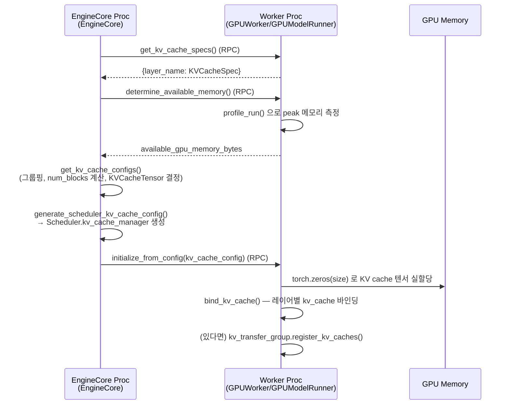

# 시나리오 01 — KV Cache 초기화 (엔진 기동 시 1회)

> 상태: ✅ **기존** — 지금 vLLM 코드에 이미 그대로 구현되어 있는 동작
> 출처: `doc-mk/vllm-kv-cache-analysis.md` §9.1
> 관련: `doc-mk/vllm-call-path-analysis.md` §2 (모델 로드 단계 바로 다음에 일어남)

## 개요

`vllm serve` 프로세스가 뜬 직후, 요청을 하나도 받기 전에 **딱 한 번** 실행되는
초기화 시퀀스입니다. 모델 구조 build + 가중치 로드(`call-path-analysis.md` §2)가
끝난 다음, KV cache가 쓸 GPU 메모리를 프로파일링하고 실제 텐서를 할당합니다.
새로운 메모리 티어를 추가할 때, 이 시퀀스가 "정상적인 초기화란 이런 모양이다"라는
기준선이 됩니다.

## 전제

- `EngineCore.__init__()`이 `Executor`를 생성한 직후 시점
- 모델은 이미 GPU에 로드되어 있음 (weight 로드 완료)
- 워커 프로세스(들)는 이미 기동되어 대기 중

## Sequence Diagram

## 단계별 설명

1. **`EngineCore`가 `Worker`에게 `get_kv_cache_specs()`를 RPC 호출**합니다.
   레이어마다 필요한 KV cache 형태(attention 타입, 블록 크기 등)를 물어보는
   단계입니다.
2. **`Worker`가 `{layer_name: KVCacheSpec}` 딕셔너리를 반환**합니다. 이 시점엔
   아직 메모리를 실제로 할당하지 않고, "무엇이 필요한지" 스펙만 정의합니다.
3. **`EngineCore`가 `determine_available_memory()`를 RPC 호출**해서 "KV cache에
   쓸 수 있는 메모리가 얼마나 남았는지" 물어봅니다.
4. **`Worker`가 `profile_run()`으로 peak 메모리를 실측**합니다. 더미 배치를
   한 번 돌려서 모델 자체(가중치+activation)가 쓰는 메모리를 측정하고, 전체
   GPU 메모리에서 그만큼을 뺀 나머지를 KV cache 몫으로 계산합니다.
5. **`Worker`가 `available_gpu_memory_bytes`를 반환**합니다.
6. **`EngineCore`가 `get_kv_cache_configs()`를 실행**합니다. 레이어 스펙들을
   그룹핑(하이브리드 attention-type 대응)하고, 사용 가능한 메모리를 페이지
   크기로 나눠 `num_blocks`를 계산하고, `KVCacheTensor` 명세(어떤 크기의
   버퍼를 몇 개 만들지)를 확정합니다.
7. **`EngineCore`가 `generate_scheduler_kv_cache_config()`를 실행**해서
   스케줄러가 쓸 `KVCacheConfig`를 만들고, 이걸로 `Scheduler.kv_cache_manager`를
   생성합니다.
8. **`EngineCore`가 `initialize_from_config(kv_cache_config)`를 RPC 호출**합니다.
   이제 각 워커에게 "방금 정해진 설정대로 실제 메모리를 할당하라"고 지시하는
   단계입니다.
9. **`Worker`가 `torch.zeros(size)`로 KV cache 텐서를 실제로 할당**합니다. 이
   호출이 이 전체 시퀀스에서 **GPU 메모리가 실제로 소비되는 유일한 지점**입니다.
10. **`Worker`가 `bind_kv_cache()`로 레이어별 바인딩**을 합니다. 방금 만든
    raw 텐서를 각 attention 레이어의 `layer.kv_cache`에 연결합니다.
11. **(선택) KV connector가 있다면 `register_kv_caches()`를 호출**해서, 분산
    prefill 같은 기능이 이 물리 텐서에 직접 접근할 수 있도록 등록합니다.

## 구현 시 참고사항

- 실제 코드 위치: `EngineCore._initialize_kv_caches()` (`vllm/v1/engine/core.py:232`),
  `GPUWorker.determine_available_memory()` (`vllm/v1/worker/gpu_worker.py:352`),
  `GPUModelRunner.initialize_kv_cache()` (`vllm/v1/worker/gpu_model_runner.py:6866`)
- 새 메모리 티어(CXL, Custom HBM 등)를 "1급 메모리"로 편입시키려면, 이 시퀀스의
  6~9단계에 해당하는 부분(스펙 그룹핑 → 메모리 계산 → 실제 할당)을 티어별로
  반복하거나 확장해야 합니다 — `doc-mk/vllm-kv-cache-memory-abstraction-layer.md`
  §8의 module view가 이 확장 지점을 보여줍니다.
- 이 시퀀스는 "정상적인 초기화 순서"의 기준선이므로, 시나리오 02(MAL 티어
  디스커버리)를 설계/구현할 때 이 순서(스펙 수집 → 메모리 프로파일링 → config
  생성 → 실제 할당)와 어긋나지 않도록 맞추는 게 안전합니다.
