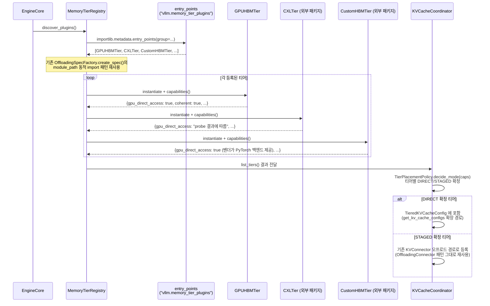

# 시나리오 02 — MAL 티어 디스커버리 & 능력치 협상

> 상태: 🧩 **설계 제안** — 아직 vLLM에 구현되어 있지 않음
> 출처: `doc-mk/vllm-kv-cache-memory-abstraction-layer.md` §2.1
> 관련: 시나리오 01 (기존 초기화 시퀀스, 이 시나리오가 확장하는 대상)

## 개요

엔진 기동 시, Memory Abstraction Layer(MAL)가 플러그인으로 등록된 모든 메모리
티어(CXL, Custom HBM 등 vLLM 트리 밖 패키지 포함)를 찾아내고, 각 티어의
능력치(capability)를 물어본 뒤, 티어별로 DIRECT 모드(attention이 직접 gather)로
쓸지 STAGED 모드(오프로드 커넥터 경유)로 쓸지를 자동으로 확정하는 시퀀스입니다.

## 전제

- 시나리오 01의 1~5단계(레이어 스펙 수집, 메모리 프로파일링)는 GPU HBM에
  대해서는 동일하게 이미 끝났다고 가정
- CXL/Custom HBM 등 추가 메모리 티어가 별도 pip 패키지로 설치되어 있고,
  `vllm.memory_tier_plugins` entry-point 그룹에 등록되어 있음

## Sequence Diagram

## 단계별 설명

1. **`EngineCore`가 `MemoryTierRegistry.discover_plugins()`를 호출**합니다.
   시나리오 01의 초기화 흐름에서, GPU HBM 전용 로직이 있던 자리를 대체/확장하는
   지점입니다.
2. **`MemoryTierRegistry`가 `importlib.metadata.entry_points(group="vllm.memory_tier_plugins")`를
   호출**해서 시스템에 설치된 모든 티어 플러그인 패키지를 스캔합니다.
3. **`entry_points`가 등록된 클래스 목록을 반환**합니다(`GPUHBMTier`, `CXLTier`,
   `CustomHBMTier` 등). 여기서 `CXLTier`/`CustomHBMTier`는 vLLM 트리 밖의
   **별도 pip 패키지**로 존재할 수 있습니다 — vLLM 코드를 한 줄도 안 건드리고
   설치만으로 새 티어가 추가됩니다.
4. **(설계 근거 주석)** 이 동적 로딩 방식은 새로 발명하는 게 아니라, 이미 vLLM에
   있는 `OffloadingSpecFactory.create_spec()`의 `spec_module_path` 동적 import
   패턴(`vllm/v1/kv_offload/factory.py:45-49`)을 그대로 재사용하는 것입니다.
5. **`MemoryTierRegistry`가 각 플러그인을 순회하며 인스턴스화 후 `capabilities()`를
   호출**합니다 (`loop` 블록). `GPUHBMTier`는 `gpu_direct_access: true, coherent:
   true`처럼 자명한 값을 반환하고, `CXLTier`는 실제 하드웨어/드라이버를 프로브한
   결과에 따라 값이 달라질 수 있고, `CustomHBMTier`는 벤더가 PyTorch 백엔드를
   제공하는지에 따라 `gpu_direct_access` 값이 결정됩니다.
6. **`MemoryTierRegistry`가 `KVCacheCoordinator`에 `list_tiers()` 결과를
   전달**합니다.
7. **`KVCacheCoordinator`가 `TierPlacementPolicy.decide_mode(caps)`를
   호출**해서, 방금 수집한 능력치를 기준으로 티어마다 DIRECT 모드로 쓸지 STAGED
   모드로 쓸지를 확정합니다 (`gpu_direct_access`와 `cache_coherent`가 둘 다
   `true`면 DIRECT, 아니면 STAGED).
8. **DIRECT로 확정된 티어**는 `TieredKVCacheConfig`에 포함되어, 이후 시나리오
   03에서처럼 attention이 직접 gather할 수 있는 후보가 됩니다.
9. **STAGED로 확정된 티어**는 기존 `OffloadingConnector` 패턴(시나리오 04 참고)
   그대로 오프로드 경로로 등록됩니다 — 완전히 새로운 코드를 짜는 게 아니라
   기존 인프라에 편입되는 것입니다.

## 구현 시 참고사항

- 새로 만들어야 할 것: `MemoryTierRegistry` 클래스, `vllm.memory_tier_plugins`
  entry-point 그룹 정의(기존 `vllm/plugins/__init__.py`의
  `DEFAULT_PLUGINS_GROUP` 패턴을 참고해 그룹 이름만 추가), `TierPlacementPolicy.
  decide_mode()`.
- 재사용 가능한 기존 코드: `vllm/plugins/__init__.py`의
  `load_plugins_by_group()`(entry_points 로딩 로직), `vllm/v1/kv_offload/factory.py`의
  동적 import 패턴, 기존 `OffloadingConnector` 인프라 전체(STAGED 경로용).
- 이 시퀀스는 시나리오 01의 6~9단계(스펙 수집 → 메모리 계산 → 실제 할당)
  **이전**에 끼워 넣는 것이 자연스럽습니다 — DIRECT로 확정된 티어들의 스펙도
  `get_kv_cache_configs()`에 반영되어야 하기 때문입니다.
