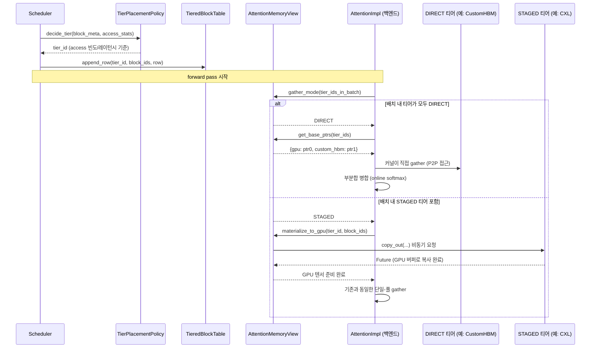

# 시나리오 03 — 런타임 블록 배치 결정 + Attention Gather

> 상태: 🧩 **설계 제안** — 아직 vLLM에 구현되어 있지 않음
> 출처: `doc-mk/vllm-kv-cache-memory-abstraction-layer.md` §2.2
> 관련: 시나리오 02 (이 시나리오가 전제하는 DIRECT/STAGED 확정 결과)

## 개요

매 스텝, 새 KV 블록을 어느 티어에 둘지 정하고, forward pass 시점에 attention이
그 배치 결과(DIRECT/STAGED)에 따라 커널 동작을 다르게 가져가는 시퀀스입니다.
DIRECT 티어면 커널이 직접 P2P로 gather하고, STAGED 티어면 먼저 GPU로 비동기
복사한 뒤 기존 방식대로 처리합니다.

## 전제

- 시나리오 02에서 각 티어의 DIRECT/STAGED 모드가 이미 확정됨
- 이번 스텝에 새로 배치해야 할 KV 블록들이 있음

## Sequence Diagram

## 단계별 설명

1. **`Scheduler`가 `TierPlacementPolicy.decide_tier(block_meta, access_stats)`를
   호출**합니다. 이번에 새로 필요한 KV 블록을 어느 티어에 둘지 정해달라는
   요청입니다.
2. **`TierPlacementPolicy`가 `tier_id`를 반환**합니다. 판단 기준은 access
   빈도(자주 쓰일 블록인가)와 레이턴시(그 티어가 얼마나 빠른가)입니다.
3. **`Scheduler`가 `TieredBlockTable.append_row(tier_id, block_ids, row)`를
   호출**해서, 방금 결정된 배치를 블록 테이블에 기록합니다. 이 기록이 나중에
   attention이 "이 블록이 어디 있는지" 찾아볼 때 쓰이는 유일한 출처입니다.
4. **(forward pass 시작)** 스텝의 나머지 부분(스케줄링)이 끝나고 실제 모델
   실행 단계로 넘어갑니다.
5. **`AttentionImpl`이 `AttentionMemoryView.gather_mode(tier_ids_in_batch)`를
   호출**합니다. 이번 배치에 포함된 모든 블록들이 어느 티어들에 흩어져 있는지
   확인하고, 그 조합이 DIRECT로 처리 가능한지 STAGED가 섞였는지 판단해달라는
   요청입니다.
6. **분기 A — 배치 내 티어가 전부 DIRECT인 경우**:
   - `AttentionMemoryView`가 `DIRECT`를 반환합니다.
   - `AttentionImpl`이 `get_base_ptrs(tier_ids)`를 호출해서 각 티어의 실제
     메모리 포인터(예: `{gpu: ptr0, custom_hbm: ptr1}`)를 받습니다.
   - attention 커널이 이 포인터들을 이용해 **직접 P2P로 gather**합니다 —
     중간에 GPU로 복사하는 단계가 없습니다.
   - 서로 다른 티어에서 온 부분 결과를 **online softmax 방식으로 병합**합니다
     (FlashAttention의 split-K reduction과 같은 원리).
7. **분기 B — 배치 내에 STAGED 티어가 하나라도 섞인 경우**:
   - `AttentionMemoryView`가 `STAGED`를 반환합니다.
   - `AttentionImpl`이 `materialize_to_gpu(tier_id, block_ids)`를 호출해서
     "이 블록들을 GPU로 끌어와 달라"고 요청합니다.
   - `AttentionMemoryView`가 해당 STAGED 티어에 `copy_out(...)`을 **비동기로**
     요청합니다.
   - 복사가 끝나면 `Future`가 완료되고, GPU 텐서가 준비됩니다.
   - 이후는 **기존과 동일한 단일-풀 gather**로 처리됩니다 — STAGED 경로는
     결국 "GPU로 복사만 하고, 이후 로직은 지금 vLLM과 완전히 동일"합니다.

## 구현 시 참고사항

- 새로 만들어야 할 것: `TieredBlockTable`(기존 `MultiGroupBlockTable` 확장),
  `AttentionMemoryView`, `TierPlacementPolicy.decide_tier()`.
- 각 attention 백엔드(FlashAttention, FlashInfer, Triton 등)가 분기 A의
  "여러 base pointer로 gather"를 실제로 지원하려면 커널 레벨 작업이 각각
  필요합니다 — 이건 인터페이스 설계만으로 해결되지 않는 부분입니다.
- **중요한 제약**: 같은 배치 안에 DIRECT 블록과 STAGED 블록이 섞이면 (분기 A와
  B가 같은 배치에서 동시에 필요하면) attention 커널 호출을 분리 실행하고 병합해야
  합니다. 배치를 구성할 때부터 이걸 고려하지 않으면 매 스텝 분기가 늘어나서
  성능이 나빠질 수 있습니다.
