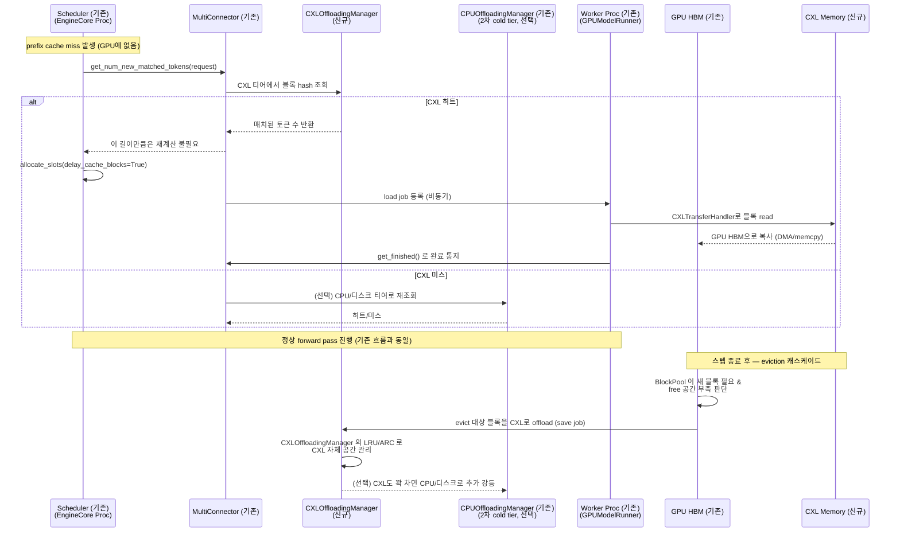

# 시나리오 04 — CXL 오프로드 & Eviction 캐스케이드

> 상태: 🧩 **설계 제안** — 아직 vLLM에 구현되어 있지 않음
> 출처: `doc-mk/vllm-kv-cache-memory-tiering.md` §1.4 (옵션 A: CXL을 오프로드
> 티어로 추가)
> 관련: 기존 `OffloadingConnector`(`vllm/v1/kv_offload/cpu/*`) — 이 시나리오는
> 그 인프라를 CXL용으로 복제한 것

## 개요

CXL을 "오프로드 티어"(1급 메모리가 아니라, GPU HBM이 부족할 때 대신 담아두는
보조 저장소)로 추가했을 때, prefix-cache 조회부터 GPU 용량 부족 시의 eviction
캐스케이드까지의 전체 흐름입니다. 시나리오 02/03(MAL, DIRECT 지향)과 달리 이
시나리오는 **기존 `OffloadingConnector` 패턴을 그대로 복제**하는, 리스크가 가장
낮은 접근입니다.

## 전제

- `CXLOffloadingSpec`이 `OffloadingSpecFactory`에 등록되어 있음
- `MultiConnector`가 `[CXLOffloadingSpec, CPUOffloadingSpec]` 순서로 체이닝
  되어 있음 (CXL을 1차, 기존 CPU 오프로드를 2차 콜드 티어로)

## Sequence Diagram

## 단계별 설명

### 전반부 — prefix cache 조회 (히트 시 로드)

1. **prefix cache miss가 발생**합니다 — 즉 필요한 KV 블록이 GPU HBM에 없는
   상태로 스케줄링이 시작됩니다.
2. **`Scheduler`가 `MultiConnector.get_num_new_matched_tokens(request)`를
   호출**합니다. "이 요청의 prefix 중 얼마나 이미 계산되어 어딘가에 저장돼
   있는지" 물어보는 표준 KV connector 훅입니다.
3. **`MultiConnector`가 `CXLOffloadingManager`에 블록 hash를 조회**합니다
   (1차 티어이므로 가장 먼저 확인).
4. **분기 A — CXL 히트**:
   - `CXLOffloadingManager`가 매치된 토큰 수를 반환합니다.
   - `MultiConnector`가 `Scheduler`에 "이 길이만큼은 재계산이 필요 없다"고
     알려줍니다.
   - `Scheduler`가 `allocate_slots(delay_cache_blocks=True)`를 호출합니다 —
     아직 CXL에서 GPU로 데이터가 안 왔으므로, 캐싱(prefix hash 등록)을 지연
     시키는 플래그입니다.
   - `MultiConnector`가 `Worker`에 비동기 load job을 등록합니다.
   - `Worker`가 `CXLTransferHandler`로 CXL 메모리에서 블록을 read합니다.
   - 읽은 데이터가 GPU HBM으로 DMA/memcpy 복사됩니다.
   - `Worker`가 `get_finished()`로 완료를 통지합니다 — 이 스텝 또는 다음 스텝에
     이 완료 확인이 반영됩니다.
5. **분기 B — CXL 미스**: `MultiConnector`가 2차 티어(`CPUOffloadingManager`)로
   재조회합니다. 히트/미스 결과를 받습니다.
6. **정상 forward pass 진행**: 이 시점부터는 기존 vLLM 흐름과 완전히 동일합니다
   — Scheduler/attention 백엔드는 CXL의 존재를 전혀 모릅니다.

### 후반부 — 스텝 종료 후 eviction 캐스케이드

7. **`BlockPool`이 새 블록이 필요한데 GPU에 여유 공간이 부족하다고 판단**합니다
   (기존 vLLM의 free-list 로직 그대로).
8. **GPU HBM에서 CXL로 evict 대상 블록을 offload**합니다(save job 등록).
9. **`CXLOffloadingManager`가 자체 LRU/ARC 정책으로 CXL 내부 공간을
   관리**합니다 — CXL 자체도 용량이 차면 블록을 골라 내보낼 후보를 정합니다.
10. **(선택) CXL마저 꽉 차면 CPU/디스크(2차 티어)로 추가 강등**합니다.

## 구현 시 참고사항

- 새로 만들어야 할 것: `vllm/v1/kv_offload/cxl/{spec.py, manager.py,
  gpu_worker.py}` — 전부 기존 `vllm/v1/kv_offload/cpu/*`를 그대로 복제해서
  전송 커널(`CXLTransferHandler`)만 CXL 접근 방식(NUMA-aware mmap, CXL.mem
  드라이버 등)에 맞게 교체하면 됩니다.
- 재사용 가능한 기존 코드: `OffloadingConnector`, `MultiConnector`,
  `LRUCachePolicy`/`ARCCachePolicy`, `KVCacheManager.allocate_slots(delay_cache_blocks=...)`.
- Scheduler, KVCacheManager, attention 백엔드는 **전혀 변경하지 않습니다** —
  이게 이 시나리오(옵션 A)가 시나리오 02/03(MAL, DIRECT)보다 구현 리스크가
  낮은 이유입니다.
