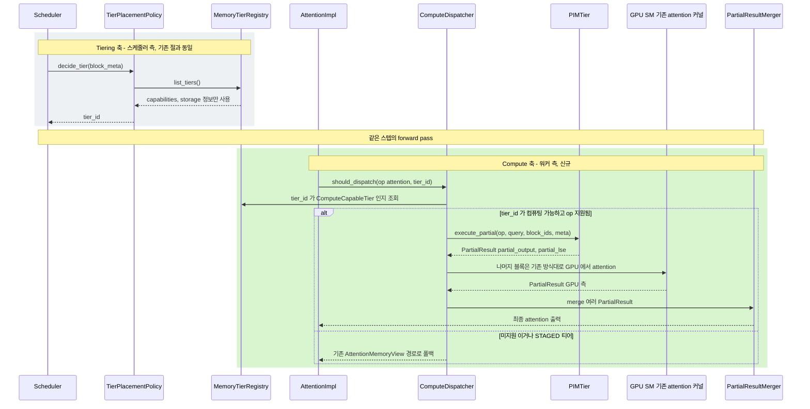

# 시나리오 05 — Tiering 축 + Compute 축, 같은 스텝에서 독립적으로 흐름

> 상태: 🧩 **설계 제안** — 아직 vLLM에 구현되어 있지 않음
> 출처: `doc-mk/vllm-kv-cache-memory-abstraction-layer.md` §7.3 (옵션 C:
> Compute-in-Memory 확장)
> 관련: 시나리오 03(Tiering 축의 상세), 시나리오 08(Compute 축의 상세) — 이
> 시나리오는 그 둘을 한 스텝 타임라인 위에 합쳐 보여줌

## 개요

"데이터를 어디 둘지"(Tiering 축, 스케줄러가 결정)와 "연산을 어디서 할지"
(Compute 축, 워커가 결정)가 **서로의 존재를 몰라도** 같은 스텝 안에서 정상
작동한다는 걸 보여주는 시퀀스입니다. 두 축은 오직 `tier_id`라는 공유 식별자로만
연결됩니다.

## 전제

- PIM(Processing-in-Memory) 능력을 가진 `PIMTier`가 `MemoryTier` +
  `ComputeCapableTier` 둘 다 구현하고 있음
- 이번 스텝에 처리할 블록 중 일부가 이미 (이전 스텝에) `PIMTier`에 배치되어
  있음

## Sequence Diagram

## 단계별 설명

### 회색 영역 — Tiering 축 (스케줄러 측, 시나리오 03과 동일)

1. **`Scheduler`가 `TierPlacementPolicy.decide_tier(block_meta)`를 호출**합니다.
2. **`TierPlacementPolicy`가 `MemoryTierRegistry.list_tiers()`를 조회**합니다
   — 이때 **storage 정보(용량/레이턴시)만 사용**하고, 그 티어가 연산 능력이
   있는지는 전혀 신경 쓰지 않습니다.
3. **`MemoryTierRegistry`가 capabilities를 반환**합니다.
4. **`TierPlacementPolicy`가 `tier_id`를 `Scheduler`에 반환**합니다. 이 시점의
   `TierPlacementPolicy`는 나중에 이 블록에 대해 연산 위임이 일어날지 전혀
   모릅니다.

### 같은 스텝의 forward pass로 진입

이 지점이 두 축이 "만나는" 유일한 시점입니다 — 시간적으로는 이어져 있지만,
서로 직접 호출하지 않습니다.

### 초록 영역 — Compute 축 (워커 측, 신규)

5. **`AttentionImpl`이 `ComputeDispatcher.should_dispatch(op=attention,
   tier_id)`를 호출**합니다. 여기서 `tier_id`는 1~4단계에서 이미 결정되어
   블록 테이블에 기록돼 있던 값을 조회한 것입니다(시나리오 07 참고).
6. **`ComputeDispatcher`가 `MemoryTierRegistry`에 "이 `tier_id`가
   `ComputeCapableTier`를 구현하는지" 조회**합니다.
7. **분기 A — 컴퓨팅 가능하고 해당 연산(`op`)을 지원하는 경우**:
   - `ComputeDispatcher`가 `PIMTier.execute_partial(op, query, block_ids,
     meta)`를 호출합니다.
   - `PIMTier`가 `PartialResult`(`partial_output`, `partial_lse`)를 반환합니다
     — PIM이 자체적으로 일부 attention 연산을 수행한 결과입니다.
   - 나머지 블록(PIM에 없는 블록들)은 기존 방식대로 `GPU SM`에서 attention을
     계산합니다.
   - `GPU SM`도 자신의 `PartialResult`를 반환합니다.
   - `ComputeDispatcher`가 `PartialResultMerger.merge()`로 PIM 결과와 GPU
     결과를 하나로 합칩니다(online softmax 방식).
   - 병합된 최종 attention 출력이 `AttentionImpl`로 돌아갑니다.
8. **분기 B — 미지원이거나 STAGED 티어인 경우**: `ComputeDispatcher`가
   `AttentionImpl`에게 "이 경로는 못 쓴다"는 폴백 신호만 주고, 시나리오 03의
   기존 `AttentionMemoryView` 경로(DIRECT gather 또는 STAGED materialize)로
   넘어갑니다.

## 구현 시 참고사항

- **핵심 설계 포인트**: `TierPlacementPolicy`(1~4단계)와 `ComputeDispatcher`
  (5~8단계)는 서로를 import하거나 직접 호출하지 않습니다. 둘 다 같은
  `MemoryTierRegistry`를 통해 같은 `tier_id`를 참조할 뿐입니다 — 이 설계를
  깨뜨리면(예: `TierPlacementPolicy`가 연산 능력까지 고려하기 시작하면) 두 축이
  결합되어 §7.1에서 의도했던 "스케줄러/워커 프로세스 경계와 일치하는 분리"가
  무너집니다.
- 이 시나리오는 "연결 구조"만 보여주며, PIM 연산과 GPU 연산의 정확한 동기화
  타이밍(동시 실행? 순차 대기?)은 의도적으로 다루지 않습니다 — 이 부분은 DP-3
  (연산 실행 모델, 시나리오 08의 "구현 시 참고사항" 참고)에서 별도로 다뤄야
  합니다.
- 새로 만들어야 할 것: `ComputeDispatcher`, `PartialResultMerger`,
  `ComputeCapableTier` 인터페이스와 이를 구현하는 `PIMTier`.
