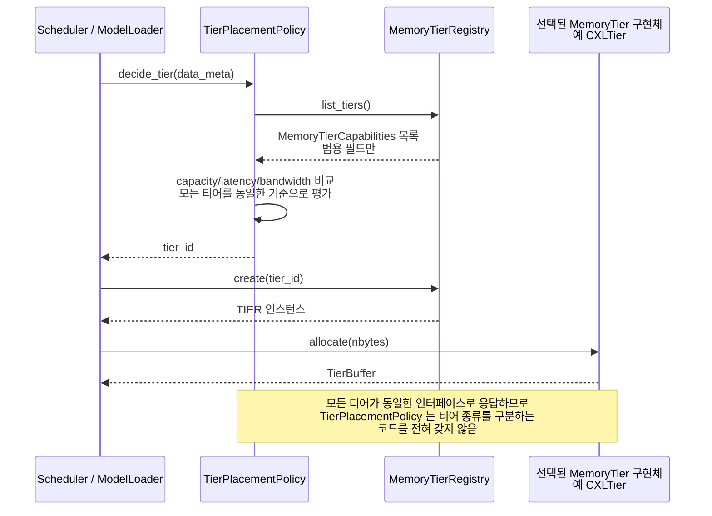

# 시나리오 06 — DP-1 후보1(범용 인터페이스) 배치 결정 흐름

> 상태: 🧩 **설계 제안** — 아직 vLLM에 구현되어 있지 않음
> 출처: `doc-mk/vllm-memory-abstraction-level-candidates.md` §3.4
> 관련: 시나리오 07 (같은 장면의 후보2 버전 — 나란히 비교할 것)

## 개요

DP-1(메모리 추상화 계층의 추상화 수준)의 **후보1: 범용성 강조 구조**에서,
데이터를 어느 티어에 배치할지 결정하는 가장 단순한 형태의 흐름입니다. 모든
티어가 완전히 동일한 인터페이스만 노출하기 때문에, 배치 정책 로직에 티어별
분기가 전혀 없습니다.

## 전제

- 모든 `MemoryTier` 구현체(`GPUHBMTier`, `CPUDRAMTier`, `CustomHBMTier`,
  `CXLTier`, `HBFTier`)가 정확히 같은 인터페이스(`capabilities`, `allocate`,
  `free`, `as_torch_storage`, `copy_in`, `copy_out`)만 구현
- 확장 인터페이스가 존재하지 않음(후보2와의 유일한 구조 차이)

## Sequence Diagram

## 단계별 설명

1. **`CALLER`(`Scheduler` 또는 `ModelLoader`)가 `TierPlacementPolicy.
   decide_tier(data_meta)`를 호출**합니다. `data_meta`는 아직 어느 티어에도
   배정되지 않은 데이터(KV 블록 또는 weight)에 대한 메타정보입니다.
2. **`TierPlacementPolicy`가 `MemoryTierRegistry.list_tiers()`를 조회**합니다.
3. **`MemoryTierRegistry`가 `MemoryTierCapabilities` 목록을 반환**합니다 —
   `capacity_bytes`, `read_latency_ns`, `write_bandwidth_GBps` 같은 **범용
   필드만** 담겨 있습니다.
4. **`TierPlacementPolicy`가 이 범용 필드들만 놓고 비교**합니다(자기 자신에게
   보내는 self-message). 다섯 티어를 완전히 동일한 기준(예: 여유 용량이 가장
   크거나, 레이턴시가 가장 낮은 순)으로 평가합니다. **여기에 "이건 CXL이니까",
   "이건 HBF니까" 같은 티어별 분기가 전혀 없습니다.**
5. **`TierPlacementPolicy`가 `tier_id`를 `CALLER`에게 반환**합니다.
6. **`CALLER`가 `MemoryTierRegistry.create(tier_id)`를 호출**합니다.
7. **`MemoryTierRegistry`가 `TIER` 인스턴스를 반환**합니다.
8. **`CALLER`가 `TIER.allocate(nbytes)`를 호출**합니다.
9. **`TIER`가 `TierBuffer`를 반환**합니다 — 물리 메모리가 실제로 확보되었습니다.

## 구현 시 참고사항

- 이 흐름의 4단계(비교 로직)를 실제로 구현할 때, **정말로 티어 종류를
  분기하는 코드가 한 줄도 없는지가 "후보1답게 구현했는지"를 검증하는
  기준**입니다. `if tier_id == "cxl": ...` 같은 코드가 정책 안에 등장하는
  순간 후보1의 설계 의도를 벗어난 것입니다.
- "연산을 어디서 할지"에 대한 판단이 이 시퀀스에 전혀 없다는 점도 중요합니다
  — 후보1에는 연산 관련 확장 자체가 없으므로, 데이터 배치 이후의 연산은
  항상 기존 GPU 전용 경로(`call-path-analysis.md` §3)를 그대로 탑니다.
- 시나리오 07(후보2)과 1~9단계의 뼈대는 동일하되, 3~4단계에서 갈립니다 — 두
  시나리오를 나란히 놓고 diff 보듯이 비교하면 구현 범위 차이가 명확해집니다.
