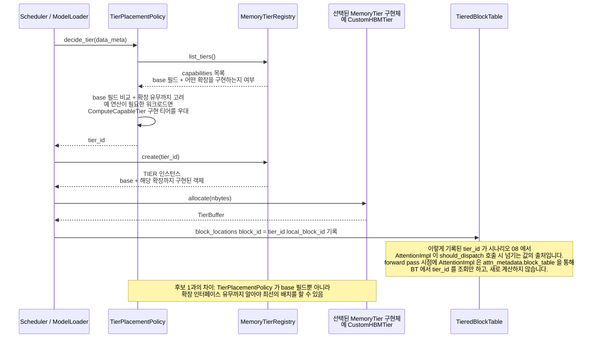

# 시나리오 07 — DP-1 후보2(확장 인터페이스) 배치 결정 흐름

> 상태: 🧩 **설계 제안** — 아직 vLLM에 구현되어 있지 않음
> 출처: `doc-mk/vllm-memory-abstraction-level-candidates.md` §4.4
> 관련: 시나리오 06 (같은 장면의 후보1 버전), 시나리오 08 (이 시나리오에서
> 기록한 `tier_id`를 나중에 소비하는 쪽)

## 개요

DP-1의 **후보2: 하드웨어 특화(확장) 구조**에서, 데이터를 어느 티어에 배치할지
결정하는 흐름입니다. 후보1(시나리오 06)과 뼈대는 같지만, ① 배치 판단이
"확장 인터페이스 유무"까지 고려하고, ② 결정 결과를 나중에 다시 찾아 쓸 수
있도록 `TieredBlockTable`에 기록하는 두 단계가 추가됩니다.

## 전제

- `CustomHBMTier`가 `MemoryTier` + `ComputeCapableTier`를 둘 다 구현
- `CXLTier`가 `MemoryTier` + `CXLPoolingExtension`을 구현
- `HBFTier`가 `MemoryTier` + `HBFBatchReadExtension`을 구현
- `GPUHBMTier`/`CPUDRAMTier`는 `MemoryTier`만 구현(확장 없음)

## Sequence Diagram



## 단계별 설명

1. **`CALLER`가 `TierPlacementPolicy.decide_tier(data_meta)`를 호출**합니다.
   (시나리오 06과 동일)
2. **`TierPlacementPolicy`가 `MemoryTierRegistry.list_tiers()`를 조회**합니다.
   (동일)
3. **`MemoryTierRegistry`가 capabilities 목록을 반환**합니다 — 여기서
   시나리오 06과 갈립니다. **범용 필드 + "이 티어가 어떤 확장 인터페이스를
   구현하는지" 여부까지** 포함됩니다.
4. **`TierPlacementPolicy`가 base 필드 비교 + 확장 유무까지 고려해서
   판단**합니다(self-message). 예를 들어 "연산이 필요한 워크로드라면
   `ComputeCapableTier`를 구현한 티어를 우대한다" 같은 로직이 여기서
   실행됩니다. **이게 시나리오 06과의 결정적 차이**입니다 — 정책이 확장
   종류를 아는 분기를 갖게 됩니다.
5. **`TierPlacementPolicy`가 `tier_id`를 반환**합니다.
6. **`CALLER`가 `MemoryTierRegistry.create(tier_id)`를 호출**합니다.
7. **`MemoryTierRegistry`가 TIER 인스턴스를 반환**합니다 — base + 해당 확장이
   함께 구현된 객체입니다.
8. **`CALLER`가 `TIER.allocate(nbytes)`를 호출**합니다.
9. **`TIER`가 `TierBuffer`를 반환**합니다.
10. **`CALLER`가 `TieredBlockTable`에 `block_locations[block_id] =
    (tier_id, local_block_id)`를 기록**합니다 — **시나리오 06에는 없는
    단계**입니다. 이 기록이 있어야 나중에(시나리오 08에서) 연산 디스패치
    시점에 "이 블록이 어디 있는지"를 다시 찾을 수 있습니다.

## 예시 — KV cache 30GB 할당 요청이 들어온 경우

이번 스텝에서 KV cache로 **총 30GB**가 필요하고, 각 티어 상태가 다음과 같다고
가정합니다.

| 티어 | 여유 용량 | 구현하는 확장 | 특징 |
|---|---|---|---|
| GPU HBM | 8GB | (없음) | 가장 빠름, 남은 게 8GB뿐 |
| CustomHBM | 12GB | `ComputeCapableTier` | 빠르고 자체 연산 가능 |
| CXL Memory | 40GB | `CXLPoolingExtension` | 용량 크고 풀링 가능 |
| HBF | 2TB | `HBFBatchReadExtension` | 용량 압도적, 느림 |

배치 대상 30GB 안에도 데이터 성격이 다릅니다 — 지금 활발히 쓰이는 "핫" 블록
8GB, 몇 스텝 안에 다시 쓰일 "웜" 블록 12GB, 당분간 다시 안 볼 "콜드" prefix
10GB.

**4단계(확장 인지 판단)가 실제로 하는 일**:

- 핫 8GB → GPU HBM (자명, 남은 공간과 딱 맞음)
- 웜 12GB → **CustomHBMTier**. 단순히 용량이 남아서가 아니라, "이 데이터는
  곧 다시 접근될 가능성이 있고, CustomHBMTier는 `ComputeCapableTier`를
  구현하니 나중에 GPU로 다시 끌어오지 않고 그 자리에서 연산 일부를 처리할
  수 있다"는 판단이 들어갑니다. 만약 CustomHBMTier가 이 확장을 구현하지
  않았다면, 정책은 레이턴시/용량만 보고 CXL을 골랐을 수도 있습니다.
- 콜드 10GB → **CXLTier**. 다시 안 볼 데이터라 연산 능력은 필요 없고, 용량과
  pooling 여유만 보고 배정합니다.

**10단계(TieredBlockTable 기록)가 실제로 하는 일** (블록 크기 16KB 가정, 총
약 190만 개 블록 중 일부 예시):

```
block_id 0~524288        → (tier_id="gpu_hbm_0",    local_block_id=0~524288)     # 8GB 몫
block_id 524289~1310720  → (tier_id="custom_hbm_0",  local_block_id=0~786432)    # 12GB 몫
block_id 1310721~1966080 → (tier_id="cxl_0",         local_block_id=0~655360)    # 10GB 몫
```

몇 스텝 뒤 "웜" 블록(`custom_hbm_0`)이 실제로 attention 연산에 다시 쓰이는
순간, `AttentionImpl`은 `attn_metadata.block_table`을 통해 `TieredBlockTable`을
조회해서 `tier_id="custom_hbm_0"`을 얻고, 이걸 그대로
`ComputeDispatcher.should_dispatch()`에 넘깁니다(시나리오 08 참고).
`ComputeDispatcher`가 확인해보니 `custom_hbm_0`은 `ComputeCapableTier`를
구현하므로 PIM 연산 경로로 갑니다. 반대로 "콜드" 블록(`cxl_0`)에 대해 같은
일이 벌어지면, `CXLTier`는 `ComputeCapableTier`를 구현하지 않으므로 그냥 기존
경로로 폴백해서 GPU로 데이터만 gather해옵니다.

## 구현 시 참고사항

- 새로 만들어야 할 것: `TieredBlockTable.block_locations` 필드와 기록 API,
  `TierPlacementPolicy`가 확장 유무를 조회하고 반영하는 로직.
- 4단계(확장 인지 판단)와 10단계(위치 기록)가 후보2에만 추가된 단계이며, 이
  둘이 합쳐져야 "웜 데이터는 연산 가능한 티어에 두고, 나중에 그 자리에서
  연산까지 시킨다"는 시나리오 05/08의 전체 그림이 완성됩니다.
- 실제 구현 시 "핫/웜/콜드"를 나누는 기준(access 빈도 추정, 남은 컨텍스트
  길이 등)은 이 문서 범위 밖입니다 — 별도 정책 설계가 필요합니다.
