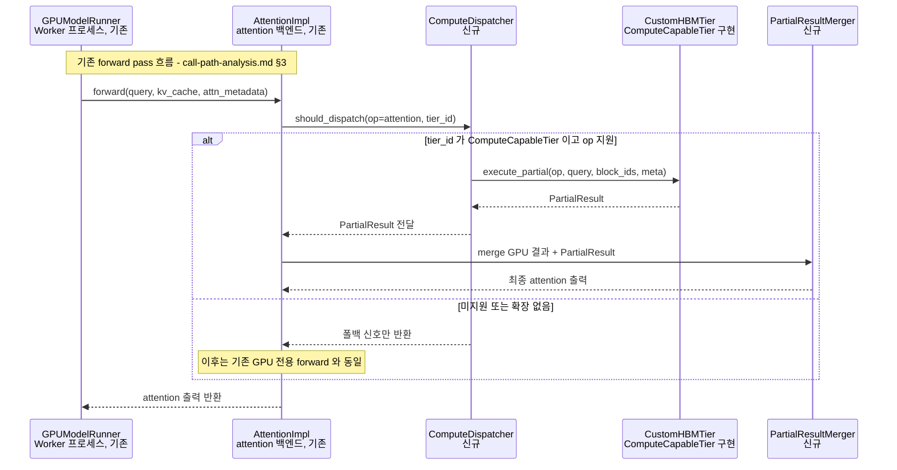

# 시나리오 08 — DP-1 후보2의 ComputeDispatcher 호출 순서 (연결 구조만)

> 상태: 🧩 **설계 제안** — 아직 vLLM에 구현되어 있지 않음
> 출처: `doc-mk/vllm-memory-abstraction-level-candidates.md` §4.6
> 관련: 시나리오 07 (여기서 쓰이는 `tier_id`의 출처), 시나리오 05 (Tiering
> 축과 함께 본 전체 그림)

## 개요

`ComputeDispatcher`가 Worker의 실제 forward pass 실행과 **어떻게 맞물리는지**를
보여주는 시퀀스입니다. 핵심은 — `ComputeDispatcher`는 별도의 병렬 실행
경로가 아니라, 기존 `AttentionImpl.forward()` **내부에서 호출되는 추가
분기**라는 점입니다.

## 전제

- 시나리오 07에서 이미 `tier_id`가 결정되어 `TieredBlockTable`에 기록되어
  있음
- `CustomHBMTier`가 `ComputeCapableTier`를 구현하고 있음

## Sequence Diagram

## 단계별 설명

1. **`GPUModelRunner`가 `AttentionImpl.forward(query, kv_cache,
   attn_metadata)`를 호출**합니다 — `call-path-analysis.md` §3에 이미 있는
   **기존 흐름 그대로**입니다. 이 호출 자체는 전혀 바뀌지 않습니다.
2. **`AttentionImpl`이 `ComputeDispatcher.should_dispatch(op=attention,
   tier_id)`를 호출**합니다. 여기서 `tier_id`는 새로 계산하는 게 아니라,
   `attn_metadata.block_table`을 통해 `TieredBlockTable`(시나리오 07에서
   기록된 값)을 **조회만** 한 것입니다.
3. **분기 A — `tier_id`가 `ComputeCapableTier`이고 해당 연산을 지원하는
   경우**:
   - `ComputeDispatcher`가 `CustomHBMTier.execute_partial(op, query,
     block_ids, meta)`를 호출합니다.
   - `CustomHBMTier`가 `PartialResult`를 반환합니다.
   - `ComputeDispatcher`가 이 결과를 `AttentionImpl`에 전달합니다.
   - `AttentionImpl`이 `PartialResultMerger.merge()`를 호출해서 GPU에서
     계산한 결과와 PIM에서 계산한 결과를 하나로 합칩니다.
   - 병합된 최종 attention 출력을 얻습니다.
4. **분기 B — 미지원이거나 확장이 없는 경우**:
   - `ComputeDispatcher`가 `AttentionImpl`에 폴백 신호만 반환합니다.
   - 이후는 **기존 GPU 전용 forward와 완전히 동일**합니다 — 코드 경로가
     시나리오 03의 DIRECT/STAGED gather로 그대로 이어집니다.
5. **`AttentionImpl`이 `GPUModelRunner`에 attention 출력을 반환**합니다 —
   이 반환값의 형태는 분기 A든 B든 동일해서, `GPUModelRunner` 입장에서는
   내부에서 무슨 일이 있었는지 알 필요가 없습니다.

## 의도적으로 답하지 않은 것 — 별도 DP(DP-3 후보)로 분리

이 시퀀스는 "누가 누구를 호출하는가"라는 **연결 구조만** 보여줍니다. 구현
시 반드시 결정해야 하지만 이 문서 범위 밖인 질문들:

- PIM 연산(3단계의 `execute_partial`)이 GPU 연산과 **동시에(비동기)** 진행
  되는지, 아니면 순차적으로 기다리는지
- `execute_partial()`이 **레이어 단위**로 매번 호출되는지, **스텝 단위**로
  한 번만 호출되는지
- PIM이 느려서 타임아웃되면 **언제, 어떻게** 재시도하거나 GPU로 폴백하는지
- CUDA stream/이벤트로 **어떻게 동기화**하는지
- `execute_partial`과 GPU 커널이 **정말로 병렬 실행**된다면, 두 결과의
  수치 정밀도(accumulation 순서)가 어떻게 맞아떨어지는지

이런 질문들은 "MAL의 추상화 수준"(DP-1)이 아니라 **"연산 실행 모델을 어떻게
통합할 것인가"**라는 별개의 설계쟁점(DP-3 후보)에 속합니다.

## 구현 시 참고사항

- 새로 만들어야 할 것: `ComputeDispatcher`, `PartialResultMerger`.
- `AttentionImpl.forward()`의 기존 시그니처/반환 타입은 바뀌지 않아야
  `GPUModelRunner`(호출자) 쪽 변경을 최소화할 수 있습니다 — 5단계에서
  "반환값 형태가 분기와 무관하게 동일"하다고 강조한 이유입니다.
- 이 시나리오를 실제 코드로 옮기기 전에, 위 "의도적으로 답하지 않은 것"
  목록을 먼저 결정하는 DP-3 설계 문서가 필요합니다.
