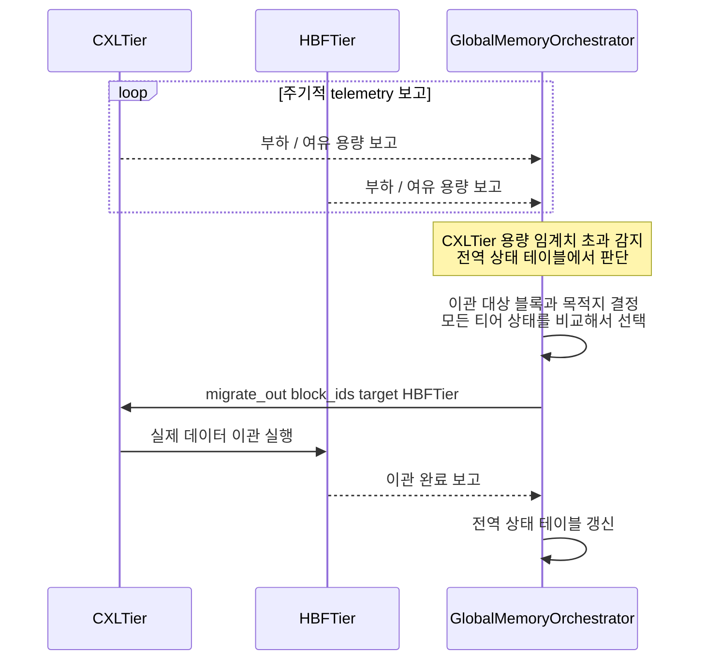

# 시나리오 09 — DP-2 후보A(중앙집중 오케스트레이션) 재배치 시퀀스

> 상태: 🧩 **설계 제안** — 아직 vLLM에 구현되어 있지 않음
> 출처: `doc-mk/vllm-memory-coordination-locus-candidates.md` §2.3
> 관련: 시나리오 10 (같은 상황의 후보B 버전 — 나란히 비교할 것)

## 개요

DP-2(자원 간 상호 인지 통합 관리의 조정 주체)의 **후보A: 중앙집중형
오케스트레이션**에서, 한 티어가 용량 임계치를 초과했을 때 재배치가 어떻게
일어나는지 보여주는 시퀀스입니다. 모든 결정은 `GlobalMemoryOrchestrator`
하나를 거칩니다.

## 전제

- `GlobalMemoryOrchestrator`가 모든 티어로부터 주기적으로 telemetry(부하,
  여유 용량)를 수집하고 있음
- `CXLTier`가 용량 임계치를 초과한 상황

## Sequence Diagram

## 단계별 설명

1. **(`loop`) 모든 티어가 주기적으로 `GlobalMemoryOrchestrator`에 부하/여유
   용량을 보고**합니다. `CXLTier`와 `HBFTier`뿐 아니라 등록된 모든 티어가
   대상입니다 — 이 telemetry가 없으면 오케스트레이터는 아무 판단도 할 수
   없습니다.
2. **`GlobalMemoryOrchestrator`가 전역 상태 테이블에서 `CXLTier`의 용량
   임계치 초과를 감지**합니다. 어떤 티어도 스스로 "나 꽉 찼다"고 능동적으로
   알리지 않습니다 — 오케스트레이터가 자신이 가진 전역 뷰를 스캔해서
   찾아냅니다.
3. **`GlobalMemoryOrchestrator`가 이관 대상 블록과 목적지를 결정**합니다
   (self-message). 모든 티어의 현재 상태(여유 용량, 레이턴시)를 비교해서
   "누구에게 보낼지"를 정합니다 — 이 판단에 필요한 정보가 전부 1단계에서
   이미 오케스트레이터에 모여 있습니다.
4. **`GlobalMemoryOrchestrator`가 `CXLTier`에 `migrate_out(block_ids,
   target=HBFTier)`를 지시**합니다. `CXLTier`는 스스로 판단하지 않고 지시를
   받아서 실행만 합니다.
5. **`CXLTier`가 `HBFTier`로 실제 데이터를 이관**합니다.
6. **`HBFTier`가 `GlobalMemoryOrchestrator`에 이관 완료를 보고**합니다.
7. **`GlobalMemoryOrchestrator`가 전역 상태 테이블을 갱신**합니다
   (self-message) — 다음 판단에 반영되도록 자신의 뷰를 최신화합니다.

## 구현 시 참고사항

- 새로 만들어야 할 것: `GlobalMemoryOrchestrator`(기존 `TierPlacementPolicy`의
  승격판 — 전역 상태 테이블 + telemetry 수신 API + 이관 지시 API),
  각 `MemoryTier`의 telemetry 보고 콜백.
- **주의**: 1단계의 telemetry 보고 주기(polling interval)를 얼마로 잡을지가
  실제 구현에서 가장 먼저 결정해야 할 파라미터입니다 — 너무 짧으면
  오케스트레이터에 부하가 걸리고, 너무 길면 3단계의 판단이 낡은 정보를
  기준으로 이뤄집니다.
- 이 시퀀스는 별(star) 토폴로지입니다 — `CXLTier`와 `HBFTier`가 서로 직접
  통신하는 화살표가 하나도 없다는 점이 시나리오 10(mesh 토폴로지)과의
  구조적 차이입니다.
- KV cache처럼 매 스텝 배치 결정이 필요한 경우, 이 시퀀스 전체(특히 4~6단계의
  중앙 왕복)를 매번 반복하면 결정 레이턴시 부담이 커집니다 — 실제 구현 시
  "재배치"(이 시나리오)와 "최초 배치"(시나리오 06/07)를 다른 빈도로 처리하는
  걸 고려하십시오 (`vllm-memory-coordination-locus-candidates.md` §4.2의
  절충안 참고).
