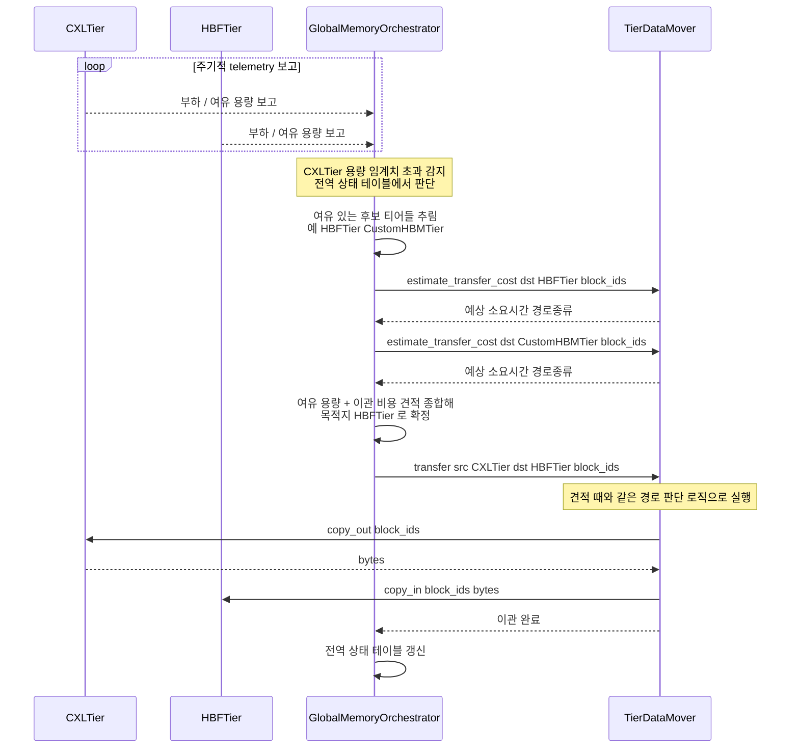

# 시나리오 09 — DP-2 후보A(중앙집중 오케스트레이션) 재배치 시퀀스

> 상태: 🧩 **설계 제안** — 아직 vLLM에 구현되어 있지 않음
> 출처: `doc-mk/vllm-memory-coordination-locus-candidates.md` §2.3
> 관련: 시나리오 10 (같은 상황의 후보B 버전 — 나란히 비교할 것)

## 개요

DP-2(자원 간 상호 인지 통합 관리의 조정 주체)의 **후보A: 중앙집중형
오케스트레이션**에서, 한 티어가 용량 임계치를 초과했을 때 재배치가 어떻게
일어나는지 보여주는 시퀀스입니다. 모든 결정은 `GlobalMemoryOrchestrator`
하나를 거칩니다.

## 전제

- `GlobalMemoryOrchestrator`가 모든 티어로부터 주기적으로 telemetry(부하,
  여유 용량)를 수집하고 있음
- `CXLTier`가 용량 임계치를 초과한 상황
- `MemoryTier`(`CXLTier`/`HBFTier`)는 항상 수동적 자원 객체입니다 — 스스로
  판단하지 않고, `GlobalMemoryOrchestrator`(유일한 Agent)의 지시를 받거나
  `TierDataMover`의 `copy_out`/`copy_in` 호출에 응답할 뿐입니다.
- 실제 물리적 전송은 `TierDataMover`(두 후보 공통 컴포넌트)가 수행합니다 —
  자세한 배경은 `vllm-memory-coordination-locus-candidates.md` §1.

## Sequence Diagram

## 단계별 설명

1. **(`loop`) 모든 티어가 주기적으로 `GlobalMemoryOrchestrator`에 부하/여유
   용량을 보고**합니다. `CXLTier`와 `HBFTier`뿐 아니라 등록된 모든 티어가
   대상입니다 — 이 telemetry가 없으면 오케스트레이터는 아무 판단도 할 수
   없습니다.
2. **`GlobalMemoryOrchestrator`가 전역 상태 테이블에서 `CXLTier`의 용량
   임계치 초과를 감지**합니다. 어떤 티어도 스스로 "나 꽉 찼다"고 능동적으로
   알리지 않습니다 — 오케스트레이터가 자신이 가진 전역 뷰를 스캔해서
   찾아냅니다.
3. **`GlobalMemoryOrchestrator`가 여유 용량이 있는 후보 티어들을 추립니다**
   (self-message). 아직 최종 목적지를 정한 건 아니고, "여유 용량"이라는
   1차 조건만으로 후보군을 좁힙니다.
4. **각 후보 티어에 대해 `TierDataMover.estimate_transfer_cost(dst,
   block_ids)`를 호출**합니다. 여유 용량만으로는 부족합니다 — 목적지가
   host DRAM을 거쳐야 하는지, direct 경로인지에 따라 실제로 옮기는 데
   걸리는 시간이 크게 달라지므로, 이걸 모르고 목적지를 정하면 "여유는
   있지만 옮기는 데 너무 오래 걸리는" 곳을 고를 위험이 있습니다.
5. **`GlobalMemoryOrchestrator`가 여유 용량과 이관 비용 견적을 종합해서
   최종 목적지(`HBFTier`)를 확정**합니다(self-message). 이 판단에 필요한
   정보(전역 상태 + 경로 비용 견적)가 전부 3~4단계에서 모였습니다.
6. **`GlobalMemoryOrchestrator`가 `TierDataMover`에 `transfer(src=CXLTier,
   dst=HBFTier, block_ids)`를 요청**합니다. 오케스트레이터는 "누구에게
   보낼지"만 결정했을 뿐, 물리적으로 어떻게 옮기는지는 모릅니다 — 그건
   `TierDataMover`의 책임입니다.
7. **`TierDataMover`가 양쪽 `MemoryTier`의 `capabilities()`를 비교해서
   물리적 경로(host DRAM 경유 여부, direct 연결 여부, 네트워크 경유 여부)를
   결정**합니다 — 4단계의 견적과 같은 판단 로직을 그대로 실행에 씁니다.
   `CXLTier`/`HBFTier` 어느 쪽도 이 판단에 관여하지 않습니다.
8. **`TierDataMover`가 `CXLTier.copy_out(block_ids)`로 데이터를 꺼내고,
   `HBFTier.copy_in(block_ids, bytes)`로 써넣습니다.** `CXLTier`와
   `HBFTier`는 "자기 자신의 메모리에서 내보내기/받기"라는 원시 동작만
   수행할 뿐, 서로를 직접 호출하지 않습니다.
9. **`TierDataMover`가 `GlobalMemoryOrchestrator`에 이관 완료를 보고**합니다.
10. **`GlobalMemoryOrchestrator`가 전역 상태 테이블을 갱신**합니다
    (self-message) — 다음 판단에 반영되도록 자신의 뷰를 최신화합니다.

## 구현 시 참고사항

- 새로 만들어야 할 것: `GlobalMemoryOrchestrator`(기존 `TierPlacementPolicy`의
  승격판 — 전역 상태 테이블 + telemetry 수신 API + 이관 지시 API), 각
  `MemoryTier`의 telemetry 보고 콜백, 그리고 `TierDataMover`(두 후보 공통,
  `estimate_transfer_cost` 견적 조회 + `transfer` 실행, 둘 다 같은 물리적
  경로 판단 로직을 공유).
- **주의**: 1단계의 telemetry 보고 주기(polling interval)를 얼마로 잡을지가
  실제 구현에서 가장 먼저 결정해야 할 파라미터입니다 — 너무 짧으면
  오케스트레이터에 부하가 걸리고, 너무 길면 2단계의 판단이 낡은 정보를
  기준으로 이뤄집니다.
- 이 시퀀스는 별(star) 토폴로지입니다 — `CXLTier`와 `HBFTier`가 서로 직접
  통신하는 화살표가 하나도 없다는 점이 시나리오 10(mesh 토폴로지)과의
  구조적 차이입니다. 다만 `TierDataMover`를 통한 견적 조회(4단계)와 물리적
  전송(7~8단계)은 시나리오 10과 완전히 동일한 방식으로 이뤄집니다 — 다른 건
  오직 그 이전의 "누가, 얼마나 넓은 정보로 결정하는가"입니다.
- KV cache처럼 매 스텝 배치 결정이 필요한 경우, 이 시퀀스 전체(특히 3~6단계의
  중앙 왕복과 견적 조회)를 매번 반복하면 결정 레이턴시 부담이 커집니다 — 실제 구현 시
  "재배치"(이 시나리오)와 "최초 배치"(시나리오 06/07)를 다른 빈도로 처리하는
  걸 고려하십시오 (`vllm-memory-coordination-locus-candidates.md` §4.2의
  절충안 참고).
