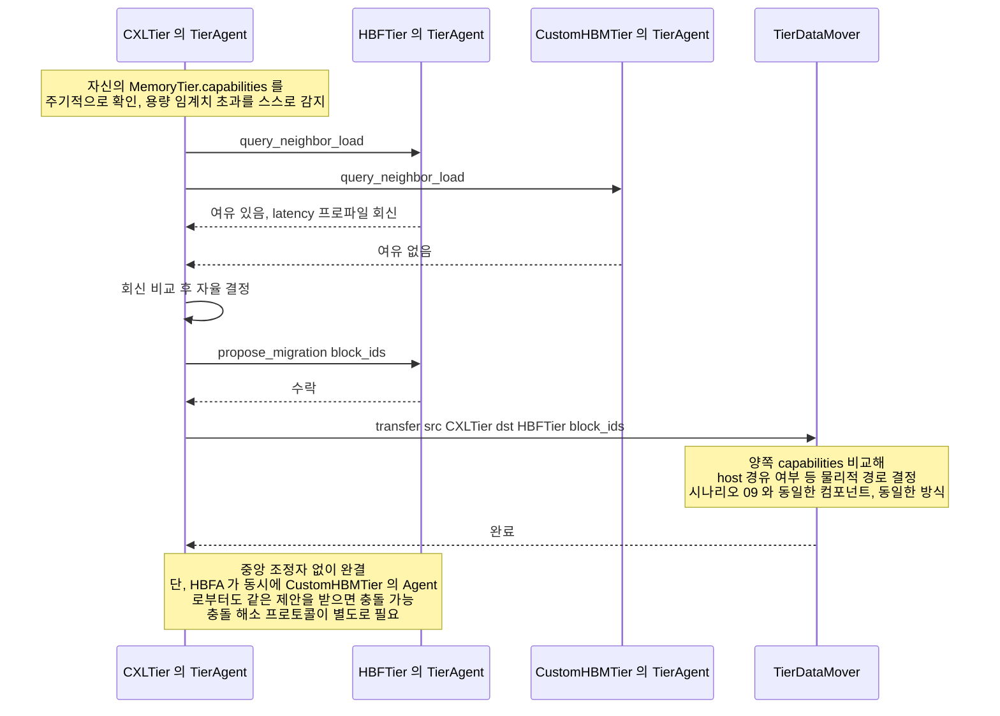

# 시나리오 10 — DP-2 후보B(분산 자율 협상) 재배치 시퀀스

> 상태: 🧩 **설계 제안** — 아직 vLLM에 구현되어 있지 않음
> 출처: `doc-mk/vllm-memory-coordination-locus-candidates.md` §3.3
> 관련: 시나리오 09 (같은 상황의 후보A 버전 — 나란히 비교할 것)

## 개요

DP-2의 **후보B: 분산 자율 협상**에서, 한 티어가 용량 임계치를 초과했을 때
중앙 조정자 없이 티어들끼리 직접 협상해서 재배치하는 시퀀스입니다.
시나리오 09와 정확히 같은 상황(CXL 용량 초과)을 다른 방식으로 처리합니다.

## 전제

- `MemoryTier`(`CXLTier`/`HBFTier`/`CustomHBMTier`)는 항상 수동적 자원
  객체입니다. 이웃 상태를 조회하는 경량 peer-awareness 프로토콜
  (`query_neighbor_load()`, `propose_migration()`)은 **`MemoryTier`가 아니라,
  티어마다 하나씩 붙는 별도의 능동적 객체 `TierAgent`가 구현**합니다 —
  자세한 배경은 `vllm-memory-coordination-locus-candidates.md` §1, §3.1.
- `CXLTier`가 용량 임계치를 초과한 상황 (시나리오 09와 동일한 트리거) —
  정확히는 `CXLTier`의 `TierAgent`가 자신의 `MemoryTier.capabilities()`를
  주기적으로 확인하다가 감지합니다.
- 실제 물리적 전송은 시나리오 09와 동일한 공통 컴포넌트 `TierDataMover`가
  수행합니다.

## Sequence Diagram

## 단계별 설명

1. **`CXLTier`의 `TierAgent`(`CXLA`)가 용량 임계치 초과를 스스로 감지**합니다.
   `CXLTier` 자신이 감지하는 게 아니라, 그것을 감시하고 있는 `TierAgent`가
   `MemoryTier.capabilities()`를 주기적으로 폴링해서 알아냅니다. 시나리오
   09와 달리 중앙에 보고할 필요가 없습니다.
2. **`CXLA`가 `HBFA`(`HBFTier`의 `TierAgent`)에게 `query_neighbor_load`를
   요청**합니다. `CXLTier`와 `HBFTier`끼리 직접 통신하는 게 아니라, 둘의
   `TierAgent`끼리 통신합니다.
3. **`CXLA`가 `CUSTOMA`(`CustomHBMTier`의 `TierAgent`)에게도 동일하게
   `query_neighbor_load`를 요청**합니다. 여러 이웃에게 동시에 물어보는 게
   자연스럽습니다.
4. **`HBFA`가 "여유 있음" + latency 프로파일을 회신**합니다.
5. **`CUSTOMA`가 "여유 없음"을 회신**합니다.
6. **`CXLA`가 받은 회신들을 비교해서 자율적으로 결정**합니다
   (self-message) — 이 판단은 `CXLA` 혼자서, 자신에게 온 응답만 갖고
   내립니다. 시나리오 09의 3단계와 달리 **전역 상태를 보지 못합니다**.
7. **`CXLA`가 `HBFA`에게 `propose_migration(block_ids)`을 제안**합니다
   — 지시가 아니라 "제안"입니다.
8. **`HBFA`가 수락**합니다.
9. **`CXLA`가 `TierDataMover`에 `transfer(src=CXLTier, dst=HBFTier,
   block_ids)`를 요청**합니다. `CXLA`는 "누구에게 보낼지"를 협상으로
   결정했을 뿐, 실제로 그 데이터가 host DRAM을 거치는지 direct 경로로
   가는지는 알지 못합니다 — `MemoryTier`도 마찬가지로 이 판단에 관여하지
   않습니다. `TierDataMover`가 시나리오 09와 완전히 같은 방식으로
   `CXLTier.copy_out()` → `HBFTier.copy_in()`을 수행합니다.

## 구현 시 반드시 처리해야 할 문제 — 충돌

다이어그램 마지막 주석이 지적하는 것처럼, **이 흐름은 중앙 조정자 없이
완결되지만 동시성 문제가 있습니다**: 만약 `HBFA`가 같은 순간에 `CUSTOMA`
로부터도 비슷한 이관 제안을 받는다면(예: `CustomHBMTier`의 `TierAgent`도
동시에 용량이 부족해져서 `HBFA`에게 제안을 보낸 경우), `HBFA`는 두 제안 중
어느 걸 먼저 수락할지, 둘 다 수락했다가 자기 `MemoryTier`의 용량을 넘기면
어떻게 할지를 결정하는 **충돌 해소 프로토콜**이 별도로 필요합니다. 이
시퀀스 다이어그램 자체는 이 문제를 해결하지 않고, "발생할 수 있다"는 것만
표시합니다.

## 구현 시 참고사항

- 새로 만들어야 할 것: 각 `MemoryTier`마다 하나씩 붙는 `TierAgent`(자신의
  `MemoryTier`에 대한 참조 보유, `query_neighbor_load()`/`propose_migration()`
  구현), **충돌 해소 로직**(예: 2-phase commit류 프로토콜, 또는 제안에
  타임스탬프/우선순위를 부여해서 먼저 온 것을 우선하는 단순한 규칙), 그리고
  시나리오 09와 공유하는 `TierDataMover`. `MemoryTier` 자체는 새로 손댈 게
  없습니다 — 후보 A와 완전히 같은 모양 그대로입니다.
- 이 시퀀스는 메시(mesh) 토폴로지입니다 — 단, 메시로 연결된 건
  `MemoryTier`가 아니라 **`TierAgent`들**입니다. `CXLA`가 여러 이웃
  `TierAgent`와 직접 통신하고, 중앙 등록소(`MemoryTierRegistry`)는 최초
  디스커버리에만 관여합니다(시나리오 02와 달리, 재배치 국면에서는 등장하지
  않습니다). `MemoryTier`끼리는 후보 A와 마찬가지로 서로 직접 통신하지
  않습니다.
- 6단계의 "자율 결정"이 국소 정보(이 시점에 응답한 이웃들의 상태)만으로
  이뤄지므로, 전역적으로 보면 최적이 아닐 수 있습니다(예: 더 나은 목적지가
  있었는데 `CXLA`가 미처 물어보지 않은 경우) — 실제 구현 시 "몇 개의
  이웃에게 물어볼지"가 성능/정확도 트레이드오프의 튜닝 지점이 됩니다.
- 시나리오 09와 정확히 같은 트리거(CXL 용량 초과)로 시작하고, 9단계의
  `TierDataMover` 호출 이후도 완전히 동일한 방식으로 흐릅니다 — 다른 건
  오직 1~8단계, "누가(오케스트레이터 1개 vs Agent N개), 얼마나 넓은
  정보로 이관을 결정하는가"입니다. 이 둘을 나란히 놓고 비교하면 DP-2의
  실질적 구현 차이가 뚜렷하게 드러납니다.
