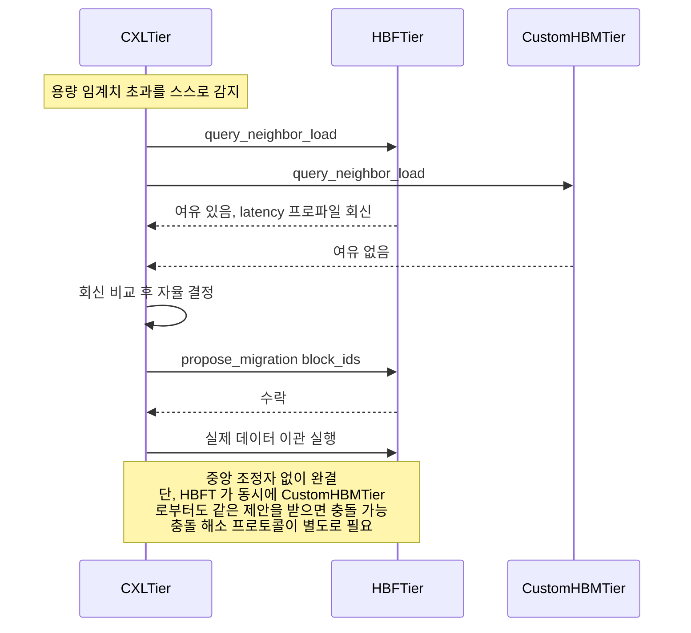

# 시나리오 10 — DP-2 후보B(분산 자율 협상) 재배치 시퀀스

> 상태: 🧩 **설계 제안** — 아직 vLLM에 구현되어 있지 않음
> 출처: `doc-mk/vllm-memory-coordination-locus-candidates.md` §3.3
> 관련: 시나리오 09 (같은 상황의 후보A 버전 — 나란히 비교할 것)

## 개요

DP-2의 **후보B: 분산 자율 협상**에서, 한 티어가 용량 임계치를 초과했을 때
중앙 조정자 없이 티어들끼리 직접 협상해서 재배치하는 시퀀스입니다.
시나리오 09와 정확히 같은 상황(CXL 용량 초과)을 다른 방식으로 처리합니다.

## 전제

- 각 `MemoryTier`가 이웃 티어의 상태를 직접 조회할 수 있는 경량
  peer-awareness 인터페이스(`query_neighbor_load()`, `propose_migration()`)를
  구현
- `CXLTier`가 용량 임계치를 초과한 상황 (시나리오 09와 동일한 트리거)

## Sequence Diagram

## 단계별 설명

1. **`CXLTier`가 용량 임계치 초과를 스스로 감지**합니다. 시나리오 09와 달리
   중앙에 보고할 필요 없이, 자기 자신의 상태를 스스로 모니터링합니다.
2. **`CXLTier`가 `HBFTier`에게 `query_neighbor_load`를 요청**합니다.
3. **`CXLTier`가 `CustomHBMTier`에게도 동일하게 `query_neighbor_load`를
   요청**합니다. 여러 이웃에게 동시에 물어보는 게 자연스럽습니다.
4. **`HBFTier`가 "여유 있음" + latency 프로파일을 회신**합니다.
5. **`CustomHBMTier`가 "여유 없음"을 회신**합니다.
6. **`CXLTier`가 받은 회신들을 비교해서 자율적으로 결정**합니다
   (self-message) — 이 판단은 `CXLTier` 혼자서, 자신에게 온 응답만 갖고
   내립니다. 시나리오 09의 3단계와 달리 **전역 상태를 보지 못합니다**.
7. **`CXLTier`가 `HBFTier`에게 `propose_migration(block_ids)`을 제안**합니다
   — 지시가 아니라 "제안"입니다.
8. **`HBFTier`가 수락**합니다.
9. **`CXLTier`가 `HBFTier`로 실제 데이터를 이관**합니다.

## 구현 시 반드시 처리해야 할 문제 — 충돌

다이어그램 마지막 주석이 지적하는 것처럼, **이 흐름은 중앙 조정자 없이
완결되지만 동시성 문제가 있습니다**: 만약 `HBFTier`가 같은 순간에
`CustomHBMTier`로부터도 비슷한 이관 제안을 받는다면(예: `CustomHBMTier`도
동시에 용량이 부족해져서 `HBFTier`에게 제안을 보낸 경우), `HBFTier`는 두
제안 중 어느 걸 먼저 수락할지, 둘 다 수락했다가 자기 용량을 넘기면 어떻게
할지를 결정하는 **충돌 해소 프로토콜**이 별도로 필요합니다. 이 시퀀스
다이어그램 자체는 이 문제를 해결하지 않고, "발생할 수 있다"는 것만
표시합니다.

## 구현 시 참고사항

- 새로 만들어야 할 것: 각 `MemoryTier`에 `query_neighbor_load()`,
  `propose_migration()`, 그리고 **충돌 해소 로직**(예: 2-phase commit류
  프로토콜, 또는 제안에 타임스탬프/우선순위를 부여해서 먼저 온 것을
  우선하는 단순한 규칙).
- 이 시퀀스는 메시(mesh) 토폴로지입니다 — `CXLTier`가 여러 이웃과 직접
  통신하고, 중앙 등록소(`MemoryTierRegistry`)는 최초 디스커버리에만
  관여합니다(시나리오 02와 달리, 재배치 국면에서는 등장하지 않음).
- 6단계의 "자율 결정"이 국소 정보(이 시점에 응답한 이웃들의 상태)만으로
  이뤄지므로, 전역적으로 보면 최적이 아닐 수 있습니다(예: 더 나은 목적지가
  있었는데 `CXLTier`가 미처 물어보지 않은 경우) — 실제 구현 시 "몇 개의
  이웃에게 물어볼지"가 성능/정확도 트레이드오프의 튜닝 지점이 됩니다.
- 시나리오 09와 정확히 같은 트리거(CXL 용량 초과)로 시작하지만 5~6단계가
  완전히 다른 방식(중앙 판단 vs 이웃 응답 비교)으로 흐른다는 점을 나란히
  놓고 비교하면 DP-2의 실질적 구현 차이가 뚜렷하게 드러납니다.
