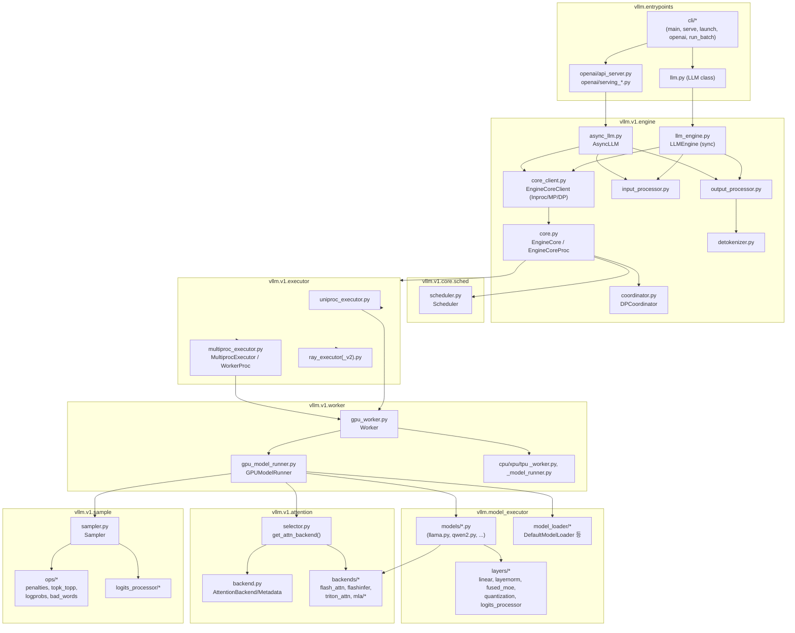

# vLLM 실행 Call Path 분석

> 분석 대상 커밋: `8decbfa0` (2026-05-04)
>
> 본 문서는 vLLM 프로세스가 실행되어 하나의 추론 요청이 처리되는 과정을 코드 레벨에서
> 추적하고, 모듈 구조(Module View)와 런타임 컴포넌트/프로세스 구조(Component View)를
> 정리한 문서입니다.

## 0. 중요 전제 — V1 엔진 단일화

이 스냅샷에서는 **V0 엔진이 완전히 제거**되었습니다. `vllm/core/`, `vllm/worker/`,
`vllm/executor/`, `vllm/model_executor/layers/sampler.py`, `vllm/attention/` 등의
V0 경로는 더 이상 존재하지 않습니다.

`vllm/engine/llm_engine.py`, `vllm/engine/async_llm_engine.py`는 하위 호환을 위한
alias 파일일 뿐이며 실제로는 `vllm.v1.engine.*`를 그대로 가리킵니다.

```python
# vllm/engine/llm_engine.py
from vllm.v1.engine.llm_engine import LLMEngine as V1LLMEngine
LLMEngine = V1LLMEngine
```

따라서 아래 모든 분석은 **V1 아키텍처**(`vllm/v1/...`)를 기준으로 합니다.

---

## 1. 진입점 (Entry Points)

vLLM은 크게 3가지 방식으로 실행됩니다.

| 실행 방식 | 진입 파일 | 설명 |
|---|---|---|
| CLI (`vllm serve` 등) | `vllm/entrypoints/cli/main.py` | `pyproject.toml`의 `[project.scripts] vllm = "vllm.entrypoints.cli.main:main"` |
| OpenAI 호환 API 서버 | `vllm/entrypoints/openai/api_server.py` | `vllm serve` 명령이 최종적으로 실행하는 대상 |
| 오프라인 배치 추론 (`LLM` 클래스) | `vllm/entrypoints/llm.py` | Python 스크립트에서 `LLM(...)` 직접 생성 |

### 1.1 CLI 진입점

`vllm/entrypoints/cli/main.py`의 `main()`은 서브커맨드를 지연 로딩하여 argparse 트리를
구성합니다. 서브커맨드는 모두 `CLISubcommand`(`vllm/entrypoints/cli/types.py`)를 상속합니다.

- `ServeSubcommand` (`cli/serve.py`) — **`vllm serve`**: API 서버 실행 (본 문서의 핵심 경로)
- `ChatCommand` / `CompleteCommand` (`cli/openai.py`) — 실행 중인 서버에 붙는 얇은 클라이언트
- `LaunchSubcommand` / `RenderSubcommand` (`cli/launch.py`)
- `RunBatchSubcommand` (`cli/run_batch.py`) — OpenAI batch 파일 포맷 오프라인 배치
- `BenchmarkSubcommand` (`cli/benchmark/*.py`)
- `CollectEnvSubcommand` (`cli/collect_env.py`)

### 1.2 `vllm serve`의 분기

`ServeSubcommand.cmd(args)` (`cli/serve.py:43`)는 `--api-server-count` 값에 따라 분기합니다.

- `== 1` (기본값, API 서버 1개): `uvloop.run(run_server(args))`
  → `vllm/entrypoints/openai/api_server.py::run_server`
- `> 1` (API 서버 다중화): `run_multi_api_server(args)` — `APIServerProcessManager`
  (`vllm/v1/utils.py`)로 API 서버 프로세스 여러 개를, `launch_core_engines()`
  (`vllm/v1/engine/utils.py`)로 EngineCore 프로세스를 별도로 기동
- `< 1` / `--headless`: `run_headless(args)` — API 서버 없이 `CoreEngineProcManager`로
  EngineCore 프로세스만 기동 (Data-Parallel 워커용)

### 1.3 오프라인 추론(`LLM` 클래스)

`vllm/entrypoints/llm.py::LLM.__init__` (line 212)에서 `EngineArgs`로 `VllmConfig`를
만들고 다음을 호출합니다.

```python
self.llm_engine = LLMEngine.from_engine_args(engine_args, ...)
```

여기서 `LLMEngine`은 §0의 alias를 통해 `vllm.v1.engine.llm_engine.LLMEngine`입니다.
`LLM.generate()`(line 446)는 `self.llm_engine.step()`을 반복 호출하는 동기(sync) 배치
추론 루프입니다.

---

## 2. 엔진 기동 시 모델 로드 — "구조 build"는 어디서 일어나는가

§3(요청 하나의 흐름)을 보기 전에, **요청을 하나도 받기 전에 딱 한 번** 일어나는
단계를 짚어야 합니다. HF config의 `architectures` 필드(예: `LlamaForCausalLM`)로부터
실제 `nn.Module` 구조를 만들고 가중치를 채워 넣는 지점입니다.

### 2.1 호출 체인

```
EngineCore.__init__()                                    [vllm/v1/engine/core.py:118]
  self.model_executor = executor_class(vllm_config)
      │
      ▼
Executor.__init__()                                       [vllm/v1/executor/abstract.py:94-109]
  self._init_executor()
      │
      ▼
(예: UniProcExecutor._init_executor())                    [vllm/v1/executor/uniproc_executor.py:27-53]
  driver_worker.init_device()   ← 디바이스/프로세스그룹 초기화
  driver_worker.load_model()    ← 여기서부터 모델 로드 시작
      │  (MultiprocExecutor/RayDistributedExecutor 등 다른 Executor도
      │   동일하게 워커별 init_device() → load_model() 을 호출)
      ▼
Worker.load_model()                                        [vllm/v1/worker/gpu_worker.py:336-343]
  self.model_runner.load_model(...)
      │
      ▼
GPUModelRunner.load_model()                                [vllm/v1/worker/gpu_model_runner.py:4810-4833]
  model_loader = get_model_loader(self.load_config)
  self.model = model_loader.load_model(vllm_config, model_config)
      │
      ▼
BaseModelLoader.load_model()                                [vllm/model_executor/model_loader/base_loader.py:43-82]
  model = initialize_model(vllm_config, model_config, prefix)   ← ★ 구조 build
  self.load_weights(model, model_config)                        ← 가중치 로딩(별도 단계)
  process_weights_after_loading(model, model_config, device)    ← 양자화 등 후처리
```

### 2.2 "구조를 build"하는 실제 코드 — `initialize_model()`

`initialize_model()` (`vllm/model_executor/model_loader/utils.py:40-96`)이 진짜
아키텍처를 인스턴스화하는 지점입니다.

1. **어떤 클래스를 쓸지 결정**: `get_model_architecture(model_config)`
   (`utils.py:51,214`) → `model_config.registry.resolve_model_cls(architectures, ...)`
   — HF config의 `architectures` 필드를 `vllm/model_executor/models/registry.py`의
   `_VLLM_MODELS` 매핑 테이블에 대조해서 실제 Python 클래스를 지연(lazy) import
2. **인스턴스화 (= 구조 build)**:
   ```python
   with set_current_vllm_config(vllm_config, ...):
       model = model_class(vllm_config=vllm_config, prefix=prefix)
   ```
   이 한 줄이 레이어(attention, MLP, MoE, 정규화 등)를 실제로 쌓아 `nn.Module`
   그래프를 만드는 지점입니다. `BaseModelLoader.load_model()`이 `target_device`
   컨텍스트 안에서 이 함수를 호출하므로, 이 시점엔 아직 **빈 텐서(구조만 있고
   값은 없는 상태)**입니다.
3. **가중치는 별도 단계**: `initialize_model()` 리턴 직후 `BaseModelLoader`가
   `self.load_weights(model, model_config)`를 호출해 safetensors 등에서 실제
   파라미터 값을 읽어 방금 만든 구조에 채워 넣습니다 — "구조 build"와 "가중치
   로드"가 명확히 분리된 두 단계입니다.

### 2.3 요청 처리 흐름과의 순서 관계

`EngineCore.__init__()`을 보면 `self.model_executor = executor_class(vllm_config)`
(`core.py:118`, 위 체인 전체가 여기서 완료됨)가 `self._initialize_kv_caches(vllm_config)`
(`core.py:128`, `doc-mk/vllm-kv-cache-analysis.md` §1의 대상)보다 **먼저**
실행됩니다. 즉:

```
서버 프로세스 기동
  → EngineCore.__init__
       1) 모델 구조 build + 가중치 로드   ← 본 절, 프로세스당 딱 한 번
       2) KV cache 메모리 프로파일링/할당  ← 모델이 이미 로드되어 있어야
                                            메모리 사용량을 잴 수 있음
  → (이제서야) API 서버가 요청을 받기 시작
       §3의 Scheduler.schedule() / step() 루프 시작
```

이 순서가 중요한 이유: KV cache 크기는 "모델이 이미 GPU 메모리를 얼마나 쓰는지"를
프로파일링해서 정해지므로(`GPUWorker.determine_available_memory()`), 모델 구조
build + 가중치 로드가 KV cache 초기화보다 앞서지 않으면 애초에 성립하지 않는
순서입니다.

---

## 3. Call Path — 요청 하나의 전체 흐름

`vllm serve` 실행 후 HTTP 요청이 토큰 스트림으로 응답되기까지의 흐름입니다.
기본 배포 형태(`distributed_executor_backend="mp"`, `api_server_count=1`)를 기준으로 하며,
프로세스 경계는 **[Proc: ...]** 로 표기했습니다.

```
[Proc: API Server] HTTP 요청 수신
  └─ vllm/entrypoints/openai/api_server.py::run_server()
       └─ run_server_worker() → build_app() (FastAPI)
       └─ build_async_engine_client() → AsyncLLM.from_vllm_config(...)   [vllm/v1/engine/async_llm.py]
       └─ init_app_state() → OpenAIServingModels / ServingRender / ServingTokenization 등록
       └─ (요청 도착) generate/api_router.py 핸들러
            → await engine_client.generate(prompt, sampling_params, request_id)
                 [AsyncLLM.generate(), async_llm.py:524]
                 └─ self.add_request(...) (async_llm.py:280)
                      ├─ InputProcessor.process_inputs(...) → EngineCoreRequest 생성
                      ├─ OutputProcessor.add_request(...) — 이 프로세스 내부에 요청 상태 등록
                      └─ await self.engine_core.add_request_async(request)
                           → EngineCoreClient(AsyncMPClient) 가 ZMQ로 직렬화(msgpack) 전송
                                                │
                                    ZMQ DEALER/ROUTER (msgpack)
                                                │
                                                ▼
[Proc: EngineCore] (vllm/v1/engine/core.py)
  └─ EngineCoreProc.process_input_sockets() — ZMQ 수신 스레드
       → (EngineCoreRequestType.ADD, Request) 를 input_queue 에 push
  └─ EngineCoreProc.run_busy_loop() (core.py:1164)  ── 메인 루프
       ├─ _process_input_queue() → EngineCore.add_request() → self.scheduler.add_request()
       └─ _process_engine_step() → EngineCore.step() (core.py:402)
            ├─ scheduler_output = self.scheduler.schedule()
            │      [vllm/v1/core/sched/scheduler.py::Scheduler.schedule(), line 352]
            │      continuous batching: prefill/decode 혼합 스케줄링, chunked prefill,
            │      prefix cache 조회 등을 수행하고 SchedulerOutput 생성
            ├─ future = self.model_executor.execute_model(scheduler_output, non_block=True)
            │      [vllm/v1/executor/multiproc_executor.py::MultiprocExecutor.execute_model()]
            │      → 공유 메모리(MessageQueue)로 SchedulerOutput 을 워커 프로세스들에 브로드캐스트
            │                                    │
            │                     Shared-Memory MessageQueue
            │                     (vllm.distributed.device_communicators.shm_broadcast)
            │                                    │
            │                                    ▼
            │  [Proc: Worker #0..N] (vllm/v1/worker/gpu_worker.py, gpu_model_runner.py)
            │     WorkerProc.worker_busy_loop() (multiproc_executor.py:944)
            │       → Worker.execute_model(scheduler_output)  [gpu_worker.py:773]
            │            → self.model_runner.execute_model(scheduler_output) [gpu_model_runner.py:3825]
            │                 ├─ AttentionMetadataBuilder 로 attention metadata 구성
            │                 │     [vllm/v1/attention/selector.py::get_attn_backend()]
            │                 ├─ self.model.forward(input_ids, positions, ...)
            │                 │     [vllm/model_executor/models/<arch>.py]
            │                 │     └─ 각 Attention 레이어 → AttentionImpl.forward()
            │                 │          [vllm/v1/attention/backends/flash_attn.py 등]
            │                 │          → paged-attention 커널 (KV cache 접근)
            │                 │              [vllm/v1/attention/ops/paged_attn.py]
            │                 └─ logits_processor.py 로 hidden state → logits
            │            → self.model_runner.sample_tokens(...) [gpu_model_runner.py:4178]
            │                 → Sampler.forward(logits, sampling_metadata)
            │                      [vllm/v1/sample/sampler.py:68]
            │                      penalties → temperature/top-k/top-p → logprobs
            │                      → SamplerOutput → ModelRunnerOutput 반환
            │     (결과는 shared-memory/Future 로 EngineCore 프로세스로 회신)
            │
            ├─ model_output = future.result()
            └─ engine_core_outputs = self.scheduler.update_from_output(scheduler_output, model_output)
                   [Scheduler.update_from_output(), scheduler.py:1290]
                   → 완료된 요청 감지, EngineCoreOutputs(토큰ID/finish reason/logprobs) 생성
  └─ EngineCoreProc.process_output_sockets() — ZMQ 송신 스레드
       → EngineCoreOutputs 를 msgpack 인코딩 후 ZMQ PUSH 로 API 서버 프로세스에 전송
                                                │
                                    ZMQ PUSH (msgpack)
                                                │
                                                ▼
[Proc: API Server]
  └─ AsyncLLM._run_output_handler() (async_llm.py:637) — 백그라운드 태스크
       → outputs = await engine_core.get_output_async()
       → OutputProcessor.process_outputs(...) [output_processor.py:572]
            → Detokenizer 로 incremental detokenization [detokenizer.py]
            → RequestOutput 생성 → RequestOutputCollector 큐에 push
  └─ AsyncLLM.generate() 의 async generator 가 RequestOutput 을 yield
  └─ OpenAI serving 핸들러가 각 RequestOutput 을 SSE `data: {...}` 청크로 변환하여
     HTTP 응답 스트리밍
```

### 2.1 단일 프로세스(collapsed) 모드

오프라인 `LLM` 클래스를 단일 GPU/`distributed_executor_backend="uni"`로 쓰는 경우,
위 흐름의 프로세스 경계가 모두 사라지고 함수 호출로 collapse됩니다.

- `EngineCoreClient` → `InprocClient` (`core_client.py:274`, ZMQ 없이 직접 `EngineCore` 호출)
- `Executor` → `UniProcExecutor` (`vllm/v1/executor/uniproc_executor.py:26`, 워커를 같은
  프로세스 내에서 실행)

즉 `AsyncLLM`/`LLMEngine` → `EngineCore` → `Scheduler`/`Executor` → `Worker` →
`GPUModelRunner` → `model.forward()` → `Sampler` 가 **하나의 프로세스, 하나의 콜스택**
안에서 순차 호출됩니다. 개발/디버깅 시에는 이 모드로 스택 트레이스를 보는 것이 가장 단순합니다.

---

## 4. Module View — 모듈(패키지) 의존 구조

정적 의존 방향(위 모듈이 아래 모듈을 import/사용)을 나타냅니다. 화살표는 "의존한다"는
뜻입니다.



### 모듈별 책임 요약

| 모듈 | 책임 |
|---|---|
| `vllm.entrypoints` | 프로세스 진입점 — CLI 파싱, FastAPI 앱 구성, 오프라인 `LLM` API |
| `vllm.v1.engine` | 프론트엔드(요청 입력/출력 처리) + EngineCore(스케줄링 루프) + 프로세스 간 통신(ZMQ) |
| `vllm.v1.core.sched` | Continuous batching 스케줄링 알고리즘 (prefill/decode 믹싱, prefix cache, chunked prefill) |
| `vllm.v1.executor` | EngineCore가 워커에게 작업을 분배하는 방식 결정 (단일 프로세스 / 멀티프로세스 / Ray) |
| `vllm.v1.worker` | 워커 프로세스 본체 — 모델 로드, 디바이스 초기화, step마다 forward 실행 |
| `vllm.model_executor` | 실제 모델 아키텍처 구현체, 가중치 로딩, 공통 레이어(선형/정규화/양자화 등) |
| `vllm.v1.attention` | Attention 백엔드 추상화 및 커널 구현(FlashAttention, FlashInfer, Triton, MLA 등) |
| `vllm.v1.sample` | logits → 토큰 샘플링 (penalty, top-k/top-p, logprobs, structured output 마스킹) |

---

## 5. Component View — 런타임 프로세스/컴포넌트 구조

기본 배포(`vllm serve`, `--api-server-count 1`, `distributed_executor_backend="mp"`,
`data_parallel_size=1`)에서의 프로세스 경계와 통신 방식입니다.

```mermaid
graph LR
    CLIENT["HTTP Client<br/>(OpenAI SDK, curl 등)"]

    subgraph P1["Process: API Server"]
        FASTAPI["FastAPI / uvicorn<br/>(api_server.py)"]
        ASYNCLLM["AsyncLLM<br/>(EngineClient 구현체)"]
        INPROC["InputProcessor"]
        OUTPROC["OutputProcessor + Detokenizer"]
        MPCLIENT["AsyncMPClient<br/>(EngineCoreClient)"]
    end

    subgraph P2["Process: EngineCore"]
        ECPROC["EngineCoreProc"]
        INSOCK["input socket thread<br/>(ZMQ DEALER, msgpack decode)"]
        OUTSOCK["output socket thread<br/>(ZMQ PUSH, msgpack encode)"]
        BUSYLOOP["run_busy_loop()"]
        SCHED2["Scheduler"]
        EXECUTOR["MultiprocExecutor"]
    end

    subgraph P3["Process: Worker #0..N (TP/PP rank)"]
        WORKERPROC["WorkerProc.worker_busy_loop()"]
        WORKEROBJ["Worker"]
        RUNNER["GPUModelRunner"]
        MODELFWD["model.forward()<br/>+ Attention backend"]
        SAMPLER2["Sampler"]
        KVCACHE[("KV Cache<br/>(GPU memory)")]
    end

    subgraph P4["Process: DP Coordinator (선택적, data_parallel_size>1)"]
        DPCOORD["DPCoordinator"]
    end

    CLIENT -- "HTTP / SSE" --> FASTAPI
    FASTAPI --> ASYNCLLM
    ASYNCLLM --> INPROC
    ASYNCLLM --> OUTPROC
    ASYNCLLM --> MPCLIENT

    MPCLIENT -- "ZMQ DEALER/ROUTER<br/>(msgpack, EngineCoreRequest)" --> INSOCK
    INSOCK --> BUSYLOOP
    BUSYLOOP --> SCHED2
    SCHED2 --> EXECUTOR
    OUTSOCK -- "ZMQ PUSH<br/>(msgpack, EngineCoreOutputs)" --> MPCLIENT
    BUSYLOOP --> OUTSOCK

    EXECUTOR -- "Shared-Memory MessageQueue<br/>(SchedulerOutput 브로드캐스트)" --> WORKERPROC
    WORKERPROC --> WORKEROBJ
    WORKEROBJ --> RUNNER
    RUNNER --> MODELFWD
    MODELFWD --> KVCACHE
    RUNNER --> SAMPLER2
    SAMPLER2 -- "ModelRunnerOutput<br/>(Future/공유메모리 회신)" --> EXECUTOR

    ECPROC -.-> INSOCK
    ECPROC -.-> OUTSOCK
    ECPROC -.-> BUSYLOOP

    DPCOORD -. "ZMQ XSUB/PUSH<br/>(로드밸런싱, wave 동기화)" .-> ECPROC
```



### 4.1 프로세스 및 통신 요약

| 프로세스 | 실행 개수 | 담당 | 통신 방식 |
|---|---|---|---|
| API Server | `--api-server-count` (기본 1) | HTTP/SSE 처리, 입력 파싱, 출력 detokenize/스트리밍 | 클라이언트와는 HTTP/SSE, EngineCore와는 ZMQ |
| EngineCore | data-parallel rank 당 1개 (기본 1) | 스케줄링(continuous batching), Executor 호출 | API 서버와 ZMQ(DEALER/PUSH, msgpack), Worker와 공유 메모리 |
| Worker | TP × PP rank 수만큼 | 모델 가중치 보유, forward pass, 샘플링, KV cache 관리 | EngineCore와 공유 메모리 `MessageQueue` |
| DP Coordinator (선택) | `data_parallel_size > 1`일 때 1개 | 여러 EngineCore 간 로드밸런싱/동기화 | 각 EngineCore와 ZMQ |

**핵심 포인트**

- API 서버 ↔ EngineCore 경계에서만 ZMQ(네트워크 소켓급 IPC, msgpack 직렬화)를 사용합니다.
- EngineCore ↔ Worker 경계는 **공유 메모리 링 버퍼**(`vllm.distributed.device_communicators.shm_broadcast.MessageQueue`)를 사용하여 매 스텝마다 `SchedulerOutput`을 브로드캐스트합니다 — ZMQ보다 훨씬 저지연입니다.
- `distributed_executor_backend="uni"` (오프라인/단일 GPU) 또는 `EngineCoreClient`가 `InprocClient`인 경우 위 3개 프로세스 경계가 모두 사라지고 하나의 프로세스로 collapse됩니다 (§3.1 참고).
- `distributed_executor_backend="ray"`인 경우 Worker 프로세스 관리를 Ray Actor가 대신하지만, EngineCore→Worker 통신 원리는 동일합니다.

---

## 6. 주요 클래스/파일 참조표

| 레이어 | 파일 | 핵심 클래스/함수 |
|---|---|---|
| CLI | `vllm/entrypoints/cli/main.py` | `main()` |
| CLI | `vllm/entrypoints/cli/serve.py` | `ServeSubcommand.cmd()`, `run_server()`, `run_multi_api_server()`, `run_headless()` |
| API 서버 | `vllm/entrypoints/openai/api_server.py` | `run_server()`, `run_server_worker()`, `build_app()`, `build_async_engine_client()`, `init_app_state()` |
| 오프라인 | `vllm/entrypoints/llm.py` | `LLM.__init__()`, `LLM.generate()` |
| 엔진(비동기) | `vllm/v1/engine/async_llm.py` | `AsyncLLM.generate()`, `AsyncLLM.add_request()`, `_run_output_handler()` |
| 엔진(동기) | `vllm/v1/engine/llm_engine.py` | `LLMEngine` |
| 엔진 코어 | `vllm/v1/engine/core.py` | `EngineCore.step()`, `EngineCoreProc.run_busy_loop()`, `process_input_sockets()`, `process_output_sockets()` |
| 엔진 클라이언트 | `vllm/v1/engine/core_client.py` | `EngineCoreClient`, `InprocClient`, `SyncMPClient`, `AsyncMPClient`, `DPAsyncMPClient` |
| 입출력 처리 | `vllm/v1/engine/input_processor.py`, `output_processor.py`, `detokenizer.py` | `InputProcessor`, `OutputProcessor`, incremental detokenization |
| DP 코디네이터 | `vllm/v1/engine/coordinator.py` | `DPCoordinator` |
| 스케줄러 | `vllm/v1/core/sched/scheduler.py` | `Scheduler.schedule()`, `Scheduler.update_from_output()` |
| 익스큐터 | `vllm/v1/executor/abstract.py` | `Executor.get_class()` |
| 익스큐터 | `vllm/v1/executor/multiproc_executor.py` | `MultiprocExecutor`, `WorkerProc.worker_busy_loop()` |
| 익스큐터 | `vllm/v1/executor/uniproc_executor.py` | `UniProcExecutor`, `ExecutorWithExternalLauncher` |
| 워커 | `vllm/v1/worker/gpu_worker.py` | `Worker.load_model()`, `execute_model()` |
| 모델 러너 | `vllm/v1/worker/gpu_model_runner.py` | `GPUModelRunner.execute_model()`, `sample_tokens()` |
| 모델 구현 | `vllm/model_executor/models/*.py` | 아키텍처별 모델 (`registry.py`의 `_VLLM_MODELS`) |
| 모델 로딩 | `vllm/model_executor/model_loader/default_loader.py` | `DefaultModelLoader` |
| Attention | `vllm/v1/attention/selector.py` | `get_attn_backend()` |
| Attention | `vllm/v1/attention/backends/*.py` | `flash_attn.py`, `flashinfer.py`, `triton_attn.py`, `mla/*` |
| 샘플링 | `vllm/v1/sample/sampler.py` | `Sampler.forward()` |

---

## 7. 참고 — 리팩터링 진행 중인 대체 경로

이 스냅샷에는 `gpu_model_runner.py`(약 7800줄, 레거시 단일 파일)와 병행하여, 모듈화된
리팩터링 버전이 `vllm/v1/worker/gpu/` 하위에 존재합니다
(`model_runner.py`, `sample/`, `spec_decode/`, `mm/`, `pool/`, `metrics/` 등으로 분리).
`Worker` 초기화 시 `use_v2_model_runner` 플래그로 두 구현 중 하나를 선택합니다. 향후
버전에서는 이 모듈화된 경로가 기본값이 될 가능성이 있으므로, 본 문서의 §3/§4에서 다룬
`gpu_model_runner.py`의 구조는 현재(레거시) 기본 경로 기준입니다.
