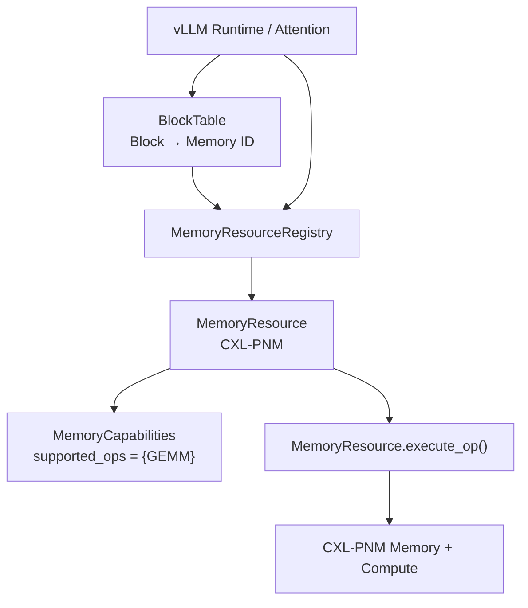
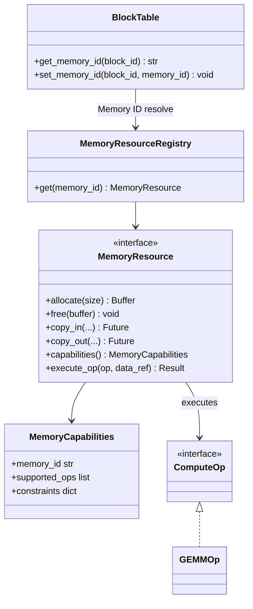
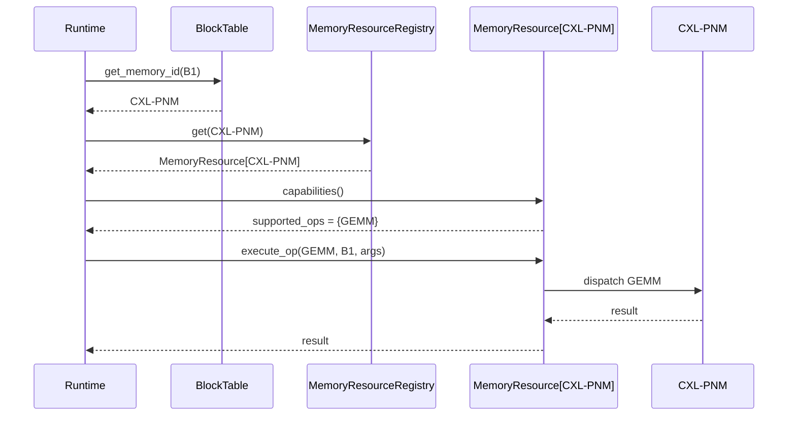
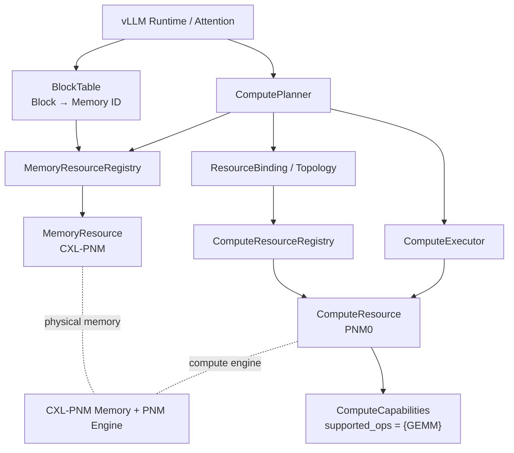
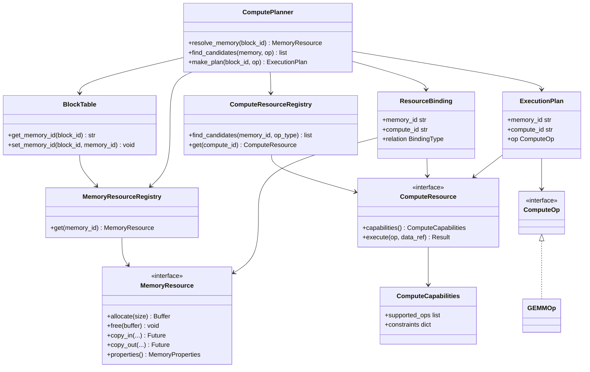
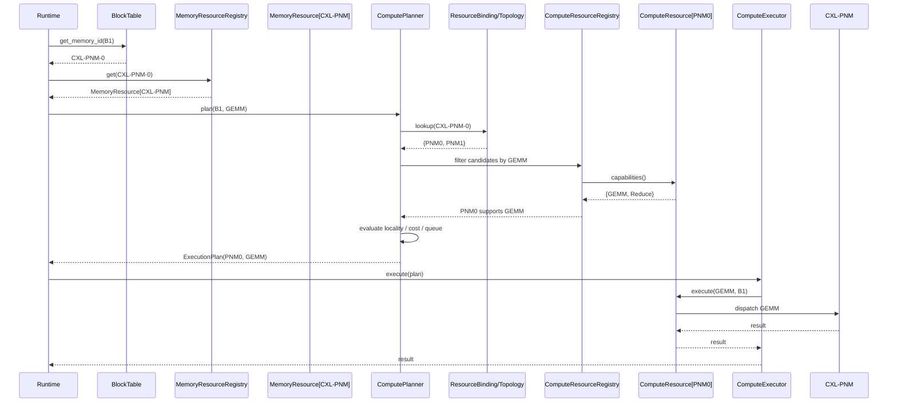

# Compute-Capable Memory Abstraction — DP2 후보 구조 설계

> **Design Question:** 연산 요청 시 Runtime이 Data Location을 인지하고, 해당 위치에서 사용 가능한 Compute capability를 어떻게 표현·조회·선택·실행할 것인가?

DP2의 핵심은 단순히 `ComputeOp` API를 추가하는 것이 아니다. Runtime은 최소한 다음 정보를 알아야 한다.

1. 어떤 Block이 연산 대상인가?
2. 해당 Block은 현재 어느 `MemoryResource`에 저장되어 있는가?
3. 해당 Memory 위치에서 어떤 Compute capability를 사용할 수 있는가?
4. Memory-side Compute를 사용할 것인지 다른 Compute backend를 사용할 것인가?
5. 선택한 Compute path를 어떻게 dispatch할 것인가?

두 후보의 본질적인 차이는 **Data Location과 Compute Capability의 binding을 어디에 두느냐**이다.

---

# 1. Candidate Overview

## Candidate 1 — Capability-Aware MemoryResource

> **MemoryResource가 Memory와 그 Memory에 결합된 Compute capability를 함께 소유하여, Data Locality 기반의 짧고 예측 가능한 Compute execution path를 제공하는 구조.**

```text
Block
  ↓
BlockTable: Memory ID
  ↓
MemoryResource[CXL-PNM]
  ├── Memory operations
  ├── supported_ops = {GEMM, ...}
  └── execute_op()
```

`CXL-PNM → GEMM capability → execution` 관계가 `MemoryResource` 내부에서 닫힌다.

### 핵심 철학

> **Locality-first:** 데이터가 있는 Memory가 어떤 Compute capability를 제공하는지 MemoryResource가 직접 알고 있으며, Runtime은 해당 Resource의 Compute path를 사용한다.

---

## Candidate 2 — Decoupled Memory / Compute

> **MemoryResource와 ComputeResource를 분리하고 Resource Binding/Topology를 통해 연결한 뒤, Runtime이 capability와 policy를 기반으로 적절한 Compute Resource를 선택하는 구조.**

```text
Block
  ↓
BlockTable: Memory ID
  ↓
MemoryResource[CXL-PNM]
  ↓
Resource Binding / Topology
  ↓
{PNM0, PNM1, ...}
  ↓
Capability / Policy
  ↓
ComputeResource
  ↓
Execute
```

### 핵심 철학

> **Resource-selection-first:** Memory와 Compute를 독립 Resource로 보고, Runtime이 둘 사이의 관계와 capability를 이용해 실행 Resource를 선택한다.

---

# 2. Common Example — CXL-PNM + GEMM

두 후보 모두 다음 논리적 동작을 수행한다.

```text
Allocation
  ↓
Block B1 → CXL-PNM MemoryResource에 저장
  ↓
Compute Request: GEMM(B1)
  ↓
Block Location 확인
  ↓
CXL-PNM 위치에서 GEMM capability 확인
  ↓
Memory-side GEMM 사용 여부 결정
  ↓
Execution
```

차이는 **CXL-PNM에 GEMM capability가 있다는 사실을 Runtime이 어떻게 알게 되는가**이다.

---

# 3. Candidate 1 — Capability-Aware MemoryResource

## 3.1 SW Structure / Module View



## 3.2 Class Diagram



## 3.3 Allocation Flow

```text
Runtime
  ↓ allocate(B1)
PlacementPolicy
  ↓ CXL-PNM
MemoryResourceRegistry
  ↓
MemoryResource[CXL-PNM].allocate()
  ↓
CXL-PNM Memory
  ↓
BlockTable[B1] = CXL-PNM
```

Allocation 자체는 DP2 후보 간 큰 차이가 없다. **핵심 차이는 allocation 이후 Compute capability를 표현하는 방식**이다.

## 3.4 Compute Flow

```text
GEMM(B1)
  ↓
BlockTable.get_memory_id(B1)
  ↓
CXL-PNM
  ↓
MemoryResourceRegistry.get(CXL-PNM)
  ↓
MemoryResource.capabilities()
  ↓
GEMM supported?
  ├─ YES → MemoryResource.execute_op(GEMM)
  └─ NO  → fallback Compute
```

## 3.5 Sequence Diagram — Compute



---

## 3.6 Candidate 1 장점 — 왜 장점인가?

### 장점 1. Runtime Compute Dispatch Overhead가 낮다

Candidate 1의 path는 다음처럼 짧다.

```text
Block
 ↓
Memory ID
 ↓
MemoryResource
 ↓
Capability
 ↓
execute_op()
```

Memory 위치가 이미 정해져 있다면 `Memory → ComputeResource`라는 별도의 관계를 다시 resolve할 필요가 없다.

즉 Runtime 입장에서 `CXL-PNM`을 찾은 순간, **그 Resource가 어떤 Compute를 제공하는지와 어떻게 실행하는지까지 같이 얻을 수 있다.**

따라서 다음과 같은 overhead를 제거하기 쉽다.

```text
Topology lookup
Candidate enumeration
Capability filtering
Compute selection
```

특히 반복적인 Block 연산에서 dispatch path가 짧고 예측 가능하다는 것이 장점이다.

---

### 장점 2. Data Locality를 구조적으로 보장하기 쉽다

Candidate 1의 abstraction 자체가 다음 관계를 표현한다.

```text
Data Location = CXL-PNM
        ↓
Available Compute = CXL-PNM GEMM
```

즉 Memory와 Compute가 물리적으로 강하게 결합된 PNM/PIM에서는 **데이터가 있는 곳에서 바로 연산한다**는 설계 의도가 코드 구조에도 반영된다.

별도의 planner가 GPU나 다른 remote Compute를 후보로 끌어와 비교하지 않아도 된다.

---

### 장점 3. Execution Path가 예측 가능하다

예를 들어 `CXL-PNM + GEMM` 요청이 들어오면:

```text
CXL-PNM
 ↓
GEMM capability
 ↓
execute_op(GEMM)
```

이라는 고정적인 path를 만들기 쉽다.

반면 여러 Compute Resource가 존재하는 구조에서는 Runtime 상태에 따라 선택 결과가 달라질 수 있다. Candidate 1은 이런 dynamic decision을 최소화한다.

따라서 latency variance가 중요한 workload에서 유리할 수 있다.

---

### 장점 4. Runtime 구조가 단순하다

Candidate 1에서는 반드시 다음 구성요소를 별도로 만들 필요가 없다.

```text
ComputeResourceRegistry
ResourceBinding/Topology Registry
ComputePlanner
```

MemoryResource 하나가 다음 책임을 함께 갖는다.

```text
MemoryResource
 ├── allocation
 ├── memory access
 ├── capability description
 └── compute execution
```

따라서 초기 구현과 debugging path가 상대적으로 단순하다.

---

### 장점 5. HW와 SW abstraction의 의미가 일치한다

PNM처럼 실제 HW에서 Memory와 Compute가 하나의 device/resource로 묶여 있는 경우:

```text
CXL-PNM Device
 ├── Memory
 └── PNM Compute
```

를 SW에서도:

```text
MemoryResource[CXL-PNM]
 ├── Memory
 └── Compute capability
```

로 표현할 수 있다.

즉 HW가 강하게 결합된 경우에는 이러한 coupling이 단점이 아니라 **자연스러운 abstraction**이 될 수 있다.

---

## 3.7 Candidate 1 단점 — 왜 단점인가?

### 단점 1. Memory와 Compute의 Coupling이 증가한다

가장 본질적인 단점이다.

```text
MemoryResource
 ├── Memory responsibility
 └── Compute responsibility
```

Memory abstraction이 Compute semantics를 알아야 한다.

처음에는:

```text
CXL-PNM → {GEMM}
```

이면 간단하지만, capability가 증가하면:

```text
CXL-PNM
 ├── GEMM
 ├── GEMV
 ├── Reduce
 ├── Attention
 └── custom op
```

처럼 MemoryResource가 Compute-specific knowledge를 계속 가지게 된다.

즉 **Compute 기능이 다양해질수록 MemoryResource의 책임이 커진다.**

---

### 단점 2. 하나의 Memory에 여러 Compute Resource가 연결될 때 구조가 복잡해진다

예를 들어 실제 시스템이:

```text
CXL-PNM
 ├── PNM0 : GEMM
 └── PNM1 : GEMM
```

이라면 Candidate 1의 단순 모델:

```text
MemoryResource[CXL-PNM]
 └── GEMM
```

만으로는 **어느 engine을 사용할지** 표현하기 어렵다.

이를 해결하려고 MemoryResource 안에:

```text
MemoryResource
 ├── PNM0
 ├── PNM1
 └── select_compute()
```

를 추가하기 시작하면, MemoryResource가 사실상 Compute Resource Manager 역할까지 맡게 된다.

즉 Candidate 1의 장점인 단순성이 약해지는 지점이다.

---

### 단점 3. Dynamic Compute Selection에 불리하다

다음 상황을 생각할 수 있다.

```text
PNM0 : GEMM / Queue = low / local
PNM1 : GEMM / Queue = high / local
GPU0 : GEMM / Queue = low / remote
```

Runtime이:

- queue depth
- compute utilization
- bandwidth
- locality
- latency
- power

등을 비교해 최적 resource를 선택하려면 별도의 planning logic이 필요하다.

Candidate 1에서 이것을 MemoryResource 내부에 넣으면 MemoryResource가 점점 Compute Scheduler처럼 변한다.

따라서 **고정적인 Memory-local Compute에는 강하지만, dynamic resource selection에는 불리하다.**

---

### 단점 4. 새로운 Compute backend 추가 시 Memory abstraction에 영향이 갈 수 있다

예를 들어 새로운 PNM2가 추가되고 새로운 operation set을 제공한다고 하자.

```text
PNM2
 └── GEMM + Attention
```

Candidate 1에서는 이 capability를 어느 MemoryResource가 어떻게 노출할 것인지 결정해야 한다.

즉 새로운 Compute backend가 추가될 때 기존 Memory abstraction의 책임 범위가 커질 가능성이 있다.

---

### 단점 5. Memory와 Compute의 독립적인 lifecycle 관리가 어렵다

Memory와 Compute가 반드시 동일한 lifecycle을 갖는 것이 아니라면 문제가 커진다.

예를 들어:

```text
Memory A
   ↕
PNM0
```

에서 PNM0을 교체하거나 추가하는 경우 MemoryResource 자체의 state/capability를 수정해야 할 수 있다.

반면 Candidate 2에서는 ComputeResource만 교체하고 binding을 변경하는 방식으로 표현할 수 있다.

---

# 4. Candidate 2 — Decoupled Memory / Compute

## 4.1 SW Structure / Module View



## 4.2 Class Diagram



---

## 4.3 Resource Binding — CXL-PNM과 PNM0은 어떻게 연결되는가?

Candidate 2에서 Runtime이 `CXL-PNM`이라는 이름만 보고 `PNM0`을 추론하는 것이 아니다.

**Device discovery / driver initialization 단계에서 관계를 등록한다.**

```text
Device Discovery / Driver
        │
        ├── register MemoryResource(CXL-PNM-0)
        ├── register ComputeResource(PNM0)
        │              └── supported_ops = {GEMM}
        │
        └── register Binding
                CXL-PNM-0 ─────→ PNM0
```

Binding이 여러 개일 수도 있다.

```text
CXL-PNM-0
 ├── PNM0
 └── PNM1
```

또는:

```text
CXL-Memory-0
 ├── GPU0
 └── NPU0
```

따라서 Candidate 2의 핵심 abstraction은:

```text
MemoryResource
       ↕
ResourceBinding / Topology
       ↕
ComputeResource
```

이다.

---

## 4.4 ComputeResource의 의미

`GEMM`, `GEMV` 자체가 `ComputeResource`가 아니다.

```text
ComputeResource = 실제 연산을 수행하는 execution resource
```

예:

```text
ComputeResource[PNM0]
 └── supported_ops = {GEMM, Reduce}

ComputeResource[GPU0]
 └── supported_ops = {GEMM, GEMV, ...}
```

따라서:

- `PNM0` = Compute Resource
- `GEMM` = Compute Operation / Capability
- `CXL-PNM-0 ↔ PNM0` = Resource Binding

이다.

---

## 4.5 Allocation Flow

```text
Runtime
  ↓ allocate(B1)
PlacementPolicy
  ↓ CXL-PNM
MemoryResourceRegistry
  ↓
MemoryResource[CXL-PNM].allocate()
  ↓
CXL-PNM Memory
  ↓
BlockTable[B1] = CXL-PNM
```

Allocation path는 Candidate 1과 의도적으로 유사하다. **DP2의 trade-off는 Allocation 방식이 아니라 Compute capability binding 방식에서 발생하기 때문이다.**

---

## 4.6 Compute Flow

```text
GEMM(B1)
  ↓
BlockTable.get_memory_id(B1)
  ↓
MemoryResource = CXL-PNM
  ↓
ResourceBinding.lookup(CXL-PNM)
  ↓
{PNM0, PNM1}
  ↓
Capability filtering
  ↓
Policy / Cost / Locality
  ↓
PNM0
  ↓
execute(GEMM)
```

## 4.7 Sequence Diagram — Compute



---

## 4.8 Candidate 2 장점 — 왜 장점인가?

### 장점 1. Compute Resource를 독립적으로 관리할 수 있다

Memory와 Compute가 서로 다른 abstraction이므로:

```text
MemoryResource[CXL-PNM]

ComputeResource[PNM0]
ComputeResource[PNM1]
```

를 독립적으로 관리할 수 있다.

새로운 Compute Resource가 추가되어도 기존 MemoryResource의 interface를 반드시 수정할 필요가 없다.

---

### 장점 2. 하나의 Memory에 여러 Compute Resource를 자연스럽게 연결할 수 있다

```text
CXL-PNM
 ├── PNM0
 └── PNM1
```

이 관계를 `ResourceBinding`으로 직접 표현할 수 있다.

따라서 1:1뿐 아니라 1:N, N:M topology도 표현하기 쉽다.

```text
Memory A → {PNM0, GPU0}
Memory B → {PNM1, GPU0}
```

---

### 장점 3. Runtime-level Dynamic Compute Selection이 가능하다

ComputeResource마다 상태가 다를 수 있다.

```text
PNM0 : GEMM / low queue / local
PNM1 : GEMM / high queue / local
GPU0 : GEMM / low queue / remote
```

Planner는:

```text
Capability
+ Locality
+ Queue depth
+ Bandwidth
+ Cost
```

등을 고려하여 선택할 수 있다.

즉 Candidate 2는 **Compute를 단순히 Memory의 부가 기능으로 보는 것이 아니라 독립적인 resource pool로 보고 최적화할 수 있다.**

---

### 장점 4. Compute backend 확장이 쉽다

새로운:

```text
PNM2
PIM0
NPU0
GPU1
```

등이 추가되어도 각 ComputeResource를 독립적으로 등록하고 binding하면 된다.

```text
New ComputeResource
      ↓
register capability
      ↓
register binding
      ↓
Planner가 후보로 사용
```

따라서 Memory abstraction을 계속 수정하지 않고 Compute backend를 확장하기 쉽다.

---

### 장점 5. HW topology를 명시적으로 표현할 수 있다

실제 HW에서:

```text
Memory A
 ├── PNM0
 └── PNM1
```

처럼 연결 관계가 존재한다면 이를 Runtime metadata로 그대로 표현할 수 있다.

이것은 단순한 capability lookup보다 중요하다. `PNM0이 GEMM을 지원한다`는 사실만으로는 **PNM0이 해당 Block의 Memory에 접근 가능한지** 알 수 없기 때문이다.

Candidate 2에서는:

```text
Memory location
      ↓
Topology
      ↓
Reachable Compute Resources
      ↓
Capability
```

라는 순서로 확인할 수 있다.

---

## 4.9 Candidate 2 단점 — 왜 단점인가?

### 단점 1. Compute Dispatch Control Path가 길어진다

Candidate 1:

```text
Memory
 ↓
Capability
 ↓
Execute
```

Candidate 2:

```text
Memory
 ↓
Binding
 ↓
Candidates
 ↓
Capability filtering
 ↓
Planner
 ↓
Execute
```

따라서 추가 metadata lookup과 planning overhead가 발생할 수 있다.

특히 실제 Compute 시간이 매우 짧은 operation이라면 control overhead의 상대적인 비중이 커질 수 있다.

---

### 단점 2. Runtime 구조가 복잡해진다

Candidate 2는 다음 구성요소를 관리해야 한다.

```text
MemoryResourceRegistry
ComputeResourceRegistry
ResourceBinding / Topology
ComputePlanner
ComputeExecutor
```

각 component 사이의 dependency도 늘어난다.

따라서 초기 구현뿐 아니라 debugging과 failure analysis도 복잡해질 수 있다.

---

### 단점 3. Binding consistency를 관리해야 한다

다음 관계가 항상 올바르게 유지되어야 한다.

```text
CXL-PNM-0 ↔ PNM0
```

만약:

```text
MemoryResource는 존재
ComputeResource는 존재
Binding이 잘못됨
```

이면 Runtime이 존재하지 않는 Compute path를 선택하거나 잘못된 resource를 후보로 사용할 수 있다.

따라서 discovery, registration, hot-plug, device failure 등의 상황에서 binding consistency를 관리해야 한다.

---

### 단점 4. Planner가 복잡해질 수 있다

처음에는:

```text
if GEMM supported:
    use PNM0
```

정도로 끝날 수 있지만, resource가 많아지면:

```text
Capability
+ Locality
+ Queue
+ Bandwidth
+ Latency
+ Power
+ Availability
```

등을 고려해야 한다.

즉 flexibility를 얻는 대신 **Runtime decision logic의 복잡도**를 부담한다.

---

### 단점 5. 단순한 PNM/PIM HW에서는 abstraction이 과할 수 있다

만약 HW가 항상:

```text
CXL-PNM-0 ↔ PNM0
```

이고 다른 선택지가 전혀 없다고 하자.

그렇다면 Candidate 2의:

```text
Topology lookup
Candidate enumeration
Planner
```

은 사실상 항상 같은 결과를 반환한다.

이 경우 Candidate 1의:

```text
MemoryResource[CXL-PNM]
 └── GEMM
```

가 훨씬 단순하면서 동일한 실행 결과를 얻을 수 있다.

즉 Candidate 2의 유연성이 실제 HW topology에 의해 활용되지 않는다면 추가 구조가 overhead로 남을 수 있다.

---

# 5. QA Evaluation — 3점 만점

> 별점은 특정 구현의 절대 성능 수치가 아니라, **동일한 HW/Workload를 기준으로 각 architecture가 구조적으로 제공하는 상대적인 특성**을 의미한다.

| QA | Candidate 1 | Candidate 2 | 핵심 이유 |
|---|:---:|:---:|---|
| **Runtime Compute Efficiency** | ★★★ | ★★☆ | C1은 짧은 dispatch path, C2는 binding/planning 추가 |
| **Data Locality Exploitation** | ★★★ | ★★☆ | C1은 Memory와 Compute를 직접 결합 |
| **Compute Resource Utilization** | ★★☆ | ★★★ | C2는 여러 Compute Resource를 후보로 활용 가능 |
| **Memory–Compute Flexibility** | ★★☆ | ★★★ | C2는 1:N/N:M binding을 자연스럽게 표현 |
| **Runtime Complexity** | ★★★ | ★★☆ | C1은 별도 topology/planner가 필요 없음 |
| **Maintainability & Extensibility** | ★★☆ | ★★★ | C2는 Memory/Compute를 독립적으로 확장 |

---

# 6. QA가 왜 이렇게 갈리는가?

## Runtime Compute Efficiency

```text
C1: Memory → Capability → Execute
C2: Memory → Binding → Candidates → Planner → Execute
```

따라서 **고정된 Memory-local Compute를 빠르게 실행하는 것**은 C1이 유리하다.

## Data Locality Exploitation

C1에서는 Memory 자체가 Compute capability를 가지고 있으므로:

```text
Data = CXL-PNM
Compute = CXL-PNM local GEMM
```

이라는 관계가 abstraction에 직접 반영된다.

C2에서도 locality를 고려할 수 있지만 Planner가 이를 명시적으로 반영해야 한다.

## Compute Resource Utilization

C2에서는:

```text
Memory → {PNM0, PNM1, GPU0}
```

처럼 여러 후보를 표현하고 선택할 수 있다.

C1에서는 이러한 선택이 MemoryResource 내부로 들어가면서 abstraction이 복잡해진다.

## Memory–Compute Flexibility

C2는:

```text
Memory ↔ Compute
```

관계를 별도의 Binding으로 관리하기 때문에 topology 변화에 유연하다.

C1은:

```text
MemoryResource + Compute capability
```

가 하나의 abstraction이므로 변화가 반복될수록 coupling이 커진다.

## Runtime Complexity

C1은 단순한 구조를 유지할 수 있다.

C2는 flexibility를 위해 Registry, Binding, Planner가 추가된다.

따라서 구조적인 복잡도는 C1이 낮다.

## Maintainability & Extensibility

Compute backend가 증가할수록 C1은 MemoryResource의 책임이 증가할 가능성이 있다.

C2는:

```text
New ComputeResource
 → register
 → bind
 → planner candidate
```

방식으로 확장할 수 있어 장기적인 확장성은 C2가 유리하다.

---

# 7. Overall Trade-off

```text
Candidate 1                              Candidate 2
Capability-Aware MemoryResource         Decoupled Memory / Compute
          │                                      │
          ▼                                      ▼
       Locality-first                    Resource-selection-first
          │                                      │
          ▼                                      ▼
Low overhead / Predictable             Flexible / Dynamically selectable
          │                                      │
          ▼                                      ▼
Strong HW coupling                     Independent abstractions
```

## Candidate 1이 유리한 조건

- Memory와 Compute가 HW 수준에서 강하게 결합됨
- 특정 Memory-local Compute가 대부분의 경우 최적
- Compute backend가 제한적
- operation 종류가 제한적
- dispatch overhead와 latency predictability가 중요
- 단순한 Runtime architecture가 중요

## Candidate 2가 유리한 조건

- 하나의 Memory에 여러 Compute Resource가 연결됨
- 동일 operation을 여러 backend에서 수행 가능
- Runtime이 locality/load/cost를 기준으로 선택해야 함
- Compute backend가 지속적으로 증가함
- Memory–Compute topology가 다양하거나 동적으로 변화함

---

# 8. Final Comparison

### Candidate 1

> **MemoryResource가 Memory와 Compute capability를 함께 소유하여 Data Locality 기반의 낮은 overhead와 예측 가능한 실행 경로를 제공한다.**

### Candidate 2

> **MemoryResource와 ComputeResource를 분리하고 Resource Binding/Topology를 통해 Runtime이 상황에 맞는 Compute Resource를 선택한다.**

### Fundamental Trade-off

> **Candidate 1은 `Locality / Simplicity / Predictability`를 위해 Memory–Compute coupling을 선택하고, Candidate 2는 `Flexibility / Resource Utilization / Extensibility`를 위해 이를 분리한다.**

두 후보 중 하나가 절대적으로 우수한 것이 아니라, **Compute-capable Memory가 얼마나 강하게 HW에 결합되어 있고, Runtime에서 Compute Resource를 동적으로 선택해야 하는지가 선택 기준**이다.
