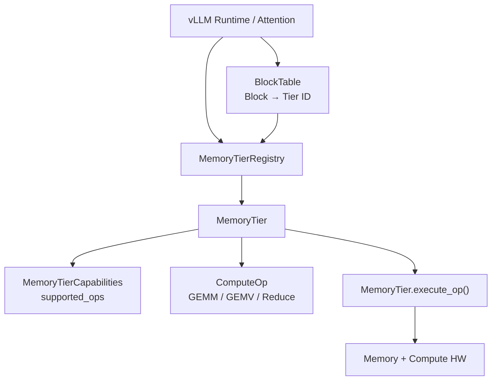
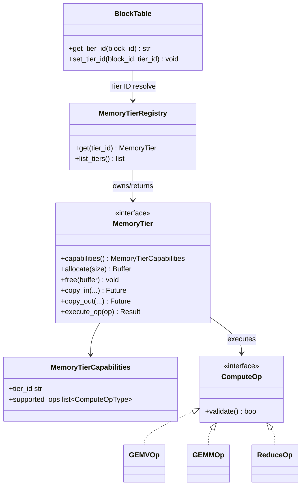
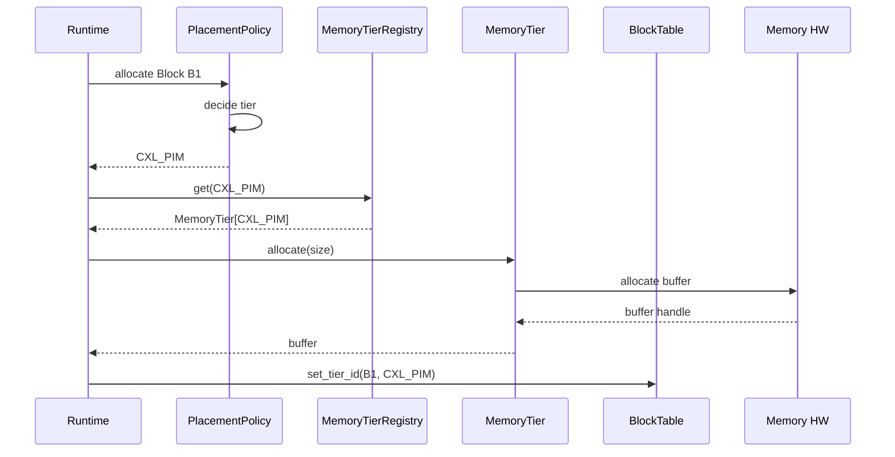
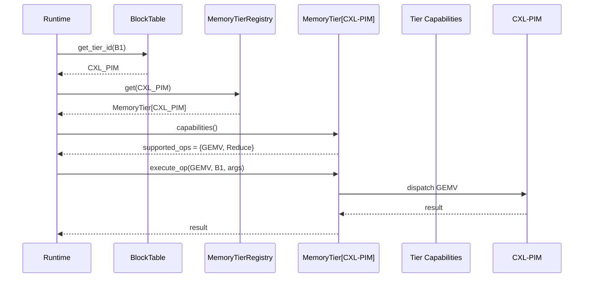
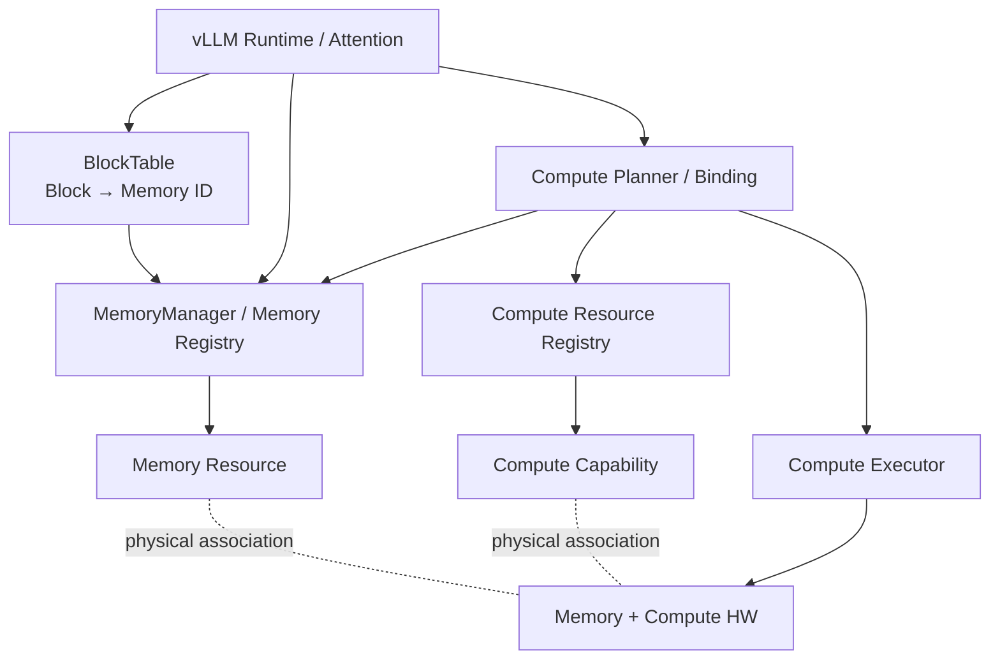
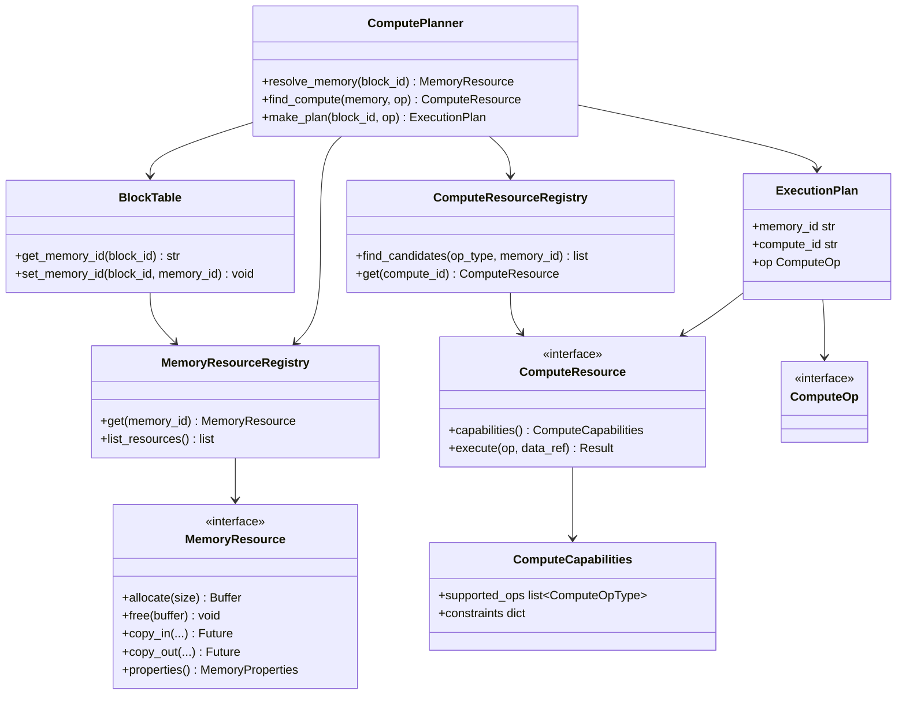
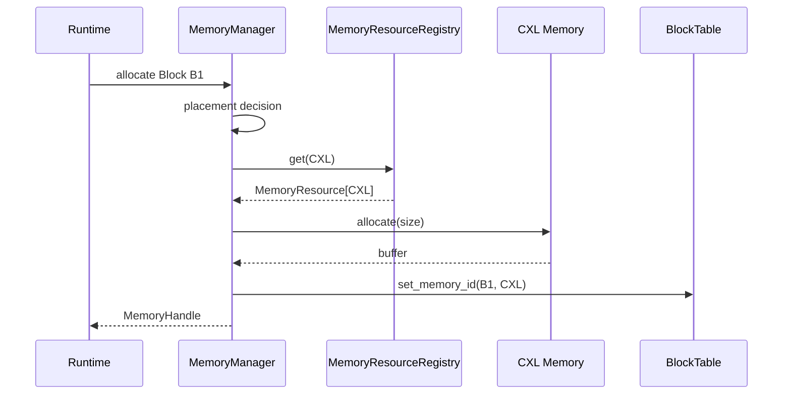
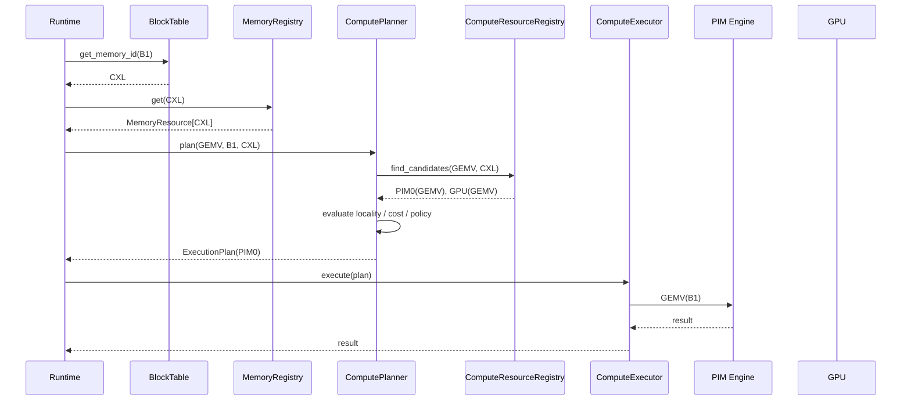

# Compute-Capable Memory Abstraction — 후보 구조 설계

> 선행 문서: `doc-mk/vllm-memory-abstraction-level-candidates.md` (DP1 Memory Tiering Abstraction), `doc-mk/vllm-kv-cache-memory-abstraction-layer.md` (MAL 기본 설계)
>
> 본 문서는 **DP2: 연산 기능을 가진 Memory를 Runtime에서 어떻게 추상화할 것인가**를 다룹니다. DP1이 Memory Resource 자체의 abstraction boundary를 결정한다면, DP2는 **Data Location과 Compute Capability의 관계를 어디에서 관리하고, 연산 시 이를 어떻게 활용할 것인가**를 결정합니다.

---

## 0. 설계 질문

### DP2 — Compute-Capable Memory Abstraction

> **Data Location과 Compute Capability의 관계를 Runtime에서 어떻게 표현하고 활용할 것인가?**

영문:

> **How should the runtime represent and resolve the relationship between data location and compute capability?**

핵심은 단순히 `ComputeOp` API를 제공하는 것이 아닙니다. 연산 요청 시 Runtime은 최소한 다음 정보를 알아야 합니다.

1. **어떤 데이터(Block)가 대상인가?**
2. **그 Block이 현재 어느 Memory Tier에 있는가?**
3. **해당 Tier/Memory Resource가 어떤 Compute capability를 지원하는가?**
4. **해당 연산을 Memory-side Compute로 실행할지, 다른 Compute backend를 사용할지 결정할 수 있는가?**
5. **선택된 Compute path를 어떻게 dispatch할 것인가?**

따라서 DP2의 본질적인 설계축은 **Memory와 Compute를 단순히 분리하느냐가 아니라, Location–Capability binding을 어디에 둘 것인가**입니다.

---

## 1. 두 후보의 핵심 차이

### Candidate 1 — Memory-Coupled Compute

`MemoryTier`가 Memory Resource와 그 Memory에서 가능한 `ComputeOp`을 함께 소유합니다.

```text
Block
  │
  │ Tier ID
  ▼
MemoryTier
  ├── Memory operations
  ├── supported ComputeOps
  └── execute_op()
```

Block Table의 `Tier ID`를 통해 `MemoryTier`를 찾고, 해당 Tier의 `supported_ops`를 조회한 뒤 `MemoryTier.execute_op()`를 호출합니다.

### Candidate 2 — Decoupled Memory / Compute

Memory location과 Compute capability를 서로 독립된 abstraction으로 관리합니다. Runtime이 `Block → Memory Location`과 `ComputeOp → Compute Resource`를 각각 확인하고, 두 정보를 바탕으로 **Runtime-level binding/planning**을 수행합니다.

```text
Block ──→ Memory Resource
             
ComputeOp ─→ Compute Resource
       \       /
        \     /
      Runtime Binding / Planner
              │
              ▼
          Execution
```

**중요:** Candidate 2도 Block의 location을 알아야 합니다. Candidate 1과의 차이는 location lookup의 유무가 아니라 **Location과 Compute Capability의 소유/결합 위치**입니다.

---

## 2. 공통 전제

두 후보는 동일한 workload와 HW를 대상으로 비교합니다.

### Memory resources

- GPU HBM
- CPU DRAM
- CXL Memory
- Custom HBM
- HBF
- SSD + PIM 등

### Example compute capabilities

- GPU HBM: 일반적인 GPU compute와 결합 가능
- CXL-PIM / Custom HBM-PIM: `GEMM`, `GEMV`, `Reduce` 등의 memory-side operation 예시
- SSD + PIM: `GEMV` 등의 특화 operation 예시

실제 지원 연산과 HW capability는 구현 대상 HW에 따라 달라지며, 위 목록은 구조 비교를 위한 예시입니다.

### 공통 runtime flow

```text
Allocation
  ↓
Block Placement
  ↓
Block → Location metadata 기록
  ↓
Compute Request
  ↓
Location 확인
  ↓
Capability 확인
  ↓
Memory-side Compute 사용 여부 결정
  ↓
Execution
```

두 후보 모두 이 논리적 단계는 필요합니다. 차이는 이 정보를 **어떤 객체/계층이 소유하고 어떻게 연결하는가**입니다.

---

# 3. Candidate 1 — Memory-Coupled Compute

## 3.1 설계 철학

MemoryTier를 Memory Resource의 1급 abstraction으로 유지하면서, 해당 Tier가 지원하는 Compute capability와 execution entry point까지 함께 제공합니다.

```text
MemoryTier
 ├── capacity / latency / bandwidth
 ├── allocate()
 ├── free()
 ├── copy()
 ├── supported_ops
 └── execute_op()
```

Block Table은 각 Block의 `Tier ID`를 저장합니다.

```text
BlockTable
┌─────────┬──────────────┐
│ Block   │ Tier ID      │
├─────────┼──────────────┤
│ B0      │ GPU_HBM      │
│ B1      │ CXL_PIM      │
│ B2      │ CPU_DRAM     │
└─────────┴──────────────┘
```

연산 요청이 `B1`에 들어오면:

```text
B1
 ↓
Tier ID = CXL_PIM
 ↓
MemoryTier[CXL_PIM]
 ↓
supported_ops 확인
 ↓
GEMV 지원
 ↓
MemoryTier.execute_op(GEMV)
```

즉 **Data Location과 Compute Capability의 binding이 MemoryTier 내부에 존재**합니다.

---

## 3.2 SW Structure / Module View



### 핵심 관계

- `BlockTable`: Block의 현재 Tier ID를 관리
- `MemoryTierRegistry`: Tier ID → `MemoryTier` 객체 resolve
- `MemoryTierCapabilities`: 해당 Tier가 지원하는 operation 선언
- `ComputeOp`: 연산 요청을 표현
- `MemoryTier.execute_op()`: Memory-side Compute의 실행 진입점

---

## 3.3 Class Diagram



---

## 3.4 Detailed Operation

### A. Memory Allocation / Placement

1. Runtime이 Block allocation을 요청
2. Placement policy가 대상 Tier 결정
3. `MemoryTierRegistry`를 통해 Tier resolve
4. 해당 `MemoryTier.allocate()` 수행
5. Block Table에 `Block → Tier ID` 기록

```text
Runtime
  │
  │ allocate(Block B1)
  ▼
PlacementPolicy
  │
  │ tier = CXL_PIM
  ▼
MemoryTierRegistry
  │
  ▼
MemoryTier[CXL_PIM]
  │
  │ allocate
  ▼
CXL-PIM Memory
  │
  ▼
BlockTable[B1] = CXL_PIM
```

### B. Compute Execution

1. `ComputeOp(Block B1)` 요청
2. Block Table에서 `Tier ID` 조회
3. `MemoryTierRegistry`에서 해당 Tier resolve
4. `MemoryTier.capabilities()`에서 지원 연산 조회
5. 지원하면 `MemoryTier.execute_op()` 호출
6. 지원하지 않으면 다른 Compute path로 fallback

```text
ComputeOp(B1, GEMV)
       │
       ▼
BlockTable.get_tier_id(B1)
       │
       ▼
     CXL_PIM
       │
       ▼
MemoryTierRegistry.get(CXL_PIM)
       │
       ▼
capabilities().supported_ops
       │
       ├── GEMV ✓ ──→ execute_op(GEMV)
       │
       └── GEMV ✗ ──→ fallback Compute
```

---

## 3.5 Sequence Diagram

### Memory Allocation



### Compute Execution



### 핵심 특성

**Location → Capability → Execution** 경로가 `MemoryTier`를 중심으로 닫혀 있습니다.

---

# 4. Candidate 2 — Decoupled Memory / Compute Abstraction

## 4.1 설계 철학

Memory와 Compute를 서로 다른 resource abstraction으로 정의합니다.

```text
Memory Resource
 ├── capacity
 ├── latency
 ├── bandwidth
 └── location / allocation

Compute Resource
 ├── supported_ops
 ├── throughput
 ├── constraints
 └── execute()
```

Runtime은 이 두 resource를 연결하기 위한 **Capability/Binding layer**를 관리합니다.

핵심은 다음과 같습니다.

```text
Block
  │
  └── Memory Location ──────┐
                             │
ComputeOp                    ▼
  │                    Runtime Binding
  └── Required Capability ───┤
                             ▼
                       Compute Resource
```

예를 들어 `B1`이 CXL에 있고, CXL-PIM의 PIM Engine이 GEMV를 지원한다면 Runtime이 이를 resolve합니다.

```text
B1 → CXL Memory
GEMV → PIM0 capability
          ↓
   Binding / Planning
          ↓
      Execute PIM0
```

---

## 4.2 SW Structure / Module View



### 핵심 관계

- `BlockTable`: Block → Memory Resource 관계 관리
- `MemoryManager`: Memory Resource allocation/location 관리
- `ComputeResourceRegistry`: Compute Resource와 capability 관리
- `ComputePlanner`: Block location과 requested operation을 바탕으로 실행 resource 선택
- `ComputeExecutor`: 선택된 Compute Resource에 dispatch

**Candidate 2의 핵심 추가 요소는 `ComputePlanner / Binding`입니다.** Candidate 1에서는 MemoryTier 자체가 location과 capability를 함께 소유하지만, Candidate 2에서는 Runtime이 두 resource의 관계를 해석합니다.

---

## 4.3 Class Diagram



---

## 4.4 Detailed Operation

### A. Memory Allocation / Placement

Candidate 2의 allocation path는 Candidate 1과 크게 다르지 않아야 합니다. DP2의 핵심 차이는 allocation 자체가 아니라 **Compute capability의 관리 방식**이기 때문입니다.

```text
Runtime
  │
  ▼
MemoryManager
  │
  ▼
Memory Resource[CXL]
  │
  ▼
BlockTable[B1] = CXL
```

### B. Compute Execution

1. Block Table에서 Block의 Memory ID 확인
2. Memory Resource에서 현재 location/resource 확인
3. Compute Planner가 requested `ComputeOp` 확인
4. Compute Resource Registry에서 해당 Memory와 연결 가능한 Compute capability 조회
5. Memory-side Compute 사용 여부와 대체 Compute backend를 비교
6. Execution Plan 생성
7. Compute Executor가 선택된 resource로 dispatch

```text
GEMV(B1)
   │
   ▼
BlockTable
   │
   ▼
Memory = CXL
   │
   ▼
ComputePlanner
   │
   ├── CXL-PIM supports GEMV? → YES
   │
   ├── GPU supports GEMV?      → YES
   │
   └── cost / locality / policy 비교
               │
               ▼
          ExecutionPlan
               │
               ▼
          ComputeExecutor
```

**즉 Candidate 2는 “CXL-PIM이면 무조건 PIM을 쓴다”가 아니라, Memory location과 Compute capability를 독립적으로 인식한 뒤 Runtime policy가 사용 여부를 결정할 수 있는 구조입니다.**

---

## 4.5 Sequence Diagram

### Memory Allocation



### Compute Execution



**대체 선택이 필요한 경우:**

```text
ComputePlanner
    │
    ├── PIM candidate
    └── GPU candidate
          │
          ▼
     Policy / Cost Model
          │
     ┌────┴────┐
     ▼         ▼
    PIM       GPU
```

이 부분이 Candidate 1과 중요한 차이입니다. Candidate 1은 `MemoryTier`가 지원 capability를 직접 제공하고 해당 Tier의 `execute_op()`로 들어가는 반면, Candidate 2는 **Memory locality와 Compute capability를 이용해 Runtime이 실행 resource를 선택**할 수 있습니다.

---

# 5. Candidate 1 vs Candidate 2 — 구조적 Trade-off

## 5.1 동일한 질문에 대한 두 가지 답

### Candidate 1

> **“이 Block이 어느 Tier에 있는가?”를 알면, 그 Tier가 제공하는 Compute 기능을 바로 확인하고 실행한다.**

```text
Block
 ↓
Tier ID
 ↓
MemoryTier
 ↓
Capability
 ↓
execute_op()
```

### Candidate 2

> **“이 Block이 어느 Memory에 있는가?”와 “어떤 Compute Resource가 어떤 연산을 지원하는가?”를 독립적으로 확인한 뒤 Runtime이 binding한다.**

```text
Block ──→ Memory
             │
ComputeOp ─→ Compute Resource
             │
       Runtime Binding
             │
             ▼
          Execute
```

---

## 5.2 정성 평가

| 평가 기준 | Candidate 1: Memory-Coupled | Candidate 2: Decoupled |
|---|---|---|
| 구현 복잡도 | **낮음** | 높음 |
| Compute dispatch path | **짧음** | 상대적으로 김 |
| Runtime control overhead | **낮음** | 높음 |
| Data locality 인지 | **명확** | 명확 |
| Capability 확장성 | 제한적 | **높음** |
| Memory–Compute N:M 관계 | 제한적 | **자연스러움** |
| Compute backend 독립성 | 낮음 | **높음** |
| PIM처럼 Memory/Compute가 강결합된 HW | **유리** | 상대적으로 복잡 |
| 여러 Compute resource 간 선택 | 제한적 | **유리** |
| 정책 기반 Compute 선택 | 제한적 | **유리** |
| Debugging / call path 단순성 | **유리** | 불리 |

별도의 절대적인 우열이 아니라 **control overhead / simplicity와 flexibility / extensibility의 Trade-off**로 평가합니다.

---

# 6. 성능 관점의 Trade-off

DP2에서 직접적인 memory bandwidth 차이를 만드는 구조는 아니며, 주된 성능 차이는 **control path와 Compute placement 결정 overhead**에서 발생합니다.

## Candidate 1

```text
Block → Tier ID → MemoryTier → capability → execute_op
```

- lookup path가 짧음
- capability가 MemoryTier에 이미 붙어 있으므로 planning 비용이 작음
- 동일한 종류의 PIM operation을 반복적으로 실행하는 workload에서 유리
- 대신 실행 resource 선택 공간이 좁아 최적의 Compute placement를 놓칠 가능성이 있음

## Candidate 2

```text
Block → Memory
          +
ComputeOp → Candidate Compute Resources
          ↓
      Binding / Planning
          ↓
       Execute
```

- 추가 lookup 및 planning overhead 발생
- 하지만 PIM vs GPU 등의 선택을 runtime policy로 최적화할 수 있음
- Compute resource가 여러 개이거나 workload가 동적으로 변하는 경우 장기적인 성능 상한이 높음

따라서 성능은 다음과 같이 이해하는 것이 적절합니다.

> **Candidate 1: 낮은 per-operation control overhead / 낮은 decision flexibility**
>
> **Candidate 2: 높은 per-operation control overhead / 높은 decision flexibility**

실제 수치 비교를 위해서는 동일 HW에서 `capability lookup`, `planning`, `dispatch`, `compute execution` 시간을 분리 측정해야 합니다. 현재 문서에서는 임의의 ns/us 수치를 가정하지 않습니다.

---

# 7. 핵심 설계 Trade-off

```text
                    DP2
                     │
       ┌─────────────┴─────────────┐
       │                           │
 Memory-Coupled              Decoupled
       │                           │
       ▼                           ▼
Simple / Fast              Flexible / Extensible
       │                           │
Low control overhead        Higher planning overhead
       │                           │
Strong HW coupling         Independent resources
       │                           │
PIM-oriented               Heterogeneous compute
```

### Candidate 1이 유리한 상황

- Memory와 Compute가 물리적으로 강하게 결합
- 지원 ComputeOp가 제한적이고 비교적 고정적
- operation당 latency가 작아 runtime control overhead가 상대적으로 중요
- 단순한 execution path가 중요

### Candidate 2가 유리한 상황

- 하나의 Memory가 여러 Compute Resource와 관계를 가질 수 있음
- 여러 Compute backend 중 선택이 필요
- 새로운 Compute capability를 독립적으로 추가해야 함
- locality, bandwidth, compute cost 등을 함께 고려한 runtime optimization이 중요

---

# 8. DP1과의 관계

DP1과 DP2는 서로 다른 abstraction boundary를 결정합니다.

### DP1 — Memory Tiering Abstraction

> **Memory Resource를 어떤 단위로 Runtime에 노출할 것인가?**

```text
Tier-Centric
     vs
Object-Centric
```

### DP2 — Compute-Capable Memory Abstraction

> **Data Location과 Compute Capability의 관계를 Runtime에서 어떻게 표현하고 활용할 것인가?**

```text
Memory-Coupled
     vs
Decoupled Memory / Compute
```

따라서 DP1의 선택과 DP2의 선택은 독립적인 축으로 볼 수 있습니다.

```text
                  DP1
        Memory abstraction unit
                  │
        ┌─────────┴─────────┐
        Tier              Object
          │                  │
          └────────┬─────────┘
                   │
                  DP2
       Location–Capability binding
                   │
          ┌────────┴────────┐
       Coupled          Decoupled
```

---

# 9. 결론

DP2의 핵심 설계 선택은 **“Compute 기능을 지원하느냐”가 아니라 “Data Location과 Compute Capability의 binding을 어디에서 관리하느냐”**입니다.

- **Candidate 1 — Memory-Coupled:** `Block → Tier ID → MemoryTier → supported_ops → execute_op()`
  - 단순하고 빠른 control path
  - Memory-side Compute가 강하게 결합된 HW에 적합
  - MemoryTier와 Compute 기능의 coupling이 증가

- **Candidate 2 — Decoupled:** `Block → Memory`와 `ComputeOp → Compute Resource`를 독립적으로 관리하고 Runtime에서 binding
  - 높은 flexibility와 extensibility
  - 여러 Compute backend 중 선택 가능
  - 추가 lookup/planning overhead와 구조 복잡성 발생

따라서 두 후보는 다음의 명확한 Trade-off 관계를 가집니다.

> **Memory-Coupled = Simplicity / Low Overhead ↔ Decoupled = Flexibility / Extensibility**

특히 Sequence Diagram에서 두 후보 모두 **Allocation → Location 기록 → Compute Request → Location 확인 → Capability 확인 → Compute 사용 여부 결정 → Execution**의 전체 흐름을 보여줘야 하며, Candidate 1에서는 이 관계가 `MemoryTier` 내부에, Candidate 2에서는 `Runtime Binding / Compute Planner`에 존재한다는 차이를 명확히 보여주는 것이 핵심입니다.
