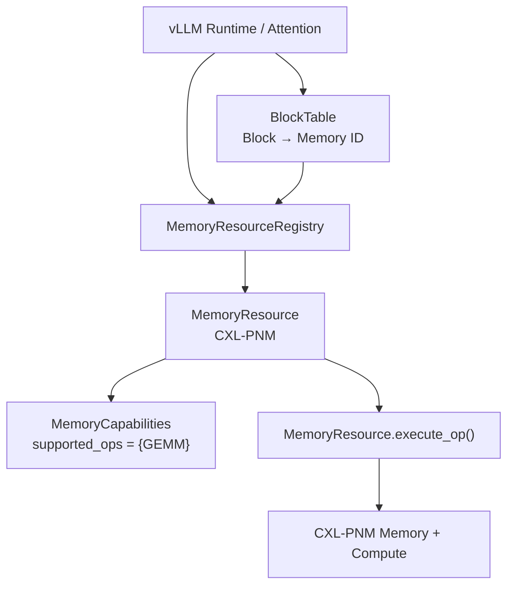
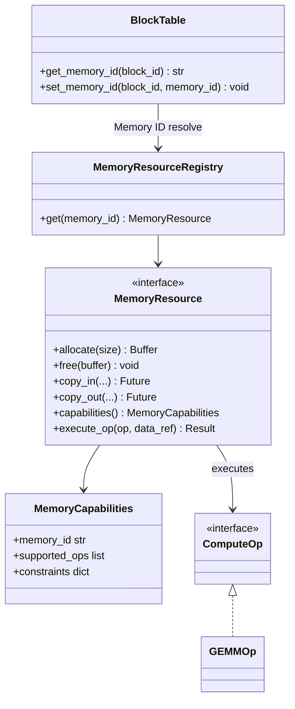
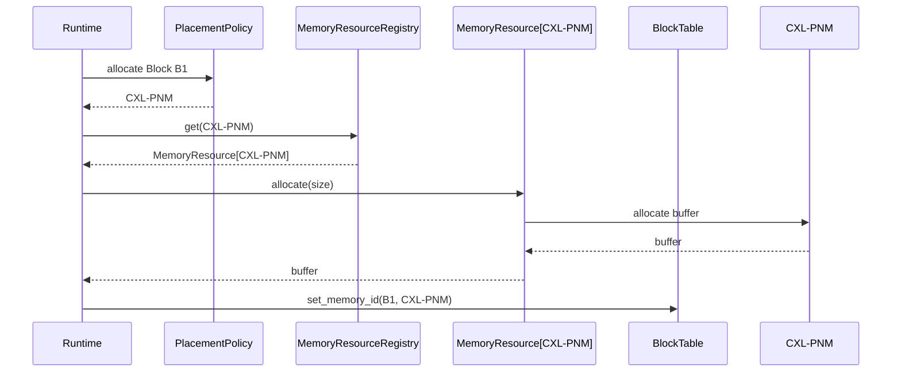
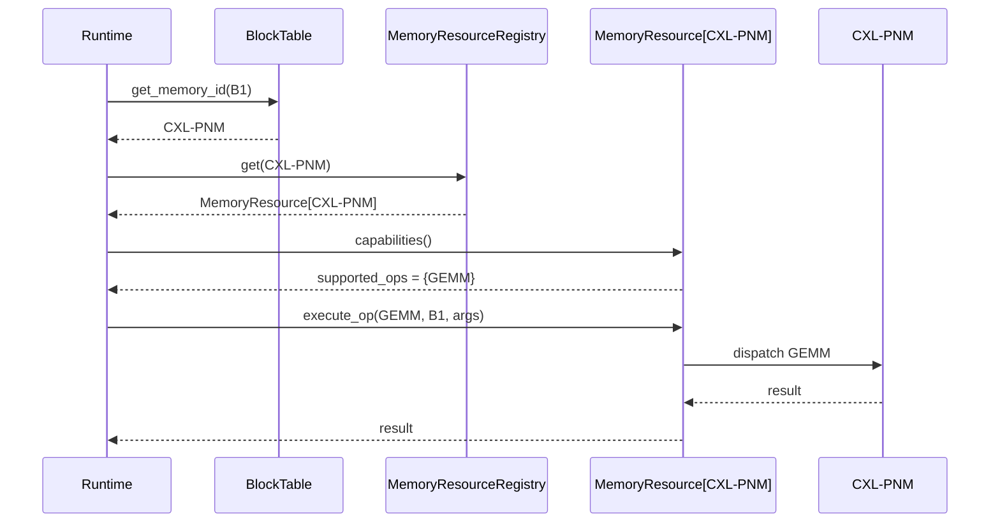
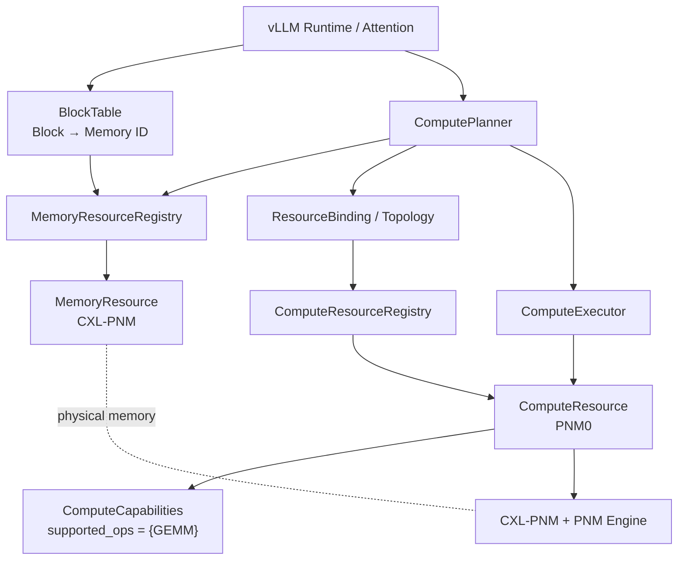
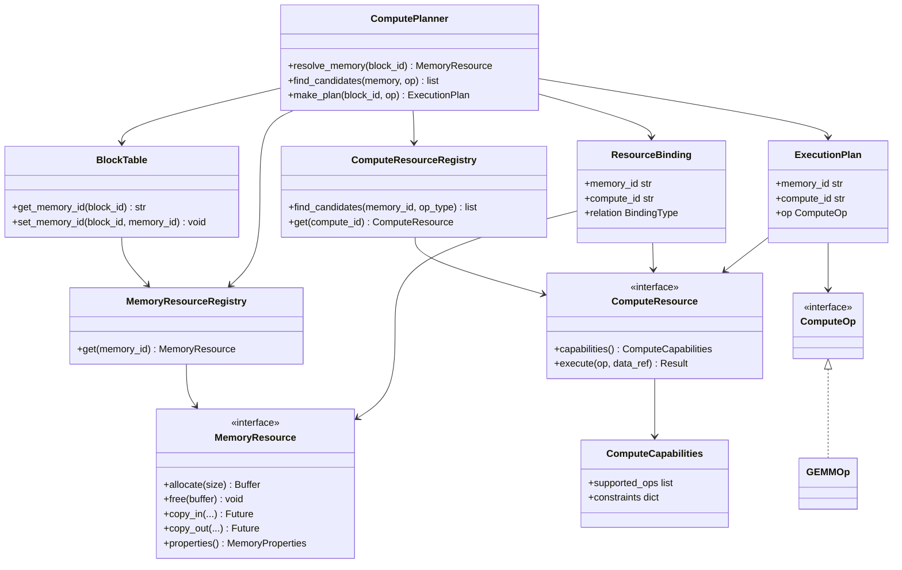
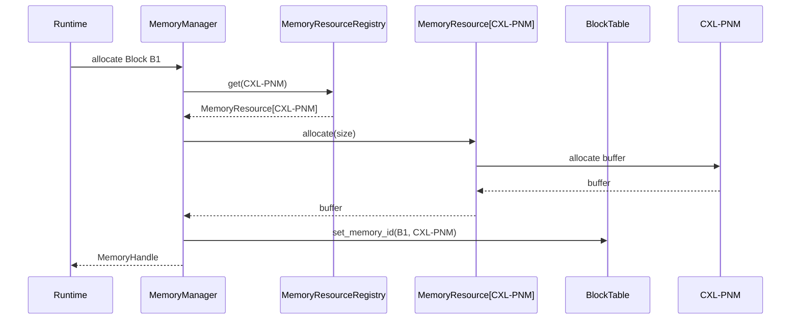
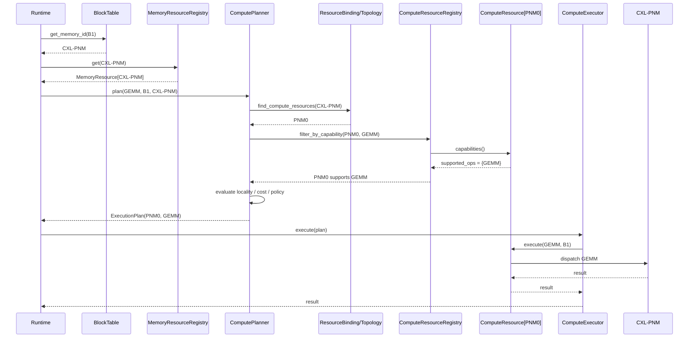

# Compute-Capable Memory Abstraction — DP2 후보 구조 설계

> 선행 문서: `doc-mk/vllm-memory-abstraction-level-candidates.md` (DP1 Memory Tiering Abstraction)
>
> DP2 설계 질문: **연산 요청 시 Runtime이 Data Location을 인지하고, 해당 위치에서 사용 가능한 Compute capability를 어떻게 찾아 실행할 것인가?**

---

## 0. Design Question

DP2는 단순히 `ComputeOp` API를 추가하는 문제가 아니다. Runtime은 연산 요청 시 다음을 알아야 한다.

1. 어떤 Block이 대상인가?
2. 해당 Block은 현재 어느 `MemoryResource`에 있는가?
3. 해당 위치에서 어떤 Compute capability를 사용할 수 있는가?
4. Memory-side Compute를 사용할 것인지 다른 Compute backend를 사용할 것인가?
5. 선택된 Compute path를 어떻게 dispatch할 것인가?

두 후보의 핵심 차이는 **Data Location과 Compute Capability의 binding을 어디에 둘 것인가**이다.

---

# 1. Candidate Overview

## Candidate 1 — Memory-Coupled / Capability-Aware MemoryResource

> **MemoryResource가 해당 Memory의 Compute capability와 execution path까지 함께 소유하여, Data Locality 기반의 짧고 예측 가능한 Compute dispatch를 제공하는 구조.**

```text
Block
  ↓
BlockTable: Memory ID
  ↓
MemoryResource
  ├── memory operations
  ├── supported_ops
  └── execute_op()
```

Location → Capability → Execution 관계가 `MemoryResource` 내부에서 닫힌다.

## Candidate 2 — Decoupled Memory / Compute

> **MemoryResource와 ComputeResource를 분리하고 Runtime이 topology/binding과 capability를 기반으로 적절한 Compute Resource를 선택하는 구조.**

```text
Block
  ↓
MemoryResource
  ↓
Topology / Resource Binding
  ↓
ComputeResource candidates
  ↓
Planner
  ↓
Execute
```

Location과 Compute capability의 관계는 Runtime-level binding layer가 관리한다.

### 핵심 비교

| | Candidate 1 | Candidate 2 |
|---|---|---|
| Binding owner | MemoryResource | Runtime Binding / Topology |
| 기본 철학 | Locality-first | Resource-selection-first |
| 강점 | Low overhead / predictability | Flexibility / resource utilization |
| 대가 | Compute 선택 자유도 감소 | Planning/control overhead 증가 |

---

# 2. Common Example — CXL-PNM + GEMM

두 후보 모두 동일한 논리적 동작을 수행한다.

```text
Allocation
  ↓
Block → CXL-PNM MemoryResource 기록
  ↓
Compute Request: GEMM(Block)
  ↓
Block Location 확인
  ↓
CXL-PNM에서 GEMM capability 확인
  ↓
Memory-side GEMM 사용 여부 결정
  ↓
Execution
```

차이는 **CXL-PNM과 GEMM-capable Compute를 어떻게 연결해서 알고 있는가**이다.

---

# 3. Candidate 1 — Memory-Coupled

## 3.1 SW Structure / Module View



## 3.2 Class Diagram



## 3.3 Detailed Operation

### A. Allocation

```text
Runtime
  ↓ allocate(B1)
PlacementPolicy
  ↓ CXL-PNM
MemoryResourceRegistry
  ↓
MemoryResource[CXL-PNM].allocate()
  ↓
CXL-PNM Memory
  ↓
BlockTable[B1] = CXL-PNM
```

### B. Compute

```text
GEMM(B1)
  ↓
BlockTable.get_memory_id(B1)
  ↓
CXL-PNM
  ↓
MemoryResourceRegistry.get(CXL-PNM)
  ↓
MemoryResource.capabilities()
  ↓
GEMM supported?
  ├─ YES → MemoryResource.execute_op(GEMM)
  └─ NO  → fallback Compute
```

**핵심:** `CXL-PNM → GEMM capability → execution`의 관계가 MemoryResource 내부에 존재한다.

## 3.4 Sequence Diagram — Allocation



## 3.5 Sequence Diagram — Compute



---

# 4. Candidate 2 — Decoupled Memory / Compute

## 4.1 SW Structure / Module View



### Candidate 2의 연결고리

`ComputeResourceRegistry`가 `CXL-PNM`을 보고 `PNM0`을 추론하는 것이 아니다. **초기화/discovery 단계에서 HW topology를 기반으로 binding을 등록한다.**

```text
Device Discovery / Driver
        │
        ├── register MemoryResource(CXL-PNM)
        ├── register ComputeResource(PNM0)
        │              └── supported_ops = {GEMM}
        │
        └── register Binding
                CXL-PNM ─────→ PNM0
```

Runtime 실행 시에는:

```text
Block B1
  ↓
MemoryResource = CXL-PNM
  ↓
ResourceBinding / Topology
  ↓
Candidate ComputeResource = PNM0
  ↓
PNM0.capabilities()
  ↓
GEMM supported?
  ↓
ComputePlanner
  ↓
PNM0.execute(GEMM)
```

따라서 Candidate 2의 핵심 abstraction은 **MemoryResource + ComputeResource + ResourceBinding/Topology**이다.

## 4.2 Class Diagram



## 4.3 Detailed Operation

### A. Initialization / Binding Registration

```text
Device Discovery
  ↓
MemoryResource[CXL-PNM] 등록
  ↓
ComputeResource[PNM0] 등록
  ↓
PNM0.supported_ops = {GEMM}
  ↓
ResourceBinding 등록
CXL-PNM → PNM0
```

### B. Allocation

```text
Runtime
  ↓ allocate(B1)
PlacementPolicy
  ↓ CXL-PNM
MemoryResourceRegistry
  ↓
MemoryResource[CXL-PNM].allocate()
  ↓
BlockTable[B1] = CXL-PNM
```

Allocation 자체는 Candidate 1과 유사하다. DP2의 핵심 trade-off는 **compute binding/selection path**에 있다.

### C. Compute

```text
GEMM(B1)
  ↓
BlockTable
  ↓
MemoryResource = CXL-PNM
  ↓
ResourceBinding.lookup(CXL-PNM)
  ↓
{PNM0, ...}
  ↓
ComputeResourceRegistry
  ↓
capability filtering: GEMM
  ↓
ComputePlanner
  ↓
PNM0
  ↓
execute(GEMM)
```

## 4.4 Sequence Diagram — Allocation



## 4.5 Sequence Diagram — Compute: CXL-PNM + GEMM



---

# 5. QA Evaluation — 3 Point Scale

> 별점은 동일 HW/workload에서 구조적 특성을 비교하기 위한 상대 평가이다. 실제 성능 수치를 의미하지 않는다.

| QA | Candidate 1 | Candidate 2 | 핵심 Trade-off |
|---|:---:|:---:|---|
| **Runtime Compute Efficiency** | ★★★ | ★★☆ | 짧은 dispatch path ↔ 추가 binding/planning |
| **Data Locality Exploitation** | ★★★ | ★★☆ | Memory-local capability ↔ Runtime locality planning |
| **Compute Resource Utilization** | ★★☆ | ★★★ | 고정/결합 capability ↔ 다중 resource 선택 |
| **Memory–Compute Flexibility** | ★★☆ | ★★★ | Tight coupling ↔ dynamic composition |
| **Runtime Complexity** | ★★★ | ★★☆ | 단순 execution path ↔ planning/control layer |
| **Maintainability & Extensibility** | ★★☆ | ★★★ | 통합 구조 ↔ 독립 abstraction |

---

## 5.1 Runtime Compute Efficiency

### Candidate 1 — ★★★

```text
Block → MemoryResource → Capability → execute
```

Location과 capability가 동일 abstraction에 있어 lookup/binding/planning path가 짧다.

### Candidate 2 — ★★☆

```text
Block → Memory → Binding → ComputeResource → Capability → Planner → Execute
```

추가 control path가 있지만, 그 비용으로 Compute Resource 선택 자유도를 얻는다.

**Trade-off:** Low dispatch overhead / predictability ↔ dynamic selection

---

## 5.2 Data Locality Exploitation

### Candidate 1 — ★★★

Block이 CXL-PNM에 있다는 정보가 곧 CXL-PNM의 Compute capability와 직접 연결된다. Data가 있는 위치에서 연산하는 **locality-first** 경로를 만들기 쉽다.

### Candidate 2 — ★★☆

Memory location과 Compute resource가 분리되어 있으므로 Planner가 locality를 명시적으로 고려해야 한다. 잘 설계하면 locality-aware selection이 가능하지만 추가 policy가 필요하다.

**Trade-off:** Implicit locality ↔ Explicit planning

---

## 5.3 Compute Resource Utilization

### Candidate 1 — ★★☆

MemoryResource에 capability가 결합되어 있어 기본 실행은 단순하지만, 하나의 Memory에 여러 Compute backend를 연결하고 비교하기에는 구조적 제약이 있다.

### Candidate 2 — ★★★

```text
CXL Memory
 ├── PNM0 : GEMM
 ├── PNM1 : GEMM
 └── GPU0 : GEMM
```

처럼 여러 resource를 binding하고 capability, locality, cost 등의 기준으로 선택할 수 있다.

**Trade-off:** Fixed/simple execution ↔ broader resource utilization

---

## 5.4 Memory–Compute Flexibility

### Candidate 1 — ★★☆

Memory와 Compute capability가 하나의 Resource abstraction에 결합되어 PNM/PIM처럼 강결합 HW에는 자연스럽지만, 다양한 Memory–Compute 조합을 표현할수록 coupling이 증가한다.

### Candidate 2 — ★★★

Memory와 Compute를 독립적으로 정의하고 Binding을 통해 관계를 구성할 수 있다.

```text
CXL-PNM → PNM0
```

에서

```text
CXL-PNM → {PNM0, PNM1}
```

로 확장하기 쉽다.

**Trade-off:** Tight coupling ↔ flexible composition

---

## 5.5 Runtime Complexity

### Candidate 1 — ★★★

별도의 topology lookup과 candidate planning 없이 MemoryResource 내부에서 capability 확인 후 실행할 수 있다.

### Candidate 2 — ★★☆

Binding lookup, capability filtering, candidate selection, planning layer가 추가된다.

**Trade-off:** Simple control path ↔ richer runtime decision

---

## 5.6 Maintainability & Extensibility

### Candidate 1 — ★★☆

초기 구조는 단순하지만 MemoryResource가 memory operation뿐 아니라 capability와 execution까지 책임진다. Compute backend가 다양해질수록 책임이 증가할 수 있다.

### Candidate 2 — ★★★

MemoryResource와 ComputeResource를 독립적으로 확장할 수 있으며, 새로운 ComputeResource는 capability 등록과 topology binding을 추가하는 방식으로 통합할 수 있다.

**Trade-off:** Integrated simplicity ↔ independent extensibility

---

# 6. Candidate Strengths / Weaknesses

## Candidate 1 — Memory-Coupled

### 장점

- 가장 짧은 Compute dispatch path
- 낮은 runtime control overhead
- Data Locality를 자연스럽게 활용
- 실행 경로가 예측 가능
- CXL-PNM/PIM처럼 Memory와 Compute가 강하게 결합된 HW에 적합
- 초기 구현 복잡도가 낮음

### 단점

- MemoryResource와 Compute capability coupling 증가
- 하나의 Memory에 여러 Compute backend를 연결/선택하기 어려움
- 새로운 Compute capability가 증가하면 MemoryResource 책임도 증가
- Dynamic Compute selection에 제한

## Candidate 2 — Decoupled

### 장점

- Memory와 Compute abstraction 독립
- 하나의 Memory에 여러 ComputeResource binding 가능
- capability/locality/cost 기반 Dynamic selection 가능
- PNM/PIM/GPU/NPU 등 다양한 backend 확장에 유리
- HW topology를 명시적으로 모델링 가능

### 단점

- ResourceBinding/Topology 관리 필요
- capability lookup path 증가
- candidate filtering/planning overhead 가능
- Runtime 구조 및 debugging path 복잡
- 실제 HW topology와 Runtime metadata의 일관성 관리 필요

---

# 7. Overall Trade-off

```text
Candidate 1                              Candidate 2
Memory-Coupled                           Decoupled
     │                                        │
     ▼                                        ▼
Locality / Simplicity                 Flexibility / Resource Choice
     │                                        │
     ▼                                        ▼
Low Overhead / Predictability          Dynamic Planning / Extensibility
```

### 핵심 Trade-off

> **Data Locality + Low Runtime Overhead + Predictability ↔ Compute Resource Utilization + Flexibility + Extensibility**

따라서 Candidate 1이 Candidate 2의 단순한 하위 구조가 아니다. **Compute Resource가 Memory와 강하게 결합된 HW에서는 Candidate 1의 단순성과 locality가 실제 설계상의 장점**이 될 수 있으며, 반대로 Compute Resource가 다양하고 동적으로 선택되어야 하는 시스템에서는 Candidate 2가 유리하다.

---

# 8. One-line Comparison

> **Candidate 1은 Memory에 Compute capability를 결합해 Data Locality 기반의 빠르고 예측 가능한 실행을 제공하고, Candidate 2는 Memory와 Compute를 분리해 Runtime이 다양한 Compute Resource를 선택·조합할 수 있도록 한다.**

---

# 9. Evaluation Notes

- 별점은 절대적인 성능 수치가 아닌 **구조적 상대 평가**이다.
- 실제 `Runtime Compute Efficiency` 차이는 capability lookup, binding lookup, planning, dispatch latency를 동일 HW에서 측정해야 한다.
- Candidate 2가 모든 workload에서 우수하다는 의미가 아니다. 다중 Compute Resource가 실제로 존재하고 선택 가치가 있을 때 Candidate 2의 flexibility가 의미를 가진다.
- Candidate 1은 CXL-PNM/PIM과 같이 **Memory와 Compute의 물리적/기능적 결합이 강하고, 해당 Memory-local Compute가 주된 execution path인 경우** 특히 경쟁력이 있다.
