# vLLM Cost-Model-Based Prefill Placement — Architecture Design

> 기준 브랜치: `claude/vllm-call-path-analysis-qxulkr`  
> 기준 코드 분석: `doc-mk/vllm-call-path-analysis.md` 및 `doc-mk/vllm-*.md` 중 DP 문서 제외  
> 설계 범위: **Prefill 실행 위치를 cost model로 선택하고, 선택 결과를 실제 execution resource까지 전달·실행하는 runtime 구조**
>
> 이 문서는 후보 구조 비교가 아니라, **cost-model-based prefill placement를 vLLM V1에 실제로 넣는다면 어떤 layer/module/component 경계를 가져야 하는지**를 정의한다.

---

## 0. 현재 vLLM에서 삽입해야 할 위치

현재 V1의 핵심 요청 실행 경로는 다음과 같다.

```text
EngineCore.step()
    │
    ├─ Scheduler.schedule()
    │      └─ SchedulerOutput
    │
    ├─ Executor.execute_model(SchedulerOutput)
    │
    └─ Scheduler.update_from_output()
             │
             ▼
Worker.execute_model()
    │
    ▼
GPUModelRunner.execute_model()
    │
    ▼
model.forward()
```

현재 `Scheduler`는 **어떤 request가 이번 step에서 몇 token을 실행할지**를 결정하지만,
"그 prefill을 어느 compute-memory resource에서 실행할지"를 별도 1급 개념으로 결정하지 않는다.
또한 `MultiprocExecutor`의 worker들은 기본적으로 TP/PP execution group으로 동작하며,
`SchedulerOutput`을 받아 정해진 device에서 실행한다.

따라서 cost-model placement를 넣으려면 단순히 `Scheduler.schedule()` 안에
`argmin(cost)` 한 줄을 추가하는 것으로 끝나지 않는다. 최소한 다음 네 책임을 분리해야 한다.

1. **Candidate Discovery** — 이 request의 prefill을 실행할 수 있는 resource 조합은 무엇인가?
2. **Cost Estimation** — 각 candidate에서 실행했을 때 end-to-end cost는 얼마인가?
3. **Placement Decision** — feasible candidate 중 어떤 execution placement를 선택할 것인가?
4. **Execution Routing** — 결정된 placement를 실제 Worker/Compute Resource에 어떻게 전달할 것인가?

핵심 원칙은 다음과 같다.

> **Scheduler는 "언제/얼마나 실행할지"를 결정하고, Prefill Placement 계층은 "어디서 실행할지"를 결정한다. Cost Model은 실행 위치를 직접 dispatch하지 않는다.**

---

# 1. Architectural Drivers

## 1.1 Functional Requirements

Cost model은 최소한 다음 입력을 사용할 수 있어야 한다.

- Request/workload
  - prefill token 수
  - chunked-prefill 크기
  - batch composition
  - model / layer / dtype
  - prefix-cache hit 및 이미 존재하는 KV 위치
- Compute resource
  - compute capability / throughput
  - 현재 utilization
  - queue depth
  - 지원 operation
- Memory resource
  - capacity / free space
  - bandwidth / latency
  - 현재 pressure
  - data/KV residency
- Topology / movement
  - source ↔ target bandwidth
  - transfer latency
  - direct/staged path
- Runtime interference
  - 현재 decode load
  - competing prefill
  - shared memory/fabric contention

출력은 단순한 `device_id`가 아니라 다음과 같은 **ExecutionPlacement**여야 한다.

```text
ExecutionPlacement
 ├─ compute_resource_id
 ├─ memory_resource_id
 ├─ execution_group_id
 ├─ required_data_moves
 ├─ estimated_cost
 └─ decision_metadata
```

즉 "GPU 1에서 실행"이 아니라 **Compute + Memory + Data Movement를 포함한 실행 계획**이다.

## 1.2 Quality Attributes

- **Hot-path overhead 제한**: 매 scheduling step에서 호출될 수 있으므로 cost evaluation은 bounded 해야 한다.
- **Extensibility**: GPU/HBM 외 HBF, CXL-attached accelerator, PNM 등 추가 시 Scheduler 수정 최소화.
- **Explainability**: placement 결과와 cost breakdown을 기록할 수 있어야 한다.
- **Fallback safety**: cost model 실패/telemetry stale/candidate 없음 시 기존 GPU execution으로 복귀.
- **Separation of concerns**: scheduling, prediction, topology, dispatch 책임을 한 class에 몰지 않는다.
- **Execution consistency**: estimator가 평가한 candidate와 dispatcher가 실제 실행하는 resource가 동일해야 한다.

---

# 2. Layered Architecture

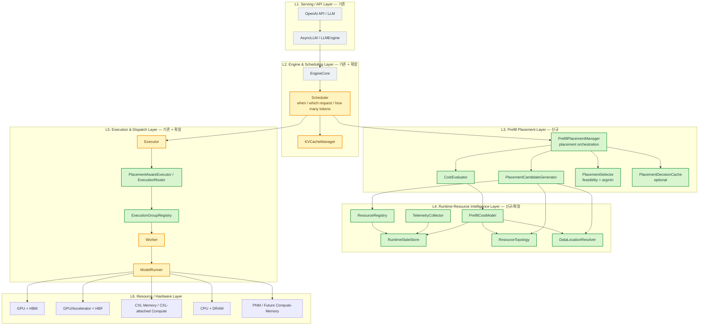

### Layer 책임

| Layer | 책임 | placement 관점 |
|---|---|---|
| Serving/API | request ingress/egress | placement를 모름 |
| Engine/Scheduling | continuous batching, token budget, KV allocation | **placement 요청을 생성하고 결과를 SchedulerOutput에 반영** |
| Prefill Placement | 후보 생성 → 비용 평가 → 선택 | **의사결정의 중심** |
| Resource Intelligence | resource/data/topology/runtime state를 표준화 | cost model에 raw HW 지식이 새지 않게 함 |
| Execution/Dispatch | placement를 실제 execution group으로 routing | **결정을 실행으로 변환** |
| Hardware | 실제 compute/memory | 플러그인/adapter 뒤에 숨김 |

---

# 3. Module View

기존 vLLM package 구조를 최대한 유지하면서 신규 모듈을 `vllm/v1/placement/`에 모은다.

```text
vllm/
└── v1/
    ├── engine/
    │   └── core.py                         # existing
    │
    ├── core/
    │   ├── sched/
    │   │   ├── scheduler.py                # modified
    │   │   └── output.py / interface.py    # modified: placement metadata
    │   │
    │   └── kv_cache_manager.py             # modified only if placement affects KV allocation
    │
    ├── placement/                          # NEW
    │   ├── manager.py                      # PrefillPlacementManager
    │   ├── candidate.py                    # CandidateGenerator / PlacementCandidate
    │   ├── selector.py                     # PlacementSelector
    │   ├── cost/
    │   │   ├── base.py                     # PrefillCostModel interface
    │   │   ├── model.py                    # concrete cost model
    │   │   └── evaluator.py                # batch evaluation + cost breakdown
    │   ├── resource/
    │   │   ├── registry.py                 # ResourceRegistry
    │   │   ├── topology.py                 # ResourceTopology
    │   │   ├── state.py                    # RuntimeStateStore / snapshots
    │   │   └── telemetry.py                # TelemetryCollector
    │   ├── data/
    │   │   └── location.py                 # DataLocationResolver
    │   └── types.py                        # ExecutionPlacement etc.
    │
    ├── executor/
    │   ├── abstract.py                     # modified
    │   ├── multiproc_executor.py           # modified
    │   └── placement_router.py             # NEW
    │
    └── worker/
        ├── gpu_worker.py                    # modified
        └── gpu_model_runner.py              # modified/adapter
```

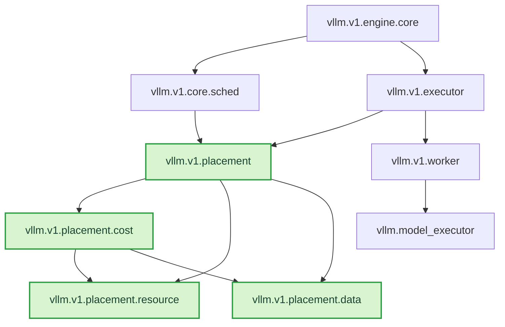

### 의존성 규칙

1. `Scheduler`는 구체적인 cost-model 구현을 import하지 않는다. `PrefillPlacementManager`만 호출한다.
2. `PrefillCostModel`은 Worker/Executor를 호출하지 않는다. **pure estimation** 역할만 가진다.
3. `Executor`는 cost를 다시 계산하지 않는다. `ExecutionPlacement`를 소비한다.
4. Telemetry producer와 decision consumer 사이에는 `RuntimeStateSnapshot`을 둔다.
5. Hardware-specific adapter는 `ResourceRegistry` 또는 Worker 쪽에 위치시키고 Scheduler까지 노출하지 않는다.

---

# 4. Core Domain Model / Class Diagram

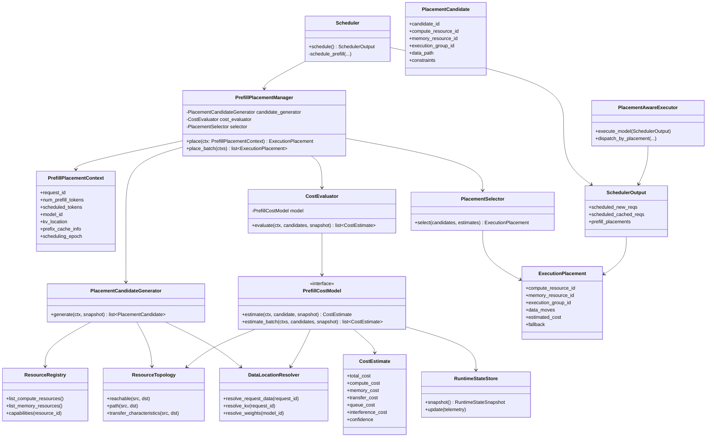

---

# 5. Cost Model Boundary

Cost model이 모든 책임을 먹는 "god object"가 되지 않도록 입력을 명확히 제한한다.

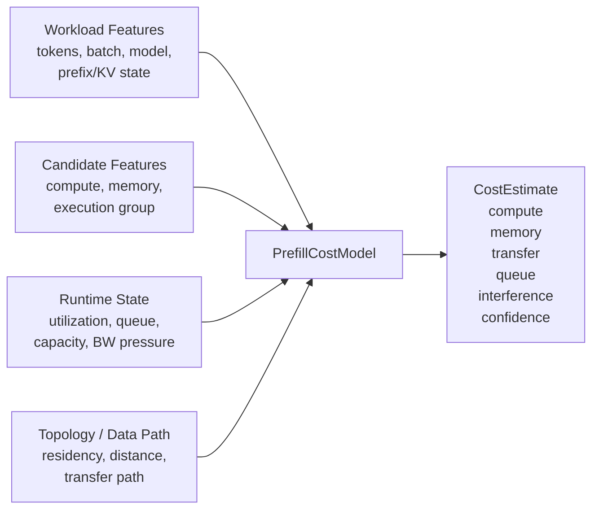

Cost model은 **후보를 만들지 않는다**. 예를 들어 어떤 accelerator가 현재 model/dtype을
지원하지 않으면 Cost Model이 `infinite cost`를 주는 방식보다
`PlacementCandidateGenerator` 단계에서 제거하는 것이 책임 분리에 맞다.

권장 평가식의 논리적 형태는 다음과 같다.

```text
TotalCost(candidate)
    = ComputeCost
    + MemoryAccessCost
    + RequiredDataMovementCost
    + QueueingCost
    + InterferenceCost
    + Penalty / Risk
```

실제 구현은 analytical / learned / hybrid 중 무엇이든 `PrefillCostModel` 뒤에서 교체 가능하다.
아키텍처는 cost model의 내부 알고리즘에 의존하지 않는다.

---

# 6. Scheduler Integration View

## 6.1 기존 Scheduler와의 경계

placement는 **request admission 이전**도 아니고 **model.forward 직전**도 아니다.
가장 자연스러운 지점은 Scheduler가 이번 step의 token budget과 prefill 대상 request를
확정한 뒤, 최종 `SchedulerOutput`을 만들기 전이다.

이유는 cost estimation에 실제 `num_scheduled_tokens`, batch composition,
chunked-prefill 여부가 필요하기 때문이다.

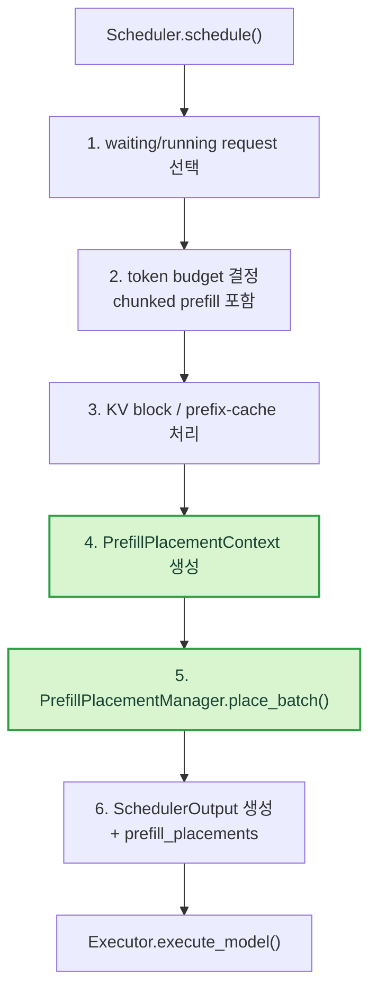

단, placement가 KV allocation 위치 자체를 결정하는 시스템이라면 3번과 5번은
상호 의존한다. 그 경우에는 `KVCacheManager`가 먼저 특정 tier에 allocation을
확정하지 말고 **KV requirement**만 계산한 뒤, placement 결과의
`memory_resource_id`에 따라 allocation을 commit하는 2-phase 구조가 필요하다.

```text
KV requirement calculation
        ↓
placement decision
        ↓
KV allocation commit on selected memory
```

---

# 7. Component View — Runtime Process Boundary

현재 기본 vLLM 배포 구조(API Server / EngineCore / Worker)를 유지하되,
**placement decision은 EngineCore**, **telemetry production과 execution은 Worker**에 둔다.

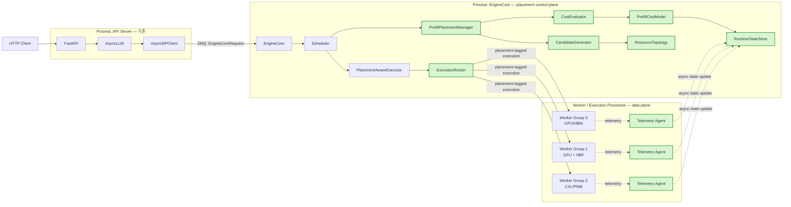

### 왜 Cost Model을 Worker에 두지 않는가?

placement는 여러 resource candidate를 **동시에 비교**해야 한다. 각 Worker 내부에 cost
model을 두면 자신의 local state는 잘 알 수 있지만 전역 후보 비교를 위해 별도 협상/집계가
필요하다. vLLM의 현재 구조에서 scheduling authority가 EngineCore의 `Scheduler`에 있으므로,
placement decision도 EngineCore control plane에 두고 Worker는 telemetry producer +
execution endpoint로 유지하는 것이 현재 call path와 가장 잘 맞는다.

---

# 8. Execution Routing View

Cost model이 placement를 선택해도 현재 `MultiprocExecutor`가 모든 placement를 자동으로
실행할 수 있는 것은 아니다. 기존 worker group은 TP/PP rank의 실행 집합이다.

따라서 heterogeneous execution을 지원하려면 **ExecutionGroup**을 1급 개념으로 둔다.

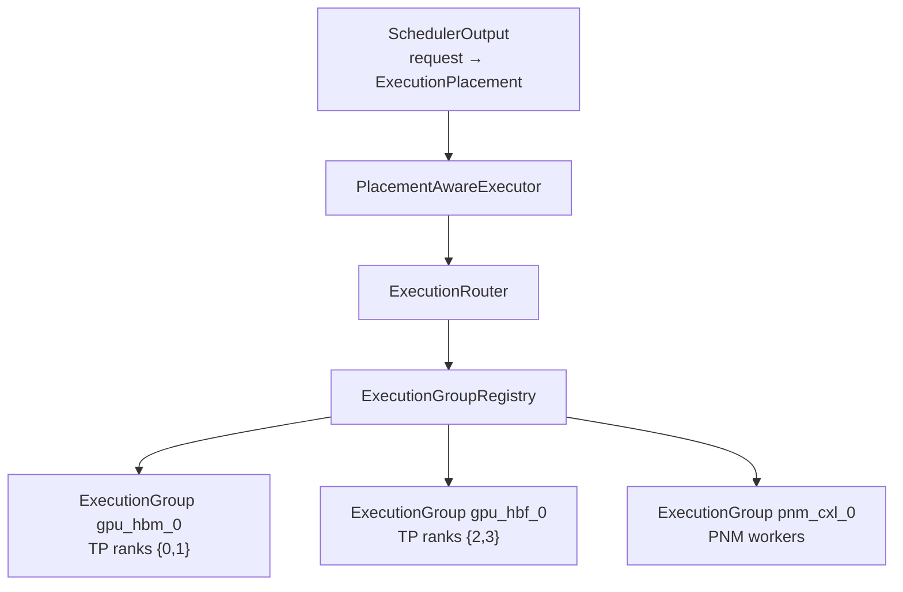

`ExecutionGroup`은 최소한 다음을 가진다.

```text
ExecutionGroup
 ├─ group_id
 ├─ worker_ids
 ├─ compute_resource_ids
 ├─ visible_memory_resources
 ├─ model_replica / shard mapping
 ├─ supported_model_config
 └─ dispatch_endpoint
```

### 중요한 제약

Prefill을 다른 execution group으로 보낼 수 있으려면 해당 group이 **동일 model weights를
실행할 수 있어야 한다**. 따라서 candidate generation은 단순 HW capability뿐 아니라
model replica/shard availability를 반드시 검사해야 한다.

```text
HW can execute?
      AND
model weights available?
      AND
required input/KV reachable?
      AND
target KV memory allocatable?
      ↓
feasible PlacementCandidate
```

---

# 9. Main Sequence Diagram — Cost-Based Prefill Placement

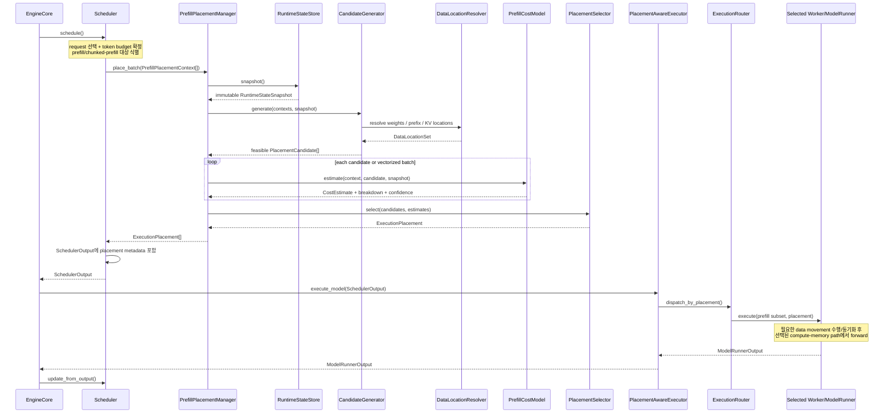

---

# 10. Sequence Diagram — Data Movement가 필요한 Candidate

예: prompt/prefix KV는 HBM0에 있으나 cost model이 다른 compute-memory resource를 선택한 경우.

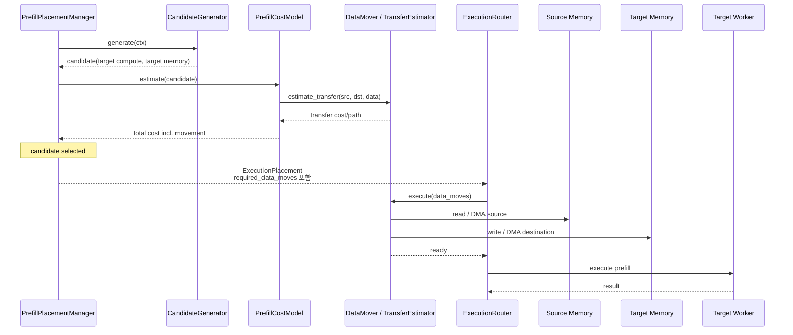

**원칙:** transfer cost의 "견적"과 실제 transfer path는 동일한 topology/data-movement
provider를 사용해야 한다. 그렇지 않으면 cost model이 평가한 경로와 실행 경로가 달라진다.

---

# 11. Telemetry / State Update Sequence

Telemetry 수집을 scheduling hot path에서 synchronous RPC로 하면 placement 자체가 병목이 된다.
따라서 Worker → StateStore는 비동기 push, decision은 immutable snapshot read 방식으로 둔다.

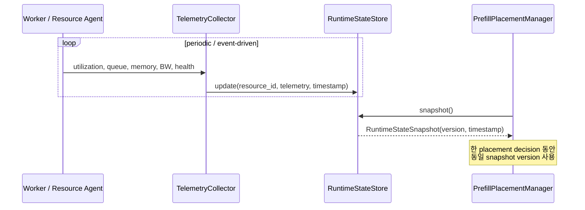

필수 필드는 `timestamp`와 `freshness`다. stale telemetry는 cost model이 높은
uncertainty/penalty로 처리하거나 candidate를 제거할 수 있다.

---

# 12. Deployment View

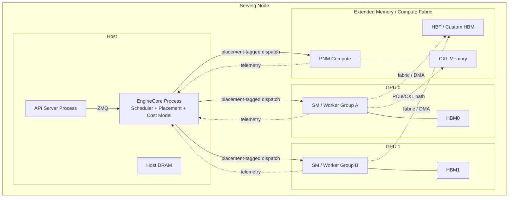

---

# 13. Failure / Fallback Path

Cost-model placement가 serving availability를 깨면 안 된다.

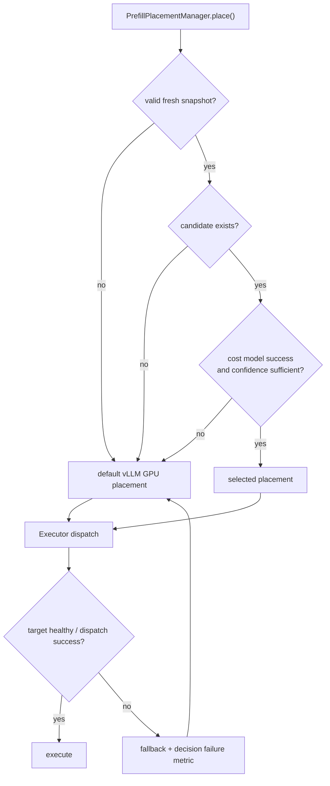

Fallback은 별도 heuristic placement를 의미하지 않는다. **기존 vLLM execution path를
안전 경로로 보존**한다는 의미다.

---

# 14. Observability View

Cost model 기반 시스템은 "왜 그 위치를 골랐는가"를 재현할 수 있어야 한다.

각 decision에 다음 record를 남긴다.

```text
PlacementDecisionRecord
 ├─ request_id
 ├─ scheduling_epoch
 ├─ state_snapshot_version
 ├─ candidate_ids[]
 ├─ candidate_costs[]
 │    ├─ compute
 │    ├─ memory
 │    ├─ transfer
 │    ├─ queue
 │    └─ interference
 ├─ selected_candidate
 ├─ confidence
 ├─ actual_execution_group
 ├─ actual_prefill_latency
 └─ fallback_reason
```

이를 이용하면 offline에서 다음을 계산할 수 있다.

- predicted vs actual prefill latency
- candidate별 prediction error
- placement switch frequency
- decision overhead
- transfer overhead
- stale-state decision 비율
- fallback 비율

---

# 15. 기존 vLLM 코드 기준 변경 지점

| 현재 파일/영역 | 변경 | 이유 |
|---|---|---|
| `vllm/v1/core/sched/scheduler.py` | 수정 | prefill context 생성 및 placement manager 호출 |
| `SchedulerOutput` 관련 type | 수정 | request별 `ExecutionPlacement` 전달 |
| `vllm/v1/engine/core.py` | 소폭 수정 | placement subsystem lifecycle/init, telemetry wiring |
| `vllm/v1/executor/abstract.py` | interface 확장 | placement-aware dispatch contract |
| `vllm/v1/executor/multiproc_executor.py` | 수정 | 단일 broadcast 외 execution-group routing 지원 |
| `vllm/v1/worker/gpu_worker.py` | 수정 | placement metadata 소비, telemetry publish |
| `vllm/v1/worker/gpu_model_runner.py` | 최소 수정/adapter | 선택된 memory/compute path 실행 |
| `vllm/v1/placement/*` | 신규 | placement/cost/resource intelligence 책임 |
| KV cache 관련 manager | 조건부 수정 | placement가 KV allocation tier까지 결정할 경우 |

---

# 16. 구현 단계 제안

처음부터 모든 heterogeneous resource를 붙이지 않고 architecture boundary를 유지한 채 단계적으로 구현한다.

### Phase 1 — Decision path만 삽입

- `PrefillPlacementManager`, `PrefillCostModel`, `ExecutionPlacement` 추가
- candidate는 기존 GPU execution group들만 사용
- SchedulerOutput에 placement metadata 추가
- predicted/actual latency logging
- 기존 execution path와 기능 동등성 확인

### Phase 2 — Placement-aware Executor

- `ExecutionGroupRegistry`와 `ExecutionRouter` 추가
- 여러 GPU/model replica 사이 prefill routing
- Worker telemetry → `RuntimeStateStore`
- queue/utilization을 cost에 반영

### Phase 3 — Heterogeneous Memory/Compute

- `ResourceTopology`, `DataLocationResolver`, DataMover 연계
- HBF/CXL/PNM candidate 등록
- transfer cost + data residency 포함
- placement 결과에 따른 KV allocation/movement 연동

이 순서를 따르면 cost model 자체와 heterogeneous hardware enablement를 분리해서 검증할 수 있다.

---

# 17. 최종 Architecture Summary

```text
                    ┌──────────────────────────────┐
                    │          Scheduler           │
                    │  Who / When / How many token │
                    └──────────────┬───────────────┘
                                   │ PrefillPlacementContext
                                   ▼
                    ┌──────────────────────────────┐
                    │  PrefillPlacementManager     │
                    └───────┬─────────┬────────────┘
                            │         │
                  candidates│         │cost
                            ▼         ▼
                 ┌──────────────┐  ┌──────────────┐
                 │ Candidate    │  │ Cost         │
                 │ Generator    │  │ Evaluator    │
                 └──────┬───────┘  └──────┬───────┘
                        │                 │
          ┌─────────────┼─────────────┐   │
          ▼             ▼             ▼   ▼
      Resource       Topology       Data  Runtime
      Registry                        Location State
          └─────────────┬─────────────┘
                        ▼
                 ┌──────────────┐
                 │ Placement    │
                 │ Selector     │
                 └──────┬───────┘
                        │ ExecutionPlacement
                        ▼
                 ┌──────────────┐
                 │ Scheduler    │
                 │ Output       │
                 └──────┬───────┘
                        ▼
                 ┌──────────────┐
                 │ Placement-   │
                 │ Aware        │
                 │ Executor     │
                 └──────┬───────┘
                        ▼
                 ┌──────────────┐
                 │ Execution    │
                 │ Router       │
                 └───┬────┬─────┘
                     │    │
              ┌──────┘    └────────┐
              ▼                    ▼
         GPU/HBM Worker       Heterogeneous
                              Compute-Memory
```

가장 중요한 경계는 다음 세 문장으로 정리된다.

1. **Scheduler owns scheduling; PlacementManager owns placement.**
2. **CostModel estimates; it does not select or execute.**
3. **Executor executes the selected placement; it does not reinterpret the decision.**

이렇게 분리해야 cost model을 교체하거나 resource 종류가 늘어나도 기존 vLLM scheduling
hot path와 execution implementation의 결합이 커지지 않는다.

---

# 18. 참고한 기존 분석 문서

본 설계는 해당 브랜치의 다음 비-DP 문서에서 정리된 현재 V1 구조와 메모리/compute 추상화 분석을 기준으로 작성했다.

- `doc-mk/vllm-call-path-analysis.md`
- `doc-mk/vllm-compute-capable-memory-candidates.md`
- `doc-mk/vllm-kv-cache-analysis.md`
- `doc-mk/vllm-kv-cache-memory-abstraction-layer.md`
- `doc-mk/vllm-kv-cache-memory-tiering.md`
- `doc-mk/vllm-memory-abstraction-capability-oriented.md`
- `doc-mk/vllm-memory-abstraction-level-candidates.md`
- `doc-mk/vllm-memory-access-timing-candidates.md`
- `doc-mk/vllm-memory-coordination-locus-candidates.md`
