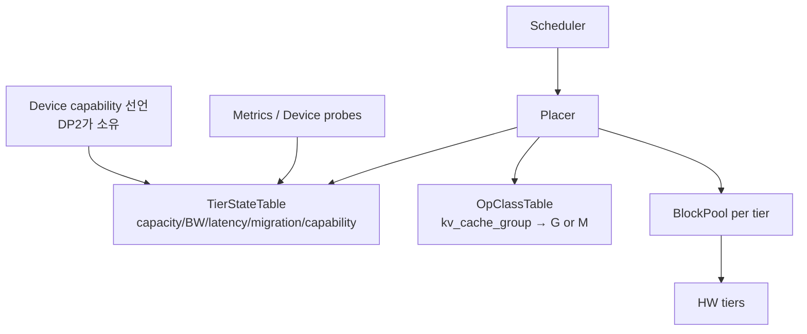
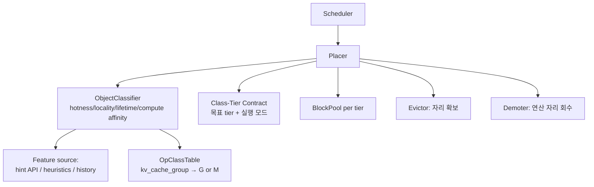
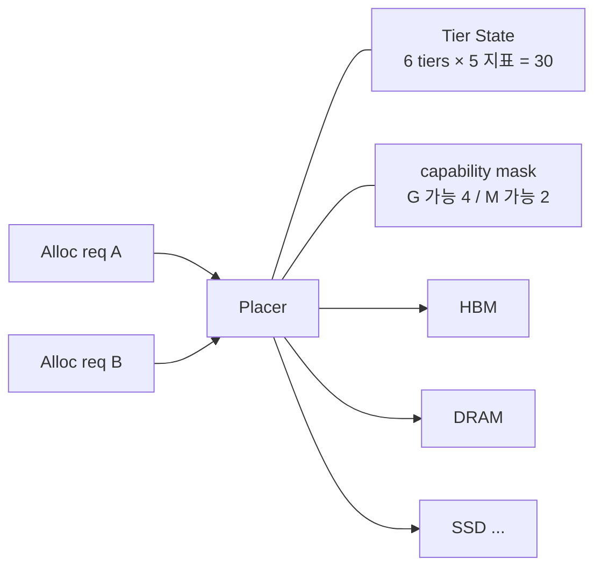
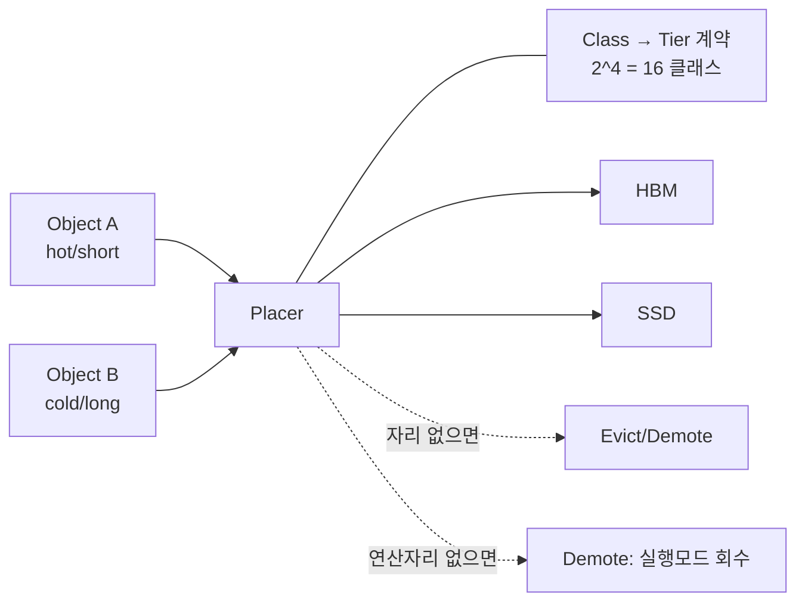
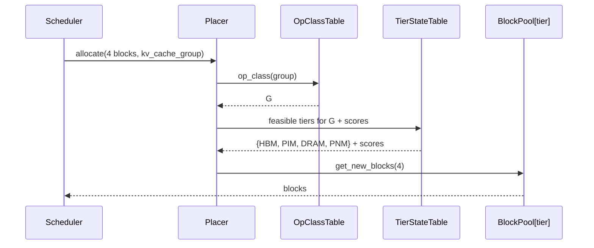
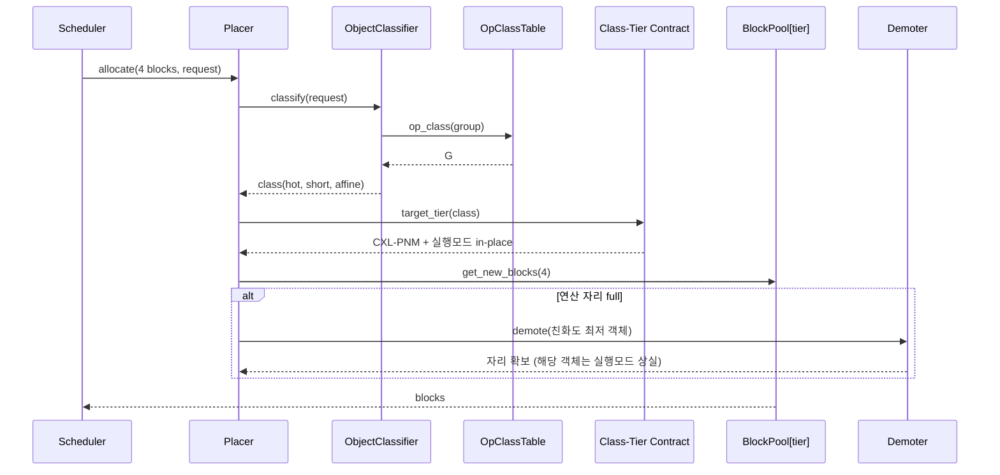
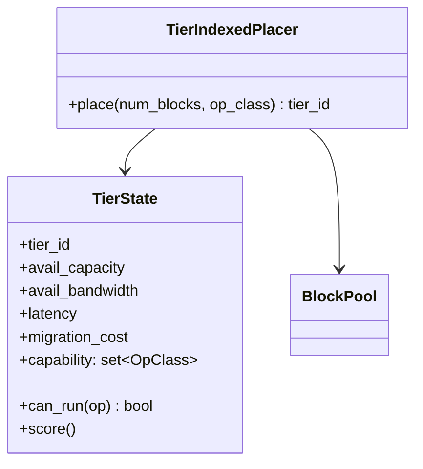
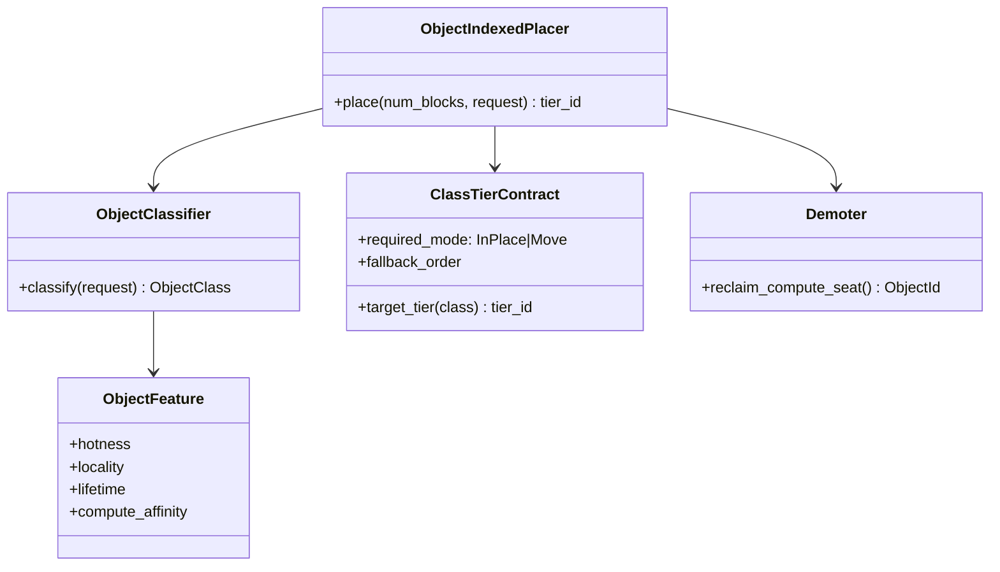

# DP1 — Memory Placement Decision Basis (메모리 배치 결정 기준)

> **설계 질문: 스케줄러가 "얼마나"만 요구하고 런타임이 "어디에"를 정하는 구조에서, 그 배치 결정의 단일 기준을 무엇에 매달 것인가?**
>
> 여기서 "어디에"는 용량·대역폭만이 아니라 **그 자리에서 어떤 연산이 가능한가**까지 포함한다.
>
> 대상 스택: Engine/Scheduler 레이어의 KV cache 할당 경계 — `Scheduler.schedule()` → `KVCacheManager.allocate_slots()` → `BlockPool.get_new_blocks()`.

---

# 1. 배경과 문제 정의

## 1.1 응용 — AI 서빙의 메모리 월, 그리고 KV 캐시

LLM 서빙에서 병목은 연산이 아니라 **메모리**다. 그 사실을 가장 단적으로 보여주는 것이 KV 캐시다.

70B급 모델(GQA, 80 layer · KV head 8 · head_dim 128 · fp16) 기준으로 토큰 하나가 차지하는 KV는

```
80 layer × 8 head × 128 dim × 2 (K,V) × 2 byte  =  327,680 byte  ≈  320 KB / 토큰
```

여기서 컨텍스트 길이를 곱하면 규모가 드러난다.

| 컨텍스트 | 요청 1건의 KV | 비고 |
|---|---:|---|
| 4 K | 1.25 GB | |
| 32 K | 10 GB | |
| **128 K** | **40 GB** | **H100 80GB의 절반을 요청 하나가 쓴다** |

모델 가중치는 140 GB로 **고정**인데 KV는 컨텍스트와 동시 요청 수에 **곱으로** 늘어난다. 128K 요청 4건이면 KV만 160 GB로 가중치를 넘어선다. 컨텍스트가 길어지고 동시성이 높아질수록 **KV 캐시가 시스템의 지배적 메모리 소비자**가 된다.

## 1.2 대응 — 두 갈래의 답, 그리고 이기종 혼재

이 벽을 한 종류의 메모리로 넘을 수 없다. 업계의 대응은 **두 갈래**이고, 둘 다 같은 벽을 향한다.

**(a) 데이터를 담을 자리를 넓힌다** — 용량·대역폭·비용의 조합이 서로 다른 메모리를 쌓아 계층을 만든다.

**(b) 연산을 데이터 쪽으로 옮긴다** — 디코드 attention은 스텝마다 KV 캐시 **전체**를 읽는 memory-bound 연산이다(1.1의 320 KB/token이 매 스텝 다시 읽힌다). 그렇다면 데이터를 실행 장치로 나르는 대신 **메모리 옆에서 연산을 끝내면** 이동 자체가 사라진다. PIM(HBM-PIM 등) · PNM(CXL-PNM 등) 계열이 이 답이다.

두 갈래는 같은 시스템에 함께 들어온다. 그 결과 시스템에는 성격이 **자릿수 단위로 다른 메모리**가 혼재하고, 각 자리는 이제 두 가지로 구별된다 — **얼마나 빨리 읽히는가**, 그리고 **거기서 무엇을 실행할 수 있는가**.

KV 캐시 경로에 필요한 연산은 두 종류로 갈린다.

| op class | 내용 | 성격 |
|---|---|---|
| **G** (GEMV / Reduce) | 디코드 attention — `q·Kᵀ` 후 `Σ softmax·V` | memory-bound. PIM/PNM이 겨냥하는 바로 그 연산 |
| **M** (GEMM) | 프리필 attention, projection | compute-bound. 본격 가속기가 필요 |

| tier | 대역폭 | 용량(예시) | 지연 | 이동비용 | **연산 기능** |
|---|---:|---:|---:|---:|---|
| GPU HBM | 3,200 GB/s | 40 GB | 0.5 us | 1.0 | **G + M** (full) |
| Custom HBM (PIM) | 1,600 GB/s | 80 GB | 0.8 us | 1.2 | **G** |
| CPU DRAM | 200 GB/s | 320 GB | 1.2 us | 1.8 | **G + M** (CPU, 처리량 ~1/100) |
| CXL-PNM | 64 GB/s | 640 GB | 2.5 us | 2.0 | **G** |
| HBF | 16 GB/s | 2.5 TB | 20 us | 4.0 | — |
| SSD | 6 GB/s | 10 TB | 120 us | 8.0 | — |

양 끝의 **대역폭 차이는 533배, 용량 차이는 256배**다. 같은 30 GB라도 어디에 놓느냐가 처리량을 좌우한다.

그런데 연산 기능은 앞의 세 지표와 **성질이 다르다.**

> 용량·대역폭·지연은 **연속 스칼라**다. 나쁜 자리에 놓아도 배치는 성립하고, 대가는 "느려진다"로 끝난다.
> **연산 기능은 이산값이다.** 있거나 없다. 없는 자리에 놓으면 그 연산은 **거기서 실행될 수 없고**, 데이터를 실행 장치로 다시 날라야 한다.
> 그 순간 (b)를 도입한 이유 자체가 사라진다.

숫자로 보면 이 이산성이 왜 아픈지가 드러난다. 디코드 연산(G)이 가능한 자리는 HBM·PIM·DRAM·CXL-PNM의 **1,080 GB**이고, 전체 13,580 GB의 **8%** 에 불과하다. 넓은 쪽 92%는 데이터를 담을 수는 있어도 **거기서 연산을 끝낼 수는 없는 자리**다.

따라서 이기종 메모리가 혼재하는 환경에서 런타임은 각 메모리의 성격에 맞게 데이터를 배치해야 하고, 그 "성격"에는 이제 **용량·대역폭만이 아니라 연산 기능이 함께 들어간다.**

## 1.3 SW 구조 문제 — 배치를 스케줄러가 명시하면 계층이 무너진다

### 현재 구조와 그 전제

vLLM v1의 할당 인터페이스는 **크기만 받는다.** 위치를 표현할 인자가 없다.

```python
# vllm/v1/core/kv_cache_manager.py
def allocate_slots(self, request: Request, num_new_tokens: int, ...) -> KVCacheBlocks | None
# vllm/v1/core/block_pool.py
def get_new_blocks(self, num_blocks: int) -> list[KVCacheBlock]     # tier 개념 없음
def get_num_free_blocks(self) -> int                                 # 정수 하나
```

블록은 단일 free queue 앞에서 순서대로 꺼내지고, 다 차면 배치를 바꾸는 것이 아니라 요청을 **preempt** 한다. 즉 현재 구조의 전제는 **"메모리는 한 종류이고, 부족하면 배치가 아니라 스케줄로 해결한다"** 이다.

이 전제 덕분에 지금은 계층이 깨끗하다. 스케줄러가 의존하는 것은 정수 `block_id`와 커넥터 추상 인터페이스뿐이며, 구체 메모리 종류 지식은 상위로 올라와 있지 않다. **DIP는 지켜져 있다 — 다만 지킨 것이 아니라 메모리가 하나여서 지킬 필요가 없었던 것에 가깝다.**

### 이동은 이미 분리되어 있다. 배치에는 자리가 없다

vLLM은 **데이터 이동**에 대해서는 이미 계층 분리를 해냈다. `KVConnector`라는 추상 인터페이스 하나를 두고 스케줄러는 메모리 종류를 모른다(`self.connector`는 팩토리가 만드는 단일 객체다).

그러나 이 추상화는 **N-tier로 일반화되지 않는다.**

```python
def get_num_new_matched_tokens(request, num_computed_tokens) -> tuple[int | None, bool]
def update_state_after_alloc(request, blocks: KVCacheBlocks, num_external_tokens: int)
```

`num_external_tokens` / `blocks`(GPU) — **"GPU ↔ 외부"라는 이분법을 전제**로 설계되어 있고 tier 정체성이 인터페이스 어디에도 없다. "tier i → tier j"를 표현할 수 없다.

그리고 **배치(placement)에는 그런 자리조차 없다.** `get_new_blocks(n)`은 어디에 잡을지를 말할 수단이 없다.

### 자리 없이 확장하면 — 계층 위반

6-tier로 확장할 때 자리를 만들지 않으면 최소 저항 경로는 호출 규약에 tier를 얹는 것이다(`allocate_slots`는 이미 인자 9개, `Scheduler.schedule()`은 이미 595줄이다).

```
 ┌──────────────────────────────────────────────────┐
 │ L1  Entrypoint / API                             │
 ├──────────────────────────────────────────────────┤
 │ L2  Engine · Scheduler                           │
 │       if tier == HBM:   ...                      │─ ─ ─ ─ ─ ─ ─ ┐
 │       elif tier == CXL: ...      ← tier 지식이    │              │
 │       migration(HBM → CXL) ...      여기로 올라온다│              │
 ├──────────────────────────────────────────────────┤              │ ✖ 계층
 │ L3  KVCacheManager  allocate_slots(req, n, tier) │              │   건너뜀
 ├──────────────────────────────────────────────────┤              │
 │ L4  BlockPool[tier]  get_new_blocks(n)           │              │
 ├──────────────────────────────────────────────────┤              ▼
 │ L5  Memory                                       │◄─────────────┘
 │   ┌─────┬──────┬─────┬──────┬─────┬─────┐        │
 │   │ HBM │ cHBM │DRAM │ CXL  │ HBF │ SSD │        │   ✖ DIP 위반
 │   └─────┴──────┴─────┴──────┴─────┴─────┘        │
 └──────────────────────────────────────────────────┘
```

상위 모듈(요청 수명주기 레이어)이 하위 세부(메모리 종류)에 직접 의존한다. 대가는 셋이다.

| 대가 | 내용 |
|---|---|
| **변경 파급** | 배치 경로 T=6개 + 이동 경로 T×(T−1)=30쌍 + **실행가능성 분기 |OpClass|×T = 2×6 = 12개** → 스케줄러 안의 분기 **48개**. 메모리 구성이 바뀔 때마다 스케줄러를 고쳐야 한다 |
| **임계 경로 팽창** | 스텝당 수십~수백 건의 배치·이동 판정이 `schedule()` 안에서 일어난다 |
| **책임 혼재** | 스케줄링 결정과 배치 결정이 한 모듈에 섞여, 성능 회귀가 나도 어느 쪽 탓인지 분리할 수 없다 |
| **실행 모드 누출** | 어느 tier를 고르느냐가 곧 **연산이 메모리 옆에서 끝나는지, GPU로 데이터를 날라야 하는지**를 정한다. 자리가 없으면 이 결정이 스케줄러의 분기 안에 묻혀 아무 데도 기록되지 않는다 |

> **한 줄로: 새 메모리를 도입하는 비용이 스케줄러를 수정하는 비용이 된다.**
> 하드웨어 선택지가 늘어날수록 상위 소프트웨어 레이어가 그 비용을 대신 치른다.

### 필요한 것 — 비어 있는 자리를 채운다

```
 L2  Scheduler            "얼마나"만 말한다
        │
        ▼
     ┌ ─ ─ ─ ─ ─ ─ ─ ─ ─ ─ ─ ─ ─ ─ ─ ─ ─ ─ ─ ─ ┐
     │   ???   배치 결정을 담는 자리               │  ← 이 DP의 설계 대상
     │         (이동에는 KVConnector가 이미 있다)  │
     └ ─ ─ ─ ─ ─ ─ ─ ─ ─ ─ ─ ─ ─ ─ ─ ─ ─ ─ ─ ─ ┘
        │
        ▼
 L5  HBM  │ cHBM │ DRAM │ CXL-PNM │ HBF │ SSD
     [G+M] │ [G]  │[G+M]*│  [G]    │ [—] │ [—]     ← 자리마다 실행 가능한 연산이 다르다
```

스케줄러가 tier까지 지정하면 스케줄러가 메모리 토폴로지를 알아야 하므로, **"얼마나"만 말하고 런타임이 "어디에"를 정하는 분리**가 필요하다. 이 분리 자체는 전제이고, DP1은 그 안에서 **런타임이 무엇을 근거로 위치를 정하는가**를 다룬다.

그리고 1.2에서 보았듯 그 "위치"는 이제 실행 모드까지 정한다. 즉 이 빈 자리는 **어디에 놓을지와 거기서 연산이 끝날지를 한 번에 정하는 자리**다.

## 1.4 관련 QA

이 DP의 결정 변수에 의해 실제로 갈리는 QA만 5개 선정한다.

| QA | 정의 (질문형) | 정량 프록시 |
|---|---|---|
| **QA1. Placement Quality under Heterogeneity** | 성격이 다른 메모리 객체를 얼마나 잘 구분해 tier에 배치하는가? | 정책이 구분할 수 있는 객체 등급 수, 동일 tier 내 hot/cold 혼재율 |
| **QA2. Decision Information Cost** | 결정에 필요한 정보를 얻는 비용과 관측 가능성은 어떠한가? | 필요한 관측 지표 수, 그중 할당 시점에 **관측 불가능(추정 필요)** 한 비율, 갱신 복잡도의 N 의존성 |
| **QA3. Adaptivity / Self-correction** | 상태 변화와 잘못된 배치를 얼마나 빨리 교정하는가? | 오배치 교정까지 필요한 결정 횟수, 스텝 내 상태 staleness 노출 |
| **QA4. Explainability / Reproducibility** | 배치 결정을 설명하고 재현할 수 있는가? | 동일 요청 재실행 시 동일 배치가 나올 확률, 결정 근거로 기록해야 할 항목 수 |
| **QA5. Execution-Mode Preservation** | 배치가 의도한 **실행 모드**(memory-side 제자리 실행 vs 실행 장치로 데이터 이동)를 지켜내는가? | 제자리 실행이 이득인 객체 중 실제로 연산 가능 tier를 받은 비율, 실행 모드가 저하됐을 때 그것을 **검출할 수 있는지** 여부 |

> **QA5는 왜 QA1과 따로 세우는가.** QA1(배치 품질)은 대역폭 정합이라는 **연속적** 손실을 잰다 — 틀리면 느려진다. QA5는 **이산적** 손실을 잰다 — 틀리면 연산이 그 자리에서 실행되지 못하고 데이터 이동으로 되돌아가, 연산 가능 메모리를 도입한 이유가 소멸한다. 둘을 한 축에 합치면 이 계단형 손실이 평균 안에 묻힌다.

> **계층 위반 해소(1.3)는 QA 축이 아니다.** 두 후보 모두 "자리를 만든다"는 점은 같아서 변별력이 없기 때문이다. 그것은 트레이드오프의 대상이 아니라 **두 후보가 공통으로 통과해야 하는 문턱**이며, 10장(문제 해결 검증)의 첫 항목으로 판정한다.

## 1.5 문제

### 발생 위치

문제는 **Scheduler와 BlockPool 사이의 할당 경계**에서 발생한다. `Scheduler.schedule()`(`vllm/v1/core/sched/scheduler.py:352`)이 요청별로 `allocate_slots()`를 호출하고, 그것이 `get_new_blocks(num_blocks)`로 내려가는 지점이다.
이 경계는 "얼마나"를 "실제 블록"으로 바꾸는 자리인데, 인터페이스에 위치 개념이 없고 결정 기준을 담을 자리도 없다.

> 문제: 6-tier로 확장하면 **tier 지식이 스케줄러로 올라와 계층이 무너지고**, 어떤 기준으로 골랐는지가 시스템 어디에도 남지 않는다.

### QA 영향

- **QA1**: 현재 `get_new_blocks()`는 free queue 앞에서 순서대로 꺼낸다. 정책이 구분하는 객체 등급은 **1종(구분 없음)** 이다. 6-tier에서 이 상태로 확장하면 대역폭 요구가 다른 객체가 한 tier에 섞이고, 상위 tier 점유가 **도착 순서**로 결정된다.
- **QA2**: 현재 배치에 쓰이는 관측 지표는 `get_num_free_blocks()` **1개(정수 1개)** 다. 6-tier에서 용량·대역폭·지연·이동비용에 연산 기능까지 보려면 최소 **6 × 5 = 30개**로 늘고(그중 24개는 동적, 6개는 정적), 갱신 주기를 새로 정의해야 한다.
- **QA3**: 단일 tier에서는 오배치 개념 자체가 없다. 6-tier에서는 잘못 놓인 블록을 교정하는 경로가 필요한데, 현재 구조에는 배치를 되돌리는 진입점이 없다(있는 것은 preempt와 offload 이동뿐).
- **QA4**: 지금은 "왜 이 블록이 여기 있나"의 답이 자명하다(tier가 1개). 6-tier에서는 결정 근거를 남기지 않으면 성능 회귀의 원인을 **최대 6^k 가지 배치 조합**(k = 관련 블록 그룹 수) 중에서 사후 추정해야 한다.
- **QA5**: 현재 vLLM에는 실행 모드가 **1종뿐**이다 — 데이터를 실행 장치로 가져와 실행한다(`unified_attention` → `self.impl.forward(...)`). 그래서 보존할 실행 모드 자체가 없다. 연산 가능 메모리가 들어오면 배치가 실행 모드를 결정하는데, 그 결정을 담는 자리가 없으므로 **연산 가능한 8% 용량을 누가 차지할지가 도착 순서로 정해지고**, 밀려난 객체의 실행 모드 저하는 시스템 어디에도 기록되지 않는다.

### 제약 / 가정 / 범위 밖

- **제약**
  - `allocate_slots(request, num_new_tokens, ...)` 호출 규약은 유지한다. **스케줄러는 tier를 지정하지 않는다** — 이것을 깨면 1.3의 계층 위반을 그대로 받아들이는 것이다.
  - 할당은 **블록 단위 점진 할당**이다. 기본 block size는 16 토큰(`CacheConfig.DEFAULT_BLOCK_SIZE = 16`)이고, 요청 하나의 총 사용량은 디코드가 진행되며 늘어난다. **"30GB를 한 번에 할당"하는 호출 지점은 존재하지 않는다.**
  - 배치 결정은 스케줄 스텝의 임계 경로에 있다. 기본 `max_num_seqs = 128`이므로 스텝당 결정 건수는 수십~수백 건이다.
  - **연산 기능은 이산 제약이다.** 용량·대역폭처럼 점수로 깎아 쓸 수 없다. 따라서 배치 결정은 `argmax(점수)` 가 아니라 **`feasible set 위의 argmax`** 가 된다 — 먼저 실행 가능한 tier를 걸러내고, 그 안에서 고른다. **이 형태는 두 후보에 공통으로 적용된다**(무엇으로 거르고 무엇으로 고르는지가 후보를 가른다).
- **가정**
  - tier 수 T = 6, op class 수 = 2 (G, M) (1.2의 표).
  - tier별 가용량·대역폭은 런타임에 관측 가능하다.
  - **각 tier가 어떤 op class를 실행할 수 있는지는 배치 시점에 읽을 수 있다.** 이 사실을 *누가 소유하고 어떻게 표현하는지*는 DP2가 정하며, DP1은 읽을 수 있다는 것만 전제한다. 이 전제가 깨지는 경우는 12장 R4에서 다룬다.
  - 어떤 op class가 필요한지는 **KV cache group / layer의 속성**이다(`KVCacheSpec` 계열). 요청마다 달라지는 값이 아니므로 요청 정보 없이도 알 수 있다.
- **범위 밖**
  - **재배치(migration) 트리거와 주체**: 최초 배치만 DP1이 다룬다. "언제 옮길 것인가"는 별도 DP. 단, 두 후보 모두 migration cost를 결정 입력으로 쓰므로 재배치 주체가 존재한다는 것은 전제한다.
  - **capability 사실의 소유권과 표현 방식** → DP2(Compute-Capable Memory Abstraction). DP1은 그 값을 **읽어서 배치 결정에 어떻게 쓸 것인가**만 다룬다.
    > 이 경계선은 이번 개정에서 옮겨졌다. 이전 판은 "무엇을 실행할 수 있는가"를 통째로 범위 밖으로 두었으나, 그러면 배치가 실행 모드를 정한다는 사실 자체를 다룰 수 없다. **소유권은 밖, 소비는 안**으로 나눈다.
  - memory-side 실행의 수치 정확도·커널 구현 자체.
  - eviction 대상 선정 알고리즘(LRU/ARC 등) 자체.

### 문제 한 문장

> **vLLM v1에는 배치 결정을 담는 자리가 없기 때문에, 이기종 메모리로 확장하면 tier 지식과 연산 기능 지식이 스케줄러로 올라와 계층이 무너지고, 새 메모리를 도입하는 비용이 스케줄러를 수정하는 비용으로 전가된다. 게다가 그 배치가 곧 실행 모드를 정하는데, 무엇을 근거로 정했는지가 어디에도 남지 않는다.**

---

# 2. 설계 쟁점

문제의 뿌리는 배치 기준을 담을 **자리(정책의 인덱스)** 가 없다는 것이다. 자리를 만들려면 **정책을 무엇에 매달 것인지** 를 먼저 정해야 한다. 인덱스가 정해지면 배치 결정은 그 축 위의 함수가 되고, 호출 지점의 조건문이 사라진다.

> **설계 결정 변수: 배치 정책의 인덱스 축을 어디에 둘 것인가?**
>
> - 값 A: **자원 축** — 정책의 1급 개체는 tier다. 요청은 익명이며, tier 상태가 결정을 지배한다. **연산 기능은 tier의 정적 속성**으로 붙어, 실행 가능한 tier를 걸러내는 하드 마스크가 된다.
> - 값 B: **객체 축** — 정책의 1급 개체는 메모리 객체의 특성 클래스다. 클래스가 목표 tier를 지시하고, tier 상태는 그 지시를 만족시키기 위해 조정된다. **연산 기능은 객체의 요구**로 붙어, "이 객체는 제자리 실행을 받아야 한다"는 계약의 일부가 된다.

> **연산 기능이 들어와도 결정 변수는 늘지 않는다.** 연산 기능은 새로운 축이 아니라 **속성**이고, 질문은 여전히 "그 속성을 어느 인덱스에 매달 것인가"이기 때문이다. 축이 하나 더 생겼다면 그것은 DP1이 아니라 별개 DP가 되어야 한다.

인덱스는 하나여야 한다. 두 축에 동시에 정책을 매달면 경합 상황에서 두 결정이 서로 반대 방향을 가리키므로(3.3 참조) 배타적이다.

---

# 3. 후보 구조

## 3.1 Candidate 1 — Tier-Indexed Placement (자원 축 인덱스)

정책의 1급 개체는 **Tier**다. 각 tier가 `{avail capacity, avail bandwidth, latency, migration cost, capability}`를 들고 있고, 배치 요청은 **크기와 op class만** 전달한다(요청은 여전히 익명 — op class는 요청이 아니라 KV cache group의 속성이다). 결정은 두 단계다: **capability로 실행 가능한 tier를 걸러낸 뒤**, 남은 집합에서 상태 점수의 `argmax`를 고른다. 상태 테이블은 스케줄 스텝마다 갱신되고, capability 열만은 정적이다.
불변식은 **"자원·실행가능성 제약을 절대 위반하지 않는다"** — 상위 tier가 차 있으면 요청이 무엇이든 하위의 *실행 가능한* tier로 흘러간다. 실행 가능한 자리가 하나도 없으면 그때는 데이터 이동을 전제한 tier로 흘린다. **즉 실행 가능성은 지키되, 실행 모드가 유지되는지는 보장하지 않는다.**

```text
 Scheduler ── "n 블록 + op class" ──► Placer ────► HBM │ cHBM │ DRAM │ CXL │ HBF │ SSD
              (요청은 여전히 익명)        ▲                [G+M] [G]   [G+M] [G]  [—]  [—]
                                        │                └── capability로 먼저 거른다 ──┘
                                  Tier 상태표          ← 자원이 결정한다
                       용량 · 대역폭 · 이동비용 · 연산기능
```

배경 1.3의 비어 있던 자리에 **Placer**를 놓고, 거기에 **Tier 상태표**를 물린 형태다. 연산 기능은 그 표의 **열 하나**로 들어간다. 스케줄러는 여전히 tier도 capability도 모른다.

**한 문장 특징**

> **요청을 익명으로 다루어 관측 가능한 자원·연산기능 상태만으로 결정을 닫고, 상태 변화에 스스로 적응하는 대신, 객체마다 다른 요구를 구분할 능력과 결정의 재현성, 그리고 희소한 연산 자리를 누구에게 줄지 고를 능력을 포기하는 구조.**

## 3.2 Candidate 2 — Object-Indexed Placement (객체 축 인덱스)

정책의 1급 개체는 **메모리 객체의 특성 클래스**다. 할당 시점에 객체가 `{hotness, locality, lifetime, compute affinity}`로 분류되고, 그 클래스가 목표 tier를 지시한다. tier 상태는 비용 함수의 한 항이자 **조정 대상**이다.
네 번째 특성 **연산 친화도(compute affinity)** 는 "이 객체는 제자리 실행을 받을 값어치가 있는가" 다 — 남은 수명 동안 이 객체에 G 연산이 몇 번 일어날지에 달려 있다.
불변식은 **"객체 클래스의 배치 계약을 지킨다 — 실행 모드 계약까지"** — 목표 tier가 차 있으면 기존 객체를 밀어내서라도 자리를 만들고, 연산 자리가 차 있으면 친화도가 낮은 객체를 연산 없는 tier로 강등시킨다.

```text
 Scheduler ─ "n 블록 + 요청" ─► Placer ────► HBM │ cHBM │ DRAM │ CXL │ HBF │ SSD
              (요청이 특성 동반)    ▲                [G+M] [G]   [G+M] [G]  [—]  [—]
                                  │                └── 친화도 높은 객체가 차지한다 ──┘
                          객체 등급 / 비용        ← 객체가 결정한다
                   강도 · 재사용 · 수명 · 연산친화도
```

같은 자리에 같은 **Placer**를 놓되, 물리는 것이 **객체 등급/비용 모델**이다. 연산 기능은 그 모델의 **특성 하나이자 계약 항목**으로 들어간다. 스케줄러는 여전히 tier를 모른다.

**한 문장 특징**

> **객체마다 다른 요구를 클래스로 구분해 결정론적이고 설명 가능한 배치와 실행 모드 보존을 확보하는 대신, 할당 시점에 관측 불가능한 미래 정보를 추정해야 하고 오분류를 교정할 수단을 포기하는 구조.**

> 두 대표 구조도는 배경 1.3의 ③번 그림(비어 있는 자리)을 그대로 채운 형태다. **골격이 동일하다** — `Scheduler → Placer → tiers`, 그리고 두 후보 모두 스케줄러에 tier 지식을 올리지 않으므로 계층 위반을 함께 해소한다.
>
> 다른 것은 셋뿐이다.
> 1. **화살표 라벨** — `"n 블록 + op class"` vs `"n 블록 + 요청"`. 익명성 차이가 여기서 드러난다. op class는 요청이 아니라 layer의 속성이므로 C1의 익명성을 깨지 않는다.
> 2. **Placer에 물린 상자** — 자원 상태냐, 객체 특성이냐. 이것이 결정 변수다.
> 3. **연산 자리를 누가 차지하는가** — C1은 `capability`로 **거르기만** 하고 남은 자리는 도착 순서로 채워진다. C2는 **친화도로 배분**한다. 같은 8% 용량을 두고 한쪽은 필터로, 한쪽은 경매로 다룬다.

## 3.3 양립 불가 논증

### (1) 불변식 충돌 — 합성 테스트

상위 tier가 가득 찬 상태에서 hot으로 분류된 객체가 도착하면 두 정책의 결정은 **정반대**다.

| 상황 | Candidate 1의 결정 | Candidate 2의 결정 |
|---|---|---|
| 상위 tier full + hot object 도착 | 새 객체를 하위 tier로 흘림 | 기존 cold 객체를 밀어내고 새 객체를 넣음 |
| **연산 가능 tier full + 친화도 높은 객체 도착** | 연산 없는 tier로 흘림 → **실행 모드가 조용히 바뀐다**(제자리 실행 → 데이터 이동) | 친화도 낮은 기존 객체를 강등시키고 자리를 만든다 → **실행 모드를 지킨다** |

연산 기능이 들어오면서 이 충돌은 **더 날카로워진다.** 대역폭 충돌의 결과는 "느려진다"라는 연속적 손실이지만, 연산 자리 충돌의 결과는 **실행 경로가 달라지는 것**이기 때문이다. 한쪽은 메모리 옆에서 연산이 끝나고 다른 쪽은 데이터가 GPU로 이동한다 — 같은 배치 결정이 두 개의 다른 시스템을 만든다.

두 불변식("자원·실행가능성 제약 우선" vs "객체·실행모드 계약 우선")은 같은 순간에 동시에 성립할 수 없다. 우선순위를 정하는 순간 하위가 된 쪽은 정책이 아니라 **tie-breaker로 격하**되며, 그것은 이미 두 후보 중 하나를 선택한 것이다. 따라서 두 구조를 합친 제3의 구조는 존재하지 않는다.

### (2) 결정 단위 충돌

- C1의 결정 단위는 **할당 1건**(이번 스텝에 필요한 블록 묶음)이다. 같은 요청의 블록이라도 스텝마다 다른 tier에 놓일 수 있다.
- C2의 결정 단위는 **객체 1개**(요청/시퀀스)이며, 그 객체에 속한 블록은 클래스를 상속한다.

한 블록이 두 인덱스를 동시에 가질 수 없다. C1에서 블록은 "어느 tier에 있는 블록"일 뿐 소유자가 없고, C2에서 블록은 "어느 객체에 속한 블록"이다. 소유자 개념의 유무 자체가 갈리므로 두 결정 단위는 공존할 수 없다.

> 참고: prefix caching으로 공유되는 블록(`BlockPool.touch()`가 `ref_cnt`를 올리는 경우)은 **배치 결정이 일어나지 않는 경로**이므로 두 후보가 동일하게 동작한다. 공유가 만드는 문제는 배타성이 아니라 배치 품질이며, QA3에서 다룬다(6장).

### (3) 상위호환 반박 — "C2가 tier 정보를 쓰면 C1의 상위 아닌가?"

이 DP에서 가장 먼저 제기되는 반박이며, 답은 **아니다**. 세 가지 이유가 있다.

1. **정보에 대한 권한이 반대다.** C1에서 tier 상태는 **불변 입력이자 하드 제약**이다. C2에서 tier 상태는 **비용 함수의 한 항이자 조정 대상**(밀어내서 자리를 만들 수 있는 것)이다. 같은 데이터를 읽더라도 그 데이터가 결정을 구속하는지, 결정에 의해 바뀌는지가 반대이므로 포함 관계가 아니다.
2. **C2가 C1을 흉내내려면 비용을 그대로 내고 이득만 버려야 한다.** 모든 객체를 단일 클래스로 분류하면 C1과 같은 동작이 되지만, 특성 추정 파이프라인(아래 3번)은 그대로 유지된다. 즉 **C1보다 비싼 C1**이 되므로, 기능적 포함이 성립해도 구조적 상위호환은 성립하지 않는다.
3. **역방향은 원리적으로 불가능하다.** C1이 C2를 흉내내려면 hotness·lifetime을 알아야 하는데, 이 값들은 **할당 시점에 관측 불가능한 미래 정보**다. tier 상태(현재의 관측값)만으로는 유도할 수 없다.

4. **연산 기능은 오히려 C1 쪽으로 붙는다.** "연산 기능까지 보려면 객체를 알아야 하니 C2가 필요하지 않은가"는 성립하지 않는다. 연산 기능은 두 물음으로 쪼개지는데, 둘의 성격이 정반대다.

| 물음 | 필요한 정보 | 누가 공짜로 얻는가 |
|---|---|---|
| **실행 가능한가** (feasibility) | tier의 정적 capability × KV cache group의 op class | **둘 다.** op class는 layer 속성이므로 C1도 요청을 보지 않고 읽는다 |
| **제자리 실행이 이득인가** (profitability) | 남은 수명 동안의 G 연산 횟수 | **아무도.** 할당 시점에 관측 불가능한 미래 정보다 |

   즉 연산 기능의 **정확성에 해당하는 절반(feasibility)은 C1이 요청 정보 없이 그대로 가져간다.** C2가 추가로 얻는 것은 희소한 자리를 누구에게 줄지 고르는 능력뿐이고, 그 대가는 또 하나의 미래 정보 추정이다. 따라서 연산 기능의 도입은 C2를 C1의 상위로 만들지 않는다.

> 정리: **기능이 포개져 보여도 (a) 정보에 대한 권한과 (b) 정보 획득 비용의 축이 다르면 상위호환이 아니다.** C1의 결정 정보는 자원 수 T에 비례해 얻어지고(요청 수와 무관), C2의 결정 정보는 요청 수 N에 비례해 **추정되어야** 한다.

### (4) 축 분해 혼합의 선제 기각 — "연산 기능만 객체 축에 걸면 되지 않나?"

연산 기능이 들어오면 곧바로 나오는 제안이 있다. **용량·대역폭은 자원 축에, 연산 기능은 객체 축에** 걸어 각 속성을 잘 맞는 인덱스에 배분하자는 것이다. 스킬의 분류로는 "축 분해(axis decomposition)" 형 혼합이며, 진짜 혼합 후보가 될 자격이 있는지 검사해야 한다.

**기각한다. 인덱스가 둘이 되는 순간 같은 충돌이 되돌아온다.**

연산 가능 tier는 **동시에 대역폭도 가장 좋은 tier**다(1.2의 표에서 G 가능한 네 tier가 대역폭 상위 네 자리다). 두 축이 서로 다른 자원을 놓고 다투는 것이 아니라 **같은 1,080 GB를 놓고 다툰다.** 그래서 경합 시 두 인덱스는 반드시 마주친다.

| 상황 | 자원 축의 답 | 객체 축의 답 |
|---|---|---|
| CXL-PNM이 가득 참, 친화도 높은 객체 도착 | 대역폭 점수가 남는 HBF로 흘려라 (제약 우선) | PNM에 있는 저친화도 객체를 강등시켜라 (계약 우선) |

여기서 우선순위를 정하는 순간, 진 쪽은 정책이 아니라 **tie-breaker로 격하**된다. 그것은 이미 두 후보 중 하나를 고른 것이다. **속성별로 축을 나눠도 자원이 겹치면 인덱스는 하나로 수렴한다** — 이것이 축 분해가 이 DP에서 성립하지 않는 이유다.

> 축 분해가 성립하려면 두 축이 **서로 다른 자원**을 지배해야 한다. 연산 기능이 대역폭과 무관한 tier에 붙어 있었다면(예: 느리지만 연산 가능한 tier가 따로 있었다면) 이야기가 달랐을 것이다. 그 토폴로지가 확정되면 이 기각은 재검토 대상이다(11장 반전 조건).

---

# 4. 백데이터 다이어그램

## 4.1 모듈 뷰

### Candidate 1



신규 모듈은 `Placer`, `TierStateTable`, `OpClassTable` **3개**다(이전 2개). 늘어난 하나는 정적 조회표이고 **새 정보 파이프라인이 아니다** — `kv_cache_group`이 어떤 op class를 쓰는지는 이미 `KVCacheSpec` 계열에 있는 사실이라 읽기만 하면 된다.
capability 열의 소스는 디바이스 선언이며 **DP2가 소유한다**(1.5 범위). 런타임 계측이 아니라 정적 사실이므로 갱신 주기가 없다.
요청 객체(`Request`)에 대한 의존은 **여전히 없다** — op class는 layer의 속성이지 요청의 속성이 아니기 때문이다. 이것이 연산 기능을 넣고도 C1이 익명성을 유지하는 이유다.
→ **QA2(Decision Information Cost)** 근거: 갱신 소스가 자원 쪽 하나로 국한되고, 추가된 두 입력(capability, op class) 모두 **추정이 아니라 조회**다.

### Candidate 2



신규 모듈이 **5개**(이전 4개)로 늘고 그중 `Feature source`는 여전히 **시스템 밖에서 정보를 들여오는 새 파이프라인**이다. 추가된 `Demoter`는 연산 가능 tier가 포화됐을 때 친화도 낮은 객체를 연산 없는 tier로 내리는 경로다 — 일반 eviction과 달리 **자리를 비우는 것이 아니라 실행 모드를 빼앗는** 동작이므로 별도 경로가 필요하다.
`compute affinity`는 두 입력의 곱이다: op class(조회 가능) × 남은 수명 동안의 G 연산 횟수(**추정 필요**). 즉 새 특성이 하나 늘었지만 **새로운 미지수가 하나 는 것은 아니다** — 곱의 미지 항이 기존 lifetime 추정과 같은 값이기 때문이다(부록 D.8).
클래스 계약이 지켜지려면 Placer가 Evictor와 Demoter를 호출할 권한을 가져야 하므로, 배치 모듈이 eviction 정책 및 실행 모드 결정과 결합된다.
→ **QA2**, **QA4(Explainability)**, **QA5(Execution-Mode Preservation)** 근거.

## 4.2 컴포넌트 & 커넥터

### Candidate 1



런타임 상태는 **30개 지표 1벌**(6 tier × 5)이고 요청 수와 무관하다. 그중 capability 6개는 정적이라 갱신 대상이 아니므로 **스텝당 갱신 비용은 24개 그대로** 다.
G 연산에 대한 feasible 집합은 4 tier, M 연산에 대해서는 2 tier로 좁혀진다. 즉 마스크는 **선택지를 줄여 herding을 오히려 악화시킨다** — 몰릴 수 있는 후보가 6개에서 4개로 줄기 때문이다. 요청 A와 B는 구분되지 않으므로 같은 스텝에서는 같은 점수를 보고 **같은 tier를 고른다.**
이것이 C1의 실패 모드다: 스텝 내에서 상태가 갱신되지 않으면 그 스텝의 모든 할당이 한 tier로 몰린다(herding). 기본 `max_num_seqs=128` 기준 스텝당 수십~수백 건이 동시에 몰릴 수 있어 **스텝 내 예약 카운터**가 사실상 필수다. 연산 가능 자리가 전체의 8%뿐이므로 **연산 가능 tier에서의 herding은 더 빨리 포화에 도달한다.**
→ **QA3(Adaptivity)** 의 감점 근거이자 **QA2** 의 가점 근거, 그리고 **QA5** 감점 근거(자리가 도착 순서로 채워진다).

### Candidate 2



요청마다 특성 벡터가 붙으므로 4개 이진 특성 기준 **16개 클래스**를 구분한다. 같은 스텝의 서로 다른 객체가 서로 다른 tier로 흩어져 herding이 발생하지 않는다.
대신 유지해야 할 상태가 객체 수에 비례하고(요청당 특성 벡터 1개), 계약 위반 시 eviction을 유발하는 커넥터가 추가된다.
연산 자리 경합에서는 **강등(demote)** 경로가 별도로 돈다. 이 경로의 위험은 대역폭 경합과 다르다 — 대역폭은 밀려나도 연속적으로 나빠지지만, **연산 자리는 대체재가 없다.** 친화도 추정이 흔들리면 같은 자리를 두고 올리고 내리는 왕복이 발생할 수 있고, 그 왕복의 비용은 데이터 이동 그 자체다.
→ **QA1(Placement Quality)**, **QA5** 근거 및 QA2·QA3의 비용 근거.

## 4.3 시퀀스 — 동일 시나리오: "스케줄 스텝에서 한 요청에 블록 4개를 신규 할당"

### Candidate 1



메시지 **7개**(이전 5개), 객체 조회 **0회**, 조회 2회(op class 1 + 6 tier 스캔 1).
요청 식별자는 **여전히 경로에 등장하지 않는다.** 늘어난 인자 `kv_cache_group`은 layer 식별자이지 요청 식별자가 아니다 — 익명성은 유지된다.
결정 입력이 전부 현재 관측값이거나 정적 사실이므로 **추정 단계가 없다.** 대신 feasible 집합이 6에서 4로 좁아져 같은 스텝의 요청들이 더 좁은 후보를 두고 경합하므로 **예약 반영의 필요성이 커진다.**
→ **QA2**, **QA3**, **QA5** 근거.

### Candidate 2



메시지 **9개**(경합 시 11개), 분류 1회(객체당, 첫 할당에서만), tier 상태 조회는 계약 검증 시 1회.
분류 결과는 객체 수명 동안 재사용되므로 반복 비용은 낮지만, **첫 결정이 틀리면 그대로 고착**된다. 연산 친화도가 틀리면 고착의 대가가 더 크다 — 8%뿐인 자리 하나를 그 객체의 수명 내내 점유하기 때문이다.
경합 시 demote 경로가 임계 경로에 들어와 결정 지연의 분산이 커지고, **강등당한 객체의 실행 모드 상실은 그 객체 입장에서는 아무 신호 없이 일어난다.**
→ **QA1**, **QA3**, **QA4**, **QA5** 근거.

## 4.4 클래스

### Candidate 1



정책이 여전히 **`can_run()` 필터 + `score()` argmax** 두 함수에 응축된다. 필터가 하나 늘었을 뿐 축은 그대로 tier다.
신규 tier 추가는 **테이블 행 1개 추가**이며 정책 함수는 그대로다(`argmax`의 정의역만 넓어짐). **연산 기능이 다른 새 tier가 와도 마찬가지다** — `capability` 칸을 채우면 끝이고, 그것이 자원 축에 연산 기능을 매단 것의 실익이다.
`Request`에 대한 의존은 **여전히 없다.** `op_class`는 layer에서 오는 값이므로 스케줄러 쪽 요청 타입 변경이 배치 모듈로 전파되지 않는다.
반대로 객체 정보를 쓰려면 `place()` 시그니처부터 바꿔야 하므로, 나중에 C2로 옮겨가는 비용은 인터페이스 변경을 포함한다.
→ **QA2**, **QA3**, **QA5** 근거.

### Candidate 2



클래스 **5개**로 늘고, `ObjectFeature`의 네 필드 중 **관측 불가능한 것은 여전히 세 개**다. `compute_affinity`가 새 미지수를 하나 더 만드는 것이 아니라 **기존 lifetime 추정을 다시 쓰기 때문이다**(부록 D.8) — 이것은 C2에게 유리한 사실이자, 동시에 11장에서 선택을 가르는 사실이다.
신규 tier 추가는 행 추가로 끝나지 않고 **16개 클래스 × 새 tier의 계약을 다시 정의**해야 한다. 연산 기능이 다른 tier가 오면 `required_mode`까지 재정의 대상이다.
반면 결정 근거가 `ObjectClass`라는 값으로 남으므로 로깅·재현이 자연스럽고, **실행 모드가 계약에 명시되므로 그것이 지켜지지 않았을 때 검출된다.**
→ **QA1**, **QA2**, **QA4**, **QA5** 근거.

## 4.5 정량 지표 추출표

| 지표 | 출처 | Candidate 1 | Candidate 2 |
|---|---|---|---|
| 결정 입력 지표 수 | 클래스 | 30 (6 tier × 5) + op class 1 | 4 (객체 특성) + tier 제약 |
| **관측 불가(추정 필요) 지표 비율** | 클래스 | **0%** | **0~100%** — 특성 집합 선택에 달림. QA1·QA5 이득의 원천인 lifetime·재사용 횟수를 쓰면 100% (부록 D) |
| **미지수 개수** | 클래스 | **0** | **1** — 특성이 3→4개로 늘어도 미지수는 늘지 않는다(친화도가 lifetime을 재사용, 부록 D.8) |
| 구분 가능한 객체 등급 | 컴포넌트 | 1 (익명) | 16 (2⁴) |
| 상태 갱신 비용 | 컴포넌트 | 스텝당 O(T)=6, 요청 수 무관 (capability는 정적) | 신규 객체당 O(D)=4, 스텝당 O(new_N·D) |
| dispatch 메시지 수 | 시퀀스 | 7 | 9 (경합 시 11) |
| 오배치 교정까지 결정 횟수 | 시퀀스 | 1 (다음 할당에 자동 반영) | 불가 (객체 수명 동안 고착) |
| 스텝 내 herding 노출 | 컴포넌트 | 있음, **연산 tier에서 더 빠름**(후보 6→4) | 없음 |
| 동일 요청 재실행 시 동일 배치 | 시퀀스 | 보장 안 됨 (동시 상태 의존) | 보장 (결정론적 분류) |
| 결정 근거 로깅 항목 | 클래스 | 30개 상태 스냅샷 | 1개 클래스 라벨 |
| 공유 블록이 최초 소유자와 달라졌을 때 | 클래스 | 영향 없음 (계약 없음) | 계약 위반이 조용히 발생, 교정 불가 |
| 신규 tier 1개 추가 비용 | 클래스 | 테이블 행 1개 (capability 칸 포함) | 16개 클래스 계약 + `required_mode` 재정의 |
| 신규 모듈 수 | 모듈 뷰 | 3 (정적 조회표 1 포함) | 5 (외부 특성 소스 + Demoter 포함) |
| **실행 가능성 위반 가능성** | 클래스 | 0 (하드 마스크) | 0 (계약에 포함) |
| **연산 가능 자리(전체의 8%)의 배분 방식** | 컴포넌트 | **도착 순서** (거르기만 하고 고르지 않음) | **친화도 순** (추정이 맞는 한) |
| **실행 모드 저하의 검출 가능성** | 시퀀스 | 없음 — 조용히 데이터 이동으로 되돌아간다 | 있음 — 계약 위반으로 관측된다 |
| **연산 자리 왕복(thrash) 위험** | 컴포넌트 | 없음 (강등 경로 자체가 없음) | 있음 — 대체재 없는 자원에서 승격/강등이 반복될 수 있음 |

---

# 5. QA 트레이드오프 평가

> ★★★ = 구조적으로 유리 / ★★☆ = 가능하나 비용 발생 / ★☆☆ = 구조적으로 불리

| QA | Candidate 1: Tier-Indexed | Candidate 2: Object-Indexed | 정량 근거 |
|---|:---:|:---:|---|
| **QA1. Placement Quality under Heterogeneity** | ★★☆ | ★★★ | 구분 가능 등급 1종 vs 16종; C1은 상위 tier 점유가 도착 순서로 결정 (컴포넌트) |
| **QA2. Decision Information Cost** | ★★★ | ★★☆ | 갱신 O(T)=6 · 요청 수 무관 vs O(new_N·D) + 외부 특성 소스 1개. 미지수 0개 vs 1개, 관측 불가 지표 0% vs 최대 100% (클래스·컴포넌트, 부록 D) |
| **QA3. Adaptivity / Self-correction** | ★★★ | ★☆☆ | 오배치 교정 1회 vs 불가(수명 내 고착); C2는 연산 자리에서 왕복 위험이 추가 (시퀀스·컴포넌트) |
| **QA4. Explainability / Reproducibility** | ★☆☆ | ★★★ | 재현 보장 없음(30개 상태 스냅샷 필요) vs 보장(클래스 라벨 1개) (시퀀스·클래스) |
| **QA5. Execution-Mode Preservation** | ★★☆ | ★★★ | 실행 가능성 위반은 **둘 다 0**; 갈리는 것은 8% 자리의 배분이다 — 도착 순서 vs 친화도 순, 그리고 저하 검출 불가 vs 가능 (컴포넌트·시퀀스) |
| **합계 (★=1/2/3)** | **11** | **12** | 지배 없음, 차이 1 |

C1이 QA2·QA3에서, C2가 QA1·QA4·QA5에서 ★★★를 갖고 모든 축에서 별점이 갈린다. 차이가 1이라는 것은 여전히 **선택이 QA 가중치에 달려 있다**는 뜻이다(9장).

> **연산 기능을 넣었더니 C2가 1점 앞섰다 — 그런데 선택은 뒤집히지 않는다.** 그 이유는 별점이 아니라 QA5 이득이 어디에 걸려 있는지에 있고, 11장에서 다룬다. 요지만 미리 말하면: **QA5의 이득과 QA1의 이득이 같은 미지수 하나에 걸려 있어 서로 독립이 아니다.**

---

# 6. QA별 상세 비교

## QA1. Placement Quality under Heterogeneity

### Candidate 1 — ★★☆

```text
Alloc A ─┐
Alloc B ─┼─► 같은 tier score ─► 같은 tier
Alloc C ─┘
```

- 요청이 익명이므로 정책이 구분하는 등급은 **1종**. hot/cold를 구분할 수 없다.
- 상위 tier 점유는 결과적으로 **도착 순서**로 결정된다. long-context 소수 + 짧은 다수처럼 이질적인 워크로드에서 상위 tier가 짧은 요청으로 채워질 수 있다.
- 다만 tier 상태가 실시간이므로 **평균적으로는** 자원 제약을 위반하지 않는 배치가 보장된다. "나쁜 배치"가 아니라 "구분 없는 배치"다.
- capability 마스크가 들어와도 이 축은 나아지지 않는다. 마스크는 **후보를 줄일 뿐 그중 누구를 고를지는 말하지 않기** 때문이다. 오히려 후보가 6→4로 줄어 같은 자리를 두고 몰리는 정도가 심해진다.

### Candidate 2 — ★★★

```text
Object A (hot, short, affine)   ─► HBM / PIM   (제자리 실행)
Object B (cold, long, non-affine) ─► HBF / SSD (연산 없음)
```

- 4개 이진 특성 기준 **16개 클래스**를 구분해 tier에 매핑한다.
- 이질적 워크로드일수록 이득이 커진다. 균질한 워크로드(모든 요청이 비슷)에서는 구분의 이득이 0에 수렴한다.
- 단, 이 이득은 **분류가 맞았을 때만** 실현된다. 분류 정확도가 정책 품질의 상한이다(QA3와 연결).

**Trade-off:**

> **모든 요청을 동일하게 다루어 얻는 공정성과 단순성 ↔ 요청을 구분해 얻는 이질 워크로드 적합성**

## QA2. Decision Information Cost

### Candidate 1 — ★★★

- 결정 입력 30개(6 tier × 5 지표) + op class 1개가 전부 **시스템 내부에서 즉시 관측 가능하거나 정적**이다. 현재도 `get_num_free_blocks()`가 O(1)로 제공되는 종류의 값이고, capability와 op class는 아예 갱신되지 않는 선언값이다.
- 갱신 비용은 스텝당 O(T) = 6이며 **요청 수 N과 무관**하다. 부하가 늘어도 결정 정보 비용은 늘지 않는다.
- 새로운 정보 파이프라인이 필요 없다 → 상위 API(요청 인터페이스)를 건드리지 않는다.

### Candidate 2 — ★★☆

- 어떤 특성을 쓰느냐가 C2 내부의 설계 변수이며 그 선택이 이 축의 비용을 결정한다. 관측 가능한 특성만 쓸 수도 있고(컨텍스트 길이, prefix 캐시 히트 길이, attention 종류 — 부록 D), 미래 정보를 쓸 수도 있다.
- 문제는 **구분력이 큰 특성일수록 미래 정보**라는 커플링이다. 남은 출력 길이와 총 재사용 횟수는 할당 시점에 측정할 수 없는데, QA1의 이득은 대부분 이 특성들에서 나온다. 이들을 쓰면 관측 불가 비율이 100%가 된다.
- 미래 정보를 채우는 방법은 셋뿐이며 각각 비용이 있다: **힌트 API**(요청 인터페이스 오염, 사용자가 정확히 줄 것이라는 가정), **휴리스틱**(정확도 미보장), **과거 통계**(콜드스타트, 저장소 추가).
- 갱신 비용은 신규 객체당 O(D)이므로 스텝당 O(new_N·D)로 **부하에 비례**한다. 특성이 3→4개로 늘어 D가 커졌지만 **미지수는 여전히 1개**다 — 연산 친화도가 op class(조회)와 lifetime(추정)의 곱이라 새 추정 파이프라인을 요구하지 않기 때문이다(부록 D.8). 이 점에서 연산 기능의 도입은 C2의 정보 비용을 **거의 늘리지 않는다.**
- 반대로 C1 쪽의 추가 입력(capability 6칸, op class 1칸)도 전부 **정적 조회**라 추정 비용이 0이다. **연산 기능은 양쪽 모두의 정보 비용을 거의 바꾸지 않으므로, 이 축의 별점은 개정 전후가 같다.**

**Trade-off:**

> **이미 가진 정보만으로 결정을 닫는 자족성 ↔ 없는 정보를 들여와 얻는 구분 능력**

## QA3. Adaptivity / Self-correction

### Candidate 1 — ★★★

- tier 상태가 결정에 직접 들어가므로, 배치가 편중되면 **다음 할당부터 자동으로 교정**된다(교정까지 결정 1회). 별도의 감시자가 필요 없다.
- 약점은 스텝 내 staleness다. 상태를 스텝 경계에서만 갱신하면 그 스텝의 모든 할당이 같은 판단을 내려 herding이 발생한다. 스텝 내 **예약 카운터**로 보완해야 하며, 이는 구현 부담이지 구조 변경은 아니다.

### Candidate 2 — ★☆☆

- 특성이 할당 시점에 정적으로 확정되므로, 분류가 틀리면 **객체 수명 내내 잘못된 tier에 남는다.** 교정 경로가 구조에 없다(교정 횟수 = 불가).
- 교정을 넣으려면 재분류 트리거와 마이그레이션 주체를 도입해야 하는데, 그 순간 "정적 특성"이라는 전제가 깨지고 C1이 쓰는 런타임 상태를 다시 들여오게 된다 → **이 축의 요구를 만족시키려면 구조 자체를 바꿔야 한다**(★☆☆의 정의).
- 실패는 두 가지 형태로 나타나며, 뿌리는 같다 — **할당 시점에 알 수 없는 것을 정적으로 고정했다**는 것.
  1. **예측값 오류**: 짧을 것으로 분류된 요청이 실제로는 long-context로 이어지면, 상위 tier를 오래 점유하면서 계약상 밀어낼 수도 없다.
  2. **예측 대상 오류(공유 블록)**: cold 요청이 처음 할당한 prefix 블록을 이후 hot 요청 30개가 공유해 읽는 경우, 최초 요청에 대한 분류는 맞았는데도 "hot은 상위 tier에서 읽는다"는 계약이 **조용히 깨진다.** 정해야 할 것은 "이 블록을 앞으로 누가 쓰는가"인데 "최초 소유자가 누구인가"로 대신했기 때문이다. C1은 그런 계약 자체가 없어 위반이 성립하지 않는다.

**Trade-off:**

> **상태를 계속 읽어 얻는 자기 교정력 ↔ 특성을 굳혀 얻는 결정의 안정성**

## QA4. Explainability / Reproducibility

### Candidate 1 — ★☆☆

- 결정이 **그 시점의 동시 상태**에 의존한다. 같은 요청을 같은 입력으로 재실행해도 다른 요청들의 도착 타이밍이 다르면 다른 tier에 놓인다 → 동일 배치 보장 없음.
- "왜 이 블록이 SSD에 갔는가"에 답하려면 그 시점의 30개 상태 스냅샷을 남겨야 한다. 성능 회귀 재현 실험이 어렵다.
- A/B 비교 시 배치가 독립 변수가 아니라 잡음이 된다.

### Candidate 2 — ★★★

- 결정 입력이 객체에 붙어 있으므로 **결정론적**이다. 같은 요청은 같은 클래스로 분류되어 같은 tier에 간다.
- 근거 로깅이 클래스 라벨 1개로 끝난다. 사후 분석과 회귀 테스트가 가능하다("hot으로 분류된 객체의 배치가 바뀌었는가"를 단위 테스트로 고정할 수 있다).
- 단, 재현 가능성은 "옳음"과 다르다. 틀린 분류도 재현 가능하게 틀린다.

**Trade-off:**

> **현재 상태에 반응해 얻는 최적성 ↔ 객체에 결정을 고정해 얻는 재현성**

## QA5. Execution-Mode Preservation

이 축은 **두 물음으로 쪼개서** 봐야 한다. 하나는 둘 다 만점이고, 다른 하나에서만 갈리기 때문이다.

| 물음 | C1 | C2 |
|---|---|---|
| **실행 불가능한 자리에 놓는 일이 있는가** | 없음 — 하드 마스크 | 없음 — 계약에 포함 |
| **8%뿐인 연산 자리를 누구에게 줄 것인가** | 결정하지 않음 → 도착 순서 | 친화도로 결정 |

### Candidate 1 — ★★☆

```text
op=G ─► [HBM PIM DRAM PNM] 중 점수 최대   ← 거른다
        └ 네 자리 모두 차면 → HBF/SSD      ← 실행 모드가 조용히 바뀐다
```

- **정확성 측면은 만점이다.** `can_run(op)` 마스크가 하드 제약이므로 실행 불가능한 배치는 원리적으로 발생하지 않는다. 이것이 이 축의 절반이며, C1은 **요청 정보를 하나도 쓰지 않고** 이 절반을 얻는다.
- 갈리는 것은 나머지 절반이다. 마스크는 후보를 걸러낼 뿐 **누가 그 자리를 가질지 정하지 않으므로**, 연산 가능한 1,080 GB는 도착 순서로 채워진다. 읽기 횟수가 100배 차이 나는 두 객체가 같은 확률로 그 자리를 얻는다.
- 더 나쁜 것은 **저하가 조용하다**는 점이다. 네 자리가 모두 차서 HBF로 흘러간 객체는 이제 매 디코드 스텝마다 데이터를 실행 장치로 날라야 하는데, 시스템 어디에도 "제자리 실행이 될 수 있었으나 못 했다"는 기록이 남지 않는다. 성능 회귀가 나도 원인이 배치인지 알 수 없다.
- 완화는 가능하지만 이 축을 만점으로 만들지는 못한다. 점유율 임계로 연산 tier를 유보할 수 있으나, **누구를 위해 유보하는지 모르는 채 유보하는 것**이라 균질하게만 작동한다(11장 유보 B).

### Candidate 2 — ★★★

```text
affinity 高 ─► [PIM / PNM] 확보 (필요하면 강등시켜서)
affinity 低 ─► [HBF / SSD]  처음부터 연산 없는 자리
```

- 친화도를 계약에 넣으므로 **읽기가 많은 객체가 연산 자리를 갖는다.** 8%라는 희소성이 클수록 이 배분의 가치가 커진다.
- 계약에 `required_mode`가 명시되므로 **실행 모드 저하가 계약 위반으로 검출된다.** C1에서 조용히 일어나던 일이 여기서는 관측 가능한 사건이 된다. 이것이 별점 차이의 실질이다.
- 대신 두 가지 새 비용이 붙는다.
  1. **왕복 위험**: 연산 자리는 대체재가 없다. 대역폭은 밀려나도 연속적으로 나빠지지만, 연산 자리에서 밀려나면 실행 경로가 바뀐다. 친화도 추정이 흔들리면 승격/강등이 반복되고 그 왕복 비용은 데이터 이동 그 자체다.
  2. **유보의 악화**: 구분하려면 아직 오지 않은 고친화도 객체를 위해 자리를 비워 둬야 하는데, 그 자리가 전체의 8%뿐이다. 같은 유보 비율이라도 절대 여유가 작아 기회비용이 크다.
- 그리고 이 이득 전체는 **친화도 추정이 맞았을 때만** 실현된다. 틀리면 8%짜리 자리를 수명 내내 잘못된 객체가 점유한다.

**Trade-off:**

> **실행 가능성을 공짜로 보장하되 희소한 연산 자리를 도착 순서에 맡기는 것 ↔ 그 자리를 값어치대로 배분하되 또 하나의 추정과 왕복 위험을 지는 것**

---

# 7. 장점 / 단점

## Candidate 1 — Tier-Indexed Placement

**장점**
1. (QA2) 결정 입력 31개(30 + op class) 전부 즉시 관측 가능하거나 정적, 추정 필요 0% · 미지수 0개.
2. (QA2) 갱신 비용 O(T)=6으로 요청 수와 무관 — 부하 확장에 안전. capability는 정적이라 갱신 대상도 아님.
3. (QA3) 오배치가 다음 할당 1회로 자동 교정.
4. (QA5) **실행 가능성 위반이 원리적으로 0** — 요청 정보를 쓰지 않고 하드 마스크만으로 보장.
5. (QA5) 신규 연산 기능을 가진 tier가 와도 **테이블 칸 하나**로 흡수 — 정책 함수 불변.
6. 요청 인터페이스를 건드리지 않음 — 신규 모듈 3개(늘어난 하나는 정적 조회표).

**단점**
1. (QA1) 구분 가능한 객체 등급 1종 — hot/cold 구분 불가.
2. (QA1) 상위 tier 점유가 도착 순서로 결정됨.
3. (QA3) 스텝 내 herding — 예약 카운터 없이는 128건이 한 tier로 몰림. 연산 tier는 후보가 4개뿐이라 더 빨리 포화.
4. (QA4) 동일 배치 재현 불가, 근거 추적에 30개 상태 스냅샷 필요.
5. (QA5) 연산 가능한 8% 자리가 **도착 순서로 배분**되고, 실행 모드 저하가 **아무 신호 없이** 일어남.

## Candidate 2 — Object-Indexed Placement

**장점**
1. (QA1) 16개 클래스 구분 — 이질 워크로드에서 hot/cold 분리.
2. (QA1) 같은 스텝의 객체가 서로 다른 tier로 흩어져 herding 없음.
3. (QA4) 결정론적 배치, 근거 로깅 1항목.
4. (QA4) 배치 정책을 단위 테스트로 고정 가능.
5. (QA5) 희소한 연산 자리를 **값어치대로 배분** — 읽기 많은 객체가 제자리 실행을 받음.
6. (QA5) 실행 모드가 계약에 명시되어 **저하를 검출할 수 있음.**
7. (QA2) 특성이 4개로 늘어도 **새 추정 파이프라인은 없음** — 친화도가 기존 lifetime을 재사용.

**단점**
1. (QA2) 결정 입력의 미지수가 여전히 미래 정보 — 추정 파이프라인 필수.
2. (QA3) 오분류가 객체 수명 내내 고착, 교정 경로 없음.
3. (QA3/QA5) 연산 자리는 대체재가 없어 **승격/강등 왕복 위험**이 추가됨.
4. 공유 블록은 최초 소유자의 등급으로 배치가 굳어, 이후 사용자가 달라져도 계약 위반을 알 수도 고칠 수도 없음.
5. (QA5) 유보가 악화 — 비워 둬야 할 자리가 전체의 8%뿐이라 기회비용이 큼.
6. 신규 tier 추가 시 16개 클래스 계약 + `required_mode` 재정의; 신규 모듈 5개.

---

# 8. 핵심 트레이드오프

```text
Candidate 1                              Candidate 2
Tier-Indexed (자원 축)                    Object-Indexed (객체 축)
      │                                        │
정책 = f(현재 자원 상태)                  정책 = f(객체 특성 클래스)
      │                                        │
미지수 0개                                미지수 1개
      │                                        │
구분 등급 1종                             구분 등급 16종
      │                                        │
오배치 교정 1회                           오배치 고착
      │                                        │
재현 불가                                 재현 보장
      │                                        │
연산 자리: 걸러낸다                       연산 자리: 배분한다
(실행가능 보장, 배분은 도착순)            (배분하되 추정에 걸림)
      │                                        │
실행모드 저하 = 무성                      실행모드 저하 = 계약 위반
```

> **관측 가능한 상태만으로 결정을 닫아 얻는 자기 교정력 ↔ 객체 특성으로 결정을 고정해 얻는 구분 능력과 재현성**
>
> 연산 기능을 넣으면 이 대구에 한 줄이 더 붙는다.
>
> **실행 가능성을 공짜로 보장하되 희소한 연산 자리를 도착 순서에 맡기는 것 ↔ 그 자리를 값어치대로 배분하되 또 하나의 추정과 왕복 위험을 지는 것**

---

# 9. 선택 조건

**Candidate 1을 선택할 근거**
- 워크로드가 비교적 균질하다(요청 간 길이·재사용 패턴 편차가 작다) → 구분의 이득이 작다.
- 요청 특성을 알려줄 신뢰 가능한 소스가 없다(힌트 API를 쓸 수 없거나 사용자가 정확히 주지 못한다).
- tier 가용량 변동이 크다 → 자기 교정력이 중요하다.
- 초기 도입 단계로, 요청 인터페이스 변경 없이 검증하고 싶다.
- **연산 가능 자리가 수요에 비해 넉넉하다.** 넉넉하면 배분이 필요 없고 거르기만 해도 충분하므로 C2의 QA5 이득이 사라진다.

**Candidate 2를 선택할 근거**
- 워크로드가 이질적이다(long-context 소수 + 짧은 다수, 또는 우선순위 티어가 있는 서비스).
- 요청 특성을 신뢰할 수 있게 얻을 수 있다(내부 서비스라 힌트를 줄 수 있거나, 모델·엔드포인트별 패턴이 안정적이다).
- 배치의 재현성과 설명 가능성이 요구된다(SLA 보장, 회귀 테스트, 과금 근거).
- **연산 가능 자리가 희소하고 경합한다.** 8%를 두고 다투는 상황일수록 배분 능력의 값이 커진다.
- **연산 친화도를 추정이 아니라 선언으로 얻을 수 있다.** 요청이 "이건 배치성이라 offload 가능"을 직접 말해 주는 서비스라면 C2의 정보 비용이 사라지고 QA5 이득만 남는다.

**판단이 갈리는 지점**: 합계가 11 대 12로 근소하므로 선택은 **QA 가중치**로 결정된다. 구체적으로 세 질문이다.
1. 요청 특성을 얼마나 신뢰할 수 있는가? (신뢰도가 낮으면 C2의 QA1 이득이 사라지고 QA3 손실만 남는다)
2. 배치 재현성이 운영 요구인가 편의인가? (요구라면 C1의 QA4 ★☆☆는 수용 불가 수준이 된다)
3. **연산 친화도가 추정 대상인가, 선언 대상인가?** 추정이면 QA5 이득은 1번 질문에 종속되어 독립적인 선택 근거가 되지 못한다. 선언이면 독립 근거가 된다.

---

# 10. 문제 해결 검증

> 5~8장의 트레이드오프는 **상대 비교**다. 이 절은 1장에서 정의한 문제·QA 영향·제약으로 되돌아가
> 각 후보가 **애초에 풀려던 것을 푸는지** 절대 판정한다.

| 배경에서 정의한 것 | As-Is | Candidate 1 (Tier-Indexed) | Candidate 2 (Object-Indexed) | 판정 |
|---|---|---|---|---|
| **계층 위반 (1.3)** — tier 지식이 스케줄러로 올라오는가 | 확장 시 올라온다 | 올라오지 않는다. Placer가 `TierStateTable`을 보고 정한다 | 올라오지 않는다. Placer가 객체 등급/비용으로 정한다 | **둘 다 통과** (QA 축이 아닌 공통 문턱) |
| **문제 한 문장** — 배치 결정을 담는 자리가 없다 | 참 | 자리 = Placer + `TierStateTable` | 자리 = Placer + 등급/비용 모델 | **둘 다 해결** |
| QA1 영향: 구분 가능한 객체 등급 | 1종 (도착 순서로 상위 tier 점유) | **1종 — 미해소** | 16종 — 해소 | C1 부분 / C2 해결 |
| QA2 영향: 결정 지표 수와 갱신 정의 | 1개(`get_num_free_blocks`), 갱신 주기 미정의 | 30개 + op class, 스텝당 갱신 24개로 정의됨 | 30개 + 특성 4개(미지수 1), 갱신 정의됨 | 둘 다 해결 (비용 차이) |
| QA3 영향: 오배치 교정 경로 | 없음 | 다음 할당에 자동 반영 — 해소 | **없음 (정적 고착) — 미해소** | C1 해결 / C2 미해소 |
| QA4 영향: 결정 근거 기록 | 없음, 사후 추정 필요 | 30개 스냅샷 필요 — **부분 해소** | 클래스 라벨 1개 — 해소 | C1 부분 / C2 해결 |
| QA5 영향: 실행 가능성 보장 | 실행 모드가 1종이라 개념 없음 | 하드 마스크로 위반 0 — 해소 | 계약에 포함, 위반 0 — 해소 | **둘 다 해결** |
| QA5 영향: 연산 자리(8%) 배분 | 도착 순서 | **도착 순서 — 미해소** | 친화도 순 — 해소 (추정이 맞는 한) | C1 미해소 / C2 조건부 해결 |
| QA5 영향: 실행 모드 저하의 검출 | 불가 | **불가 — 미해소** | 계약 위반으로 검출 — 해소 | C1 미해소 / C2 해결 |
| 제약: `allocate_slots` 호출 규약 유지 | — | 준수 (인자 불변 — `kv_cache_group`은 이미 호출 문맥에 있다) | 준수 (`request`는 이미 인자에 있다) | 위반 없음 |
| 제약: capability는 이산값 → `feasible set 위의 argmax` | — | 준수 — 마스크 후 argmax | 준수 — 계약이 feasible 집합을 지정 | 위반 없음 |
| 가정: capability를 배치 시점에 읽을 수 있다 | — | 의존 (마스크의 원천) | 의존 (계약의 원천) | **둘 다 DP2에 의존** (R4) |
| 제약: 블록 단위 점진 할당(16토큰) | — | 준수 — 할당 1건 단위로 결정 | **조건부 준수** — 객체를 요청 단위로 정의해야 성립 (부록 C-1) | 위반 없음 |
| 제약: 스케줄 스텝 임계 경로 | — | O(T)=6, 요청 수 무관 | O(new_N·D) + 분류, 부하 비례 | 위반 없음 (C2 비용 큼) |
| 가정: tier 가용량·대역폭 런타임 관측 가능 | — | 부합 (이 가정에 의존) | 부합 (제약 항으로 사용) | — |

## 판정 요약

- **제약 위반은 없다.** 두 후보 모두 선택 자격이 있다. C2의 점진 할당 항목은 위반이 아니라 조건부이며, 객체를 요청/시퀀스 단위로 정의하면 성립한다.
- **핵심 문제("기준을 담을 자리가 없다")는 두 후보 모두 해결한다.** 이것이 두 후보가 모두 유효한 대안인 이유다.
- **그러나 어느 후보도 QA 5개를 모두 해결하지 못한다.** C1은 QA1과 QA5의 배분·검출 부분을 미해소로, C2는 QA3을 미해소로 남긴다.
- **연산 기능이 들어오면서 새로 확인된 것**: 실행 가능성(정확성)은 **두 후보 모두 해결한다.** 즉 "연산 가능 메모리를 도입하면 배치가 깨진다"는 위험 자체는 어느 후보를 골라도 사라진다. 갈리는 것은 정확성이 아니라 **희소 자원의 배분과 저하의 관측 가능성**이다.
- **새로운 공통 의존**: 두 후보 모두 "capability를 배치 시점에 읽을 수 있다"는 가정 위에 서 있다. 이 가정이 깨지면 두 후보가 함께 무너지므로 이것은 트레이드오프가 아니라 **DP2로 넘겨야 할 전제**다(R4).

> 11 : 12의 실체가 여기서 드러난다. 두 후보는 같은 문제를 풀고 **서로 다른 잔여를 남긴다.**
> 따라서 선택은 "어느 쪽이 더 나은가"가 아니라 **"어느 잔여를 감당할 수 있는가"** 의 문제다.

---

# 11. 최종 구조 선택

### 먼저 답할 것 — 연산 기능이 선택을 뒤집는가?

별점이 9:9에서 **11:12**로 바뀌었고 새 축 QA5는 C2가 앞선다. 그러면 선택도 C2로 가야 하는가.

**가지 않는다. 이유는 별점이 아니라 QA5 이득이 무엇에 걸려 있는지에 있다.**

연산 친화도를 분해하면 이렇게 된다.

```text
compute affinity = f( op class ,  남은 수명 동안의 G 연산 횟수 )
                       └ 조회 가능 ┘   └──── 관측 불가능 ────┘
                       C1도 읽는다      C2만 추정해서 쓴다
```

- 왼쪽 항은 layer의 속성이라 **C1이 요청 정보 없이 그대로 읽는다.** 그래서 실행 가능성(QA5의 정확성 절반)은 C1도 만점이다.
- 오른쪽 항은 **11장이 이미 "잴 수 없다"고 판정한 그 수명 추정과 같은 값**이다. 읽기 횟수는 남은 출력 길이에 비례하기 때문이다.

따라서 이렇게 정리된다.

> **QA5의 이득은 QA1의 이득과 독립이 아니다. 축은 하나 늘었지만 미지수는 여전히 하나다.**
> 축을 하나 더 얹었다고 해서 C2를 고를 근거가 하나 더 생긴 것이 아니라, **이미 불확실하던 하나의 값에 걸린 배당이 커졌을 뿐이다.**

그리고 그 배당이 커진 만큼 **손실 쪽도 같이 커진다.**

| 연산 기능 도입으로 | C1이 얻는 것 | C2가 얻는 것 |
|---|---|---|
| 실행 가능성 보장 | **공짜** (정적 마스크, 추정 0) | 공짜 (계약에 포함) |
| 8% 자리의 배분 | 못 함 | **미지수 1개에 걸어 얻음** |
| 유보 부담 | 없음(배분 안 하므로) | **악화** — 비워 둘 자리가 8%뿐 |
| 왕복 위험 | 없음(강등 경로 없음) | **신규 발생** — 대체재 없는 자원 |

C2가 새로 얻는 것은 전부 같은 미지수에 걸려 있고, 새로 지는 것은 미지수와 무관하게 확정적이다. **미측정 상태에서 이 교환은 여전히 불리하다.**

---

> 우리 맥락에서 **QA3(적응성)** 은 **QA1(배치 품질)** 보다 중요하다.
> 근거는 1.5의 제약 두 가지다 — 배치 결정이 스케줄 스텝 임계 경로에 있고, 스케줄러가 tier를 지정하지 않아야 한다(1.3의 계층 위반을 피하기 위한 제약이다).
>
> 그리고 C2를 최선 형태(블록 단위 비용 모델)로 세워 실측한 결과, C2가 QA1에서 얻는 이득은 **아직 알 수 없는 값 두 가지에 걸려 있다**.
>
> 1. **수명 예측 정확도** — 크기가 가치·가격에서 상쇄되고 나면 배치를 가르는 것은 블록당 읽기 강도뿐인데, 그 주성분인 수명은 할당 시점에 관측할 수 없다 (부록 D.3, D.4).
> 2. **유보량** — 구분을 하려면 아직 오지 않은 고강도 요청을 위해 상위 tier를 비워 둬야 한다. 유보하지 않으면 구분 지표가 2.11로 C1(2.06)과 같아져 **객체 축을 쓴 이득이 0이 된다.**
>
> 둘 중 2번이 더 나쁘다. 예측 정확도는 프로덕션 로그로 사후 측정이라도 되지만, **적정 유보량은 아직 오지 않은 요청의 강도 분포에 달려 있어 요청별로 잴 수조차 없다.**
> 미측정 상태에서 C2를 고르면 QA2 비용과 QA3 고착은 확실히 지불하고 QA1 이득은 두 겹으로 불확실하다.
>
> **연산 기능을 넣으면 이 두 불확실성이 QA5까지 함께 지배한다.** 1번(수명 예측)은 친화도의 미지 항 그 자체이고, 2번(유보량)은 비워 둘 자리가 전체의 8%로 줄어 더 날카로워진다. 즉 새 축은 새 근거를 주지 않고 **기존 두 불확실성의 사정거리만 넓힌다.**
>
> 따라서 **Candidate 1 (Tier-Indexed)** 을 최종 구조로 선택한다. 연산 기능의 도입은 이 결론을 바꾸지 않고, 위에서 본 대로 **오히려 C1 쪽 근거를 하나 늘린다** — 이 축에서 정확성에 해당하는 절반을 C1이 정보 비용 없이 가져가기 때문이다.
>
> 이 선택으로 포기하는 것은 **QA1(구분 능력), QA4(재현성), 그리고 QA5의 배분·검출 절반**이며, 아래 보강으로 다룬다.

## 포기한 축의 완화

| 포기한 축 | 완화책 | 회복 정도 |
|---|---|---|
| QA1 구분 능력 | 관측 가능한 특성 중 **컨텍스트 길이**를 `TierState.score()`의 한 항으로 넣는다 (부록 D.1) | 스텝당 대역폭 요구는 구분 가능. 읽기 빈도(미래 정보)는 여전히 불가 |
| QA4 재현성 | 배치 결정 시 tier score 스냅샷을 결정 로그로 남긴다(30개 값 → 요약 스칼라 3~4개) | 재현은 불가하나 **사후 설명은 가능**해진다 |
| QA5 자리 배분 | 연산 tier에 **점유율 임계 기반 유보**를 둔다 — 컨텍스트 길이가 임계 이상인 할당에만 마지막 여유분을 내준다 | 균질한 완화만 가능. "누구를 위해"를 모르는 채 유보하므로 배분이라 부를 수 없다. **부분 회복** |
| QA5 저하 검출 | 배치 시 "요청된 op class를 실행 가능한 tier를 받았는가"를 **불리언 한 칸으로 결정 로그에 남긴다** | 배분은 못 해도 **저하는 관측 가능해진다.** C1이 QA5에서 잃는 것 중 검출 쪽 절반은 로그로 회복된다 — 구조 변경이 아니라 관측성 작업이다(R3) |

## 혼합 판정 — 이것은 혼합이 아니라 "C1 + 보강"이다

컨텍스트 길이를 score에 넣으면 객체 정보를 쓰는 셈이지만, **단일 진실 원천은 여전히 `TierStateTable` 하나**다.
객체 정보는 정책의 인덱스가 아니라 score의 한 항(가중치)으로만 들어가며, 경합 시 불변식은 그대로 "자원·실행가능성 제약 우선"이다.
인덱스 축이 바뀌지 않았으므로 **3.3의 배타성 논증은 그대로 유효하다.** 최종안을 "혼합"이라 부르지 않는다.

**연산 기능도 마찬가지다.** capability 마스크와 op class 조회가 붙었지만 둘 다 **자원 축의 값**이다 — capability는 tier의 속성이고, op class는 layer의 속성이지 요청의 속성이 아니다. 객체가 정책의 1급 개체가 되는 순간이 없으므로 인덱스는 여전히 하나다.

> 진짜 혼합 후보였던 **축 분해**(연산 기능만 객체 축에 거는 안)는 3.3(4)에서 별도로 기각했다. 연산 가능 tier와 고대역폭 tier가 **같은 1,080 GB**라서 두 인덱스가 결국 같은 자원을 두고 마주치기 때문이다.

## 측정으로 가를 항목 (PoC)

| 측정 대상 | 측정 방법 | 판정 임계값 |
|---|---|---|
| 출력 길이 예측 정확도 | 프로덕션 로그에서 `(endpoint, model, prompt_len_bucket)`별 실제 출력 길이 분포 수집 → p50 예측의 상대 오차 | 중앙값 상대 오차 < 30% **그리고** 상위 25% 장수명 요청을 재현율 0.7 이상으로 식별 → C2 재검토 |
| 스텝 내 herding 실측 | C1 프로토타입에서 예약 카운터 유무별 tier 점유 분포 비교 | 예약 카운터로 편중이 해소되면 QA3 우려 소멸, C1 확정 |
| 상위 tier 점유의 워크로드 편향 | 도착 순서 배치 시 상위 tier를 차지한 요청의 KV 읽기량 비중 측정 | 상위 20% 요청이 전체 읽기량의 80% 미만이면 구분의 이득이 작음 → C1 유지 |
| **유보량 민감도** | C2 비용 모델에서 상위 tier 유보 비율을 0~50%로 훑으며 구분 지표와 활용률 곡선을 그린다 | 워크로드 변동 구간 전체에서 두 지표가 동시에 허용치를 넘는 유보 비율이 **존재하지 않으면 C2는 튜닝 불가능한 구조** → C1 확정 |
| **연산 자리 경합도** | 워크로드에서 G 연산 대상 블록의 총량 대비 연산 가능 용량(1,080 GB)의 비 | 수요가 공급의 **0.7 미만이면 경합이 없어 배분이 무의미** → C1 확정. 1.3 초과면 배분 능력의 값이 커짐 → C2 재검토 |
| **친화도 예측 정확도** | 실제 G 연산 횟수 상위 25% 객체를 할당 시점 정보로 식별한 재현율 | 재현율 **0.7 이상이면** QA5 이득이 실재 → C2 재검토. 미만이면 8% 자리를 잘못 배분하는 것이므로 C1 유지 |
| **왕복(thrash) 발생률** | C2 프로토타입에서 연산 자리의 승격/강등 횟수 ÷ 배치 건수 | **0.05 초과면** 대체재 없는 자원에서의 왕복 비용이 배분 이득을 상쇄 → C1 확정 |

임계값을 미리 고정한다. 측정 후에 해석을 바꾸지 않기 위해서다.

> **측정 순서에 주의.** "연산 자리 경합도"를 먼저 잰다. 경합이 없으면(0.7 미만) 나머지 세 항목은 잴 필요가 없다 — 배분할 이유 자체가 없기 때문이다. C1의 마스크만으로 QA5가 충족된다.

## 반전 조건

> 다음 중 하나가 성립하면 이 선택은 뒤집힌다.
> 1. 출력 길이 예측 정확도가 위 임계값을 넘는다 (→ C2의 QA1·QA5 이득이 **동시에** 확실해진다. 두 축이 같은 미지수를 공유하므로 반전의 힘도 두 배다)
> 2. 배치 재현성이 SLA·과금 근거로 요구된다 (→ QA4가 수용 불가 축이 된다)
> 3. 한 메모리에 여러 실행 리소스가 붙는 토폴로지가 확정된다 (→ 객체별 목표 지정이 필요해진다)
> 4. **연산 친화도가 추정이 아니라 선언이 된다.** 요청이 "이건 지연 허용 배치성 작업"을 직접 알려 주는 서비스라면 친화도는 관측값이 되고, C2가 지불하던 미지수 비용이 0이 되면서 QA5 이득만 남는다. **이것이 유일하게 미지수와 무관한 반전 조건이며, 따라서 가장 먼저 확인할 값이다.**
> 5. **연산 가능 tier가 고대역폭 tier와 분리된다.** 느리지만 연산 가능한 tier가 별도로 존재하는 토폴로지가 되면 3.3(4)에서 기각한 축 분해가 되살아난다 — 두 축이 서로 다른 자원을 지배하게 되기 때문이다. 이때는 선택이 아니라 **DP를 다시 잘라야 한다.**

---

# 12. 잔여 문제와 DP 연결

## 잔여 R1. 배치 정확도를 올리려면 실행 후 관측으로 재분류해야 하는데, 두 후보 모두 재분류를 갖지 않는다

- **왜 이 DP에서 풀 수 없는가**: 이 DP의 결정 변수는 "정책의 인덱스 축"이고, 재분류는 **"배치를 언제 다시 결정하는가"라는 다른 축**이다. 후보를 순수한 극단으로 유지해야 트레이드오프가 성립하므로 이 DP에서 섞을 수 없다(부록 D.7).
- **어디서 푸는가**: 신규 **DP3 — 재배치 트리거(Replacement / Migration Trigger)**.
  설계 질문 초안: *"이미 배치된 블록을 다시 옮길지를 누가, 어떤 신호로, 언제 판단할 것인가?"*
- **결합 방향**: DP1에서 C1을 선택했으므로 DP3의 신호원은 **tier 상태(점유율·대역폭 포화)** 가 자연스럽다. C2를 선택했다면 객체 등급 갱신이 자연스러웠을 것이다. 즉 **DP1의 인덱스 축 선택이 DP3의 후보 신호원을 제약한다.**

## 잔여 R2. C1 선택으로 QA1(구분 능력)이 미해소로 남는다

- **왜 이 DP에서 풀 수 없는가**: 구분하려면 미래 정보를 추정해야 하고, 그것은 배치 구조가 아니라 **예측기 설계** 문제다. 1장에서 범위 밖으로 두지는 않았으나, 결정 변수가 다르다.
- **어디서 푸는가**: 신규 **DP4 — 요청 특성 예측(Request Characterization)**.
  설계 질문 초안: *"요청의 KV 접근 특성을 어떤 신호로, 어느 정확도까지 추정할 것인가?"*
- **결합 방향**: DP4의 예측 정확도가 11장의 임계값을 넘으면 **DP1의 선택이 C2로 반전된다.** DP4가 DP1의 반전 조건을 공급한다.
- **연산 기능 도입으로 이 잔여의 값이 커졌다.** 같은 수명 추정이 이제 QA1(대역폭 정합)과 QA5(연산 자리 배분)를 **동시에** 지배하므로, DP4의 정확도 1%p는 이전보다 넓은 범위에 영향을 준다. DP4의 우선순위를 올릴 근거다.

## 잔여 R3. 배치 결정의 재현성이 부분 미해소로 남는다

- **왜 이 DP에서 풀 수 없는가**: 결정 로그 설계는 결정 **구조**가 아니라 **관측성(observability)** 설계다.
- **어디서 푸는가**: 별도 관측성 작업(소규모). 결정 로그 스키마는 DP1이 고른 인덱스 축을 따른다 — tier score 요약을 남긴다.
- **결합 방향**: DP1의 선택이 로그 스키마를 결정한다. 반대 방향의 제약은 없다.
- **연산 기능 도입으로 이 잔여의 범위가 넓어졌다.** 로그에 남길 항목이 하나 늘어난다 — **"요청된 op class를 실행 가능한 tier를 받았는가"** 라는 불리언 한 칸이다.
  이 칸이 QA5에서 C1이 잃는 것 중 **검출 쪽 절반을 회복시킨다**(11장 완화 표). 배분은 여전히 못 하지만, 실행 모드가 저하됐다는 사실 자체는 관측 가능해진다.
  중요한 것은 이것이 **구조 변경이 아니라 로깅**이라는 점이다 — 인덱스 축을 건드리지 않으므로 C1의 선택과 충돌하지 않는다. 값싸게 회복되는 절반과 구조를 바꿔야 회복되는 절반을 구분하는 것이 이 잔여의 요지다.

## 잔여 R4. 배치 시점에 읽은 실행 가능성이 실행 시점에도 유효하다는 보장이 없다

- **무엇이 남았는가**: 두 후보 모두 "capability를 배치 시점에 읽을 수 있다"는 가정(1.5) 위에 서 있다. 그런데 그 가정의 강도는 **DP2가 capability를 어디에 두느냐에 달려 있다.**

  | DP2의 선택 | DP1이 읽는 값의 성격 | 위험 |
  |---|---|---|
  | **C1 — Capability-in-Memory** | tier의 **원시 정적 속성**. 표의 한 칸을 그대로 읽는다 | 없음. DP1의 마스크가 곧 진실 |
  | **C2 — Capability-in-Binding** | (memory, executor) 바인딩에서 **파생된 값**. "어떤 바인딩으로든 이 op에 도달 가능한가"로 접어야 읽힌다 | **낙관적으로 틀릴 수 있다.** 배치 시점에는 도달 가능했는데 실행 시점에 그 바인딩이 없으면, 마스크는 통과했지만 제자리 실행은 안 된다 |

- **왜 이 DP에서 풀 수 없는가**: 결정 변수가 다르다. DP1은 "배치 정책을 무엇에 매달 것인가"를 정하고, 이 잔여는 "capability 사실을 누가 소유하고 언제 확정하는가"의 문제다 — 그것이 정확히 DP2의 결정 변수다.
- **어디서 푸는가**: **DP2 (Compute-Capable Memory Abstraction)**.
- **결합 방향**: **양방향이다.** DP2의 선택이 DP1의 마스크가 원시값인지 파생값인지를 정하고, 거꾸로 DP1이 자원 축(C1)을 골랐다는 사실은 **DP2에서 Capability-in-Memory 쪽으로 압력을 준다** — capability가 tier의 속성으로 표현될수록 DP1의 마스크가 단순해지기 때문이다. 이 상호 제약은 아래 결합 맵에 반영했다.
- **DP1이 지금 할 수 있는 것**: 파생값일 가능성에 대비해 **마스크 통과 여부를 결정 로그에 남긴다**(11장 완화책). 배치 시점의 판단과 실행 시점의 결과가 어긋났는지 사후에 확인할 수 있게 하는 것이 DP1의 몫이고, 어긋나지 않게 만드는 것은 DP2의 몫이다.

## DP 결합 맵

| 관계 | 상대 DP | 내용 |
|---|---|---|
| **상류** (이 DP를 제약) | — | 없음. DP1이 배치 사슬의 시작이다 |
| **상호 제약** (형제) | **DP2** (Compute-Capable Memory Abstraction) | **이번 개정으로 하류에서 상호 제약으로 승격됐다.** ↓ DP2 → DP1: capability를 어디에 두느냐가 DP1의 마스크를 원시값으로 만들지 파생값으로 만들지 정한다(R4). ↑ DP1 → DP2: DP1이 자원 축을 골랐으므로 capability가 tier 속성으로 표현되는 편이 유리하다 → DP2에서 Capability-in-Memory 쪽으로 압력. **두 DP는 어느 쪽도 상대를 결정하지 않지만, 서로의 비용을 바꾼다** |
| **하류** | **DP3** (신규 — 재배치 트리거) | DP1의 인덱스 축이 DP3의 신호원을 제약한다 (R1). 연산 기능이 들어오면서 재배치의 트리거에 **"실행 모드 저하"** 라는 새 신호가 추가된다 — 대역폭 저하와 달리 계단형이므로 트리거로 삼기 쉽다 |
| **하류** | **DP4** (신규 — 요청 특성 예측) | DP4의 예측 정확도가 DP1의 반전 조건을 공급한다 (R2). 같은 수명 추정이 QA1과 QA5를 동시에 지배하므로 **DP4의 값이 이번 개정으로 커졌다** |

> **왜 DP1과 DP2를 합치지 않는가.** 연산 기능이 양쪽에 걸치므로 자연히 나오는 질문이다. 답은 결정 변수가 다르다는 것이다 — DP1은 "정책을 무엇에 매달 것인가", DP2는 "capability 사실을 누가 소유할 것인가"를 정한다. **한쪽을 답하지 않고도 다른 쪽을 답할 수 있다**(누가 소유하든 자원 축을 고를 수 있다). 결합은 결정 자체가 아니라 **입력의 가용성**에 있고, 그런 결합은 합병이 아니라 인계로 다룬다.

---

# 13. PPT 페이지

| | **Candidate 1: Tier-Indexed Placement** | **Candidate 2: Object-Indexed Placement** |
|---|---|---|
| **후보 구조 이름** | Tier-Indexed — 요청을 익명으로 두고 자원 상태만으로 결정을 닫아 자기 교정력을 얻는 대신 구분 능력과 재현성을 포기 | Object-Indexed — 객체 특성으로 결정을 고정해 구분 능력과 재현성을 얻는 대신 미래 정보 추정과 오분류 고착을 감수 |
| **대표 구조도** | `Allocate(size, op) → capability 필터 → Tier State → Best tier → Place` | `Allocate(size, object) → Object Class(+친화도) → Class-Tier 계약(+실행모드) → Place` |
| **장점** | • (Info Cost) 추정 필요 지표 0%, 미지수 0개<br>• (Info Cost) 갱신 O(6), 요청 수 무관<br>• (Adaptivity) 오배치 1회 만에 교정<br>• **(Exec Mode) 실행 가능성 위반 0 — 요청 정보 없이 보장**<br>• **(Exec Mode) 새 연산 tier는 테이블 칸 하나로 흡수**<br>• 요청 인터페이스 무변경 | • (Quality) 구분 등급 16종, hot/cold 분리<br>• (Quality) herding 없음<br>• (Repro.) 결정론적 배치, 근거 로깅 1항목<br>• **(Exec Mode) 희소한 연산 자리를 값어치대로 배분**<br>• **(Exec Mode) 실행 모드 저하를 계약 위반으로 검출** |
| **단점** | • (Quality) 구분 등급 1종<br>• (Quality) 상위 tier가 도착 순서로 점유<br>• (Adaptivity) 스텝 내 herding, 예약 카운터 필요<br>• (Repro.) 재현 불가, 30개 스냅샷 필요<br>• **(Exec Mode) 연산 가능 8% 자리가 도착 순서로 배분, 저하가 무성** | • (Info Cost) 결정을 가르는 값이 미래 정보<br>• (Adaptivity) 오분류 수명 내내 고착<br>• 공유 블록은 최초 소유자 등급으로 고착<br>• **(Exec Mode) 대체재 없는 자원에서 승격/강등 왕복 위험**<br>• **(Exec Mode) 비워 둘 자리가 8%뿐이라 유보 부담 큼** |
| **TRADEOFF 관계** | colspan → **관측 가능한 상태만으로 결정을 닫아 얻는 자기 교정력과 공짜 실행 가능성 ↔ 객체 특성으로 결정을 고정해 얻는 구분 능력·재현성과 연산 자리 배분** | |

---

## 부록 A. 게이트 체크 결과

| 게이트 | 결과 | 확인 내용 |
|---|---|---|
| A. 문제 정의 | 통과 | QA **5개** + 프록시, 배경→변화→문제 연결, 레이어 지목(Scheduler ↔ BlockPool 할당 경계), QA 영향 수치화 |
| B. 설계 쟁점 | 통과 | 결정 변수 1개(정책의 인덱스 축) — **연산 기능은 축이 아니라 속성이므로 변수는 늘지 않음**, 쟁점 문장에 후보명 없음 |
| C. 후보 구조 | 통과 | 같은 변수의 두 값; 불변식 충돌(2건)·결정 단위 충돌·상위호환 4중 반박·**축 분해 혼합 선제 기각** |
| D. 다이어그램 | 통과 | 대표 구조도 각 5도형(≤7), 동일 시각 문법·동일 단계 수, 백데이터 4종 × 2후보 |
| E. 트레이드오프 | 통과 | 축 = Phase 0 QA와 동일(5개), 전 셀 수치 근거, 지배 없음(C1 2 / C2 3승), **11 vs 12 (차이 1 ≤ 2)**, 각 후보 ★★★ 보유, 동점 축 없음 |
| F. PPT | 통과 | 1페이지 5행 × 2열, 축약 구조도, TRADEOFF 대구 1문장 |
| G. 문제 해결 검증 | 통과 | 배경의 문제·QA 영향·제약을 그대로 검증 항목으로 환원, As-Is → To-Be 표기, 제약 위반 없음, 두 후보 모두 핵심 문제 해결. **capability 가용성은 공통 전제로 분리해 R4로 인계** |
| H. 최종 선택 | 통과 | 별점 합계가 아닌 QA 가중치로 선택(제약 2건에서 도출) — **별점에서 뒤진 C1을 고른 근거를 QA5·QA1의 미지수 공유로 명시**, 포기한 축과 완화책 명시, PoC **7건**에 판정 임계값과 측정 순서 고정, 반전 조건 **5건** |
| I. 잔여 인계 | 통과 | 잔여 **4건** 각각에 "왜 이 DP에서 못 푸는가" 답변, 인계 DP 지목과 결합 방향, DP 결합 맵 수록(**DP2를 상호 제약으로 승격**). 최종안은 진짜 혼합이 아니라 "C1 + 보강"으로 판정하고, 축 분해 혼합은 3.3(4)에서 기각 |

## 부록 B. 초안 대비 결정 변수 재정의

초안은 후보를 "tier 정보 기반 배치" vs "객체 특성 기반 cost 배치"로 두었는데, 이 형태에서는 **C2가 C1을 포함**한다(C2도 cost를 구한 뒤 tier에 배치하므로 tier 정보를 쓴다). 상위호환은 대안이 아니므로 축을 다시 잡았다.

| 항목 | 초안 | 본 문서 |
|---|---|---|
| 축 | 무슨 정보를 쓰는가 | **정책을 무엇에 매다는가(인덱스 축)** |
| C1 | tier 정보를 쓴다 | tier가 1급 개체, 요청은 익명, 자원 제약이 불변식 |
| C2 | 객체 특성을 쓴다 | 객체 클래스가 1급 개체, tier는 조정 대상, 객체 계약이 불변식 |
| 배타성 | 불명확 (C2 ⊃ C1) | 경합 시 두 불변식이 정반대 결정을 낸다 (3.3-1) |

정보 사용의 중첩은 남지만, **정보에 대한 권한**(제약이냐 조정 대상이냐)과 **정보 획득 비용의 축**(자원 수 T냐 요청 수 N이냐)이 반대이므로 포함 관계가 성립하지 않는다.

### B-2. 연산 기능 반영 개정 (본 개정)

배치 결정이 용량·대역폭만이 아니라 **메모리의 연산 기능**까지 고려하도록 확장했다. 축은 바꾸지 않았다 — 연산 기능은 새 결정 변수가 아니라 **어느 인덱스에 매달 것인가를 묻는 속성**이기 때문이다(2장).

| 항목 | 개정 전 | 개정 후 |
|---|---|---|
| tier 속성 | 용량·대역폭·지연·이동비용 (연속 스칼라 4개) | + **capability** (이산 집합) |
| 결정 형태 | `argmax(score)` | **`feasible set 위의 argmax`** — 두 후보 공통 |
| QA | 4개 | **5개** (QA5. Execution-Mode Preservation) |
| 별점 | 9 : 9 | **11 : 12** |
| C1 | tier 상태표 | + capability 열 + op class 조회 (모듈 2→3, 요청 익명성 유지) |
| C2 | 특성 3개 → 8클래스 | 특성 4개 → **16클래스** + Demoter (모듈 4→5) |
| 잔여 | 3건 | **4건** (R4: 배치 시점 capability가 실행 시점에도 유효한가) |
| DP2와의 관계 | 하류 | **상호 제약(형제)** |
| 최종 선택 | C1 + 보강 | **C1 + 보강 (변경 없음)** |

**선택이 바뀌지 않은 이유**를 이 개정의 결론으로 기록한다. QA5에서 C2가 앞서고 별점 총점도 뒤집혔지만, QA5의 이득은 QA1의 이득과 **같은 미지수 하나**(남은 수명)에 걸려 있다(부록 D.8). 축이 늘어난 것이지 근거가 늘어난 것이 아니다. 반면 C1은 이 축의 정확성 절반(실행 가능성)을 **정보 비용 없이** 가져간다.

> 일반화하면: **새 속성을 넣었을 때 별점이 움직였다고 선택이 움직이는 것은 아니다.**
> 새 축의 이득이 기존 축의 이득과 같은 미지수에 걸려 있으면, 그것은 독립적인 근거가 아니라 **같은 베팅의 배당 증가**다. 별점은 이 상관을 표현하지 못하므로 8장에서 따로 판정해야 한다.

## 부록 C. 초안에서 다루지 않았던 고려점

1. **할당 granularity** — vLLM은 "30GB 한 번에"가 아니라 16토큰 블록 단위 점진 할당이다(`allocate_slots(request, num_new_tokens)`). C2의 "할당 시점 정적 결정"이 성립하려면 객체를 **요청/시퀀스 단위**로 정의하고 블록이 클래스를 상속해야 한다. 본문 3.3-(2)에 반영.
2. **prefix cache 공유 블록** — `BlockPool.touch()`가 `ref_cnt`를 증가시키므로 한 블록을 여러 요청이 나눠 쓴다. 단, **cache hit 경로에서는 배치 결정이 일어나지 않으므로 두 후보의 동작이 같다**(초기 검토에서 이를 배타성 근거로 오판했다). 실제 쟁점은 최초 소유자의 등급으로 굳은 배치가 이후 사용자와 어긋나는 것이며, 이는 예측 대상을 잘못 잡은 형태의 예측 오류이므로 QA3에 통합했다.
3. **미래 정보 문제** — hotness/lifetime은 할당 시점에 관측 불가능하다. 이것이 C2 비용의 본질이며 QA2로 승격했다.
4. **스텝 내 staleness/herding** — C1의 실제 실패 모드. `max_num_seqs=128` 기준 한 스텝의 결정이 모두 같은 tier를 향한다. QA3의 감점 근거로 반영.
5. **DP2와의 결합** — 배치가 곧 실행 가능성을 결정한다(PNM 메모리에 놓이면 memory-side compute 대상이 된다). 객체 축에는 자연히 담기고 tier 점수에는 담기 어렵다. 9장 선택 조건에 반영.
6. **재배치 주체** — 두 후보 모두 migration cost를 입력으로 쓰므로 "누가 언제 옮기는가"가 전제된다. 본 DP의 범위 밖으로 명시하되, C2에서 재배치를 도입하면 정적 특성 전제가 깨진다는 점을 QA3에 반영.

> 수치 출처: `CacheConfig.DEFAULT_BLOCK_SIZE = 16`, `SchedulerConfig.DEFAULT_MAX_NUM_SEQS = 128`, `BlockPool.get_num_free_blocks()`(단일 정수), `BlockPool.touch()`의 `ref_cnt` 증가, `vllm/v1/kv_offload/cpu/policies/{lru,arc}.py`. tier 수 6과 특성 차원 3은 본 DP의 설계 가정이다.

## 부록 D. C2의 특성 집합 설계 — 무엇을 "객체 특성"으로 쓸 것인가

C2의 성패는 특성을 무엇으로 정의하느냐에 달려 있다. hotness / locality / lifetime은 예시일 뿐이며, 실제로는 아래 두 부류에서 고르는 설계 결정이다.

### D.1 할당 시점에 관측 가능한 특성

| 특성 | 출처 | 배치와의 관계 |
|---|---|---|
| 컨텍스트 길이 | `len(prompt_token_ids)` | 스텝당 읽는 KV 바이트를 직접 결정 |
| prefix 캐시 히트 길이 | `get_computed_blocks()` — `allocate_slots` **직전에** 실행된다 | 이미 재사용되고 있다는 증거 |
| attention 종류 | `FullAttentionSpec` vs `SlidingWindowSpec` | 슬라이딩 윈도우면 윈도우 밖 블록은 읽히지 않는다 → 확정적 cold |
| KV dtype / 양자화 | `KVQuantMode` | 블록당 바이트 수 |
| model / lora_id | `lora_request` | locality의 실체 |
| 구조화 출력 여부 | `structured_output_request`, `stop` | 출력 길이 상한이 실질적으로 좁아진다 |
| **op class (G / M)** | `KVCacheSpec` 계열 — layer 속성 | 실행 가능한 tier 집합을 확정한다. **요청 속성이 아니므로 C1도 그대로 읽는다** |

### D.2 할당 시점에 관측 불가능한 특성

남은 출력 길이(lifetime의 실체), 총 재사용 횟수, 세션 지속 여부.

### D.3 두 부류의 커플링 — C2 내부의 2차 트레이드오프

> **구분력이 큰 특성일수록 미래 정보다.**

관측 가능한 특성만 쓰면 정보 비용(QA2)은 낮지만 hot / cold를 가르는 힘이 약해 QA1 이득이 줄고, QA1 이득을 온전히 얻으려면 미래 정보를 추정해야 하므로 QA2 비용과 QA3 고착 위험을 함께 진다. 특성 집합 선택은 **C2를 QA2 쪽으로 당길지 QA1 쪽으로 당길지 정하는 내부 손잡이**다.

두 번째 2차 트레이드오프는 **정확도 ↔ 재현성**이다. 과거 통계로 정확도를 올리면 같은 요청이 시점에 따라 다른 등급을 받아 QA4(재현성) 강점이 깎인다. 규칙을 고정하면 재현성은 지키지만 정확도가 떨어진다.

세 번째는 **구분 능력 ↔ 저부하 활용률**이며, 프로토타입 실측에서 드러났다(`doc-mk/prototype`).

C2를 최선 형태로 세우면 — 등급을 tier로 못박는 고정 계약이 아니라 블록 단위 비용 모델로 세우면 — 배치 비용은 이렇게 쓰인다.

```
cost = -(강도 × 대역폭) + (자리값) + (이동비용)
       강도 = 수명 + 0.5 × 재사용        ← 블록 1개가 얼마나 자주 읽히는가
       자리값 = (상수/용량) × 대역폭 × 희소성
```

여기서 **크기는 가치와 가격에 똑같이 비례하므로 상쇄된다.** 큰 객체는 블록을 많이 쓰는 만큼 값도 많이 치르고 이득도 많이 얻는다. 크기를 무시하는 것이 아니라 상쇄되는 것이 옳으며, 그래서 배치를 가르는 것은 **블록당 읽기 강도**만 남는다. 그리고 강도의 주 성분인 수명은 할당 시점에 관측할 수 없다 — **C2의 구분 능력이 미래 정보에 묶여 있다는 사실이 비용 함수의 형태 자체에서 나온다.**

남는 구조적 제약은 **유보량**이다. 구분을 하려면 아직 오지 않은 고강도 요청을 위해 상위 tier를 비워 둬야 한다.

| 시나리오 | C1 | C2 유보 없음 | C2 유보 |
|---|---:|---:|---:|
| 이질 워크로드 · 구분 지표 | 2.06 | 2.11 | **8.40** |
| 균질 워크로드 · 활용률 | 1.000 | 1.000 | **0.500** |

유보하지 않으면 먼저 온 저강도 요청이 상위 tier를 채워 구분 지표가 C1과 같아진다(2.11 대 2.06) — 객체 축을 쓴 이득이 사라진다. 유보하면 구분이 4배로 오르지만 저부하 구간에서 빠른 tier를 비워 둔다. **적정 유보량은 아직 오지 않은 요청의 강도 분포에 달려 있으므로 관측만으로 정할 수 없다.**

따라서 QA1의 ★★★는 **분류가 맞고 유보량이 적절할 때**의 값이다. 그리고 이 제약은 QA2·QA3과 뿌리가 같다 — 오분류든 유보량이든 둘 다 "할당 시점에 알 수 없는 것에 성능이 걸려 있다"는 하나의 사실이다.

#### 두 종류의 유보 — 같은 단어, 다른 메커니즘

"유보"라는 말이 두 곳에 나오는데 서로 다른 것이다. 구현 시 혼동하지 않도록 구분해 둔다.

| | **유보 A — 스텝 내 예약** | **유보 B — 미래를 위한 여유** |
|---|---|---|
| 누가 필요한가 | C1 (그리고 C2도) | C2만 |
| 무엇을 대비하나 | **이미 내린** 같은 스텝의 다른 결정 | **아직 오지 않은** 고강도 요청 |
| 왜 필요한가 | tier 상태가 스텝 경계에서만 갱신되므로, 이번 스텝의 앞선 결정이 다음 결정에 보이지 않는다 | 상위 tier를 지금 채우면 나중에 올 고강도 요청이 들어갈 자리가 없다 |
| 메커니즘 | 결정할 때마다 `reserved[tier] += blocks`, `free = capacity - used - reserved`. 스텝 끝에 리셋 | 빈 tier에도 값을 매긴다. 비용 모델의 희소성 항 바닥을 0이 아닌 값으로 둔다 |
| 얼마나? | **계산된다.** 이번 스텝에서 이미 약속한 양 그대로 — 튜닝 파라미터가 아니다 | **튜닝 파라미터.** 정답이 미래 도착 분포에 달려 있다 |
| 정답이 있나 | **있다** | **없다** (관측만으로는) |
| 없으면 | 용량을 넘겨 커밋한다 (실측 overcommit 72회) | 먼저 온 저강도가 상위 tier를 채워 구분 능력이 0이 된다 |
| 성격 | **정합성** 요건 | **성능** 요건 |

식당 좌석에 비유하면 A는 **예약 접수**(이미 받은 예약을 빈자리로 세면 오버부킹)이고,
B는 **VIP석 남겨두기**(몇 개 남길지는 오늘 VIP가 몇 명 올지에 달렸다)이다.

> C1은 A만 필요하다. **C2는 A도 필요하고 B도 필요하다** — 이것이 C2가 구현·운영 면에서 추가로 지는 부담이다.

### D.4 출력 길이 예측 — C2의 가장 약한 고리

할당 시점에 출력 길이를 잘 예측하는 일반적 방법은 없다.

| 방법 | 한계 |
|---|---|
| `max_tokens` | 상한일 뿐 실제 길이와의 상관이 약하다. `ignore_eos=True`인 벤치마크에서만 일치한다 |
| 과거 통계 p50 / p95 | 정상 구간에서는 유효하나 콜드스타트와 분포 이동에 취약하다 |
| 프롬프트 기반 예측기 | 별도 모델을 도입해야 하고 편차가 크다 |
| 구조화 출력 · stop 시퀀스 | 해당 요청에 한해 상한이 좁아진다 — 부분적으로 유효 |

lifetime을 특성으로 쓰겠다면 이 예측 정확도를 **먼저 실측해야 한다.** 측정 없이 설계하면 QA1 별점이 근거를 잃는다.

### D.5 힌트 API 설계 규칙

> **힌트로 받을 값은 시스템이 관측할 수 없는 것뿐이어야 한다.**

- 받으면 안 되는 것: prefix 재사용 여부, 컨텍스트 길이, 모델 — 런타임이 이미 안다. 힌트로 받으면 API만 오염되고 이득이 없다.
- 받을 만한 것: 세션의 다음 턴이 올 것인가, SLA 등급, 예상 출력 길이.
- 기존 `priority: int` 필드를 재활용하지 않는다. priority는 **스케줄 순서**를 뜻하며 메모리 hotness와 다르다. 두 의미를 한 필드에 겹치면 이후 분리할 수 없다.

### D.6 hotness를 두 축으로 쪼갤 것

"hot"이라는 단일 라벨은 서로 다른 두 요구를 뭉뚱그린다.

| 축 | 정의 | 관측 | tier 요구 |
|---|---|---|---|
| **읽기 빈도** | 이 블록이 앞으로 몇 번 읽히는가 (남은 디코드 스텝 수) | 불가 | 재사용이 많을수록 상위 tier |
| **스텝당 대역폭** | 한 스텝에 얼마를 읽는가 (컨텍스트 길이) | 가능 | 컨텍스트가 길수록 상위 tier |

예를 들어 prompt 32K / 출력 200인 요청은 매 스텝 32,768 토큰의 KV를 읽으므로 **스텝당 대역폭 요구가 가장 크다.** 총 읽기량은 오히려 prompt 1K / 출력 4096인 요청이 크다(약 12.6M vs 6.6M 토큰-읽기). 전자를 하위 tier로 내리고 싶어지는 이유는 hotness가 아니라 **용량**이며, 용량은 C1이 이미 보는 값이다.

따라서 태스크 종류(요약·QA·분류)를 추측해 등급을 매기는 규칙은 쓰지 않는다. 태스크 이름은 배치에 필요한 정보가 아니고, 이 혼동을 부른다. 규칙은 **KV 접근 패턴**으로 표현한다.

### D.7 런타임 재분류를 후보에 포함하지 않는 이유

실행 후 관측으로 특성을 갱신하면 정확도는 올라간다. 기술적으로 금지된 것도 아니다. 그러나

1. "특성은 정적"이라는 전제가 깨져 QA4 강점이 사라지고,
2. 갱신된 등급으로 옮기려면 재배치 주체가 필요해 이 DP의 범위를 넘고,
3. 재분류의 입력이 런타임 관측이라면, 그 관측을 tier 점수에 직접 쓰는 C1보다 **한 단계 더 도는 경로**가 될 뿐이다.

후보는 순수한 극단으로 세워야 트레이드오프가 드러난다. 재분류를 포함한 변형은 좋은 **구현**일 수 있어도 좋은 **후보**는 아니다.

다만 이것은 **한계로 기록하고 넘긴다.** 재분류는 "배치를 언제 다시 결정하는가"라는 별도의 결정 축이므로 신규 **DP3(재배치 트리거)** 로 인계한다(12장 잔여 R1). 이 DP에서 C1을 선택했으므로 DP3의 신호원은 tier 상태 쪽으로 제약된다.

### D.8 연산 친화도(compute affinity) — 네 번째 특성의 설계

C2에 연산 기능을 반영하는 방법은 특성 하나를 더하는 것이다. 그런데 이 특성은 앞의 셋과 성질이 달라서 따로 다룬다.

**정의.** 연산 친화도 = *이 객체를 연산 가능한 자리에 두는 것이 그만한 값어치를 하는가*.
제자리 실행으로 절약되는 것은 **데이터 이동량**이므로, 값어치는 남은 수명 동안 이 객체의 KV가 몇 번 읽히느냐에 비례한다.

```text
affinity(obj) ≈  [ op_class(obj) ∈ tier.capability ]  ×  E[남은 G 연산 횟수]
                 └─────── 조회 (정적) ───────┘        └──── 추정 (미래) ────┘
                        불리언                              스칼라
```

**핵심 성질 셋.**

**(1) 새 미지수를 만들지 않는다.** 오른쪽 항 `E[남은 G 연산 횟수]`는 디코드 스텝마다 1회씩 발생하므로 **남은 출력 길이와 같은 값**이다. 그것은 D.2에서 이미 관측 불가로 분류하고 D.4에서 예측 방법을 다룬 그 값이다. 따라서 특성이 3→4개로 늘어도 **추정 파이프라인은 늘지 않는다.** 이것은 C2에게 유리한 사실이다.

**(2) 그런데 바로 그 이유로 QA5가 QA1과 독립이 아니게 된다.** 같은 미지수가 두 축의 이득을 동시에 지배한다. 예측이 맞으면 둘 다 얻고 틀리면 둘 다 잃는다 — **분산되지 않는 베팅**이다. 11장이 별점 12점짜리 후보를 고르지 않은 이유가 여기 있다.

**(3) 왼쪽 항은 C2의 배타적 자산이 아니다.** op class는 layer의 속성이라 C1도 읽는다. 그래서 연산 기능이 들어와도 **C2가 배타적으로 얻는 것은 오른쪽 항 하나뿐**이다.

**관측 가능한 대용치(proxy)로 근사할 수 있는가.** 부분적으로 가능하며, 이것이 C1 보강의 근거이기도 하다.

| 대용치 | 관측 가능 | 친화도와의 관계 | 한계 |
|---|---|---|---|
| 컨텍스트 길이 | ○ | 길수록 스텝당 읽는 KV가 크다 → 제자리 실행 이득 ↑ | **스텝당** 이득만 말한다. 몇 스텝 남았는지는 말하지 않는다 |
| prefix 캐시 히트 길이 | ○ | 이미 재사용 중이라는 증거 | 과거이지 미래가 아니다 |
| attention 종류 | ○ | 슬라이딩 윈도우면 윈도우 밖은 읽히지 않음 → 확정적 저친화도 | 해당 모델에서만 유효 |
| 구조화 출력 / stop 조건 | ○ | 출력 길이 상한을 좁힌다 → 친화도 상한 | 상한일 뿐 기대값이 아니다 |
| 남은 출력 길이 | ✕ | **친화도의 주성분** | D.4의 예측 문제 그 자체 |

> 관측 가능한 넷을 다 써도 잡히는 것은 **"한 스텝에 얼마나 크게 읽히는가"** 이고, 놓치는 것은 **"몇 번 더 읽히는가"** 다. 그리고 제자리 실행의 이득은 후자에 비례한다.
> 그래서 C1의 보강(컨텍스트 길이를 score에 넣기)은 QA5에서도 **부분 회복까지만** 가능하다 — 11장 완화 표에 그렇게 적었다.

**설계 규칙 — 힌트로 받을 때.** 친화도를 힌트 API로 받는다면 D.5의 규칙이 그대로 적용되고, 하나가 추가된다.

> 친화도 힌트는 **성능 힌트로만 받고 계약으로 받지 않는다.** 사용자가 "이건 제자리 실행 대상"이라고 말했다고 해서 그 자리를 보장하면, 8%뿐인 자원의 배분권이 시스템 밖으로 나간다. 힌트는 우선순위를 올릴 뿐 자리를 확약하지 않는다.

다만 11장 반전 조건 4번의 경우는 다르다. 요청이 **"지연 허용 배치성 작업"** 임을 선언하는 것은 친화도를 직접 말하는 것이 아니라 **서비스 등급을 말하는 것**이고, 그것은 이미 시스템이 계약으로 받는 종류의 정보다. 이때는 친화도가 추정에서 관측으로 바뀌고 (2)의 커플링이 끊어진다 — C2가 반전될 수 있는 유일한 경로다.
