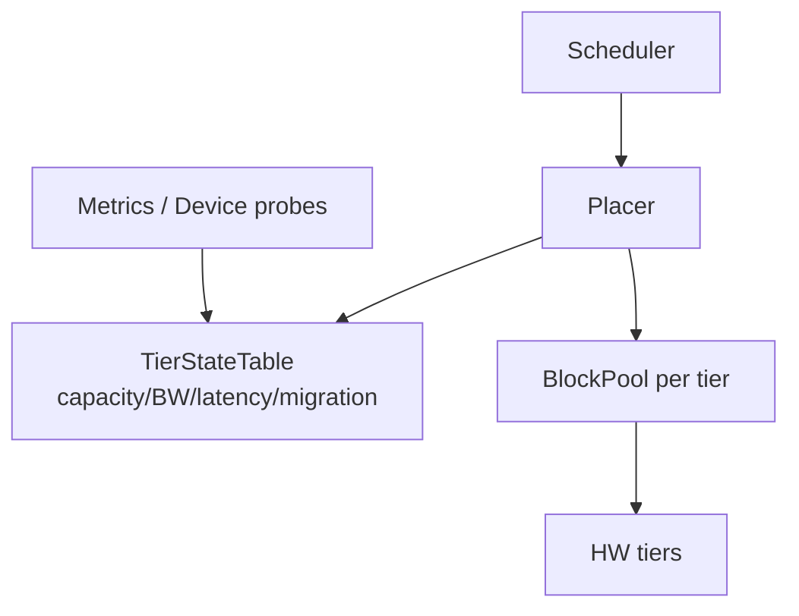
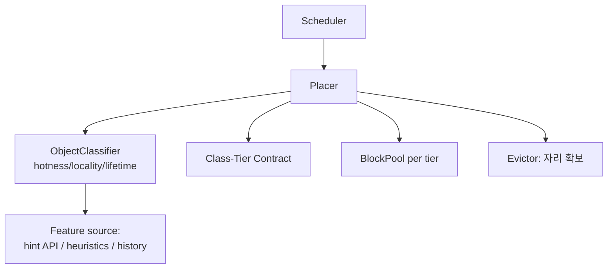
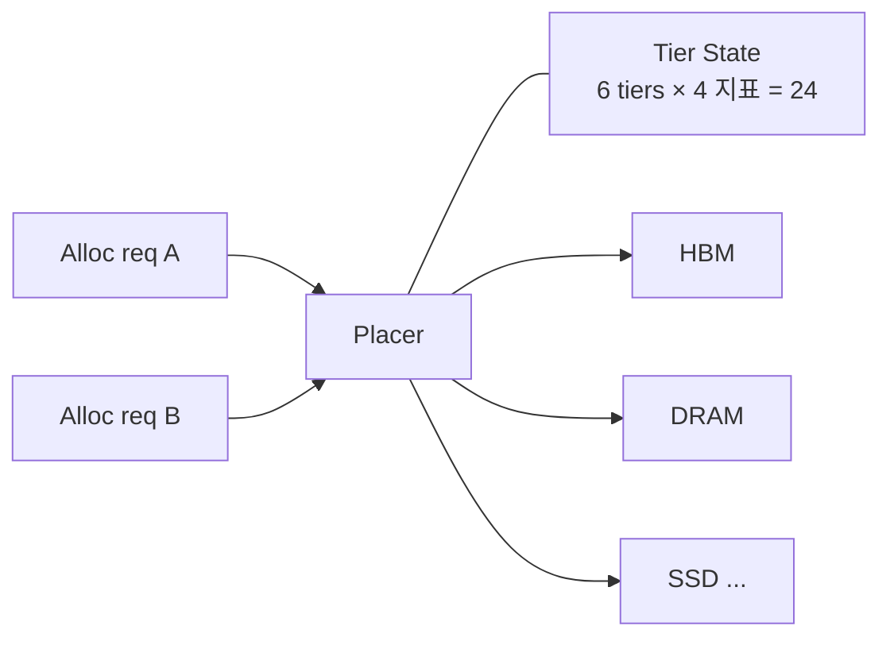
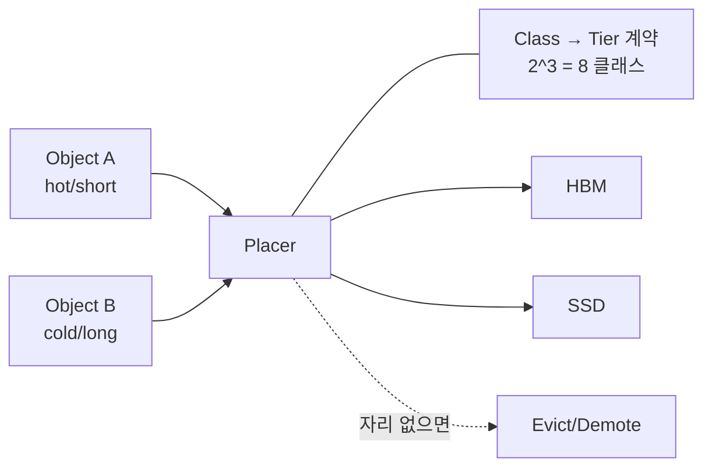
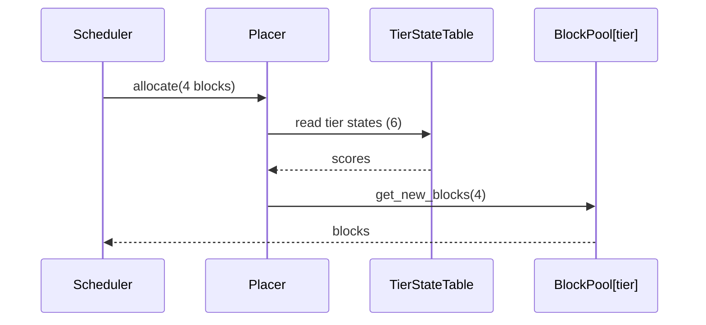
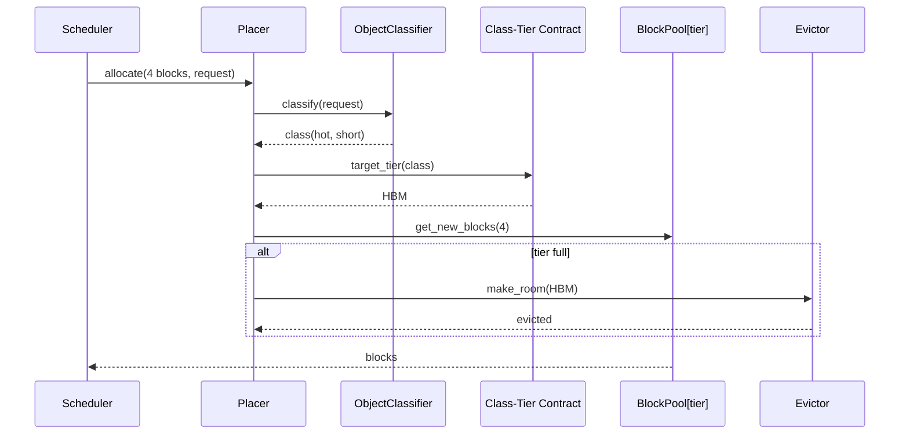
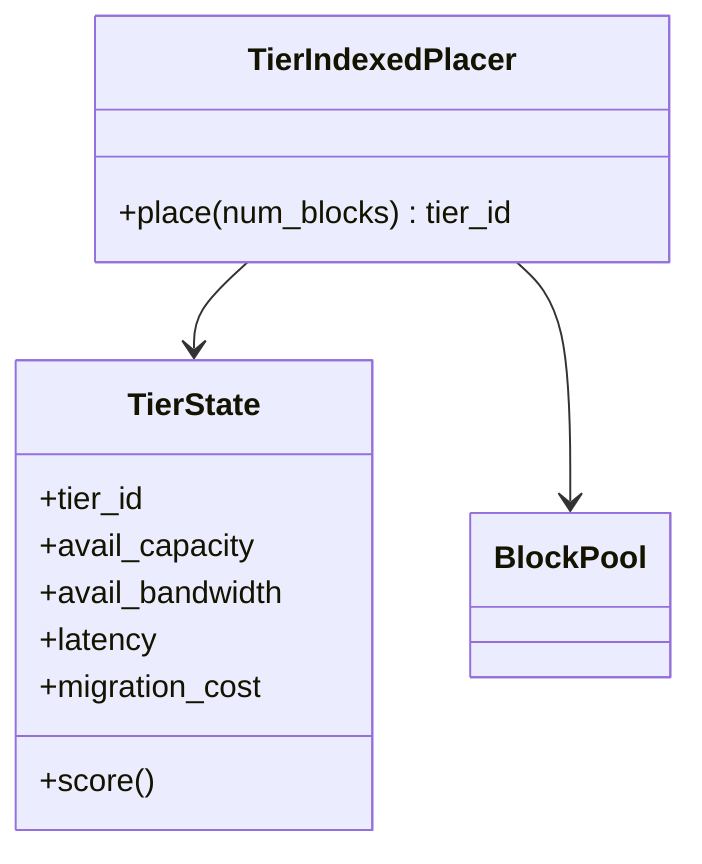
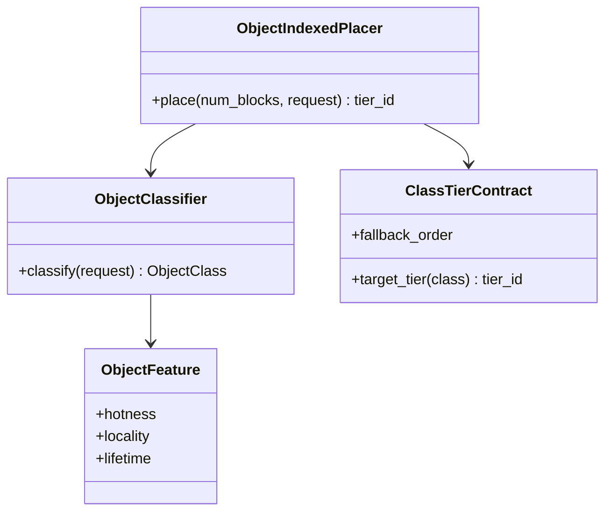

# DP1 — Memory Placement Decision Basis (메모리 배치 결정 기준)

> **설계 질문: 스케줄러가 "얼마나"만 요구하고 런타임이 "어디에"를 정하는 구조에서, 그 배치 결정의 단일 기준을 무엇에 매달 것인가?**
>
> 대상 스택: Engine/Scheduler 레이어의 KV cache 할당 경계 — `Scheduler.schedule()` → `KVCacheManager.allocate_slots()` → `BlockPool.get_new_blocks()`.

---

# 1. 배경과 문제 정의

## 1.1 배경 — 현재 vLLM v1은 "메모리는 한 종류"라는 전제 위에 있다

vLLM v1의 할당 인터페이스는 **크기만 받는다.** 위치를 표현할 인자가 없다.

```python
# vllm/v1/core/kv_cache_manager.py
def allocate_slots(
    self, request: Request, num_new_tokens: int, ...
) -> KVCacheBlocks | None: ...

# vllm/v1/core/block_pool.py
def get_new_blocks(self, num_blocks: int) -> list[KVCacheBlock]: ...
def get_num_free_blocks(self) -> int:
    return self.free_block_queue.num_free_blocks
```

가용량을 나타내는 관측 지표는 `get_num_free_blocks()`가 돌려주는 **정수 하나**다. 블록은 단일 free queue의 앞에서 순서대로 꺼내지고, 다 차면 배치를 바꾸는 것이 아니라 요청을 **preempt** 한다.
즉 현재 구조의 전제는 **"메모리는 한 종류이고, 부족하면 배치가 아니라 스케줄로 해결한다"** 이다.

`vllm/v1/kv_offload`가 CPU 계층을 다루긴 하지만 이 전제를 깨지 않는다. 그 경로는 배치(placement)가 아니라 **사후 이동(load/store)** 이고, 정책도 `policies/lru.py`, `policies/arc.py`처럼 **이미 발생한 접근 이력** 기반이다. "새 메모리를 어디에 잡을 것인가"를 정하는 자리가 아니다.

## 1.2 변화 — 6단 이기종 메모리가 들어온다

그래서 지금까지는 "얼마나"만 알면 충분했다. 그런데 GPU HBM / CPU DRAM / CXL Memory / Custom HBM / SSD / HBF로 구성된 이기종 메모리 시스템에서는 tier마다 대역폭·지연·용량·이동비용이 **자릿수 단위로** 다르다. 같은 30GB라도 어디에 놓느냐가 처리량을 좌우한다.

따라서 할당은 이제 두 개의 질문으로 쪼개진다: **"얼마나"(스케줄러가 답함)** 와 **"어디에"(런타임이 답해야 함)**.
스케줄러가 tier까지 지정하면 스케줄러가 메모리 토폴로지를 알아야 하므로, "얼마나"만 말하고 런타임이 위치를 정하는 분리가 필요하다. 이 분리 자체는 전제이고, DP1은 그 안에서 **런타임이 무엇을 근거로 위치를 정하는가**를 다룬다.

## 1.3 관련 QA

이 DP의 결정 변수에 의해 실제로 갈리는 QA만 4개 선정한다.

| QA | 정의 (질문형) | 정량 프록시 |
|---|---|---|
| **QA1. Placement Quality under Heterogeneity** | 성격이 다른 메모리 객체를 얼마나 잘 구분해 tier에 배치하는가? | 정책이 구분할 수 있는 객체 등급 수, 동일 tier 내 hot/cold 혼재율 |
| **QA2. Decision Information Cost** | 결정에 필요한 정보를 얻는 비용과 관측 가능성은 어떠한가? | 필요한 관측 지표 수, 그중 할당 시점에 **관측 불가능(추정 필요)** 한 비율, 갱신 복잡도의 N 의존성 |
| **QA3. Adaptivity / Self-correction** | 상태 변화와 잘못된 배치를 얼마나 빨리 교정하는가? | 오배치 교정까지 필요한 결정 횟수, 스텝 내 상태 staleness 노출 |
| **QA4. Explainability / Reproducibility** | 배치 결정을 설명하고 재현할 수 있는가? | 동일 요청 재실행 시 동일 배치가 나올 확률, 결정 근거로 기록해야 할 항목 수 |

## 1.4 문제

### 발생 위치

문제는 **Scheduler와 BlockPool 사이의 할당 경계**에서 발생한다. `Scheduler.schedule()`(`vllm/v1/core/sched/scheduler.py:352`)이 요청별로 `allocate_slots()`를 호출하고, 그것이 `get_new_blocks(num_blocks)`로 내려가는 지점이다.
이 경계는 "얼마나"를 "실제 블록"으로 바꾸는 자리인데, 인터페이스에 위치 개념이 없고 결정 기준을 담을 자리도 없다.

> 문제: 6-tier로 확장하면 **tier 선택이 정책이 아니라 호출 지점의 조건문으로 흩어지고**, 어떤 기준으로 골랐는지가 시스템 어디에도 남지 않는다.

### QA 영향

- **QA1**: 현재 `get_new_blocks()`는 free queue 앞에서 순서대로 꺼낸다. 정책이 구분하는 객체 등급은 **1종(구분 없음)** 이다. 6-tier에서 이 상태로 확장하면 대역폭 요구가 다른 객체가 한 tier에 섞이고, 상위 tier 점유가 **도착 순서**로 결정된다.
- **QA2**: 현재 배치에 쓰이는 관측 지표는 `get_num_free_blocks()` **1개(정수 1개)** 다. 6-tier에서 용량·대역폭·지연·이동비용을 보려면 최소 **6 × 4 = 24개**로 늘고, 갱신 주기를 새로 정의해야 한다.
- **QA3**: 단일 tier에서는 오배치 개념 자체가 없다. 6-tier에서는 잘못 놓인 블록을 교정하는 경로가 필요한데, 현재 구조에는 배치를 되돌리는 진입점이 없다(있는 것은 preempt와 offload 이동뿐).
- **QA4**: 지금은 "왜 이 블록이 여기 있나"의 답이 자명하다(tier가 1개). 6-tier에서는 결정 근거를 남기지 않으면 성능 회귀의 원인을 **최대 6^k 가지 배치 조합**(k = 관련 블록 그룹 수) 중에서 사후 추정해야 한다.

### 제약 / 가정 / 범위 밖

- **제약**
  - `allocate_slots(request, num_new_tokens, ...)` 호출 규약은 유지한다. 스케줄러는 tier를 지정하지 않는다.
  - 할당은 **블록 단위 점진 할당**이다. 기본 block size는 16 토큰(`CacheConfig.DEFAULT_BLOCK_SIZE = 16`)이고, 요청 하나의 총 사용량은 디코드가 진행되며 늘어난다. **"30GB를 한 번에 할당"하는 호출 지점은 존재하지 않는다.**
  - 배치 결정은 스케줄 스텝의 임계 경로에 있다. 기본 `max_num_seqs = 128`이므로 스텝당 결정 건수는 수십~수백 건이다.
- **가정**
  - tier 수 T = 6 (GPU HBM / CPU DRAM / CXL / Custom HBM / SSD / HBF).
  - tier별 가용량·대역폭은 런타임에 관측 가능하다.
- **범위 밖**
  - **재배치(migration) 트리거와 주체**: 최초 배치만 DP1이 다룬다. "언제 옮길 것인가"는 별도 DP. 단, 두 후보 모두 migration cost를 결정 입력으로 쓰므로 재배치 주체가 존재한다는 것은 전제한다.
  - 배치된 메모리에서 무엇을 실행할 수 있는가 → DP2(Compute-Capable Memory Abstraction).
  - eviction 대상 선정 알고리즘(LRU/ARC 등) 자체.

### 문제 한 문장

> **vLLM v1의 KV cache 할당 경계는 "얼마나"만 표현하고 "어디에"를 표현하지 않기 때문에, 6단 이기종 메모리로 확장하면 런타임이 위치를 정할 기준을 담을 자리가 없어 tier 선택이 호출 지점의 조건문으로 흩어지고 결정 근거가 남지 않는다.**

---

# 2. 설계 쟁점

문제의 뿌리는 배치 기준을 담을 **자리(정책의 인덱스)** 가 없다는 것이다. 자리를 만들려면 **정책을 무엇에 매달 것인지** 를 먼저 정해야 한다. 인덱스가 정해지면 배치 결정은 그 축 위의 함수가 되고, 호출 지점의 조건문이 사라진다.

> **설계 결정 변수: 배치 정책의 인덱스 축을 어디에 둘 것인가?**
>
> - 값 A: **자원 축** — 정책의 1급 개체는 tier다. 요청은 익명이며, tier 상태가 결정을 지배한다.
> - 값 B: **객체 축** — 정책의 1급 개체는 메모리 객체의 특성 클래스다. 클래스가 목표 tier를 지시하고, tier 상태는 그 지시를 만족시키기 위해 조정된다.

인덱스는 하나여야 한다. 두 축에 동시에 정책을 매달면 경합 상황에서 두 결정이 서로 반대 방향을 가리키므로(3.3 참조) 배타적이다.

---

# 3. 후보 구조

## 3.1 Candidate 1 — Tier-Indexed Placement (자원 축 인덱스)

정책의 1급 개체는 **Tier**다. 각 tier가 `{avail capacity, avail bandwidth, latency, migration cost}`를 들고 있고, 배치 요청은 **크기만** 전달한다(익명 요청). 결정 함수는 tier 상태 점수의 `argmax`이며, 상태 테이블은 스케줄 스텝마다 갱신된다.
불변식은 **"자원 제약을 절대 위반하지 않는다"** — 상위 tier가 차 있으면 요청이 무엇이든 하위 tier로 흘러간다.

```text
Allocate(size)      ← 요청은 익명
  ↓
Tier State Table    ← 용량 / 대역폭 / 이동비용
  ↓
Best tier 선택
  ↓
Place
```

**한 문장 특징**

> **요청을 익명으로 다루어 관측 가능한 자원 상태만으로 결정을 닫고, 상태 변화에 스스로 적응하는 대신, 객체마다 다른 요구를 구분할 능력과 결정의 재현성을 포기하는 구조.**

## 3.2 Candidate 2 — Object-Indexed Placement (객체 축 인덱스)

정책의 1급 개체는 **메모리 객체의 특성 클래스**다. 할당 시점에 객체가 `{hotness, locality, lifetime}`으로 분류되고, 그 클래스가 목표 tier를 지시한다. tier 상태는 비용 함수의 한 항이자 **조정 대상**이다.
불변식은 **"객체 클래스의 배치 계약을 지킨다"** — 목표 tier가 차 있으면 기존 객체를 밀어내서라도 자리를 만든다.

```text
Allocate(size, object)   ← 요청이 자기 특성을 동반
  ↓
Object Class             ← hotness / locality / lifetime
  ↓
Class → Tier 계약
  ↓
Place (필요 시 자리 확보)
```

**한 문장 특징**

> **객체마다 다른 요구를 클래스로 구분해 결정론적이고 설명 가능한 배치를 확보하는 대신, 할당 시점에 관측 불가능한 미래 정보를 추정해야 하고 오분류를 교정할 수단을 포기하는 구조.**

> 두 대표 구조도는 같은 시작 요소(Allocate), 같은 방향, 같은 단계 수(4)로 그렸다. 차이는 **두 번째 상자에 무엇이 들어오는가** — 자원 상태냐, 객체 특성이냐 — 하나뿐이며, 그것이 곧 결정 변수다.

## 3.3 양립 불가 논증

### (1) 불변식 충돌 — 합성 테스트

상위 tier가 가득 찬 상태에서 hot으로 분류된 객체가 도착하면 두 정책의 결정은 **정반대**다.

| 상황 | Candidate 1의 결정 | Candidate 2의 결정 |
|---|---|---|
| 상위 tier full + hot object 도착 | 새 객체를 하위 tier로 흘림 | 기존 cold 객체를 밀어내고 새 객체를 넣음 |

두 불변식("자원 제약 우선" vs "객체 계약 우선")은 같은 순간에 동시에 성립할 수 없다. 우선순위를 정하는 순간 하위가 된 쪽은 정책이 아니라 **tie-breaker로 격하**되며, 그것은 이미 두 후보 중 하나를 선택한 것이다. 따라서 두 구조를 합친 제3의 구조는 존재하지 않는다.

### (2) 결정 단위 충돌

- C1의 결정 단위는 **할당 1건**(이번 스텝에 필요한 블록 묶음)이다. 같은 요청의 블록이라도 스텝마다 다른 tier에 놓일 수 있다.
- C2의 결정 단위는 **객체 1개**(요청/시퀀스)이며, 그 객체에 속한 블록은 클래스를 상속한다.

한 블록이 두 인덱스를 동시에 가질 수 없다. C1에서 블록은 "어느 tier에 있는 블록"일 뿐 소유자가 없고, C2에서 블록은 "어느 객체에 속한 블록"이다. 소유자 개념의 유무 자체가 갈리므로 두 결정 단위는 공존할 수 없다.

> 참고: prefix caching으로 공유되는 블록(`BlockPool.touch()`가 `ref_cnt`를 올리는 경우)은 **배치 결정이 일어나지 않는 경로**이므로 두 후보가 동일하게 동작한다. 공유가 만드는 문제는 배타성이 아니라 배치 품질이며, QA3에서 다룬다(6장).

### (3) 상위호환 반박 — "C2가 tier 정보를 쓰면 C1의 상위 아닌가?"

이 DP에서 가장 먼저 제기되는 반박이며, 답은 **아니다**. 세 가지 이유가 있다.

1. **정보에 대한 권한이 반대다.** C1에서 tier 상태는 **불변 입력이자 하드 제약**이다. C2에서 tier 상태는 **비용 함수의 한 항이자 조정 대상**(밀어내서 자리를 만들 수 있는 것)이다. 같은 데이터를 읽더라도 그 데이터가 결정을 구속하는지, 결정에 의해 바뀌는지가 반대이므로 포함 관계가 아니다.
2. **C2가 C1을 흉내내려면 비용을 그대로 내고 이득만 버려야 한다.** 모든 객체를 단일 클래스로 분류하면 C1과 같은 동작이 되지만, 특성 추정 파이프라인(아래 3번)은 그대로 유지된다. 즉 **C1보다 비싼 C1**이 되므로, 기능적 포함이 성립해도 구조적 상위호환은 성립하지 않는다.
3. **역방향은 원리적으로 불가능하다.** C1이 C2를 흉내내려면 hotness·lifetime을 알아야 하는데, 이 값들은 **할당 시점에 관측 불가능한 미래 정보**다. tier 상태(현재의 관측값)만으로는 유도할 수 없다.

> 정리: **기능이 포개져 보여도 (a) 정보에 대한 권한과 (b) 정보 획득 비용의 축이 다르면 상위호환이 아니다.** C1의 결정 정보는 자원 수 T에 비례해 얻어지고(요청 수와 무관), C2의 결정 정보는 요청 수 N에 비례해 **추정되어야** 한다.

---

# 4. 백데이터 다이어그램

## 4.1 모듈 뷰

### Candidate 1



신규 모듈은 `Placer`와 `TierStateTable` 2개이고, 요청 경로는 스케줄러에서 곧장 Placer로 간다.
`TierStateTable`을 갱신하는 유일한 소스는 디바이스 계측이므로 의존이 한 방향이다.
요청 객체(`Request`)에 대한 의존이 없어 스케줄러–배치 간 결합이 얇다.
→ **QA2(Decision Information Cost)** 근거: 갱신 소스가 자원 쪽 하나로 국한된다.

### Candidate 2



신규 모듈이 4개(`Placer`, `ObjectClassifier`, `Class-Tier Contract`, `Evictor` 연동)이며, 그중 `Feature source`는 **시스템 밖에서 정보를 들여오는 새 파이프라인**이다.
클래스 계약이 지켜지려면 Placer가 Evictor를 호출할 권한을 가져야 하므로, 배치 모듈이 eviction 정책과 결합된다.
→ **QA2**, **QA4(Explainability)** 근거: 정보 소스가 늘어나는 대신 결정 근거가 객체에 남는다.

## 4.2 컴포넌트 & 커넥터

### Candidate 1



런타임 상태는 **24개 지표 1벌**이고 요청 수와 무관하다. 요청 A와 B는 구분되지 않으므로 같은 스텝에서는 같은 점수를 보고 **같은 tier를 고른다.**
이것이 C1의 실패 모드다: 스텝 내에서 상태가 갱신되지 않으면 그 스텝의 모든 할당이 한 tier로 몰린다(herding). 기본 `max_num_seqs=128` 기준 스텝당 수십~수백 건이 동시에 몰릴 수 있어 **스텝 내 예약 카운터**가 사실상 필수다.
→ **QA3(Adaptivity)** 의 감점 근거이자 **QA2** 의 가점 근거.

### Candidate 2



요청마다 특성 벡터가 붙으므로 3개 이진 특성 기준 **8개 클래스**를 구분한다. 같은 스텝의 서로 다른 객체가 서로 다른 tier로 흩어져 herding이 발생하지 않는다.
대신 유지해야 할 상태가 객체 수에 비례하고(요청당 특성 벡터 1개), 계약 위반 시 eviction을 유발하는 커넥터가 추가된다.
→ **QA1(Placement Quality)** 근거 및 QA2의 비용 근거.

## 4.3 시퀀스 — 동일 시나리오: "스케줄 스텝에서 한 요청에 블록 4개를 신규 할당"

### Candidate 1



메시지 **5개**, 객체 조회 **0회**, 상태 조회 1회(6 tier 스캔).
요청 식별자가 경로에 등장하지 않는다 — 이것이 "익명 요청"의 구조적 의미다.
결정 입력이 전부 현재 관측값이므로 **추정 단계가 없다.** 대신 같은 스텝의 다음 요청도 같은 점수를 보므로 예약 반영이 필요하다.
→ **QA2**, **QA3** 근거.

### Candidate 2



메시지 **7개**(경합 시 9개), 분류 1회(객체당, 첫 할당에서만), tier 상태 조회는 계약 검증 시 1회.
분류 결과는 객체 수명 동안 재사용되므로 반복 비용은 낮지만, **첫 결정이 틀리면 그대로 고착**된다.
경합 시 eviction 경로가 임계 경로에 들어와 결정 지연의 분산이 커진다.
→ **QA1**, **QA3**, **QA4** 근거.

## 4.4 클래스

### Candidate 1



정책이 `TierState.score()` 하나에 응축된다. 신규 tier 추가는 **테이블 행 1개 추가**이며 정책 함수는 그대로다(`argmax`의 정의역만 넓어짐).
`Request`에 대한 의존이 없으므로 스케줄러 쪽 타입 변경이 배치 모듈로 전파되지 않는다.
반대로 객체 정보를 쓰려면 `place()` 시그니처부터 바꿔야 하므로, 나중에 C2로 옮겨가는 비용은 인터페이스 변경을 포함한다.
→ **QA2**, **QA3** 근거.

### Candidate 2



클래스 4개로 늘고, 그중 `ObjectFeature`의 세 필드는 모두 **할당 시점에 관측 불가능**하다 → 값을 채우려면 힌트 API(상위 인터페이스 변경), 휴리스틱, 또는 과거 통계 중 하나가 필요하다.
신규 tier 추가는 행 추가로 끝나지 않고 **8개 클래스 × 새 tier의 계약을 다시 정의**해야 한다.
반면 결정 근거가 `ObjectClass`라는 값으로 남으므로 로깅·재현이 자연스럽다.
→ **QA1**, **QA2**, **QA4** 근거.

## 4.5 정량 지표 추출표

| 지표 | 출처 | Candidate 1 | Candidate 2 |
|---|---|---|---|
| 결정 입력 지표 수 | 클래스 | 24 (6 tier × 4) | 3 (객체 특성) + tier 제약 |
| **관측 불가(추정 필요) 지표 비율** | 클래스 | **0%** | **0~100%** — 특성 집합 선택에 달림. QA1 이득의 원천인 lifetime·재사용 횟수를 쓰면 100% (부록 D) |
| 구분 가능한 객체 등급 | 컴포넌트 | 1 (익명) | 8 (2³) |
| 상태 갱신 비용 | 컴포넌트 | 스텝당 O(T)=6, 요청 수 무관 | 신규 객체당 O(D)=3, 스텝당 O(new_N·D) |
| dispatch 메시지 수 | 시퀀스 | 5 | 7 (경합 시 9) |
| 오배치 교정까지 결정 횟수 | 시퀀스 | 1 (다음 할당에 자동 반영) | 불가 (객체 수명 동안 고착) |
| 스텝 내 herding 노출 | 컴포넌트 | 있음 (예약 카운터 필요) | 없음 |
| 동일 요청 재실행 시 동일 배치 | 시퀀스 | 보장 안 됨 (동시 상태 의존) | 보장 (결정론적 분류) |
| 결정 근거 로깅 항목 | 클래스 | 24개 상태 스냅샷 | 1개 클래스 라벨 |
| 공유 블록이 최초 소유자와 달라졌을 때 | 클래스 | 영향 없음 (계약 없음) | 계약 위반이 조용히 발생, 교정 불가 |
| 신규 tier 1개 추가 비용 | 클래스 | 테이블 행 1개 | 8개 클래스 계약 재정의 |
| 신규 모듈 수 | 모듈 뷰 | 2 | 4 (외부 특성 소스 포함) |

---

# 5. QA 트레이드오프 평가

> ★★★ = 구조적으로 유리 / ★★☆ = 가능하나 비용 발생 / ★☆☆ = 구조적으로 불리

| QA | Candidate 1: Tier-Indexed | Candidate 2: Object-Indexed | 정량 근거 |
|---|:---:|:---:|---|
| **QA1. Placement Quality under Heterogeneity** | ★★☆ | ★★★ | 구분 가능 등급 1종 vs 8종; C1은 상위 tier 점유가 도착 순서로 결정 (컴포넌트) |
| **QA2. Decision Information Cost** | ★★★ | ★★☆ | 갱신 O(T)=6 · 요청 수 무관 vs O(new_N·D) + 외부 특성 소스 1개. 관측 불가 지표 0% vs 최대 100% — QA1 이득을 내는 특성일수록 미래 정보다 (클래스·컴포넌트, 부록 D) |
| **QA3. Adaptivity / Self-correction** | ★★★ | ★☆☆ | 오배치 교정 1회 vs 불가(수명 내 고착); C1은 herding 대비 예약 카운터 필요 (시퀀스) |
| **QA4. Explainability / Reproducibility** | ★☆☆ | ★★★ | 재현 보장 없음(24개 상태 스냅샷 필요) vs 보장(클래스 라벨 1개) (시퀀스·클래스) |
| **합계 (★=1/2/3)** | **9** | **9** | 지배 없음, 동점 |

각 후보가 ★★★를 2개씩 갖고 모든 축에서 별점이 갈린다. 합계가 동점이라는 것은 **선택이 QA 가중치에 전적으로 달려 있다**는 뜻이다(9장).

---

# 6. QA별 상세 비교

## QA1. Placement Quality under Heterogeneity

### Candidate 1 — ★★☆

```text
Alloc A ─┐
Alloc B ─┼─► 같은 tier score ─► 같은 tier
Alloc C ─┘
```

- 요청이 익명이므로 정책이 구분하는 등급은 **1종**. hot/cold를 구분할 수 없다.
- 상위 tier 점유는 결과적으로 **도착 순서**로 결정된다. long-context 소수 + 짧은 다수처럼 이질적인 워크로드에서 상위 tier가 짧은 요청으로 채워질 수 있다.
- 다만 tier 상태가 실시간이므로 **평균적으로는** 자원 제약을 위반하지 않는 배치가 보장된다. "나쁜 배치"가 아니라 "구분 없는 배치"다.

### Candidate 2 — ★★★

```text
Object A (hot, short) ─► HBM
Object B (cold, long) ─► SSD
```

- 3개 이진 특성 기준 **8개 클래스**를 구분해 tier에 매핑한다.
- 이질적 워크로드일수록 이득이 커진다. 균질한 워크로드(모든 요청이 비슷)에서는 구분의 이득이 0에 수렴한다.
- 단, 이 이득은 **분류가 맞았을 때만** 실현된다. 분류 정확도가 정책 품질의 상한이다(QA3와 연결).

**Trade-off:**

> **모든 요청을 동일하게 다루어 얻는 공정성과 단순성 ↔ 요청을 구분해 얻는 이질 워크로드 적합성**

## QA2. Decision Information Cost

### Candidate 1 — ★★★

- 결정 입력 24개(6 tier × 4 지표)가 전부 **시스템 내부에서 즉시 관측 가능**하다. 현재도 `get_num_free_blocks()`가 O(1)로 제공되는 종류의 값이다.
- 갱신 비용은 스텝당 O(T) = 6이며 **요청 수 N과 무관**하다. 부하가 늘어도 결정 정보 비용은 늘지 않는다.
- 새로운 정보 파이프라인이 필요 없다 → 상위 API(요청 인터페이스)를 건드리지 않는다.

### Candidate 2 — ★★☆

- 어떤 특성을 쓰느냐가 C2 내부의 설계 변수이며 그 선택이 이 축의 비용을 결정한다. 관측 가능한 특성만 쓸 수도 있고(컨텍스트 길이, prefix 캐시 히트 길이, attention 종류 — 부록 D), 미래 정보를 쓸 수도 있다.
- 문제는 **구분력이 큰 특성일수록 미래 정보**라는 커플링이다. 남은 출력 길이와 총 재사용 횟수는 할당 시점에 측정할 수 없는데, QA1의 이득은 대부분 이 특성들에서 나온다. 이들을 쓰면 관측 불가 비율이 100%가 된다.
- 미래 정보를 채우는 방법은 셋뿐이며 각각 비용이 있다: **힌트 API**(요청 인터페이스 오염, 사용자가 정확히 줄 것이라는 가정), **휴리스틱**(정확도 미보장), **과거 통계**(콜드스타트, 저장소 추가).
- 갱신 비용은 신규 객체당 O(D)이므로 스텝당 O(new_N·D)로 **부하에 비례**한다.

**Trade-off:**

> **이미 가진 정보만으로 결정을 닫는 자족성 ↔ 없는 정보를 들여와 얻는 구분 능력**

## QA3. Adaptivity / Self-correction

### Candidate 1 — ★★★

- tier 상태가 결정에 직접 들어가므로, 배치가 편중되면 **다음 할당부터 자동으로 교정**된다(교정까지 결정 1회). 별도의 감시자가 필요 없다.
- 약점은 스텝 내 staleness다. 상태를 스텝 경계에서만 갱신하면 그 스텝의 모든 할당이 같은 판단을 내려 herding이 발생한다. 스텝 내 **예약 카운터**로 보완해야 하며, 이는 구현 부담이지 구조 변경은 아니다.

### Candidate 2 — ★☆☆

- 특성이 할당 시점에 정적으로 확정되므로, 분류가 틀리면 **객체 수명 내내 잘못된 tier에 남는다.** 교정 경로가 구조에 없다(교정 횟수 = 불가).
- 교정을 넣으려면 재분류 트리거와 마이그레이션 주체를 도입해야 하는데, 그 순간 "정적 특성"이라는 전제가 깨지고 C1이 쓰는 런타임 상태를 다시 들여오게 된다 → **이 축의 요구를 만족시키려면 구조 자체를 바꿔야 한다**(★☆☆의 정의).
- 실패는 두 가지 형태로 나타나며, 뿌리는 같다 — **할당 시점에 알 수 없는 것을 정적으로 고정했다**는 것.
  1. **예측값 오류**: 짧을 것으로 분류된 요청이 실제로는 long-context로 이어지면, 상위 tier를 오래 점유하면서 계약상 밀어낼 수도 없다.
  2. **예측 대상 오류(공유 블록)**: cold 요청이 처음 할당한 prefix 블록을 이후 hot 요청 30개가 공유해 읽는 경우, 최초 요청에 대한 분류는 맞았는데도 "hot은 상위 tier에서 읽는다"는 계약이 **조용히 깨진다.** 정해야 할 것은 "이 블록을 앞으로 누가 쓰는가"인데 "최초 소유자가 누구인가"로 대신했기 때문이다. C1은 그런 계약 자체가 없어 위반이 성립하지 않는다.

**Trade-off:**

> **상태를 계속 읽어 얻는 자기 교정력 ↔ 특성을 굳혀 얻는 결정의 안정성**

## QA4. Explainability / Reproducibility

### Candidate 1 — ★☆☆

- 결정이 **그 시점의 동시 상태**에 의존한다. 같은 요청을 같은 입력으로 재실행해도 다른 요청들의 도착 타이밍이 다르면 다른 tier에 놓인다 → 동일 배치 보장 없음.
- "왜 이 블록이 SSD에 갔는가"에 답하려면 그 시점의 24개 상태 스냅샷을 남겨야 한다. 성능 회귀 재현 실험이 어렵다.
- A/B 비교 시 배치가 독립 변수가 아니라 잡음이 된다.

### Candidate 2 — ★★★

- 결정 입력이 객체에 붙어 있으므로 **결정론적**이다. 같은 요청은 같은 클래스로 분류되어 같은 tier에 간다.
- 근거 로깅이 클래스 라벨 1개로 끝난다. 사후 분석과 회귀 테스트가 가능하다("hot으로 분류된 객체의 배치가 바뀌었는가"를 단위 테스트로 고정할 수 있다).
- 단, 재현 가능성은 "옳음"과 다르다. 틀린 분류도 재현 가능하게 틀린다.

**Trade-off:**

> **현재 상태에 반응해 얻는 최적성 ↔ 객체에 결정을 고정해 얻는 재현성**

---

# 7. 장점 / 단점

## Candidate 1 — Tier-Indexed Placement

**장점**
1. (QA2) 결정 입력 24개 전부 즉시 관측 가능, 추정 필요 0%.
2. (QA2) 갱신 비용 O(T)=6으로 요청 수와 무관 — 부하 확장에 안전.
3. (QA3) 오배치가 다음 할당 1회로 자동 교정.
4. 요청 인터페이스를 건드리지 않음 — 신규 모듈 2개.

**단점**
1. (QA1) 구분 가능한 객체 등급 1종 — hot/cold 구분 불가.
2. (QA1) 상위 tier 점유가 도착 순서로 결정됨.
3. (QA3) 스텝 내 herding — 예약 카운터 없이는 128건이 한 tier로 몰림.
4. (QA4) 동일 배치 재현 불가, 근거 추적에 24개 상태 스냅샷 필요.

## Candidate 2 — Object-Indexed Placement

**장점**
1. (QA1) 8개 클래스 구분 — 이질 워크로드에서 hot/cold 분리.
2. (QA1) 같은 스텝의 객체가 서로 다른 tier로 흩어져 herding 없음.
3. (QA4) 결정론적 배치, 근거 로깅 1항목.
4. (QA4) 배치 정책을 단위 테스트로 고정 가능.

**단점**
1. (QA2) 결정 입력 3개가 전부 미래 정보 — 추정 파이프라인 필수.
2. (QA3) 오분류가 객체 수명 내내 고착, 교정 경로 없음.
3. 공유 블록은 최초 소유자의 등급으로 배치가 굳어, 이후 사용자가 달라져도 계약 위반을 알 수도 고칠 수도 없음.
4. 신규 tier 추가 시 8개 클래스 계약 재정의; 신규 모듈 4개.

---

# 8. 핵심 트레이드오프

```text
Candidate 1                              Candidate 2
Tier-Indexed (자원 축)                    Object-Indexed (객체 축)
      │                                        │
정책 = f(현재 자원 상태)                  정책 = f(객체 특성 클래스)
      │                                        │
관측 불가 지표 0%                         관측 불가 지표 100%
      │                                        │
구분 등급 1종                             구분 등급 8종
      │                                        │
오배치 교정 1회                           오배치 고착
      │                                        │
재현 불가                                 재현 보장
```

> **관측 가능한 상태만으로 결정을 닫아 얻는 자기 교정력 ↔ 객체 특성으로 결정을 고정해 얻는 구분 능력과 재현성**

---

# 9. 선택 조건

**Candidate 1을 선택할 근거**
- 워크로드가 비교적 균질하다(요청 간 길이·재사용 패턴 편차가 작다) → 구분의 이득이 작다.
- 요청 특성을 알려줄 신뢰 가능한 소스가 없다(힌트 API를 쓸 수 없거나 사용자가 정확히 주지 못한다).
- tier 가용량 변동이 크다 → 자기 교정력이 중요하다.
- 초기 도입 단계로, 요청 인터페이스 변경 없이 검증하고 싶다.

**Candidate 2를 선택할 근거**
- 워크로드가 이질적이다(long-context 소수 + 짧은 다수, 또는 우선순위 티어가 있는 서비스).
- 요청 특성을 신뢰할 수 있게 얻을 수 있다(내부 서비스라 힌트를 줄 수 있거나, 모델·엔드포인트별 패턴이 안정적이다).
- 배치의 재현성과 설명 가능성이 요구된다(SLA 보장, 회귀 테스트, 과금 근거).
- DP2와 연계해 "이 객체는 memory-side compute 대상"을 배치 단계에서 표현하고 싶다 — 이는 객체 축에 자연히 담기지만 tier 상태 점수에는 담기 어렵다.

**판단이 갈리는 지점**: 합계가 9 대 9로 동점이므로 선택은 **QA 가중치**로 결정된다. 구체적으로 두 질문이다.
1. 요청 특성을 얼마나 신뢰할 수 있는가? (신뢰도가 낮으면 C2의 QA1 이득이 사라지고 QA3 손실만 남는다)
2. 배치 재현성이 운영 요구인가 편의인가? (요구라면 C1의 QA4 ★☆☆는 수용 불가 수준이 된다)

---

# 10. PPT 페이지

| | **Candidate 1: Tier-Indexed Placement** | **Candidate 2: Object-Indexed Placement** |
|---|---|---|
| **후보 구조 이름** | Tier-Indexed — 요청을 익명으로 두고 자원 상태만으로 결정을 닫아 자기 교정력을 얻는 대신 구분 능력과 재현성을 포기 | Object-Indexed — 객체 특성으로 결정을 고정해 구분 능력과 재현성을 얻는 대신 미래 정보 추정과 오분류 고착을 감수 |
| **대표 구조도** | `Allocate(size) → Tier State → Best tier → Place` | `Allocate(size, object) → Object Class → Class-Tier 계약 → Place` |
| **장점** | • (Info Cost) 추정 필요 지표 0%<br>• (Info Cost) 갱신 O(6), 요청 수 무관<br>• (Adaptivity) 오배치 1회 만에 교정<br>• 요청 인터페이스 무변경 | • (Quality) 구분 등급 8종, hot/cold 분리<br>• (Quality) herding 없음<br>• (Repro.) 결정론적 배치<br>• (Repro.) 근거 로깅 1항목 |
| **단점** | • (Quality) 구분 등급 1종<br>• (Quality) 상위 tier가 도착 순서로 점유<br>• (Adaptivity) 스텝 내 herding, 예약 카운터 필요<br>• (Repro.) 재현 불가, 24개 스냅샷 필요 | • (Info Cost) 결정 입력 100%가 미래 정보<br>• (Adaptivity) 오분류 수명 내내 고착<br>• 공유 블록은 최초 소유자 등급으로 고착<br>• 신규 tier 시 8개 계약 재정의 |
| **TRADEOFF 관계** | colspan → **관측 가능한 상태만으로 결정을 닫아 얻는 자기 교정력 ↔ 객체 특성으로 결정을 고정해 얻는 구분 능력과 재현성** | |

---

## 부록 A. 게이트 체크 결과

| 게이트 | 결과 | 확인 내용 |
|---|---|---|
| A. 문제 정의 | 통과 | QA 4개 + 프록시, 배경→변화→문제 연결, 레이어 지목(Scheduler ↔ BlockPool 할당 경계), QA 영향 수치화 |
| B. 설계 쟁점 | 통과 | 결정 변수 1개(정책의 인덱스 축), 쟁점 문장에 후보명 없음 |
| C. 후보 구조 | 통과 | 같은 변수의 두 값; 불변식 충돌·결정 단위 충돌·상위호환 3중 반박 |
| D. 다이어그램 | 통과 | 대표 구조도 각 4도형(≤7), 동일 시각 문법·동일 단계 수, 백데이터 4종 × 2후보 |
| E. 트레이드오프 | 통과 | 축 = Phase 0 QA와 동일, 전 셀 수치 근거, 지배 없음, 9 vs 9, 각 후보 ★★★ 2개, 동점 축 없음 |
| F. PPT | 통과 | 1페이지 5행 × 2열, 축약 구조도, TRADEOFF 대구 1문장 |

## 부록 B. 초안 대비 결정 변수 재정의

초안은 후보를 "tier 정보 기반 배치" vs "객체 특성 기반 cost 배치"로 두었는데, 이 형태에서는 **C2가 C1을 포함**한다(C2도 cost를 구한 뒤 tier에 배치하므로 tier 정보를 쓴다). 상위호환은 대안이 아니므로 축을 다시 잡았다.

| 항목 | 초안 | 본 문서 |
|---|---|---|
| 축 | 무슨 정보를 쓰는가 | **정책을 무엇에 매다는가(인덱스 축)** |
| C1 | tier 정보를 쓴다 | tier가 1급 개체, 요청은 익명, 자원 제약이 불변식 |
| C2 | 객체 특성을 쓴다 | 객체 클래스가 1급 개체, tier는 조정 대상, 객체 계약이 불변식 |
| 배타성 | 불명확 (C2 ⊃ C1) | 경합 시 두 불변식이 정반대 결정을 낸다 (3.3-1) |

정보 사용의 중첩은 남지만, **정보에 대한 권한**(제약이냐 조정 대상이냐)과 **정보 획득 비용의 축**(자원 수 T냐 요청 수 N이냐)이 반대이므로 포함 관계가 성립하지 않는다.

## 부록 C. 초안에서 다루지 않았던 고려점

1. **할당 granularity** — vLLM은 "30GB 한 번에"가 아니라 16토큰 블록 단위 점진 할당이다(`allocate_slots(request, num_new_tokens)`). C2의 "할당 시점 정적 결정"이 성립하려면 객체를 **요청/시퀀스 단위**로 정의하고 블록이 클래스를 상속해야 한다. 본문 3.3-(2)에 반영.
2. **prefix cache 공유 블록** — `BlockPool.touch()`가 `ref_cnt`를 증가시키므로 한 블록을 여러 요청이 나눠 쓴다. 단, **cache hit 경로에서는 배치 결정이 일어나지 않으므로 두 후보의 동작이 같다**(초기 검토에서 이를 배타성 근거로 오판했다). 실제 쟁점은 최초 소유자의 등급으로 굳은 배치가 이후 사용자와 어긋나는 것이며, 이는 예측 대상을 잘못 잡은 형태의 예측 오류이므로 QA3에 통합했다.
3. **미래 정보 문제** — hotness/lifetime은 할당 시점에 관측 불가능하다. 이것이 C2 비용의 본질이며 QA2로 승격했다.
4. **스텝 내 staleness/herding** — C1의 실제 실패 모드. `max_num_seqs=128` 기준 한 스텝의 결정이 모두 같은 tier를 향한다. QA3의 감점 근거로 반영.
5. **DP2와의 결합** — 배치가 곧 실행 가능성을 결정한다(PNM 메모리에 놓이면 memory-side compute 대상이 된다). 객체 축에는 자연히 담기고 tier 점수에는 담기 어렵다. 9장 선택 조건에 반영.
6. **재배치 주체** — 두 후보 모두 migration cost를 입력으로 쓰므로 "누가 언제 옮기는가"가 전제된다. 본 DP의 범위 밖으로 명시하되, C2에서 재배치를 도입하면 정적 특성 전제가 깨진다는 점을 QA3에 반영.

> 수치 출처: `CacheConfig.DEFAULT_BLOCK_SIZE = 16`, `SchedulerConfig.DEFAULT_MAX_NUM_SEQS = 128`, `BlockPool.get_num_free_blocks()`(단일 정수), `BlockPool.touch()`의 `ref_cnt` 증가, `vllm/v1/kv_offload/cpu/policies/{lru,arc}.py`. tier 수 6과 특성 차원 3은 본 DP의 설계 가정이다.

## 부록 D. C2의 특성 집합 설계 — 무엇을 "객체 특성"으로 쓸 것인가

C2의 성패는 특성을 무엇으로 정의하느냐에 달려 있다. hotness / locality / lifetime은 예시일 뿐이며, 실제로는 아래 두 부류에서 고르는 설계 결정이다.

### D.1 할당 시점에 관측 가능한 특성

| 특성 | 출처 | 배치와의 관계 |
|---|---|---|
| 컨텍스트 길이 | `len(prompt_token_ids)` | 스텝당 읽는 KV 바이트를 직접 결정 |
| prefix 캐시 히트 길이 | `get_computed_blocks()` — `allocate_slots` **직전에** 실행된다 | 이미 재사용되고 있다는 증거 |
| attention 종류 | `FullAttentionSpec` vs `SlidingWindowSpec` | 슬라이딩 윈도우면 윈도우 밖 블록은 읽히지 않는다 → 확정적 cold |
| KV dtype / 양자화 | `KVQuantMode` | 블록당 바이트 수 |
| model / lora_id | `lora_request` | locality의 실체 |
| 구조화 출력 여부 | `structured_output_request`, `stop` | 출력 길이 상한이 실질적으로 좁아진다 |

### D.2 할당 시점에 관측 불가능한 특성

남은 출력 길이(lifetime의 실체), 총 재사용 횟수, 세션 지속 여부.

### D.3 두 부류의 커플링 — C2 내부의 2차 트레이드오프

> **구분력이 큰 특성일수록 미래 정보다.**

관측 가능한 특성만 쓰면 정보 비용(QA2)은 낮지만 hot / cold를 가르는 힘이 약해 QA1 이득이 줄고, QA1 이득을 온전히 얻으려면 미래 정보를 추정해야 하므로 QA2 비용과 QA3 고착 위험을 함께 진다. 특성 집합 선택은 **C2를 QA2 쪽으로 당길지 QA1 쪽으로 당길지 정하는 내부 손잡이**다.

두 번째 2차 트레이드오프는 **정확도 ↔ 재현성**이다. 과거 통계로 정확도를 올리면 같은 요청이 시점에 따라 다른 등급을 받아 QA4(재현성) 강점이 깎인다. 규칙을 고정하면 재현성은 지키지만 정확도가 떨어진다.

### D.4 출력 길이 예측 — C2의 가장 약한 고리

할당 시점에 출력 길이를 잘 예측하는 일반적 방법은 없다.

| 방법 | 한계 |
|---|---|
| `max_tokens` | 상한일 뿐 실제 길이와의 상관이 약하다. `ignore_eos=True`인 벤치마크에서만 일치한다 |
| 과거 통계 p50 / p95 | 정상 구간에서는 유효하나 콜드스타트와 분포 이동에 취약하다 |
| 프롬프트 기반 예측기 | 별도 모델을 도입해야 하고 편차가 크다 |
| 구조화 출력 · stop 시퀀스 | 해당 요청에 한해 상한이 좁아진다 — 부분적으로 유효 |

lifetime을 특성으로 쓰겠다면 이 예측 정확도를 **먼저 실측해야 한다.** 측정 없이 설계하면 QA1 별점이 근거를 잃는다.

### D.5 힌트 API 설계 규칙

> **힌트로 받을 값은 시스템이 관측할 수 없는 것뿐이어야 한다.**

- 받으면 안 되는 것: prefix 재사용 여부, 컨텍스트 길이, 모델 — 런타임이 이미 안다. 힌트로 받으면 API만 오염되고 이득이 없다.
- 받을 만한 것: 세션의 다음 턴이 올 것인가, SLA 등급, 예상 출력 길이.
- 기존 `priority: int` 필드를 재활용하지 않는다. priority는 **스케줄 순서**를 뜻하며 메모리 hotness와 다르다. 두 의미를 한 필드에 겹치면 이후 분리할 수 없다.

### D.6 hotness를 두 축으로 쪼갤 것

"hot"이라는 단일 라벨은 서로 다른 두 요구를 뭉뚱그린다.

| 축 | 정의 | 관측 | tier 요구 |
|---|---|---|---|
| **읽기 빈도** | 이 블록이 앞으로 몇 번 읽히는가 (남은 디코드 스텝 수) | 불가 | 재사용이 많을수록 상위 tier |
| **스텝당 대역폭** | 한 스텝에 얼마를 읽는가 (컨텍스트 길이) | 가능 | 컨텍스트가 길수록 상위 tier |

예를 들어 prompt 32K / 출력 200인 요청은 매 스텝 32,768 토큰의 KV를 읽으므로 **스텝당 대역폭 요구가 가장 크다.** 총 읽기량은 오히려 prompt 1K / 출력 4096인 요청이 크다(약 12.6M vs 6.6M 토큰-읽기). 전자를 하위 tier로 내리고 싶어지는 이유는 hotness가 아니라 **용량**이며, 용량은 C1이 이미 보는 값이다.

따라서 태스크 종류(요약·QA·분류)를 추측해 등급을 매기는 규칙은 쓰지 않는다. 태스크 이름은 배치에 필요한 정보가 아니고, 이 혼동을 부른다. 규칙은 **KV 접근 패턴**으로 표현한다.

### D.7 런타임 재분류를 후보에 포함하지 않는 이유

실행 후 관측으로 특성을 갱신하면 정확도는 올라간다. 기술적으로 금지된 것도 아니다. 그러나

1. "특성은 정적"이라는 전제가 깨져 QA4 강점이 사라지고,
2. 갱신된 등급으로 옮기려면 재배치 주체가 필요해 이 DP의 범위를 넘고,
3. 재분류의 입력이 런타임 관측이라면, 그 관측을 tier 점수에 직접 쓰는 C1보다 **한 단계 더 도는 경로**가 될 뿐이다.

후보는 순수한 극단으로 세워야 트레이드오프가 드러난다. 재분류를 포함한 변형은 좋은 **구현**일 수 있어도 좋은 **후보**는 아니므로, 구현 선택지로 남기고 후보로 세우지 않는다.
