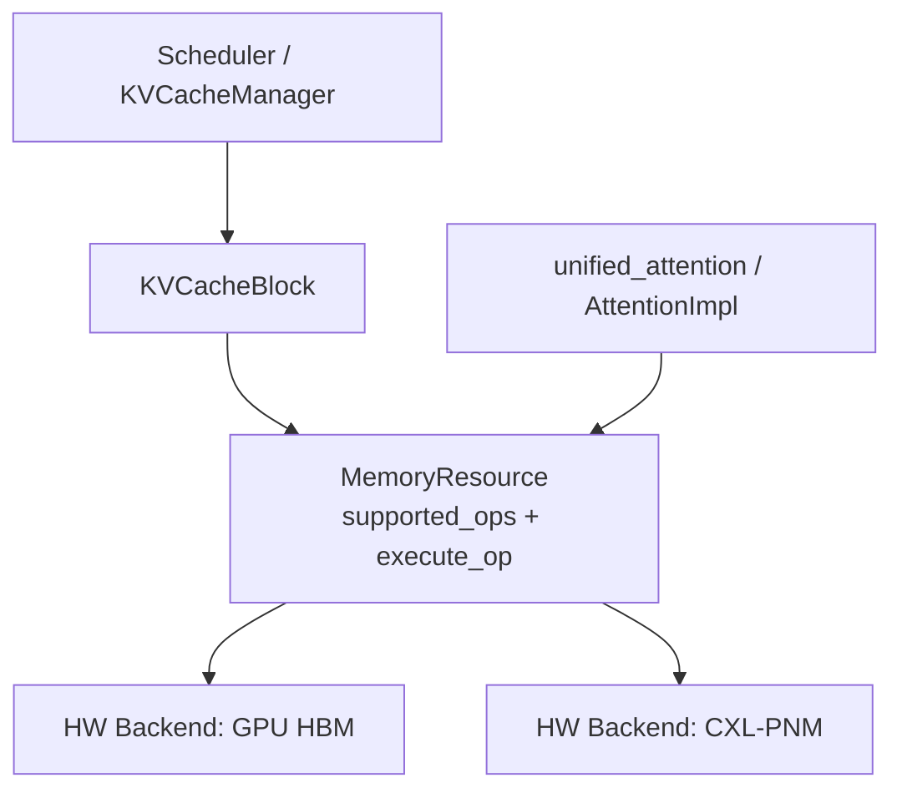
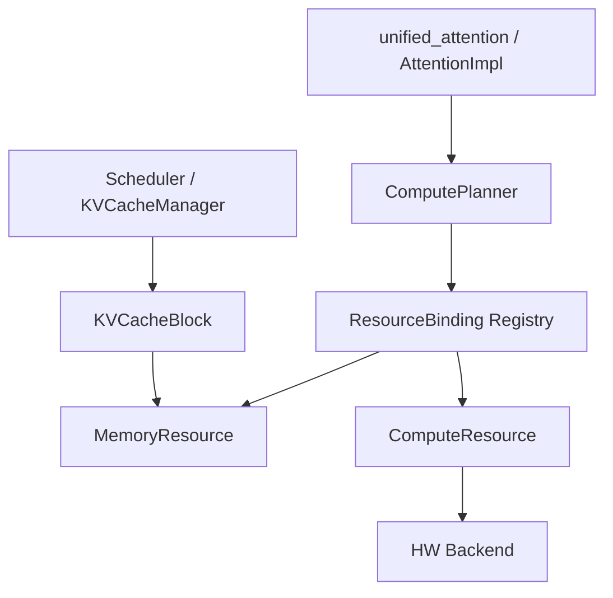
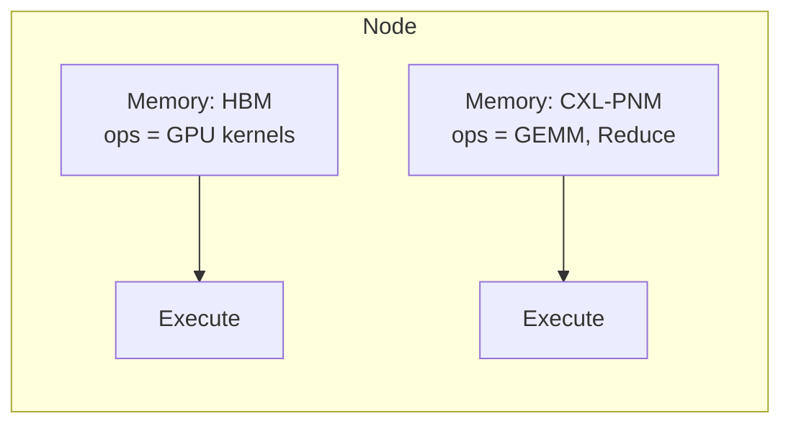
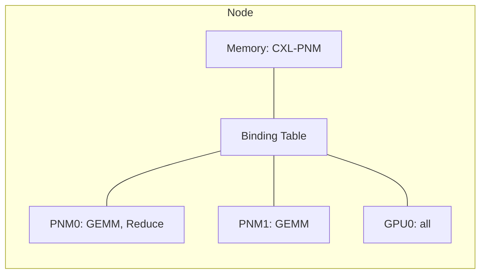
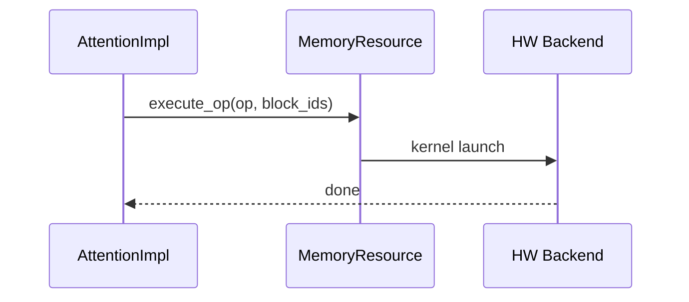
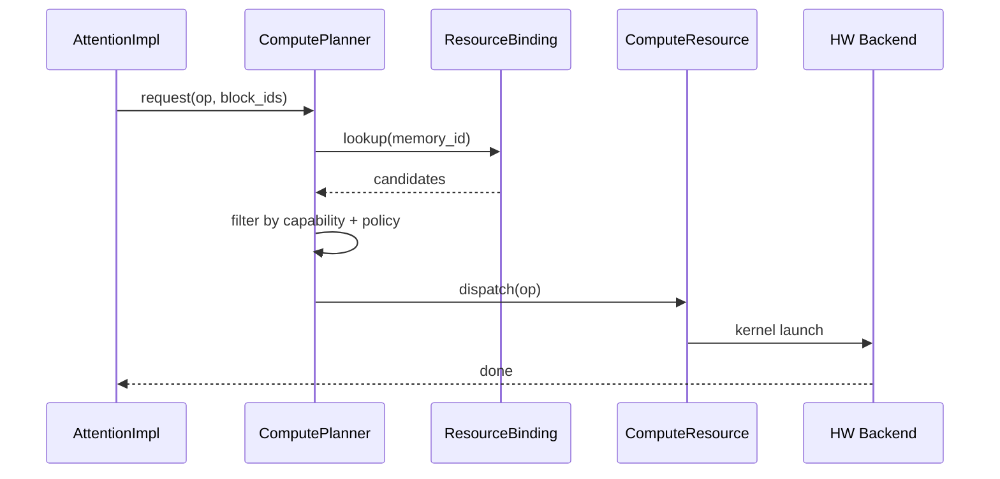
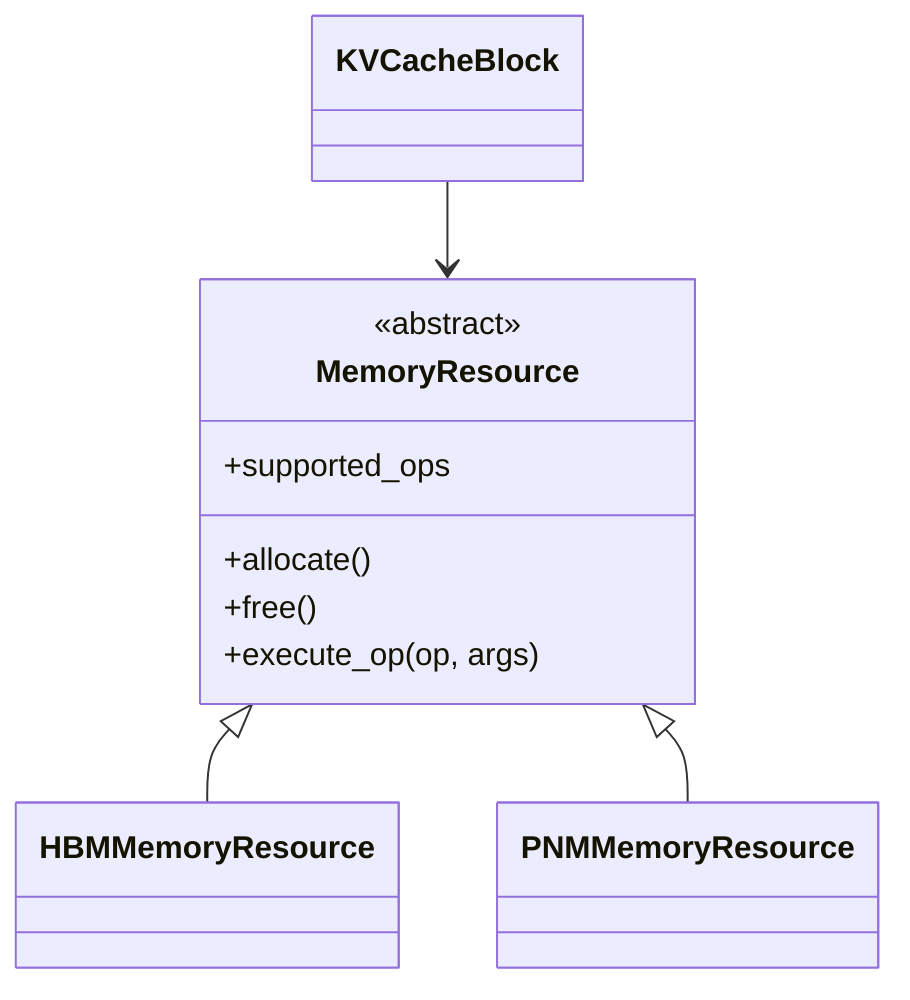
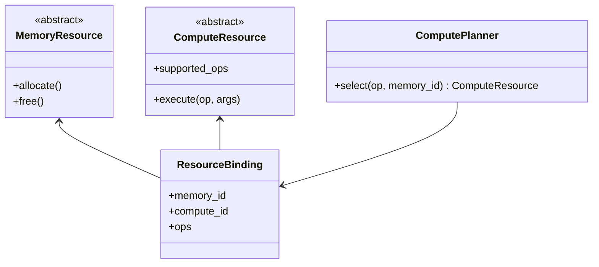

# DP2 — Compute-Capable Memory Abstraction

> **설계 질문: 블록이 놓인 메모리에서 어떤 연산이 가능한가 — 이 capability 사실의 단일 진실 원천(single source of truth)을 누가 소유할 것인가?**
>
> 대상 스택: vLLM v1 KV Cache Memory 레이어(`vllm/v1/core`, `vllm/v1/kv_cache_interface.py`)와 실행 진입점(`unified_attention` / `AttentionImpl`)의 경계.

---

# 1. 배경과 문제 정의

## 1.1 배경 — 현재 vLLM v1은 "데이터를 실행 장치로 가져오는" 구조다

vLLM v1에서 KV cache 블록은 순수한 인덱스다.

```python
# vllm/v1/core/kv_cache_utils.py
@dataclass(slots=True)
class KVCacheBlock:
    block_id: int                       # 0 ~ num_gpu_blocks-1 범위의 인덱스
    ref_cnt: int = 0
    _block_hash: BlockHashWithGroupId | None = None
    prev_free_block: "KVCacheBlock | None" = None
    next_free_block: "KVCacheBlock | None" = None
    is_null: bool = False
```

6개 필드 중 **데이터가 물리적으로 어디에 있는지, 그 자리에서 무엇을 할 수 있는지를 나타내는 필드는 없다.**
할당 명세도 마찬가지다.

```python
# vllm/v1/kv_cache_interface.py
@dataclass
class KVCacheTensor:
    size: int              # 바이트 크기
    shared_by: list[str]   # 이 텐서를 공유하는 layer 이름
```

실행 경로도 이 전제 위에 서 있다. `unified_attention(layer_name)`은 forward context에서 layer와 kv_cache 텐서를 꺼내 곧바로 backend 구현으로 넘긴다.

```python
# vllm/model_executor/layers/attention/attention.py (요약)
attn_metadata, self, kv_cache, _ = get_attention_context(layer_name)
self.impl.forward(self, query, key, value, kv_cache, attn_metadata, output=output)
```

즉 현재 구조의 전제는 **"블록은 단일 디바이스 위 연속 텐서의 인덱스이고, 데이터가 있는 곳과 연산이 일어나는 곳은 항상 같다"** 이다.
`vllm/v1/kv_offload`가 이미 CPU 등 다른 medium을 다루지만, 그것은 이 전제를 깨지 않는다. `LoadStoreSpec` / `OffloadingManager`라는 이름이 말하듯 **데이터를 실행 장치로 되가져오는 이동(load/store) 모델**이기 때문이다.

## 1.2 변화 — 메모리가 스스로 연산하는 디바이스가 들어온다

그래서 지금까지는 "위치"만 알면 충분했다. 그런데 CXL-PNM / PIM 계열 디바이스는 전제를 바꾼다.
이 디바이스의 이득은 **데이터를 옮기지 않고 memory-side에서 GEMM/GEMV/Reduce를 수행**하는 데서 나온다. 데이터를 GPU로 가져오는 순간 도입 이유가 사라진다.

따라서 런타임은 이제 위치만이 아니라 **"이 블록이 놓인 자리에서 어떤 연산이 가능한가"** 를 알아야 한다.

## 1.3 관련 QA

이 DP의 결정 변수에 의해 실제로 갈리는 QA만 4개 선정한다. (두 후보에서 같은 값이 나올 QA는 축으로 쓰지 않는다.)

| QA | 정의 (질문형) | 정량 프록시 |
|---|---|---|
| **QA1. Dispatch-path Efficiency** | 연산 1건이 실행에 도달하기까지의 control overhead가 얼마나 작은가? | dispatch까지의 메시지 수, 전역 상태 조회 횟수, decode step당 누적 오버헤드(us) |
| **QA2. Execution Predictability** | 동일 입력이 항상 동일한 위치·동일한 경로로 실행되는가? | 실행 경로의 데이터 의존 분기 수, 필요한 CUDA graph 캡처 조합 수 |
| **QA3. Memory–Compute Composability** | 메모리와 실행 리소스의 관계를 얼마나 다양하게 표현하고 선택할 수 있는가? | 표현 가능한 관계 카디널리티 종수, 한 블록에 대해 선택 가능한 실행 리소스 후보 수 |
| **QA4. Extensibility** | 신규 메모리/실행 리소스·신규 조합 추가 시 기존 추상화 변경이 얼마나 적은가? | 신규 1종 추가 시 수정해야 하는 기존 클래스/인터페이스 수, 신규 조합 추가 시 코드 변경 라인 수 |

## 1.4 문제

### 발생 위치

문제는 **KV Cache Memory 레이어(`vllm/v1/core`의 `KVCacheBlock`/`BlockPool`, `vllm/v1/kv_cache_interface.py`의 `KVCacheTensor`)와 바로 위 실행 진입점(`unified_attention` → `AttentionImpl.forward`)의 경계**에서 발생한다.
이 경계는 "어떤 블록을, 어떤 커널로 처리할 것인가"를 확정하는 자리인데, 아래 레이어가 위치만 표현하고 capability를 표현하지 않으므로 **위 레이어가 그 사실을 스스로 추측해야 한다.**

> 문제: memory-side 연산 능력을 표현할 자리가 추상화에 없기 때문에, "어디서 실행할 수 있는가"라는 사실이 추상화가 아니라 **호출 지점의 조건 분기로 흩어진다.**

### QA 영향

- **QA1**: capability를 표현할 자리가 없으므로 실행 진입점마다 `isinstance` / platform 조건 분기를 넣어야 한다. 현재 진입점은 이미 backend 25종(`AttentionBackendEnum`) × platform 8종(`vllm/platforms/*.py`)의 분기 축을 갖는다. 여기에 memory-kind 축이 곱해지면 분기 조합이 **2축 → 3축**으로 늘고, 조합마다 dispatch 판정 비용이 붙는다.
- **QA2**: 실행 위치 판정이 커널 호출 직전 조건 분기로 들어가면 그 경로는 데이터 의존 분기를 갖게 된다. vLLM은 decode 경로를 CUDA graph로 캡처하며 기본 캡처 크기만 `[1,2,4] + range(8,256,8) + range(256,512+1,16)` = **51개**다. 캡처 경로에 데이터 의존 분기가 생기면 조합마다 그래프가 필요해져 캡처 수가 배수로 증가한다.
- **QA3**: 현재 표현 가능한 관계는 `KVCacheTensor(size, shared_by)`가 말하는 **(layer group → 단일 텐서) 1종뿐**이다. 하나의 메모리 영역을 GPU와 PNM이 함께 소비하는 관계는 표현 자체가 불가능하다. 한 블록에 대해 선택 가능한 실행 리소스 후보는 구조적으로 **항상 1개**다.
- **QA4**: 신규 메모리 종류를 추가할 때 어디를 확장해야 하는지가 정해져 있지 않다. 후보 확장 지점인 `KVCacheSpec` 계층은 서브클래스가 **11개**이고, `Platform` 인터페이스는 메서드 **82개 × 구현 6개**다. 확장 지점이 미정이면 신규 1종 추가 비용의 상한이 정해지지 않는다.

### 제약 / 가정 / 범위 밖

- **제약**
  - `unified_attention(layer_name)` 진입점 시그니처와 forward_context 기반 조회 방식은 유지한다.
  - CUDA graph 캡처 경로에 새로운 데이터 의존 분기를 추가할 수 없다.
  - 기존 GPU-only 경로의 dispatch 오버헤드는 증가시키지 않는다(회귀 금지).
- **가정**
  - 초기 대상 op는 소수(GEMM / GEMV / Reduce 급).
  - 노드당 memory-side 디바이스는 1~4개 규모.
- **범위 밖**
  - 어떤 요청의 블록을 PNM 메모리에 배치할 것인가(할당 정책) → 별도 DP.
  - 데이터 이동/오프로딩 경로 → 기존 `vllm/v1/kv_offload`가 담당.

### 문제 한 문장

> **vLLM v1의 블록 추상화는 데이터의 위치만 표현하고 그 자리에서 가능한 연산을 표현하지 않기 때문에, memory-side compute 하드웨어를 도입하면 "어디서 실행할 수 있는가"가 추상화가 아니라 호출 지점의 조건 분기로 흩어진다.**

---

# 2. 설계 쟁점

위 문제의 뿌리는 capability라는 **사실을 담을 자리가 없다**는 것이다. 자리를 만들려면 먼저 **그 사실을 누가 소유하는지**를 정해야 한다. 소유자가 정해지면 실행 진입점은 추측 대신 조회를 하면 되고, 조건 분기가 흩어지는 문제가 사라진다.

> **설계 결정 변수: capability 사실의 단일 진실 원천을 어디에 둘 것인가?**
>
> - 값 A: **메모리 리소스 타입 자신** — capability는 메모리 종류의 정적 속성이다.
> - 값 B: **메모리 외부의 관계 레지스트리** — capability는 (메모리, 실행 리소스) 쌍의 런타임 관계다.

단일 진실 원천은 정의상 하나뿐이므로 이 변수는 배타적이며, 두 값은 동시에 성립할 수 없다(3.3 참조).

---

# 3. 후보 구조

## 3.1 Candidate 1 — Capability-in-Memory

`MemoryResource`가 `supported_ops`와 `execute_op()`을 함께 소유한다. capability는 **메모리 리소스 타입의 정적 속성**이며, 블록 핸들을 쥔 쪽은 그 핸들만으로 실행 가능 여부를 알고 곧바로 실행에 진입한다. 별도의 관계 레지스트리도, 실행 리소스 선택 단계도 존재하지 않는다.

```text
Block
  ↓
Memory  (연산 능력 내장)
  ↓
Execute
```

**한 문장 특징**

> **실행 경로에서 전역 상태 조회를 제거해 짧고 재현 가능한 dispatch를 확보하는 대신, 하나의 메모리를 여러 실행 리소스가 나눠 쓰는 관계를 표현할 능력을 포기하는 구조.**

## 3.2 Candidate 2 — Capability-in-Binding

`MemoryResource`와 `ComputeResource`를 분리하고, 둘의 관계와 지원 op를 `ResourceBinding` 레지스트리가 보유한다. 실행 시점에 `ComputePlanner`가 바인딩을 조회해 후보를 추리고 그중 하나를 선택한다. capability는 **런타임 데이터**다.

```text
Block
  ↓
Memory
  ↓
Binding Table  ──►  Compute A / Compute B
  ↓
Planner  (선택)
  ↓
Execute
```

**한 문장 특징**

> **메모리와 실행 리소스의 관계를 런타임 데이터로 승격시켜 조합·선택·확장을 확보하는 대신, 실행 경로가 외부 상태 조회에 의존하게 되어 짧은 경로와 재현성을 포기하는 구조.**

> 두 대표 구조도는 같은 시작 요소(Block), 같은 진행 방향(위→아래), 같은 추상화 수준으로 그렸다. 도형 수 차이(3 vs 6)는 표현의 상세도 차이가 아니라 **구조 자체의 단계 수 차이**다.

## 3.3 양립 불가 논증

### 합성 테스트 — 두 구조를 동시에 두면?

capability는 **단일 진실 원천**이어야 한다. `MemoryResource.supported_ops`와 바인딩 레지스트리를 둘 다 두면, 두 값이 어긋났을 때 어느 쪽이 참인지 정의되지 않는다. 정합성을 지키려면 실행 직전에 두 곳을 모두 읽어 교차 검증해야 하고, 그 순간 **C1의 유일한 이점인 "실행 경로 조회 0회"가 소멸한다.** 즉 합쳐진 구조는 C2보다 느리고 C1보다 복잡한, 두 후보 모두에 열등한 구조다.

### 상위호환 테스트 — 한쪽이 다른 쪽의 특수 케이스인가?

- **C2 → C1 흉내 불가**: 바인딩을 1:1로 고정해도 실행자는 여전히 레지스트리를 조회해야 한다. 레지스트리가 진실 원천인 이상, "메모리 핸들만으로 실행 가능"이라는 C1의 성질(실행 경로에 전역 상태 의존 없음)은 복원되지 않는다. 조회 결과를 캐시하면 반복 조회는 줄지만 **무효화 책임이 생기므로** 전역 상태 의존 자체는 남는다.
- **C1 → C2 흉내 불가**: C1에서 capability는 타입 속성이므로 같은 타입의 두 인스턴스가 서로 다른 capability를 가질 수 없고, 시점에 따라 달라질 수도 없다. 런타임 선택은 원리적으로 표현되지 않는다.

양방향 모두 포함 관계가 성립하지 않으므로 두 후보는 대등한 대안이다.

---

# 4. 백데이터 다이어그램

## 4.1 모듈 뷰

### Candidate 1



의존이 한 방향으로만 흐르고, capability를 아는 모듈은 `MemoryResource` 하나다.
실행 진입점은 메모리 추상화만 알면 되므로 새로운 모듈이 추가되지 않는다(신규 모듈 0개).
대신 HW backend별 실행 구현이 모두 `MemoryResource` 하위에 모이므로, 이 모듈이 memory 관리와 compute 실행 두 책임을 함께 진다.
→ **QA4(Extensibility)** 근거: 영향 모듈 수는 작지만 한 모듈의 책임 범위가 커진다.

### Candidate 2



`ResourceBinding`과 `ComputePlanner` 두 모듈이 새로 생기고, 실행 진입점의 의존 대상이 메모리에서 planner로 바뀐다.
메모리 모듈은 compute를 전혀 모르므로 책임이 분리되지만, 관계 정보를 유지·검증하는 모듈이 늘어난다(신규 모듈 2개).
`vllm/v1/kv_offload/factory.py`의 `OffloadingSpecFactory`가 이미 같은 형태의 레지스트리 확장 지점을 쓰고 있어 선례가 있다.
→ **QA4(Extensibility)** 근거: 확장 지점이 명시적이고 기존 모듈 변경 없이 등록만으로 확장된다.

## 4.2 컴포넌트 & 커넥터

### Candidate 1



런타임 인스턴스 관계가 **메모리 1개 : 실행 경로 1개**로 고정된다. 관계를 나타내는 별도 상태가 없으므로 유지 메타데이터는 **0 엔트리**다.
한 블록에 대해 선택 가능한 실행 리소스 후보는 항상 **1개**이며, 부하가 한 디바이스에 몰려도 재배치할 수단이 구조에 없다.
→ **QA3(Composability)** 근거: 표현 가능한 카디널리티 1종, 후보 수 1.

### Candidate 2



관계가 데이터로 존재하므로 1:1, 1:N, N:M **3종 카디널리티**를 모두 표현한다. 한 블록에 대한 후보는 등록된 바인딩 수 N개다.
대신 유지해야 할 메타데이터가 생긴다: memory 4개 × compute 4개 기준 최대 **16 엔트리**, TP 워커마다 일관된 사본이 필요하다.
→ **QA3(Composability)** 근거 및 QA1의 비용 근거.

## 4.3 시퀀스 — 동일 시나리오: "decode step에서 한 layer의 attention op 1건이 실행에 도달"

### Candidate 1



메시지 **3개**, 전역 상태 조회 **0회**, 데이터 의존 분기 **0개**.
실행 리소스가 타입으로 결정되므로 경로가 컴파일 시점에 확정되고, 그대로 CUDA graph에 캡처된다.
→ **QA1(Dispatch Efficiency)**, **QA2(Predictability)** 근거.

### Candidate 2



메시지 **6개**, 전역 상태 조회 **2회**(binding lookup, capability filter), 데이터 의존 분기 **1개 이상**(정책 판정).
80 layer 모델의 decode step 1회 기준 조회는 80 × 2 = **160회**, 조회당 약 100ns로 잡으면 **약 16us**(추정: dict 조회 기준). step 지연 10ms 대비 약 0.16%다.
배치 단위로 plan을 상각하면 조회는 step당 2회로 줄지만, 그 순간 무효화·재계획 로직이 추가되고 선택 granularity가 거칠어진다.
→ **QA1(Dispatch Efficiency)** 근거.

## 4.4 클래스

### Candidate 1



신규 memory-side 디바이스 1종 추가 = `MemoryResource` 서브클래스 1개 신규. 기존 클래스 수정은 capability 열거 갱신 등 **1~2개**.
신규 op 1종 추가는 그 op를 지원하는 메모리 타입 수만큼 구현이 필요하고, 시그니처가 다르면 **추상 기반 클래스가 확장**된다.
한 메모리를 GPU와 PNM이 함께 쓰는 조합은 표현할 클래스 관계가 없어 **구조 변경 없이는 불가능**하다.
→ **QA4(Extensibility)** 근거.

### Candidate 2



신규 실행 리소스 1종 추가 = `ComputeResource` 구현 1개 + 팩토리 등록 **1줄**(`OffloadingSpecFactory.register_spec` 선례). 기존 클래스 수정 **0개**.
신규 조합(같은 메모리에 GPU를 추가로 붙이기) 추가는 바인딩 엔트리 1개 추가이므로 **코드 변경 0라인**.
대신 클래스가 2개에서 4개로 늘고, 관계 무결성(존재하지 않는 compute_id 참조 등) 검증 책임이 새로 생긴다.
→ **QA4(Extensibility)**, **QA3(Composability)** 근거.

## 4.5 정량 지표 추출표

| 지표 | 출처 | Candidate 1 | Candidate 2 |
|---|---|---|---|
| dispatch까지 메시지 수 | 시퀀스 | 3 | 6 |
| 전역 상태 조회 횟수 (op당) | 시퀀스 | 0 | 2 |
| decode step당 추가 조회 (80 layer) | 시퀀스 | 0회 / 0us | 160회 / 약 16us (추정) |
| 실행 경로의 데이터 의존 분기 | 시퀀스 | 0 | ≥1 |
| CUDA graph 캡처 조합 | 시퀀스 | 기본 51개 | 51 × 선택 가능 리소스 수 |
| 표현 가능한 관계 카디널리티 | 컴포넌트 | 1종 (1:1) | 3종 (1:1, 1:N, N:M) |
| 블록당 선택 가능한 실행 리소스 | 컴포넌트 | 1 | N (등록 바인딩 수) |
| 유지 메타데이터 엔트리 | 컴포넌트 | 0 | 최대 16 (memory 4 × compute 4) |
| 신규 실행 리소스 1종 추가 시 수정 기존 클래스 | 클래스 | 1~2 | 0 (등록 1줄) |
| 신규 조합 1건 추가 시 코드 변경 | 클래스 | 구조 변경 필요 | 0라인 (엔트리 1개) |
| 신규 모듈 수 | 모듈 뷰 | 0 | 2 (Binding, Planner) |

---

# 5. QA 트레이드오프 평가

> ★★★ = 구조적으로 유리 / ★★☆ = 가능하나 비용 발생 / ★☆☆ = 구조적으로 불리

| QA | Candidate 1: Capability-in-Memory | Candidate 2: Capability-in-Binding | 정량 근거 |
|---|:---:|:---:|---|
| **QA1. Dispatch-path Efficiency** | ★★★ | ★★☆ | 메시지 3 vs 6, op당 전역 조회 0회 vs 2회, decode step당 0us vs 약 16us (시퀀스) |
| **QA2. Execution Predictability** | ★★★ | ★★☆ | 데이터 의존 분기 0 vs ≥1, CUDA graph 캡처 51개 vs 51 × 리소스 수 (시퀀스) |
| **QA3. Memory–Compute Composability** | ★☆☆ | ★★★ | 카디널리티 1종 vs 3종, 블록당 후보 1개 vs N개 (컴포넌트) |
| **QA4. Extensibility** | ★★☆ | ★★★ | 신규 리소스 시 기존 클래스 수정 1~2 vs 0, 신규 조합 시 구조 변경 vs 0라인 (클래스) |
| **합계 (★=1/2/3)** | **9** | **10** | 지배 없음, 차이 1 |

각 후보가 ★★★를 2개씩 갖고, 모든 QA에서 별점이 갈린다. 어느 후보도 다른 후보를 전 축에서 앞서지 않는다.

---

# 6. QA별 상세 비교

## QA1. Dispatch-path Efficiency

### Candidate 1 — ★★★

```text
AttentionImpl → MemoryResource.execute_op → kernel
```

- 메시지 3개, 전역 상태 조회 0회.
- 실행 리소스가 타입으로 결정되므로 조회 결과를 캐시할 필요도, 무효화할 필요도 없다.
- 기존 GPU-only 경로의 오버헤드가 0만큼 증가한다(회귀 없음 제약을 자동으로 만족).

### Candidate 2 — ★★☆

```text
AttentionImpl → Planner → Binding lookup → capability filter → ComputeResource → kernel
```

- 메시지 6개, op당 조회 2회. 80 layer decode step 기준 160회 ≈ 16us (추정), step 10ms 대비 0.16%.
- 배치 단위 plan 캐싱으로 step당 2회까지 줄일 수 있으나, 캐시 무효화 조건(바인딩 변경, 디바이스 상태 변화)이 새로 생긴다.
- 절대량은 작지만 **0이 아니고**, GPU-only 경로에도 동일하게 부과된다는 점이 비용의 본질이다.

**Trade-off:**

> **실행 경로에 전역 상태가 없어 얻는 절대적 최소 오버헤드 ↔ 조회 비용을 지불하고 얻는 선택 가능성**

## QA2. Execution Predictability

### Candidate 1 — ★★★

- 데이터 의존 분기 0개. 동일 요청은 항상 동일 리소스에서 실행되므로 지연 분포의 run-to-run 재현성이 유지된다.
- CUDA graph 캡처 대상 경로가 하나로 고정된다: 기본 캡처 크기 51개 그대로.
- 성능 회귀 원인 추적 시 "어디서 실행됐는가"가 변수에서 빠진다.

### Candidate 2 — ★★☆

- planner 정책이 큐 깊이·부하를 입력으로 받으면 같은 요청이 batch마다 다른 리소스에서 실행된다 → p99 지연 편차와 프로파일 해석 난이도가 증가.
- 선택 결과가 캡처 경로에 영향을 주면 조합마다 그래프가 필요하다: 최악의 경우 51 × 리소스 수. 이를 피하려면 선택 시점을 캡처 이전(요청/배치 단위)으로 올려야 하고, 그만큼 선택 granularity가 거칠어져 QA3의 이득이 줄어든다.
- 정책을 정적으로 고정하면 재현성은 회복되지만, 그 순간 C2의 존재 이유가 사라진다.

**Trade-off:**

> **경로 고정으로 얻는 재현성과 캡처 단순성 ↔ 상황 적응으로 얻는 활용도 (같은 축의 양 끝)**

## QA3. Memory–Compute Composability

### Candidate 1 — ★☆☆

```text
Memory[CXL-PNM] → ops = {GEMM}
```

- 표현 가능한 카디널리티 1종(1:1). 블록당 실행 후보 1개.
- 하나의 메모리를 GPU와 PNM이 함께 소비하는 관계는 클래스 관계로 표현할 자리가 없다 → 같은 메모리에 대해 두 개의 `MemoryResource` 뷰를 만드는 우회가 필요하고, 그 순간 단일 진실 원천이 깨진다.
- 즉 이 축의 요구를 만족시키려면 **구조 자체를 바꿔야 한다**(= ★☆☆의 정의).

### Candidate 2 — ★★★

```text
Memory[CXL-PNM] ─ Binding ─┬─ PNM0 {GEMM, Reduce}
                           ├─ PNM1 {GEMM}
                           └─ GPU0 {all}
```

- 카디널리티 3종(1:1 / 1:N / N:M) 전부 표현. 블록당 후보 N개.
- 큐 깊이 기반 분산, locality 우선 선택 등 정책 확장 여지가 구조에 이미 존재한다.
- 비용: memory 4 × compute 4 = 최대 16 엔트리의 메타데이터를 TP 워커 간 일관되게 유지해야 한다.

**Trade-off:**

> **관계를 타입으로 굳혀 얻는 무상태성 ↔ 관계를 데이터로 승격시켜 얻는 표현력**

## QA4. Extensibility

### Candidate 1 — ★★☆

- 신규 memory-side 디바이스 1종: 서브클래스 1개 추가 + 기존 클래스 1~2개 수정. 여기까지는 저렴하다.
- 그러나 신규 **조합**(같은 메모리 + 다른 실행 리소스)은 코드가 아니라 구조를 바꿔야 한다.
- op 종류가 늘수록 `MemoryResource` 추상 인터페이스가 확장되며, 메모리 관리 책임과 실행 책임이 한 클래스에 누적된다.

### Candidate 2 — ★★★

- 신규 실행 리소스 1종: `ComputeResource` 구현 1개 + 등록 1줄, 기존 클래스 수정 0개. vLLM에 이미 같은 형태의 확장 지점이 있다(`OffloadingSpecFactory.register_spec`, `AttentionBackendEnum`의 `register_backend`).
- 신규 조합: 바인딩 엔트리 1개 추가 = 코드 변경 0라인.
- 비용: 클래스 2개 → 4개, 그리고 바인딩 무결성 검증이라는 새 책임.

**Trade-off:**

> **책임이 한 곳에 모여 얻는 구현 단순성 ↔ 확장 지점이 분리되어 얻는 무변경 확장성**

---

# 7. 장점 / 단점

## Candidate 1 — Capability-in-Memory

**장점**
1. (QA1) op당 전역 조회 0회, 메시지 3개 — 실행 경로 최소.
2. (QA2) 데이터 의존 분기 0개, CUDA graph 캡처 51개 유지.
3. (QA1) GPU-only 경로에 오버헤드 0 부과 — 회귀 없음 제약 자동 충족.
4. 신규 모듈 0개 — 도입 범위가 좁아 단기 검증이 빠르다.

**단점**
1. (QA3) 카디널리티 1종만 표현, 블록당 후보 1개.
2. (QA3) 부하 편중 시 재배치 수단이 구조에 없다.
3. (QA4) 신규 조합은 코드가 아닌 구조 변경을 요구.
4. (QA4) op 증가에 따라 메모리 추상화가 실행 책임까지 흡수.

## Candidate 2 — Capability-in-Binding

**장점**
1. (QA3) 카디널리티 3종 표현, 블록당 후보 N개.
2. (QA3) 큐 깊이·locality 기반 선택 정책으로 확장 가능.
3. (QA4) 신규 리소스 등록 1줄, 기존 클래스 수정 0개.
4. (QA4) 신규 조합 추가 시 코드 변경 0라인.

**단점**
1. (QA1) 메시지 6개, op당 조회 2회 — step당 약 16us 추가(추정).
2. (QA2) 선택이 달라지면 캡처 조합이 51 × 리소스 수까지 증가.
3. (QA3) 최대 16 엔트리 메타데이터를 워커 간 일관 유지해야 함.
4. 신규 모듈 2개(Binding, Planner) — 1:1 고정 HW에서는 과설계.

---

# 8. 핵심 트레이드오프

```text
Candidate 1                              Candidate 2
Capability-in-Memory                     Capability-in-Binding
      │                                        │
capability = 타입의 정적 속성          capability = 런타임 관계 데이터
      │                                        │
조회 0회 / 분기 0개                     조회 2회 / 분기 ≥1개
      │                                        │
후보 1개 / 카디널리티 1종               후보 N개 / 카디널리티 3종
      │                                        │
조합 추가 = 구조 변경                   조합 추가 = 엔트리 1개
```

> **실행 경로의 최소 오버헤드와 재현성 ↔ 메모리–실행 조합의 표현력과 무변경 확장성**

---

# 9. 선택 조건

**Candidate 1을 선택할 근거**
- 메모리와 실행 리소스가 HW 수준에서 1:1로 고정되어 있다(PNM 유닛이 해당 메모리 전용).
- 지원 op가 소수이고 안정적이라 인터페이스 확장 압력이 낮다.
- op 1건의 실행 시간이 짧아 control overhead 비중이 유의미하다.
- decode 경로의 CUDA graph 캡처 구성을 그대로 유지해야 한다.

**Candidate 2를 선택할 근거**
- 하나의 메모리 영역을 PNM과 GPU가 함께 소비하는 시나리오가 로드맵에 있다.
- PNM/PIM/GPU/NPU 등 이종 실행 백엔드가 한 노드에 공존한다.
- 런타임이 부하·locality를 보고 실행 위치를 바꿔야 한다.
- 신규 디바이스 추가가 잦아, 기존 코드 무변경 확장이 조직적으로 중요하다.

**판단이 갈리는 지점**: QA2를 얼마나 강하게 요구하느냐다. decode 경로의 CUDA graph 캡처 구성을 건드릴 수 없다는 제약이 절대적이면 C2는 선택 시점을 배치 경계로 올려야 하고, 그만큼 QA3의 이득이 축소되어 실질 격차가 좁아진다.

---

# 10. PPT 페이지

| | **Candidate 1: Capability-in-Memory** | **Candidate 2: Capability-in-Binding** |
|---|---|---|
| **후보 구조 이름** | Capability-in-Memory — 메모리가 연산 능력을 소유해 최소 실행 경로를 확보하는 대신 조합 표현력을 포기 | Capability-in-Binding — 관계를 런타임 데이터로 승격해 조합·확장을 확보하는 대신 조회 비용과 재현성을 포기 |
| **대표 구조도** | `Block → Memory(연산 내장) → Execute` | `Block → Memory → Binding → Planner → Execute` |
| **장점** | • (Efficiency) 메시지 3개, 조회 0회<br>• (Predictability) 분기 0개, 캡처 51개 유지<br>• GPU 경로 오버헤드 0<br>• 신규 모듈 0개 | • (Composability) 카디널리티 3종, 후보 N개<br>• 부하·locality 기반 선택 가능<br>• (Extensibility) 등록 1줄, 기존 수정 0개<br>• 신규 조합 코드 변경 0라인 |
| **단점** | • (Composability) 카디널리티 1종, 후보 1개<br>• 부하 편중 시 재배치 불가<br>• 신규 조합은 구조 변경 필요<br>• op 증가 시 메모리 추상화 비대화 | • (Efficiency) 메시지 6개, step당 약 16us<br>• 캡처 조합 51 × 리소스 수<br>• 메타데이터 최대 16엔트리 일관성 유지<br>• 1:1 고정 HW에서는 과설계 |
| **TRADEOFF 관계** | colspan → **실행 경로의 최소 오버헤드와 재현성 ↔ 메모리–실행 조합의 표현력과 무변경 확장성** | |

---

## 부록 A. 게이트 체크 결과

| 게이트 | 결과 | 확인 내용 |
|---|---|---|
| A. 문제 정의 | 통과 | QA 4개 + 프록시 선정, 배경→변화→문제 연결, 레이어 지목(Memory ↔ 실행 진입점 경계), QA 영향 전부 수치화 |
| B. 설계 쟁점 | 통과 | 결정 변수 1개(단일 진실 원천의 소유자), 쟁점 문장에 후보명 없음 |
| C. 후보 구조 | 통과 | 같은 변수의 두 값, 합성 테스트·상위호환 테스트 양방향 논증 |
| D. 다이어그램 | 통과 | 대표 구조도 3/6 도형(≤7), 동일 시각 문법, 백데이터 4종 × 2후보 + 설명 |
| E. 트레이드오프 | 통과 | 축 = Phase 0 QA와 동일, 전 셀 수치 근거, 지배 없음, 합계 9 vs 10 (차이 1), 각 후보 ★★★ 2개, 동점 축 없음 |
| F. PPT | 통과 | 1페이지 5행 × 2열, 축약 구조도(도형 3/5), TRADEOFF 대구 1문장 |

> 수치 중 "약 16us"는 dict 조회 100ns × 160회 기준 **추정치**이며, 실측 시 갱신 대상이다. 나머지 수치는 코드베이스에서 직접 센 값이다(`KVCacheBlock` 필드 6, `KVCacheSpec` 서브클래스 11, `Platform` 메서드 82 × 구현 6, `AttentionBackendEnum` 25, 기본 CUDA graph 캡처 크기 51).
